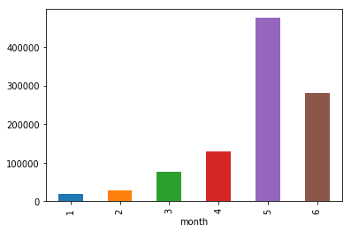
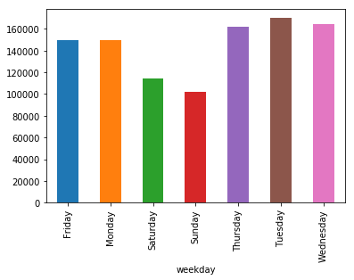
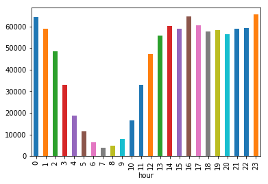
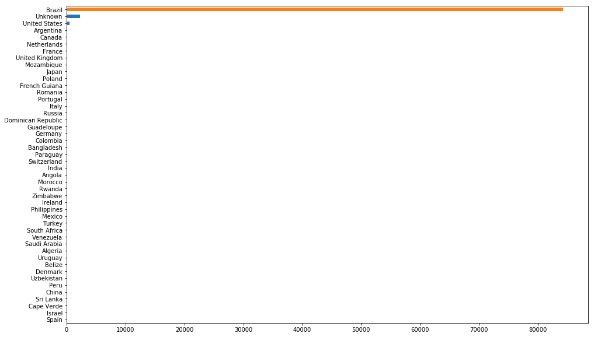
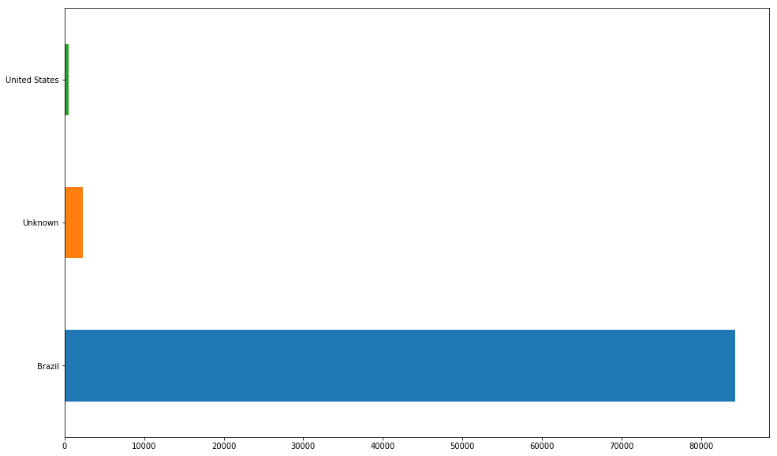
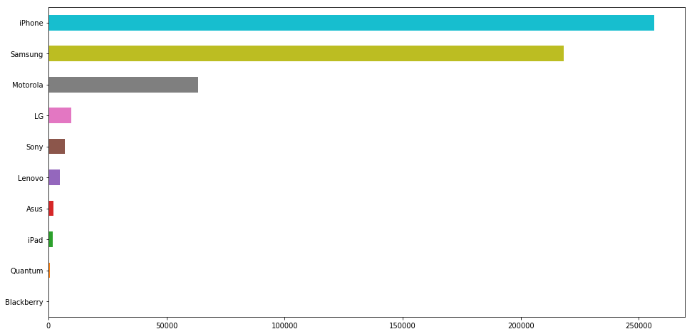
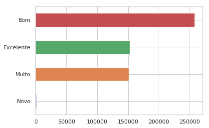
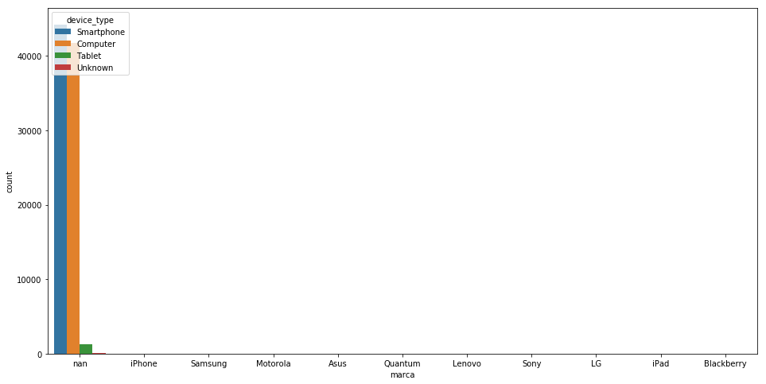

```python
import pandas as pd
import numpy as np
import seaborn as sns
```


```python
# sku: Identificador de producto relacionado al evento.
# Por esa razon lo consideramos object
df = pd.read_csv('data/events.csv', dtype={'sku':object})
```


```python
# veamos el shape que tiene el dataset
df.shape
```


    (1011288, 23)


```python
df.head()
```


<div>
<style scoped>
    .dataframe tbody tr th:only-of-type {
        vertical-align: middle;
    }

    .dataframe tbody tr th {
        vertical-align: top;
    }

    .dataframe thead th {
        text-align: right;
    }
</style>
<table border="1" class="dataframe">
  <thead>
    <tr style="text-align: right;">
      <th></th>
      <th>timestamp</th>
      <th>event</th>
      <th>person</th>
      <th>url</th>
      <th>sku</th>
      <th>model</th>
      <th>condition</th>
      <th>storage</th>
      <th>color</th>
      <th>skus</th>
      <th>...</th>
      <th>search_engine</th>
      <th>channel</th>
      <th>new_vs_returning</th>
      <th>city</th>
      <th>region</th>
      <th>country</th>
      <th>device_type</th>
      <th>screen_resolution</th>
      <th>operating_system_version</th>
      <th>browser_version</th>
    </tr>
  </thead>
  <tbody>
    <tr>
      <th>0</th>
      <td>2018-05-31 23:38:05</td>
      <td>ad campaign hit</td>
      <td>0004b0a2</td>
      <td>/comprar/iphone/iphone-5s</td>
      <td>NaN</td>
      <td>NaN</td>
      <td>NaN</td>
      <td>NaN</td>
      <td>NaN</td>
      <td>NaN</td>
      <td>...</td>
      <td>NaN</td>
      <td>NaN</td>
      <td>NaN</td>
      <td>NaN</td>
      <td>NaN</td>
      <td>NaN</td>
      <td>NaN</td>
      <td>NaN</td>
      <td>NaN</td>
      <td>NaN</td>
    </tr>
    <tr>
      <th>1</th>
      <td>2018-05-31 23:38:05</td>
      <td>visited site</td>
      <td>0004b0a2</td>
      <td>NaN</td>
      <td>NaN</td>
      <td>NaN</td>
      <td>NaN</td>
      <td>NaN</td>
      <td>NaN</td>
      <td>NaN</td>
      <td>...</td>
      <td>NaN</td>
      <td>Paid</td>
      <td>New</td>
      <td>Camaragibe</td>
      <td>Pernambuco</td>
      <td>Brazil</td>
      <td>Smartphone</td>
      <td>360x640</td>
      <td>Android 6</td>
      <td>Chrome Mobile 39</td>
    </tr>
    <tr>
      <th>2</th>
      <td>2018-05-31 23:38:09</td>
      <td>viewed product</td>
      <td>0004b0a2</td>
      <td>NaN</td>
      <td>2694.0</td>
      <td>iPhone 5s</td>
      <td>Bom</td>
      <td>32GB</td>
      <td>Cinza espacial</td>
      <td>NaN</td>
      <td>...</td>
      <td>NaN</td>
      <td>NaN</td>
      <td>NaN</td>
      <td>NaN</td>
      <td>NaN</td>
      <td>NaN</td>
      <td>NaN</td>
      <td>NaN</td>
      <td>NaN</td>
      <td>NaN</td>
    </tr>
    <tr>
      <th>3</th>
      <td>2018-05-31 23:38:40</td>
      <td>checkout</td>
      <td>0004b0a2</td>
      <td>NaN</td>
      <td>2694.0</td>
      <td>iPhone 5s</td>
      <td>Bom</td>
      <td>32GB</td>
      <td>Cinza espacial</td>
      <td>NaN</td>
      <td>...</td>
      <td>NaN</td>
      <td>NaN</td>
      <td>NaN</td>
      <td>NaN</td>
      <td>NaN</td>
      <td>NaN</td>
      <td>NaN</td>
      <td>NaN</td>
      <td>NaN</td>
      <td>NaN</td>
    </tr>
    <tr>
      <th>4</th>
      <td>2018-05-29 13:29:25</td>
      <td>viewed product</td>
      <td>0006a21a</td>
      <td>NaN</td>
      <td>15338.0</td>
      <td>Samsung Galaxy S8</td>
      <td>Bom</td>
      <td>64GB</td>
      <td>Dourado</td>
      <td>NaN</td>
      <td>...</td>
      <td>NaN</td>
      <td>NaN</td>
      <td>NaN</td>
      <td>NaN</td>
      <td>NaN</td>
      <td>NaN</td>
      <td>NaN</td>
      <td>NaN</td>
      <td>NaN</td>
      <td>NaN</td>
    </tr>
  </tbody>
</table>
<p>5 rows × 23 columns</p>
</div>


```python
df.describe()
```


<div>
<style scoped>
    .dataframe tbody tr th:only-of-type {
        vertical-align: middle;
    }

    .dataframe tbody tr th {
        vertical-align: top;
    }

    .dataframe thead th {
        text-align: right;
    }
</style>
<table border="1" class="dataframe">
  <thead>
    <tr style="text-align: right;">
      <th></th>
      <th>timestamp</th>
      <th>event</th>
      <th>person</th>
      <th>url</th>
      <th>sku</th>
      <th>model</th>
      <th>condition</th>
      <th>storage</th>
      <th>color</th>
      <th>skus</th>
      <th>...</th>
      <th>search_engine</th>
      <th>channel</th>
      <th>new_vs_returning</th>
      <th>city</th>
      <th>region</th>
      <th>country</th>
      <th>device_type</th>
      <th>screen_resolution</th>
      <th>operating_system_version</th>
      <th>browser_version</th>
    </tr>
  </thead>
  <tbody>
    <tr>
      <th>count</th>
      <td>1011288</td>
      <td>1011288</td>
      <td>1011288</td>
      <td>82756</td>
      <td>563838</td>
      <td>564284</td>
      <td>563836</td>
      <td>563836</td>
      <td>563836</td>
      <td>221699</td>
      <td>...</td>
      <td>50957</td>
      <td>87378</td>
      <td>87378</td>
      <td>87378</td>
      <td>87378</td>
      <td>87378</td>
      <td>87378</td>
      <td>87378</td>
      <td>87378</td>
      <td>87378</td>
    </tr>
    <tr>
      <th>unique</th>
      <td>793805</td>
      <td>11</td>
      <td>27624</td>
      <td>227</td>
      <td>3574</td>
      <td>202</td>
      <td>5</td>
      <td>8</td>
      <td>63</td>
      <td>35310</td>
      <td>...</td>
      <td>4</td>
      <td>7</td>
      <td>2</td>
      <td>1939</td>
      <td>93</td>
      <td>46</td>
      <td>4</td>
      <td>282</td>
      <td>121</td>
      <td>343</td>
    </tr>
    <tr>
      <th>top</th>
      <td>2018-05-15 15:56:06</td>
      <td>viewed product</td>
      <td>71492f2b</td>
      <td>/</td>
      <td>2830.0</td>
      <td>iPhone 6</td>
      <td>Bom</td>
      <td>16GB</td>
      <td>Preto</td>
      <td>2820,6706,6720,2750,6649,7251,6663,12604,7224,...</td>
      <td>...</td>
      <td>Google</td>
      <td>Paid</td>
      <td>Returning</td>
      <td>Unknown</td>
      <td>Sao Paulo</td>
      <td>Brazil</td>
      <td>Smartphone</td>
      <td>360x640</td>
      <td>Windows 7</td>
      <td>Chrome 66.0</td>
    </tr>
    <tr>
      <th>freq</th>
      <td>11</td>
      <td>528931</td>
      <td>2771</td>
      <td>28323</td>
      <td>4282</td>
      <td>50916</td>
      <td>243014</td>
      <td>190833</td>
      <td>132960</td>
      <td>594</td>
      <td>...</td>
      <td>50240</td>
      <td>44193</td>
      <td>60480</td>
      <td>15819</td>
      <td>24996</td>
      <td>84308</td>
      <td>44239</td>
      <td>30009</td>
      <td>19675</td>
      <td>22611</td>
    </tr>
  </tbody>
</table>
<p>4 rows × 23 columns</p>
</div>


```python
# veamos los tipos de las variables
df.dtypes
```


    timestamp                   object
    event                       object
    person                      object
    url                         object
    sku                         object
    model                       object
    condition                   object
    storage                     object
    color                       object
    skus                        object
    search_term                 object
    staticpage                  object
    campaign_source             object
    search_engine               object
    channel                     object
    new_vs_returning            object
    city                        object
    region                      object
    country                     object
    device_type                 object
    screen_resolution           object
    operating_system_version    object
    browser_version             object
    dtype: object


Evidentemente son todos strings.

# Data cleaning

***
## Fechas

Empecemos por convertir los timestamps en algo legible


```python
df['timestamp'] = pd.to_datetime(df['timestamp'])
```


```python
# separemos las cosas para que quede algo manejable; no tiene sentido tener el timestamp todo junto
df['year'] = df['timestamp'].dt.year
df['month'] = df['timestamp'].dt.month
df['day'] = df['timestamp'].dt.day
df['weekday'] = df['timestamp'].dt.day_name()
df['hour'] = df['timestamp'].dt.hour
```


```python
df['year_month_day'] = df['timestamp'].map(lambda x: str(x.year)+"/"+str(x.month)+"/"+str(x.day))
```


```python
df['year_month_day'] = pd.to_datetime(df['year_month_day'])
```


```python
df.head()
```


<div>
<style scoped>
    .dataframe tbody tr th:only-of-type {
        vertical-align: middle;
    }

    .dataframe tbody tr th {
        vertical-align: top;
    }

    .dataframe thead th {
        text-align: right;
    }
</style>
<table border="1" class="dataframe">
  <thead>
    <tr style="text-align: right;">
      <th></th>
      <th>timestamp</th>
      <th>event</th>
      <th>person</th>
      <th>url</th>
      <th>sku</th>
      <th>model</th>
      <th>condition</th>
      <th>storage</th>
      <th>color</th>
      <th>skus</th>
      <th>...</th>
      <th>screen_resolution</th>
      <th>operating_system_version</th>
      <th>browser_version</th>
      <th>year</th>
      <th>month</th>
      <th>day</th>
      <th>weekday</th>
      <th>hour</th>
      <th>year_month_day</th>
      <th>counts</th>
    </tr>
  </thead>
  <tbody>
    <tr>
      <th>0</th>
      <td>2018-05-31 23:38:05</td>
      <td>ad campaign hit</td>
      <td>0004b0a2</td>
      <td>/comprar/iphone/iphone-5s</td>
      <td>NaN</td>
      <td>NaN</td>
      <td>NaN</td>
      <td>NaN</td>
      <td>NaN</td>
      <td>NaN</td>
      <td>...</td>
      <td>NaN</td>
      <td>NaN</td>
      <td>NaN</td>
      <td>2018</td>
      <td>5</td>
      <td>31</td>
      <td>Thursday</td>
      <td>23</td>
      <td>2018/5/31</td>
      <td>20862</td>
    </tr>
    <tr>
      <th>1</th>
      <td>2018-05-31 23:38:05</td>
      <td>visited site</td>
      <td>0004b0a2</td>
      <td>NaN</td>
      <td>NaN</td>
      <td>NaN</td>
      <td>NaN</td>
      <td>NaN</td>
      <td>NaN</td>
      <td>NaN</td>
      <td>...</td>
      <td>360x640</td>
      <td>Android 6</td>
      <td>Chrome Mobile 39</td>
      <td>2018</td>
      <td>5</td>
      <td>31</td>
      <td>Thursday</td>
      <td>23</td>
      <td>2018/5/31</td>
      <td>20862</td>
    </tr>
    <tr>
      <th>2</th>
      <td>2018-05-31 23:38:09</td>
      <td>viewed product</td>
      <td>0004b0a2</td>
      <td>NaN</td>
      <td>2694.0</td>
      <td>iPhone 5s</td>
      <td>Bom</td>
      <td>32GB</td>
      <td>Cinza espacial</td>
      <td>NaN</td>
      <td>...</td>
      <td>NaN</td>
      <td>NaN</td>
      <td>NaN</td>
      <td>2018</td>
      <td>5</td>
      <td>31</td>
      <td>Thursday</td>
      <td>23</td>
      <td>2018/5/31</td>
      <td>20862</td>
    </tr>
    <tr>
      <th>3</th>
      <td>2018-05-31 23:38:40</td>
      <td>checkout</td>
      <td>0004b0a2</td>
      <td>NaN</td>
      <td>2694.0</td>
      <td>iPhone 5s</td>
      <td>Bom</td>
      <td>32GB</td>
      <td>Cinza espacial</td>
      <td>NaN</td>
      <td>...</td>
      <td>NaN</td>
      <td>NaN</td>
      <td>NaN</td>
      <td>2018</td>
      <td>5</td>
      <td>31</td>
      <td>Thursday</td>
      <td>23</td>
      <td>2018/5/31</td>
      <td>20862</td>
    </tr>
    <tr>
      <th>4</th>
      <td>2018-05-29 13:29:25</td>
      <td>viewed product</td>
      <td>0006a21a</td>
      <td>NaN</td>
      <td>15338.0</td>
      <td>Samsung Galaxy S8</td>
      <td>Bom</td>
      <td>64GB</td>
      <td>Dourado</td>
      <td>NaN</td>
      <td>...</td>
      <td>NaN</td>
      <td>NaN</td>
      <td>NaN</td>
      <td>2018</td>
      <td>5</td>
      <td>29</td>
      <td>Tuesday</td>
      <td>13</td>
      <td>2018/5/29</td>
      <td>23138</td>
    </tr>
  </tbody>
</table>
<p>5 rows × 30 columns</p>
</div>


```python
df.groupby('month').count()['person'].plot(kind='bar')
```


    <matplotlib.axes._subplots.AxesSubplot at 0x7fef0e251c50>





```python
df.groupby('weekday').count()['person'].plot(kind='bar')
```


    <matplotlib.axes._subplots.AxesSubplot at 0x7fd647fd2ac8>





Se puede observar que hay menos trafico los fines de semana. Fuera de eso, los niveles se mantienen similares.


```python
df.groupby('hour').count()['person'].plot(kind='bar')
```


    <matplotlib.axes._subplots.AxesSubplot at 0x7fd647fb7048>





### Paises


```python
df.country.value_counts(ascending=True).plot(kind='barh', figsize=(16,10))
```


    <matplotlib.axes._subplots.AxesSubplot at 0x7f2a9f1636a0>





```python
df.country.value_counts().iloc[:3].plot(kind='barh', figsize=(16,10))
```


    <matplotlib.axes._subplots.AxesSubplot at 0x7fe77d60da90>





Vale la pena siquiera considerar paises que no sean Brasil? Habra que ver qué tendremos que predecir, pero a priori parece insignificante lo que tenemos del resto del mundo.

A continuacion haremos analisis de `city`, ploteando las ciudades en un mapa.

***
## city


```python
len(df.city.dropna().unique())
```


    1939


```python
cities = df.city.dropna().unique()
```


```python
df.city.head()
```


    0           NaN
    1    Camaragibe
    2           NaN
    3           NaN
    4           NaN
    Name: city, dtype: object


Habra muchos `NaNs`?


```python
cant_nans = len(df) - df['city'].count()
print("cantidad nans: " + str(cant_nans))
print("porcentaje nans: " + str(cant_nans/len(df)))
```

    cantidad nans: 923910
    porcentaje nans: 0.9135973135249306


Hay muchos. Además, el enunciado indica: *city: Ciudad desde donde se originó el evento*, y no hay ningún campo sin información de evento. Una posibilidad es que se registre la ciudad para el primer evento de una sesión, entonces si bien hay muchos más eventos que ciudades, cada una de las ciudades representa una misma sesión y por lo tanto pasa a ser muy significativa la información.

#### Mapas
Consigamos las coordenadas de las ciudades para poder graficarlas en un mapa y ver visualmente dónde están los clientes. Se podria dibujar círculos con radio en funcion de la cantidad de compras del lugar, para tener una idea de la importancia de cada lugar para el estudio de mercado. 


```python
# create cities df
cities_df = pd.DataFrame(cities, columns=['city'])
```


```python
from geopy.geocoders import Nominatim
geolocator = Nominatim(user_agent="oiudsf")
```


```python
from geopy.exc import GeocoderTimedOut
import time

def get_coords(index, x):
    if index % 50 == 0:
        time.sleep(60)
    res = geolocator.geocode(x)
    try:
        return [res.latitude, res.longitude]
    except GeocoderTimedOut:
        return get_coords(x)
    except:
        return [None, None]
```


```python
from geopy.extra.rate_limiter import RateLimiter
geocode = RateLimiter(geolocator.geocode, min_delay_seconds=1)
```


```python
cities_df.shape
```


    (1939, 1)


Las cuatro (4) celdas a continuación están comentadas y "colapsadas" porque ya cumplieron su función.  
En ellas se llevó a cabo la tarea de llamadas a la api que se usó para conseguir las coordenadas de las correspondientes ciudades para luego poder graficarlas en el mapa.


```python
# Due to various types of errors during the requests to get the coordinates of the cities,
# the dataframe has been split in many dataframes of 50 rows each. This way, the requests still
# failed sometimes, but since some dataframes have already been completed, those could
# be commented out, rerunning the missing ones. In the end, all datafarmes are concatenated
# into one big dataframe containing all wanted information. This dataframe is saved into a csv file,
# which is loaded again at the end of all this commented code.
#
# NOTE: DO NOT UNCOMMENT THIS CODE. Its purpose has already been satisfied.
# Execute the cell with the 'read_csv' command directly, which reads the completed dataframe.

# cities_df_1 = cities_df.loc[:50]
# cities_df_2 = cities_df.loc[51:100]
# cities_df_3 = cities_df.loc[101:150]
# cities_df_4 = cities_df.loc[151:200]
# cities_df_5 = cities_df.loc[201:250]
# cities_df_6 = cities_df.loc[251:300]
# cities_df_7 = cities_df.loc[301:350]
# cities_df_8 = cities_df.loc[351:400]
# cities_df_9 = cities_df.loc[401:450]
# cities_df_10 = cities_df.loc[451:500]
# cities_df_11 = cities_df.loc[501:550]
# cities_df_12 = cities_df.loc[551:600]
# cities_df_13 = cities_df.loc[601:650]
# cities_df_14 = cities_df.loc[651:700]
# cities_df_15 = cities_df.loc[701:750]
# cities_df_16 = cities_df.loc[751:800]
# cities_df_17 = cities_df.loc[801:850]
# cities_df_18 = cities_df.loc[851:900]
# cities_df_19 = cities_df.loc[901:950]
# cities_df_20 = cities_df.loc[951:1000]
# cities_df_21 = cities_df.loc[1001:1050]
# cities_df_22 = cities_df.loc[1051:1100]
# cities_df_23 = cities_df.loc[1101:1150]
# cities_df_24 = cities_df.loc[1151:1200]
# cities_df_25 = cities_df.loc[1201:1250]
# cities_df_26 = cities_df.loc[1251:1300]
# cities_df_27 = cities_df.loc[1301:1350]
# cities_df_28 = cities_df.loc[1351:1400]
# cities_df_29 = cities_df.loc[1401:1450]
# cities_df_30 = cities_df.loc[1451:1500]
# cities_df_31 = cities_df.loc[1501:1550]
# cities_df_32 = cities_df.loc[1551:1600]
# cities_df_33 = cities_df.loc[1601:1650]
# cities_df_34 = cities_df.loc[1651:1700]
# cities_df_35 = cities_df.loc[1701:1750]
# cities_df_36 = cities_df.loc[1751:1800]
# cities_df_37 = cities_df.loc[1801:1850]
# cities_df_38 = cities_df.loc[1851:1900]
# cities_df_39 = cities_df.loc[1901:1939]
```


```python
# cities_df_1[['city_lat', 'city_long']] = cities_df_1.apply(lambda row: pd.Series(get_coords(row.name,row['city'])), axis=1)
# cities_df_2[['city_lat', 'city_long']] = cities_df_2.apply(lambda row: pd.Series(get_coords(row.name,row['city'])), axis=1)
# cities_df_3[['city_lat', 'city_long']] = cities_df_3.apply(lambda row: pd.Series(get_coords(row.name,row['city'])), axis=1)
# cities_df_4[['city_lat', 'city_long']] = cities_df_4.apply(lambda row: pd.Series(get_coords(row.name,row['city'])), axis=1)
# cities_df_5[['city_lat', 'city_long']] = cities_df_5.apply(lambda row: pd.Series(get_coords(row.name,row['city'])), axis=1)
# cities_df_6[['city_lat', 'city_long']] = cities_df_6.apply(lambda row: pd.Series(get_coords(row.name,row['city'])), axis=1)
# cities_df_7[['city_lat', 'city_long']] = cities_df_7.apply(lambda row: pd.Series(get_coords(row.name,row['city'])), axis=1)
# cities_df_8[['city_lat', 'city_long']] = cities_df_8.apply(lambda row: pd.Series(get_coords(row.name,row['city'])), axis=1)
# cities_df_9[['city_lat', 'city_long']] = cities_df_9.apply(lambda row: pd.Series(get_coords(row.name,row['city'])), axis=1)
# cities_df_10[['city_lat', 'city_long']] = cities_df_10.apply(lambda row: pd.Series(get_coords(row.name,row['city'])), axis=1)
# cities_df_11[['city_lat', 'city_long']] = cities_df_11.apply(lambda row: pd.Series(get_coords(row.name,row['city'])), axis=1)
# cities_df_12[['city_lat', 'city_long']] = cities_df_12.apply(lambda row: pd.Series(get_coords(row.name,row['city'])), axis=1)
# cities_df_13[['city_lat', 'city_long']] = cities_df_13.apply(lambda row: pd.Series(get_coords(row.name,row['city'])), axis=1)
# cities_df_14[['city_lat', 'city_long']] = cities_df_14.apply(lambda row: pd.Series(get_coords(row.name,row['city'])), axis=1)
# cities_df_15[['city_lat', 'city_long']] = cities_df_15.apply(lambda row: pd.Series(get_coords(row.name,row['city'])), axis=1)
# cities_df_16[['city_lat', 'city_long']] = cities_df_16.apply(lambda row: pd.Series(get_coords(row.name,row['city'])), axis=1)
# cities_df_17[['city_lat', 'city_long']] = cities_df_17.apply(lambda row: pd.Series(get_coords(row.name,row['city'])), axis=1)
# cities_df_18[['city_lat', 'city_long']] = cities_df_18.apply(lambda row: pd.Series(get_coords(row.name,row['city'])), axis=1)
# cities_df_19[['city_lat', 'city_long']] = cities_df_19.apply(lambda row: pd.Series(get_coords(row.name,row['city'])), axis=1)
# cities_df_20[['city_lat', 'city_long']] = cities_df_20.apply(lambda row: pd.Series(get_coords(row.name,row['city'])), axis=1)
# cities_df_21[['city_lat', 'city_long']] = cities_df_21.apply(lambda row: pd.Series(get_coords(row.name,row['city'])), axis=1)
# cities_df_22[['city_lat', 'city_long']] = cities_df_22.apply(lambda row: pd.Series(get_coords(row.name,row['city'])), axis=1)
# cities_df_23[['city_lat', 'city_long']] = cities_df_23.apply(lambda row: pd.Series(get_coords(row.name,row['city'])), axis=1)
# cities_df_24[['city_lat', 'city_long']] = cities_df_24.apply(lambda row: pd.Series(get_coords(row.name,row['city'])), axis=1)
# cities_df_25[['city_lat', 'city_long']] = cities_df_25.apply(lambda row: pd.Series(get_coords(row.name,row['city'])), axis=1)
# cities_df_26[['city_lat', 'city_long']] = cities_df_26.apply(lambda row: pd.Series(get_coords(row.name,row['city'])), axis=1)
# cities_df_27[['city_lat', 'city_long']] = cities_df_27.apply(lambda row: pd.Series(get_coords(row.name,row['city'])), axis=1)
# cities_df_28[['city_lat', 'city_long']] = cities_df_28.apply(lambda row: pd.Series(get_coords(row.name,row['city'])), axis=1)
# cities_df_29[['city_lat', 'city_long']] = cities_df_29.apply(lambda row: pd.Series(get_coords(row.name,row['city'])), axis=1)
# cities_df_30[['city_lat', 'city_long']] = cities_df_30.apply(lambda row: pd.Series(get_coords(row.name,row['city'])), axis=1)
# cities_df_31[['city_lat', 'city_long']] = cities_df_31.apply(lambda row: pd.Series(get_coords(row.name,row['city'])), axis=1)
# cities_df_32[['city_lat', 'city_long']] = cities_df_32.apply(lambda row: pd.Series(get_coords(row.name,row['city'])), axis=1)
# cities_df_33[['city_lat', 'city_long']] = cities_df_33.apply(lambda row: pd.Series(get_coords(row.name,row['city'])), axis=1)
# cities_df_34[['city_lat', 'city_long']] = cities_df_34.apply(lambda row: pd.Series(get_coords(row.name,row['city'])), axis=1)
# cities_df_35[['city_lat', 'city_long']] = cities_df_35.apply(lambda row: pd.Series(get_coords(row.name,row['city'])), axis=1)
# cities_df_36[['city_lat', 'city_long']] = cities_df_36.apply(lambda row: pd.Series(get_coords(row.name,row['city'])), axis=1)
# cities_df_37[['city_lat', 'city_long']] = cities_df_37.apply(lambda row: pd.Series(get_coords(row.name,row['city'])), axis=1)
# cities_df_38[['city_lat', 'city_long']] = cities_df_38.apply(lambda row: pd.Series(get_coords(row.name,row['city'])), axis=1)
# cities_df_39[['city_lat', 'city_long']] = cities_df_39.apply(lambda row: pd.Series(get_coords(row.name,row['city'])), axis=1)
```


```python
# cities_df_1.to_csv('data/cities_w_coords_1')
# cities_df_2.to_csv('data/cities_w_coords_2')
# cities_df_3.to_csv('data/cities_w_coords_3')
# cities_df_4.to_csv('data/cities_w_coords_4')
# cities_df_5.to_csv('data/cities_w_coords_5')
# cities_df_6.to_csv('data/cities_w_coords_6')
# cities_df_7.to_csv('data/cities_w_coords_7')
# cities_df_8.to_csv('data/cities_w_coords_8')
# cities_df_9.to_csv('data/cities_w_coords_9')
# cities_df_10.to_csv('data/cities_w_coords_10')
# cities_df_11.to_csv('data/cities_w_coords_11')
# cities_df_12.to_csv('data/cities_w_coords_12')
# cities_df_13.to_csv('data/cities_w_coords_13')
# cities_df_14.to_csv('data/cities_w_coords_14')
# cities_df_15.to_csv('data/cities_w_coords_15')
# cities_df_16.to_csv('data/cities_w_coords_16')
# cities_df_17.to_csv('data/cities_w_coords_17')
# cities_df_18.to_csv('data/cities_w_coords_18')
# cities_df_19.to_csv('data/cities_w_coords_19')
# cities_df_20.to_csv('data/cities_w_coords_20')
# cities_df_21.to_csv('data/cities_w_coords_21')
# cities_df_22.to_csv('data/cities_w_coords_22')
# cities_df_23.to_csv('data/cities_w_coords_23')
# cities_df_24.to_csv('data/cities_w_coords_24')
# cities_df_25.to_csv('data/cities_w_coords_25')
# cities_df_26.to_csv('data/cities_w_coords_26')
# cities_df_27.to_csv('data/cities_w_coords_27')
# cities_df_28.to_csv('data/cities_w_coords_28')
# cities_df_29.to_csv('data/cities_w_coords_29')
# cities_df_30.to_csv('data/cities_w_coords_30')
# cities_df_31.to_csv('data/cities_w_coords_31')
# cities_df_32.to_csv('data/cities_w_coords_32')
# cities_df_33.to_csv('data/cities_w_coords_33')
# cities_df_34.to_csv('data/cities_w_coords_34')
# cities_df_35.to_csv('data/cities_w_coords_35')
# cities_df_36.to_csv('data/cities_w_coords_36')
# cities_df_37.to_csv('data/cities_w_coords_37')
# cities_df_38.to_csv('data/cities_w_coords_38')
# cities_df_39.to_csv('data/cities_w_coords_39')
```


```python
# cities_with_coordinates = pd.concat([cities_df_1,
#                                      cities_df_2,
#                                      cities_df_3,
#                                      cities_df_4,
#                                      cities_df_5,
#                                      cities_df_6,
#                                      cities_df_7,
#                                      cities_df_8,
#                                      cities_df_9,
#                                      cities_df_10,
#                                      cities_df_11,
#                                      cities_df_12,
#                                      cities_df_13,
#                                      cities_df_14,
#                                      cities_df_15,
#                                      cities_df_16,
#                                      cities_df_17,
#                                      cities_df_18,
#                                      cities_df_19,
#                                      cities_df_20,
#                                      cities_df_21,
#                                      cities_df_22,
#                                      cities_df_23,
#                                      cities_df_24,
#                                      cities_df_25,
#                                      cities_df_26,
#                                      cities_df_27,
#                                      cities_df_28,
#                                      cities_df_29,
#                                      cities_df_30,
#                                      cities_df_31,
#                                      cities_df_32,
#                                      cities_df_33,
#                                      cities_df_34,
#                                      cities_df_35,
#                                      cities_df_36,
#                                      cities_df_37,
#                                      cities_df_38,
#                                      cities_df_39])
```


```python
# guardamos la información de las ciudades y coordenadas en disco
# cities_with_coordinates.to_csv('data/cities_w_coords.csv')
```


```python
# cities_with_coordinates = pd.read_csv('data/cities_w_coords.csv', index_col=False)
```


```python
# cities_with_coordinates.head()
```


<div>
<style scoped>
    .dataframe tbody tr th:only-of-type {
        vertical-align: middle;
    }

    .dataframe tbody tr th {
        vertical-align: top;
    }

    .dataframe thead th {
        text-align: right;
    }
</style>
<table border="1" class="dataframe">
  <thead>
    <tr style="text-align: right;">
      <th></th>
      <th>city</th>
      <th>city_lat</th>
      <th>city_long</th>
    </tr>
  </thead>
  <tbody>
    <tr>
      <th>0</th>
      <td>Camaragibe</td>
      <td>-8.021383</td>
      <td>-34.981077</td>
    </tr>
    <tr>
      <th>1</th>
      <td>Rio de Janeiro</td>
      <td>-22.911014</td>
      <td>-43.209373</td>
    </tr>
    <tr>
      <th>2</th>
      <td>Ribeirão Preto</td>
      <td>-21.178333</td>
      <td>-47.806667</td>
    </tr>
    <tr>
      <th>3</th>
      <td>Unknown</td>
      <td>25.038705</td>
      <td>-77.294154</td>
    </tr>
    <tr>
      <th>4</th>
      <td>Porto Alegre</td>
      <td>-30.032500</td>
      <td>-51.230377</td>
    </tr>
  </tbody>
</table>
</div>


```python
# cities_with_coordinates.loc[cities_with_coordinates.city_lat.isna()]
```


<div>
<style scoped>
    .dataframe tbody tr th:only-of-type {
        vertical-align: middle;
    }

    .dataframe tbody tr th {
        vertical-align: top;
    }

    .dataframe thead th {
        text-align: right;
    }
</style>
<table border="1" class="dataframe">
  <thead>
    <tr style="text-align: right;">
      <th></th>
      <th>city</th>
      <th>city_lat</th>
      <th>city_long</th>
    </tr>
  </thead>
  <tbody>
    <tr>
      <th>17</th>
      <td>Aldeia Amanajas Tauai</td>
      <td>NaN</td>
      <td>NaN</td>
    </tr>
    <tr>
      <th>141</th>
      <td>Posto Fiscal Rolim de Moura</td>
      <td>NaN</td>
      <td>NaN</td>
    </tr>
    <tr>
      <th>1142</th>
      <td>Sacramento</td>
      <td>NaN</td>
      <td>NaN</td>
    </tr>
    <tr>
      <th>1319</th>
      <td>Delta</td>
      <td>NaN</td>
      <td>NaN</td>
    </tr>
    <tr>
      <th>1530</th>
      <td>Matoes dos Caboclos</td>
      <td>NaN</td>
      <td>NaN</td>
    </tr>
    <tr>
      <th>1747</th>
      <td>Hopkins</td>
      <td>NaN</td>
      <td>NaN</td>
    </tr>
  </tbody>
</table>
</div>


For cities which could be in more than one country, the country feature is also read.


```python
# df.loc[df['city'] == 'Sacramento'][['country']]
```


<div>
<style scoped>
    .dataframe tbody tr th:only-of-type {
        vertical-align: middle;
    }

    .dataframe tbody tr th {
        vertical-align: top;
    }

    .dataframe thead th {
        text-align: right;
    }
</style>
<table border="1" class="dataframe">
  <thead>
    <tr style="text-align: right;">
      <th></th>
      <th>country</th>
    </tr>
  </thead>
  <tbody>
    <tr>
      <th>241152</th>
      <td>Brazil</td>
    </tr>
    <tr>
      <th>241269</th>
      <td>Brazil</td>
    </tr>
    <tr>
      <th>241322</th>
      <td>Brazil</td>
    </tr>
    <tr>
      <th>379271</th>
      <td>Brazil</td>
    </tr>
    <tr>
      <th>448049</th>
      <td>Brazil</td>
    </tr>
    <tr>
      <th>448076</th>
      <td>Brazil</td>
    </tr>
    <tr>
      <th>551757</th>
      <td>Brazil</td>
    </tr>
    <tr>
      <th>758267</th>
      <td>Brazil</td>
    </tr>
    <tr>
      <th>940340</th>
      <td>Brazil</td>
    </tr>
  </tbody>
</table>
</div>


```python
# df.loc[df['city'] == 'Delta'][['country']]
```


<div>
<style scoped>
    .dataframe tbody tr th:only-of-type {
        vertical-align: middle;
    }

    .dataframe tbody tr th {
        vertical-align: top;
    }

    .dataframe thead th {
        text-align: right;
    }
</style>
<table border="1" class="dataframe">
  <thead>
    <tr style="text-align: right;">
      <th></th>
      <th>country</th>
    </tr>
  </thead>
  <tbody>
    <tr>
      <th>326401</th>
      <td>Brazil</td>
    </tr>
    <tr>
      <th>709462</th>
      <td>Brazil</td>
    </tr>
  </tbody>
</table>
</div>


```python
# df.loc[df['city'] == 'Hopkins'][['country', 'region']]
```


<div>
<style scoped>
    .dataframe tbody tr th:only-of-type {
        vertical-align: middle;
    }

    .dataframe tbody tr th {
        vertical-align: top;
    }

    .dataframe thead th {
        text-align: right;
    }
</style>
<table border="1" class="dataframe">
  <thead>
    <tr style="text-align: right;">
      <th></th>
      <th>country</th>
      <th>region</th>
    </tr>
  </thead>
  <tbody>
    <tr>
      <th>683849</th>
      <td>United States</td>
      <td>Minnesota</td>
    </tr>
  </tbody>
</table>
</div>


```
Aldeia Amanajas Tauai:       -4.526841,  -47.360329
Posto Fiscal Rolim de Moura: -13.068335, -62.293185
Sacramento:                  -19.8656,   -47.4402
Delta:                       -19.9720,   -47.7758
Matoes dos Caboclos:         -5.520096,  -43.204281
Hopkins:                      44.925963, -93.403434
```

Lets complete these 6 missing values by hand.


```python
# cities_with_coordinates.head(1)
```


<div>
<style scoped>
    .dataframe tbody tr th:only-of-type {
        vertical-align: middle;
    }

    .dataframe tbody tr th {
        vertical-align: top;
    }

    .dataframe thead th {
        text-align: right;
    }
</style>
<table border="1" class="dataframe">
  <thead>
    <tr style="text-align: right;">
      <th></th>
      <th>city</th>
      <th>city_lat</th>
      <th>city_long</th>
    </tr>
  </thead>
  <tbody>
    <tr>
      <th>0</th>
      <td>Camaragibe</td>
      <td>-8.021383</td>
      <td>-34.981077</td>
    </tr>
  </tbody>
</table>
</div>


```python
# cities_with_coordinates.shape
```


    (1939, 3)


```python
# how many nans? Already checked before, but for better contrasting...

# cant_nans = len(cities_with_coordinates) - cities_with_coordinates['city_lat'].count()
# print("cantidad nans: " + str(cant_nans))
# print("porcentaje nans: " + str(cant_nans/len(cities_with_coordinates)))
```

    cantidad nans: 6
    porcentaje nans: 0.0030943785456420837


```python
# cities_with_coordinates.dropna(inplace=True)
```


```python
# cities_with_coordinates = pd.concat([cities_with_coordinates, 
#                                      pd.DataFrame({'city':['Aldeia Amanajas Tauai','Posto Fiscal Rolim de Moura','Sacramento','Delta','Matoes dos Caboclos','Hopkins'],
#                                                    'city_lat':[-4.526841,-13.068335,19.8656,-19.9720,-5.520096,44.925963],
#                                                    'city_long':[-47.360329,-62.293185,-47.4402,-47.7758,-43.204281,-93.403434]})])
```


```python
# re check there are no empty cities

# cant_nans = len(cities_with_coordinates) - cities_with_coordinates['city_lat'].count()
# print("cantidad nans: " + str(cant_nans))
# print("porcentaje nans: " + str(cant_nans/len(cities_with_coordinates)))
```

    cantidad nans: 0
    porcentaje nans: 0.0


```python
# guardamos la información de las ciudades y coordenadas en disco
# cities_with_coordinates.to_csv('data/cities_w_coords_with_completed_nans.csv')
```

Hasta aca se terminan de completar las coordenadas. Leer directamente el nuevo dataset con la info guardada y seguir a partir de ahi.


```python
cities_with_coordinates = pd.read_csv('data/cities_w_coords_with_completed_nans.csv', index_col=False)
```


```python
# Lets join the dfs
df.merge(cities_with_coordinates, on=('city'), how='left')
```


<div>
<style scoped>
    .dataframe tbody tr th:only-of-type {
        vertical-align: middle;
    }

    .dataframe tbody tr th {
        vertical-align: top;
    }

    .dataframe thead th {
        text-align: right;
    }
</style>
<table border="1" class="dataframe">
  <thead>
    <tr style="text-align: right;">
      <th></th>
      <th>timestamp</th>
      <th>event</th>
      <th>person</th>
      <th>url</th>
      <th>sku</th>
      <th>model</th>
      <th>condition</th>
      <th>storage</th>
      <th>color</th>
      <th>skus</th>
      <th>...</th>
      <th>browser_version</th>
      <th>year</th>
      <th>month</th>
      <th>day</th>
      <th>weekday</th>
      <th>hour</th>
      <th>year_month_day</th>
      <th>Unnamed: 0</th>
      <th>city_lat</th>
      <th>city_long</th>
    </tr>
  </thead>
  <tbody>
    <tr>
      <th>0</th>
      <td>2018-05-31 23:38:05</td>
      <td>ad campaign hit</td>
      <td>0004b0a2</td>
      <td>/comprar/iphone/iphone-5s</td>
      <td>NaN</td>
      <td>NaN</td>
      <td>NaN</td>
      <td>NaN</td>
      <td>NaN</td>
      <td>NaN</td>
      <td>...</td>
      <td>NaN</td>
      <td>2018</td>
      <td>5</td>
      <td>31</td>
      <td>Thursday</td>
      <td>23</td>
      <td>2018-05-31</td>
      <td>NaN</td>
      <td>NaN</td>
      <td>NaN</td>
    </tr>
    <tr>
      <th>1</th>
      <td>2018-05-31 23:38:05</td>
      <td>visited site</td>
      <td>0004b0a2</td>
      <td>NaN</td>
      <td>NaN</td>
      <td>NaN</td>
      <td>NaN</td>
      <td>NaN</td>
      <td>NaN</td>
      <td>NaN</td>
      <td>...</td>
      <td>Chrome Mobile 39</td>
      <td>2018</td>
      <td>5</td>
      <td>31</td>
      <td>Thursday</td>
      <td>23</td>
      <td>2018-05-31</td>
      <td>0.0</td>
      <td>-8.021383</td>
      <td>-34.981077</td>
    </tr>
    <tr>
      <th>2</th>
      <td>2018-05-31 23:38:09</td>
      <td>viewed product</td>
      <td>0004b0a2</td>
      <td>NaN</td>
      <td>2694.0</td>
      <td>iPhone 5s</td>
      <td>Bom</td>
      <td>32GB</td>
      <td>Cinza espacial</td>
      <td>NaN</td>
      <td>...</td>
      <td>NaN</td>
      <td>2018</td>
      <td>5</td>
      <td>31</td>
      <td>Thursday</td>
      <td>23</td>
      <td>2018-05-31</td>
      <td>NaN</td>
      <td>NaN</td>
      <td>NaN</td>
    </tr>
    <tr>
      <th>3</th>
      <td>2018-05-31 23:38:40</td>
      <td>checkout</td>
      <td>0004b0a2</td>
      <td>NaN</td>
      <td>2694.0</td>
      <td>iPhone 5s</td>
      <td>Bom</td>
      <td>32GB</td>
      <td>Cinza espacial</td>
      <td>NaN</td>
      <td>...</td>
      <td>NaN</td>
      <td>2018</td>
      <td>5</td>
      <td>31</td>
      <td>Thursday</td>
      <td>23</td>
      <td>2018-05-31</td>
      <td>NaN</td>
      <td>NaN</td>
      <td>NaN</td>
    </tr>
    <tr>
      <th>4</th>
      <td>2018-05-29 13:29:25</td>
      <td>viewed product</td>
      <td>0006a21a</td>
      <td>NaN</td>
      <td>15338.0</td>
      <td>Samsung Galaxy S8</td>
      <td>Bom</td>
      <td>64GB</td>
      <td>Dourado</td>
      <td>NaN</td>
      <td>...</td>
      <td>NaN</td>
      <td>2018</td>
      <td>5</td>
      <td>29</td>
      <td>Tuesday</td>
      <td>13</td>
      <td>2018-05-29</td>
      <td>NaN</td>
      <td>NaN</td>
      <td>NaN</td>
    </tr>
    <tr>
      <th>5</th>
      <td>2018-05-29 13:29:26</td>
      <td>visited site</td>
      <td>0006a21a</td>
      <td>NaN</td>
      <td>NaN</td>
      <td>NaN</td>
      <td>NaN</td>
      <td>NaN</td>
      <td>NaN</td>
      <td>NaN</td>
      <td>...</td>
      <td>Android 5.1</td>
      <td>2018</td>
      <td>5</td>
      <td>29</td>
      <td>Tuesday</td>
      <td>13</td>
      <td>2018-05-29</td>
      <td>1.0</td>
      <td>-22.911014</td>
      <td>-43.209373</td>
    </tr>
    <tr>
      <th>6</th>
      <td>2018-05-29 13:29:27</td>
      <td>ad campaign hit</td>
      <td>0006a21a</td>
      <td>/comprar/samsung/galaxy-s8</td>
      <td>NaN</td>
      <td>NaN</td>
      <td>NaN</td>
      <td>NaN</td>
      <td>NaN</td>
      <td>NaN</td>
      <td>...</td>
      <td>NaN</td>
      <td>2018</td>
      <td>5</td>
      <td>29</td>
      <td>Tuesday</td>
      <td>13</td>
      <td>2018-05-29</td>
      <td>NaN</td>
      <td>NaN</td>
      <td>NaN</td>
    </tr>
    <tr>
      <th>7</th>
      <td>2018-05-29 13:29:35</td>
      <td>checkout</td>
      <td>0006a21a</td>
      <td>NaN</td>
      <td>15338.0</td>
      <td>Samsung Galaxy S8</td>
      <td>Bom</td>
      <td>64GB</td>
      <td>Dourado</td>
      <td>NaN</td>
      <td>...</td>
      <td>NaN</td>
      <td>2018</td>
      <td>5</td>
      <td>29</td>
      <td>Tuesday</td>
      <td>13</td>
      <td>2018-05-29</td>
      <td>NaN</td>
      <td>NaN</td>
      <td>NaN</td>
    </tr>
    <tr>
      <th>8</th>
      <td>2018-04-09 20:12:31</td>
      <td>generic listing</td>
      <td>000a54b2</td>
      <td>NaN</td>
      <td>NaN</td>
      <td>NaN</td>
      <td>NaN</td>
      <td>NaN</td>
      <td>NaN</td>
      <td>10310,13333,13347,9902,9944,12774,12801,12744,...</td>
      <td>...</td>
      <td>NaN</td>
      <td>2018</td>
      <td>4</td>
      <td>9</td>
      <td>Monday</td>
      <td>20</td>
      <td>2018-04-09</td>
      <td>NaN</td>
      <td>NaN</td>
      <td>NaN</td>
    </tr>
    <tr>
      <th>9</th>
      <td>2018-04-09 20:12:31</td>
      <td>visited site</td>
      <td>000a54b2</td>
      <td>NaN</td>
      <td>NaN</td>
      <td>NaN</td>
      <td>NaN</td>
      <td>NaN</td>
      <td>NaN</td>
      <td>NaN</td>
      <td>...</td>
      <td>Chrome 65.0</td>
      <td>2018</td>
      <td>4</td>
      <td>9</td>
      <td>Monday</td>
      <td>20</td>
      <td>2018-04-09</td>
      <td>1.0</td>
      <td>-22.911014</td>
      <td>-43.209373</td>
    </tr>
    <tr>
      <th>10</th>
      <td>2018-04-09 20:12:31</td>
      <td>search engine hit</td>
      <td>000a54b2</td>
      <td>NaN</td>
      <td>NaN</td>
      <td>NaN</td>
      <td>NaN</td>
      <td>NaN</td>
      <td>NaN</td>
      <td>NaN</td>
      <td>...</td>
      <td>NaN</td>
      <td>2018</td>
      <td>4</td>
      <td>9</td>
      <td>Monday</td>
      <td>20</td>
      <td>2018-04-09</td>
      <td>NaN</td>
      <td>NaN</td>
      <td>NaN</td>
    </tr>
    <tr>
      <th>11</th>
      <td>2018-04-09 20:12:31</td>
      <td>ad campaign hit</td>
      <td>000a54b2</td>
      <td>/</td>
      <td>NaN</td>
      <td>NaN</td>
      <td>NaN</td>
      <td>NaN</td>
      <td>NaN</td>
      <td>NaN</td>
      <td>...</td>
      <td>NaN</td>
      <td>2018</td>
      <td>4</td>
      <td>9</td>
      <td>Monday</td>
      <td>20</td>
      <td>2018-04-09</td>
      <td>NaN</td>
      <td>NaN</td>
      <td>NaN</td>
    </tr>
    <tr>
      <th>12</th>
      <td>2018-04-09 20:12:53</td>
      <td>brand listing</td>
      <td>000a54b2</td>
      <td>NaN</td>
      <td>NaN</td>
      <td>NaN</td>
      <td>NaN</td>
      <td>NaN</td>
      <td>NaN</td>
      <td>5075,12536,12520,12661,12506,12549,10449,9175,...</td>
      <td>...</td>
      <td>NaN</td>
      <td>2018</td>
      <td>4</td>
      <td>9</td>
      <td>Monday</td>
      <td>20</td>
      <td>2018-04-09</td>
      <td>NaN</td>
      <td>NaN</td>
      <td>NaN</td>
    </tr>
    <tr>
      <th>13</th>
      <td>2018-04-09 20:13:14</td>
      <td>viewed product</td>
      <td>000a54b2</td>
      <td>NaN</td>
      <td>12661.0</td>
      <td>Motorola Moto Z Play</td>
      <td>Muito Bom</td>
      <td>32GB</td>
      <td>Preto</td>
      <td>NaN</td>
      <td>...</td>
      <td>NaN</td>
      <td>2018</td>
      <td>4</td>
      <td>9</td>
      <td>Monday</td>
      <td>20</td>
      <td>2018-04-09</td>
      <td>NaN</td>
      <td>NaN</td>
      <td>NaN</td>
    </tr>
    <tr>
      <th>14</th>
      <td>2018-04-09 20:13:20</td>
      <td>brand listing</td>
      <td>000a54b2</td>
      <td>NaN</td>
      <td>NaN</td>
      <td>NaN</td>
      <td>NaN</td>
      <td>NaN</td>
      <td>NaN</td>
      <td>5075,12536,12520,12661,12506,12549,10449,9175,...</td>
      <td>...</td>
      <td>NaN</td>
      <td>2018</td>
      <td>4</td>
      <td>9</td>
      <td>Monday</td>
      <td>20</td>
      <td>2018-04-09</td>
      <td>NaN</td>
      <td>NaN</td>
      <td>NaN</td>
    </tr>
    <tr>
      <th>15</th>
      <td>2018-05-24 11:21:07</td>
      <td>ad campaign hit</td>
      <td>000a54b2</td>
      <td>/</td>
      <td>NaN</td>
      <td>NaN</td>
      <td>NaN</td>
      <td>NaN</td>
      <td>NaN</td>
      <td>NaN</td>
      <td>...</td>
      <td>NaN</td>
      <td>2018</td>
      <td>5</td>
      <td>24</td>
      <td>Thursday</td>
      <td>11</td>
      <td>2018-05-24</td>
      <td>NaN</td>
      <td>NaN</td>
      <td>NaN</td>
    </tr>
    <tr>
      <th>16</th>
      <td>2018-05-24 11:21:07</td>
      <td>visited site</td>
      <td>000a54b2</td>
      <td>NaN</td>
      <td>NaN</td>
      <td>NaN</td>
      <td>NaN</td>
      <td>NaN</td>
      <td>NaN</td>
      <td>NaN</td>
      <td>...</td>
      <td>Chrome 66.0</td>
      <td>2018</td>
      <td>5</td>
      <td>24</td>
      <td>Thursday</td>
      <td>11</td>
      <td>2018-05-24</td>
      <td>1.0</td>
      <td>-22.911014</td>
      <td>-43.209373</td>
    </tr>
    <tr>
      <th>17</th>
      <td>2018-05-24 11:21:07</td>
      <td>search engine hit</td>
      <td>000a54b2</td>
      <td>NaN</td>
      <td>NaN</td>
      <td>NaN</td>
      <td>NaN</td>
      <td>NaN</td>
      <td>NaN</td>
      <td>NaN</td>
      <td>...</td>
      <td>NaN</td>
      <td>2018</td>
      <td>5</td>
      <td>24</td>
      <td>Thursday</td>
      <td>11</td>
      <td>2018-05-24</td>
      <td>NaN</td>
      <td>NaN</td>
      <td>NaN</td>
    </tr>
    <tr>
      <th>18</th>
      <td>2018-05-24 11:21:08</td>
      <td>generic listing</td>
      <td>000a54b2</td>
      <td>NaN</td>
      <td>NaN</td>
      <td>NaN</td>
      <td>NaN</td>
      <td>NaN</td>
      <td>NaN</td>
      <td>6649,7237,2820,2750,6707,6720,7224,12619,12605...</td>
      <td>...</td>
      <td>NaN</td>
      <td>2018</td>
      <td>5</td>
      <td>24</td>
      <td>Thursday</td>
      <td>11</td>
      <td>2018-05-24</td>
      <td>NaN</td>
      <td>NaN</td>
      <td>NaN</td>
    </tr>
    <tr>
      <th>19</th>
      <td>2018-05-24 11:26:34</td>
      <td>generic listing</td>
      <td>000a54b2</td>
      <td>NaN</td>
      <td>NaN</td>
      <td>NaN</td>
      <td>NaN</td>
      <td>NaN</td>
      <td>NaN</td>
      <td>6649,7237,2820,2750,6707,6720,7224,12619,12605...</td>
      <td>...</td>
      <td>NaN</td>
      <td>2018</td>
      <td>5</td>
      <td>24</td>
      <td>Thursday</td>
      <td>11</td>
      <td>2018-05-24</td>
      <td>NaN</td>
      <td>NaN</td>
      <td>NaN</td>
    </tr>
    <tr>
      <th>20</th>
      <td>2018-05-24 11:26:53</td>
      <td>brand listing</td>
      <td>000a54b2</td>
      <td>NaN</td>
      <td>NaN</td>
      <td>NaN</td>
      <td>NaN</td>
      <td>NaN</td>
      <td>NaN</td>
      <td>8499,8485,8471,8443</td>
      <td>...</td>
      <td>NaN</td>
      <td>2018</td>
      <td>5</td>
      <td>24</td>
      <td>Thursday</td>
      <td>11</td>
      <td>2018-05-24</td>
      <td>NaN</td>
      <td>NaN</td>
      <td>NaN</td>
    </tr>
    <tr>
      <th>21</th>
      <td>2018-05-24 11:26:56</td>
      <td>generic listing</td>
      <td>000a54b2</td>
      <td>NaN</td>
      <td>NaN</td>
      <td>NaN</td>
      <td>NaN</td>
      <td>NaN</td>
      <td>NaN</td>
      <td>6649,7237,2820,2750,6707,6720,7224,12619,12605...</td>
      <td>...</td>
      <td>NaN</td>
      <td>2018</td>
      <td>5</td>
      <td>24</td>
      <td>Thursday</td>
      <td>11</td>
      <td>2018-05-24</td>
      <td>NaN</td>
      <td>NaN</td>
      <td>NaN</td>
    </tr>
    <tr>
      <th>22</th>
      <td>2018-05-24 11:27:47</td>
      <td>viewed product</td>
      <td>000a54b2</td>
      <td>NaN</td>
      <td>10254.0</td>
      <td>iPhone 7 Plus</td>
      <td>Excelente</td>
      <td>256GB</td>
      <td>Dourado</td>
      <td>NaN</td>
      <td>...</td>
      <td>NaN</td>
      <td>2018</td>
      <td>5</td>
      <td>24</td>
      <td>Thursday</td>
      <td>11</td>
      <td>2018-05-24</td>
      <td>NaN</td>
      <td>NaN</td>
      <td>NaN</td>
    </tr>
    <tr>
      <th>23</th>
      <td>2018-05-24 11:27:50</td>
      <td>generic listing</td>
      <td>000a54b2</td>
      <td>NaN</td>
      <td>NaN</td>
      <td>NaN</td>
      <td>NaN</td>
      <td>NaN</td>
      <td>NaN</td>
      <td>6649,7237,2820,2750,6707,6720,7224,12619,12605...</td>
      <td>...</td>
      <td>NaN</td>
      <td>2018</td>
      <td>5</td>
      <td>24</td>
      <td>Thursday</td>
      <td>11</td>
      <td>2018-05-24</td>
      <td>NaN</td>
      <td>NaN</td>
      <td>NaN</td>
    </tr>
    <tr>
      <th>24</th>
      <td>2018-05-24 11:28:10</td>
      <td>brand listing</td>
      <td>000a54b2</td>
      <td>NaN</td>
      <td>NaN</td>
      <td>NaN</td>
      <td>NaN</td>
      <td>NaN</td>
      <td>NaN</td>
      <td>2694,2711,6011,5904,6931,2830,6023,10294,3647,...</td>
      <td>...</td>
      <td>NaN</td>
      <td>2018</td>
      <td>5</td>
      <td>24</td>
      <td>Thursday</td>
      <td>11</td>
      <td>2018-05-24</td>
      <td>NaN</td>
      <td>NaN</td>
      <td>NaN</td>
    </tr>
    <tr>
      <th>25</th>
      <td>2018-05-24 11:28:36</td>
      <td>brand listing</td>
      <td>000a54b2</td>
      <td>NaN</td>
      <td>NaN</td>
      <td>NaN</td>
      <td>NaN</td>
      <td>NaN</td>
      <td>NaN</td>
      <td>6931,6888,6847,6957,6902,6832,6581,6875,8965,8...</td>
      <td>...</td>
      <td>NaN</td>
      <td>2018</td>
      <td>5</td>
      <td>24</td>
      <td>Thursday</td>
      <td>11</td>
      <td>2018-05-24</td>
      <td>NaN</td>
      <td>NaN</td>
      <td>NaN</td>
    </tr>
    <tr>
      <th>26</th>
      <td>2018-05-24 11:28:59</td>
      <td>viewed product</td>
      <td>000a54b2</td>
      <td>NaN</td>
      <td>6581.0</td>
      <td>iPhone 6S</td>
      <td>Bom</td>
      <td>16GB</td>
      <td>Cinza espacial</td>
      <td>NaN</td>
      <td>...</td>
      <td>NaN</td>
      <td>2018</td>
      <td>5</td>
      <td>24</td>
      <td>Thursday</td>
      <td>11</td>
      <td>2018-05-24</td>
      <td>NaN</td>
      <td>NaN</td>
      <td>NaN</td>
    </tr>
    <tr>
      <th>27</th>
      <td>2018-05-24 11:29:06</td>
      <td>viewed product</td>
      <td>000a54b2</td>
      <td>NaN</td>
      <td>6579.0</td>
      <td>iPhone 6S</td>
      <td>Excelente</td>
      <td>16GB</td>
      <td>Cinza espacial</td>
      <td>NaN</td>
      <td>...</td>
      <td>NaN</td>
      <td>2018</td>
      <td>5</td>
      <td>24</td>
      <td>Thursday</td>
      <td>11</td>
      <td>2018-05-24</td>
      <td>NaN</td>
      <td>NaN</td>
      <td>NaN</td>
    </tr>
    <tr>
      <th>28</th>
      <td>2018-05-24 11:29:14</td>
      <td>viewed product</td>
      <td>000a54b2</td>
      <td>NaN</td>
      <td>6580.0</td>
      <td>iPhone 6S</td>
      <td>Muito Bom</td>
      <td>16GB</td>
      <td>Cinza espacial</td>
      <td>NaN</td>
      <td>...</td>
      <td>NaN</td>
      <td>2018</td>
      <td>5</td>
      <td>24</td>
      <td>Thursday</td>
      <td>11</td>
      <td>2018-05-24</td>
      <td>NaN</td>
      <td>NaN</td>
      <td>NaN</td>
    </tr>
    <tr>
      <th>29</th>
      <td>2018-05-24 11:29:16</td>
      <td>viewed product</td>
      <td>000a54b2</td>
      <td>NaN</td>
      <td>6581.0</td>
      <td>iPhone 6S</td>
      <td>Bom</td>
      <td>16GB</td>
      <td>Cinza espacial</td>
      <td>NaN</td>
      <td>...</td>
      <td>NaN</td>
      <td>2018</td>
      <td>5</td>
      <td>24</td>
      <td>Thursday</td>
      <td>11</td>
      <td>2018-05-24</td>
      <td>NaN</td>
      <td>NaN</td>
      <td>NaN</td>
    </tr>
    <tr>
      <th>...</th>
      <td>...</td>
      <td>...</td>
      <td>...</td>
      <td>...</td>
      <td>...</td>
      <td>...</td>
      <td>...</td>
      <td>...</td>
      <td>...</td>
      <td>...</td>
      <td>...</td>
      <td>...</td>
      <td>...</td>
      <td>...</td>
      <td>...</td>
      <td>...</td>
      <td>...</td>
      <td>...</td>
      <td>...</td>
      <td>...</td>
      <td>...</td>
    </tr>
    <tr>
      <th>1011258</th>
      <td>2018-06-09 13:40:05</td>
      <td>visited site</td>
      <td>ffffa8d1</td>
      <td>NaN</td>
      <td>NaN</td>
      <td>NaN</td>
      <td>NaN</td>
      <td>NaN</td>
      <td>NaN</td>
      <td>NaN</td>
      <td>...</td>
      <td>Chrome 67.0</td>
      <td>2018</td>
      <td>6</td>
      <td>9</td>
      <td>Saturday</td>
      <td>13</td>
      <td>2018-06-09</td>
      <td>963.0</td>
      <td>-21.531428</td>
      <td>-42.640353</td>
    </tr>
    <tr>
      <th>1011259</th>
      <td>2018-06-09 13:40:05</td>
      <td>search engine hit</td>
      <td>ffffa8d1</td>
      <td>NaN</td>
      <td>NaN</td>
      <td>NaN</td>
      <td>NaN</td>
      <td>NaN</td>
      <td>NaN</td>
      <td>NaN</td>
      <td>...</td>
      <td>NaN</td>
      <td>2018</td>
      <td>6</td>
      <td>9</td>
      <td>Saturday</td>
      <td>13</td>
      <td>2018-06-09</td>
      <td>NaN</td>
      <td>NaN</td>
      <td>NaN</td>
    </tr>
    <tr>
      <th>1011260</th>
      <td>2018-06-09 13:40:05</td>
      <td>generic listing</td>
      <td>ffffa8d1</td>
      <td>NaN</td>
      <td>NaN</td>
      <td>NaN</td>
      <td>NaN</td>
      <td>NaN</td>
      <td>NaN</td>
      <td>6651,6663,6593,7253,7237,2820,6707,2750,12618,...</td>
      <td>...</td>
      <td>NaN</td>
      <td>2018</td>
      <td>6</td>
      <td>9</td>
      <td>Saturday</td>
      <td>13</td>
      <td>2018-06-09</td>
      <td>NaN</td>
      <td>NaN</td>
      <td>NaN</td>
    </tr>
    <tr>
      <th>1011261</th>
      <td>2018-06-09 13:42:05</td>
      <td>searched products</td>
      <td>ffffa8d1</td>
      <td>NaN</td>
      <td>NaN</td>
      <td>NaN</td>
      <td>NaN</td>
      <td>NaN</td>
      <td>NaN</td>
      <td>8541,8527,8513,9231,8555</td>
      <td>...</td>
      <td>NaN</td>
      <td>2018</td>
      <td>6</td>
      <td>9</td>
      <td>Saturday</td>
      <td>13</td>
      <td>2018-06-09</td>
      <td>NaN</td>
      <td>NaN</td>
      <td>NaN</td>
    </tr>
    <tr>
      <th>1011262</th>
      <td>2018-06-09 13:43:43</td>
      <td>viewed product</td>
      <td>ffffa8d1</td>
      <td>NaN</td>
      <td>8513.0</td>
      <td>Samsung Galaxy S7 Edge</td>
      <td>Bom</td>
      <td>32GB</td>
      <td>Preto</td>
      <td>NaN</td>
      <td>...</td>
      <td>NaN</td>
      <td>2018</td>
      <td>6</td>
      <td>9</td>
      <td>Saturday</td>
      <td>13</td>
      <td>2018-06-09</td>
      <td>NaN</td>
      <td>NaN</td>
      <td>NaN</td>
    </tr>
    <tr>
      <th>1011263</th>
      <td>2018-06-09 13:43:52</td>
      <td>viewed product</td>
      <td>ffffa8d1</td>
      <td>NaN</td>
      <td>8512.0</td>
      <td>Samsung Galaxy S7 Edge</td>
      <td>Muito Bom</td>
      <td>32GB</td>
      <td>Preto</td>
      <td>NaN</td>
      <td>...</td>
      <td>NaN</td>
      <td>2018</td>
      <td>6</td>
      <td>9</td>
      <td>Saturday</td>
      <td>13</td>
      <td>2018-06-09</td>
      <td>NaN</td>
      <td>NaN</td>
      <td>NaN</td>
    </tr>
    <tr>
      <th>1011264</th>
      <td>2018-06-09 15:33:23</td>
      <td>viewed product</td>
      <td>ffffa8d1</td>
      <td>NaN</td>
      <td>8511.0</td>
      <td>Samsung Galaxy S7 Edge</td>
      <td>Excelente</td>
      <td>32GB</td>
      <td>Preto</td>
      <td>NaN</td>
      <td>...</td>
      <td>NaN</td>
      <td>2018</td>
      <td>6</td>
      <td>9</td>
      <td>Saturday</td>
      <td>15</td>
      <td>2018-06-09</td>
      <td>NaN</td>
      <td>NaN</td>
      <td>NaN</td>
    </tr>
    <tr>
      <th>1011265</th>
      <td>2018-06-09 15:33:30</td>
      <td>viewed product</td>
      <td>ffffa8d1</td>
      <td>NaN</td>
      <td>8512.0</td>
      <td>Samsung Galaxy S7 Edge</td>
      <td>Muito Bom</td>
      <td>32GB</td>
      <td>Preto</td>
      <td>NaN</td>
      <td>...</td>
      <td>NaN</td>
      <td>2018</td>
      <td>6</td>
      <td>9</td>
      <td>Saturday</td>
      <td>15</td>
      <td>2018-06-09</td>
      <td>NaN</td>
      <td>NaN</td>
      <td>NaN</td>
    </tr>
    <tr>
      <th>1011266</th>
      <td>2018-06-09 15:34:46</td>
      <td>viewed product</td>
      <td>ffffa8d1</td>
      <td>NaN</td>
      <td>8526.0</td>
      <td>Samsung Galaxy S7 Edge</td>
      <td>Muito Bom</td>
      <td>32GB</td>
      <td>Prata</td>
      <td>NaN</td>
      <td>...</td>
      <td>NaN</td>
      <td>2018</td>
      <td>6</td>
      <td>9</td>
      <td>Saturday</td>
      <td>15</td>
      <td>2018-06-09</td>
      <td>NaN</td>
      <td>NaN</td>
      <td>NaN</td>
    </tr>
    <tr>
      <th>1011267</th>
      <td>2018-06-09 15:35:00</td>
      <td>viewed product</td>
      <td>ffffa8d1</td>
      <td>NaN</td>
      <td>9231.0</td>
      <td>Samsung Galaxy S7 Edge</td>
      <td>Muito Bom</td>
      <td>32GB</td>
      <td>Azul</td>
      <td>NaN</td>
      <td>...</td>
      <td>NaN</td>
      <td>2018</td>
      <td>6</td>
      <td>9</td>
      <td>Saturday</td>
      <td>15</td>
      <td>2018-06-09</td>
      <td>NaN</td>
      <td>NaN</td>
      <td>NaN</td>
    </tr>
    <tr>
      <th>1011268</th>
      <td>2018-06-09 15:35:11</td>
      <td>viewed product</td>
      <td>ffffa8d1</td>
      <td>NaN</td>
      <td>9230.0</td>
      <td>Samsung Galaxy S7 Edge</td>
      <td>Bom</td>
      <td>32GB</td>
      <td>Azul</td>
      <td>NaN</td>
      <td>...</td>
      <td>NaN</td>
      <td>2018</td>
      <td>6</td>
      <td>9</td>
      <td>Saturday</td>
      <td>15</td>
      <td>2018-06-09</td>
      <td>NaN</td>
      <td>NaN</td>
      <td>NaN</td>
    </tr>
    <tr>
      <th>1011269</th>
      <td>2018-06-09 15:35:13</td>
      <td>viewed product</td>
      <td>ffffa8d1</td>
      <td>NaN</td>
      <td>9231.0</td>
      <td>Samsung Galaxy S7 Edge</td>
      <td>Muito Bom</td>
      <td>32GB</td>
      <td>Azul</td>
      <td>NaN</td>
      <td>...</td>
      <td>NaN</td>
      <td>2018</td>
      <td>6</td>
      <td>9</td>
      <td>Saturday</td>
      <td>15</td>
      <td>2018-06-09</td>
      <td>NaN</td>
      <td>NaN</td>
      <td>NaN</td>
    </tr>
    <tr>
      <th>1011270</th>
      <td>2018-06-09 15:35:18</td>
      <td>viewed product</td>
      <td>ffffa8d1</td>
      <td>NaN</td>
      <td>8512.0</td>
      <td>Samsung Galaxy S7 Edge</td>
      <td>Muito Bom</td>
      <td>32GB</td>
      <td>Preto</td>
      <td>NaN</td>
      <td>...</td>
      <td>NaN</td>
      <td>2018</td>
      <td>6</td>
      <td>9</td>
      <td>Saturday</td>
      <td>15</td>
      <td>2018-06-09</td>
      <td>NaN</td>
      <td>NaN</td>
      <td>NaN</td>
    </tr>
    <tr>
      <th>1011271</th>
      <td>2018-06-09 15:39:05</td>
      <td>viewed product</td>
      <td>ffffa8d1</td>
      <td>NaN</td>
      <td>8513.0</td>
      <td>Samsung Galaxy S7 Edge</td>
      <td>Bom</td>
      <td>32GB</td>
      <td>Preto</td>
      <td>NaN</td>
      <td>...</td>
      <td>NaN</td>
      <td>2018</td>
      <td>6</td>
      <td>9</td>
      <td>Saturday</td>
      <td>15</td>
      <td>2018-06-09</td>
      <td>NaN</td>
      <td>NaN</td>
      <td>NaN</td>
    </tr>
    <tr>
      <th>1011272</th>
      <td>2018-06-09 15:39:07</td>
      <td>viewed product</td>
      <td>ffffa8d1</td>
      <td>NaN</td>
      <td>8512.0</td>
      <td>Samsung Galaxy S7 Edge</td>
      <td>Muito Bom</td>
      <td>32GB</td>
      <td>Preto</td>
      <td>NaN</td>
      <td>...</td>
      <td>NaN</td>
      <td>2018</td>
      <td>6</td>
      <td>9</td>
      <td>Saturday</td>
      <td>15</td>
      <td>2018-06-09</td>
      <td>NaN</td>
      <td>NaN</td>
      <td>NaN</td>
    </tr>
    <tr>
      <th>1011273</th>
      <td>2018-06-09 15:39:56</td>
      <td>visited site</td>
      <td>ffffa8d1</td>
      <td>NaN</td>
      <td>NaN</td>
      <td>NaN</td>
      <td>NaN</td>
      <td>NaN</td>
      <td>NaN</td>
      <td>NaN</td>
      <td>...</td>
      <td>Chrome 67.0</td>
      <td>2018</td>
      <td>6</td>
      <td>9</td>
      <td>Saturday</td>
      <td>15</td>
      <td>2018-06-09</td>
      <td>963.0</td>
      <td>-21.531428</td>
      <td>-42.640353</td>
    </tr>
    <tr>
      <th>1011274</th>
      <td>2018-06-09 15:41:29</td>
      <td>generic listing</td>
      <td>ffffa8d1</td>
      <td>NaN</td>
      <td>NaN</td>
      <td>NaN</td>
      <td>NaN</td>
      <td>NaN</td>
      <td>NaN</td>
      <td>6664,6593,7253,7239,12577,2820,6707,2750,12618...</td>
      <td>...</td>
      <td>NaN</td>
      <td>2018</td>
      <td>6</td>
      <td>9</td>
      <td>Saturday</td>
      <td>15</td>
      <td>2018-06-09</td>
      <td>NaN</td>
      <td>NaN</td>
      <td>NaN</td>
    </tr>
    <tr>
      <th>1011275</th>
      <td>2018-06-09 15:43:29</td>
      <td>viewed product</td>
      <td>ffffa8d1</td>
      <td>NaN</td>
      <td>12800.0</td>
      <td>Samsung Galaxy S8 Plus</td>
      <td>Bom</td>
      <td>64GB</td>
      <td>Prata</td>
      <td>NaN</td>
      <td>...</td>
      <td>NaN</td>
      <td>2018</td>
      <td>6</td>
      <td>9</td>
      <td>Saturday</td>
      <td>15</td>
      <td>2018-06-09</td>
      <td>NaN</td>
      <td>NaN</td>
      <td>NaN</td>
    </tr>
    <tr>
      <th>1011276</th>
      <td>2018-06-11 12:25:40</td>
      <td>search engine hit</td>
      <td>ffffa8d1</td>
      <td>NaN</td>
      <td>NaN</td>
      <td>NaN</td>
      <td>NaN</td>
      <td>NaN</td>
      <td>NaN</td>
      <td>NaN</td>
      <td>...</td>
      <td>NaN</td>
      <td>2018</td>
      <td>6</td>
      <td>11</td>
      <td>Monday</td>
      <td>12</td>
      <td>2018-06-11</td>
      <td>NaN</td>
      <td>NaN</td>
      <td>NaN</td>
    </tr>
    <tr>
      <th>1011277</th>
      <td>2018-06-11 12:25:40</td>
      <td>visited site</td>
      <td>ffffa8d1</td>
      <td>NaN</td>
      <td>NaN</td>
      <td>NaN</td>
      <td>NaN</td>
      <td>NaN</td>
      <td>NaN</td>
      <td>NaN</td>
      <td>...</td>
      <td>Chrome 67.0</td>
      <td>2018</td>
      <td>6</td>
      <td>11</td>
      <td>Monday</td>
      <td>12</td>
      <td>2018-06-11</td>
      <td>650.0</td>
      <td>-21.387426</td>
      <td>-42.695722</td>
    </tr>
    <tr>
      <th>1011278</th>
      <td>2018-06-11 12:25:40</td>
      <td>ad campaign hit</td>
      <td>ffffa8d1</td>
      <td>/</td>
      <td>NaN</td>
      <td>NaN</td>
      <td>NaN</td>
      <td>NaN</td>
      <td>NaN</td>
      <td>NaN</td>
      <td>...</td>
      <td>NaN</td>
      <td>2018</td>
      <td>6</td>
      <td>11</td>
      <td>Monday</td>
      <td>12</td>
      <td>2018-06-11</td>
      <td>NaN</td>
      <td>NaN</td>
      <td>NaN</td>
    </tr>
    <tr>
      <th>1011279</th>
      <td>2018-06-11 12:25:41</td>
      <td>generic listing</td>
      <td>ffffa8d1</td>
      <td>NaN</td>
      <td>NaN</td>
      <td>NaN</td>
      <td>NaN</td>
      <td>NaN</td>
      <td>NaN</td>
      <td>6636,6593,7225,2820,6706,2750,12618,12604,1134...</td>
      <td>...</td>
      <td>NaN</td>
      <td>2018</td>
      <td>6</td>
      <td>11</td>
      <td>Monday</td>
      <td>12</td>
      <td>2018-06-11</td>
      <td>NaN</td>
      <td>NaN</td>
      <td>NaN</td>
    </tr>
    <tr>
      <th>1011280</th>
      <td>2018-06-11 12:28:47</td>
      <td>searched products</td>
      <td>ffffa8d1</td>
      <td>NaN</td>
      <td>NaN</td>
      <td>NaN</td>
      <td>NaN</td>
      <td>NaN</td>
      <td>NaN</td>
      <td>8541,8527,8513,9231,8555</td>
      <td>...</td>
      <td>NaN</td>
      <td>2018</td>
      <td>6</td>
      <td>11</td>
      <td>Monday</td>
      <td>12</td>
      <td>2018-06-11</td>
      <td>NaN</td>
      <td>NaN</td>
      <td>NaN</td>
    </tr>
    <tr>
      <th>1011281</th>
      <td>2018-06-11 12:29:11</td>
      <td>viewed product</td>
      <td>ffffa8d1</td>
      <td>NaN</td>
      <td>8513.0</td>
      <td>Samsung Galaxy S7 Edge</td>
      <td>Bom</td>
      <td>32GB</td>
      <td>Preto</td>
      <td>NaN</td>
      <td>...</td>
      <td>NaN</td>
      <td>2018</td>
      <td>6</td>
      <td>11</td>
      <td>Monday</td>
      <td>12</td>
      <td>2018-06-11</td>
      <td>NaN</td>
      <td>NaN</td>
      <td>NaN</td>
    </tr>
    <tr>
      <th>1011282</th>
      <td>2018-06-11 12:29:14</td>
      <td>viewed product</td>
      <td>ffffa8d1</td>
      <td>NaN</td>
      <td>8512.0</td>
      <td>Samsung Galaxy S7 Edge</td>
      <td>Muito Bom</td>
      <td>32GB</td>
      <td>Preto</td>
      <td>NaN</td>
      <td>...</td>
      <td>NaN</td>
      <td>2018</td>
      <td>6</td>
      <td>11</td>
      <td>Monday</td>
      <td>12</td>
      <td>2018-06-11</td>
      <td>NaN</td>
      <td>NaN</td>
      <td>NaN</td>
    </tr>
    <tr>
      <th>1011283</th>
      <td>2018-06-11 12:31:49</td>
      <td>checkout</td>
      <td>ffffa8d1</td>
      <td>NaN</td>
      <td>8512.0</td>
      <td>Samsung Galaxy S7 Edge</td>
      <td>Muito Bom</td>
      <td>32GB</td>
      <td>Preto</td>
      <td>NaN</td>
      <td>...</td>
      <td>NaN</td>
      <td>2018</td>
      <td>6</td>
      <td>11</td>
      <td>Monday</td>
      <td>12</td>
      <td>2018-06-11</td>
      <td>NaN</td>
      <td>NaN</td>
      <td>NaN</td>
    </tr>
    <tr>
      <th>1011284</th>
      <td>2018-06-04 23:18:03</td>
      <td>visited site</td>
      <td>ffffac8a</td>
      <td>NaN</td>
      <td>NaN</td>
      <td>NaN</td>
      <td>NaN</td>
      <td>NaN</td>
      <td>NaN</td>
      <td>NaN</td>
      <td>...</td>
      <td>Chrome Mobile 39</td>
      <td>2018</td>
      <td>6</td>
      <td>4</td>
      <td>Monday</td>
      <td>23</td>
      <td>2018-06-04</td>
      <td>3.0</td>
      <td>25.038705</td>
      <td>-77.294154</td>
    </tr>
    <tr>
      <th>1011285</th>
      <td>2018-06-04 23:18:03</td>
      <td>ad campaign hit</td>
      <td>ffffac8a</td>
      <td>/comprar/samsung/galaxy-s7-edge</td>
      <td>NaN</td>
      <td>NaN</td>
      <td>NaN</td>
      <td>NaN</td>
      <td>NaN</td>
      <td>NaN</td>
      <td>...</td>
      <td>NaN</td>
      <td>2018</td>
      <td>6</td>
      <td>4</td>
      <td>Monday</td>
      <td>23</td>
      <td>2018-06-04</td>
      <td>NaN</td>
      <td>NaN</td>
      <td>NaN</td>
    </tr>
    <tr>
      <th>1011286</th>
      <td>2018-06-04 23:18:03</td>
      <td>viewed product</td>
      <td>ffffac8a</td>
      <td>NaN</td>
      <td>8527.0</td>
      <td>Samsung Galaxy S7 Edge</td>
      <td>Bom</td>
      <td>32GB</td>
      <td>Prata</td>
      <td>NaN</td>
      <td>...</td>
      <td>NaN</td>
      <td>2018</td>
      <td>6</td>
      <td>4</td>
      <td>Monday</td>
      <td>23</td>
      <td>2018-06-04</td>
      <td>NaN</td>
      <td>NaN</td>
      <td>NaN</td>
    </tr>
    <tr>
      <th>1011287</th>
      <td>2018-06-04 23:18:10</td>
      <td>checkout</td>
      <td>ffffac8a</td>
      <td>NaN</td>
      <td>8527.0</td>
      <td>Samsung Galaxy S7 Edge</td>
      <td>Bom</td>
      <td>32GB</td>
      <td>Prata</td>
      <td>NaN</td>
      <td>...</td>
      <td>NaN</td>
      <td>2018</td>
      <td>6</td>
      <td>4</td>
      <td>Monday</td>
      <td>23</td>
      <td>2018-06-04</td>
      <td>NaN</td>
      <td>NaN</td>
      <td>NaN</td>
    </tr>
  </tbody>
</table>
<p>1011288 rows × 32 columns</p>
</div>


## Plotting cities on a map


```python
import folium
```


```python
from folium.plugins import MarkerCluster

avg_lat = cities_with_coordinates['city_lat'].mean()
avg_long = cities_with_coordinates['city_long'].mean()

m = folium.Map(location=[0, 0], zoom_start=2)

marker_cluster = MarkerCluster().add_to(m)

for lat, lon, city in zip(cities_with_coordinates.city_lat, cities_with_coordinates.city_long, cities_with_coordinates.city):
    folium.Marker(location=[lat, lon]).add_to(marker_cluster)

m
```


<div style="width:100%;"><div style="position:relative;width:100%;height:0;padding-bottom:60%;"><iframe src="data:text/html;charset=utf-8;base64,PCFET0NUWVBFIGh0bWw+CjxoZWFkPiAgICAKICAgIDxtZXRhIGh0dHAtZXF1aXY9ImNvbnRlbnQtdHlwZSIgY29udGVudD0idGV4dC9odG1sOyBjaGFyc2V0PVVURi04IiAvPgogICAgPHNjcmlwdD5MX1BSRUZFUl9DQU5WQVM9ZmFsc2U7IExfTk9fVE9VQ0g9ZmFsc2U7IExfRElTQUJMRV8zRD1mYWxzZTs8L3NjcmlwdD4KICAgIDxzY3JpcHQgc3JjPSJodHRwczovL2Nkbi5qc2RlbGl2ci5uZXQvbnBtL2xlYWZsZXRAMS4yLjAvZGlzdC9sZWFmbGV0LmpzIj48L3NjcmlwdD4KICAgIDxzY3JpcHQgc3JjPSJodHRwczovL2FqYXguZ29vZ2xlYXBpcy5jb20vYWpheC9saWJzL2pxdWVyeS8xLjExLjEvanF1ZXJ5Lm1pbi5qcyI+PC9zY3JpcHQ+CiAgICA8c2NyaXB0IHNyYz0iaHR0cHM6Ly9tYXhjZG4uYm9vdHN0cmFwY2RuLmNvbS9ib290c3RyYXAvMy4yLjAvanMvYm9vdHN0cmFwLm1pbi5qcyI+PC9zY3JpcHQ+CiAgICA8c2NyaXB0IHNyYz0iaHR0cHM6Ly9jZG5qcy5jbG91ZGZsYXJlLmNvbS9hamF4L2xpYnMvTGVhZmxldC5hd2Vzb21lLW1hcmtlcnMvMi4wLjIvbGVhZmxldC5hd2Vzb21lLW1hcmtlcnMuanMiPjwvc2NyaXB0PgogICAgPGxpbmsgcmVsPSJzdHlsZXNoZWV0IiBocmVmPSJodHRwczovL2Nkbi5qc2RlbGl2ci5uZXQvbnBtL2xlYWZsZXRAMS4yLjAvZGlzdC9sZWFmbGV0LmNzcyIvPgogICAgPGxpbmsgcmVsPSJzdHlsZXNoZWV0IiBocmVmPSJodHRwczovL21heGNkbi5ib290c3RyYXBjZG4uY29tL2Jvb3RzdHJhcC8zLjIuMC9jc3MvYm9vdHN0cmFwLm1pbi5jc3MiLz4KICAgIDxsaW5rIHJlbD0ic3R5bGVzaGVldCIgaHJlZj0iaHR0cHM6Ly9tYXhjZG4uYm9vdHN0cmFwY2RuLmNvbS9ib290c3RyYXAvMy4yLjAvY3NzL2Jvb3RzdHJhcC10aGVtZS5taW4uY3NzIi8+CiAgICA8bGluayByZWw9InN0eWxlc2hlZXQiIGhyZWY9Imh0dHBzOi8vbWF4Y2RuLmJvb3RzdHJhcGNkbi5jb20vZm9udC1hd2Vzb21lLzQuNi4zL2Nzcy9mb250LWF3ZXNvbWUubWluLmNzcyIvPgogICAgPGxpbmsgcmVsPSJzdHlsZXNoZWV0IiBocmVmPSJodHRwczovL2NkbmpzLmNsb3VkZmxhcmUuY29tL2FqYXgvbGlicy9MZWFmbGV0LmF3ZXNvbWUtbWFya2Vycy8yLjAuMi9sZWFmbGV0LmF3ZXNvbWUtbWFya2Vycy5jc3MiLz4KICAgIDxsaW5rIHJlbD0ic3R5bGVzaGVldCIgaHJlZj0iaHR0cHM6Ly9yYXdnaXQuY29tL3B5dGhvbi12aXN1YWxpemF0aW9uL2ZvbGl1bS9tYXN0ZXIvZm9saXVtL3RlbXBsYXRlcy9sZWFmbGV0LmF3ZXNvbWUucm90YXRlLmNzcyIvPgogICAgPHN0eWxlPmh0bWwsIGJvZHkge3dpZHRoOiAxMDAlO2hlaWdodDogMTAwJTttYXJnaW46IDA7cGFkZGluZzogMDt9PC9zdHlsZT4KICAgIDxzdHlsZT4jbWFwIHtwb3NpdGlvbjphYnNvbHV0ZTt0b3A6MDtib3R0b206MDtyaWdodDowO2xlZnQ6MDt9PC9zdHlsZT4KICAgIAogICAgPHN0eWxlPiNtYXBfYjA5ODBmYWMwOTMwNDI3YjhmNjA2YTFlZTFiZmNmNWQgewogICAgICAgIHBvc2l0aW9uOiByZWxhdGl2ZTsKICAgICAgICB3aWR0aDogMTAwLjAlOwogICAgICAgIGhlaWdodDogMTAwLjAlOwogICAgICAgIGxlZnQ6IDAuMCU7CiAgICAgICAgdG9wOiAwLjAlOwogICAgICAgIH0KICAgIDwvc3R5bGU+CiAgICA8c2NyaXB0IHNyYz0iaHR0cHM6Ly9jZG5qcy5jbG91ZGZsYXJlLmNvbS9hamF4L2xpYnMvbGVhZmxldC5tYXJrZXJjbHVzdGVyLzEuMS4wL2xlYWZsZXQubWFya2VyY2x1c3Rlci5qcyI+PC9zY3JpcHQ+CiAgICA8bGluayByZWw9InN0eWxlc2hlZXQiIGhyZWY9Imh0dHBzOi8vY2RuanMuY2xvdWRmbGFyZS5jb20vYWpheC9saWJzL2xlYWZsZXQubWFya2VyY2x1c3Rlci8xLjEuMC9NYXJrZXJDbHVzdGVyLmNzcyIvPgogICAgPGxpbmsgcmVsPSJzdHlsZXNoZWV0IiBocmVmPSJodHRwczovL2NkbmpzLmNsb3VkZmxhcmUuY29tL2FqYXgvbGlicy9sZWFmbGV0Lm1hcmtlcmNsdXN0ZXIvMS4xLjAvTWFya2VyQ2x1c3Rlci5EZWZhdWx0LmNzcyIvPgo8L2hlYWQ+Cjxib2R5PiAgICAKICAgIAogICAgPGRpdiBjbGFzcz0iZm9saXVtLW1hcCIgaWQ9Im1hcF9iMDk4MGZhYzA5MzA0MjdiOGY2MDZhMWVlMWJmY2Y1ZCIgPjwvZGl2Pgo8L2JvZHk+CjxzY3JpcHQ+ICAgIAogICAgCiAgICAKICAgICAgICB2YXIgYm91bmRzID0gbnVsbDsKICAgIAoKICAgIHZhciBtYXBfYjA5ODBmYWMwOTMwNDI3YjhmNjA2YTFlZTFiZmNmNWQgPSBMLm1hcCgKICAgICAgICAnbWFwX2IwOTgwZmFjMDkzMDQyN2I4ZjYwNmExZWUxYmZjZjVkJywgewogICAgICAgIGNlbnRlcjogWzAsIDBdLAogICAgICAgIHpvb206IDIsCiAgICAgICAgbWF4Qm91bmRzOiBib3VuZHMsCiAgICAgICAgbGF5ZXJzOiBbXSwKICAgICAgICB3b3JsZENvcHlKdW1wOiBmYWxzZSwKICAgICAgICBjcnM6IEwuQ1JTLkVQU0czODU3LAogICAgICAgIHpvb21Db250cm9sOiB0cnVlLAogICAgICAgIH0pOwoKICAgIAogICAgCiAgICB2YXIgdGlsZV9sYXllcl81NjI5YmNkOTBkNTA0NjE4YTEwY2Q2ODJlNWJlNTIwOCA9IEwudGlsZUxheWVyKAogICAgICAgICdodHRwczovL3tzfS50aWxlLm9wZW5zdHJlZXRtYXAub3JnL3t6fS97eH0ve3l9LnBuZycsCiAgICAgICAgewogICAgICAgICJhdHRyaWJ1dGlvbiI6IG51bGwsCiAgICAgICAgImRldGVjdFJldGluYSI6IGZhbHNlLAogICAgICAgICJtYXhOYXRpdmVab29tIjogMTgsCiAgICAgICAgIm1heFpvb20iOiAxOCwKICAgICAgICAibWluWm9vbSI6IDAsCiAgICAgICAgIm5vV3JhcCI6IGZhbHNlLAogICAgICAgICJzdWJkb21haW5zIjogImFiYyIKfSkuYWRkVG8obWFwX2IwOTgwZmFjMDkzMDQyN2I4ZjYwNmExZWUxYmZjZjVkKTsKICAgIAogICAgICAgICAgICB2YXIgbWFya2VyX2NsdXN0ZXJfNWQ1Zjg2YmNmZTU3NGJlNjkzMzRmNWVjNTAzYTAwYmEgPSBMLm1hcmtlckNsdXN0ZXJHcm91cCh7fSk7CiAgICAgICAgICAgIG1hcF9iMDk4MGZhYzA5MzA0MjdiOGY2MDZhMWVlMWJmY2Y1ZC5hZGRMYXllcihtYXJrZXJfY2x1c3Rlcl81ZDVmODZiY2ZlNTc0YmU2OTMzNGY1ZWM1MDNhMDBiYSk7CiAgICAgICAgICAgIAogICAgCiAgICAgICAgdmFyIG1hcmtlcl9lODUxNzk3MmY5NWM0YzExOGEzNzJiODA2N2U3M2IxNyA9IEwubWFya2VyKAogICAgICAgICAgICBbLTguMDIxMzgzMTk5OTk5OTk5LCAtMzQuOTgxMDc2OF0sCiAgICAgICAgICAgIHsKICAgICAgICAgICAgICAgIGljb246IG5ldyBMLkljb24uRGVmYXVsdCgpCiAgICAgICAgICAgICAgICB9CiAgICAgICAgICAgICkuYWRkVG8obWFya2VyX2NsdXN0ZXJfNWQ1Zjg2YmNmZTU3NGJlNjkzMzRmNWVjNTAzYTAwYmEpOwogICAgICAgIAogICAgCiAgICAgICAgdmFyIG1hcmtlcl9jOTA1NzQ0OWZhYWU0MTZmOGFlNmQ2Y2MxOWRkOTI4MSA9IEwubWFya2VyKAogICAgICAgICAgICBbLTIyLjkxMTAxMzY5OTk5OTk5OCwgLTQzLjIwOTM3MjddLAogICAgICAgICAgICB7CiAgICAgICAgICAgICAgICBpY29uOiBuZXcgTC5JY29uLkRlZmF1bHQoKQogICAgICAgICAgICAgICAgfQogICAgICAgICAgICApLmFkZFRvKG1hcmtlcl9jbHVzdGVyXzVkNWY4NmJjZmU1NzRiZTY5MzM0ZjVlYzUwM2EwMGJhKTsKICAgICAgICAKICAgIAogICAgICAgIHZhciBtYXJrZXJfMmVmZTc1NGNhNjhjNDc4MDg4MTQwZTNkOWIyZjkyMGQgPSBMLm1hcmtlcigKICAgICAgICAgICAgWy0yMS4xNzgzMzMsIC00Ny44MDY2NjcxMDAwMDAwMV0sCiAgICAgICAgICAgIHsKICAgICAgICAgICAgICAgIGljb246IG5ldyBMLkljb24uRGVmYXVsdCgpCiAgICAgICAgICAgICAgICB9CiAgICAgICAgICAgICkuYWRkVG8obWFya2VyX2NsdXN0ZXJfNWQ1Zjg2YmNmZTU3NGJlNjkzMzRmNWVjNTAzYTAwYmEpOwogICAgICAgIAogICAgCiAgICAgICAgdmFyIG1hcmtlcl85MTIwMjIyNmM0MjU0NWM1YmI3ZmNlMjNhYTYwYTMzMyA9IEwubWFya2VyKAogICAgICAgICAgICBbMjUuMDM4NzA0OSwgLTc3LjI5NDE1MzY0NDgzMjU5XSwKICAgICAgICAgICAgewogICAgICAgICAgICAgICAgaWNvbjogbmV3IEwuSWNvbi5EZWZhdWx0KCkKICAgICAgICAgICAgICAgIH0KICAgICAgICAgICAgKS5hZGRUbyhtYXJrZXJfY2x1c3Rlcl81ZDVmODZiY2ZlNTc0YmU2OTMzNGY1ZWM1MDNhMDBiYSk7CiAgICAgICAgCiAgICAKICAgICAgICB2YXIgbWFya2VyXzY5M2E0N2JmYmNmMzRhYTJiZjllZDVjYzQ1ZmQ4Mzc5ID0gTC5tYXJrZXIoCiAgICAgICAgICAgIFstMzAuMDMyNDk5OSwgLTUxLjIzMDM3NjcwMDAwMDAxXSwKICAgICAgICAgICAgewogICAgICAgICAgICAgICAgaWNvbjogbmV3IEwuSWNvbi5EZWZhdWx0KCkKICAgICAgICAgICAgICAgIH0KICAgICAgICAgICAgKS5hZGRUbyhtYXJrZXJfY2x1c3Rlcl81ZDVmODZiY2ZlNTc0YmU2OTMzNGY1ZWM1MDNhMDBiYSk7CiAgICAgICAgCiAgICAKICAgICAgICB2YXIgbWFya2VyX2ZkNTI4ZDA2ZjBhYjRiZTk4YzM5OTJiNjI4ODNiODBlID0gTC5tYXJrZXIoCiAgICAgICAgICAgIFstMjkuNzE0MTc5OSwgLTUyLjQyODQ1MzNdLAogICAgICAgICAgICB7CiAgICAgICAgICAgICAgICBpY29uOiBuZXcgTC5JY29uLkRlZmF1bHQoKQogICAgICAgICAgICAgICAgfQogICAgICAgICAgICApLmFkZFRvKG1hcmtlcl9jbHVzdGVyXzVkNWY4NmJjZmU1NzRiZTY5MzM0ZjVlYzUwM2EwMGJhKTsKICAgICAgICAKICAgIAogICAgICAgIHZhciBtYXJrZXJfMzZjY2I0MGQxYmE1NDg5MzllZmU4ZjQ4Mjc1OTI4YjAgPSBMLm1hcmtlcigKICAgICAgICAgICAgWy0yMy42NTczMzk1LCAtNDYuNTMyMjUwMzk5OTk5OTk1XSwKICAgICAgICAgICAgewogICAgICAgICAgICAgICAgaWNvbjogbmV3IEwuSWNvbi5EZWZhdWx0KCkKICAgICAgICAgICAgICAgIH0KICAgICAgICAgICAgKS5hZGRUbyhtYXJrZXJfY2x1c3Rlcl81ZDVmODZiY2ZlNTc0YmU2OTMzNGY1ZWM1MDNhMDBiYSk7CiAgICAgICAgCiAgICAKICAgICAgICB2YXIgbWFya2VyX2YzZWE1NjJkMTUzNzQyNmNiYjIyYmZhZTE0MDZhZDI5ID0gTC5tYXJrZXIoCiAgICAgICAgICAgIFstMTIuNjEwNzIzMywgLTM4LjMwMjg1MThdLAogICAgICAgICAgICB7CiAgICAgICAgICAgICAgICBpY29uOiBuZXcgTC5JY29uLkRlZmF1bHQoKQogICAgICAgICAgICAgICAgfQogICAgICAgICAgICApLmFkZFRvKG1hcmtlcl9jbHVzdGVyXzVkNWY4NmJjZmU1NzRiZTY5MzM0ZjVlYzUwM2EwMGJhKTsKICAgICAgICAKICAgIAogICAgICAgIHZhciBtYXJrZXJfNmE1ZmJhYjlmZTA5NGRiNjg3Y2M0NjQxOGY2NDkyYTkgPSBMLm1hcmtlcigKICAgICAgICAgICAgWy0yMC4yODIyMjMwMDAwMDAwMDIsIC00NS41Mzk0NDRdLAogICAgICAgICAgICB7CiAgICAgICAgICAgICAgICBpY29uOiBuZXcgTC5JY29uLkRlZmF1bHQoKQogICAgICAgICAgICAgICAgfQogICAgICAgICAgICApLmFkZFRvKG1hcmtlcl9jbHVzdGVyXzVkNWY4NmJjZmU1NzRiZTY5MzM0ZjVlYzUwM2EwMGJhKTsKICAgICAgICAKICAgIAogICAgICAgIHZhciBtYXJrZXJfNzkzMmQ3ZmMxNDg2NGZkNzhmM2YyMGVmYWY5MWNmODUgPSBMLm1hcmtlcigKICAgICAgICAgICAgWy0yMS4xODUwMjIzOTk5OTk5OTgsIC00NS40MzkwMzE1XSwKICAgICAgICAgICAgewogICAgICAgICAgICAgICAgaWNvbjogbmV3IEwuSWNvbi5EZWZhdWx0KCkKICAgICAgICAgICAgICAgIH0KICAgICAgICAgICAgKS5hZGRUbyhtYXJrZXJfY2x1c3Rlcl81ZDVmODZiY2ZlNTc0YmU2OTMzNGY1ZWM1MDNhMDBiYSk7CiAgICAgICAgCiAgICAKICAgICAgICB2YXIgbWFya2VyXzc1OGI5Njg5ZjU5ZDQwYmI4MzM2ZTE3OWI5MmQ5NzQzID0gTC5tYXJrZXIoCiAgICAgICAgICAgIFstMjMuMzk2NDc2LCAtNDYuMzE5OTgzXSwKICAgICAgICAgICAgewogICAgICAgICAgICAgICAgaWNvbjogbmV3IEwuSWNvbi5EZWZhdWx0KCkKICAgICAgICAgICAgICAgIH0KICAgICAgICAgICAgKS5hZGRUbyhtYXJrZXJfY2x1c3Rlcl81ZDVmODZiY2ZlNTc0YmU2OTMzNGY1ZWM1MDNhMDBiYSk7CiAgICAgICAgCiAgICAKICAgICAgICB2YXIgbWFya2VyXzZkNDQ1NDQ2MGYxMzQwNjliY2YyZjhlYjQ0ZDk3NTkwID0gTC5tYXJrZXIoCiAgICAgICAgICAgIFstNy4xMjE1OTgxLCAtMzQuODgyMDI4MDAwMDAwMDA1XSwKICAgICAgICAgICAgewogICAgICAgICAgICAgICAgaWNvbjogbmV3IEwuSWNvbi5EZWZhdWx0KCkKICAgICAgICAgICAgICAgIH0KICAgICAgICAgICAgKS5hZGRUbyhtYXJrZXJfY2x1c3Rlcl81ZDVmODZiY2ZlNTc0YmU2OTMzNGY1ZWM1MDNhMDBiYSk7CiAgICAgICAgCiAgICAKICAgICAgICB2YXIgbWFya2VyXzFkN2YwNjc3ZTYzMjRlZDg4YjYyMmMwNzRlZGNlZGI5ID0gTC5tYXJrZXIoCiAgICAgICAgICAgIFstMjIuODYyOTU5Njk5OTk5OTk4LCAtNDMuNzc1MzIxOTk5OTk5OTk2XSwKICAgICAgICAgICAgewogICAgICAgICAgICAgICAgaWNvbjogbmV3IEwuSWNvbi5EZWZhdWx0KCkKICAgICAgICAgICAgICAgIH0KICAgICAgICAgICAgKS5hZGRUbyhtYXJrZXJfY2x1c3Rlcl81ZDVmODZiY2ZlNTc0YmU2OTMzNGY1ZWM1MDNhMDBiYSk7CiAgICAgICAgCiAgICAKICAgICAgICB2YXIgbWFya2VyX2I0YzI3Zjk1NTUwYjQ1Nzc4OTBkOWFmYThmNDhjMGRkID0gTC5tYXJrZXIoCiAgICAgICAgICAgIFstMzAuMzM0MjE0MDAwMDAwMDEsIC01NC4zMjI3MTQ4OTk5OTk5OTRdLAogICAgICAgICAgICB7CiAgICAgICAgICAgICAgICBpY29uOiBuZXcgTC5JY29uLkRlZmF1bHQoKQogICAgICAgICAgICAgICAgfQogICAgICAgICAgICApLmFkZFRvKG1hcmtlcl9jbHVzdGVyXzVkNWY4NmJjZmU1NzRiZTY5MzM0ZjVlYzUwM2EwMGJhKTsKICAgICAgICAKICAgIAogICAgICAgIHZhciBtYXJrZXJfMDgzOTUwNmI1MWIwNDk0NGE2NWIxYWQ3YzhjZTIyYzggPSBMLm1hcmtlcigKICAgICAgICAgICAgWy0yMC4yNjMyMDIsIC00MC40MTY1NDg5OTk5OTk5OTZdLAogICAgICAgICAgICB7CiAgICAgICAgICAgICAgICBpY29uOiBuZXcgTC5JY29uLkRlZmF1bHQoKQogICAgICAgICAgICAgICAgfQogICAgICAgICAgICApLmFkZFRvKG1hcmtlcl9jbHVzdGVyXzVkNWY4NmJjZmU1NzRiZTY5MzM0ZjVlYzUwM2EwMGJhKTsKICAgICAgICAKICAgIAogICAgICAgIHZhciBtYXJrZXJfY2I0ZGYyYTdjYjhjNGNjYjk5MjNlZmFkZDc2OGVkNjAgPSBMLm1hcmtlcigKICAgICAgICAgICAgWy0xOC43MDYzNDU2LCAtNDAuMzk2OTc4NjAwMDAwMDA0XSwKICAgICAgICAgICAgewogICAgICAgICAgICAgICAgaWNvbjogbmV3IEwuSWNvbi5EZWZhdWx0KCkKICAgICAgICAgICAgICAgIH0KICAgICAgICAgICAgKS5hZGRUbyhtYXJrZXJfY2x1c3Rlcl81ZDVmODZiY2ZlNTc0YmU2OTMzNGY1ZWM1MDNhMDBiYSk7CiAgICAgICAgCiAgICAKICAgICAgICB2YXIgbWFya2VyX2UwZGEyOGZjN2MxNDRiZGJiY2NhZTdhYzk4M2EwNGQ1ID0gTC5tYXJrZXIoCiAgICAgICAgICAgIFstMTguNzU3MDkwMiwgLTQwLjg5MTYxMTldLAogICAgICAgICAgICB7CiAgICAgICAgICAgICAgICBpY29uOiBuZXcgTC5JY29uLkRlZmF1bHQoKQogICAgICAgICAgICAgICAgfQogICAgICAgICAgICApLmFkZFRvKG1hcmtlcl9jbHVzdGVyXzVkNWY4NmJjZmU1NzRiZTY5MzM0ZjVlYzUwM2EwMGJhKTsKICAgICAgICAKICAgIAogICAgICAgIHZhciBtYXJrZXJfNGY0NzYwN2JiOGExNDBmM2JmYTY0ZTFkMTZiYTBmNzMgPSBMLm1hcmtlcigKICAgICAgICAgICAgWy04LjI5NjI2MDk1LCAtMzQuOTg0ODEzMzMxMjEzMzk1XSwKICAgICAgICAgICAgewogICAgICAgICAgICAgICAgaWNvbjogbmV3IEwuSWNvbi5EZWZhdWx0KCkKICAgICAgICAgICAgICAgIH0KICAgICAgICAgICAgKS5hZGRUbyhtYXJrZXJfY2x1c3Rlcl81ZDVmODZiY2ZlNTc0YmU2OTMzNGY1ZWM1MDNhMDBiYSk7CiAgICAgICAgCiAgICAKICAgICAgICB2YXIgbWFya2VyXzg5ODEzZDU1M2IxNTQwMGY5ZDE1YTIwYTE2NDE1Y2M4ID0gTC5tYXJrZXIoCiAgICAgICAgICAgIFstMjMuMzExMjg3OCwgLTUxLjE1OTUwMjNdLAogICAgICAgICAgICB7CiAgICAgICAgICAgICAgICBpY29uOiBuZXcgTC5JY29uLkRlZmF1bHQoKQogICAgICAgICAgICAgICAgfQogICAgICAgICAgICApLmFkZFRvKG1hcmtlcl9jbHVzdGVyXzVkNWY4NmJjZmU1NzRiZTY5MzM0ZjVlYzUwM2EwMGJhKTsKICAgICAgICAKICAgIAogICAgICAgIHZhciBtYXJrZXJfOGRmYjk1OGUxM2Y5NDYzNzg3Njk0Yjc3ZDQ0MWJmNTIgPSBMLm1hcmtlcigKICAgICAgICAgICAgWy0yMy40MjUyNjksIC01MS45MzgyMDc4XSwKICAgICAgICAgICAgewogICAgICAgICAgICAgICAgaWNvbjogbmV3IEwuSWNvbi5EZWZhdWx0KCkKICAgICAgICAgICAgICAgIH0KICAgICAgICAgICAgKS5hZGRUbyhtYXJrZXJfY2x1c3Rlcl81ZDVmODZiY2ZlNTc0YmU2OTMzNGY1ZWM1MDNhMDBiYSk7CiAgICAgICAgCiAgICAKICAgICAgICB2YXIgbWFya2VyX2Y2MDJlZTE2YjM1MDRkMGRhMGM0YzNlN2VjM2E0ZWM3ID0gTC5tYXJrZXIoCiAgICAgICAgICAgIFstNy4yMjQ2NzQzLCAtMzUuODc3MTI5Ml0sCiAgICAgICAgICAgIHsKICAgICAgICAgICAgICAgIGljb246IG5ldyBMLkljb24uRGVmYXVsdCgpCiAgICAgICAgICAgICAgICB9CiAgICAgICAgICAgICkuYWRkVG8obWFya2VyX2NsdXN0ZXJfNWQ1Zjg2YmNmZTU3NGJlNjkzMzRmNWVjNTAzYTAwYmEpOwogICAgICAgIAogICAgCiAgICAgICAgdmFyIG1hcmtlcl8xMTQ0NzRlZmM2ZmE0NjViOWEwNmY3Y2U0MjI2ODgyOSA9IEwubWFya2VyKAogICAgICAgICAgICBbLTIzLjU4ODYwNywgLTQ4LjA0ODMyNl0sCiAgICAgICAgICAgIHsKICAgICAgICAgICAgICAgIGljb246IG5ldyBMLkljb24uRGVmYXVsdCgpCiAgICAgICAgICAgICAgICB9CiAgICAgICAgICAgICkuYWRkVG8obWFya2VyX2NsdXN0ZXJfNWQ1Zjg2YmNmZTU3NGJlNjkzMzRmNWVjNTAzYTAwYmEpOwogICAgICAgIAogICAgCiAgICAgICAgdmFyIG1hcmtlcl84NjExOWQ0M2FmM2Q0MjY4YWFjOWQ0OTQ4ZmI0NDI1MSA9IEwubWFya2VyKAogICAgICAgICAgICBbLTIzLjU1MDY1MDcsIC00Ni42MzMzODIzOTk5OTk5OTVdLAogICAgICAgICAgICB7CiAgICAgICAgICAgICAgICBpY29uOiBuZXcgTC5JY29uLkRlZmF1bHQoKQogICAgICAgICAgICAgICAgfQogICAgICAgICAgICApLmFkZFRvKG1hcmtlcl9jbHVzdGVyXzVkNWY4NmJjZmU1NzRiZTY5MzM0ZjVlYzUwM2EwMGJhKTsKICAgICAgICAKICAgIAogICAgICAgIHZhciBtYXJrZXJfY2QyNTVhYTVkYzhmNDk1Nzg3NjRlMjYyMDgzNDUzZjggPSBMLm1hcmtlcigKICAgICAgICAgICAgWy0yLjUzMTkyMjQsIC00NC4yOTMzMjc2XSwKICAgICAgICAgICAgewogICAgICAgICAgICAgICAgaWNvbjogbmV3IEwuSWNvbi5EZWZhdWx0KCkKICAgICAgICAgICAgICAgIH0KICAgICAgICAgICAgKS5hZGRUbyhtYXJrZXJfY2x1c3Rlcl81ZDVmODZiY2ZlNTc0YmU2OTMzNGY1ZWM1MDNhMDBiYSk7CiAgICAgICAgCiAgICAKICAgICAgICB2YXIgbWFya2VyXzM5OGVkOWFiMzM1YzRlN2Q4NGFhZTI2Y2E3MWI2YTVlID0gTC5tYXJrZXIoCiAgICAgICAgICAgIFstMTYuNjgwODgyLCAtNDkuMjUzMjY5MV0sCiAgICAgICAgICAgIHsKICAgICAgICAgICAgICAgIGljb246IG5ldyBMLkljb24uRGVmYXVsdCgpCiAgICAgICAgICAgICAgICB9CiAgICAgICAgICAgICkuYWRkVG8obWFya2VyX2NsdXN0ZXJfNWQ1Zjg2YmNmZTU3NGJlNjkzMzRmNWVjNTAzYTAwYmEpOwogICAgICAgIAogICAgCiAgICAgICAgdmFyIG1hcmtlcl9kZTdmODllNDU5MDA0NWY5OWVkZDdiZjRlZjVlODY2NiA9IEwubWFya2VyKAogICAgICAgICAgICBbLTIyLjc4OTYyMjUsIC00My4zMDk5MjldLAogICAgICAgICAgICB7CiAgICAgICAgICAgICAgICBpY29uOiBuZXcgTC5JY29uLkRlZmF1bHQoKQogICAgICAgICAgICAgICAgfQogICAgICAgICAgICApLmFkZFRvKG1hcmtlcl9jbHVzdGVyXzVkNWY4NmJjZmU1NzRiZTY5MzM0ZjVlYzUwM2EwMGJhKTsKICAgICAgICAKICAgIAogICAgICAgIHZhciBtYXJrZXJfYjBmN2Y4NDU2NWUwNDlhNWFiYjZlOTcyNzBmNGQ1YzIgPSBMLm1hcmtlcigKICAgICAgICAgICAgWy0yMi43NTkyMTc1LCAtNDMuNDUwODcyNzk5OTk5OTldLAogICAgICAgICAgICB7CiAgICAgICAgICAgICAgICBpY29uOiBuZXcgTC5JY29uLkRlZmF1bHQoKQogICAgICAgICAgICAgICAgfQogICAgICAgICAgICApLmFkZFRvKG1hcmtlcl9jbHVzdGVyXzVkNWY4NmJjZmU1NzRiZTY5MzM0ZjVlYzUwM2EwMGJhKTsKICAgICAgICAKICAgIAogICAgICAgIHZhciBtYXJrZXJfNmY1NDgxMGY1MDUxNDRlODllYTJjMTRhNzA1MmE1ZjAgPSBMLm1hcmtlcigKICAgICAgICAgICAgWzEzLjgwMDAzODE5OTk5OTk5OCwgLTg4LjkxNDA2ODNdLAogICAgICAgICAgICB7CiAgICAgICAgICAgICAgICBpY29uOiBuZXcgTC5JY29uLkRlZmF1bHQoKQogICAgICAgICAgICAgICAgfQogICAgICAgICAgICApLmFkZFRvKG1hcmtlcl9jbHVzdGVyXzVkNWY4NmJjZmU1NzRiZTY5MzM0ZjVlYzUwM2EwMGJhKTsKICAgICAgICAKICAgIAogICAgICAgIHZhciBtYXJrZXJfYzI2ZGU3OTMyMjI5NDBlNmJjYWZkZTM1ZWM0MzQ4YWQgPSBMLm1hcmtlcigKICAgICAgICAgICAgWy0xNS42NDU4MTYsIC01Ni4xMzIyMThdLAogICAgICAgICAgICB7CiAgICAgICAgICAgICAgICBpY29uOiBuZXcgTC5JY29uLkRlZmF1bHQoKQogICAgICAgICAgICAgICAgfQogICAgICAgICAgICApLmFkZFRvKG1hcmtlcl9jbHVzdGVyXzVkNWY4NmJjZmU1NzRiZTY5MzM0ZjVlYzUwM2EwMGJhKTsKICAgICAgICAKICAgIAogICAgICAgIHZhciBtYXJrZXJfYjAxYjU0YTg1Y2QzNGVhOTllMGJkOWE3MDg3M2E1ZGUgPSBMLm1hcmtlcigKICAgICAgICAgICAgWy0yNS42NDY2MDc3LCAtNDkuMzEwMzE0ODk5OTk5OTk1XSwKICAgICAgICAgICAgewogICAgICAgICAgICAgICAgaWNvbjogbmV3IEwuSWNvbi5EZWZhdWx0KCkKICAgICAgICAgICAgICAgIH0KICAgICAgICAgICAgKS5hZGRUbyhtYXJrZXJfY2x1c3Rlcl81ZDVmODZiY2ZlNTc0YmU2OTMzNGY1ZWM1MDNhMDBiYSk7CiAgICAgICAgCiAgICAKICAgICAgICB2YXIgbWFya2VyXzU5M2ViNTVmODdkMzRkOWVhNWJlZGUyNWIxYzk0YWJhID0gTC5tYXJrZXIoCiAgICAgICAgICAgIFstMjUuMzA0NjAzMiwgLTQ5LjA1NDUzNTVdLAogICAgICAgICAgICB7CiAgICAgICAgICAgICAgICBpY29uOiBuZXcgTC5JY29uLkRlZmF1bHQoKQogICAgICAgICAgICAgICAgfQogICAgICAgICAgICApLmFkZFRvKG1hcmtlcl9jbHVzdGVyXzVkNWY4NmJjZmU1NzRiZTY5MzM0ZjVlYzUwM2EwMGJhKTsKICAgICAgICAKICAgIAogICAgICAgIHZhciBtYXJrZXJfNDNjZmFmMTljMjJlNDk5Njg3YjlmZTM2NmFkYTQ3N2IgPSBMLm1hcmtlcigKICAgICAgICAgICAgWy0yMy45ODQ5MTA1LCAtNDguODgwMzg4Nl0sCiAgICAgICAgICAgIHsKICAgICAgICAgICAgICAgIGljb246IG5ldyBMLkljb24uRGVmYXVsdCgpCiAgICAgICAgICAgICAgICB9CiAgICAgICAgICAgICkuYWRkVG8obWFya2VyX2NsdXN0ZXJfNWQ1Zjg2YmNmZTU3NGJlNjkzMzRmNWVjNTAzYTAwYmEpOwogICAgICAgIAogICAgCiAgICAgICAgdmFyIG1hcmtlcl85MDE1NGNkODJjYTA0ZmE0ODY4MzQwMzk4NDg1M2Q0YSA9IEwubWFya2VyKAogICAgICAgICAgICBbMzcuMzg5Mzg4OSwgLTEyMi4wODMyMTAxXSwKICAgICAgICAgICAgewogICAgICAgICAgICAgICAgaWNvbjogbmV3IEwuSWNvbi5EZWZhdWx0KCkKICAgICAgICAgICAgICAgIH0KICAgICAgICAgICAgKS5hZGRUbyhtYXJrZXJfY2x1c3Rlcl81ZDVmODZiY2ZlNTc0YmU2OTMzNGY1ZWM1MDNhMDBiYSk7CiAgICAgICAgCiAgICAKICAgICAgICB2YXIgbWFya2VyXzE2NGU0YWQ2YWZmNzQyNjZiYzNmYWI2MDRhN2M1MzhlID0gTC5tYXJrZXIoCiAgICAgICAgICAgIFstNy4yMTUzNDUyOTk5OTk5OTksIC0zOS4zMTUzMzM2XSwKICAgICAgICAgICAgewogICAgICAgICAgICAgICAgaWNvbjogbmV3IEwuSWNvbi5EZWZhdWx0KCkKICAgICAgICAgICAgICAgIH0KICAgICAgICAgICAgKS5hZGRUbyhtYXJrZXJfY2x1c3Rlcl81ZDVmODZiY2ZlNTc0YmU2OTMzNGY1ZWM1MDNhMDBiYSk7CiAgICAgICAgCiAgICAKICAgICAgICB2YXIgbWFya2VyXzVmY2UwOGQyYmIxOTRkNGVhOGM1MDQ2ODkwNmE1NzU1ID0gTC5tYXJrZXIoCiAgICAgICAgICAgIFstMjMuNzE3NjMwMywgLTQ2Ljg0OTI0MzVdLAogICAgICAgICAgICB7CiAgICAgICAgICAgICAgICBpY29uOiBuZXcgTC5JY29uLkRlZmF1bHQoKQogICAgICAgICAgICAgICAgfQogICAgICAgICAgICApLmFkZFRvKG1hcmtlcl9jbHVzdGVyXzVkNWY4NmJjZmU1NzRiZTY5MzM0ZjVlYzUwM2EwMGJhKTsKICAgICAgICAKICAgIAogICAgICAgIHZhciBtYXJrZXJfM2NiNDc5ZmRkOTM1NGVkZjkzZTUwMmFlODIwMjFhZTcgPSBMLm1hcmtlcigKICAgICAgICAgICAgWy0yMi4zNzEyOTU4MDAwMDAwMDIsIC00MS43ODY2OTIyMDAwMDAwMV0sCiAgICAgICAgICAgIHsKICAgICAgICAgICAgICAgIGljb246IG5ldyBMLkljb24uRGVmYXVsdCgpCiAgICAgICAgICAgICAgICB9CiAgICAgICAgICAgICkuYWRkVG8obWFya2VyX2NsdXN0ZXJfNWQ1Zjg2YmNmZTU3NGJlNjkzMzRmNWVjNTAzYTAwYmEpOwogICAgICAgIAogICAgCiAgICAgICAgdmFyIG1hcmtlcl83MjYwNmE5M2RiZmY0MzQ4OWI1Mzg0NDk2OGUyOWE0YSA9IEwubWFya2VyKAogICAgICAgICAgICBbLTEyLjU0ODkxNDgsIC0zOC43NTI4NzcxNDA5MDkxXSwKICAgICAgICAgICAgewogICAgICAgICAgICAgICAgaWNvbjogbmV3IEwuSWNvbi5EZWZhdWx0KCkKICAgICAgICAgICAgICAgIH0KICAgICAgICAgICAgKS5hZGRUbyhtYXJrZXJfY2x1c3Rlcl81ZDVmODZiY2ZlNTc0YmU2OTMzNGY1ZWM1MDNhMDBiYSk7CiAgICAgICAgCiAgICAKICAgICAgICB2YXIgbWFya2VyXzRiM2Y1NzdkMjg3NzQ1Yzk4MjA1YTZjMzkwNWM5YmQ5ID0gTC5tYXJrZXIoCiAgICAgICAgICAgIFstMjIuNTYxNTA2OCwgLTQ3LjQwMTc2NTk5OTk5OTk5NV0sCiAgICAgICAgICAgIHsKICAgICAgICAgICAgICAgIGljb246IG5ldyBMLkljb24uRGVmYXVsdCgpCiAgICAgICAgICAgICAgICB9CiAgICAgICAgICAgICkuYWRkVG8obWFya2VyX2NsdXN0ZXJfNWQ1Zjg2YmNmZTU3NGJlNjkzMzRmNWVjNTAzYTAwYmEpOwogICAgICAgIAogICAgCiAgICAgICAgdmFyIG1hcmtlcl9kYmQwNTg4NmNmOGQ0Y2IxYTllZWM1MmJiMjdjMmM0YiA9IEwubWFya2VyKAogICAgICAgICAgICBbLTIzLjQ3NTQ0OTIsIC00Ni4zNTE0MDMzXSwKICAgICAgICAgICAgewogICAgICAgICAgICAgICAgaWNvbjogbmV3IEwuSWNvbi5EZWZhdWx0KCkKICAgICAgICAgICAgICAgIH0KICAgICAgICAgICAgKS5hZGRUbyhtYXJrZXJfY2x1c3Rlcl81ZDVmODZiY2ZlNTc0YmU2OTMzNGY1ZWM1MDNhMDBiYSk7CiAgICAgICAgCiAgICAKICAgICAgICB2YXIgbWFya2VyXzA5NzdjNjcxYTU1YjRhM2VhOTdjMDg0MGRjNGU1ZDg4ID0gTC5tYXJrZXIoCiAgICAgICAgICAgIFs0MS4xNzA4MDIsIC04LjE1NDQ2ODk0MzA4MTIzXSwKICAgICAgICAgICAgewogICAgICAgICAgICAgICAgaWNvbjogbmV3IEwuSWNvbi5EZWZhdWx0KCkKICAgICAgICAgICAgICAgIH0KICAgICAgICAgICAgKS5hZGRUbyhtYXJrZXJfY2x1c3Rlcl81ZDVmODZiY2ZlNTc0YmU2OTMzNGY1ZWM1MDNhMDBiYSk7CiAgICAgICAgCiAgICAKICAgICAgICB2YXIgbWFya2VyXzdjNzMzZGMxNzFjMzRmOGI4OWQ4ZjlhMGQxMmU2NjFiID0gTC5tYXJrZXIoCiAgICAgICAgICAgIFstMjAuNDY0MDE3MzAwMDAwMDAyLCAtNTQuNjE2Mjk0NzAwMDAwMDFdLAogICAgICAgICAgICB7CiAgICAgICAgICAgICAgICBpY29uOiBuZXcgTC5JY29uLkRlZmF1bHQoKQogICAgICAgICAgICAgICAgfQogICAgICAgICAgICApLmFkZFRvKG1hcmtlcl9jbHVzdGVyXzVkNWY4NmJjZmU1NzRiZTY5MzM0ZjVlYzUwM2EwMGJhKTsKICAgICAgICAKICAgIAogICAgICAgIHZhciBtYXJrZXJfNmJmNjliNjZkMTQ0NGM3NWFiMTk4YWFkNWMxNTEzYjcgPSBMLm1hcmtlcigKICAgICAgICAgICAgWy0yMC45MTQ1NDg5NSwgLTQ4LjY1MDc2MjM1MzgyNDYwNF0sCiAgICAgICAgICAgIHsKICAgICAgICAgICAgICAgIGljb246IG5ldyBMLkljb24uRGVmYXVsdCgpCiAgICAgICAgICAgICAgICB9CiAgICAgICAgICAgICkuYWRkVG8obWFya2VyX2NsdXN0ZXJfNWQ1Zjg2YmNmZTU3NGJlNjkzMzRmNWVjNTAzYTAwYmEpOwogICAgICAgIAogICAgCiAgICAgICAgdmFyIG1hcmtlcl9hZTMyZDk0ZmYzMTc0NjQ2ODE0YzY3YzlmODM2MWRhYiA9IEwubWFya2VyKAogICAgICAgICAgICBbLTIzLjM1MTQ3MzMwMDAwMDAwMiwgLTQ3Ljg1NTI0MzhdLAogICAgICAgICAgICB7CiAgICAgICAgICAgICAgICBpY29uOiBuZXcgTC5JY29uLkRlZmF1bHQoKQogICAgICAgICAgICAgICAgfQogICAgICAgICAgICApLmFkZFRvKG1hcmtlcl9jbHVzdGVyXzVkNWY4NmJjZmU1NzRiZTY5MzM0ZjVlYzUwM2EwMGJhKTsKICAgICAgICAKICAgIAogICAgICAgIHZhciBtYXJrZXJfOGQ0ODZjNDdjNzM3NDAxZWJlMzdiYWRjMjFkOTQ2NjkgPSBMLm1hcmtlcigKICAgICAgICAgICAgWy0xNi45NjkyOTQ4OTk5OTk5OTgsIC00OC45NTEzMDcxXSwKICAgICAgICAgICAgewogICAgICAgICAgICAgICAgaWNvbjogbmV3IEwuSWNvbi5EZWZhdWx0KCkKICAgICAgICAgICAgICAgIH0KICAgICAgICAgICAgKS5hZGRUbyhtYXJrZXJfY2x1c3Rlcl81ZDVmODZiY2ZlNTc0YmU2OTMzNGY1ZWM1MDNhMDBiYSk7CiAgICAgICAgCiAgICAKICAgICAgICB2YXIgbWFya2VyXzljNTY3YjQyMzc1MTRiMGJiNDI1MzA3YWQ2ODcxODE2ID0gTC5tYXJrZXIoCiAgICAgICAgICAgIFstNy4wOTM1OTEsIC0zNS4yMjc5NzVdLAogICAgICAgICAgICB7CiAgICAgICAgICAgICAgICBpY29uOiBuZXcgTC5JY29uLkRlZmF1bHQoKQogICAgICAgICAgICAgICAgfQogICAgICAgICAgICApLmFkZFRvKG1hcmtlcl9jbHVzdGVyXzVkNWY4NmJjZmU1NzRiZTY5MzM0ZjVlYzUwM2EwMGJhKTsKICAgICAgICAKICAgIAogICAgICAgIHZhciBtYXJrZXJfZmU5Mjk2YWYyNTNlNGFlZDliYzVhMWNjYTlmNTk4YTIgPSBMLm1hcmtlcigKICAgICAgICAgICAgWy0xNi41MDAxOTczLCAtNDkuNDI1NDc4Nzk5OTk5OTldLAogICAgICAgICAgICB7CiAgICAgICAgICAgICAgICBpY29uOiBuZXcgTC5JY29uLkRlZmF1bHQoKQogICAgICAgICAgICAgICAgfQogICAgICAgICAgICApLmFkZFRvKG1hcmtlcl9jbHVzdGVyXzVkNWY4NmJjZmU1NzRiZTY5MzM0ZjVlYzUwM2EwMGJhKTsKICAgICAgICAKICAgIAogICAgICAgIHZhciBtYXJrZXJfNjY5ZGViOWM2MWYxNDdkM2E3NmZiYTg5NDlkZWJhNzMgPSBMLm1hcmtlcigKICAgICAgICAgICAgWy03Ljg0NTkxNTEsIC0zNS4yNTM4ODYxXSwKICAgICAgICAgICAgewogICAgICAgICAgICAgICAgaWNvbjogbmV3IEwuSWNvbi5EZWZhdWx0KCkKICAgICAgICAgICAgICAgIH0KICAgICAgICAgICAgKS5hZGRUbyhtYXJrZXJfY2x1c3Rlcl81ZDVmODZiY2ZlNTc0YmU2OTMzNGY1ZWM1MDNhMDBiYSk7CiAgICAgICAgCiAgICAKICAgICAgICB2YXIgbWFya2VyXzYzMTQ1ZmIxMGJkNDQ3NzQ4ZWJmNmQxZTgwYzk5YTcyID0gTC5tYXJrZXIoCiAgICAgICAgICAgIFstMzQuNjA3NTYxNjAwMDAwMDA0LCAtNTguNDM3MDc2XSwKICAgICAgICAgICAgewogICAgICAgICAgICAgICAgaWNvbjogbmV3IEwuSWNvbi5EZWZhdWx0KCkKICAgICAgICAgICAgICAgIH0KICAgICAgICAgICAgKS5hZGRUbyhtYXJrZXJfY2x1c3Rlcl81ZDVmODZiY2ZlNTc0YmU2OTMzNGY1ZWM1MDNhMDBiYSk7CiAgICAgICAgCiAgICAKICAgICAgICB2YXIgbWFya2VyXzkyNDRiNWFjZGRhOTQ1YjRhZWQ0NWEyZjNmZjc2NzUwID0gTC5tYXJrZXIoCiAgICAgICAgICAgIFstMjMuNTMyNDg1OSwgLTQ2Ljc5MTY4MDFdLAogICAgICAgICAgICB7CiAgICAgICAgICAgICAgICBpY29uOiBuZXcgTC5JY29uLkRlZmF1bHQoKQogICAgICAgICAgICAgICAgfQogICAgICAgICAgICApLmFkZFRvKG1hcmtlcl9jbHVzdGVyXzVkNWY4NmJjZmU1NzRiZTY5MzM0ZjVlYzUwM2EwMGJhKTsKICAgICAgICAKICAgIAogICAgICAgIHZhciBtYXJrZXJfMDA5NGU1MDJlZDk1NGU5ZGI0NTJhY2UxN2JjMTc5YmUgPSBMLm1hcmtlcigKICAgICAgICAgICAgWy0yMy45NjA4MzI5OTk5OTk5OTcsIC00Ni4zMzM4ODldLAogICAgICAgICAgICB7CiAgICAgICAgICAgICAgICBpY29uOiBuZXcgTC5JY29uLkRlZmF1bHQoKQogICAgICAgICAgICAgICAgfQogICAgICAgICAgICApLmFkZFRvKG1hcmtlcl9jbHVzdGVyXzVkNWY4NmJjZmU1NzRiZTY5MzM0ZjVlYzUwM2EwMGJhKTsKICAgICAgICAKICAgIAogICAgICAgIHZhciBtYXJrZXJfZGRiZGQwZjFlYWEwNDUxNTgwNTI4NDFmMjM5ZDIxMjAgPSBMLm1hcmtlcigKICAgICAgICAgICAgWy0xMC4zMzMzMzMzMDAwMDAwMDEsIC01My4yXSwKICAgICAgICAgICAgewogICAgICAgICAgICAgICAgaWNvbjogbmV3IEwuSWNvbi5EZWZhdWx0KCkKICAgICAgICAgICAgICAgIH0KICAgICAgICAgICAgKS5hZGRUbyhtYXJrZXJfY2x1c3Rlcl81ZDVmODZiY2ZlNTc0YmU2OTMzNGY1ZWM1MDNhMDBiYSk7CiAgICAgICAgCiAgICAKICAgICAgICB2YXIgbWFya2VyXzRmMmQ1ZDYwNzZmOTQ5ZWJhYjY4M2EzM2E4YWEwZjk2ID0gTC5tYXJrZXIoCiAgICAgICAgICAgIFstMjMuNTIzNDY3MywgLTQ2Ljg0MDY4MDc5OTk5OTk5NF0sCiAgICAgICAgICAgIHsKICAgICAgICAgICAgICAgIGljb246IG5ldyBMLkljb24uRGVmYXVsdCgpCiAgICAgICAgICAgICAgICB9CiAgICAgICAgICAgICkuYWRkVG8obWFya2VyX2NsdXN0ZXJfNWQ1Zjg2YmNmZTU3NGJlNjkzMzRmNWVjNTAzYTAwYmEpOwogICAgICAgIAogICAgCiAgICAgICAgdmFyIG1hcmtlcl84MjQ2NGE3OWRhNzU0OTliOGUzYTM2M2QzNzk5YjExZiA9IEwubWFya2VyKAogICAgICAgICAgICBbLTI1LjQyOTU5NjMsIC00OS4yNzEyNzI0XSwKICAgICAgICAgICAgewogICAgICAgICAgICAgICAgaWNvbjogbmV3IEwuSWNvbi5EZWZhdWx0KCkKICAgICAgICAgICAgICAgIH0KICAgICAgICAgICAgKS5hZGRUbyhtYXJrZXJfY2x1c3Rlcl81ZDVmODZiY2ZlNTc0YmU2OTMzNGY1ZWM1MDNhMDBiYSk7CiAgICAgICAgCiAgICAKICAgICAgICB2YXIgbWFya2VyXzdhYWE1MDI1OTcxNTRmNGZiODc0MWM3NjliOTBjYzI2ID0gTC5tYXJrZXIoCiAgICAgICAgICAgIFstMjMuNTQyNzg0MiwgLTQ2LjMxMDgzOTFdLAogICAgICAgICAgICB7CiAgICAgICAgICAgICAgICBpY29uOiBuZXcgTC5JY29uLkRlZmF1bHQoKQogICAgICAgICAgICAgICAgfQogICAgICAgICAgICApLmFkZFRvKG1hcmtlcl9jbHVzdGVyXzVkNWY4NmJjZmU1NzRiZTY5MzM0ZjVlYzUwM2EwMGJhKTsKICAgICAgICAKICAgIAogICAgICAgIHZhciBtYXJrZXJfYjI1YzM1N2Y1NzY1NDc4ZjhlOThkMGYzZmEyMjNlYzUgPSBMLm1hcmtlcigKICAgICAgICAgICAgWy0zLjEzMTYzMzMsIC01OS45ODI1MDQxXSwKICAgICAgICAgICAgewogICAgICAgICAgICAgICAgaWNvbjogbmV3IEwuSWNvbi5EZWZhdWx0KCkKICAgICAgICAgICAgICAgIH0KICAgICAgICAgICAgKS5hZGRUbyhtYXJrZXJfY2x1c3Rlcl81ZDVmODZiY2ZlNTc0YmU2OTMzNGY1ZWM1MDNhMDBiYSk7CiAgICAgICAgCiAgICAKICAgICAgICB2YXIgbWFya2VyXzRiNWFlMjg1YTQ4YzQ0MTM4YWE1MTExYjIyZmI2MzE5ID0gTC5tYXJrZXIoCiAgICAgICAgICAgIFstOS45MjAxNTQ5LCAtMzYuNDc0NzM3XSwKICAgICAgICAgICAgewogICAgICAgICAgICAgICAgaWNvbjogbmV3IEwuSWNvbi5EZWZhdWx0KCkKICAgICAgICAgICAgICAgIH0KICAgICAgICAgICAgKS5hZGRUbyhtYXJrZXJfY2x1c3Rlcl81ZDVmODZiY2ZlNTc0YmU2OTMzNGY1ZWM1MDNhMDBiYSk7CiAgICAgICAgCiAgICAKICAgICAgICB2YXIgbWFya2VyXzAxZmUxYzJiODEwOTRjZDg4NDdkNjEwYjk5OWJhZWU5ID0gTC5tYXJrZXIoCiAgICAgICAgICAgIFstMjYuMjI5NTk4NCwgLTUyLjY3MTI0NzM5OTk5OTk5XSwKICAgICAgICAgICAgewogICAgICAgICAgICAgICAgaWNvbjogbmV3IEwuSWNvbi5EZWZhdWx0KCkKICAgICAgICAgICAgICAgIH0KICAgICAgICAgICAgKS5hZGRUbyhtYXJrZXJfY2x1c3Rlcl81ZDVmODZiY2ZlNTc0YmU2OTMzNGY1ZWM1MDNhMDBiYSk7CiAgICAgICAgCiAgICAKICAgICAgICB2YXIgbWFya2VyX2EyY2NkNTMyNmRlODQ5N2I4Yzg1M2UzOWFjMWU4MGFlID0gTC5tYXJrZXIoCiAgICAgICAgICAgIFstMjYuMDc5MDk3OSwgLTUzLjA1MzM1MjddLAogICAgICAgICAgICB7CiAgICAgICAgICAgICAgICBpY29uOiBuZXcgTC5JY29uLkRlZmF1bHQoKQogICAgICAgICAgICAgICAgfQogICAgICAgICAgICApLmFkZFRvKG1hcmtlcl9jbHVzdGVyXzVkNWY4NmJjZmU1NzRiZTY5MzM0ZjVlYzUwM2EwMGJhKTsKICAgICAgICAKICAgIAogICAgICAgIHZhciBtYXJrZXJfODE4ZGQxMTUwYTBhNDg4Zjg3MzU3YmU1Y2YwMmIyZTggPSBMLm1hcmtlcigKICAgICAgICAgICAgWzMxLjcwNDUyMDYwMDAwMDAwMiwgMzUuMjAzNzY2NV0sCiAgICAgICAgICAgIHsKICAgICAgICAgICAgICAgIGljb246IG5ldyBMLkljb24uRGVmYXVsdCgpCiAgICAgICAgICAgICAgICB9CiAgICAgICAgICAgICkuYWRkVG8obWFya2VyX2NsdXN0ZXJfNWQ1Zjg2YmNmZTU3NGJlNjkzMzRmNWVjNTAzYTAwYmEpOwogICAgICAgIAogICAgCiAgICAgICAgdmFyIG1hcmtlcl80M2I1NGJlOTVhMTI0MjRiODNiODAyYzAwODQ3NDgxZSA9IEwubWFya2VyKAogICAgICAgICAgICBbLTExLjAxMzY0NjUsIC0zNy4yMDcxMTM0XSwKICAgICAgICAgICAgewogICAgICAgICAgICAgICAgaWNvbjogbmV3IEwuSWNvbi5EZWZhdWx0KCkKICAgICAgICAgICAgICAgIH0KICAgICAgICAgICAgKS5hZGRUbyhtYXJrZXJfY2x1c3Rlcl81ZDVmODZiY2ZlNTc0YmU2OTMzNGY1ZWM1MDNhMDBiYSk7CiAgICAgICAgCiAgICAKICAgICAgICB2YXIgbWFya2VyX2U1ODYxMGNiYmY4ODQ5YThhMTdiMTYxOWQ3ODNjZWMyID0gTC5tYXJrZXIoCiAgICAgICAgICAgIFstMjEuNzg4NjcxMywgLTQ4LjE3NzMwOTZdLAogICAgICAgICAgICB7CiAgICAgICAgICAgICAgICBpY29uOiBuZXcgTC5JY29uLkRlZmF1bHQoKQogICAgICAgICAgICAgICAgfQogICAgICAgICAgICApLmFkZFRvKG1hcmtlcl9jbHVzdGVyXzVkNWY4NmJjZmU1NzRiZTY5MzM0ZjVlYzUwM2EwMGJhKTsKICAgICAgICAKICAgIAogICAgICAgIHZhciBtYXJrZXJfZGQ0NjgyZjRjYzM2NDhmN2ExMzhkYTMwY2UwOTYyNDggPSBMLm1hcmtlcigKICAgICAgICAgICAgWy0xMC4wMjgxMTI4LCAtMzcuNTYyMjcyNF0sCiAgICAgICAgICAgIHsKICAgICAgICAgICAgICAgIGljb246IG5ldyBMLkljb24uRGVmYXVsdCgpCiAgICAgICAgICAgICAgICB9CiAgICAgICAgICAgICkuYWRkVG8obWFya2VyX2NsdXN0ZXJfNWQ1Zjg2YmNmZTU3NGJlNjkzMzRmNWVjNTAzYTAwYmEpOwogICAgICAgIAogICAgCiAgICAgICAgdmFyIG1hcmtlcl8wYjI5M2YxZWQwOGM0MjI0OTAzOWEzNmM0ZmI5NzAwMCA9IEwubWFya2VyKAogICAgICAgICAgICBbLTI1LjM2OTE1MzMsIC00OS40NDk2OTIxXSwKICAgICAgICAgICAgewogICAgICAgICAgICAgICAgaWNvbjogbmV3IEwuSWNvbi5EZWZhdWx0KCkKICAgICAgICAgICAgICAgIH0KICAgICAgICAgICAgKS5hZGRUbyhtYXJrZXJfY2x1c3Rlcl81ZDVmODZiY2ZlNTc0YmU2OTMzNGY1ZWM1MDNhMDBiYSk7CiAgICAgICAgCiAgICAKICAgICAgICB2YXIgbWFya2VyXzUyZjAxMzE2ZDVkYjQyOGE4NGU5MjI2MTg5M2IzY2I0ID0gTC5tYXJrZXIoCiAgICAgICAgICAgIFstMjYuMzA0NDg5OCwgLTQ4Ljg0ODY3MjZdLAogICAgICAgICAgICB7CiAgICAgICAgICAgICAgICBpY29uOiBuZXcgTC5JY29uLkRlZmF1bHQoKQogICAgICAgICAgICAgICAgfQogICAgICAgICAgICApLmFkZFRvKG1hcmtlcl9jbHVzdGVyXzVkNWY4NmJjZmU1NzRiZTY5MzM0ZjVlYzUwM2EwMGJhKTsKICAgICAgICAKICAgIAogICAgICAgIHZhciBtYXJrZXJfY2M1YTdkODAyMDc0NDE0YWJkZTBjMDIxOTkwMzZkYjIgPSBMLm1hcmtlcigKICAgICAgICAgICAgWy0xMS4zODI3MTQ4LCAtNDEuODMzODA4MDAwMDAwMDFdLAogICAgICAgICAgICB7CiAgICAgICAgICAgICAgICBpY29uOiBuZXcgTC5JY29uLkRlZmF1bHQoKQogICAgICAgICAgICAgICAgfQogICAgICAgICAgICApLmFkZFRvKG1hcmtlcl9jbHVzdGVyXzVkNWY4NmJjZmU1NzRiZTY5MzM0ZjVlYzUwM2EwMGJhKTsKICAgICAgICAKICAgIAogICAgICAgIHZhciBtYXJrZXJfMDRmNWE2ODM2YTQxNDhiMjkyMTU0ZWRlYTYxZTM2MzAgPSBMLm1hcmtlcigKICAgICAgICAgICAgWy01LjgwNTM5OCwgLTM1LjIwODA5MDUwMDAwMDAxXSwKICAgICAgICAgICAgewogICAgICAgICAgICAgICAgaWNvbjogbmV3IEwuSWNvbi5EZWZhdWx0KCkKICAgICAgICAgICAgICAgIH0KICAgICAgICAgICAgKS5hZGRUbyhtYXJrZXJfY2x1c3Rlcl81ZDVmODZiY2ZlNTc0YmU2OTMzNGY1ZWM1MDNhMDBiYSk7CiAgICAgICAgCiAgICAKICAgICAgICB2YXIgbWFya2VyXzdkNDUwZDc2NmIwMjRlZjk5YmRkYzYyNzEzNzRiNDk2ID0gTC5tYXJrZXIoCiAgICAgICAgICAgIFstMTUuNTk4NjY4NTk5OTk5OTk4LCAtNTYuMDk5MTMwMDk5OTk5OTk2XSwKICAgICAgICAgICAgewogICAgICAgICAgICAgICAgaWNvbjogbmV3IEwuSWNvbi5EZWZhdWx0KCkKICAgICAgICAgICAgICAgIH0KICAgICAgICAgICAgKS5hZGRUbyhtYXJrZXJfY2x1c3Rlcl81ZDVmODZiY2ZlNTc0YmU2OTMzNGY1ZWM1MDNhMDBiYSk7CiAgICAgICAgCiAgICAKICAgICAgICB2YXIgbWFya2VyX2U0M2Y1Njc4ZmI1YjQ2NzBhYTFmZmMyNzkwY2VjMDRmID0gTC5tYXJrZXIoCiAgICAgICAgICAgIFstMTguMjQ0MDg2MTk5OTk5OTk4LCAtNDMuNjAwNjQ4N10sCiAgICAgICAgICAgIHsKICAgICAgICAgICAgICAgIGljb246IG5ldyBMLkljb24uRGVmYXVsdCgpCiAgICAgICAgICAgICAgICB9CiAgICAgICAgICAgICkuYWRkVG8obWFya2VyX2NsdXN0ZXJfNWQ1Zjg2YmNmZTU3NGJlNjkzMzRmNWVjNTAzYTAwYmEpOwogICAgICAgIAogICAgCiAgICAgICAgdmFyIG1hcmtlcl82MTI3MDIxNjZhYjU0M2U3YWNiNGRhYjlmY2NjMWIxMiA9IEwubWFya2VyKAogICAgICAgICAgICBbLTIzLjQ0MzA2MDE5OTk5OTk5OCwgLTQ2LjUyNDQ1OV0sCiAgICAgICAgICAgIHsKICAgICAgICAgICAgICAgIGljb246IG5ldyBMLkljb24uRGVmYXVsdCgpCiAgICAgICAgICAgICAgICB9CiAgICAgICAgICAgICkuYWRkVG8obWFya2VyX2NsdXN0ZXJfNWQ1Zjg2YmNmZTU3NGJlNjkzMzRmNWVjNTAzYTAwYmEpOwogICAgICAgIAogICAgCiAgICAgICAgdmFyIG1hcmtlcl9iNzE0NzRjNTM3ZGU0NWQ1YTQzODAyNzNlMTkwZWJmZCA9IEwubWFya2VyKAogICAgICAgICAgICBbLTIzLjY5MDEwMjEsIC00Ni41NjI5NjI0XSwKICAgICAgICAgICAgewogICAgICAgICAgICAgICAgaWNvbjogbmV3IEwuSWNvbi5EZWZhdWx0KCkKICAgICAgICAgICAgICAgIH0KICAgICAgICAgICAgKS5hZGRUbyhtYXJrZXJfY2x1c3Rlcl81ZDVmODZiY2ZlNTc0YmU2OTMzNGY1ZWM1MDNhMDBiYSk7CiAgICAgICAgCiAgICAKICAgICAgICB2YXIgbWFya2VyXzExMGZmY2JmOGNkNzQzNDhhMTU3NmZjNWJhYWFlMWVkID0gTC5tYXJrZXIoCiAgICAgICAgICAgIFstMzAuMjkzMDIwNjAwMDAwMDAyLCAtNTEuMzAxNDM3XSwKICAgICAgICAgICAgewogICAgICAgICAgICAgICAgaWNvbjogbmV3IEwuSWNvbi5EZWZhdWx0KCkKICAgICAgICAgICAgICAgIH0KICAgICAgICAgICAgKS5hZGRUbyhtYXJrZXJfY2x1c3Rlcl81ZDVmODZiY2ZlNTc0YmU2OTMzNGY1ZWM1MDNhMDBiYSk7CiAgICAgICAgCiAgICAKICAgICAgICB2YXIgbWFya2VyXzVmZWJiYTFjMjI1ZTQxNmY4MDQ1MjRkNWMwMTQ3M2UzID0gTC5tYXJrZXIoCiAgICAgICAgICAgIFs1NS43NTA3MTc4LCAzNy42MTc2NjA2XSwKICAgICAgICAgICAgewogICAgICAgICAgICAgICAgaWNvbjogbmV3IEwuSWNvbi5EZWZhdWx0KCkKICAgICAgICAgICAgICAgIH0KICAgICAgICAgICAgKS5hZGRUbyhtYXJrZXJfY2x1c3Rlcl81ZDVmODZiY2ZlNTc0YmU2OTMzNGY1ZWM1MDNhMDBiYSk7CiAgICAgICAgCiAgICAKICAgICAgICB2YXIgbWFya2VyX2ZmOTc5NjA1OTk4YTQ4MjY5OGNlOWQ3NDA4ODIzNTRhID0gTC5tYXJrZXIoCiAgICAgICAgICAgIFstMTkuNjE4NjI2NCwgLTQzLjIyNjcwMTFdLAogICAgICAgICAgICB7CiAgICAgICAgICAgICAgICBpY29uOiBuZXcgTC5JY29uLkRlZmF1bHQoKQogICAgICAgICAgICAgICAgfQogICAgICAgICAgICApLmFkZFRvKG1hcmtlcl9jbHVzdGVyXzVkNWY4NmJjZmU1NzRiZTY5MzM0ZjVlYzUwM2EwMGJhKTsKICAgICAgICAKICAgIAogICAgICAgIHZhciBtYXJrZXJfNmFlNDhmOGE3NWMyNDBiM2EwYmZiYjY2YjU0Mjk1MDYgPSBMLm1hcmtlcigKICAgICAgICAgICAgWy0yNC4wNDYzMjksIC01Mi4zNzgwMl0sCiAgICAgICAgICAgIHsKICAgICAgICAgICAgICAgIGljb246IG5ldyBMLkljb24uRGVmYXVsdCgpCiAgICAgICAgICAgICAgICB9CiAgICAgICAgICAgICkuYWRkVG8obWFya2VyX2NsdXN0ZXJfNWQ1Zjg2YmNmZTU3NGJlNjkzMzRmNWVjNTAzYTAwYmEpOwogICAgICAgIAogICAgCiAgICAgICAgdmFyIG1hcmtlcl9kYjVmZjQ3OWZmNzE0YWNlOGZmMzI2MzNiMjA3N2I3YyA9IEwubWFya2VyKAogICAgICAgICAgICBbLTIyLjI4MDAwMDQsIC00Mi41MzI1MzAzXSwKICAgICAgICAgICAgewogICAgICAgICAgICAgICAgaWNvbjogbmV3IEwuSWNvbi5EZWZhdWx0KCkKICAgICAgICAgICAgICAgIH0KICAgICAgICAgICAgKS5hZGRUbyhtYXJrZXJfY2x1c3Rlcl81ZDVmODZiY2ZlNTc0YmU2OTMzNGY1ZWM1MDNhMDBiYSk7CiAgICAgICAgCiAgICAKICAgICAgICB2YXIgbWFya2VyXzUwZGZhZDUzZGZjYjRhMDRiZDZhZTM2NzA5MjM1MjU1ID0gTC5tYXJrZXIoCiAgICAgICAgICAgIFszOS42ODU0NDQ1LCAtMC40Mjg0OTA1XSwKICAgICAgICAgICAgewogICAgICAgICAgICAgICAgaWNvbjogbmV3IEwuSWNvbi5EZWZhdWx0KCkKICAgICAgICAgICAgICAgIH0KICAgICAgICAgICAgKS5hZGRUbyhtYXJrZXJfY2x1c3Rlcl81ZDVmODZiY2ZlNTc0YmU2OTMzNGY1ZWM1MDNhMDBiYSk7CiAgICAgICAgCiAgICAKICAgICAgICB2YXIgbWFya2VyXzFmZDM4NGVhZDc3OTQ1ZjBiOGZjZTM5ZjM0NzFjNTQ0ID0gTC5tYXJrZXIoCiAgICAgICAgICAgIFstMjAuMzIwMDkxNywgLTQwLjMzNzY2ODJdLAogICAgICAgICAgICB7CiAgICAgICAgICAgICAgICBpY29uOiBuZXcgTC5JY29uLkRlZmF1bHQoKQogICAgICAgICAgICAgICAgfQogICAgICAgICAgICApLmFkZFRvKG1hcmtlcl9jbHVzdGVyXzVkNWY4NmJjZmU1NzRiZTY5MzM0ZjVlYzUwM2EwMGJhKTsKICAgICAgICAKICAgIAogICAgICAgIHZhciBtYXJrZXJfOWE2YjgyMDRiMDVhNDQ2MmI2MWIwM2RiMzE1NDM2ODQgPSBMLm1hcmtlcigKICAgICAgICAgICAgWy0yMS45MDkwNDA0LCAtNDcuNjIwMzI0MTAwMDAwMDFdLAogICAgICAgICAgICB7CiAgICAgICAgICAgICAgICBpY29uOiBuZXcgTC5JY29uLkRlZmF1bHQoKQogICAgICAgICAgICAgICAgfQogICAgICAgICAgICApLmFkZFRvKG1hcmtlcl9jbHVzdGVyXzVkNWY4NmJjZmU1NzRiZTY5MzM0ZjVlYzUwM2EwMGJhKTsKICAgICAgICAKICAgIAogICAgICAgIHZhciBtYXJrZXJfODA2YTkyODA4ZGQ5NDhjNGFhYTQ3OTZlNzRiY2ZmMzQgPSBMLm1hcmtlcigKICAgICAgICAgICAgWy04LjA2NDE5MzA5OTk5OTk5OSwgLTM0Ljg3ODE1MTcwMDAwMDAwNF0sCiAgICAgICAgICAgIHsKICAgICAgICAgICAgICAgIGljb246IG5ldyBMLkljb24uRGVmYXVsdCgpCiAgICAgICAgICAgICAgICB9CiAgICAgICAgICAgICkuYWRkVG8obWFya2VyX2NsdXN0ZXJfNWQ1Zjg2YmNmZTU3NGJlNjkzMzRmNWVjNTAzYTAwYmEpOwogICAgICAgIAogICAgCiAgICAgICAgdmFyIG1hcmtlcl8wZDA0NmM1NTY2YWY0MmY4OWUwZmE2OTA2NjNhZjRjYSA9IEwubWFya2VyKAogICAgICAgICAgICBbLTIwLjMyOTcyOTMsIC00MC4yOTIwMjg0XSwKICAgICAgICAgICAgewogICAgICAgICAgICAgICAgaWNvbjogbmV3IEwuSWNvbi5EZWZhdWx0KCkKICAgICAgICAgICAgICAgIH0KICAgICAgICAgICAgKS5hZGRUbyhtYXJrZXJfY2x1c3Rlcl81ZDVmODZiY2ZlNTc0YmU2OTMzNGY1ZWM1MDNhMDBiYSk7CiAgICAgICAgCiAgICAKICAgICAgICB2YXIgbWFya2VyX2Y1ZGZhMTIwNmNhYTRlMGJhMjNiZmMzNmMwOGQwNWNiID0gTC5tYXJrZXIoCiAgICAgICAgICAgIFstMTkuMzgxNjk0Mzk5OTk5OTk3LCAtNDAuMDYxMjIxM10sCiAgICAgICAgICAgIHsKICAgICAgICAgICAgICAgIGljb246IG5ldyBMLkljb24uRGVmYXVsdCgpCiAgICAgICAgICAgICAgICB9CiAgICAgICAgICAgICkuYWRkVG8obWFya2VyX2NsdXN0ZXJfNWQ1Zjg2YmNmZTU3NGJlNjkzMzRmNWVjNTAzYTAwYmEpOwogICAgICAgIAogICAgCiAgICAgICAgdmFyIG1hcmtlcl9mYmNlOGQyYTU5YjQ0YjFlYWVmMmM2ZGUxNmY4YWU4ZCA9IEwubWFya2VyKAogICAgICAgICAgICBbLTIyLjgyMTkwMTM5OTk5OTk5OCwgLTQzLjAzMDkyNTIwMDAwMDAxXSwKICAgICAgICAgICAgewogICAgICAgICAgICAgICAgaWNvbjogbmV3IEwuSWNvbi5EZWZhdWx0KCkKICAgICAgICAgICAgICAgIH0KICAgICAgICAgICAgKS5hZGRUbyhtYXJrZXJfY2x1c3Rlcl81ZDVmODZiY2ZlNTc0YmU2OTMzNGY1ZWM1MDNhMDBiYSk7CiAgICAgICAgCiAgICAKICAgICAgICB2YXIgbWFya2VyX2FiNTI5YzVhMTQ3NTRkNDRiNGJjY2QyOTU0MWY1NTI2ID0gTC5tYXJrZXIoCiAgICAgICAgICAgIFstMjIuODgzMjM3MTAwMDAwMDAyLCAtNDMuMTE1NDU1Ml0sCiAgICAgICAgICAgIHsKICAgICAgICAgICAgICAgIGljb246IG5ldyBMLkljb24uRGVmYXVsdCgpCiAgICAgICAgICAgICAgICB9CiAgICAgICAgICAgICkuYWRkVG8obWFya2VyX2NsdXN0ZXJfNWQ1Zjg2YmNmZTU3NGJlNjkzMzRmNWVjNTAzYTAwYmEpOwogICAgICAgIAogICAgCiAgICAgICAgdmFyIG1hcmtlcl80NTkzNzYyYmVhZWI0ODM1YjEwMmVlNGFhYmY2OWVlMSA9IEwubWFya2VyKAogICAgICAgICAgICBbLTE5LjkyMjczMTgsIC00My45NDUwOTQ4XSwKICAgICAgICAgICAgewogICAgICAgICAgICAgICAgaWNvbjogbmV3IEwuSWNvbi5EZWZhdWx0KCkKICAgICAgICAgICAgICAgIH0KICAgICAgICAgICAgKS5hZGRUbyhtYXJrZXJfY2x1c3Rlcl81ZDVmODZiY2ZlNTc0YmU2OTMzNGY1ZWM1MDNhMDBiYSk7CiAgICAgICAgCiAgICAKICAgICAgICB2YXIgbWFya2VyX2I5NzZmMzJkZGQwOTRjNWI5YTk4YjIyMzM2OWM4MDRiID0gTC5tYXJrZXIoCiAgICAgICAgICAgIFstMzYuNTk4NjA5NiwgMTQ0LjY3ODAwNTJdLAogICAgICAgICAgICB7CiAgICAgICAgICAgICAgICBpY29uOiBuZXcgTC5JY29uLkRlZmF1bHQoKQogICAgICAgICAgICAgICAgfQogICAgICAgICAgICApLmFkZFRvKG1hcmtlcl9jbHVzdGVyXzVkNWY4NmJjZmU1NzRiZTY5MzM0ZjVlYzUwM2EwMGJhKTsKICAgICAgICAKICAgIAogICAgICAgIHZhciBtYXJrZXJfNjgxMmQ5MmYxN2Y3NDM0ZDk1YTBlMWVmY2M3YjIzMTMgPSBMLm1hcmtlcigKICAgICAgICAgICAgWy0yMS41MzU5MTU3OTk5OTk5OTgsIC00My4wMTUxNDI3OTk5OTk5OV0sCiAgICAgICAgICAgIHsKICAgICAgICAgICAgICAgIGljb246IG5ldyBMLkljb24uRGVmYXVsdCgpCiAgICAgICAgICAgICAgICB9CiAgICAgICAgICAgICkuYWRkVG8obWFya2VyX2NsdXN0ZXJfNWQ1Zjg2YmNmZTU3NGJlNjkzMzRmNWVjNTAzYTAwYmEpOwogICAgICAgIAogICAgCiAgICAgICAgdmFyIG1hcmtlcl8xODhiNGIzNWIzN2Q0MDgxOWYxZDMzMWNjZmUxMWRkMCA9IEwubWFya2VyKAogICAgICAgICAgICBbMTEuNTA5MjQwOCwgMTIzLjAxNDMyMDU1MDAzMjk5XSwKICAgICAgICAgICAgewogICAgICAgICAgICAgICAgaWNvbjogbmV3IEwuSWNvbi5EZWZhdWx0KCkKICAgICAgICAgICAgICAgIH0KICAgICAgICAgICAgKS5hZGRUbyhtYXJrZXJfY2x1c3Rlcl81ZDVmODZiY2ZlNTc0YmU2OTMzNGY1ZWM1MDNhMDBiYSk7CiAgICAgICAgCiAgICAKICAgICAgICB2YXIgbWFya2VyX2M1ZmYzNTRkZjhiMjRlZjViNTcyY2I2ZGZjYThiMmVmID0gTC5tYXJrZXIoCiAgICAgICAgICAgIFstMjIuOTcwNTYsIC00Ni45OTU4M10sCiAgICAgICAgICAgIHsKICAgICAgICAgICAgICAgIGljb246IG5ldyBMLkljb24uRGVmYXVsdCgpCiAgICAgICAgICAgICAgICB9CiAgICAgICAgICAgICkuYWRkVG8obWFya2VyX2NsdXN0ZXJfNWQ1Zjg2YmNmZTU3NGJlNjkzMzRmNWVjNTAzYTAwYmEpOwogICAgICAgIAogICAgCiAgICAgICAgdmFyIG1hcmtlcl83YjRkYjJlNTdlNDk0ZmZlODk4ZmQzOTg1ZTZkZGFkZSA9IEwubWFya2VyKAogICAgICAgICAgICBbLTI4LjkzNDg4MzE5OTk5OTk5OCwgLTQ5LjQ4NTgzODldLAogICAgICAgICAgICB7CiAgICAgICAgICAgICAgICBpY29uOiBuZXcgTC5JY29uLkRlZmF1bHQoKQogICAgICAgICAgICAgICAgfQogICAgICAgICAgICApLmFkZFRvKG1hcmtlcl9jbHVzdGVyXzVkNWY4NmJjZmU1NzRiZTY5MzM0ZjVlYzUwM2EwMGJhKTsKICAgICAgICAKICAgIAogICAgICAgIHZhciBtYXJrZXJfY2IxMDRkMzdhMjBmNGY0Zjg4YzM2ZmRhNTQ0Mzk5MjggPSBMLm1hcmtlcigKICAgICAgICAgICAgWzQyLjUxNTQ3MjQ5OTk5OTk5NCwgLTIuMzcxMzQzN10sCiAgICAgICAgICAgIHsKICAgICAgICAgICAgICAgIGljb246IG5ldyBMLkljb24uRGVmYXVsdCgpCiAgICAgICAgICAgICAgICB9CiAgICAgICAgICAgICkuYWRkVG8obWFya2VyX2NsdXN0ZXJfNWQ1Zjg2YmNmZTU3NGJlNjkzMzRmNWVjNTAzYTAwYmEpOwogICAgICAgIAogICAgCiAgICAgICAgdmFyIG1hcmtlcl8yY2I3NjA1MDBiOGQ0NTIwODNiMmZiNDFiNWE3YmFmMSA9IEwubWFya2VyKAogICAgICAgICAgICBbLTguNzQ5NDUyNSwgLTYzLjg3MzU0Mzc5OTk5OTk5XSwKICAgICAgICAgICAgewogICAgICAgICAgICAgICAgaWNvbjogbmV3IEwuSWNvbi5EZWZhdWx0KCkKICAgICAgICAgICAgICAgIH0KICAgICAgICAgICAgKS5hZGRUbyhtYXJrZXJfY2x1c3Rlcl81ZDVmODZiY2ZlNTc0YmU2OTMzNGY1ZWM1MDNhMDBiYSk7CiAgICAgICAgCiAgICAKICAgICAgICB2YXIgbWFya2VyXzlhN2I4YjJkY2JjMzRkZGM4YjA3NjUyYzZkMDhhNzViID0gTC5tYXJrZXIoCiAgICAgICAgICAgIFstOS45NzY1MzYyLCAtNjcuODIyMDc3Nzk5OTk5OTldLAogICAgICAgICAgICB7CiAgICAgICAgICAgICAgICBpY29uOiBuZXcgTC5JY29uLkRlZmF1bHQoKQogICAgICAgICAgICAgICAgfQogICAgICAgICAgICApLmFkZFRvKG1hcmtlcl9jbHVzdGVyXzVkNWY4NmJjZmU1NzRiZTY5MzM0ZjVlYzUwM2EwMGJhKTsKICAgICAgICAKICAgIAogICAgICAgIHZhciBtYXJrZXJfYWI1YTcxMDEwNWI2NDczYmE5ZjczOWFlODA2Mzk5NDQgPSBMLm1hcmtlcigKICAgICAgICAgICAgWy0yMi44MDQzNzQzOTk5OTk5OTcsIC00My4zNzI0MTI1XSwKICAgICAgICAgICAgewogICAgICAgICAgICAgICAgaWNvbjogbmV3IEwuSWNvbi5EZWZhdWx0KCkKICAgICAgICAgICAgICAgIH0KICAgICAgICAgICAgKS5hZGRUbyhtYXJrZXJfY2x1c3Rlcl81ZDVmODZiY2ZlNTc0YmU2OTMzNGY1ZWM1MDNhMDBiYSk7CiAgICAgICAgCiAgICAKICAgICAgICB2YXIgbWFya2VyX2ZjOTQxNzk1ZGE1OTQyNzFiMDJhOGFkNWYwOTEyZjViID0gTC5tYXJrZXIoCiAgICAgICAgICAgIFszNC4wNTcyNzY5LCAtMTA2Ljg5MzAxNjldLAogICAgICAgICAgICB7CiAgICAgICAgICAgICAgICBpY29uOiBuZXcgTC5JY29uLkRlZmF1bHQoKQogICAgICAgICAgICAgICAgfQogICAgICAgICAgICApLmFkZFRvKG1hcmtlcl9jbHVzdGVyXzVkNWY4NmJjZmU1NzRiZTY5MzM0ZjVlYzUwM2EwMGJhKTsKICAgICAgICAKICAgIAogICAgICAgIHZhciBtYXJrZXJfMTU4NGNiY2ZkMTU2NDE2MDg0ZTUyOGE4ODY5NTNmZWUgPSBMLm1hcmtlcigKICAgICAgICAgICAgWy0zLjczMDQ1MTIsIC0zOC41MjE3OTg5XSwKICAgICAgICAgICAgewogICAgICAgICAgICAgICAgaWNvbjogbmV3IEwuSWNvbi5EZWZhdWx0KCkKICAgICAgICAgICAgICAgIH0KICAgICAgICAgICAgKS5hZGRUbyhtYXJrZXJfY2x1c3Rlcl81ZDVmODZiY2ZlNTc0YmU2OTMzNGY1ZWM1MDNhMDBiYSk7CiAgICAgICAgCiAgICAKICAgICAgICB2YXIgbWFya2VyXzc5NzZkMjFjOGIzYzRhZmFiMTUyYjBmMDA0YzllNjMzID0gTC5tYXJrZXIoCiAgICAgICAgICAgIFstOC4wMjUyOTQsIC01MC4wMzE2ODddLAogICAgICAgICAgICB7CiAgICAgICAgICAgICAgICBpY29uOiBuZXcgTC5JY29uLkRlZmF1bHQoKQogICAgICAgICAgICAgICAgfQogICAgICAgICAgICApLmFkZFRvKG1hcmtlcl9jbHVzdGVyXzVkNWY4NmJjZmU1NzRiZTY5MzM0ZjVlYzUwM2EwMGJhKTsKICAgICAgICAKICAgIAogICAgICAgIHZhciBtYXJrZXJfYjdlZWU2ZjU2ZDRiNDhjZTk1NmM5MTUzYWU4ZTJhYjQgPSBMLm1hcmtlcigKICAgICAgICAgICAgWy0yMy4yNjM4ODI4LCAtNDcuMjk4ODkxOTk5OTk5OTk1XSwKICAgICAgICAgICAgewogICAgICAgICAgICAgICAgaWNvbjogbmV3IEwuSWNvbi5EZWZhdWx0KCkKICAgICAgICAgICAgICAgIH0KICAgICAgICAgICAgKS5hZGRUbyhtYXJrZXJfY2x1c3Rlcl81ZDVmODZiY2ZlNTc0YmU2OTMzNGY1ZWM1MDNhMDBiYSk7CiAgICAgICAgCiAgICAKICAgICAgICB2YXIgbWFya2VyXzVlYjk3MDEyOTA4MjQxZTViMzg2NWU2ODIxYzE2MThlID0gTC5tYXJrZXIoCiAgICAgICAgICAgIFs5LjQ3NzM1MDgsIC03OS4yMzkwNTE4Mjg1NjQwOV0sCiAgICAgICAgICAgIHsKICAgICAgICAgICAgICAgIGljb246IG5ldyBMLkljb24uRGVmYXVsdCgpCiAgICAgICAgICAgICAgICB9CiAgICAgICAgICAgICkuYWRkVG8obWFya2VyX2NsdXN0ZXJfNWQ1Zjg2YmNmZTU3NGJlNjkzMzRmNWVjNTAzYTAwYmEpOwogICAgICAgIAogICAgCiAgICAgICAgdmFyIG1hcmtlcl9lZGM5NjMwNmJhNTE0OTFjYmUyMDllYmZjMTJmMmZkZCA9IEwubWFya2VyKAogICAgICAgICAgICBbLTIzLjk5Mjc3NjgsIC00Ni4yNTU4MzMyMDAwMDAwMV0sCiAgICAgICAgICAgIHsKICAgICAgICAgICAgICAgIGljb246IG5ldyBMLkljb24uRGVmYXVsdCgpCiAgICAgICAgICAgICAgICB9CiAgICAgICAgICAgICkuYWRkVG8obWFya2VyX2NsdXN0ZXJfNWQ1Zjg2YmNmZTU3NGJlNjkzMzRmNWVjNTAzYTAwYmEpOwogICAgICAgIAogICAgCiAgICAgICAgdmFyIG1hcmtlcl9kNzAwNjY5MjVlMzY0NmFjOGY2ZDRiODI4ZDg2MmUzOSA9IEwubWFya2VyKAogICAgICAgICAgICBbLTIyLjkxOTY3NzIsIC00Mi44MTg0Mzc1XSwKICAgICAgICAgICAgewogICAgICAgICAgICAgICAgaWNvbjogbmV3IEwuSWNvbi5EZWZhdWx0KCkKICAgICAgICAgICAgICAgIH0KICAgICAgICAgICAgKS5hZGRUbyhtYXJrZXJfY2x1c3Rlcl81ZDVmODZiY2ZlNTc0YmU2OTMzNGY1ZWM1MDNhMDBiYSk7CiAgICAgICAgCiAgICAKICAgICAgICB2YXIgbWFya2VyX2YyMzhiNDdjM2MyYjQ4ZDNhYmJlZDEwZDk2NTQzYjQ3ID0gTC5tYXJrZXIoCiAgICAgICAgICAgIFstMy45MzA0ODAzOTk5OTk5OTk1LCAtNDEuNzE1MDA5OV0sCiAgICAgICAgICAgIHsKICAgICAgICAgICAgICAgIGljb246IG5ldyBMLkljb24uRGVmYXVsdCgpCiAgICAgICAgICAgICAgICB9CiAgICAgICAgICAgICkuYWRkVG8obWFya2VyX2NsdXN0ZXJfNWQ1Zjg2YmNmZTU3NGJlNjkzMzRmNWVjNTAzYTAwYmEpOwogICAgICAgIAogICAgCiAgICAgICAgdmFyIG1hcmtlcl9lZDg1NWQ0Zjc0ZmE0YzU0OWY2NDU5YmE5YmE2YmYyZiA9IEwubWFya2VyKAogICAgICAgICAgICBbLTE2LjQ0MzQ3MywgLTM5LjA2NDI1MV0sCiAgICAgICAgICAgIHsKICAgICAgICAgICAgICAgIGljb246IG5ldyBMLkljb24uRGVmYXVsdCgpCiAgICAgICAgICAgICAgICB9CiAgICAgICAgICAgICkuYWRkVG8obWFya2VyX2NsdXN0ZXJfNWQ1Zjg2YmNmZTU3NGJlNjkzMzRmNWVjNTAzYTAwYmEpOwogICAgICAgIAogICAgCiAgICAgICAgdmFyIG1hcmtlcl9hNjk5ZTc2MzI0MWI0MjExOWUxZTU4M2RiYWU5M2JhNCA9IEwubWFya2VyKAogICAgICAgICAgICBbLTIzLjUyMzQyODQsIC00Ni4xOTI2NjcxXSwKICAgICAgICAgICAgewogICAgICAgICAgICAgICAgaWNvbjogbmV3IEwuSWNvbi5EZWZhdWx0KCkKICAgICAgICAgICAgICAgIH0KICAgICAgICAgICAgKS5hZGRUbyhtYXJrZXJfY2x1c3Rlcl81ZDVmODZiY2ZlNTc0YmU2OTMzNGY1ZWM1MDNhMDBiYSk7CiAgICAgICAgCiAgICAKICAgICAgICB2YXIgbWFya2VyXzNlZjJmNTg4YzA5YzRiYzI4ODdlNzNlNmNhMTI0OWU1ID0gTC5tYXJrZXIoCiAgICAgICAgICAgIFstMTUuMSwgLTQ0LjA5MjIyMl0sCiAgICAgICAgICAgIHsKICAgICAgICAgICAgICAgIGljb246IG5ldyBMLkljb24uRGVmYXVsdCgpCiAgICAgICAgICAgICAgICB9CiAgICAgICAgICAgICkuYWRkVG8obWFya2VyX2NsdXN0ZXJfNWQ1Zjg2YmNmZTU3NGJlNjkzMzRmNWVjNTAzYTAwYmEpOwogICAgICAgIAogICAgCiAgICAgICAgdmFyIG1hcmtlcl8wOTJkMGNiZWI3NTY0NmRlYmJmNjY5MmRjYzdhZDY1OCA9IEwubWFya2VyKAogICAgICAgICAgICBbLTIzLjU1MjUzMjcsIC01MS40NjEwNzYzOTk5OTk5OTZdLAogICAgICAgICAgICB7CiAgICAgICAgICAgICAgICBpY29uOiBuZXcgTC5JY29uLkRlZmF1bHQoKQogICAgICAgICAgICAgICAgfQogICAgICAgICAgICApLmFkZFRvKG1hcmtlcl9jbHVzdGVyXzVkNWY4NmJjZmU1NzRiZTY5MzM0ZjVlYzUwM2EwMGJhKTsKICAgICAgICAKICAgIAogICAgICAgIHZhciBtYXJrZXJfMjM0NjNiZDZjN2ZmNDg0NWI3YWMzNTZkMzU5N2NiZmMgPSBMLm1hcmtlcigKICAgICAgICAgICAgWy0yNy45NDE5OTk5OTk5OTk5OTcsIC01Mi45MjMwODVdLAogICAgICAgICAgICB7CiAgICAgICAgICAgICAgICBpY29uOiBuZXcgTC5JY29uLkRlZmF1bHQoKQogICAgICAgICAgICAgICAgfQogICAgICAgICAgICApLmFkZFRvKG1hcmtlcl9jbHVzdGVyXzVkNWY4NmJjZmU1NzRiZTY5MzM0ZjVlYzUwM2EwMGJhKTsKICAgICAgICAKICAgIAogICAgICAgIHZhciBtYXJrZXJfMTA5MmUwNzc4MzNmNDI2ZTljYTI2NmFiZjY3MDhlNTcgPSBMLm1hcmtlcigKICAgICAgICAgICAgWy0yMS4xODcxNjAwMDAwMDAwMDIsIC00OC43OTA0MThdLAogICAgICAgICAgICB7CiAgICAgICAgICAgICAgICBpY29uOiBuZXcgTC5JY29uLkRlZmF1bHQoKQogICAgICAgICAgICAgICAgfQogICAgICAgICAgICApLmFkZFRvKG1hcmtlcl9jbHVzdGVyXzVkNWY4NmJjZmU1NzRiZTY5MzM0ZjVlYzUwM2EwMGJhKTsKICAgICAgICAKICAgIAogICAgICAgIHZhciBtYXJrZXJfMjFmZWIwZGY1OWRjNDI5NThhMzExYTU3Y2ZkNDM1MjAgPSBMLm1hcmtlcigKICAgICAgICAgICAgWy05LjM5OTEwMDU5OTk5OTk5OSwgLTM4LjIyNjcxMV0sCiAgICAgICAgICAgIHsKICAgICAgICAgICAgICAgIGljb246IG5ldyBMLkljb24uRGVmYXVsdCgpCiAgICAgICAgICAgICAgICB9CiAgICAgICAgICAgICkuYWRkVG8obWFya2VyX2NsdXN0ZXJfNWQ1Zjg2YmNmZTU3NGJlNjkzMzRmNWVjNTAzYTAwYmEpOwogICAgICAgIAogICAgCiAgICAgICAgdmFyIG1hcmtlcl9kMWJkMjkwZTU1MTE0ZjhiYmFjYzc3Yzk0ODJjM2VlYyA9IEwubWFya2VyKAogICAgICAgICAgICBbLTIzLjYxMjE5MTE5OTk5OTk5OCwgLTQ2Ljc3OTA1MzldLAogICAgICAgICAgICB7CiAgICAgICAgICAgICAgICBpY29uOiBuZXcgTC5JY29uLkRlZmF1bHQoKQogICAgICAgICAgICAgICAgfQogICAgICAgICAgICApLmFkZFRvKG1hcmtlcl9jbHVzdGVyXzVkNWY4NmJjZmU1NzRiZTY5MzM0ZjVlYzUwM2EwMGJhKTsKICAgICAgICAKICAgIAogICAgICAgIHZhciBtYXJrZXJfNDk5YzgxYWI4ZTJkNDk4NWFmNTlmMjIyODRlZjA2NzIgPSBMLm1hcmtlcigKICAgICAgICAgICAgWzEzLjgyNTA0ODksIC02MC45NzUwMzU5OTk5OTk5OTZdLAogICAgICAgICAgICB7CiAgICAgICAgICAgICAgICBpY29uOiBuZXcgTC5JY29uLkRlZmF1bHQoKQogICAgICAgICAgICAgICAgfQogICAgICAgICAgICApLmFkZFRvKG1hcmtlcl9jbHVzdGVyXzVkNWY4NmJjZmU1NzRiZTY5MzM0ZjVlYzUwM2EwMGJhKTsKICAgICAgICAKICAgIAogICAgICAgIHZhciBtYXJrZXJfNmRjNTM3OTY2NDEwNDk5NDk0ZmI0ZTY3NWNjZWE4NmYgPSBMLm1hcmtlcigKICAgICAgICAgICAgWy0xMi41MjQxODIwMDAwMDAwMDEsIC00MC4zMDU4OTY5OTk5OTk5OTVdLAogICAgICAgICAgICB7CiAgICAgICAgICAgICAgICBpY29uOiBuZXcgTC5JY29uLkRlZmF1bHQoKQogICAgICAgICAgICAgICAgfQogICAgICAgICAgICApLmFkZFRvKG1hcmtlcl9jbHVzdGVyXzVkNWY4NmJjZmU1NzRiZTY5MzM0ZjVlYzUwM2EwMGJhKTsKICAgICAgICAKICAgIAogICAgICAgIHZhciBtYXJrZXJfZWI5ZjViNjAyOTRmNDM5ZjhhNmQ4MzVlNjIyZDIzMmYgPSBMLm1hcmtlcigKICAgICAgICAgICAgWy0yOS45NDQwMjIyLCAtNTAuOTkzMDkzOF0sCiAgICAgICAgICAgIHsKICAgICAgICAgICAgICAgIGljb246IG5ldyBMLkljb24uRGVmYXVsdCgpCiAgICAgICAgICAgICAgICB9CiAgICAgICAgICAgICkuYWRkVG8obWFya2VyX2NsdXN0ZXJfNWQ1Zjg2YmNmZTU3NGJlNjkzMzRmNWVjNTAzYTAwYmEpOwogICAgICAgIAogICAgCiAgICAgICAgdmFyIG1hcmtlcl9mYTFlMDY5MGYzOWE0MWQyODg2ODI4NGUzYTQ5YWUyYiA9IEwubWFya2VyKAogICAgICAgICAgICBbLTExLjU2MjkzODQsIC0zOS4yODM5NTQzXSwKICAgICAgICAgICAgewogICAgICAgICAgICAgICAgaWNvbjogbmV3IEwuSWNvbi5EZWZhdWx0KCkKICAgICAgICAgICAgICAgIH0KICAgICAgICAgICAgKS5hZGRUbyhtYXJrZXJfY2x1c3Rlcl81ZDVmODZiY2ZlNTc0YmU2OTMzNGY1ZWM1MDNhMDBiYSk7CiAgICAgICAgCiAgICAKICAgICAgICB2YXIgbWFya2VyX2Y2ODY3YTUxYzg4NDRkY2I5ZmI0OWQ1ZTQyNjM4MDYzID0gTC5tYXJrZXIoCiAgICAgICAgICAgIFstMjIuMDY4MDQ4NCwgLTQ2LjU2ODg5NzZdLAogICAgICAgICAgICB7CiAgICAgICAgICAgICAgICBpY29uOiBuZXcgTC5JY29uLkRlZmF1bHQoKQogICAgICAgICAgICAgICAgfQogICAgICAgICAgICApLmFkZFRvKG1hcmtlcl9jbHVzdGVyXzVkNWY4NmJjZmU1NzRiZTY5MzM0ZjVlYzUwM2EwMGJhKTsKICAgICAgICAKICAgIAogICAgICAgIHZhciBtYXJrZXJfNzE5NWUzZWVlZjJiNDkzODhkM2IxZjFmNzYyOWQzNGQgPSBMLm1hcmtlcigKICAgICAgICAgICAgWzQwLjg1MDQ4NTQ1LCAtNzMuODQwNDAzNTU4MDIwOTFdLAogICAgICAgICAgICB7CiAgICAgICAgICAgICAgICBpY29uOiBuZXcgTC5JY29uLkRlZmF1bHQoKQogICAgICAgICAgICAgICAgfQogICAgICAgICAgICApLmFkZFRvKG1hcmtlcl9jbHVzdGVyXzVkNWY4NmJjZmU1NzRiZTY5MzM0ZjVlYzUwM2EwMGJhKTsKICAgICAgICAKICAgIAogICAgICAgIHZhciBtYXJrZXJfMWQ0YzNiMTZjMmQwNDExN2ExOTE1MDdlMDE4YTY3YjMgPSBMLm1hcmtlcigKICAgICAgICAgICAgWy0yNS4wODkxNjg1LCAtNTAuMTYwMTgxMjAwMDAwMDA0XSwKICAgICAgICAgICAgewogICAgICAgICAgICAgICAgaWNvbjogbmV3IEwuSWNvbi5EZWZhdWx0KCkKICAgICAgICAgICAgICAgIH0KICAgICAgICAgICAgKS5hZGRUbyhtYXJrZXJfY2x1c3Rlcl81ZDVmODZiY2ZlNTc0YmU2OTMzNGY1ZWM1MDNhMDBiYSk7CiAgICAgICAgCiAgICAKICAgICAgICB2YXIgbWFya2VyXzVjNGIyOGE3YmM4NzQ3MzA4YWZkNDhlZmI3MDIxYzhiID0gTC5tYXJrZXIoCiAgICAgICAgICAgIFstMTkuNTc3MTM5NDk5OTk5OTk4LCAtNDIuNjQzNjEwOF0sCiAgICAgICAgICAgIHsKICAgICAgICAgICAgICAgIGljb246IG5ldyBMLkljb24uRGVmYXVsdCgpCiAgICAgICAgICAgICAgICB9CiAgICAgICAgICAgICkuYWRkVG8obWFya2VyX2NsdXN0ZXJfNWQ1Zjg2YmNmZTU3NGJlNjkzMzRmNWVjNTAzYTAwYmEpOwogICAgICAgIAogICAgCiAgICAgICAgdmFyIG1hcmtlcl9mZDU2NzNlMDRiOWE0NTZiYTBlNjE3NjY4NzQwMWEyNCA9IEwubWFya2VyKAogICAgICAgICAgICBbLTE5Ljk2ODA1NiwgLTQ0LjE5ODMzM10sCiAgICAgICAgICAgIHsKICAgICAgICAgICAgICAgIGljb246IG5ldyBMLkljb24uRGVmYXVsdCgpCiAgICAgICAgICAgICAgICB9CiAgICAgICAgICAgICkuYWRkVG8obWFya2VyX2NsdXN0ZXJfNWQ1Zjg2YmNmZTU3NGJlNjkzMzRmNWVjNTAzYTAwYmEpOwogICAgICAgIAogICAgCiAgICAgICAgdmFyIG1hcmtlcl82OWYxYzA0MThhMjg0MGY5YTFlOTkyMTY5MWFhODMxMiA9IEwubWFya2VyKAogICAgICAgICAgICBbLTIyLjQ3MDM0MDMwMDAwMDAwNCwgLTQzLjgyNjMyNTZdLAogICAgICAgICAgICB7CiAgICAgICAgICAgICAgICBpY29uOiBuZXcgTC5JY29uLkRlZmF1bHQoKQogICAgICAgICAgICAgICAgfQogICAgICAgICAgICApLmFkZFRvKG1hcmtlcl9jbHVzdGVyXzVkNWY4NmJjZmU1NzRiZTY5MzM0ZjVlYzUwM2EwMGJhKTsKICAgICAgICAKICAgIAogICAgICAgIHZhciBtYXJrZXJfMWQ3NWJjNTk2NzFmNDE1NDgzZmQ3MDQ1MTc0Y2UxYzEgPSBMLm1hcmtlcigKICAgICAgICAgICAgWy0xMS4yNjgyMjU1LCAtMzcuNDM3ODM0MV0sCiAgICAgICAgICAgIHsKICAgICAgICAgICAgICAgIGljb246IG5ldyBMLkljb24uRGVmYXVsdCgpCiAgICAgICAgICAgICAgICB9CiAgICAgICAgICAgICkuYWRkVG8obWFya2VyX2NsdXN0ZXJfNWQ1Zjg2YmNmZTU3NGJlNjkzMzRmNWVjNTAzYTAwYmEpOwogICAgICAgIAogICAgCiAgICAgICAgdmFyIG1hcmtlcl8yNWE4NDc3YWJmNzE0N2NhYTIxYzgxOTkwYWU4Zjk2NyA9IEwubWFya2VyKAogICAgICAgICAgICBbLTE4LjkxODgwNDEwMDAwMDAwNiwgLTQ4LjI3Njc4MzddLAogICAgICAgICAgICB7CiAgICAgICAgICAgICAgICBpY29uOiBuZXcgTC5JY29uLkRlZmF1bHQoKQogICAgICAgICAgICAgICAgfQogICAgICAgICAgICApLmFkZFRvKG1hcmtlcl9jbHVzdGVyXzVkNWY4NmJjZmU1NzRiZTY5MzM0ZjVlYzUwM2EwMGJhKTsKICAgICAgICAKICAgIAogICAgICAgIHZhciBtYXJrZXJfODIzNmY3ZDgyZDYyNDg5YmE4ZTYyZjE4ZjRlZjAwM2EgPSBMLm1hcmtlcigKICAgICAgICAgICAgWy0yMy4xODgyMjU4LCAtNDYuODgzODA5N10sCiAgICAgICAgICAgIHsKICAgICAgICAgICAgICAgIGljb246IG5ldyBMLkljb24uRGVmYXVsdCgpCiAgICAgICAgICAgICAgICB9CiAgICAgICAgICAgICkuYWRkVG8obWFya2VyX2NsdXN0ZXJfNWQ1Zjg2YmNmZTU3NGJlNjkzMzRmNWVjNTAzYTAwYmEpOwogICAgICAgIAogICAgCiAgICAgICAgdmFyIG1hcmtlcl84YzJmY2M5ZTZkOGE0ZTk2OTFmYzEzMTgzZjkyOGYyNCA9IEwubWFya2VyKAogICAgICAgICAgICBbLTEwLjkxNjIwNjEsIC0zNy4wNzc0NjU1XSwKICAgICAgICAgICAgewogICAgICAgICAgICAgICAgaWNvbjogbmV3IEwuSWNvbi5EZWZhdWx0KCkKICAgICAgICAgICAgICAgIH0KICAgICAgICAgICAgKS5hZGRUbyhtYXJrZXJfY2x1c3Rlcl81ZDVmODZiY2ZlNTc0YmU2OTMzNGY1ZWM1MDNhMDBiYSk7CiAgICAgICAgCiAgICAKICAgICAgICB2YXIgbWFya2VyXzQ5NTkwMjE0N2ZjNjRmMGM4MGFiOWFhY2I5ZDhiZWIwID0gTC5tYXJrZXIoCiAgICAgICAgICAgIFstMTAuMjE4ODgxMSwgLTM3LjQxOTk3NTldLAogICAgICAgICAgICB7CiAgICAgICAgICAgICAgICBpY29uOiBuZXcgTC5JY29uLkRlZmF1bHQoKQogICAgICAgICAgICAgICAgfQogICAgICAgICAgICApLmFkZFRvKG1hcmtlcl9jbHVzdGVyXzVkNWY4NmJjZmU1NzRiZTY5MzM0ZjVlYzUwM2EwMGJhKTsKICAgICAgICAKICAgIAogICAgICAgIHZhciBtYXJrZXJfNzNhZjk4YTJiMTliNDFlM2E0ODFhYTAyYjAwYTA1NTMgPSBMLm1hcmtlcigKICAgICAgICAgICAgWy0yNy41OTczMDAyLCAtNDguNTQ5NjA5OF0sCiAgICAgICAgICAgIHsKICAgICAgICAgICAgICAgIGljb246IG5ldyBMLkljb24uRGVmYXVsdCgpCiAgICAgICAgICAgICAgICB9CiAgICAgICAgICAgICkuYWRkVG8obWFya2VyX2NsdXN0ZXJfNWQ1Zjg2YmNmZTU3NGJlNjkzMzRmNWVjNTAzYTAwYmEpOwogICAgICAgIAogICAgCiAgICAgICAgdmFyIG1hcmtlcl9lMGU1NjkxYTZmYjM0YTdkYjY5MTJkODY4MjQwNzQ3YiA9IEwubWFya2VyKAogICAgICAgICAgICBbLTguMTc1MjQ3NTk5OTk5OTk5LCAtMzQuOTQ2ODcxNl0sCiAgICAgICAgICAgIHsKICAgICAgICAgICAgICAgIGljb246IG5ldyBMLkljb24uRGVmYXVsdCgpCiAgICAgICAgICAgICAgICB9CiAgICAgICAgICAgICkuYWRkVG8obWFya2VyX2NsdXN0ZXJfNWQ1Zjg2YmNmZTU3NGJlNjkzMzRmNWVjNTAzYTAwYmEpOwogICAgICAgIAogICAgCiAgICAgICAgdmFyIG1hcmtlcl9mN2Y1ZmVjNGFlODI0NmM3YjMxYjEzMjRiOWQ4NWZhNSA9IEwubWFya2VyKAogICAgICAgICAgICBbLTIzLjIxMTM4ODksIC00Ni44MjgzMzMzXSwKICAgICAgICAgICAgewogICAgICAgICAgICAgICAgaWNvbjogbmV3IEwuSWNvbi5EZWZhdWx0KCkKICAgICAgICAgICAgICAgIH0KICAgICAgICAgICAgKS5hZGRUbyhtYXJrZXJfY2x1c3Rlcl81ZDVmODZiY2ZlNTc0YmU2OTMzNGY1ZWM1MDNhMDBiYSk7CiAgICAgICAgCiAgICAKICAgICAgICB2YXIgbWFya2VyXzVjN2FkMTBmYzNkODQ3MjZhNTAzOTYyYTllNWZhMTAwID0gTC5tYXJrZXIoCiAgICAgICAgICAgIFstMTMuNzQ0ODEzODAwMDAwMDAxLCAtMzkuNDg0NDczMjAwMDAwMDA0XSwKICAgICAgICAgICAgewogICAgICAgICAgICAgICAgaWNvbjogbmV3IEwuSWNvbi5EZWZhdWx0KCkKICAgICAgICAgICAgICAgIH0KICAgICAgICAgICAgKS5hZGRUbyhtYXJrZXJfY2x1c3Rlcl81ZDVmODZiY2ZlNTc0YmU2OTMzNGY1ZWM1MDNhMDBiYSk7CiAgICAgICAgCiAgICAKICAgICAgICB2YXIgbWFya2VyXzc2YTNiN2FjMGViNTQxOTBhMDUwMGI4YjZlMGRjMjRmID0gTC5tYXJrZXIoCiAgICAgICAgICAgIFstMjAuMDc1NTU2LCAtNDQuNTc2Mzg5XSwKICAgICAgICAgICAgewogICAgICAgICAgICAgICAgaWNvbjogbmV3IEwuSWNvbi5EZWZhdWx0KCkKICAgICAgICAgICAgICAgIH0KICAgICAgICAgICAgKS5hZGRUbyhtYXJrZXJfY2x1c3Rlcl81ZDVmODZiY2ZlNTc0YmU2OTMzNGY1ZWM1MDNhMDBiYSk7CiAgICAgICAgCiAgICAKICAgICAgICB2YXIgbWFya2VyXzZkOTE3MDk5ZTJmZTQ1YWY5NWJhOTc0ZDVlMjdmNGY2ID0gTC5tYXJrZXIoCiAgICAgICAgICAgIFstMjMuMzQwMjE4LCAtNTIuNzc4NjA1MDAwMDAwMDA2XSwKICAgICAgICAgICAgewogICAgICAgICAgICAgICAgaWNvbjogbmV3IEwuSWNvbi5EZWZhdWx0KCkKICAgICAgICAgICAgICAgIH0KICAgICAgICAgICAgKS5hZGRUbyhtYXJrZXJfY2x1c3Rlcl81ZDVmODZiY2ZlNTc0YmU2OTMzNGY1ZWM1MDNhMDBiYSk7CiAgICAgICAgCiAgICAKICAgICAgICB2YXIgbWFya2VyX2IxOWEwZjg0N2M3YzRkZDRiMzFkMDZiMDNiYTQ0NTVlID0gTC5tYXJrZXIoCiAgICAgICAgICAgIFstNC4xNzEwNzMwMDAwMDAwMDIsIC0zOC40NjQ5ODhdLAogICAgICAgICAgICB7CiAgICAgICAgICAgICAgICBpY29uOiBuZXcgTC5JY29uLkRlZmF1bHQoKQogICAgICAgICAgICAgICAgfQogICAgICAgICAgICApLmFkZFRvKG1hcmtlcl9jbHVzdGVyXzVkNWY4NmJjZmU1NzRiZTY5MzM0ZjVlYzUwM2EwMGJhKTsKICAgICAgICAKICAgIAogICAgICAgIHZhciBtYXJrZXJfYTk2Y2I2NjViYzY4NDI0MmFlOTcxYWYxODdiN2EyZTEgPSBMLm1hcmtlcigKICAgICAgICAgICAgWy0xMC4xODM1NjA0MDAwMDAwMDEsIC00OC4zMzM3NzkyOTk5OTk5OTZdLAogICAgICAgICAgICB7CiAgICAgICAgICAgICAgICBpY29uOiBuZXcgTC5JY29uLkRlZmF1bHQoKQogICAgICAgICAgICAgICAgfQogICAgICAgICAgICApLmFkZFRvKG1hcmtlcl9jbHVzdGVyXzVkNWY4NmJjZmU1NzRiZTY5MzM0ZjVlYzUwM2EwMGJhKTsKICAgICAgICAKICAgIAogICAgICAgIHZhciBtYXJrZXJfMjBhYmI5ZDUzZDZjNGI2Y2IxMTMyMzRiZjg2NGQ5MDAgPSBMLm1hcmtlcigKICAgICAgICAgICAgWy0zMC4wODE5MzM3OTk5OTk5OTgsIC01MS4wMjYxOTI3XSwKICAgICAgICAgICAgewogICAgICAgICAgICAgICAgaWNvbjogbmV3IEwuSWNvbi5EZWZhdWx0KCkKICAgICAgICAgICAgICAgIH0KICAgICAgICAgICAgKS5hZGRUbyhtYXJrZXJfY2x1c3Rlcl81ZDVmODZiY2ZlNTc0YmU2OTMzNGY1ZWM1MDNhMDBiYSk7CiAgICAgICAgCiAgICAKICAgICAgICB2YXIgbWFya2VyXzg0YTQ3NzA2NTkzNDRiMzliYzk3ZTY4MzNlZjBkY2FmID0gTC5tYXJrZXIoCiAgICAgICAgICAgIFstMjEuOTk0NjU2OSwgLTQyLjkxMzc5NzVdLAogICAgICAgICAgICB7CiAgICAgICAgICAgICAgICBpY29uOiBuZXcgTC5JY29uLkRlZmF1bHQoKQogICAgICAgICAgICAgICAgfQogICAgICAgICAgICApLmFkZFRvKG1hcmtlcl9jbHVzdGVyXzVkNWY4NmJjZmU1NzRiZTY5MzM0ZjVlYzUwM2EwMGJhKTsKICAgICAgICAKICAgIAogICAgICAgIHZhciBtYXJrZXJfNzMyMGZhNzE0MzEyNDZlNThhZmIyMDU0OWEwYzAzMjMgPSBMLm1hcmtlcigKICAgICAgICAgICAgWy0xOS45ODI3NzgsIC00NC44NTkxNjddLAogICAgICAgICAgICB7CiAgICAgICAgICAgICAgICBpY29uOiBuZXcgTC5JY29uLkRlZmF1bHQoKQogICAgICAgICAgICAgICAgfQogICAgICAgICAgICApLmFkZFRvKG1hcmtlcl9jbHVzdGVyXzVkNWY4NmJjZmU1NzRiZTY5MzM0ZjVlYzUwM2EwMGJhKTsKICAgICAgICAKICAgIAogICAgICAgIHZhciBtYXJrZXJfZTVkZmJjNzUxMTc5NDRhNGE0OWMwNjcxN2ZkNGU1YWMgPSBMLm1hcmtlcigKICAgICAgICAgICAgWy0yMC4zMzY2NjA0LCAtNDcuNzc5NzkyNF0sCiAgICAgICAgICAgIHsKICAgICAgICAgICAgICAgIGljb246IG5ldyBMLkljb24uRGVmYXVsdCgpCiAgICAgICAgICAgICAgICB9CiAgICAgICAgICAgICkuYWRkVG8obWFya2VyX2NsdXN0ZXJfNWQ1Zjg2YmNmZTU3NGJlNjkzMzRmNWVjNTAzYTAwYmEpOwogICAgICAgIAogICAgCiAgICAgICAgdmFyIG1hcmtlcl82OGI5YjljNWYzMDU0YTE1YTJlYzI3YzA0NjViMTU0ZiA9IEwubWFya2VyKAogICAgICAgICAgICBbLTIxLjIwNzk5MiwgLTUwLjQzOTAyMjVdLAogICAgICAgICAgICB7CiAgICAgICAgICAgICAgICBpY29uOiBuZXcgTC5JY29uLkRlZmF1bHQoKQogICAgICAgICAgICAgICAgfQogICAgICAgICAgICApLmFkZFRvKG1hcmtlcl9jbHVzdGVyXzVkNWY4NmJjZmU1NzRiZTY5MzM0ZjVlYzUwM2EwMGJhKTsKICAgICAgICAKICAgIAogICAgICAgIHZhciBtYXJrZXJfMDk0OTZhMTBlY2M3NDQ2MTk2OTZjNzc2YTdjMzZhYTkgPSBMLm1hcmtlcigKICAgICAgICAgICAgWy0yOS4xNjg0Nzk2MDAwMDAwMDUsIC01MS4xNzkzODYxXSwKICAgICAgICAgICAgewogICAgICAgICAgICAgICAgaWNvbjogbmV3IEwuSWNvbi5EZWZhdWx0KCkKICAgICAgICAgICAgICAgIH0KICAgICAgICAgICAgKS5hZGRUbyhtYXJrZXJfY2x1c3Rlcl81ZDVmODZiY2ZlNTc0YmU2OTMzNGY1ZWM1MDNhMDBiYSk7CiAgICAgICAgCiAgICAKICAgICAgICB2YXIgbWFya2VyXzdhODRjODNiMGQ0YzQ3ZDViNzdkODQ5M2U2MjI5NDI2ID0gTC5tYXJrZXIoCiAgICAgICAgICAgIFstMjkuNjg2MDUxMTk5OTk5OTk4LCAtNTMuODA2OTIxNF0sCiAgICAgICAgICAgIHsKICAgICAgICAgICAgICAgIGljb246IG5ldyBMLkljb24uRGVmYXVsdCgpCiAgICAgICAgICAgICAgICB9CiAgICAgICAgICAgICkuYWRkVG8obWFya2VyX2NsdXN0ZXJfNWQ1Zjg2YmNmZTU3NGJlNjkzMzRmNWVjNTAzYTAwYmEpOwogICAgICAgIAogICAgCiAgICAgICAgdmFyIG1hcmtlcl8wOTY1YTk1Nzk3N2M0YjA5YTk1MDY0M2FjMTI2NjM4YyA9IEwubWFya2VyKAogICAgICAgICAgICBbLTIyLjc2NjcyODM5OTk5OTk5OCwgLTQzLjQwMzM2MDI5OTk5OTk5Nl0sCiAgICAgICAgICAgIHsKICAgICAgICAgICAgICAgIGljb246IG5ldyBMLkljb24uRGVmYXVsdCgpCiAgICAgICAgICAgICAgICB9CiAgICAgICAgICAgICkuYWRkVG8obWFya2VyX2NsdXN0ZXJfNWQ1Zjg2YmNmZTU3NGJlNjkzMzRmNWVjNTAzYTAwYmEpOwogICAgICAgIAogICAgCiAgICAgICAgdmFyIG1hcmtlcl9jMzUyZWM2MWY2NjA0ZWZmOGUxMjQzM2JmODY3ZTE0YyA9IEwubWFya2VyKAogICAgICAgICAgICBbLTkuMzgxNzMzNCwgLTQwLjQ5Njg4NzVdLAogICAgICAgICAgICB7CiAgICAgICAgICAgICAgICBpY29uOiBuZXcgTC5JY29uLkRlZmF1bHQoKQogICAgICAgICAgICAgICAgfQogICAgICAgICAgICApLmFkZFRvKG1hcmtlcl9jbHVzdGVyXzVkNWY4NmJjZmU1NzRiZTY5MzM0ZjVlYzUwM2EwMGJhKTsKICAgICAgICAKICAgIAogICAgICAgIHZhciBtYXJrZXJfZjRlMDk4MTg0ZTlmNGI3ZDg5ZjgxNmFlOTVjNmJmNGIgPSBMLm1hcmtlcigKICAgICAgICAgICAgWy0xLjYzNDUsIC00NS40NzI5NTgzXSwKICAgICAgICAgICAgewogICAgICAgICAgICAgICAgaWNvbjogbmV3IEwuSWNvbi5EZWZhdWx0KCkKICAgICAgICAgICAgICAgIH0KICAgICAgICAgICAgKS5hZGRUbyhtYXJrZXJfY2x1c3Rlcl81ZDVmODZiY2ZlNTc0YmU2OTMzNGY1ZWM1MDNhMDBiYSk7CiAgICAgICAgCiAgICAKICAgICAgICB2YXIgbWFya2VyXzY4YTM4Y2U5Y2U3OTQyOTQ5ZTZlNzJlYzJkMjdmOWQwID0gTC5tYXJrZXIoCiAgICAgICAgICAgIFstMTUuNDg3NSwgLTQ0LjM2MTExMV0sCiAgICAgICAgICAgIHsKICAgICAgICAgICAgICAgIGljb246IG5ldyBMLkljb24uRGVmYXVsdCgpCiAgICAgICAgICAgICAgICB9CiAgICAgICAgICAgICkuYWRkVG8obWFya2VyX2NsdXN0ZXJfNWQ1Zjg2YmNmZTU3NGJlNjkzMzRmNWVjNTAzYTAwYmEpOwogICAgICAgIAogICAgCiAgICAgICAgdmFyIG1hcmtlcl83MmI0YWE0MTEyZDI0MzQxYmE4ZDlhYTdjNDk3ZjZhZCA9IEwubWFya2VyKAogICAgICAgICAgICBbLTUuMDg5NjQwMywgLTQyLjgwOTU4OF0sCiAgICAgICAgICAgIHsKICAgICAgICAgICAgICAgIGljb246IG5ldyBMLkljb24uRGVmYXVsdCgpCiAgICAgICAgICAgICAgICB9CiAgICAgICAgICAgICkuYWRkVG8obWFya2VyX2NsdXN0ZXJfNWQ1Zjg2YmNmZTU3NGJlNjkzMzRmNWVjNTAzYTAwYmEpOwogICAgICAgIAogICAgCiAgICAgICAgdmFyIG1hcmtlcl83ZDk3NzMwNTc0ODU0ZTNlODgwMmJjZTE5MjI2NzBmMSA9IEwubWFya2VyKAogICAgICAgICAgICBbLTEyLjI1Nzg5MzQsIC0zOC45NTk4MDQ3XSwKICAgICAgICAgICAgewogICAgICAgICAgICAgICAgaWNvbjogbmV3IEwuSWNvbi5EZWZhdWx0KCkKICAgICAgICAgICAgICAgIH0KICAgICAgICAgICAgKS5hZGRUbyhtYXJrZXJfY2x1c3Rlcl81ZDVmODZiY2ZlNTc0YmU2OTMzNGY1ZWM1MDNhMDBiYSk7CiAgICAgICAgCiAgICAKICAgICAgICB2YXIgbWFya2VyX2E1OGViYjViNmM4ODQ2NTliMmRkOTQ2ODA2YmIwZTgyID0gTC5tYXJrZXIoCiAgICAgICAgICAgIFstMjAuNzk2NjMsIC00OS4yMjUzOTE3XSwKICAgICAgICAgICAgewogICAgICAgICAgICAgICAgaWNvbjogbmV3IEwuSWNvbi5EZWZhdWx0KCkKICAgICAgICAgICAgICAgIH0KICAgICAgICAgICAgKS5hZGRUbyhtYXJrZXJfY2x1c3Rlcl81ZDVmODZiY2ZlNTc0YmU2OTMzNGY1ZWM1MDNhMDBiYSk7CiAgICAgICAgCiAgICAKICAgICAgICB2YXIgbWFya2VyXzQyYjlmNGQyYTNiNDQ4MzU5NTMwM2U4MWMyNjE3NTEyID0gTC5tYXJrZXIoCiAgICAgICAgICAgIFstNy41NzY4NTgxOTk5OTk5OTc1LCAtNDAuNTAzODUwODk5OTk5OTk2XSwKICAgICAgICAgICAgewogICAgICAgICAgICAgICAgaWNvbjogbmV3IEwuSWNvbi5EZWZhdWx0KCkKICAgICAgICAgICAgICAgIH0KICAgICAgICAgICAgKS5hZGRUbyhtYXJrZXJfY2x1c3Rlcl81ZDVmODZiY2ZlNTc0YmU2OTMzNGY1ZWM1MDNhMDBiYSk7CiAgICAgICAgCiAgICAKICAgICAgICB2YXIgbWFya2VyX2JmZDA0OWExNTgyZDRiZjQ4Mzc0NzkyNTUyNWUyNzViID0gTC5tYXJrZXIoCiAgICAgICAgICAgIFstMTAuMjg3NDIyLCAtMzYuNTgxOTA1XSwKICAgICAgICAgICAgewogICAgICAgICAgICAgICAgaWNvbjogbmV3IEwuSWNvbi5EZWZhdWx0KCkKICAgICAgICAgICAgICAgIH0KICAgICAgICAgICAgKS5hZGRUbyhtYXJrZXJfY2x1c3Rlcl81ZDVmODZiY2ZlNTc0YmU2OTMzNGY1ZWM1MDNhMDBiYSk7CiAgICAgICAgCiAgICAKICAgICAgICB2YXIgbWFya2VyXzllNmJhMmExMzNiZjQyNTJhOWRiZmMyYjQ2ZjQ0MTA4ID0gTC5tYXJrZXIoCiAgICAgICAgICAgIFstMjEuNzYwOTUzMywgLTQzLjM1MDExMjldLAogICAgICAgICAgICB7CiAgICAgICAgICAgICAgICBpY29uOiBuZXcgTC5JY29uLkRlZmF1bHQoKQogICAgICAgICAgICAgICAgfQogICAgICAgICAgICApLmFkZFRvKG1hcmtlcl9jbHVzdGVyXzVkNWY4NmJjZmU1NzRiZTY5MzM0ZjVlYzUwM2EwMGJhKTsKICAgICAgICAKICAgIAogICAgICAgIHZhciBtYXJrZXJfNWFmZTZlYjM2MjhhNGNhNDlmN2Y1ZWZiYjg0ZmJiMzcgPSBMLm1hcmtlcigKICAgICAgICAgICAgWy0xOS45MTMyNzQ4OTk5OTk5OTgsIC00NC4wODQwOTUzXSwKICAgICAgICAgICAgewogICAgICAgICAgICAgICAgaWNvbjogbmV3IEwuSWNvbi5EZWZhdWx0KCkKICAgICAgICAgICAgICAgIH0KICAgICAgICAgICAgKS5hZGRUbyhtYXJrZXJfY2x1c3Rlcl81ZDVmODZiY2ZlNTc0YmU2OTMzNGY1ZWM1MDNhMDBiYSk7CiAgICAgICAgCiAgICAKICAgICAgICB2YXIgbWFya2VyX2VjY2IyYTEyNTZjMzRmNjFiMzZiMjQ5ZDNmMzhlNzgwID0gTC5tYXJrZXIoCiAgICAgICAgICAgIFstMjIuNTIyNTQ5NywgLTQ0LjEwNDAxMjhdLAogICAgICAgICAgICB7CiAgICAgICAgICAgICAgICBpY29uOiBuZXcgTC5JY29uLkRlZmF1bHQoKQogICAgICAgICAgICAgICAgfQogICAgICAgICAgICApLmFkZFRvKG1hcmtlcl9jbHVzdGVyXzVkNWY4NmJjZmU1NzRiZTY5MzM0ZjVlYzUwM2EwMGJhKTsKICAgICAgICAKICAgIAogICAgICAgIHZhciBtYXJrZXJfZDY2NDUyNmNkZDg3NDAxZjhmOWQ3N2VhMDMxNmFmZDQgPSBMLm1hcmtlcigKICAgICAgICAgICAgWy0yMi45MDU1NiwgLTQ3LjA2MDgyOTk5OTk5OTk5Nl0sCiAgICAgICAgICAgIHsKICAgICAgICAgICAgICAgIGljb246IG5ldyBMLkljb24uRGVmYXVsdCgpCiAgICAgICAgICAgICAgICB9CiAgICAgICAgICAgICkuYWRkVG8obWFya2VyX2NsdXN0ZXJfNWQ1Zjg2YmNmZTU3NGJlNjkzMzRmNWVjNTAzYTAwYmEpOwogICAgICAgIAogICAgCiAgICAgICAgdmFyIG1hcmtlcl9mMzYxMjRlM2EwMDk0OGE5YjVlOTA3Mjc5YTAxN2U5MyA9IEwubWFya2VyKAogICAgICAgICAgICBbLTExLjI0MDkzMzE5OTk5OTk5OSwgLTM4LjQ3NzQxMjNdLAogICAgICAgICAgICB7CiAgICAgICAgICAgICAgICBpY29uOiBuZXcgTC5JY29uLkRlZmF1bHQoKQogICAgICAgICAgICAgICAgfQogICAgICAgICAgICApLmFkZFRvKG1hcmtlcl9jbHVzdGVyXzVkNWY4NmJjZmU1NzRiZTY5MzM0ZjVlYzUwM2EwMGJhKTsKICAgICAgICAKICAgIAogICAgICAgIHZhciBtYXJrZXJfYWU0MTE2Yjk0N2IxNGJhMThiZjMwM2FmMGZhMDE0M2IgPSBMLm1hcmtlcigKICAgICAgICAgICAgWy0yMy41MDE2NjcsIC00Ny40NTgwNTZdLAogICAgICAgICAgICB7CiAgICAgICAgICAgICAgICBpY29uOiBuZXcgTC5JY29uLkRlZmF1bHQoKQogICAgICAgICAgICAgICAgfQogICAgICAgICAgICApLmFkZFRvKG1hcmtlcl9jbHVzdGVyXzVkNWY4NmJjZmU1NzRiZTY5MzM0ZjVlYzUwM2EwMGJhKTsKICAgICAgICAKICAgIAogICAgICAgIHZhciBtYXJrZXJfYjFlY2ZlZTU0OTBjNGE5M2I3ZDI1MTVmMjU2ODI0MmQgPSBMLm1hcmtlcigKICAgICAgICAgICAgWy01LjE5MDQzMzIsIC0zNy4zNDQzODcyXSwKICAgICAgICAgICAgewogICAgICAgICAgICAgICAgaWNvbjogbmV3IEwuSWNvbi5EZWZhdWx0KCkKICAgICAgICAgICAgICAgIH0KICAgICAgICAgICAgKS5hZGRUbyhtYXJrZXJfY2x1c3Rlcl81ZDVmODZiY2ZlNTc0YmU2OTMzNGY1ZWM1MDNhMDBiYSk7CiAgICAgICAgCiAgICAKICAgICAgICB2YXIgbWFya2VyXzBlNzIxYWUwYzNjZjQyNjk4NTMzMDhlMzdiNjJkYjFkID0gTC5tYXJrZXIoCiAgICAgICAgICAgIFstMjkuOTIxNjA0NDk5OTk5OTk3LCAtNTEuMTc5OTUyNV0sCiAgICAgICAgICAgIHsKICAgICAgICAgICAgICAgIGljb246IG5ldyBMLkljb24uRGVmYXVsdCgpCiAgICAgICAgICAgICAgICB9CiAgICAgICAgICAgICkuYWRkVG8obWFya2VyX2NsdXN0ZXJfNWQ1Zjg2YmNmZTU3NGJlNjkzMzRmNWVjNTAzYTAwYmEpOwogICAgICAgIAogICAgCiAgICAgICAgdmFyIG1hcmtlcl9iNDZiNTdmMTZjODU0NTA3ODkxODY4YWJlOTUzMzNiMSA9IEwubWFya2VyKAogICAgICAgICAgICBbLTguMzU5NDA3MSwgLTM1LjIyMzI2ODI5OTk5OTk5NF0sCiAgICAgICAgICAgIHsKICAgICAgICAgICAgICAgIGljb246IG5ldyBMLkljb24uRGVmYXVsdCgpCiAgICAgICAgICAgICAgICB9CiAgICAgICAgICAgICkuYWRkVG8obWFya2VyX2NsdXN0ZXJfNWQ1Zjg2YmNmZTU3NGJlNjkzMzRmNWVjNTAzYTAwYmEpOwogICAgICAgIAogICAgCiAgICAgICAgdmFyIG1hcmtlcl84ZjA5ZDZmOGFhMTM0Mjk2OTk2ZWUzZmM4YTFiYWI3OCA9IEwubWFya2VyKAogICAgICAgICAgICBbLTEzLjUzNzMzNCwgLTM5LjA5ODY0NzVdLAogICAgICAgICAgICB7CiAgICAgICAgICAgICAgICBpY29uOiBuZXcgTC5JY29uLkRlZmF1bHQoKQogICAgICAgICAgICAgICAgfQogICAgICAgICAgICApLmFkZFRvKG1hcmtlcl9jbHVzdGVyXzVkNWY4NmJjZmU1NzRiZTY5MzM0ZjVlYzUwM2EwMGJhKTsKICAgICAgICAKICAgIAogICAgICAgIHZhciBtYXJrZXJfZWE1OTExODQxYzQzNDUzMjhhODQ5MzExMWVjMzQxOTQgPSBMLm1hcmtlcigKICAgICAgICAgICAgWy0xNi4wMTUwNjk0LCAtNDcuMzgwNTExMl0sCiAgICAgICAgICAgIHsKICAgICAgICAgICAgICAgIGljb246IG5ldyBMLkljb24uRGVmYXVsdCgpCiAgICAgICAgICAgICAgICB9CiAgICAgICAgICAgICkuYWRkVG8obWFya2VyX2NsdXN0ZXJfNWQ1Zjg2YmNmZTU3NGJlNjkzMzRmNWVjNTAzYTAwYmEpOwogICAgICAgIAogICAgCiAgICAgICAgdmFyIG1hcmtlcl84NDk3NGY5OTMxNDk0OGRkYTJkM2MwZDY1N2U0NGZiZSA9IEwubWFya2VyKAogICAgICAgICAgICBbLTMwLjAzMjQ5OTksIC01MS4yMzAzNzY3MDAwMDAwMV0sCiAgICAgICAgICAgIHsKICAgICAgICAgICAgICAgIGljb246IG5ldyBMLkljb24uRGVmYXVsdCgpCiAgICAgICAgICAgICAgICB9CiAgICAgICAgICAgICkuYWRkVG8obWFya2VyX2NsdXN0ZXJfNWQ1Zjg2YmNmZTU3NGJlNjkzMzRmNWVjNTAzYTAwYmEpOwogICAgICAgIAogICAgCiAgICAgICAgdmFyIG1hcmtlcl83MzZlODBlNjQ1MzA0N2JiYTI3N2YwNGFkYzQ3ZWJkZCA9IEwubWFya2VyKAogICAgICAgICAgICBbLTcuNzUwNDI5LCAtMzcuNjM1NjM3NV0sCiAgICAgICAgICAgIHsKICAgICAgICAgICAgICAgIGljb246IG5ldyBMLkljb24uRGVmYXVsdCgpCiAgICAgICAgICAgICAgICB9CiAgICAgICAgICAgICkuYWRkVG8obWFya2VyX2NsdXN0ZXJfNWQ1Zjg2YmNmZTU3NGJlNjkzMzRmNWVjNTAzYTAwYmEpOwogICAgICAgIAogICAgCiAgICAgICAgdmFyIG1hcmtlcl8wNzljYzRhMTIyMzc0MDMyYjVkYmVhODQ5NjQ2ZGI0OCA9IEwubWFya2VyKAogICAgICAgICAgICBbLTExLjczMjAzMTQsIC00MC41NTYxNTM2XSwKICAgICAgICAgICAgewogICAgICAgICAgICAgICAgaWNvbjogbmV3IEwuSWNvbi5EZWZhdWx0KCkKICAgICAgICAgICAgICAgIH0KICAgICAgICAgICAgKS5hZGRUbyhtYXJrZXJfY2x1c3Rlcl81ZDVmODZiY2ZlNTc0YmU2OTMzNGY1ZWM1MDNhMDBiYSk7CiAgICAgICAgCiAgICAKICAgICAgICB2YXIgbWFya2VyX2I2MDJiNGQwYmEyYjQyNjdiMjBiN2U5MGMxMDk1MmJmID0gTC5tYXJrZXIoCiAgICAgICAgICAgIFstMTcuMDM2MzEwMywgLTM5LjUyNzk5NF0sCiAgICAgICAgICAgIHsKICAgICAgICAgICAgICAgIGljb246IG5ldyBMLkljb24uRGVmYXVsdCgpCiAgICAgICAgICAgICAgICB9CiAgICAgICAgICAgICkuYWRkVG8obWFya2VyX2NsdXN0ZXJfNWQ1Zjg2YmNmZTU3NGJlNjkzMzRmNWVjNTAzYTAwYmEpOwogICAgICAgIAogICAgCiAgICAgICAgdmFyIG1hcmtlcl9mNjM5N2YxYzhjMDA0NGRmOWY5OGZkODhjNjAwMWE3NyA9IEwubWFya2VyKAogICAgICAgICAgICBbMTguMzYyMzA1NDk5OTk5OTk4LCAtOTMuMTg4MzU4Njg5MTk3Ml0sCiAgICAgICAgICAgIHsKICAgICAgICAgICAgICAgIGljb246IG5ldyBMLkljb24uRGVmYXVsdCgpCiAgICAgICAgICAgICAgICB9CiAgICAgICAgICAgICkuYWRkVG8obWFya2VyX2NsdXN0ZXJfNWQ1Zjg2YmNmZTU3NGJlNjkzMzRmNWVjNTAzYTAwYmEpOwogICAgICAgIAogICAgCiAgICAgICAgdmFyIG1hcmtlcl84OWYyNTZmYzRmOTI0NzNkYmFkZTEyNTI0NDk1NGE0YSA9IEwubWFya2VyKAogICAgICAgICAgICBbLTIzLjUxMTIxODM5OTk5OTk5NywgLTQ2Ljg3NjQ2MTJdLAogICAgICAgICAgICB7CiAgICAgICAgICAgICAgICBpY29uOiBuZXcgTC5JY29uLkRlZmF1bHQoKQogICAgICAgICAgICAgICAgfQogICAgICAgICAgICApLmFkZFRvKG1hcmtlcl9jbHVzdGVyXzVkNWY4NmJjZmU1NzRiZTY5MzM0ZjVlYzUwM2EwMGJhKTsKICAgICAgICAKICAgIAogICAgICAgIHZhciBtYXJrZXJfZTBkY2I5ZmUzNDE5NGU0YTgyNjkyZjcyOTdhMDk3ZTAgPSBMLm1hcmtlcigKICAgICAgICAgICAgWy05LjQxMTI4NzY5OTk5OTk5OSwgLTM2LjYyOTM5MDVdLAogICAgICAgICAgICB7CiAgICAgICAgICAgICAgICBpY29uOiBuZXcgTC5JY29uLkRlZmF1bHQoKQogICAgICAgICAgICAgICAgfQogICAgICAgICAgICApLmFkZFRvKG1hcmtlcl9jbHVzdGVyXzVkNWY4NmJjZmU1NzRiZTY5MzM0ZjVlYzUwM2EwMGJhKTsKICAgICAgICAKICAgIAogICAgICAgIHZhciBtYXJrZXJfNzdmNzYxMGYxZWNhNDdkZWJmY2MzMmUxMDUyZjM3MTggPSBMLm1hcmtlcigKICAgICAgICAgICAgWy0xNi42MjExMzA4MDAwMDAwMDMsIC01MS4wOTQ5OTIxMDAwMDAwMDZdLAogICAgICAgICAgICB7CiAgICAgICAgICAgICAgICBpY29uOiBuZXcgTC5JY29uLkRlZmF1bHQoKQogICAgICAgICAgICAgICAgfQogICAgICAgICAgICApLmFkZFRvKG1hcmtlcl9jbHVzdGVyXzVkNWY4NmJjZmU1NzRiZTY5MzM0ZjVlYzUwM2EwMGJhKTsKICAgICAgICAKICAgIAogICAgICAgIHZhciBtYXJrZXJfNDZhMWZhMjZmOTliNDcwOWJhMzZhYTRhYzllOWMyN2YgPSBMLm1hcmtlcigKICAgICAgICAgICAgWy0yNC4xNjQ3ODY2LCAtNjUuMjkxOTA3OV0sCiAgICAgICAgICAgIHsKICAgICAgICAgICAgICAgIGljb246IG5ldyBMLkljb24uRGVmYXVsdCgpCiAgICAgICAgICAgICAgICB9CiAgICAgICAgICAgICkuYWRkVG8obWFya2VyX2NsdXN0ZXJfNWQ1Zjg2YmNmZTU3NGJlNjkzMzRmNWVjNTAzYTAwYmEpOwogICAgICAgIAogICAgCiAgICAgICAgdmFyIG1hcmtlcl83NGQ4MmQ3ZjFiNzU0MTc2ODBiMzNhYjdjMzNhNWMyZSA9IEwubWFya2VyKAogICAgICAgICAgICBbLTIyLjg3MzMyMDMsIC00Mi4zNDI4ODk3MDAwMDAwMV0sCiAgICAgICAgICAgIHsKICAgICAgICAgICAgICAgIGljb246IG5ldyBMLkljb24uRGVmYXVsdCgpCiAgICAgICAgICAgICAgICB9CiAgICAgICAgICAgICkuYWRkVG8obWFya2VyX2NsdXN0ZXJfNWQ1Zjg2YmNmZTU3NGJlNjkzMzRmNWVjNTAzYTAwYmEpOwogICAgICAgIAogICAgCiAgICAgICAgdmFyIG1hcmtlcl85MzczNTc2M2JkNjI0ZTM5YjlmMzg0Nzg3ZDk0YTBiNSA9IEwubWFya2VyKAogICAgICAgICAgICBbLTIyLjEyMjUxNjcsIC01MS4zODgyNTI4XSwKICAgICAgICAgICAgewogICAgICAgICAgICAgICAgaWNvbjogbmV3IEwuSWNvbi5EZWZhdWx0KCkKICAgICAgICAgICAgICAgIH0KICAgICAgICAgICAgKS5hZGRUbyhtYXJrZXJfY2x1c3Rlcl81ZDVmODZiY2ZlNTc0YmU2OTMzNGY1ZWM1MDNhMDBiYSk7CiAgICAgICAgCiAgICAKICAgICAgICB2YXIgbWFya2VyX2Y2ZTY4ZjUzZTc4ZDRhMGE5YTBhZmY2YWM1MWI2MmM5ID0gTC5tYXJrZXIoCiAgICAgICAgICAgIFszOS43MzkxNDI3OTk5OTk5OTYsIC0xMDQuOTg0Njk2XSwKICAgICAgICAgICAgewogICAgICAgICAgICAgICAgaWNvbjogbmV3IEwuSWNvbi5EZWZhdWx0KCkKICAgICAgICAgICAgICAgIH0KICAgICAgICAgICAgKS5hZGRUbyhtYXJrZXJfY2x1c3Rlcl81ZDVmODZiY2ZlNTc0YmU2OTMzNGY1ZWM1MDNhMDBiYSk7CiAgICAgICAgCiAgICAKICAgICAgICB2YXIgbWFya2VyX2M5MmIzOTIxZjZmOTQ2M2Q5YTJjMDZlMWQ3N2U1YjFkID0gTC5tYXJrZXIoCiAgICAgICAgICAgIFstNS4xMzM3MjI0LCAtNDkuMzMyMTk4Nzk5OTk5OTldLAogICAgICAgICAgICB7CiAgICAgICAgICAgICAgICBpY29uOiBuZXcgTC5JY29uLkRlZmF1bHQoKQogICAgICAgICAgICAgICAgfQogICAgICAgICAgICApLmFkZFRvKG1hcmtlcl9jbHVzdGVyXzVkNWY4NmJjZmU1NzRiZTY5MzM0ZjVlYzUwM2EwMGJhKTsKICAgICAgICAKICAgIAogICAgICAgIHZhciBtYXJrZXJfODYwNjBjYzQ1M2QwNDc0MGIxYTE1ZGVlZmJhZDUxMWMgPSBMLm1hcmtlcigKICAgICAgICAgICAgWy0xOS41NTc2NTQ3LCAtNDQuMDgxNjAzNV0sCiAgICAgICAgICAgIHsKICAgICAgICAgICAgICAgIGljb246IG5ldyBMLkljb24uRGVmYXVsdCgpCiAgICAgICAgICAgICAgICB9CiAgICAgICAgICAgICkuYWRkVG8obWFya2VyX2NsdXN0ZXJfNWQ1Zjg2YmNmZTU3NGJlNjkzMzRmNWVjNTAzYTAwYmEpOwogICAgICAgIAogICAgCiAgICAgICAgdmFyIG1hcmtlcl9iMzAxMTMyNzczNmY0NGNhYTY0ZWEwZTZlMzhhNzYyOSA9IEwubWFya2VyKAogICAgICAgICAgICBbMzkuMzMxNTk3OSwgLTkuMTc4NjM5Mjg2MTAyOTldLAogICAgICAgICAgICB7CiAgICAgICAgICAgICAgICBpY29uOiBuZXcgTC5JY29uLkRlZmF1bHQoKQogICAgICAgICAgICAgICAgfQogICAgICAgICAgICApLmFkZFRvKG1hcmtlcl9jbHVzdGVyXzVkNWY4NmJjZmU1NzRiZTY5MzM0ZjVlYzUwM2EwMGJhKTsKICAgICAgICAKICAgIAogICAgICAgIHZhciBtYXJrZXJfMGYxYjg3NTZiN2MzNGNhZjk3OTgxMWQ2YmJmMDI2NWMgPSBMLm1hcmtlcigKICAgICAgICAgICAgWy0yNi45MTk1NTY2OTk5OTk5OTgsIC00OS4wNjU4MDI1MDAwMDAwMDRdLAogICAgICAgICAgICB7CiAgICAgICAgICAgICAgICBpY29uOiBuZXcgTC5JY29uLkRlZmF1bHQoKQogICAgICAgICAgICAgICAgfQogICAgICAgICAgICApLmFkZFRvKG1hcmtlcl9jbHVzdGVyXzVkNWY4NmJjZmU1NzRiZTY5MzM0ZjVlYzUwM2EwMGJhKTsKICAgICAgICAKICAgIAogICAgICAgIHZhciBtYXJrZXJfYTdkNDcwMzczY2NjNDc3OWE5YTM0Y2UwZDg5N2M0OGMgPSBMLm1hcmtlcigKICAgICAgICAgICAgWy0yNy4wOTY0NjI4LCAtNDguOTEzNjMyMjk5OTk5OTk2XSwKICAgICAgICAgICAgewogICAgICAgICAgICAgICAgaWNvbjogbmV3IEwuSWNvbi5EZWZhdWx0KCkKICAgICAgICAgICAgICAgIH0KICAgICAgICAgICAgKS5hZGRUbyhtYXJrZXJfY2x1c3Rlcl81ZDVmODZiY2ZlNTc0YmU2OTMzNGY1ZWM1MDNhMDBiYSk7CiAgICAgICAgCiAgICAKICAgICAgICB2YXIgbWFya2VyXzBhMzA4NmFjNjk1MzQ3OThiOGNlZWQ5MWI2ZTNjZjUzID0gTC5tYXJrZXIoCiAgICAgICAgICAgIFstMjEuOTQ3NjQ2NjAwMDAwMDAyLCAtNDQuMTkwNjAzM10sCiAgICAgICAgICAgIHsKICAgICAgICAgICAgICAgIGljb246IG5ldyBMLkljb24uRGVmYXVsdCgpCiAgICAgICAgICAgICAgICB9CiAgICAgICAgICAgICkuYWRkVG8obWFya2VyX2NsdXN0ZXJfNWQ1Zjg2YmNmZTU3NGJlNjkzMzRmNWVjNTAzYTAwYmEpOwogICAgICAgIAogICAgCiAgICAgICAgdmFyIG1hcmtlcl80NmU4Y2RhNWQ4YTU0NzEyYjI0YzM5MmE4MGFjOWQ1YSA9IEwubWFya2VyKAogICAgICAgICAgICBbLTE4LjYwNDE0NTMwMDAwMDAwNiwgLTQ2LjUwOTY2OThdLAogICAgICAgICAgICB7CiAgICAgICAgICAgICAgICBpY29uOiBuZXcgTC5JY29uLkRlZmF1bHQoKQogICAgICAgICAgICAgICAgfQogICAgICAgICAgICApLmFkZFRvKG1hcmtlcl9jbHVzdGVyXzVkNWY4NmJjZmU1NzRiZTY5MzM0ZjVlYzUwM2EwMGJhKTsKICAgICAgICAKICAgIAogICAgICAgIHZhciBtYXJrZXJfMGE5YWUwZWVhNDgzNGIxN2JlNDBmN2Y4ZWIzYjkyN2IgPSBMLm1hcmtlcigKICAgICAgICAgICAgWy0yMy42MDM4ODkwMDAwMDAwMDIsIC00Ni45MTg4ODldLAogICAgICAgICAgICB7CiAgICAgICAgICAgICAgICBpY29uOiBuZXcgTC5JY29uLkRlZmF1bHQoKQogICAgICAgICAgICAgICAgfQogICAgICAgICAgICApLmFkZFRvKG1hcmtlcl9jbHVzdGVyXzVkNWY4NmJjZmU1NzRiZTY5MzM0ZjVlYzUwM2EwMGJhKTsKICAgICAgICAKICAgIAogICAgICAgIHZhciBtYXJrZXJfOTVmNTYyODAwMGMzNGM4MGI3ZjZkYzczNzBhMDQ3N2QgPSBMLm1hcmtlcigKICAgICAgICAgICAgWy05LjY0NzY4NDMwMDAwMDAwMiwgLTM1LjczMzkyNjM5OTk5OTk5XSwKICAgICAgICAgICAgewogICAgICAgICAgICAgICAgaWNvbjogbmV3IEwuSWNvbi5EZWZhdWx0KCkKICAgICAgICAgICAgICAgIH0KICAgICAgICAgICAgKS5hZGRUbyhtYXJrZXJfY2x1c3Rlcl81ZDVmODZiY2ZlNTc0YmU2OTMzNGY1ZWM1MDNhMDBiYSk7CiAgICAgICAgCiAgICAKICAgICAgICB2YXIgbWFya2VyX2E2YjRkNzEyMDhlNDRlODk4M2E4YWFmYzdlMDcxZGMxID0gTC5tYXJrZXIoCiAgICAgICAgICAgIFstMTguNzU3MTkyNiwgLTQ0LjQzMDU5OTNdLAogICAgICAgICAgICB7CiAgICAgICAgICAgICAgICBpY29uOiBuZXcgTC5JY29uLkRlZmF1bHQoKQogICAgICAgICAgICAgICAgfQogICAgICAgICAgICApLmFkZFRvKG1hcmtlcl9jbHVzdGVyXzVkNWY4NmJjZmU1NzRiZTY5MzM0ZjVlYzUwM2EwMGJhKTsKICAgICAgICAKICAgIAogICAgICAgIHZhciBtYXJrZXJfMWQyN2MxNDlmOTE3NDdjNzhjYjQ5NzgyYzZjNDg1ZjQgPSBMLm1hcmtlcigKICAgICAgICAgICAgWy0yMy42MTk1OTIzLCAtNDYuNTY4ODMyM10sCiAgICAgICAgICAgIHsKICAgICAgICAgICAgICAgIGljb246IG5ldyBMLkljb24uRGVmYXVsdCgpCiAgICAgICAgICAgICAgICB9CiAgICAgICAgICAgICkuYWRkVG8obWFya2VyX2NsdXN0ZXJfNWQ1Zjg2YmNmZTU3NGJlNjkzMzRmNWVjNTAzYTAwYmEpOwogICAgICAgIAogICAgCiAgICAgICAgdmFyIG1hcmtlcl82MzY3ZTJmMDkyMjk0ZjVmYTA5NTdjYjdlNDRmMjEzZCA9IEwubWFya2VyKAogICAgICAgICAgICBbLTE4Ljk0MDgyOTQsIC00Ni45OTI2NjI0XSwKICAgICAgICAgICAgewogICAgICAgICAgICAgICAgaWNvbjogbmV3IEwuSWNvbi5EZWZhdWx0KCkKICAgICAgICAgICAgICAgIH0KICAgICAgICAgICAgKS5hZGRUbyhtYXJrZXJfY2x1c3Rlcl81ZDVmODZiY2ZlNTc0YmU2OTMzNGY1ZWM1MDNhMDBiYSk7CiAgICAgICAgCiAgICAKICAgICAgICB2YXIgbWFya2VyXzFlNzJlNmFmYmU0MzQ3MjhiNTRjMDc2OWQ1YmY3NmM0ID0gTC5tYXJrZXIoCiAgICAgICAgICAgIFstMjMuMTUzMTA1NSwgLTQ3LjA1ODAzNDddLAogICAgICAgICAgICB7CiAgICAgICAgICAgICAgICBpY29uOiBuZXcgTC5JY29uLkRlZmF1bHQoKQogICAgICAgICAgICAgICAgfQogICAgICAgICAgICApLmFkZFRvKG1hcmtlcl9jbHVzdGVyXzVkNWY4NmJjZmU1NzRiZTY5MzM0ZjVlYzUwM2EwMGJhKTsKICAgICAgICAKICAgIAogICAgICAgIHZhciBtYXJrZXJfNjFjZDI2ZWQ1YWUwNDg0YmIzYWYxMGY0YjJlYTBlZTcgPSBMLm1hcmtlcigKICAgICAgICAgICAgWy01LjUyNjkyNzkwMDAwMDAwMDQsIC00Ny40NzgxMTVdLAogICAgICAgICAgICB7CiAgICAgICAgICAgICAgICBpY29uOiBuZXcgTC5JY29uLkRlZmF1bHQoKQogICAgICAgICAgICAgICAgfQogICAgICAgICAgICApLmFkZFRvKG1hcmtlcl9jbHVzdGVyXzVkNWY4NmJjZmU1NzRiZTY5MzM0ZjVlYzUwM2EwMGJhKTsKICAgICAgICAKICAgIAogICAgICAgIHZhciBtYXJrZXJfZmZmMGZjODczNmFiNDNiYzgwZWMzNTY5MjQ0NGI1NzQgPSBMLm1hcmtlcigKICAgICAgICAgICAgWy0xNC44NTY3NDg2OTk5OTk5OTksIC00MC44NDE0ODA0XSwKICAgICAgICAgICAgewogICAgICAgICAgICAgICAgaWNvbjogbmV3IEwuSWNvbi5EZWZhdWx0KCkKICAgICAgICAgICAgICAgIH0KICAgICAgICAgICAgKS5hZGRUbyhtYXJrZXJfY2x1c3Rlcl81ZDVmODZiY2ZlNTc0YmU2OTMzNGY1ZWM1MDNhMDBiYSk7CiAgICAgICAgCiAgICAKICAgICAgICB2YXIgbWFya2VyXzAwYmY2YjY4YjQ2ZDQ3MGU4Zjk1ZTVjOGUyMzUzZWU1ID0gTC5tYXJrZXIoCiAgICAgICAgICAgIFstMjUuNTEyMTkwMzk5OTk5OTk4LCAtNDguNTI1MTg1NF0sCiAgICAgICAgICAgIHsKICAgICAgICAgICAgICAgIGljb246IG5ldyBMLkljb24uRGVmYXVsdCgpCiAgICAgICAgICAgICAgICB9CiAgICAgICAgICAgICkuYWRkVG8obWFya2VyX2NsdXN0ZXJfNWQ1Zjg2YmNmZTU3NGJlNjkzMzRmNWVjNTAzYTAwYmEpOwogICAgICAgIAogICAgCiAgICAgICAgdmFyIG1hcmtlcl9jM2I5YTgzMzMxZTg0OGI0YjJkM2IwMGMyOTkzMTgxYyA9IEwubWFya2VyKAogICAgICAgICAgICBbLTIyLjI3NDE2NzAwMDAwMDAwMiwgLTQ2LjE2NTI3OF0sCiAgICAgICAgICAgIHsKICAgICAgICAgICAgICAgIGljb246IG5ldyBMLkljb24uRGVmYXVsdCgpCiAgICAgICAgICAgICAgICB9CiAgICAgICAgICAgICkuYWRkVG8obWFya2VyX2NsdXN0ZXJfNWQ1Zjg2YmNmZTU3NGJlNjkzMzRmNWVjNTAzYTAwYmEpOwogICAgICAgIAogICAgCiAgICAgICAgdmFyIG1hcmtlcl9lZGM2NDc5Zjg3MzE0YWYzOGU0ZDAyYjgwNDk1YWQ0ZiA9IEwubWFya2VyKAogICAgICAgICAgICBbLTIyLjUzOTQ4NDI5OTk5OTk5OCwgLTQ0LjE3MzUxMjldLAogICAgICAgICAgICB7CiAgICAgICAgICAgICAgICBpY29uOiBuZXcgTC5JY29uLkRlZmF1bHQoKQogICAgICAgICAgICAgICAgfQogICAgICAgICAgICApLmFkZFRvKG1hcmtlcl9jbHVzdGVyXzVkNWY4NmJjZmU1NzRiZTY5MzM0ZjVlYzUwM2EwMGJhKTsKICAgICAgICAKICAgIAogICAgICAgIHZhciBtYXJrZXJfYTJkNzRjZjhmNGVkNDhjZGFlODFiZDg4MmFmZTg3YjUgPSBMLm1hcmtlcigKICAgICAgICAgICAgWzE2LjIxMzU3MTc1LCAtOTEuOTA1NDQ3NjI1MTU4Nl0sCiAgICAgICAgICAgIHsKICAgICAgICAgICAgICAgIGljb246IG5ldyBMLkljb24uRGVmYXVsdCgpCiAgICAgICAgICAgICAgICB9CiAgICAgICAgICAgICkuYWRkVG8obWFya2VyX2NsdXN0ZXJfNWQ1Zjg2YmNmZTU3NGJlNjkzMzRmNWVjNTAzYTAwYmEpOwogICAgICAgIAogICAgCiAgICAgICAgdmFyIG1hcmtlcl9mZWQ4OTQ2N2QyNGQ0ZTg1OTM4MzJhNmYzMmFjZTdjYyA9IEwubWFya2VyKAogICAgICAgICAgICBbLTUuODU2MTM3MiwgLTM1LjM1MjM3NzM5OTk5OTk5XSwKICAgICAgICAgICAgewogICAgICAgICAgICAgICAgaWNvbjogbmV3IEwuSWNvbi5EZWZhdWx0KCkKICAgICAgICAgICAgICAgIH0KICAgICAgICAgICAgKS5hZGRUbyhtYXJrZXJfY2x1c3Rlcl81ZDVmODZiY2ZlNTc0YmU2OTMzNGY1ZWM1MDNhMDBiYSk7CiAgICAgICAgCiAgICAKICAgICAgICB2YXIgbWFya2VyX2UxM2U2Mzk4NmE1YTRhZDVhMzU3MmM4YmQ3ZWJiZWExID0gTC5tYXJrZXIoCiAgICAgICAgICAgIFstMjAuNjU5NjEwNjk5OTk5OTk4LCAtNDMuNzg1NzQzXSwKICAgICAgICAgICAgewogICAgICAgICAgICAgICAgaWNvbjogbmV3IEwuSWNvbi5EZWZhdWx0KCkKICAgICAgICAgICAgICAgIH0KICAgICAgICAgICAgKS5hZGRUbyhtYXJrZXJfY2x1c3Rlcl81ZDVmODZiY2ZlNTc0YmU2OTMzNGY1ZWM1MDNhMDBiYSk7CiAgICAgICAgCiAgICAKICAgICAgICB2YXIgbWFya2VyXzUxOWVlZWFiMTQzODRkZTNiOTU3OTA4NjZlODE2ODc5ID0gTC5tYXJrZXIoCiAgICAgICAgICAgIFstMjMuMzMyODAzOCwgLTQ2LjcyNDQ0Nl0sCiAgICAgICAgICAgIHsKICAgICAgICAgICAgICAgIGljb246IG5ldyBMLkljb24uRGVmYXVsdCgpCiAgICAgICAgICAgICAgICB9CiAgICAgICAgICAgICkuYWRkVG8obWFya2VyX2NsdXN0ZXJfNWQ1Zjg2YmNmZTU3NGJlNjkzMzRmNWVjNTAzYTAwYmEpOwogICAgICAgIAogICAgCiAgICAgICAgdmFyIG1hcmtlcl84OWM0OTI1ODJiYjA0ZDRhYmM0ZjY5Y2M3OTczMGVjMSA9IEwubWFya2VyKAogICAgICAgICAgICBbLTIwLjE0MzQ1NTksIC00NC44OTEyNV0sCiAgICAgICAgICAgIHsKICAgICAgICAgICAgICAgIGljb246IG5ldyBMLkljb24uRGVmYXVsdCgpCiAgICAgICAgICAgICAgICB9CiAgICAgICAgICAgICkuYWRkVG8obWFya2VyX2NsdXN0ZXJfNWQ1Zjg2YmNmZTU3NGJlNjkzMzRmNWVjNTAzYTAwYmEpOwogICAgICAgIAogICAgCiAgICAgICAgdmFyIG1hcmtlcl8zZDJjOThkZmNlNTY0MWQ2OWI4YmMyZmI2ZjRjMGViMCA9IEwubWFya2VyKAogICAgICAgICAgICBbLTIwLjk0MTMzODg5OTk5OTk5OCwgLTQ0LjkxODczOTddLAogICAgICAgICAgICB7CiAgICAgICAgICAgICAgICBpY29uOiBuZXcgTC5JY29uLkRlZmF1bHQoKQogICAgICAgICAgICAgICAgfQogICAgICAgICAgICApLmFkZFRvKG1hcmtlcl9jbHVzdGVyXzVkNWY4NmJjZmU1NzRiZTY5MzM0ZjVlYzUwM2EwMGJhKTsKICAgICAgICAKICAgIAogICAgICAgIHZhciBtYXJrZXJfM2FkNGE0NDA1Y2ZlNDlkMmJkNjNhZGI2MjYyZGIxODYgPSBMLm1hcmtlcigKICAgICAgICAgICAgWy0xNC4xMzE4MjExMDAwMDAwMDIsIC0zOS43MzczMTc3MDAwMDAwMV0sCiAgICAgICAgICAgIHsKICAgICAgICAgICAgICAgIGljb246IG5ldyBMLkljb24uRGVmYXVsdCgpCiAgICAgICAgICAgICAgICB9CiAgICAgICAgICAgICkuYWRkVG8obWFya2VyX2NsdXN0ZXJfNWQ1Zjg2YmNmZTU3NGJlNjkzMzRmNWVjNTAzYTAwYmEpOwogICAgICAgIAogICAgCiAgICAgICAgdmFyIG1hcmtlcl9kYzVkNWE5YTk2ZTE0YjNhOWI2NjU5NTk5NGVkOWNiMiA9IEwubWFya2VyKAogICAgICAgICAgICBbLTIzLjA5OTIwNCwgLTQ1LjcwNzY0NV0sCiAgICAgICAgICAgIHsKICAgICAgICAgICAgICAgIGljb246IG5ldyBMLkljb24uRGVmYXVsdCgpCiAgICAgICAgICAgICAgICB9CiAgICAgICAgICAgICkuYWRkVG8obWFya2VyX2NsdXN0ZXJfNWQ1Zjg2YmNmZTU3NGJlNjkzMzRmNWVjNTAzYTAwYmEpOwogICAgICAgIAogICAgCiAgICAgICAgdmFyIG1hcmtlcl9kMTA2YjZjNTdkNjY0ZjY5OTE5NzJkNDY1ZjI0NTAxOSA9IEwubWFya2VyKAogICAgICAgICAgICBbLTI3LjY0NTg4OTEsIC00OC42NjkyODZdLAogICAgICAgICAgICB7CiAgICAgICAgICAgICAgICBpY29uOiBuZXcgTC5JY29uLkRlZmF1bHQoKQogICAgICAgICAgICAgICAgfQogICAgICAgICAgICApLmFkZFRvKG1hcmtlcl9jbHVzdGVyXzVkNWY4NmJjZmU1NzRiZTY5MzM0ZjVlYzUwM2EwMGJhKTsKICAgICAgICAKICAgIAogICAgICAgIHZhciBtYXJrZXJfN2Y3MTBmZDg5Y2VkNGNhOWIwOTdjMTNiMjBkZGVmM2QgPSBMLm1hcmtlcigKICAgICAgICAgICAgWy0yNS41ODYxMTA3LCAtNDkuNDA1MTIwOV0sCiAgICAgICAgICAgIHsKICAgICAgICAgICAgICAgIGljb246IG5ldyBMLkljb24uRGVmYXVsdCgpCiAgICAgICAgICAgICAgICB9CiAgICAgICAgICAgICkuYWRkVG8obWFya2VyX2NsdXN0ZXJfNWQ1Zjg2YmNmZTU3NGJlNjkzMzRmNWVjNTAzYTAwYmEpOwogICAgICAgIAogICAgCiAgICAgICAgdmFyIG1hcmtlcl9jZDYxNDA4MmJkMDU0NzBjOGYxZDljYTQxNDE3YzJkYSA9IEwubWFya2VyKAogICAgICAgICAgICBbLTIxLjI1NDQyOCwgLTUyLjAzNjUxOV0sCiAgICAgICAgICAgIHsKICAgICAgICAgICAgICAgIGljb246IG5ldyBMLkljb24uRGVmYXVsdCgpCiAgICAgICAgICAgICAgICB9CiAgICAgICAgICAgICkuYWRkVG8obWFya2VyX2NsdXN0ZXJfNWQ1Zjg2YmNmZTU3NGJlNjkzMzRmNWVjNTAzYTAwYmEpOwogICAgICAgIAogICAgCiAgICAgICAgdmFyIG1hcmtlcl81NzczYTc5NGM2ZWI0MmMyODkyZTYxMTBhOTRlM2FmMyA9IEwubWFya2VyKAogICAgICAgICAgICBbLTkuNzU0ODY2LCAtMzYuNjYxNDcxXSwKICAgICAgICAgICAgewogICAgICAgICAgICAgICAgaWNvbjogbmV3IEwuSWNvbi5EZWZhdWx0KCkKICAgICAgICAgICAgICAgIH0KICAgICAgICAgICAgKS5hZGRUbyhtYXJrZXJfY2x1c3Rlcl81ZDVmODZiY2ZlNTc0YmU2OTMzNGY1ZWM1MDNhMDBiYSk7CiAgICAgICAgCiAgICAKICAgICAgICB2YXIgbWFya2VyXzc1NTM5ZmE3OGU3NzRjM2Y4MDZkM2U4ZWQ1YzA1NDY4ID0gTC5tYXJrZXIoCiAgICAgICAgICAgIFstOS4zOTU3Mzc1LCAtNDMuNjg3Nzk2NTAwMDAwMDFdLAogICAgICAgICAgICB7CiAgICAgICAgICAgICAgICBpY29uOiBuZXcgTC5JY29uLkRlZmF1bHQoKQogICAgICAgICAgICAgICAgfQogICAgICAgICAgICApLmFkZFRvKG1hcmtlcl9jbHVzdGVyXzVkNWY4NmJjZmU1NzRiZTY5MzM0ZjVlYzUwM2EwMGJhKTsKICAgICAgICAKICAgIAogICAgICAgIHZhciBtYXJrZXJfNjRlNWM1YmI2ZGMzNDlkNWFkYTYyNTM1Mjk5YTY2OWYgPSBMLm1hcmtlcigKICAgICAgICAgICAgWy0xMC45NjM1MTcsIC0zOC43ODU5NTddLAogICAgICAgICAgICB7CiAgICAgICAgICAgICAgICBpY29uOiBuZXcgTC5JY29uLkRlZmF1bHQoKQogICAgICAgICAgICAgICAgfQogICAgICAgICAgICApLmFkZFRvKG1hcmtlcl9jbHVzdGVyXzVkNWY4NmJjZmU1NzRiZTY5MzM0ZjVlYzUwM2EwMGJhKTsKICAgICAgICAKICAgIAogICAgICAgIHZhciBtYXJrZXJfMTA3ZGE5YjhmODljNDU1NWE3YmUxZmVlOWJlMGM2MzcgPSBMLm1hcmtlcigKICAgICAgICAgICAgWy0zMy4wNDU4NDU2LCAtNzEuNjE5Njc0OV0sCiAgICAgICAgICAgIHsKICAgICAgICAgICAgICAgIGljb246IG5ldyBMLkljb24uRGVmYXVsdCgpCiAgICAgICAgICAgICAgICB9CiAgICAgICAgICAgICkuYWRkVG8obWFya2VyX2NsdXN0ZXJfNWQ1Zjg2YmNmZTU3NGJlNjkzMzRmNWVjNTAzYTAwYmEpOwogICAgICAgIAogICAgCiAgICAgICAgdmFyIG1hcmtlcl8zZDBkMDJmZWFjYjU0NmI0OWEyMDZmNWY0ZDRjNTIzZCA9IEwubWFya2VyKAogICAgICAgICAgICBbNDEuMTQ5NDUxMiwgLTguNjEwNzg4NF0sCiAgICAgICAgICAgIHsKICAgICAgICAgICAgICAgIGljb246IG5ldyBMLkljb24uRGVmYXVsdCgpCiAgICAgICAgICAgICAgICB9CiAgICAgICAgICAgICkuYWRkVG8obWFya2VyX2NsdXN0ZXJfNWQ1Zjg2YmNmZTU3NGJlNjkzMzRmNWVjNTAzYTAwYmEpOwogICAgICAgIAogICAgCiAgICAgICAgdmFyIG1hcmtlcl81YmM2OTFiMDBjZjQ0ZTVlYWFiYmViMGUzYTcwODkzNiA9IEwubWFya2VyKAogICAgICAgICAgICBbLTIxLjc1NTg2MTksIC00MS4zMzI2ODk1XSwKICAgICAgICAgICAgewogICAgICAgICAgICAgICAgaWNvbjogbmV3IEwuSWNvbi5EZWZhdWx0KCkKICAgICAgICAgICAgICAgIH0KICAgICAgICAgICAgKS5hZGRUbyhtYXJrZXJfY2x1c3Rlcl81ZDVmODZiY2ZlNTc0YmU2OTMzNGY1ZWM1MDNhMDBiYSk7CiAgICAgICAgCiAgICAKICAgICAgICB2YXIgbWFya2VyX2FkYjEwMGQ3ZjcxMjQwMDc4ZjA4YWY1M2RmMmU5MmNjID0gTC5tYXJrZXIoCiAgICAgICAgICAgIFstMS4zNzQwMzUwMDAwMDAwMDAxLCAtNDguNDAxNjYyM10sCiAgICAgICAgICAgIHsKICAgICAgICAgICAgICAgIGljb246IG5ldyBMLkljb24uRGVmYXVsdCgpCiAgICAgICAgICAgICAgICB9CiAgICAgICAgICAgICkuYWRkVG8obWFya2VyX2NsdXN0ZXJfNWQ1Zjg2YmNmZTU3NGJlNjkzMzRmNWVjNTAzYTAwYmEpOwogICAgICAgIAogICAgCiAgICAgICAgdmFyIG1hcmtlcl8zNjhkNzFkNzY3MmE0MmIzYWZhZmU0OTQyNTI0NTZiYiA9IEwubWFya2VyKAogICAgICAgICAgICBbLTguODkwNTg4OTAwMDAwMDAzLCAtMzYuNDkzMDg5Nl0sCiAgICAgICAgICAgIHsKICAgICAgICAgICAgICAgIGljb246IG5ldyBMLkljb24uRGVmYXVsdCgpCiAgICAgICAgICAgICAgICB9CiAgICAgICAgICAgICkuYWRkVG8obWFya2VyX2NsdXN0ZXJfNWQ1Zjg2YmNmZTU3NGJlNjkzMzRmNWVjNTAzYTAwYmEpOwogICAgICAgIAogICAgCiAgICAgICAgdmFyIG1hcmtlcl9hNDE1ZmUzMThjNzE0M2Q2OWI4ZjRmNDRmYjg1ZWViMiA9IEwubWFya2VyKAogICAgICAgICAgICBbLTIyLjc0OTYyMzEwMDAwMDAwNCwgLTQyLjg1NTc0Mjc5OTk5OTk5NF0sCiAgICAgICAgICAgIHsKICAgICAgICAgICAgICAgIGljb246IG5ldyBMLkljb24uRGVmYXVsdCgpCiAgICAgICAgICAgICAgICB9CiAgICAgICAgICAgICkuYWRkVG8obWFya2VyX2NsdXN0ZXJfNWQ1Zjg2YmNmZTU3NGJlNjkzMzRmNWVjNTAzYTAwYmEpOwogICAgICAgIAogICAgCiAgICAgICAgdmFyIG1hcmtlcl9mNzE2ODJjNjY2MzU0ZDQ3YThmN2VlMGE2NTI5NjBhMSA9IEwubWFya2VyKAogICAgICAgICAgICBbLTIyLjk3Nzc5MTgwMDAwMDAwMiwgLTQ5Ljg2ODIwNF0sCiAgICAgICAgICAgIHsKICAgICAgICAgICAgICAgIGljb246IG5ldyBMLkljb24uRGVmYXVsdCgpCiAgICAgICAgICAgICAgICB9CiAgICAgICAgICAgICkuYWRkVG8obWFya2VyX2NsdXN0ZXJfNWQ1Zjg2YmNmZTU3NGJlNjkzMzRmNWVjNTAzYTAwYmEpOwogICAgICAgIAogICAgCiAgICAgICAgdmFyIG1hcmtlcl82M2JmY2ZiZTg3MjI0ZDBkOWNjMGRmZTYxZDQ5MDk5NSA9IEwubWFya2VyKAogICAgICAgICAgICBbLTIyLjcyNTI3OTk5OTk5OTk5OCwgLTQ3LjY0OTE3XSwKICAgICAgICAgICAgewogICAgICAgICAgICAgICAgaWNvbjogbmV3IEwuSWNvbi5EZWZhdWx0KCkKICAgICAgICAgICAgICAgIH0KICAgICAgICAgICAgKS5hZGRUbyhtYXJrZXJfY2x1c3Rlcl81ZDVmODZiY2ZlNTc0YmU2OTMzNGY1ZWM1MDNhMDBiYSk7CiAgICAgICAgCiAgICAKICAgICAgICB2YXIgbWFya2VyX2NiNGMwYjRiYzAyMjRhNjlhNWJjNTMwZTRmNWY4NzliID0gTC5tYXJrZXIoCiAgICAgICAgICAgIFstMjAuNzg2Njc5OSwgLTUxLjcwNjEyNDcwMDAwMDAwNF0sCiAgICAgICAgICAgIHsKICAgICAgICAgICAgICAgIGljb246IG5ldyBMLkljb24uRGVmYXVsdCgpCiAgICAgICAgICAgICAgICB9CiAgICAgICAgICAgICkuYWRkVG8obWFya2VyX2NsdXN0ZXJfNWQ1Zjg2YmNmZTU3NGJlNjkzMzRmNWVjNTAzYTAwYmEpOwogICAgICAgIAogICAgCiAgICAgICAgdmFyIG1hcmtlcl80ODlmNjAzMDg5OTI0ZTFiOTdiYjc1YWI2Y2Y5ZmE5MSA9IEwubWFya2VyKAogICAgICAgICAgICBbLTIwLjg5NDc2MSwgLTUxLjM3ODU2OF0sCiAgICAgICAgICAgIHsKICAgICAgICAgICAgICAgIGljb246IG5ldyBMLkljb24uRGVmYXVsdCgpCiAgICAgICAgICAgICAgICB9CiAgICAgICAgICAgICkuYWRkVG8obWFya2VyX2NsdXN0ZXJfNWQ1Zjg2YmNmZTU3NGJlNjkzMzRmNWVjNTAzYTAwYmEpOwogICAgICAgIAogICAgCiAgICAgICAgdmFyIG1hcmtlcl8xOWI5NmM1MmMyMWY0ZTVkYWExMTIxYzVkMjE1ZTMxYyA9IEwubWFya2VyKAogICAgICAgICAgICBbLTE5LjQ2NjExMDk5OTk5OTk5OCwgLTQ0LjI0Njk0NF0sCiAgICAgICAgICAgIHsKICAgICAgICAgICAgICAgIGljb246IG5ldyBMLkljb24uRGVmYXVsdCgpCiAgICAgICAgICAgICAgICB9CiAgICAgICAgICAgICkuYWRkVG8obWFya2VyX2NsdXN0ZXJfNWQ1Zjg2YmNmZTU3NGJlNjkzMzRmNWVjNTAzYTAwYmEpOwogICAgICAgIAogICAgCiAgICAgICAgdmFyIG1hcmtlcl85ZWUyZjgyMmI5MjA0OTgxYWFmODE3MzFlYjA4ODNiZiA9IEwubWFya2VyKAogICAgICAgICAgICBbLTI0LjAwNTgzMywgLTQ2LjQwMjc3ODAwMDAwMDAxXSwKICAgICAgICAgICAgewogICAgICAgICAgICAgICAgaWNvbjogbmV3IEwuSWNvbi5EZWZhdWx0KCkKICAgICAgICAgICAgICAgIH0KICAgICAgICAgICAgKS5hZGRUbyhtYXJrZXJfY2x1c3Rlcl81ZDVmODZiY2ZlNTc0YmU2OTMzNGY1ZWM1MDNhMDBiYSk7CiAgICAgICAgCiAgICAKICAgICAgICB2YXIgbWFya2VyXzhiN2I3Y2RjZDQwYzQyYmU4OWY5OTcxNGUwMDE2NmY3ID0gTC5tYXJrZXIoCiAgICAgICAgICAgIFstMjEuODc2MDU3NiwgLTQyLjY4MTA0NzNdLAogICAgICAgICAgICB7CiAgICAgICAgICAgICAgICBpY29uOiBuZXcgTC5JY29uLkRlZmF1bHQoKQogICAgICAgICAgICAgICAgfQogICAgICAgICAgICApLmFkZFRvKG1hcmtlcl9jbHVzdGVyXzVkNWY4NmJjZmU1NzRiZTY5MzM0ZjVlYzUwM2EwMGJhKTsKICAgICAgICAKICAgIAogICAgICAgIHZhciBtYXJrZXJfYTU0MzMwMWZjNmRjNGZjMGIzNjUxNDA3NjcwMDdkMGYgPSBMLm1hcmtlcigKICAgICAgICAgICAgWy0yOC43NDU0OTY5OTk5OTk5OTcsIC01MC43NTI4OTMxNjI5NTYyXSwKICAgICAgICAgICAgewogICAgICAgICAgICAgICAgaWNvbjogbmV3IEwuSWNvbi5EZWZhdWx0KCkKICAgICAgICAgICAgICAgIH0KICAgICAgICAgICAgKS5hZGRUbyhtYXJrZXJfY2x1c3Rlcl81ZDVmODZiY2ZlNTc0YmU2OTMzNGY1ZWM1MDNhMDBiYSk7CiAgICAgICAgCiAgICAKICAgICAgICB2YXIgbWFya2VyXzc4YzQxMDMzOTgzMDQ2ZTA5N2QxNDRjMTgwYmIxZGU1ID0gTC5tYXJrZXIoCiAgICAgICAgICAgIFstMTQuNzg2OTg3OTAwMDAwMDAyLCAtMzkuMjc4ODc3OF0sCiAgICAgICAgICAgIHsKICAgICAgICAgICAgICAgIGljb246IG5ldyBMLkljb24uRGVmYXVsdCgpCiAgICAgICAgICAgICAgICB9CiAgICAgICAgICAgICkuYWRkVG8obWFya2VyX2NsdXN0ZXJfNWQ1Zjg2YmNmZTU3NGJlNjkzMzRmNWVjNTAzYTAwYmEpOwogICAgICAgIAogICAgCiAgICAgICAgdmFyIG1hcmtlcl8wZmYyMjc0YmFmZGQ0NDg1YjNhNmE2MGJkNTE0NDQxMCA9IEwubWFya2VyKAogICAgICAgICAgICBbLTExLjM2MDEzMDkwMDAwMDAwMSwgLTM4LjMyNjk1NzFdLAogICAgICAgICAgICB7CiAgICAgICAgICAgICAgICBpY29uOiBuZXcgTC5JY29uLkRlZmF1bHQoKQogICAgICAgICAgICAgICAgfQogICAgICAgICAgICApLmFkZFRvKG1hcmtlcl9jbHVzdGVyXzVkNWY4NmJjZmU1NzRiZTY5MzM0ZjVlYzUwM2EwMGJhKTsKICAgICAgICAKICAgIAogICAgICAgIHZhciBtYXJrZXJfNWFiOGM0ZTRmMzhiNDYxOTg2OWVkNGEzYjRlZDI1ZDMgPSBMLm1hcmtlcigKICAgICAgICAgICAgWy0xNS44NTIxNjY1MDAwMDAwMDEsIC01OC40NjkzMDkzXSwKICAgICAgICAgICAgewogICAgICAgICAgICAgICAgaWNvbjogbmV3IEwuSWNvbi5EZWZhdWx0KCkKICAgICAgICAgICAgICAgIH0KICAgICAgICAgICAgKS5hZGRUbyhtYXJrZXJfY2x1c3Rlcl81ZDVmODZiY2ZlNTc0YmU2OTMzNGY1ZWM1MDNhMDBiYSk7CiAgICAgICAgCiAgICAKICAgICAgICB2YXIgbWFya2VyX2Q0NDg3OWI0YmIzMzRhYzdhZTRhYTczOWQ2NmVkZTMyID0gTC5tYXJrZXIoCiAgICAgICAgICAgIFstMjMuMzE4NjExMTAwMDAwMDAyLCAtNDYuNTg2NjY2N10sCiAgICAgICAgICAgIHsKICAgICAgICAgICAgICAgIGljb246IG5ldyBMLkljb24uRGVmYXVsdCgpCiAgICAgICAgICAgICAgICB9CiAgICAgICAgICAgICkuYWRkVG8obWFya2VyX2NsdXN0ZXJfNWQ1Zjg2YmNmZTU3NGJlNjkzMzRmNWVjNTAzYTAwYmEpOwogICAgICAgIAogICAgCiAgICAgICAgdmFyIG1hcmtlcl84NzdiZGYyYzQ2ZjQ0YWU0YmYwMDA5OTQzYmE2ZmVkYyA9IEwubWFya2VyKAogICAgICAgICAgICBbLTIxLjUzODk5OTIsIC00Mi4xNzk5OTc3OTk5OTk5OTVdLAogICAgICAgICAgICB7CiAgICAgICAgICAgICAgICBpY29uOiBuZXcgTC5JY29uLkRlZmF1bHQoKQogICAgICAgICAgICAgICAgfQogICAgICAgICAgICApLmFkZFRvKG1hcmtlcl9jbHVzdGVyXzVkNWY4NmJjZmU1NzRiZTY5MzM0ZjVlYzUwM2EwMGJhKTsKICAgICAgICAKICAgIAogICAgICAgIHZhciBtYXJrZXJfOTI2Mjg3ODJiZTdlNDVhNTgzZDMwMTM0MTE5Y2NhODAgPSBMLm1hcmtlcigKICAgICAgICAgICAgWy0xOS43NjcyODk4LCAtNDQuMDg3NTQzNl0sCiAgICAgICAgICAgIHsKICAgICAgICAgICAgICAgIGljb246IG5ldyBMLkljb24uRGVmYXVsdCgpCiAgICAgICAgICAgICAgICB9CiAgICAgICAgICAgICkuYWRkVG8obWFya2VyX2NsdXN0ZXJfNWQ1Zjg2YmNmZTU3NGJlNjkzMzRmNWVjNTAzYTAwYmEpOwogICAgICAgIAogICAgCiAgICAgICAgdmFyIG1hcmtlcl9jZTE2MDQzZmM0NDI0NzUxODgzMDdjNWRmY2RmMWQ4MSA9IEwubWFya2VyKAogICAgICAgICAgICBbLTIwLjczMzA1NiwgLTQyLjAyOTQ0NV0sCiAgICAgICAgICAgIHsKICAgICAgICAgICAgICAgIGljb246IG5ldyBMLkljb24uRGVmYXVsdCgpCiAgICAgICAgICAgICAgICB9CiAgICAgICAgICAgICkuYWRkVG8obWFya2VyX2NsdXN0ZXJfNWQ1Zjg2YmNmZTU3NGJlNjkzMzRmNWVjNTAzYTAwYmEpOwogICAgICAgIAogICAgCiAgICAgICAgdmFyIG1hcmtlcl8xZmRkYjc1ZmM0Mjk0ZTY1ODJlZDBhMzljYTNhZTZjOSA9IEwubWFya2VyKAogICAgICAgICAgICBbLTguNjA1MzE0OCwgLTM1Ljk1MzAzNjYwMDAwMDAxXSwKICAgICAgICAgICAgewogICAgICAgICAgICAgICAgaWNvbjogbmV3IEwuSWNvbi5EZWZhdWx0KCkKICAgICAgICAgICAgICAgIH0KICAgICAgICAgICAgKS5hZGRUbyhtYXJrZXJfY2x1c3Rlcl81ZDVmODZiY2ZlNTc0YmU2OTMzNGY1ZWM1MDNhMDBiYSk7CiAgICAgICAgCiAgICAKICAgICAgICB2YXIgbWFya2VyX2IyMzJhMjMwZGYzOTQ2ZGZiNjhjNmJkOTEwYzIwN2JjID0gTC5tYXJrZXIoCiAgICAgICAgICAgIFszNy4xMDAyNjI1LCAtOC4zNTM3NTE5MDI0MjgzN10sCiAgICAgICAgICAgIHsKICAgICAgICAgICAgICAgIGljb246IG5ldyBMLkljb24uRGVmYXVsdCgpCiAgICAgICAgICAgICAgICB9CiAgICAgICAgICAgICkuYWRkVG8obWFya2VyX2NsdXN0ZXJfNWQ1Zjg2YmNmZTU3NGJlNjkzMzRmNWVjNTAzYTAwYmEpOwogICAgICAgIAogICAgCiAgICAgICAgdmFyIG1hcmtlcl81NzFkZWM3MTY4YWI0YmQ3OTRhZWZhMWQ2YzNmZjg0YiA9IEwubWFya2VyKAogICAgICAgICAgICBbLTIyLjk2NjI4Mzg5OTk5OTk5NywgLTQyLjAyNDQyN10sCiAgICAgICAgICAgIHsKICAgICAgICAgICAgICAgIGljb246IG5ldyBMLkljb24uRGVmYXVsdCgpCiAgICAgICAgICAgICAgICB9CiAgICAgICAgICAgICkuYWRkVG8obWFya2VyX2NsdXN0ZXJfNWQ1Zjg2YmNmZTU3NGJlNjkzMzRmNWVjNTAzYTAwYmEpOwogICAgICAgIAogICAgCiAgICAgICAgdmFyIG1hcmtlcl85YTIxYTE4OTg3MDE0MmQ0YWUwMmVkYTA3MmVkZDZlYyA9IEwubWFya2VyKAogICAgICAgICAgICBbLTIyLjg4MDQzNjksIC00Mi4wMTg5MjI3MDAwMDAwMV0sCiAgICAgICAgICAgIHsKICAgICAgICAgICAgICAgIGljb246IG5ldyBMLkljb24uRGVmYXVsdCgpCiAgICAgICAgICAgICAgICB9CiAgICAgICAgICAgICkuYWRkVG8obWFya2VyX2NsdXN0ZXJfNWQ1Zjg2YmNmZTU3NGJlNjkzMzRmNWVjNTAzYTAwYmEpOwogICAgICAgIAogICAgCiAgICAgICAgdmFyIG1hcmtlcl8wMTI0ZTVjYzI1NTc0ODNhYTgxN2Y3ZjRmNWE3ZWFlMiA9IEwubWFya2VyKAogICAgICAgICAgICBbLTI0Ljk1NTQ5OTYwMDAwMDAwMywgLTUzLjQ1NjA1NDRdLAogICAgICAgICAgICB7CiAgICAgICAgICAgICAgICBpY29uOiBuZXcgTC5JY29uLkRlZmF1bHQoKQogICAgICAgICAgICAgICAgfQogICAgICAgICAgICApLmFkZFRvKG1hcmtlcl9jbHVzdGVyXzVkNWY4NmJjZmU1NzRiZTY5MzM0ZjVlYzUwM2EwMGJhKTsKICAgICAgICAKICAgIAogICAgICAgIHZhciBtYXJrZXJfMWYzYmY1ZGU2NTNmNDExN2JkYmVlZDJkNTk0ZGI3NDggPSBMLm1hcmtlcigKICAgICAgICAgICAgWy04LjIzNzIxMzIsIC0zNS43NTU4MjYyXSwKICAgICAgICAgICAgewogICAgICAgICAgICAgICAgaWNvbjogbmV3IEwuSWNvbi5EZWZhdWx0KCkKICAgICAgICAgICAgICAgIH0KICAgICAgICAgICAgKS5hZGRUbyhtYXJrZXJfY2x1c3Rlcl81ZDVmODZiY2ZlNTc0YmU2OTMzNGY1ZWM1MDNhMDBiYSk7CiAgICAgICAgCiAgICAKICAgICAgICB2YXIgbWFya2VyX2FjMzNjMzE0ZmE0OTRkMWVhYWZhODZlNDk3YmE5NThiID0gTC5tYXJrZXIoCiAgICAgICAgICAgIFstMTEuNjEzMzQ5OTAwMDAwMDAxLCAtNDEuNjI0MjcyNjAwMDAwMDFdLAogICAgICAgICAgICB7CiAgICAgICAgICAgICAgICBpY29uOiBuZXcgTC5JY29uLkRlZmF1bHQoKQogICAgICAgICAgICAgICAgfQogICAgICAgICAgICApLmFkZFRvKG1hcmtlcl9jbHVzdGVyXzVkNWY4NmJjZmU1NzRiZTY5MzM0ZjVlYzUwM2EwMGJhKTsKICAgICAgICAKICAgIAogICAgICAgIHZhciBtYXJrZXJfNjViYTgxYjBjZGMyNDFjZTkwZDdjZGQ0OTVkODU2ZGEgPSBMLm1hcmtlcigKICAgICAgICAgICAgWy0yMi4yMjA2MTQ1LCAtNTQuODEyMjA4XSwKICAgICAgICAgICAgewogICAgICAgICAgICAgICAgaWNvbjogbmV3IEwuSWNvbi5EZWZhdWx0KCkKICAgICAgICAgICAgICAgIH0KICAgICAgICAgICAgKS5hZGRUbyhtYXJrZXJfY2x1c3Rlcl81ZDVmODZiY2ZlNTc0YmU2OTMzNGY1ZWM1MDNhMDBiYSk7CiAgICAgICAgCiAgICAKICAgICAgICB2YXIgbWFya2VyX2NmOTMwMjA0NmU5MjQwZmY4OTQyZGMwYTM3MGQyZjMwID0gTC5tYXJrZXIoCiAgICAgICAgICAgIFstMTAuNDkyNzUwMiwgLTM3LjE5MzE2NzVdLAogICAgICAgICAgICB7CiAgICAgICAgICAgICAgICBpY29uOiBuZXcgTC5JY29uLkRlZmF1bHQoKQogICAgICAgICAgICAgICAgfQogICAgICAgICAgICApLmFkZFRvKG1hcmtlcl9jbHVzdGVyXzVkNWY4NmJjZmU1NzRiZTY5MzM0ZjVlYzUwM2EwMGJhKTsKICAgICAgICAKICAgIAogICAgICAgIHZhciBtYXJrZXJfY2YzMDg3NzAwOTA5NGE3Mjg5YThmZmMyMzVlZDg2MDAgPSBMLm1hcmtlcigKICAgICAgICAgICAgWy05LjQzMzY5NTksIC00MC41MDY4MjAxXSwKICAgICAgICAgICAgewogICAgICAgICAgICAgICAgaWNvbjogbmV3IEwuSWNvbi5EZWZhdWx0KCkKICAgICAgICAgICAgICAgIH0KICAgICAgICAgICAgKS5hZGRUbyhtYXJrZXJfY2x1c3Rlcl81ZDVmODZiY2ZlNTc0YmU2OTMzNGY1ZWM1MDNhMDBiYSk7CiAgICAgICAgCiAgICAKICAgICAgICB2YXIgbWFya2VyXzFkY2FmNTVlYzVkMDQzMmJiNjU2MWZjOGFhMmI5ZjQyID0gTC5tYXJrZXIoCiAgICAgICAgICAgIFstMjEuNzkwODMzLCAtNDYuNTY1NTU2XSwKICAgICAgICAgICAgewogICAgICAgICAgICAgICAgaWNvbjogbmV3IEwuSWNvbi5EZWZhdWx0KCkKICAgICAgICAgICAgICAgIH0KICAgICAgICAgICAgKS5hZGRUbyhtYXJrZXJfY2x1c3Rlcl81ZDVmODZiY2ZlNTc0YmU2OTMzNGY1ZWM1MDNhMDBiYSk7CiAgICAgICAgCiAgICAKICAgICAgICB2YXIgbWFya2VyX2UyNDBjYTg0YjA1ZTQ3ODdiMGE0YjJkYjY4OWFjODZjID0gTC5tYXJrZXIoCiAgICAgICAgICAgIFstNy44MzUyMjQ3LCAtMzcuNTE5MDA2Nl0sCiAgICAgICAgICAgIHsKICAgICAgICAgICAgICAgIGljb246IG5ldyBMLkljb24uRGVmYXVsdCgpCiAgICAgICAgICAgICAgICB9CiAgICAgICAgICAgICkuYWRkVG8obWFya2VyX2NsdXN0ZXJfNWQ1Zjg2YmNmZTU3NGJlNjkzMzRmNWVjNTAzYTAwYmEpOwogICAgICAgIAogICAgCiAgICAgICAgdmFyIG1hcmtlcl85NzRlNjMwYTlkY2I0ZGE5OGQ0M2Y1MjJlODMxNDBkNCA9IEwubWFya2VyKAogICAgICAgICAgICBbLTIyLjAxODMzNjcsIC00Ny44OTA5MzJdLAogICAgICAgICAgICB7CiAgICAgICAgICAgICAgICBpY29uOiBuZXcgTC5JY29uLkRlZmF1bHQoKQogICAgICAgICAgICAgICAgfQogICAgICAgICAgICApLmFkZFRvKG1hcmtlcl9jbHVzdGVyXzVkNWY4NmJjZmU1NzRiZTY5MzM0ZjVlYzUwM2EwMGJhKTsKICAgICAgICAKICAgIAogICAgICAgIHZhciBtYXJrZXJfMTdiZmNlNTMxNWViNDMzODk5YThjNjkzZGE1MDFiMWMgPSBMLm1hcmtlcigKICAgICAgICAgICAgWy0yMi43NDEzNDcsIC00Ni44OTQ4NDZdLAogICAgICAgICAgICB7CiAgICAgICAgICAgICAgICBpY29uOiBuZXcgTC5JY29uLkRlZmF1bHQoKQogICAgICAgICAgICAgICAgfQogICAgICAgICAgICApLmFkZFRvKG1hcmtlcl9jbHVzdGVyXzVkNWY4NmJjZmU1NzRiZTY5MzM0ZjVlYzUwM2EwMGJhKTsKICAgICAgICAKICAgIAogICAgICAgIHZhciBtYXJrZXJfYWI2MWMzNDA3NjZjNDMzNTk0ZTQ3NmUzN2ZlYTU0ZmIgPSBMLm1hcmtlcigKICAgICAgICAgICAgWy0yOS40MDIwMzkyLCAtNTEuOTQ0NDk5M10sCiAgICAgICAgICAgIHsKICAgICAgICAgICAgICAgIGljb246IG5ldyBMLkljb24uRGVmYXVsdCgpCiAgICAgICAgICAgICAgICB9CiAgICAgICAgICAgICkuYWRkVG8obWFya2VyX2NsdXN0ZXJfNWQ1Zjg2YmNmZTU3NGJlNjkzMzRmNWVjNTAzYTAwYmEpOwogICAgICAgIAogICAgCiAgICAgICAgdmFyIG1hcmtlcl83N2ZmZTc2Nzk3YzQ0YWJlYjAxYmVlNzU4ZmIxMThhZCA9IEwubWFya2VyKAogICAgICAgICAgICBbLTI3LjIzMTQwOTgsIC01Mi4wMjI5ODA0XSwKICAgICAgICAgICAgewogICAgICAgICAgICAgICAgaWNvbjogbmV3IEwuSWNvbi5EZWZhdWx0KCkKICAgICAgICAgICAgICAgIH0KICAgICAgICAgICAgKS5hZGRUbyhtYXJrZXJfY2x1c3Rlcl81ZDVmODZiY2ZlNTc0YmU2OTMzNGY1ZWM1MDNhMDBiYSk7CiAgICAgICAgCiAgICAKICAgICAgICB2YXIgbWFya2VyX2I5ZDA0ZTg1NjM1MzQyMTA5MjI0YjE0YmZmMzAzMDdjID0gTC5tYXJrZXIoCiAgICAgICAgICAgIFstNy45NDc2OTUyOTk5OTk5OTksIC0zOS4yOTU3MzgzXSwKICAgICAgICAgICAgewogICAgICAgICAgICAgICAgaWNvbjogbmV3IEwuSWNvbi5EZWZhdWx0KCkKICAgICAgICAgICAgICAgIH0KICAgICAgICAgICAgKS5hZGRUbyhtYXJrZXJfY2x1c3Rlcl81ZDVmODZiY2ZlNTc0YmU2OTMzNGY1ZWM1MDNhMDBiYSk7CiAgICAgICAgCiAgICAKICAgICAgICB2YXIgbWFya2VyX2NlZDJkMTJjODA1NjRhMzJiOGQ0YTQ0ZWYzNTRmYzM2ID0gTC5tYXJrZXIoCiAgICAgICAgICAgIFstNy45MDA3MTkwMDAwMDAwMDA1LCAtMzQuODk4Mzg5XSwKICAgICAgICAgICAgewogICAgICAgICAgICAgICAgaWNvbjogbmV3IEwuSWNvbi5EZWZhdWx0KCkKICAgICAgICAgICAgICAgIH0KICAgICAgICAgICAgKS5hZGRUbyhtYXJrZXJfY2x1c3Rlcl81ZDVmODZiY2ZlNTc0YmU2OTMzNGY1ZWM1MDNhMDBiYSk7CiAgICAgICAgCiAgICAKICAgICAgICB2YXIgbWFya2VyX2E3ODMyOGI4ZDhhNjRmZDc4YWUxMzExZmJiOGJjNDJkID0gTC5tYXJrZXIoCiAgICAgICAgICAgIFstMjIuNzQzODg4NywgLTQzLjY5OTE5OTc5OTk5OTk5NV0sCiAgICAgICAgICAgIHsKICAgICAgICAgICAgICAgIGljb246IG5ldyBMLkljb24uRGVmYXVsdCgpCiAgICAgICAgICAgICAgICB9CiAgICAgICAgICAgICkuYWRkVG8obWFya2VyX2NsdXN0ZXJfNWQ1Zjg2YmNmZTU3NGJlNjkzMzRmNWVjNTAzYTAwYmEpOwogICAgICAgIAogICAgCiAgICAgICAgdmFyIG1hcmtlcl8zMjIxMGZlNTU0ZDc0MDAxOGFkOTY5MGMwMDUzZmZkZCA9IEwubWFya2VyKAogICAgICAgICAgICBbLTIwLjUwMTUxNjgsIC00My44NTY0NTg2XSwKICAgICAgICAgICAgewogICAgICAgICAgICAgICAgaWNvbjogbmV3IEwuSWNvbi5EZWZhdWx0KCkKICAgICAgICAgICAgICAgIH0KICAgICAgICAgICAgKS5hZGRUbyhtYXJrZXJfY2x1c3Rlcl81ZDVmODZiY2ZlNTc0YmU2OTMzNGY1ZWM1MDNhMDBiYSk7CiAgICAgICAgCiAgICAKICAgICAgICB2YXIgbWFya2VyXzdkNDRhYjNhMDZmZDRiYWNhMDFmYjBjYmVlMGZlZDgyID0gTC5tYXJrZXIoCiAgICAgICAgICAgIFstOS4xMTQ1MDI3NSwgLTM3LjM2NTc3NTI0MjQzMDhdLAogICAgICAgICAgICB7CiAgICAgICAgICAgICAgICBpY29uOiBuZXcgTC5JY29uLkRlZmF1bHQoKQogICAgICAgICAgICAgICAgfQogICAgICAgICAgICApLmFkZFRvKG1hcmtlcl9jbHVzdGVyXzVkNWY4NmJjZmU1NzRiZTY5MzM0ZjVlYzUwM2EwMGJhKTsKICAgICAgICAKICAgIAogICAgICAgIHZhciBtYXJrZXJfMzg4ZTMwM2Q4Nzk5NDdjYjk5NTk0N2UyZmJlNjIyYTUgPSBMLm1hcmtlcigKICAgICAgICAgICAgWy01Ljg5MTU5MTMsIC00Mi42MzQzNTc5XSwKICAgICAgICAgICAgewogICAgICAgICAgICAgICAgaWNvbjogbmV3IEwuSWNvbi5EZWZhdWx0KCkKICAgICAgICAgICAgICAgIH0KICAgICAgICAgICAgKS5hZGRUbyhtYXJrZXJfY2x1c3Rlcl81ZDVmODZiY2ZlNTc0YmU2OTMzNGY1ZWM1MDNhMDBiYSk7CiAgICAgICAgCiAgICAKICAgICAgICB2YXIgbWFya2VyXzI1ZTRhY2I5NDE3MTRhY2RiMGI0N2JjYmYyM2U0Yjk0ID0gTC5tYXJrZXIoCiAgICAgICAgICAgIFszOC41MjczNDcxNSwgLTguODU3MDQyMTI1MTkyOTNdLAogICAgICAgICAgICB7CiAgICAgICAgICAgICAgICBpY29uOiBuZXcgTC5JY29uLkRlZmF1bHQoKQogICAgICAgICAgICAgICAgfQogICAgICAgICAgICApLmFkZFRvKG1hcmtlcl9jbHVzdGVyXzVkNWY4NmJjZmU1NzRiZTY5MzM0ZjVlYzUwM2EwMGJhKTsKICAgICAgICAKICAgIAogICAgICAgIHZhciBtYXJrZXJfN2EwYjE1ZTJjNTdhNDlhNmJlMzJiMmY3M2Y5MzY1NDkgPSBMLm1hcmtlcigKICAgICAgICAgICAgWy0yNS4zMTMzMDQ4LCAtNDkuMjk5NzgzOF0sCiAgICAgICAgICAgIHsKICAgICAgICAgICAgICAgIGljb246IG5ldyBMLkljb24uRGVmYXVsdCgpCiAgICAgICAgICAgICAgICB9CiAgICAgICAgICAgICkuYWRkVG8obWFya2VyX2NsdXN0ZXJfNWQ1Zjg2YmNmZTU3NGJlNjkzMzRmNWVjNTAzYTAwYmEpOwogICAgICAgIAogICAgCiAgICAgICAgdmFyIG1hcmtlcl8xNDJlZDA3MTQ0ZmM0YWE3ODExZWYxYzU2MGNkOGRiYyA9IEwubWFya2VyKAogICAgICAgICAgICBbLTIzLjkzMjM0NiwgLTQ3LjA3MTQyMTddLAogICAgICAgICAgICB7CiAgICAgICAgICAgICAgICBpY29uOiBuZXcgTC5JY29uLkRlZmF1bHQoKQogICAgICAgICAgICAgICAgfQogICAgICAgICAgICApLmFkZFRvKG1hcmtlcl9jbHVzdGVyXzVkNWY4NmJjZmU1NzRiZTY5MzM0ZjVlYzUwM2EwMGJhKTsKICAgICAgICAKICAgIAogICAgICAgIHZhciBtYXJrZXJfZTVmN2M0MGFiN2YzNDJjZjhkM2Y4ZDc1NTA3MzlmNGYgPSBMLm1hcmtlcigKICAgICAgICAgICAgWy0xOC43ODQ3NzA3NSwgLTU0Ljk3MzkwNzc3MjcwNzFdLAogICAgICAgICAgICB7CiAgICAgICAgICAgICAgICBpY29uOiBuZXcgTC5JY29uLkRlZmF1bHQoKQogICAgICAgICAgICAgICAgfQogICAgICAgICAgICApLmFkZFRvKG1hcmtlcl9jbHVzdGVyXzVkNWY4NmJjZmU1NzRiZTY5MzM0ZjVlYzUwM2EwMGJhKTsKICAgICAgICAKICAgIAogICAgICAgIHZhciBtYXJrZXJfMzJmNGFjMjE5ZmJmNDUyYTg1OTNkNGM5ZDc5ZmU0YjIgPSBMLm1hcmtlcigKICAgICAgICAgICAgWy0yNS41MzM4MTYsIC00OS4yMDcyMTYyOTk5OTk5OV0sCiAgICAgICAgICAgIHsKICAgICAgICAgICAgICAgIGljb246IG5ldyBMLkljb24uRGVmYXVsdCgpCiAgICAgICAgICAgICAgICB9CiAgICAgICAgICAgICkuYWRkVG8obWFya2VyX2NsdXN0ZXJfNWQ1Zjg2YmNmZTU3NGJlNjkzMzRmNWVjNTAzYTAwYmEpOwogICAgICAgIAogICAgCiAgICAgICAgdmFyIG1hcmtlcl83YTI0YmFjNzQ1ZDc0ZjllYjM1MjM1ZGFiOTVjZmZlYiA9IEwubWFya2VyKAogICAgICAgICAgICBbMjcuOTAxMDA0MywgLTEwNS4wNTI0ODUxMDQzNzIwMV0sCiAgICAgICAgICAgIHsKICAgICAgICAgICAgICAgIGljb246IG5ldyBMLkljb24uRGVmYXVsdCgpCiAgICAgICAgICAgICAgICB9CiAgICAgICAgICAgICkuYWRkVG8obWFya2VyX2NsdXN0ZXJfNWQ1Zjg2YmNmZTU3NGJlNjkzMzRmNWVjNTAzYTAwYmEpOwogICAgICAgIAogICAgCiAgICAgICAgdmFyIG1hcmtlcl82OTE0ODk5YWJiZGI0YTgyOTA4NDY2ZTkwY2YyN2E4YiA9IEwubWFya2VyKAogICAgICAgICAgICBbLTIzLjA2MDA0MzM5OTk5OTk5OCwgLTUxLjAzNzM1NDRdLAogICAgICAgICAgICB7CiAgICAgICAgICAgICAgICBpY29uOiBuZXcgTC5JY29uLkRlZmF1bHQoKQogICAgICAgICAgICAgICAgfQogICAgICAgICAgICApLmFkZFRvKG1hcmtlcl9jbHVzdGVyXzVkNWY4NmJjZmU1NzRiZTY5MzM0ZjVlYzUwM2EwMGJhKTsKICAgICAgICAKICAgIAogICAgICAgIHZhciBtYXJrZXJfNTQ0ZWMzMGRjMTU5NDk0Njk5MDkwOWYzZTBjYzBhYjcgPSBMLm1hcmtlcigKICAgICAgICAgICAgWy0yMC4wMjE0MjUxMDAwMDAwMDIsIC00NC4wNjIxNTA2XSwKICAgICAgICAgICAgewogICAgICAgICAgICAgICAgaWNvbjogbmV3IEwuSWNvbi5EZWZhdWx0KCkKICAgICAgICAgICAgICAgIH0KICAgICAgICAgICAgKS5hZGRUbyhtYXJrZXJfY2x1c3Rlcl81ZDVmODZiY2ZlNTc0YmU2OTMzNGY1ZWM1MDNhMDBiYSk7CiAgICAgICAgCiAgICAKICAgICAgICB2YXIgbWFya2VyX2Y2ZDI4M2NhZmIzYTQ3OWE5NTk1ZDE2OWI4NDEzZjc1ID0gTC5tYXJrZXIoCiAgICAgICAgICAgIFstMi42MzQ0NTY3MDAwMDAwMDAzLCAtNTYuNzMxOTMyNDAwMDAwMDFdLAogICAgICAgICAgICB7CiAgICAgICAgICAgICAgICBpY29uOiBuZXcgTC5JY29uLkRlZmF1bHQoKQogICAgICAgICAgICAgICAgfQogICAgICAgICAgICApLmFkZFRvKG1hcmtlcl9jbHVzdGVyXzVkNWY4NmJjZmU1NzRiZTY5MzM0ZjVlYzUwM2EwMGJhKTsKICAgICAgICAKICAgIAogICAgICAgIHZhciBtYXJrZXJfYzNiYWFkNzYxZDdlNGVkY2E4ZjRmZTYzNTYyYzdmN2MgPSBMLm1hcmtlcigKICAgICAgICAgICAgWy0xMC44NTUzMTE1MDAwMDAwMDEsIC0zNy4xMjY0ODYyOTk5OTk5OTZdLAogICAgICAgICAgICB7CiAgICAgICAgICAgICAgICBpY29uOiBuZXcgTC5JY29uLkRlZmF1bHQoKQogICAgICAgICAgICAgICAgfQogICAgICAgICAgICApLmFkZFRvKG1hcmtlcl9jbHVzdGVyXzVkNWY4NmJjZmU1NzRiZTY5MzM0ZjVlYzUwM2EwMGJhKTsKICAgICAgICAKICAgIAogICAgICAgIHZhciBtYXJrZXJfMDM2YzdiM2VkODkxNGY1ZmFhMTgzZTNjNjE3MWM1ZDQgPSBMLm1hcmtlcigKICAgICAgICAgICAgWy0xNy44NDMwNTUsIC00Mi4wNzc3NzhdLAogICAgICAgICAgICB7CiAgICAgICAgICAgICAgICBpY29uOiBuZXcgTC5JY29uLkRlZmF1bHQoKQogICAgICAgICAgICAgICAgfQogICAgICAgICAgICApLmFkZFRvKG1hcmtlcl9jbHVzdGVyXzVkNWY4NmJjZmU1NzRiZTY5MzM0ZjVlYzUwM2EwMGJhKTsKICAgICAgICAKICAgIAogICAgICAgIHZhciBtYXJrZXJfMmFkNGE2YWZhZGRlNGVlMTk0YjEwNWFkZDZiZTE3MDkgPSBMLm1hcmtlcigKICAgICAgICAgICAgWy0yMS4wNDQzNjczLCAtNDAuODI3MjIwMzk5OTk5OTk1XSwKICAgICAgICAgICAgewogICAgICAgICAgICAgICAgaWNvbjogbmV3IEwuSWNvbi5EZWZhdWx0KCkKICAgICAgICAgICAgICAgIH0KICAgICAgICAgICAgKS5hZGRUbyhtYXJrZXJfY2x1c3Rlcl81ZDVmODZiY2ZlNTc0YmU2OTMzNGY1ZWM1MDNhMDBiYSk7CiAgICAgICAgCiAgICAKICAgICAgICB2YXIgbWFya2VyX2E0ZGY0ZWYyNDQzNjQ4OTZiY2ZkNDM4ZmY3NjIxMmEzID0gTC5tYXJrZXIoCiAgICAgICAgICAgIFs4LjMwOTYwNjcsIC04MS4zMDY2MjQ1OTk5OTk5OF0sCiAgICAgICAgICAgIHsKICAgICAgICAgICAgICAgIGljb246IG5ldyBMLkljb24uRGVmYXVsdCgpCiAgICAgICAgICAgICAgICB9CiAgICAgICAgICAgICkuYWRkVG8obWFya2VyX2NsdXN0ZXJfNWQ1Zjg2YmNmZTU3NGJlNjkzMzRmNWVjNTAzYTAwYmEpOwogICAgICAgIAogICAgCiAgICAgICAgdmFyIG1hcmtlcl9kYzk3MzNjMWQ1MWM0OGZlOTVjODdkZmQ3YjA5NmQ4NyA9IEwubWFya2VyKAogICAgICAgICAgICBbLTIzLjUyODIwNDQsIC00Ni45MDE5NTU0XSwKICAgICAgICAgICAgewogICAgICAgICAgICAgICAgaWNvbjogbmV3IEwuSWNvbi5EZWZhdWx0KCkKICAgICAgICAgICAgICAgIH0KICAgICAgICAgICAgKS5hZGRUbyhtYXJrZXJfY2x1c3Rlcl81ZDVmODZiY2ZlNTc0YmU2OTMzNGY1ZWM1MDNhMDBiYSk7CiAgICAgICAgCiAgICAKICAgICAgICB2YXIgbWFya2VyXzg0MDcwOTM4ZWE3NTQwM2I4YzQ4NDFhMzhmZDdjMmE5ID0gTC5tYXJrZXIoCiAgICAgICAgICAgIFstMjAuNTUzMTQzNywgLTQ4LjU2OTc1MDg5OTk5OTk5NV0sCiAgICAgICAgICAgIHsKICAgICAgICAgICAgICAgIGljb246IG5ldyBMLkljb24uRGVmYXVsdCgpCiAgICAgICAgICAgICAgICB9CiAgICAgICAgICAgICkuYWRkVG8obWFya2VyX2NsdXN0ZXJfNWQ1Zjg2YmNmZTU3NGJlNjkzMzRmNWVjNTAzYTAwYmEpOwogICAgICAgIAogICAgCiAgICAgICAgdmFyIG1hcmtlcl9hNWFlMWQyZmU1NmI0MzA2YmJhZWI5NjZhYzE2MTA5MiA9IEwubWFya2VyKAogICAgICAgICAgICBbMC4wNDYwNjk5MDAwMDAwMDAwMDQsIC01MS4wNjkzMjM3OTk5OTk5OV0sCiAgICAgICAgICAgIHsKICAgICAgICAgICAgICAgIGljb246IG5ldyBMLkljb24uRGVmYXVsdCgpCiAgICAgICAgICAgICAgICB9CiAgICAgICAgICAgICkuYWRkVG8obWFya2VyX2NsdXN0ZXJfNWQ1Zjg2YmNmZTU3NGJlNjkzMzRmNWVjNTAzYTAwYmEpOwogICAgICAgIAogICAgCiAgICAgICAgdmFyIG1hcmtlcl82YzQwMzg0ZTFlNzM0ZThjYmJhNmU3ODRjYjAxMTQzNyA9IEwubWFya2VyKAogICAgICAgICAgICBbLTIzLjU1NTY2NSwgLTQ2LjQwOTMyODgxNTQ5MjJdLAogICAgICAgICAgICB7CiAgICAgICAgICAgICAgICBpY29uOiBuZXcgTC5JY29uLkRlZmF1bHQoKQogICAgICAgICAgICAgICAgfQogICAgICAgICAgICApLmFkZFRvKG1hcmtlcl9jbHVzdGVyXzVkNWY4NmJjZmU1NzRiZTY5MzM0ZjVlYzUwM2EwMGJhKTsKICAgICAgICAKICAgIAogICAgICAgIHZhciBtYXJrZXJfNmVlMTUyMTI4NDQyNDZkNWJmNDkxOTFiM2FiOWRkOTcgPSBMLm1hcmtlcigKICAgICAgICAgICAgWy0yMy4wMzE0NDgsIC00NS41NjEyNzkyXSwKICAgICAgICAgICAgewogICAgICAgICAgICAgICAgaWNvbjogbmV3IEwuSWNvbi5EZWZhdWx0KCkKICAgICAgICAgICAgICAgIH0KICAgICAgICAgICAgKS5hZGRUbyhtYXJrZXJfY2x1c3Rlcl81ZDVmODZiY2ZlNTc0YmU2OTMzNGY1ZWM1MDNhMDBiYSk7CiAgICAgICAgCiAgICAKICAgICAgICB2YXIgbWFya2VyXzJhZGQ1MjUwNDY3ZjRlYjU4MGRjODFjOTgyYmI5YTE1ID0gTC5tYXJrZXIoCiAgICAgICAgICAgIFszNy4zMzYxOTA1LCAtMTIxLjg5MDU4MzI5OTk5OTk5XSwKICAgICAgICAgICAgewogICAgICAgICAgICAgICAgaWNvbjogbmV3IEwuSWNvbi5EZWZhdWx0KCkKICAgICAgICAgICAgICAgIH0KICAgICAgICAgICAgKS5hZGRUbyhtYXJrZXJfY2x1c3Rlcl81ZDVmODZiY2ZlNTc0YmU2OTMzNGY1ZWM1MDNhMDBiYSk7CiAgICAgICAgCiAgICAKICAgICAgICB2YXIgbWFya2VyXzFkZjMwNjk5OTlmZDQ2YTA4OTNjMTQ5Zjk3MmNhNGM2ID0gTC5tYXJrZXIoCiAgICAgICAgICAgIFs0NC43Nzg3ODY4LCA3Ljg3NDAxOTUwMDAwMDAwMV0sCiAgICAgICAgICAgIHsKICAgICAgICAgICAgICAgIGljb246IG5ldyBMLkljb24uRGVmYXVsdCgpCiAgICAgICAgICAgICAgICB9CiAgICAgICAgICAgICkuYWRkVG8obWFya2VyX2NsdXN0ZXJfNWQ1Zjg2YmNmZTU3NGJlNjkzMzRmNWVjNTAzYTAwYmEpOwogICAgICAgIAogICAgCiAgICAgICAgdmFyIG1hcmtlcl9hMmU3ODkwMGMzY2Y0ZTI0OGMzNzMxMzQxNjMwMjhhMCA9IEwubWFya2VyKAogICAgICAgICAgICBbLTIxLjU0NzIyMiwgLTQ1LjczNzVdLAogICAgICAgICAgICB7CiAgICAgICAgICAgICAgICBpY29uOiBuZXcgTC5JY29uLkRlZmF1bHQoKQogICAgICAgICAgICAgICAgfQogICAgICAgICAgICApLmFkZFRvKG1hcmtlcl9jbHVzdGVyXzVkNWY4NmJjZmU1NzRiZTY5MzM0ZjVlYzUwM2EwMGJhKTsKICAgICAgICAKICAgIAogICAgICAgIHZhciBtYXJrZXJfMGYxNzA1NjA1YzU4NGJmMWE5YjBjNTAyODQ1YmYyYWQgPSBMLm1hcmtlcigKICAgICAgICAgICAgWy0yMS4yNDI1NTExOTk5OTk5OTgsIC00NC45OTkxOTc4XSwKICAgICAgICAgICAgewogICAgICAgICAgICAgICAgaWNvbjogbmV3IEwuSWNvbi5EZWZhdWx0KCkKICAgICAgICAgICAgICAgIH0KICAgICAgICAgICAgKS5hZGRUbyhtYXJrZXJfY2x1c3Rlcl81ZDVmODZiY2ZlNTc0YmU2OTMzNGY1ZWM1MDNhMDBiYSk7CiAgICAgICAgCiAgICAKICAgICAgICB2YXIgbWFya2VyXzY2NTRiMjdmNzQ0ODQ1ZjE4ZjUzN2Q2Y2QyNjlhNWQzID0gTC5tYXJrZXIoCiAgICAgICAgICAgIFstMjEuNTU2NTkxNCwgLTQ1LjQzNDA2NzM5OTk5OTk5Nl0sCiAgICAgICAgICAgIHsKICAgICAgICAgICAgICAgIGljb246IG5ldyBMLkljb24uRGVmYXVsdCgpCiAgICAgICAgICAgICAgICB9CiAgICAgICAgICAgICkuYWRkVG8obWFya2VyX2NsdXN0ZXJfNWQ1Zjg2YmNmZTU3NGJlNjkzMzRmNWVjNTAzYTAwYmEpOwogICAgICAgIAogICAgCiAgICAgICAgdmFyIG1hcmtlcl81ZTI1OGRjZDg5MDM0MzJiODk5NGI3ZDNlMDE5M2ZhNCA9IEwubWFya2VyKAogICAgICAgICAgICBbLTIzLjU0MTA1NiwgLTQ2LjM3MDk3XSwKICAgICAgICAgICAgewogICAgICAgICAgICAgICAgaWNvbjogbmV3IEwuSWNvbi5EZWZhdWx0KCkKICAgICAgICAgICAgICAgIH0KICAgICAgICAgICAgKS5hZGRUbyhtYXJrZXJfY2x1c3Rlcl81ZDVmODZiY2ZlNTc0YmU2OTMzNGY1ZWM1MDNhMDBiYSk7CiAgICAgICAgCiAgICAKICAgICAgICB2YXIgbWFya2VyXzQ5Mzc0NjNkODY4YzRlNmZhMDY3ODAxMDQ5MDZkZWUxID0gTC5tYXJrZXIoCiAgICAgICAgICAgIFstNy4wODIzNTQ0MDAwMDAwMDI1LCAtNDEuNDY4NTA1M10sCiAgICAgICAgICAgIHsKICAgICAgICAgICAgICAgIGljb246IG5ldyBMLkljb24uRGVmYXVsdCgpCiAgICAgICAgICAgICAgICB9CiAgICAgICAgICAgICkuYWRkVG8obWFya2VyX2NsdXN0ZXJfNWQ1Zjg2YmNmZTU3NGJlNjkzMzRmNWVjNTAzYTAwYmEpOwogICAgICAgIAogICAgCiAgICAgICAgdmFyIG1hcmtlcl9jMTZkOWJhMTRhM2E0ZjM2YjJmYWQwMGM3N2YyNmMzZCA9IEwubWFya2VyKAogICAgICAgICAgICBbLTIxLjg2MiwgLTQ3LjI1NTU2MjExMTgwMTIwNF0sCiAgICAgICAgICAgIHsKICAgICAgICAgICAgICAgIGljb246IG5ldyBMLkljb24uRGVmYXVsdCgpCiAgICAgICAgICAgICAgICB9CiAgICAgICAgICAgICkuYWRkVG8obWFya2VyX2NsdXN0ZXJfNWQ1Zjg2YmNmZTU3NGJlNjkzMzRmNWVjNTAzYTAwYmEpOwogICAgICAgIAogICAgCiAgICAgICAgdmFyIG1hcmtlcl9kMmFiMDMzNTY4Y2Q0MTEzODJkZWQ4YmI4MWI2MzA4YyA9IEwubWFya2VyKAogICAgICAgICAgICBbLTE0LjIyMzA2NjAwMDAwMDAwMSwgLTQyLjc3OTk0Mjk5OTk5OTk5Nl0sCiAgICAgICAgICAgIHsKICAgICAgICAgICAgICAgIGljb246IG5ldyBMLkljb24uRGVmYXVsdCgpCiAgICAgICAgICAgICAgICB9CiAgICAgICAgICAgICkuYWRkVG8obWFya2VyX2NsdXN0ZXJfNWQ1Zjg2YmNmZTU3NGJlNjkzMzRmNWVjNTAzYTAwYmEpOwogICAgICAgIAogICAgCiAgICAgICAgdmFyIG1hcmtlcl9jNzc2NDUzOTRiOWU0YmVhOGFjOTJiYzVmZGExMTFhZCA9IEwubWFya2VyKAogICAgICAgICAgICBbLTExLjM3OTMyMjgsIC00MC4wMTEyMDk1XSwKICAgICAgICAgICAgewogICAgICAgICAgICAgICAgaWNvbjogbmV3IEwuSWNvbi5EZWZhdWx0KCkKICAgICAgICAgICAgICAgIH0KICAgICAgICAgICAgKS5hZGRUbyhtYXJrZXJfY2x1c3Rlcl81ZDVmODZiY2ZlNTc0YmU2OTMzNGY1ZWM1MDNhMDBiYSk7CiAgICAgICAgCiAgICAKICAgICAgICB2YXIgbWFya2VyXzliOTZjYzc1ZmFjNzQzMTM4ODhhMjg4Mjg4MzI5NGE3ID0gTC5tYXJrZXIoCiAgICAgICAgICAgIFstMTYuNzI3MzUzOCwgLTQzLjg3MTc2NzYwMDAwMDAxXSwKICAgICAgICAgICAgewogICAgICAgICAgICAgICAgaWNvbjogbmV3IEwuSWNvbi5EZWZhdWx0KCkKICAgICAgICAgICAgICAgIH0KICAgICAgICAgICAgKS5hZGRUbyhtYXJrZXJfY2x1c3Rlcl81ZDVmODZiY2ZlNTc0YmU2OTMzNGY1ZWM1MDNhMDBiYSk7CiAgICAgICAgCiAgICAKICAgICAgICB2YXIgbWFya2VyXzA0ZDIxN2E4ZTM1YzRmYmU4MmI0ODk5MGViYTcyYjYyID0gTC5tYXJrZXIoCiAgICAgICAgICAgIFstMjkuODg5MDMyOCwgLTUwLjI3MzAyMjRdLAogICAgICAgICAgICB7CiAgICAgICAgICAgICAgICBpY29uOiBuZXcgTC5JY29uLkRlZmF1bHQoKQogICAgICAgICAgICAgICAgfQogICAgICAgICAgICApLmFkZFRvKG1hcmtlcl9jbHVzdGVyXzVkNWY4NmJjZmU1NzRiZTY5MzM0ZjVlYzUwM2EwMGJhKTsKICAgICAgICAKICAgIAogICAgICAgIHZhciBtYXJrZXJfMmMwM2M4MWJlMzFiNDYwYWIwNTM4YWZmNTNhMGE2NGUgPSBMLm1hcmtlcigKICAgICAgICAgICAgWy0yMS45ODQ5NzQ3LCAtNDIuMjUzOTQ2NF0sCiAgICAgICAgICAgIHsKICAgICAgICAgICAgICAgIGljb246IG5ldyBMLkljb24uRGVmYXVsdCgpCiAgICAgICAgICAgICAgICB9CiAgICAgICAgICAgICkuYWRkVG8obWFya2VyX2NsdXN0ZXJfNWQ1Zjg2YmNmZTU3NGJlNjkzMzRmNWVjNTAzYTAwYmEpOwogICAgICAgIAogICAgCiAgICAgICAgdmFyIG1hcmtlcl80YWJjZTc2OGI4ZDA0OTZkODFkODg1NGNmN2IxYjRhNyA9IEwubWFya2VyKAogICAgICAgICAgICBbLTIzLjM2NDQ2MjEsIC00Ni43NDg0NzY1XSwKICAgICAgICAgICAgewogICAgICAgICAgICAgICAgaWNvbjogbmV3IEwuSWNvbi5EZWZhdWx0KCkKICAgICAgICAgICAgICAgIH0KICAgICAgICAgICAgKS5hZGRUbyhtYXJrZXJfY2x1c3Rlcl81ZDVmODZiY2ZlNTc0YmU2OTMzNGY1ZWM1MDNhMDBiYSk7CiAgICAgICAgCiAgICAKICAgICAgICB2YXIgbWFya2VyXzA1M2VkMDljNzQ1YzQ5YTBhMmFjYjM0NTM2NmFiZGE0ID0gTC5tYXJrZXIoCiAgICAgICAgICAgIFstMjAuODQ4MDg0LCAtNDEuMTExMjkwMDAwMDAwMDA0XSwKICAgICAgICAgICAgewogICAgICAgICAgICAgICAgaWNvbjogbmV3IEwuSWNvbi5EZWZhdWx0KCkKICAgICAgICAgICAgICAgIH0KICAgICAgICAgICAgKS5hZGRUbyhtYXJrZXJfY2x1c3Rlcl81ZDVmODZiY2ZlNTc0YmU2OTMzNGY1ZWM1MDNhMDBiYSk7CiAgICAgICAgCiAgICAKICAgICAgICB2YXIgbWFya2VyXzZlMjJhNWY4Y2I1YTQ2ODRiODI5YzE4NjVmZGY3ZmNkID0gTC5tYXJrZXIoCiAgICAgICAgICAgIFsxNi44NDg5NTUyLCAtMjQuOTcyMzg4MzM4MDczNjFdLAogICAgICAgICAgICB7CiAgICAgICAgICAgICAgICBpY29uOiBuZXcgTC5JY29uLkRlZmF1bHQoKQogICAgICAgICAgICAgICAgfQogICAgICAgICAgICApLmFkZFRvKG1hcmtlcl9jbHVzdGVyXzVkNWY4NmJjZmU1NzRiZTY5MzM0ZjVlYzUwM2EwMGJhKTsKICAgICAgICAKICAgIAogICAgICAgIHZhciBtYXJrZXJfNzFkMWUwMDFjMTRjNDgwODk2OTdhNzBlN2Y0NWZlM2QgPSBMLm1hcmtlcigKICAgICAgICAgICAgWy0yMi43NDc0NzM2LCAtNTAuNTc4MzM3NF0sCiAgICAgICAgICAgIHsKICAgICAgICAgICAgICAgIGljb246IG5ldyBMLkljb24uRGVmYXVsdCgpCiAgICAgICAgICAgICAgICB9CiAgICAgICAgICAgICkuYWRkVG8obWFya2VyX2NsdXN0ZXJfNWQ1Zjg2YmNmZTU3NGJlNjkzMzRmNWVjNTAzYTAwYmEpOwogICAgICAgIAogICAgCiAgICAgICAgdmFyIG1hcmtlcl8wZmRkODFkOWJjZTE0YTM4YmYzOGYyYWZhYmM0NGM3MCA9IEwubWFya2VyKAogICAgICAgICAgICBbLTE1LjUzMjIxMTMwMDAwMDAwMiwgLTQwLjkwNzI0ODhdLAogICAgICAgICAgICB7CiAgICAgICAgICAgICAgICBpY29uOiBuZXcgTC5JY29uLkRlZmF1bHQoKQogICAgICAgICAgICAgICAgfQogICAgICAgICAgICApLmFkZFRvKG1hcmtlcl9jbHVzdGVyXzVkNWY4NmJjZmU1NzRiZTY5MzM0ZjVlYzUwM2EwMGJhKTsKICAgICAgICAKICAgIAogICAgICAgIHZhciBtYXJrZXJfZGY2MzM2YWQzNGIwNDE5ODg3NjAzNThhZTc5NTc5NzkgPSBMLm1hcmtlcigKICAgICAgICAgICAgWy0wLjUzNTk2MjY1LCAzNy42NjUzMDE5NjkwMjA0XSwKICAgICAgICAgICAgewogICAgICAgICAgICAgICAgaWNvbjogbmV3IEwuSWNvbi5EZWZhdWx0KCkKICAgICAgICAgICAgICAgIH0KICAgICAgICAgICAgKS5hZGRUbyhtYXJrZXJfY2x1c3Rlcl81ZDVmODZiY2ZlNTc0YmU2OTMzNGY1ZWM1MDNhMDBiYSk7CiAgICAgICAgCiAgICAKICAgICAgICB2YXIgbWFya2VyXzhlMDg5NjdiMWJkMzQzZThhMDMyZTFiYTVlYzMwMDNkID0gTC5tYXJrZXIoCiAgICAgICAgICAgIFstNi4zNjE5MzQsIC0zOS4yOTcyMjMyOTk5OTk5OV0sCiAgICAgICAgICAgIHsKICAgICAgICAgICAgICAgIGljb246IG5ldyBMLkljb24uRGVmYXVsdCgpCiAgICAgICAgICAgICAgICB9CiAgICAgICAgICAgICkuYWRkVG8obWFya2VyX2NsdXN0ZXJfNWQ1Zjg2YmNmZTU3NGJlNjkzMzRmNWVjNTAzYTAwYmEpOwogICAgICAgIAogICAgCiAgICAgICAgdmFyIG1hcmtlcl85Y2FmNzMzYjIxNDc0NmJhOGExNTg0ODAwNTM0YmUxZCA9IEwubWFya2VyKAogICAgICAgICAgICBbLTE5Ljc1MDgzMywgLTQ3LjkzNjY2NTk5OTk5OTk5NV0sCiAgICAgICAgICAgIHsKICAgICAgICAgICAgICAgIGljb246IG5ldyBMLkljb24uRGVmYXVsdCgpCiAgICAgICAgICAgICAgICB9CiAgICAgICAgICAgICkuYWRkVG8obWFya2VyX2NsdXN0ZXJfNWQ1Zjg2YmNmZTU3NGJlNjkzMzRmNWVjNTAzYTAwYmEpOwogICAgICAgIAogICAgCiAgICAgICAgdmFyIG1hcmtlcl8yYTgzODI5MzQ3OGM0N2YzOTkwODcwYjY0MWExOGMyMCA9IEwubWFya2VyKAogICAgICAgICAgICBbLTE5Ljg5MDAzNzIwMDAwMDAwMiwgLTQzLjgxMDc5MTZdLAogICAgICAgICAgICB7CiAgICAgICAgICAgICAgICBpY29uOiBuZXcgTC5JY29uLkRlZmF1bHQoKQogICAgICAgICAgICAgICAgfQogICAgICAgICAgICApLmFkZFRvKG1hcmtlcl9jbHVzdGVyXzVkNWY4NmJjZmU1NzRiZTY5MzM0ZjVlYzUwM2EwMGJhKTsKICAgICAgICAKICAgIAogICAgICAgIHZhciBtYXJrZXJfYjNiZjBjZjA1MTNjNDk0MmI3NzcyMTEzMTEzMjlkNTcgPSBMLm1hcmtlcigKICAgICAgICAgICAgWzM5LjIzNjM2MzcwMDAwMDAxLCAtOC42ODY3MDgwOTk5OTk5OTldLAogICAgICAgICAgICB7CiAgICAgICAgICAgICAgICBpY29uOiBuZXcgTC5JY29uLkRlZmF1bHQoKQogICAgICAgICAgICAgICAgfQogICAgICAgICAgICApLmFkZFRvKG1hcmtlcl9jbHVzdGVyXzVkNWY4NmJjZmU1NzRiZTY5MzM0ZjVlYzUwM2EwMGJhKTsKICAgICAgICAKICAgIAogICAgICAgIHZhciBtYXJrZXJfMDcxMmVkMmI2ZTA4NGMzODgzYTcxNjE4M2IyNTIwNmQgPSBMLm1hcmtlcigKICAgICAgICAgICAgWy0xNi4zMzMyODI4LCAtNDguOTUyNTc1NTk5OTk5OTk2XSwKICAgICAgICAgICAgewogICAgICAgICAgICAgICAgaWNvbjogbmV3IEwuSWNvbi5EZWZhdWx0KCkKICAgICAgICAgICAgICAgIH0KICAgICAgICAgICAgKS5hZGRUbyhtYXJrZXJfY2x1c3Rlcl81ZDVmODZiY2ZlNTc0YmU2OTMzNGY1ZWM1MDNhMDBiYSk7CiAgICAgICAgCiAgICAKICAgICAgICB2YXIgbWFya2VyX2VlYzFkNmQxYmMxNTRmNjA5YTY3NDU2ZWYzNjI2ZGVhID0gTC5tYXJrZXIoCiAgICAgICAgICAgIFstMjMuOTYzODM0NSwgLTQ3LjUwNjcxMzZdLAogICAgICAgICAgICB7CiAgICAgICAgICAgICAgICBpY29uOiBuZXcgTC5JY29uLkRlZmF1bHQoKQogICAgICAgICAgICAgICAgfQogICAgICAgICAgICApLmFkZFRvKG1hcmtlcl9jbHVzdGVyXzVkNWY4NmJjZmU1NzRiZTY5MzM0ZjVlYzUwM2EwMGJhKTsKICAgICAgICAKICAgIAogICAgICAgIHZhciBtYXJrZXJfZDA3MTlhNTE4MGQ3NDFlOWFmZWRlMWJlZDUxZWI4YjMgPSBMLm1hcmtlcigKICAgICAgICAgICAgWy0yMy42MjAyNzk5OTk5OTk5OTgsIC00NS40MTMwNTk5OTk5OTk5OTRdLAogICAgICAgICAgICB7CiAgICAgICAgICAgICAgICBpY29uOiBuZXcgTC5JY29uLkRlZmF1bHQoKQogICAgICAgICAgICAgICAgfQogICAgICAgICAgICApLmFkZFRvKG1hcmtlcl9jbHVzdGVyXzVkNWY4NmJjZmU1NzRiZTY5MzM0ZjVlYzUwM2EwMGJhKTsKICAgICAgICAKICAgIAogICAgICAgIHZhciBtYXJrZXJfNTE3MDdkYmM3NDE1NDRjZTkyMDU5NDE3NjVjZGIxZDMgPSBMLm1hcmtlcigKICAgICAgICAgICAgWy0xOS42OTQwOTU4MDAwMDAwMDMsIC00My45MTg2NTIxXSwKICAgICAgICAgICAgewogICAgICAgICAgICAgICAgaWNvbjogbmV3IEwuSWNvbi5EZWZhdWx0KCkKICAgICAgICAgICAgICAgIH0KICAgICAgICAgICAgKS5hZGRUbyhtYXJrZXJfY2x1c3Rlcl81ZDVmODZiY2ZlNTc0YmU2OTMzNGY1ZWM1MDNhMDBiYSk7CiAgICAgICAgCiAgICAKICAgICAgICB2YXIgbWFya2VyXzI3MmJlNjVkY2M4OTQzMzI4ZWJkY2UyNmZkOGNlNzlmID0gTC5tYXJrZXIoCiAgICAgICAgICAgIFstMjIuMTE2Nzg4NCwgLTQzLjIwODcyMjZdLAogICAgICAgICAgICB7CiAgICAgICAgICAgICAgICBpY29uOiBuZXcgTC5JY29uLkRlZmF1bHQoKQogICAgICAgICAgICAgICAgfQogICAgICAgICAgICApLmFkZFRvKG1hcmtlcl9jbHVzdGVyXzVkNWY4NmJjZmU1NzRiZTY5MzM0ZjVlYzUwM2EwMGJhKTsKICAgICAgICAKICAgIAogICAgICAgIHZhciBtYXJrZXJfMmI5OWI3YTFkYTM4NDVjZDkzZWIyYTVjZjcxZTA3OTIgPSBMLm1hcmtlcigKICAgICAgICAgICAgWy0xMy4yNTUzNTMsIC0zOS41NjkzMDQ0XSwKICAgICAgICAgICAgewogICAgICAgICAgICAgICAgaWNvbjogbmV3IEwuSWNvbi5EZWZhdWx0KCkKICAgICAgICAgICAgICAgIH0KICAgICAgICAgICAgKS5hZGRUbyhtYXJrZXJfY2x1c3Rlcl81ZDVmODZiY2ZlNTc0YmU2OTMzNGY1ZWM1MDNhMDBiYSk7CiAgICAgICAgCiAgICAKICAgICAgICB2YXIgbWFya2VyXzZhNDMwNmMxMTcxOTQ0ZWNiZDQ3ZjQ5MjE5NjVjYTc2ID0gTC5tYXJrZXIoCiAgICAgICAgICAgIFstMTIuOTI4Nzc4OCwgLTQ2Ljk0MzcyMzFdLAogICAgICAgICAgICB7CiAgICAgICAgICAgICAgICBpY29uOiBuZXcgTC5JY29uLkRlZmF1bHQoKQogICAgICAgICAgICAgICAgfQogICAgICAgICAgICApLmFkZFRvKG1hcmtlcl9jbHVzdGVyXzVkNWY4NmJjZmU1NzRiZTY5MzM0ZjVlYzUwM2EwMGJhKTsKICAgICAgICAKICAgIAogICAgICAgIHZhciBtYXJrZXJfYTkyYjc1MDM4YjI3NGRhODhiNGViMGY3MDkzMDJhZWYgPSBMLm1hcmtlcigKICAgICAgICAgICAgWy0xNC40NjQ4NjU1LCAtNDguNDU3MjI0NF0sCiAgICAgICAgICAgIHsKICAgICAgICAgICAgICAgIGljb246IG5ldyBMLkljb24uRGVmYXVsdCgpCiAgICAgICAgICAgICAgICB9CiAgICAgICAgICAgICkuYWRkVG8obWFya2VyX2NsdXN0ZXJfNWQ1Zjg2YmNmZTU3NGJlNjkzMzRmNWVjNTAzYTAwYmEpOwogICAgICAgIAogICAgCiAgICAgICAgdmFyIG1hcmtlcl81ZWRlOGNiZmEzM2Q0NWNlOTVkZmFiNTIxNWNkMGNmMCA9IEwubWFya2VyKAogICAgICAgICAgICBbLTcuNTk3MDQ2OSwgLTQwLjgxNzYwMDI5OTk5OTk5NV0sCiAgICAgICAgICAgIHsKICAgICAgICAgICAgICAgIGljb246IG5ldyBMLkljb24uRGVmYXVsdCgpCiAgICAgICAgICAgICAgICB9CiAgICAgICAgICAgICkuYWRkVG8obWFya2VyX2NsdXN0ZXJfNWQ1Zjg2YmNmZTU3NGJlNjkzMzRmNWVjNTAzYTAwYmEpOwogICAgICAgIAogICAgCiAgICAgICAgdmFyIG1hcmtlcl9mNzQwZTA5MTdhMmQ0ZGZhOWE5YjI3Njg0NjI2Mjc3ZSA9IEwubWFya2VyKAogICAgICAgICAgICBbLTIxLjIwNDgsIC00MS44ODgwMDk5OTk5OTk5OTRdLAogICAgICAgICAgICB7CiAgICAgICAgICAgICAgICBpY29uOiBuZXcgTC5JY29uLkRlZmF1bHQoKQogICAgICAgICAgICAgICAgfQogICAgICAgICAgICApLmFkZFRvKG1hcmtlcl9jbHVzdGVyXzVkNWY4NmJjZmU1NzRiZTY5MzM0ZjVlYzUwM2EwMGJhKTsKICAgICAgICAKICAgIAogICAgICAgIHZhciBtYXJrZXJfM2QxMDljYmU0MDQ3NDJjOTk5ODI3Y2MyNGI4YWQxMmYgPSBMLm1hcmtlcigKICAgICAgICAgICAgWy0yOS41ODM1NiwgLTUxLjA4OTc3Nl0sCiAgICAgICAgICAgIHsKICAgICAgICAgICAgICAgIGljb246IG5ldyBMLkljb24uRGVmYXVsdCgpCiAgICAgICAgICAgICAgICB9CiAgICAgICAgICAgICkuYWRkVG8obWFya2VyX2NsdXN0ZXJfNWQ1Zjg2YmNmZTU3NGJlNjkzMzRmNWVjNTAzYTAwYmEpOwogICAgICAgIAogICAgCiAgICAgICAgdmFyIG1hcmtlcl8yZTlhZDEyOTM1Yjc0ODM4Yjc5ODU1NjUxMmRmODExMiA9IEwubWFya2VyKAogICAgICAgICAgICBbLTIxLjAyNTUxMjYwMDAwMDAwNiwgLTQ3Ljc3MDY4MDddLAogICAgICAgICAgICB7CiAgICAgICAgICAgICAgICBpY29uOiBuZXcgTC5JY29uLkRlZmF1bHQoKQogICAgICAgICAgICAgICAgfQogICAgICAgICAgICApLmFkZFRvKG1hcmtlcl9jbHVzdGVyXzVkNWY4NmJjZmU1NzRiZTY5MzM0ZjVlYzUwM2EwMGJhKTsKICAgICAgICAKICAgIAogICAgICAgIHZhciBtYXJrZXJfYzRjNWFmNzViMGI2NDI5YmFmOWNlZmU2MDVmNTRjMmYgPSBMLm1hcmtlcigKICAgICAgICAgICAgWy01LjEwMjMzMjQ5OTk5OTk5OCwgLTQyLjg0NDk1MThdLAogICAgICAgICAgICB7CiAgICAgICAgICAgICAgICBpY29uOiBuZXcgTC5JY29uLkRlZmF1bHQoKQogICAgICAgICAgICAgICAgfQogICAgICAgICAgICApLmFkZFRvKG1hcmtlcl9jbHVzdGVyXzVkNWY4NmJjZmU1NzRiZTY5MzM0ZjVlYzUwM2EwMGJhKTsKICAgICAgICAKICAgIAogICAgICAgIHZhciBtYXJrZXJfYmQ3OWY1MzZiOTM5NDI1OThkMWY2NzY4OWVhYjAyMjEgPSBMLm1hcmtlcigKICAgICAgICAgICAgWy0yMy42ODEzNDcsIC00Ni42MjA1Ml0sCiAgICAgICAgICAgIHsKICAgICAgICAgICAgICAgIGljb246IG5ldyBMLkljb24uRGVmYXVsdCgpCiAgICAgICAgICAgICAgICB9CiAgICAgICAgICAgICkuYWRkVG8obWFya2VyX2NsdXN0ZXJfNWQ1Zjg2YmNmZTU3NGJlNjkzMzRmNWVjNTAzYTAwYmEpOwogICAgICAgIAogICAgCiAgICAgICAgdmFyIG1hcmtlcl8yMjFkNzM4ZmYyOWI0NDkyODg0M2Y5MmMwNGExMDM1ZiA9IEwubWFya2VyKAogICAgICAgICAgICBbLTUuODgzODQ5NiwgLTM4LjYyNDY5ODZdLAogICAgICAgICAgICB7CiAgICAgICAgICAgICAgICBpY29uOiBuZXcgTC5JY29uLkRlZmF1bHQoKQogICAgICAgICAgICAgICAgfQogICAgICAgICAgICApLmFkZFRvKG1hcmtlcl9jbHVzdGVyXzVkNWY4NmJjZmU1NzRiZTY5MzM0ZjVlYzUwM2EwMGJhKTsKICAgICAgICAKICAgIAogICAgICAgIHZhciBtYXJrZXJfM2U2YTMzMTliMDkzNDhkMDgyNWQzM2MxZGVkMDU1ZTEgPSBMLm1hcmtlcigKICAgICAgICAgICAgWzQ1Ljg4NjQ1ODUsIDExLjUwODY2MDNdLAogICAgICAgICAgICB7CiAgICAgICAgICAgICAgICBpY29uOiBuZXcgTC5JY29uLkRlZmF1bHQoKQogICAgICAgICAgICAgICAgfQogICAgICAgICAgICApLmFkZFRvKG1hcmtlcl9jbHVzdGVyXzVkNWY4NmJjZmU1NzRiZTY5MzM0ZjVlYzUwM2EwMGJhKTsKICAgICAgICAKICAgIAogICAgICAgIHZhciBtYXJrZXJfZDFjODg2MTYxYzg2NDQ2Mjk0NzQ2NDVhZDdkNjI0Y2EgPSBMLm1hcmtlcigKICAgICAgICAgICAgWy0xMS4xODgxMzc5MDAwMDAwMDEsIC0zOC4wMDMxODQ0OTk5OTk5OTZdLAogICAgICAgICAgICB7CiAgICAgICAgICAgICAgICBpY29uOiBuZXcgTC5JY29uLkRlZmF1bHQoKQogICAgICAgICAgICAgICAgfQogICAgICAgICAgICApLmFkZFRvKG1hcmtlcl9jbHVzdGVyXzVkNWY4NmJjZmU1NzRiZTY5MzM0ZjVlYzUwM2EwMGJhKTsKICAgICAgICAKICAgIAogICAgICAgIHZhciBtYXJrZXJfZGEzMGY4OTI3YjhkNDJlNmFhOTRlMGIyMjYyZGQ5MGMgPSBMLm1hcmtlcigKICAgICAgICAgICAgWy0zLjUyMzkwNTc5OTk5OTk5OTYsIC00MC4zNDIzMTA3XSwKICAgICAgICAgICAgewogICAgICAgICAgICAgICAgaWNvbjogbmV3IEwuSWNvbi5EZWZhdWx0KCkKICAgICAgICAgICAgICAgIH0KICAgICAgICAgICAgKS5hZGRUbyhtYXJrZXJfY2x1c3Rlcl81ZDVmODZiY2ZlNTc0YmU2OTMzNGY1ZWM1MDNhMDBiYSk7CiAgICAgICAgCiAgICAKICAgICAgICB2YXIgbWFya2VyXzExNTYwZGE3YTVjMzRhMThhYjM1ODRhMDEwYjNhY2Y1ID0gTC5tYXJrZXIoCiAgICAgICAgICAgIFstMjUuNDQyOTQ4ODk5OTk5OTk4LCAtNDkuMTkyNjddLAogICAgICAgICAgICB7CiAgICAgICAgICAgICAgICBpY29uOiBuZXcgTC5JY29uLkRlZmF1bHQoKQogICAgICAgICAgICAgICAgfQogICAgICAgICAgICApLmFkZFRvKG1hcmtlcl9jbHVzdGVyXzVkNWY4NmJjZmU1NzRiZTY5MzM0ZjVlYzUwM2EwMGJhKTsKICAgICAgICAKICAgIAogICAgICAgIHZhciBtYXJrZXJfOTgxYTZmOTRmNjBlNDhkYmFkNjE4YmQ1NDMzZGM1ODggPSBMLm1hcmtlcigKICAgICAgICAgICAgWy0yNS42NzA0ODc4LCAtNTMuODA4MzAzNTk5OTk5OTk1XSwKICAgICAgICAgICAgewogICAgICAgICAgICAgICAgaWNvbjogbmV3IEwuSWNvbi5EZWZhdWx0KCkKICAgICAgICAgICAgICAgIH0KICAgICAgICAgICAgKS5hZGRUbyhtYXJrZXJfY2x1c3Rlcl81ZDVmODZiY2ZlNTc0YmU2OTMzNGY1ZWM1MDNhMDBiYSk7CiAgICAgICAgCiAgICAKICAgICAgICB2YXIgbWFya2VyX2E4YTc0MDY0YjllYTQ1NTQ4ODhlZjMxOWFmZmU0N2EzID0gTC5tYXJrZXIoCiAgICAgICAgICAgIFstMjUuNSwgLTU0LjgzMzMzMjk5OTk5OTk5Nl0sCiAgICAgICAgICAgIHsKICAgICAgICAgICAgICAgIGljb246IG5ldyBMLkljb24uRGVmYXVsdCgpCiAgICAgICAgICAgICAgICB9CiAgICAgICAgICAgICkuYWRkVG8obWFya2VyX2NsdXN0ZXJfNWQ1Zjg2YmNmZTU3NGJlNjkzMzRmNWVjNTAzYTAwYmEpOwogICAgICAgIAogICAgCiAgICAgICAgdmFyIG1hcmtlcl81MzQ3YzQ3MzljNDk0YzNlODMwYjIzYjVhNDY3OGRhNCA9IEwubWFya2VyKAogICAgICAgICAgICBbLTI3LjczNjA4NSwgLTU0LjEzMTY1ODIwOTE2MDVdLAogICAgICAgICAgICB7CiAgICAgICAgICAgICAgICBpY29uOiBuZXcgTC5JY29uLkRlZmF1bHQoKQogICAgICAgICAgICAgICAgfQogICAgICAgICAgICApLmFkZFRvKG1hcmtlcl9jbHVzdGVyXzVkNWY4NmJjZmU1NzRiZTY5MzM0ZjVlYzUwM2EwMGJhKTsKICAgICAgICAKICAgIAogICAgICAgIHZhciBtYXJrZXJfMmQxYzBhN2Q0NTExNGRkYzgyMTFjNzA3NWRhNmRlZDYgPSBMLm1hcmtlcigKICAgICAgICAgICAgWy0xMi4xMzM1MjYsIC0zOC40MjA3NzJdLAogICAgICAgICAgICB7CiAgICAgICAgICAgICAgICBpY29uOiBuZXcgTC5JY29uLkRlZmF1bHQoKQogICAgICAgICAgICAgICAgfQogICAgICAgICAgICApLmFkZFRvKG1hcmtlcl9jbHVzdGVyXzVkNWY4NmJjZmU1NzRiZTY5MzM0ZjVlYzUwM2EwMGJhKTsKICAgICAgICAKICAgIAogICAgICAgIHZhciBtYXJrZXJfNDIxZGFkNmQ1YTBmNDQ4MDlmMWQxYzQxMTA2OGRhY2UgPSBMLm1hcmtlcigKICAgICAgICAgICAgWzE4LjQ1Mzg1NTMsIC02Ni42NjMyOTU5MTg4NzQ1XSwKICAgICAgICAgICAgewogICAgICAgICAgICAgICAgaWNvbjogbmV3IEwuSWNvbi5EZWZhdWx0KCkKICAgICAgICAgICAgICAgIH0KICAgICAgICAgICAgKS5hZGRUbyhtYXJrZXJfY2x1c3Rlcl81ZDVmODZiY2ZlNTc0YmU2OTMzNGY1ZWM1MDNhMDBiYSk7CiAgICAgICAgCiAgICAKICAgICAgICB2YXIgbWFya2VyXzY1ODU1YTYzZDM2MDQwNWI4ZTkyNjA5OTAxODM4MDJlID0gTC5tYXJrZXIoCiAgICAgICAgICAgIFstMjIuNjEwOTE1OCwgLTQzLjcwOTY5MTJdLAogICAgICAgICAgICB7CiAgICAgICAgICAgICAgICBpY29uOiBuZXcgTC5JY29uLkRlZmF1bHQoKQogICAgICAgICAgICAgICAgfQogICAgICAgICAgICApLmFkZFRvKG1hcmtlcl9jbHVzdGVyXzVkNWY4NmJjZmU1NzRiZTY5MzM0ZjVlYzUwM2EwMGJhKTsKICAgICAgICAKICAgIAogICAgICAgIHZhciBtYXJrZXJfNGI4NDI3YWUxM2U0NGJmNmE4YzZlMDRjMzMyMzJhMTUgPSBMLm1hcmtlcigKICAgICAgICAgICAgWy0yNS41NDAxNDc5LCAtNTQuNTg1ODEzOV0sCiAgICAgICAgICAgIHsKICAgICAgICAgICAgICAgIGljb246IG5ldyBMLkljb24uRGVmYXVsdCgpCiAgICAgICAgICAgICAgICB9CiAgICAgICAgICAgICkuYWRkVG8obWFya2VyX2NsdXN0ZXJfNWQ1Zjg2YmNmZTU3NGJlNjkzMzRmNWVjNTAzYTAwYmEpOwogICAgICAgIAogICAgCiAgICAgICAgdmFyIG1hcmtlcl85MjJjNTc4ODBjNDA0YzQ1YTUzYmM0YWFlZDUwYmFhMyA9IEwubWFya2VyKAogICAgICAgICAgICBbLTE1LjgxNzMzOTEsIC00OC4xMDQ1NzY2XSwKICAgICAgICAgICAgewogICAgICAgICAgICAgICAgaWNvbjogbmV3IEwuSWNvbi5EZWZhdWx0KCkKICAgICAgICAgICAgICAgIH0KICAgICAgICAgICAgKS5hZGRUbyhtYXJrZXJfY2x1c3Rlcl81ZDVmODZiY2ZlNTc0YmU2OTMzNGY1ZWM1MDNhMDBiYSk7CiAgICAgICAgCiAgICAKICAgICAgICB2YXIgbWFya2VyXzA2MWUxMWUwMjc4MTRhN2U4ZTdiZTI4ZDhkNGQ1NjUyID0gTC5tYXJrZXIoCiAgICAgICAgICAgIFstNi40ODU1MDcyLCAtMzYuMTQ3ODYwNl0sCiAgICAgICAgICAgIHsKICAgICAgICAgICAgICAgIGljb246IG5ldyBMLkljb24uRGVmYXVsdCgpCiAgICAgICAgICAgICAgICB9CiAgICAgICAgICAgICkuYWRkVG8obWFya2VyX2NsdXN0ZXJfNWQ1Zjg2YmNmZTU3NGJlNjkzMzRmNWVjNTAzYTAwYmEpOwogICAgICAgIAogICAgCiAgICAgICAgdmFyIG1hcmtlcl81ODUwOWU0OTQxNWQ0M2E5YWI3ZmUxODk4YjBmZTQzNiA9IEwubWFya2VyKAogICAgICAgICAgICBbLTIyLjQzNjExMSwgLTQ2LjgyMTY2N10sCiAgICAgICAgICAgIHsKICAgICAgICAgICAgICAgIGljb246IG5ldyBMLkljb24uRGVmYXVsdCgpCiAgICAgICAgICAgICAgICB9CiAgICAgICAgICAgICkuYWRkVG8obWFya2VyX2NsdXN0ZXJfNWQ1Zjg2YmNmZTU3NGJlNjkzMzRmNWVjNTAzYTAwYmEpOwogICAgICAgIAogICAgCiAgICAgICAgdmFyIG1hcmtlcl9kZmMyZWZjMWVlMTQ0NjUzODIwMTdmNzBiN2M5YTExOCA9IEwubWFya2VyKAogICAgICAgICAgICBbLTI2LjkxMTc4Nzg5OTk5OTk5NywgLTQ4LjY2Njk4NTJdLAogICAgICAgICAgICB7CiAgICAgICAgICAgICAgICBpY29uOiBuZXcgTC5JY29uLkRlZmF1bHQoKQogICAgICAgICAgICAgICAgfQogICAgICAgICAgICApLmFkZFRvKG1hcmtlcl9jbHVzdGVyXzVkNWY4NmJjZmU1NzRiZTY5MzM0ZjVlYzUwM2EwMGJhKTsKICAgICAgICAKICAgIAogICAgICAgIHZhciBtYXJrZXJfYjZlZTk1NzIwNjBhNDIxNzkyMTJlM2Y0YjFhOTVmMjcgPSBMLm1hcmtlcigKICAgICAgICAgICAgWy0yOC4yODk4NTQyLCAtNTMuNTAxODIyXSwKICAgICAgICAgICAgewogICAgICAgICAgICAgICAgaWNvbjogbmV3IEwuSWNvbi5EZWZhdWx0KCkKICAgICAgICAgICAgICAgIH0KICAgICAgICAgICAgKS5hZGRUbyhtYXJrZXJfY2x1c3Rlcl81ZDVmODZiY2ZlNTc0YmU2OTMzNGY1ZWM1MDNhMDBiYSk7CiAgICAgICAgCiAgICAKICAgICAgICB2YXIgbWFya2VyXzg2ODYyYTg1NmIxOTRmMjdiMWY4NTNhNjdlZGJlN2I5ID0gTC5tYXJrZXIoCiAgICAgICAgICAgIFstMTguODUzOTQ5NywgLTQxLjk0NTg3NTNdLAogICAgICAgICAgICB7CiAgICAgICAgICAgICAgICBpY29uOiBuZXcgTC5JY29uLkRlZmF1bHQoKQogICAgICAgICAgICAgICAgfQogICAgICAgICAgICApLmFkZFRvKG1hcmtlcl9jbHVzdGVyXzVkNWY4NmJjZmU1NzRiZTY5MzM0ZjVlYzUwM2EwMGJhKTsKICAgICAgICAKICAgIAogICAgICAgIHZhciBtYXJrZXJfODM2ODRkNDBiYzE2NGY2YTkyMWFiMmY4Y2NmYzk1MmUgPSBMLm1hcmtlcigKICAgICAgICAgICAgWy0yNy4yMzk0MDM5OTk5OTk5OTcsIC00OC42MzUzNjk2XSwKICAgICAgICAgICAgewogICAgICAgICAgICAgICAgaWNvbjogbmV3IEwuSWNvbi5EZWZhdWx0KCkKICAgICAgICAgICAgICAgIH0KICAgICAgICAgICAgKS5hZGRUbyhtYXJrZXJfY2x1c3Rlcl81ZDVmODZiY2ZlNTc0YmU2OTMzNGY1ZWM1MDNhMDBiYSk7CiAgICAgICAgCiAgICAKICAgICAgICB2YXIgbWFya2VyX2M2ZTY3NjdlMTVlYzRjODE5N2QzZTM5YmQyNTM3YWNhID0gTC5tYXJrZXIoCiAgICAgICAgICAgIFs1Mi4zNzQ1NDAzLCA0Ljg5Nzk3NTUwNTYxNzk4XSwKICAgICAgICAgICAgewogICAgICAgICAgICAgICAgaWNvbjogbmV3IEwuSWNvbi5EZWZhdWx0KCkKICAgICAgICAgICAgICAgIH0KICAgICAgICAgICAgKS5hZGRUbyhtYXJrZXJfY2x1c3Rlcl81ZDVmODZiY2ZlNTc0YmU2OTMzNGY1ZWM1MDNhMDBiYSk7CiAgICAgICAgCiAgICAKICAgICAgICB2YXIgbWFya2VyXzVhZWNlMDAzNTU0YjRhYTFhMzZjYWJhYTU3MzVlNzVhID0gTC5tYXJrZXIoCiAgICAgICAgICAgIFstMjAuMzc4MTQ2OCwgLTQzLjQxNzQ4NjJdLAogICAgICAgICAgICB7CiAgICAgICAgICAgICAgICBpY29uOiBuZXcgTC5JY29uLkRlZmF1bHQoKQogICAgICAgICAgICAgICAgfQogICAgICAgICAgICApLmFkZFRvKG1hcmtlcl9jbHVzdGVyXzVkNWY4NmJjZmU1NzRiZTY5MzM0ZjVlYzUwM2EwMGJhKTsKICAgICAgICAKICAgIAogICAgICAgIHZhciBtYXJrZXJfMzFiNjk0Y2I0NTc2NDAxNTk3YmNjYWNiZjUxNGY0YzAgPSBMLm1hcmtlcigKICAgICAgICAgICAgWy0yOS41OTM0MDU2OTk5OTk5OTgsIC01MS4xNTk5NDAzXSwKICAgICAgICAgICAgewogICAgICAgICAgICAgICAgaWNvbjogbmV3IEwuSWNvbi5EZWZhdWx0KCkKICAgICAgICAgICAgICAgIH0KICAgICAgICAgICAgKS5hZGRUbyhtYXJrZXJfY2x1c3Rlcl81ZDVmODZiY2ZlNTc0YmU2OTMzNGY1ZWM1MDNhMDBiYSk7CiAgICAgICAgCiAgICAKICAgICAgICB2YXIgbWFya2VyXzlkMWY1N2M3YjcxZjQ0N2I5YTVhZTIwMzM5MjkyY2NmID0gTC5tYXJrZXIoCiAgICAgICAgICAgIFstNS45MTUzMzM0MDAwMDAwMDE1LCAtMzUuMjY3OTkxMjk5OTk5OTldLAogICAgICAgICAgICB7CiAgICAgICAgICAgICAgICBpY29uOiBuZXcgTC5JY29uLkRlZmF1bHQoKQogICAgICAgICAgICAgICAgfQogICAgICAgICAgICApLmFkZFRvKG1hcmtlcl9jbHVzdGVyXzVkNWY4NmJjZmU1NzRiZTY5MzM0ZjVlYzUwM2EwMGJhKTsKICAgICAgICAKICAgIAogICAgICAgIHZhciBtYXJrZXJfYzQ1MTRiMWEwZjJiNDZjZGIyY2UyNGFmMWU4MzgyYjAgPSBMLm1hcmtlcigKICAgICAgICAgICAgWy0xNi4zNzIyNDExOTk5OTk5OTgsIC0zOS41NzU3MDM5OTk5OTk5OTVdLAogICAgICAgICAgICB7CiAgICAgICAgICAgICAgICBpY29uOiBuZXcgTC5JY29uLkRlZmF1bHQoKQogICAgICAgICAgICAgICAgfQogICAgICAgICAgICApLmFkZFRvKG1hcmtlcl9jbHVzdGVyXzVkNWY4NmJjZmU1NzRiZTY5MzM0ZjVlYzUwM2EwMGJhKTsKICAgICAgICAKICAgIAogICAgICAgIHZhciBtYXJrZXJfMzI2YjZiYTQyODIzNDg4ODhjMmY3ZjhkZDE1MGJjNGEgPSBMLm1hcmtlcigKICAgICAgICAgICAgWy0yMS42MDI2MDMsIC00OC4zNjQ1MjA3MDAwMDAwMV0sCiAgICAgICAgICAgIHsKICAgICAgICAgICAgICAgIGljb246IG5ldyBMLkljb24uRGVmYXVsdCgpCiAgICAgICAgICAgICAgICB9CiAgICAgICAgICAgICkuYWRkVG8obWFya2VyX2NsdXN0ZXJfNWQ1Zjg2YmNmZTU3NGJlNjkzMzRmNWVjNTAzYTAwYmEpOwogICAgICAgIAogICAgCiAgICAgICAgdmFyIG1hcmtlcl9lZmUzMDVlMWVlYjA0MmY4ODVhMTg5YTNmNWVkNTA3YyA9IEwubWFya2VyKAogICAgICAgICAgICBbLTE2Ljg0ODQ0NTEsIC00Mi4wNjYxODY4XSwKICAgICAgICAgICAgewogICAgICAgICAgICAgICAgaWNvbjogbmV3IEwuSWNvbi5EZWZhdWx0KCkKICAgICAgICAgICAgICAgIH0KICAgICAgICAgICAgKS5hZGRUbyhtYXJrZXJfY2x1c3Rlcl81ZDVmODZiY2ZlNTc0YmU2OTMzNGY1ZWM1MDNhMDBiYSk7CiAgICAgICAgCiAgICAKICAgICAgICB2YXIgbWFya2VyX2U1MTY0MzU0ZTcyNTQzYmNiMDQ0OTZiMTZhMzlkYWE4ID0gTC5tYXJrZXIoCiAgICAgICAgICAgIFstMy44ODg5ODM3OTk5OTk5OTk3LCAtMzguNDU0NjU4NV0sCiAgICAgICAgICAgIHsKICAgICAgICAgICAgICAgIGljb246IG5ldyBMLkljb24uRGVmYXVsdCgpCiAgICAgICAgICAgICAgICB9CiAgICAgICAgICAgICkuYWRkVG8obWFya2VyX2NsdXN0ZXJfNWQ1Zjg2YmNmZTU3NGJlNjkzMzRmNWVjNTAzYTAwYmEpOwogICAgICAgIAogICAgCiAgICAgICAgdmFyIG1hcmtlcl82MGM2MTdmMjE0MTQ0MTM5YTVkMmY4NDc3MWJkY2JlMCA9IEwubWFya2VyKAogICAgICAgICAgICBbLTIyLjMyMTgxMDE5OTk5OTk5OCwgLTQ5LjA3MDU4NjI5OTk5OTk5NV0sCiAgICAgICAgICAgIHsKICAgICAgICAgICAgICAgIGljb246IG5ldyBMLkljb24uRGVmYXVsdCgpCiAgICAgICAgICAgICAgICB9CiAgICAgICAgICAgICkuYWRkVG8obWFya2VyX2NsdXN0ZXJfNWQ1Zjg2YmNmZTU3NGJlNjkzMzRmNWVjNTAzYTAwYmEpOwogICAgICAgIAogICAgCiAgICAgICAgdmFyIG1hcmtlcl8yNTY1YjE4MTE2MTk0OGMwOWJkZDE5ZWZiOWE4MjY1YyA9IEwubWFya2VyKAogICAgICAgICAgICBbLTYuODg5Nzg0OSwgLTM4LjU1NzAzODg5OTk5OTk5NV0sCiAgICAgICAgICAgIHsKICAgICAgICAgICAgICAgIGljb246IG5ldyBMLkljb24uRGVmYXVsdCgpCiAgICAgICAgICAgICAgICB9CiAgICAgICAgICAgICkuYWRkVG8obWFya2VyX2NsdXN0ZXJfNWQ1Zjg2YmNmZTU3NGJlNjkzMzRmNWVjNTAzYTAwYmEpOwogICAgICAgIAogICAgCiAgICAgICAgdmFyIG1hcmtlcl80NDIwMmVkNGNlOTg0MDZjODZjYmQ5YmU0Yzc2MjA4OSA9IEwubWFya2VyKAogICAgICAgICAgICBbLTI3LjI3NTA0NzgsIC01My40MzEwMDUyOTk5OTk5OTVdLAogICAgICAgICAgICB7CiAgICAgICAgICAgICAgICBpY29uOiBuZXcgTC5JY29uLkRlZmF1bHQoKQogICAgICAgICAgICAgICAgfQogICAgICAgICAgICApLmFkZFRvKG1hcmtlcl9jbHVzdGVyXzVkNWY4NmJjZmU1NzRiZTY5MzM0ZjVlYzUwM2EwMGJhKTsKICAgICAgICAKICAgIAogICAgICAgIHZhciBtYXJrZXJfMmQ0MzljNWMxNGUwNDRhNWExYmY2YjkzOWFhMDQwMmUgPSBMLm1hcmtlcigKICAgICAgICAgICAgWy0yMi45MjA4ODcsIC00My45NDcwODY5OTk5OTk5OTZdLAogICAgICAgICAgICB7CiAgICAgICAgICAgICAgICBpY29uOiBuZXcgTC5JY29uLkRlZmF1bHQoKQogICAgICAgICAgICAgICAgfQogICAgICAgICAgICApLmFkZFRvKG1hcmtlcl9jbHVzdGVyXzVkNWY4NmJjZmU1NzRiZTY5MzM0ZjVlYzUwM2EwMGJhKTsKICAgICAgICAKICAgIAogICAgICAgIHZhciBtYXJrZXJfNjRjYTc1OTE5N2I2NDZjMTk2NTk5ZGQ2MTRmZDQzMWUgPSBMLm1hcmtlcigKICAgICAgICAgICAgWy0xNi4yODE1NTU1OTk5OTk5OTQsIC0zOS4wMjM5MTk2XSwKICAgICAgICAgICAgewogICAgICAgICAgICAgICAgaWNvbjogbmV3IEwuSWNvbi5EZWZhdWx0KCkKICAgICAgICAgICAgICAgIH0KICAgICAgICAgICAgKS5hZGRUbyhtYXJrZXJfY2x1c3Rlcl81ZDVmODZiY2ZlNTc0YmU2OTMzNGY1ZWM1MDNhMDBiYSk7CiAgICAgICAgCiAgICAKICAgICAgICB2YXIgbWFya2VyX2Q5MWI3ODBhMjQxNDRjNzVhM2U3Y2MzMGVlMDYyMTEzID0gTC5tYXJrZXIoCiAgICAgICAgICAgIFstMTIuNjY5MzgwNiwgLTM4LjU0MDY0NjIwMDAwMDAxXSwKICAgICAgICAgICAgewogICAgICAgICAgICAgICAgaWNvbjogbmV3IEwuSWNvbi5EZWZhdWx0KCkKICAgICAgICAgICAgICAgIH0KICAgICAgICAgICAgKS5hZGRUbyhtYXJrZXJfY2x1c3Rlcl81ZDVmODZiY2ZlNTc0YmU2OTMzNGY1ZWM1MDNhMDBiYSk7CiAgICAgICAgCiAgICAKICAgICAgICB2YXIgbWFya2VyX2NhMGJiNjZhYzhjYjQzYjE4MzY2OGYzMzkxMDhiYjY3ID0gTC5tYXJrZXIoCiAgICAgICAgICAgIFs0MC43MzA4NjE5LCAtNzMuOTg3MTU1OF0sCiAgICAgICAgICAgIHsKICAgICAgICAgICAgICAgIGljb246IG5ldyBMLkljb24uRGVmYXVsdCgpCiAgICAgICAgICAgICAgICB9CiAgICAgICAgICAgICkuYWRkVG8obWFya2VyX2NsdXN0ZXJfNWQ1Zjg2YmNmZTU3NGJlNjkzMzRmNWVjNTAzYTAwYmEpOwogICAgICAgIAogICAgCiAgICAgICAgdmFyIG1hcmtlcl8wNzQyMTI4YmM1NDU0MTQwOWNiZDc1Y2RmY2JhMDI0OSA9IEwubWFya2VyKAogICAgICAgICAgICBbLTMuNzU1NTcyLCAtNDAuODE4MDE5XSwKICAgICAgICAgICAgewogICAgICAgICAgICAgICAgaWNvbjogbmV3IEwuSWNvbi5EZWZhdWx0KCkKICAgICAgICAgICAgICAgIH0KICAgICAgICAgICAgKS5hZGRUbyhtYXJrZXJfY2x1c3Rlcl81ZDVmODZiY2ZlNTc0YmU2OTMzNGY1ZWM1MDNhMDBiYSk7CiAgICAgICAgCiAgICAKICAgICAgICB2YXIgbWFya2VyX2UwZmU0M2NkMDZiMDRjYmZhNmE0MWM1ZWNkYjc1N2I2ID0gTC5tYXJrZXIoCiAgICAgICAgICAgIFs0Mi4wMjY2Njk4LCAzNS4xNTA2NzY1XSwKICAgICAgICAgICAgewogICAgICAgICAgICAgICAgaWNvbjogbmV3IEwuSWNvbi5EZWZhdWx0KCkKICAgICAgICAgICAgICAgIH0KICAgICAgICAgICAgKS5hZGRUbyhtYXJrZXJfY2x1c3Rlcl81ZDVmODZiY2ZlNTc0YmU2OTMzNGY1ZWM1MDNhMDBiYSk7CiAgICAgICAgCiAgICAKICAgICAgICB2YXIgbWFya2VyX2NiMzk1MWUzYjFjMjQ0MzM4YjUyNmUxYTMxNzJlYTUyID0gTC5tYXJrZXIoCiAgICAgICAgICAgIFstMTguNzgwOTkzNywgLTQwLjk4MDgyNzldLAogICAgICAgICAgICB7CiAgICAgICAgICAgICAgICBpY29uOiBuZXcgTC5JY29uLkRlZmF1bHQoKQogICAgICAgICAgICAgICAgfQogICAgICAgICAgICApLmFkZFRvKG1hcmtlcl9jbHVzdGVyXzVkNWY4NmJjZmU1NzRiZTY5MzM0ZjVlYzUwM2EwMGJhKTsKICAgICAgICAKICAgIAogICAgICAgIHZhciBtYXJrZXJfN2JiOGE2MmNmMGMyNDQ3NmJhMWY5NTE1YTU0MDg3Y2EgPSBMLm1hcmtlcigKICAgICAgICAgICAgWy0yMS42NzQxODczMDAwMDAwMDMsIC00OS43NTE4OTMyMDAwMDAwMV0sCiAgICAgICAgICAgIHsKICAgICAgICAgICAgICAgIGljb246IG5ldyBMLkljb24uRGVmYXVsdCgpCiAgICAgICAgICAgICAgICB9CiAgICAgICAgICAgICkuYWRkVG8obWFya2VyX2NsdXN0ZXJfNWQ1Zjg2YmNmZTU3NGJlNjkzMzRmNWVjNTAzYTAwYmEpOwogICAgICAgIAogICAgCiAgICAgICAgdmFyIG1hcmtlcl8zYzUwNjE5NGJkZGY0ZWNmYTk0ZDIxMjViMzc3MmJiYSA9IEwubWFya2VyKAogICAgICAgICAgICBbLTIzLjI4MTczMDgwMDAwMDAwMiwgLTQ2Ljc0NDg5OTYwMDAwMDAwNF0sCiAgICAgICAgICAgIHsKICAgICAgICAgICAgICAgIGljb246IG5ldyBMLkljb24uRGVmYXVsdCgpCiAgICAgICAgICAgICAgICB9CiAgICAgICAgICAgICkuYWRkVG8obWFya2VyX2NsdXN0ZXJfNWQ1Zjg2YmNmZTU3NGJlNjkzMzRmNWVjNTAzYTAwYmEpOwogICAgICAgIAogICAgCiAgICAgICAgdmFyIG1hcmtlcl8xMzdjZjA3OTczM2Q0MjE4ODQ0NWRkYjQ3NDE1ZTI1YSA9IEwubWFya2VyKAogICAgICAgICAgICBbLTI3LjE1NDI0MTQ5OTk5OTk5OCwgLTQ4LjU0MjQzOTVdLAogICAgICAgICAgICB7CiAgICAgICAgICAgICAgICBpY29uOiBuZXcgTC5JY29uLkRlZmF1bHQoKQogICAgICAgICAgICAgICAgfQogICAgICAgICAgICApLmFkZFRvKG1hcmtlcl9jbHVzdGVyXzVkNWY4NmJjZmU1NzRiZTY5MzM0ZjVlYzUwM2EwMGJhKTsKICAgICAgICAKICAgIAogICAgICAgIHZhciBtYXJrZXJfNWY4NTU3ZWE1Y2FlNGI1MzgxYTMzNjczZDg4MTc3NjggPSBMLm1hcmtlcigKICAgICAgICAgICAgWy0xOC42NjExNjQxLCAtNDEuNDAyMDcxNl0sCiAgICAgICAgICAgIHsKICAgICAgICAgICAgICAgIGljb246IG5ldyBMLkljb24uRGVmYXVsdCgpCiAgICAgICAgICAgICAgICB9CiAgICAgICAgICAgICkuYWRkVG8obWFya2VyX2NsdXN0ZXJfNWQ1Zjg2YmNmZTU3NGJlNjkzMzRmNWVjNTAzYTAwYmEpOwogICAgICAgIAogICAgCiAgICAgICAgdmFyIG1hcmtlcl80ZjliODVmNWYyYjE0NDY4YWIwZGQ3MTYwM2QzZjlkMCA9IEwubWFya2VyKAogICAgICAgICAgICBbLTIyLjgwNTc4Mzg5OTk5OTk5OCwgLTQ1LjE5MDg5MjYwMDAwMDAxXSwKICAgICAgICAgICAgewogICAgICAgICAgICAgICAgaWNvbjogbmV3IEwuSWNvbi5EZWZhdWx0KCkKICAgICAgICAgICAgICAgIH0KICAgICAgICAgICAgKS5hZGRUbyhtYXJrZXJfY2x1c3Rlcl81ZDVmODZiY2ZlNTc0YmU2OTMzNGY1ZWM1MDNhMDBiYSk7CiAgICAgICAgCiAgICAKICAgICAgICB2YXIgbWFya2VyXzUxMDU1YmE1MTc1ZjRlMGU4NDczZDYxYTFkMTRkNDYyID0gTC5tYXJrZXIoCiAgICAgICAgICAgIFstMjMuNTQ2NjY2NywgLTQ3LjQzNzc3NzhdLAogICAgICAgICAgICB7CiAgICAgICAgICAgICAgICBpY29uOiBuZXcgTC5JY29uLkRlZmF1bHQoKQogICAgICAgICAgICAgICAgfQogICAgICAgICAgICApLmFkZFRvKG1hcmtlcl9jbHVzdGVyXzVkNWY4NmJjZmU1NzRiZTY5MzM0ZjVlYzUwM2EwMGJhKTsKICAgICAgICAKICAgIAogICAgICAgIHZhciBtYXJrZXJfZGE3ZTcwMTBiYmI4NDAwYTk3ZWFmOTI2YTkzZjA4OTAgPSBMLm1hcmtlcigKICAgICAgICAgICAgWy0yMy42NjIwMzU5OTk5OTk5OTcsIC01Mi42MTAzOTg4OTk5OTk5OV0sCiAgICAgICAgICAgIHsKICAgICAgICAgICAgICAgIGljb246IG5ldyBMLkljb24uRGVmYXVsdCgpCiAgICAgICAgICAgICAgICB9CiAgICAgICAgICAgICkuYWRkVG8obWFya2VyX2NsdXN0ZXJfNWQ1Zjg2YmNmZTU3NGJlNjkzMzRmNWVjNTAzYTAwYmEpOwogICAgICAgIAogICAgCiAgICAgICAgdmFyIG1hcmtlcl82ZmRlOWU4ZjAyNjc0MTI1Yjc1ZWJmYzZlMzllZTA5NCA9IEwubWFya2VyKAogICAgICAgICAgICBbLTIxLjczNzk4MTQsIC00OS4zNTg0NDQ4OTk5OTk5OTVdLAogICAgICAgICAgICB7CiAgICAgICAgICAgICAgICBpY29uOiBuZXcgTC5JY29uLkRlZmF1bHQoKQogICAgICAgICAgICAgICAgfQogICAgICAgICAgICApLmFkZFRvKG1hcmtlcl9jbHVzdGVyXzVkNWY4NmJjZmU1NzRiZTY5MzM0ZjVlYzUwM2EwMGJhKTsKICAgICAgICAKICAgIAogICAgICAgIHZhciBtYXJrZXJfNGY0MTc3NTQ4ZDJiNGI0ZDg3MGNiYjJjMmQ0ZWRiZWUgPSBMLm1hcmtlcigKICAgICAgICAgICAgWy0xMi41MzA2ODUsIC0zOC4zMDA4OThdLAogICAgICAgICAgICB7CiAgICAgICAgICAgICAgICBpY29uOiBuZXcgTC5JY29uLkRlZmF1bHQoKQogICAgICAgICAgICAgICAgfQogICAgICAgICAgICApLmFkZFRvKG1hcmtlcl9jbHVzdGVyXzVkNWY4NmJjZmU1NzRiZTY5MzM0ZjVlYzUwM2EwMGJhKTsKICAgICAgICAKICAgIAogICAgICAgIHZhciBtYXJrZXJfOTM3ZWM5MTA2OTliNDcxZDlkY2Q3YzM0NGQ3NDhlMGMgPSBMLm1hcmtlcigKICAgICAgICAgICAgWy0yOS43NjU1MTIzLCAtNTcuMDgyOTQ2Nl0sCiAgICAgICAgICAgIHsKICAgICAgICAgICAgICAgIGljb246IG5ldyBMLkljb24uRGVmYXVsdCgpCiAgICAgICAgICAgICAgICB9CiAgICAgICAgICAgICkuYWRkVG8obWFya2VyX2NsdXN0ZXJfNWQ1Zjg2YmNmZTU3NGJlNjkzMzRmNWVjNTAzYTAwYmEpOwogICAgICAgIAogICAgCiAgICAgICAgdmFyIG1hcmtlcl80MWYwNDY0NzBhNjY0ZDcxYTljNzY0NGUwN2VlZjViOSA9IEwubWFya2VyKAogICAgICAgICAgICBbLTE3Ljg1NzkyNjcsIC00MS41MDgxNTMzXSwKICAgICAgICAgICAgewogICAgICAgICAgICAgICAgaWNvbjogbmV3IEwuSWNvbi5EZWZhdWx0KCkKICAgICAgICAgICAgICAgIH0KICAgICAgICAgICAgKS5hZGRUbyhtYXJrZXJfY2x1c3Rlcl81ZDVmODZiY2ZlNTc0YmU2OTMzNGY1ZWM1MDNhMDBiYSk7CiAgICAgICAgCiAgICAKICAgICAgICB2YXIgbWFya2VyXzBlZGY1YWZjOGI1MTQ2MmRiNzI0ZmJjNTk5ZDQ2NTU4ID0gTC5tYXJrZXIoCiAgICAgICAgICAgIFstMjMuMTgwNTAxMTAwMDAwMDA0LCAtNDUuODg3Mjk2ODk5OTk5OTk2XSwKICAgICAgICAgICAgewogICAgICAgICAgICAgICAgaWNvbjogbmV3IEwuSWNvbi5EZWZhdWx0KCkKICAgICAgICAgICAgICAgIH0KICAgICAgICAgICAgKS5hZGRUbyhtYXJrZXJfY2x1c3Rlcl81ZDVmODZiY2ZlNTc0YmU2OTMzNGY1ZWM1MDNhMDBiYSk7CiAgICAgICAgCiAgICAKICAgICAgICB2YXIgbWFya2VyXzgxZjgxY2QzNTU0NzQ0Y2Y5ZGRiNzEwYjFmMjgyYjU3ID0gTC5tYXJrZXIoCiAgICAgICAgICAgIFstMjIuOTUyMDIzNSwgLTQ2LjU0MTg1ODZdLAogICAgICAgICAgICB7CiAgICAgICAgICAgICAgICBpY29uOiBuZXcgTC5JY29uLkRlZmF1bHQoKQogICAgICAgICAgICAgICAgfQogICAgICAgICAgICApLmFkZFRvKG1hcmtlcl9jbHVzdGVyXzVkNWY4NmJjZmU1NzRiZTY5MzM0ZjVlYzUwM2EwMGJhKTsKICAgICAgICAKICAgIAogICAgICAgIHZhciBtYXJrZXJfODk5ZjEzM2I5YmM5NGMzYjllNmVkNzJlZWQyYzU3MzUgPSBMLm1hcmtlcigKICAgICAgICAgICAgWy0xOS44NTk5NjM2OTk5OTk5OTgsIC00NC42MDc1MzEzXSwKICAgICAgICAgICAgewogICAgICAgICAgICAgICAgaWNvbjogbmV3IEwuSWNvbi5EZWZhdWx0KCkKICAgICAgICAgICAgICAgIH0KICAgICAgICAgICAgKS5hZGRUbyhtYXJrZXJfY2x1c3Rlcl81ZDVmODZiY2ZlNTc0YmU2OTMzNGY1ZWM1MDNhMDBiYSk7CiAgICAgICAgCiAgICAKICAgICAgICB2YXIgbWFya2VyXzY5MGZiNTM4YWMxNjQ4NmU5OTc2MDVmYjdmZDYyOTUxID0gTC5tYXJrZXIoCiAgICAgICAgICAgIFstMjIuNTE5OTYzLCAtNDMuMTkyNjEzXSwKICAgICAgICAgICAgewogICAgICAgICAgICAgICAgaWNvbjogbmV3IEwuSWNvbi5EZWZhdWx0KCkKICAgICAgICAgICAgICAgIH0KICAgICAgICAgICAgKS5hZGRUbyhtYXJrZXJfY2x1c3Rlcl81ZDVmODZiY2ZlNTc0YmU2OTMzNGY1ZWM1MDNhMDBiYSk7CiAgICAgICAgCiAgICAKICAgICAgICB2YXIgbWFya2VyXzEwNWFkMDEzN2I0MDQwM2NiMTEyYzk4YjQyMGU5MTU3ID0gTC5tYXJrZXIoCiAgICAgICAgICAgIFszOC43MjUxNzc2LCAtMTA1LjYwNzcxNjcwMDAwMDAxXSwKICAgICAgICAgICAgewogICAgICAgICAgICAgICAgaWNvbjogbmV3IEwuSWNvbi5EZWZhdWx0KCkKICAgICAgICAgICAgICAgIH0KICAgICAgICAgICAgKS5hZGRUbyhtYXJrZXJfY2x1c3Rlcl81ZDVmODZiY2ZlNTc0YmU2OTMzNGY1ZWM1MDNhMDBiYSk7CiAgICAgICAgCiAgICAKICAgICAgICB2YXIgbWFya2VyXzVhZDUzNTA1ZjllZTRjOGFhOWZmMzRlMDM0ZWI5MjAzID0gTC5tYXJrZXIoCiAgICAgICAgICAgIFstMjAuNTgxNzg5ODk5OTk5OTk3LCAtNDcuODYwNjM3NF0sCiAgICAgICAgICAgIHsKICAgICAgICAgICAgICAgIGljb246IG5ldyBMLkljb24uRGVmYXVsdCgpCiAgICAgICAgICAgICAgICB9CiAgICAgICAgICAgICkuYWRkVG8obWFya2VyX2NsdXN0ZXJfNWQ1Zjg2YmNmZTU3NGJlNjkzMzRmNWVjNTAzYTAwYmEpOwogICAgICAgIAogICAgCiAgICAgICAgdmFyIG1hcmtlcl81Y2QzNWE3ZWM3NDM0ZTJkYmEwNzI1NzU5NDBjMmFhMCA9IEwubWFya2VyKAogICAgICAgICAgICBbMzcuNTQ4MjY5NzAwMDAwMDEsIC0xMjEuOTg4NTcxOTAwMDAwMDFdLAogICAgICAgICAgICB7CiAgICAgICAgICAgICAgICBpY29uOiBuZXcgTC5JY29uLkRlZmF1bHQoKQogICAgICAgICAgICAgICAgfQogICAgICAgICAgICApLmFkZFRvKG1hcmtlcl9jbHVzdGVyXzVkNWY4NmJjZmU1NzRiZTY5MzM0ZjVlYzUwM2EwMGJhKTsKICAgICAgICAKICAgIAogICAgICAgIHZhciBtYXJrZXJfZTJlZGJlZTE2ZTFiNDlhYWE2ZDg5NTJjYzgyMTRjMWUgPSBMLm1hcmtlcigKICAgICAgICAgICAgWy0xMC40MzE4MjYsIC02Mi40Nzg3Njg5OTk5OTk5OV0sCiAgICAgICAgICAgIHsKICAgICAgICAgICAgICAgIGljb246IG5ldyBMLkljb24uRGVmYXVsdCgpCiAgICAgICAgICAgICAgICB9CiAgICAgICAgICAgICkuYWRkVG8obWFya2VyX2NsdXN0ZXJfNWQ1Zjg2YmNmZTU3NGJlNjkzMzRmNWVjNTAzYTAwYmEpOwogICAgICAgIAogICAgCiAgICAgICAgdmFyIG1hcmtlcl9iMzFkZDFkODgyMTM0NDI5YTFlMmU3MmQxYWY1NTMyMCA9IEwubWFya2VyKAogICAgICAgICAgICBbLTIwLjM1OTkxNDEsIC00MS45NTU0NjA2XSwKICAgICAgICAgICAgewogICAgICAgICAgICAgICAgaWNvbjogbmV3IEwuSWNvbi5EZWZhdWx0KCkKICAgICAgICAgICAgICAgIH0KICAgICAgICAgICAgKS5hZGRUbyhtYXJrZXJfY2x1c3Rlcl81ZDVmODZiY2ZlNTc0YmU2OTMzNGY1ZWM1MDNhMDBiYSk7CiAgICAgICAgCiAgICAKICAgICAgICB2YXIgbWFya2VyXzc3ZWE3YjA3Y2M0NjRkMzA4NmMyY2EwNTc3NGY3MTdkID0gTC5tYXJrZXIoCiAgICAgICAgICAgIFstMjkuOTQ5MzM1MywgLTUxLjA4OTg5MjddLAogICAgICAgICAgICB7CiAgICAgICAgICAgICAgICBpY29uOiBuZXcgTC5JY29uLkRlZmF1bHQoKQogICAgICAgICAgICAgICAgfQogICAgICAgICAgICApLmFkZFRvKG1hcmtlcl9jbHVzdGVyXzVkNWY4NmJjZmU1NzRiZTY5MzM0ZjVlYzUwM2EwMGJhKTsKICAgICAgICAKICAgIAogICAgICAgIHZhciBtYXJrZXJfYmEyODRkZjdjYmI3NGVkM2FhZmFhMmM2ZDAxMjc4ZDYgPSBMLm1hcmtlcigKICAgICAgICAgICAgWy0xOS41OTI4NTM2LCAtNDYuOTQwMjQxXSwKICAgICAgICAgICAgewogICAgICAgICAgICAgICAgaWNvbjogbmV3IEwuSWNvbi5EZWZhdWx0KCkKICAgICAgICAgICAgICAgIH0KICAgICAgICAgICAgKS5hZGRUbyhtYXJrZXJfY2x1c3Rlcl81ZDVmODZiY2ZlNTc0YmU2OTMzNGY1ZWM1MDNhMDBiYSk7CiAgICAgICAgCiAgICAKICAgICAgICB2YXIgbWFya2VyXzRhNDBhMDI3NmFlZTQwMGI4ZWQ5YTk3NWFmYjU0ZGFlID0gTC5tYXJrZXIoCiAgICAgICAgICAgIFstMjIuODIxOTQ0NywgLTQ3LjI2NjkzNl0sCiAgICAgICAgICAgIHsKICAgICAgICAgICAgICAgIGljb246IG5ldyBMLkljb24uRGVmYXVsdCgpCiAgICAgICAgICAgICAgICB9CiAgICAgICAgICAgICkuYWRkVG8obWFya2VyX2NsdXN0ZXJfNWQ1Zjg2YmNmZTU3NGJlNjkzMzRmNWVjNTAzYTAwYmEpOwogICAgICAgIAogICAgCiAgICAgICAgdmFyIG1hcmtlcl8wMGU2ZjBiNzEyZjc0MzdmYTc4YTAwODgwN2ZhZWQwZSA9IEwubWFya2VyKAogICAgICAgICAgICBbLTIwLjc2ODU0NjcsIC00My4xODc3MjM3XSwKICAgICAgICAgICAgewogICAgICAgICAgICAgICAgaWNvbjogbmV3IEwuSWNvbi5EZWZhdWx0KCkKICAgICAgICAgICAgICAgIH0KICAgICAgICAgICAgKS5hZGRUbyhtYXJrZXJfY2x1c3Rlcl81ZDVmODZiY2ZlNTc0YmU2OTMzNGY1ZWM1MDNhMDBiYSk7CiAgICAgICAgCiAgICAKICAgICAgICB2YXIgbWFya2VyX2VlNDVlMTdkOWY5YjQ5NDdiM2IwODlhNDY0OWM0NGU2ID0gTC5tYXJrZXIoCiAgICAgICAgICAgIFstMjIuOTU3MTQsIC00NS41NDc1MjZdLAogICAgICAgICAgICB7CiAgICAgICAgICAgICAgICBpY29uOiBuZXcgTC5JY29uLkRlZmF1bHQoKQogICAgICAgICAgICAgICAgfQogICAgICAgICAgICApLmFkZFRvKG1hcmtlcl9jbHVzdGVyXzVkNWY4NmJjZmU1NzRiZTY5MzM0ZjVlYzUwM2EwMGJhKTsKICAgICAgICAKICAgIAogICAgICAgIHZhciBtYXJrZXJfYjk4Zjg1YTg1YTRmNDVhMDhiZjJjZTk4MWUwMGZmZWEgPSBMLm1hcmtlcigKICAgICAgICAgICAgWy0yNi45MjMzMzA0LCAtNDkuMzY4NTM1NF0sCiAgICAgICAgICAgIHsKICAgICAgICAgICAgICAgIGljb246IG5ldyBMLkljb24uRGVmYXVsdCgpCiAgICAgICAgICAgICAgICB9CiAgICAgICAgICAgICkuYWRkVG8obWFya2VyX2NsdXN0ZXJfNWQ1Zjg2YmNmZTU3NGJlNjkzMzRmNWVjNTAzYTAwYmEpOwogICAgICAgIAogICAgCiAgICAgICAgdmFyIG1hcmtlcl82MzQ2MjZiMGQwZjY0NmViYmQ5MDRiOTc2NGQxNWYxOSA9IEwubWFya2VyKAogICAgICAgICAgICBbLTI4LjM4ODA0Nzk5OTk5OTk5OCwgLTUzLjkxOTk1OTk5OTk5OTk5Nl0sCiAgICAgICAgICAgIHsKICAgICAgICAgICAgICAgIGljb246IG5ldyBMLkljb24uRGVmYXVsdCgpCiAgICAgICAgICAgICAgICB9CiAgICAgICAgICAgICkuYWRkVG8obWFya2VyX2NsdXN0ZXJfNWQ1Zjg2YmNmZTU3NGJlNjkzMzRmNWVjNTAzYTAwYmEpOwogICAgICAgIAogICAgCiAgICAgICAgdmFyIG1hcmtlcl83ZmU3MWNjMTZmM2M0M2I1YWZlNmQ2OTBjYzdjMjc4NCA9IEwubWFya2VyKAogICAgICAgICAgICBbLTIxLjEyLCAtNDIuOTQyNzc3XSwKICAgICAgICAgICAgewogICAgICAgICAgICAgICAgaWNvbjogbmV3IEwuSWNvbi5EZWZhdWx0KCkKICAgICAgICAgICAgICAgIH0KICAgICAgICAgICAgKS5hZGRUbyhtYXJrZXJfY2x1c3Rlcl81ZDVmODZiY2ZlNTc0YmU2OTMzNGY1ZWM1MDNhMDBiYSk7CiAgICAgICAgCiAgICAKICAgICAgICB2YXIgbWFya2VyX2I3OWNlZjM3Y2RiMDRkMjBiMTMzNmM2M2M0ZjMyOGI3ID0gTC5tYXJrZXIoCiAgICAgICAgICAgIFs0Mi45NjMyNDA1MDAwMDAwMSwgLTg1LjY2Nzg2MzkwMDAwMDAxXSwKICAgICAgICAgICAgewogICAgICAgICAgICAgICAgaWNvbjogbmV3IEwuSWNvbi5EZWZhdWx0KCkKICAgICAgICAgICAgICAgIH0KICAgICAgICAgICAgKS5hZGRUbyhtYXJrZXJfY2x1c3Rlcl81ZDVmODZiY2ZlNTc0YmU2OTMzNGY1ZWM1MDNhMDBiYSk7CiAgICAgICAgCiAgICAKICAgICAgICB2YXIgbWFya2VyXzdkZDJkMzFhM2RjZTRjZTE5MzNkZDBmYzk1OGY5YmZiID0gTC5tYXJrZXIoCiAgICAgICAgICAgIFstMjIuNzEwODM3OCwgLTQyLjYyNzE4NjRdLAogICAgICAgICAgICB7CiAgICAgICAgICAgICAgICBpY29uOiBuZXcgTC5JY29uLkRlZmF1bHQoKQogICAgICAgICAgICAgICAgfQogICAgICAgICAgICApLmFkZFRvKG1hcmtlcl9jbHVzdGVyXzVkNWY4NmJjZmU1NzRiZTY5MzM0ZjVlYzUwM2EwMGJhKTsKICAgICAgICAKICAgIAogICAgICAgIHZhciBtYXJrZXJfMGQ4NmNmZDg0ZDJlNDUzYWJkZjRhM2I1ZjM5Y2I5ZGQgPSBMLm1hcmtlcigKICAgICAgICAgICAgWy0yMC4wNTMwNjU4LCAtNTAuNDc2MzIxMjAwMDAwMDFdLAogICAgICAgICAgICB7CiAgICAgICAgICAgICAgICBpY29uOiBuZXcgTC5JY29uLkRlZmF1bHQoKQogICAgICAgICAgICAgICAgfQogICAgICAgICAgICApLmFkZFRvKG1hcmtlcl9jbHVzdGVyXzVkNWY4NmJjZmU1NzRiZTY5MzM0ZjVlYzUwM2EwMGJhKTsKICAgICAgICAKICAgIAogICAgICAgIHZhciBtYXJrZXJfMDFhYTFlZjRjNjM2NDFmZDhmMGQ1Mjk5ZDY4ZGNkMmYgPSBMLm1hcmtlcigKICAgICAgICAgICAgWy0yNi43MzU2MjE4LCAtNDkuMTc3MDA5NV0sCiAgICAgICAgICAgIHsKICAgICAgICAgICAgICAgIGljb246IG5ldyBMLkljb24uRGVmYXVsdCgpCiAgICAgICAgICAgICAgICB9CiAgICAgICAgICAgICkuYWRkVG8obWFya2VyX2NsdXN0ZXJfNWQ1Zjg2YmNmZTU3NGJlNjkzMzRmNWVjNTAzYTAwYmEpOwogICAgICAgIAogICAgCiAgICAgICAgdmFyIG1hcmtlcl9jNzJlNDE0NGY4YjI0MjAyOWRlN2FiZmZmNTE5NjQzYiA9IEwubWFya2VyKAogICAgICAgICAgICBbLTI3LjQwOTYyMTg5OTk5OTk5OCwgLTQ5LjYwMTQ4MTJdLAogICAgICAgICAgICB7CiAgICAgICAgICAgICAgICBpY29uOiBuZXcgTC5JY29uLkRlZmF1bHQoKQogICAgICAgICAgICAgICAgfQogICAgICAgICAgICApLmFkZFRvKG1hcmtlcl9jbHVzdGVyXzVkNWY4NmJjZmU1NzRiZTY5MzM0ZjVlYzUwM2EwMGJhKTsKICAgICAgICAKICAgIAogICAgICAgIHZhciBtYXJrZXJfOWRjMWY1ZjdjZWE2NDM3MGI2ZjE5MjYyYWM2YzZkYjIgPSBMLm1hcmtlcigKICAgICAgICAgICAgWzQwLjg3NzM0MiwgLTguNDcxNTkwNjk5OTk5OTk4XSwKICAgICAgICAgICAgewogICAgICAgICAgICAgICAgaWNvbjogbmV3IEwuSWNvbi5EZWZhdWx0KCkKICAgICAgICAgICAgICAgIH0KICAgICAgICAgICAgKS5hZGRUbyhtYXJrZXJfY2x1c3Rlcl81ZDVmODZiY2ZlNTc0YmU2OTMzNGY1ZWM1MDNhMDBiYSk7CiAgICAgICAgCiAgICAKICAgICAgICB2YXIgbWFya2VyX2NkZWQ4NzZhMzU0MjQ5NTRiNzgyZjU5ZTVhZjQxNzAyID0gTC5tYXJrZXIoCiAgICAgICAgICAgIFstMjMuMDgxNjUsIC01Mi40NjE3MjRdLAogICAgICAgICAgICB7CiAgICAgICAgICAgICAgICBpY29uOiBuZXcgTC5JY29uLkRlZmF1bHQoKQogICAgICAgICAgICAgICAgfQogICAgICAgICAgICApLmFkZFRvKG1hcmtlcl9jbHVzdGVyXzVkNWY4NmJjZmU1NzRiZTY5MzM0ZjVlYzUwM2EwMGJhKTsKICAgICAgICAKICAgIAogICAgICAgIHZhciBtYXJrZXJfMDBlYTU4MzBkOTg2NDAwZDkxODQzNDZkY2VjYTI4MDEgPSBMLm1hcmtlcigKICAgICAgICAgICAgWy0yMy4xMTc3MzkzLCAtNDYuNTU0Nzg2MV0sCiAgICAgICAgICAgIHsKICAgICAgICAgICAgICAgIGljb246IG5ldyBMLkljb24uRGVmYXVsdCgpCiAgICAgICAgICAgICAgICB9CiAgICAgICAgICAgICkuYWRkVG8obWFya2VyX2NsdXN0ZXJfNWQ1Zjg2YmNmZTU3NGJlNjkzMzRmNWVjNTAzYTAwYmEpOwogICAgICAgIAogICAgCiAgICAgICAgdmFyIG1hcmtlcl80ZWRkYWJkYjk0NTQ0ODYzOTY4YTY5Nzk3NWM3YWE3ZCA9IEwubWFya2VyKAogICAgICAgICAgICBbLTYuMzUwNTY0NCwgLTM3LjQ5NDM3NjNdLAogICAgICAgICAgICB7CiAgICAgICAgICAgICAgICBpY29uOiBuZXcgTC5JY29uLkRlZmF1bHQoKQogICAgICAgICAgICAgICAgfQogICAgICAgICAgICApLmFkZFRvKG1hcmtlcl9jbHVzdGVyXzVkNWY4NmJjZmU1NzRiZTY5MzM0ZjVlYzUwM2EwMGJhKTsKICAgICAgICAKICAgIAogICAgICAgIHZhciBtYXJrZXJfMjlhOTczNTdmMTk3NDQ3ZGEwM2Y4MWUxYWI0MGFmYzYgPSBMLm1hcmtlcigKICAgICAgICAgICAgWy03LjE5MzI0MSwgLTQ4LjIwMTg1OTddLAogICAgICAgICAgICB7CiAgICAgICAgICAgICAgICBpY29uOiBuZXcgTC5JY29uLkRlZmF1bHQoKQogICAgICAgICAgICAgICAgfQogICAgICAgICAgICApLmFkZFRvKG1hcmtlcl9jbHVzdGVyXzVkNWY4NmJjZmU1NzRiZTY5MzM0ZjVlYzUwM2EwMGJhKTsKICAgICAgICAKICAgIAogICAgICAgIHZhciBtYXJrZXJfZTZkZDA4ZWMwN2ZhNGEwN2JjZjkzNWQ5NGI2MWQxYWMgPSBMLm1hcmtlcigKICAgICAgICAgICAgWy0yMC40NzI3Nzc5OTk5OTk5OTgsIC00NS4xMjU1NTZdLAogICAgICAgICAgICB7CiAgICAgICAgICAgICAgICBpY29uOiBuZXcgTC5JY29uLkRlZmF1bHQoKQogICAgICAgICAgICAgICAgfQogICAgICAgICAgICApLmFkZFRvKG1hcmtlcl9jbHVzdGVyXzVkNWY4NmJjZmU1NzRiZTY5MzM0ZjVlYzUwM2EwMGJhKTsKICAgICAgICAKICAgIAogICAgICAgIHZhciBtYXJrZXJfYjY4YjllYWI0NWI5NDA0NmI0YzIyMDBmNzhlNzRmMDYgPSBMLm1hcmtlcigKICAgICAgICAgICAgWy0xMS4wMjgyNDQ1MDAwMDAwMDEsIC0zNy40NzgyODAyOTk5OTk5OTRdLAogICAgICAgICAgICB7CiAgICAgICAgICAgICAgICBpY29uOiBuZXcgTC5JY29uLkRlZmF1bHQoKQogICAgICAgICAgICAgICAgfQogICAgICAgICAgICApLmFkZFRvKG1hcmtlcl9jbHVzdGVyXzVkNWY4NmJjZmU1NzRiZTY5MzM0ZjVlYzUwM2EwMGJhKTsKICAgICAgICAKICAgIAogICAgICAgIHZhciBtYXJrZXJfNGNkNzVkMmViMTVlNDdmY2IxZjM1NTUzYTQyZTE0NjIgPSBMLm1hcmtlcigKICAgICAgICAgICAgWy0yMS4xMzM1NzU1LCAtNDQuMjU4ODA4Nl0sCiAgICAgICAgICAgIHsKICAgICAgICAgICAgICAgIGljb246IG5ldyBMLkljb24uRGVmYXVsdCgpCiAgICAgICAgICAgICAgICB9CiAgICAgICAgICAgICkuYWRkVG8obWFya2VyX2NsdXN0ZXJfNWQ1Zjg2YmNmZTU3NGJlNjkzMzRmNWVjNTAzYTAwYmEpOwogICAgICAgIAogICAgCiAgICAgICAgdmFyIG1hcmtlcl85MTRjMjQ4OTBjYjY0ODM2OGQ5NTIyNWI3OTA5OTA2MSA9IEwubWFya2VyKAogICAgICAgICAgICBbNDYuNjAzMzUzOTk5OTk5OTk2LCAxLjg4ODMzMzQ5OTk5OTk5OTldLAogICAgICAgICAgICB7CiAgICAgICAgICAgICAgICBpY29uOiBuZXcgTC5JY29uLkRlZmF1bHQoKQogICAgICAgICAgICAgICAgfQogICAgICAgICAgICApLmFkZFRvKG1hcmtlcl9jbHVzdGVyXzVkNWY4NmJjZmU1NzRiZTY5MzM0ZjVlYzUwM2EwMGJhKTsKICAgICAgICAKICAgIAogICAgICAgIHZhciBtYXJrZXJfMTJhMjk4OWM1ZTE4NDViOWEwMmYyMzQ3OTAxOGY5NTMgPSBMLm1hcmtlcigKICAgICAgICAgICAgWy0yMC41MzkzNzQsIC00MS42NjQ2OTVdLAogICAgICAgICAgICB7CiAgICAgICAgICAgICAgICBpY29uOiBuZXcgTC5JY29uLkRlZmF1bHQoKQogICAgICAgICAgICAgICAgfQogICAgICAgICAgICApLmFkZFRvKG1hcmtlcl9jbHVzdGVyXzVkNWY4NmJjZmU1NzRiZTY5MzM0ZjVlYzUwM2EwMGJhKTsKICAgICAgICAKICAgIAogICAgICAgIHZhciBtYXJrZXJfNDI3ZDQyMTk0ZmNjNDk0N2EyYmVjYmMzYTgxZDcwMjggPSBMLm1hcmtlcigKICAgICAgICAgICAgWy0xOS40Nzc3ODA3LCAtNDIuNTI3MDgwMl0sCiAgICAgICAgICAgIHsKICAgICAgICAgICAgICAgIGljb246IG5ldyBMLkljb24uRGVmYXVsdCgpCiAgICAgICAgICAgICAgICB9CiAgICAgICAgICAgICkuYWRkVG8obWFya2VyX2NsdXN0ZXJfNWQ1Zjg2YmNmZTU3NGJlNjkzMzRmNWVjNTAzYTAwYmEpOwogICAgICAgIAogICAgCiAgICAgICAgdmFyIG1hcmtlcl85Y2NlM2Y4NzliYTI0ZWQzYjQ1ZmMyNzA2ZGJjNWU4MyA9IEwubWFya2VyKAogICAgICAgICAgICBbLTE0Ljg2MDIyMzgwMDAwMDAwMiwgLTM5LjY1NjEzODM5OTk5OTk5Nl0sCiAgICAgICAgICAgIHsKICAgICAgICAgICAgICAgIGljb246IG5ldyBMLkljb24uRGVmYXVsdCgpCiAgICAgICAgICAgICAgICB9CiAgICAgICAgICAgICkuYWRkVG8obWFya2VyX2NsdXN0ZXJfNWQ1Zjg2YmNmZTU3NGJlNjkzMzRmNWVjNTAzYTAwYmEpOwogICAgICAgIAogICAgCiAgICAgICAgdmFyIG1hcmtlcl9hNDlmMjdjNDA5N2E0ZmFiOWUwZDgxMWUyYzEwZDQ4NyA9IEwubWFya2VyKAogICAgICAgICAgICBbLTIwLjM4NTE2OTE5OTk5OTk5NiwgLTQzLjUwMzYzNDM5OTk5OTk5Nl0sCiAgICAgICAgICAgIHsKICAgICAgICAgICAgICAgIGljb246IG5ldyBMLkljb24uRGVmYXVsdCgpCiAgICAgICAgICAgICAgICB9CiAgICAgICAgICAgICkuYWRkVG8obWFya2VyX2NsdXN0ZXJfNWQ1Zjg2YmNmZTU3NGJlNjkzMzRmNWVjNTAzYTAwYmEpOwogICAgICAgIAogICAgCiAgICAgICAgdmFyIG1hcmtlcl84ZGJlZjdjN2YwYTg0NWY2OTE3YWUxOWM3MzI3MGIxYyA9IEwubWFya2VyKAogICAgICAgICAgICBbLTE5LjgyNDUyMTgsIC00MC4yNzM1MDI1XSwKICAgICAgICAgICAgewogICAgICAgICAgICAgICAgaWNvbjogbmV3IEwuSWNvbi5EZWZhdWx0KCkKICAgICAgICAgICAgICAgIH0KICAgICAgICAgICAgKS5hZGRUbyhtYXJrZXJfY2x1c3Rlcl81ZDVmODZiY2ZlNTc0YmU2OTMzNGY1ZWM1MDNhMDBiYSk7CiAgICAgICAgCiAgICAKICAgICAgICB2YXIgbWFya2VyXzMzYzBmYWVlOGY4YzRkZmQ5YzhkMzAzZjVjMGMxMWMxID0gTC5tYXJrZXIoCiAgICAgICAgICAgIFstMjEuNDI5NzQwNSwgLTQ1Ljk0Nzk0MTldLAogICAgICAgICAgICB7CiAgICAgICAgICAgICAgICBpY29uOiBuZXcgTC5JY29uLkRlZmF1bHQoKQogICAgICAgICAgICAgICAgfQogICAgICAgICAgICApLmFkZFRvKG1hcmtlcl9jbHVzdGVyXzVkNWY4NmJjZmU1NzRiZTY5MzM0ZjVlYzUwM2EwMGJhKTsKICAgICAgICAKICAgIAogICAgICAgIHZhciBtYXJrZXJfNzI1Y2I3ODM4ZDY0NDQwOTgxNzFhNWRhMDYzMzYxMzEgPSBMLm1hcmtlcigKICAgICAgICAgICAgWy0yMi44NTQ0ODQ5LCAtNTIuMzM3MTExNF0sCiAgICAgICAgICAgIHsKICAgICAgICAgICAgICAgIGljb246IG5ldyBMLkljb24uRGVmYXVsdCgpCiAgICAgICAgICAgICAgICB9CiAgICAgICAgICAgICkuYWRkVG8obWFya2VyX2NsdXN0ZXJfNWQ1Zjg2YmNmZTU3NGJlNjkzMzRmNWVjNTAzYTAwYmEpOwogICAgICAgIAogICAgCiAgICAgICAgdmFyIG1hcmtlcl85MmRmN2VjZmE5Zjg0YzI1OTcyZTBkOWU0NzJiMDE3NSA9IEwubWFya2VyKAogICAgICAgICAgICBbLTEyLjQwMjQwMzk5OTk5OTk5OSwgLTQ2LjQzNjU3NjldLAogICAgICAgICAgICB7CiAgICAgICAgICAgICAgICBpY29uOiBuZXcgTC5JY29uLkRlZmF1bHQoKQogICAgICAgICAgICAgICAgfQogICAgICAgICAgICApLmFkZFRvKG1hcmtlcl9jbHVzdGVyXzVkNWY4NmJjZmU1NzRiZTY5MzM0ZjVlYzUwM2EwMGJhKTsKICAgICAgICAKICAgIAogICAgICAgIHZhciBtYXJrZXJfOTYzZDk4OGRjZmUwNGNiZWJlODYyMGZiODhkOWUwYzYgPSBMLm1hcmtlcigKICAgICAgICAgICAgWy0zMS43Njk5NzM2MDAwMDAwMDQsIC01Mi4zNDEwMTYxMDAwMDAwMDRdLAogICAgICAgICAgICB7CiAgICAgICAgICAgICAgICBpY29uOiBuZXcgTC5JY29uLkRlZmF1bHQoKQogICAgICAgICAgICAgICAgfQogICAgICAgICAgICApLmFkZFRvKG1hcmtlcl9jbHVzdGVyXzVkNWY4NmJjZmU1NzRiZTY5MzM0ZjVlYzUwM2EwMGJhKTsKICAgICAgICAKICAgIAogICAgICAgIHZhciBtYXJrZXJfOWJkOTJkNjc0MTZhNDA3ZjkzYTQ0OGVmOTc4NDhjNmEgPSBMLm1hcmtlcigKICAgICAgICAgICAgWy0yMy44MzE3OTk3LCAtNDYuODE1NjIwNF0sCiAgICAgICAgICAgIHsKICAgICAgICAgICAgICAgIGljb246IG5ldyBMLkljb24uRGVmYXVsdCgpCiAgICAgICAgICAgICAgICB9CiAgICAgICAgICAgICkuYWRkVG8obWFya2VyX2NsdXN0ZXJfNWQ1Zjg2YmNmZTU3NGJlNjkzMzRmNWVjNTAzYTAwYmEpOwogICAgICAgIAogICAgCiAgICAgICAgdmFyIG1hcmtlcl85YTM5MzkzNDg2OTA0MGZmYjU2MWI3MWE2ODJiMDA0YiA9IEwubWFya2VyKAogICAgICAgICAgICBbLTYuMzQxNDksIC00Ny4zOTYxODhdLAogICAgICAgICAgICB7CiAgICAgICAgICAgICAgICBpY29uOiBuZXcgTC5JY29uLkRlZmF1bHQoKQogICAgICAgICAgICAgICAgfQogICAgICAgICAgICApLmFkZFRvKG1hcmtlcl9jbHVzdGVyXzVkNWY4NmJjZmU1NzRiZTY5MzM0ZjVlYzUwM2EwMGJhKTsKICAgICAgICAKICAgIAogICAgICAgIHZhciBtYXJrZXJfYTI5NDliZjRiNzZhNDdlYjkwZjJiODk1YjQ3NDdhMWQgPSBMLm1hcmtlcigKICAgICAgICAgICAgWy0yMi40MTM2MzYzLCAtNDkuMTM1MTQ3OV0sCiAgICAgICAgICAgIHsKICAgICAgICAgICAgICAgIGljb246IG5ldyBMLkljb24uRGVmYXVsdCgpCiAgICAgICAgICAgICAgICB9CiAgICAgICAgICAgICkuYWRkVG8obWFya2VyX2NsdXN0ZXJfNWQ1Zjg2YmNmZTU3NGJlNjkzMzRmNWVjNTAzYTAwYmEpOwogICAgICAgIAogICAgCiAgICAgICAgdmFyIG1hcmtlcl9hMWRhYmU5NDRhYzc0ZDhmODZlZmY2NjQxMGEwOTk3ZiA9IEwubWFya2VyKAogICAgICAgICAgICBbLTE3LjU2NTM4Nzg5OTk5OTk5OCwgLTUyLjU1MzY3MjFdLAogICAgICAgICAgICB7CiAgICAgICAgICAgICAgICBpY29uOiBuZXcgTC5JY29uLkRlZmF1bHQoKQogICAgICAgICAgICAgICAgfQogICAgICAgICAgICApLmFkZFRvKG1hcmtlcl9jbHVzdGVyXzVkNWY4NmJjZmU1NzRiZTY5MzM0ZjVlYzUwM2EwMGJhKTsKICAgICAgICAKICAgIAogICAgICAgIHZhciBtYXJrZXJfYWQ0OWVhMjExMjNmNDFlYjliMDM5NzRjMTNkMDc0ODEgPSBMLm1hcmtlcigKICAgICAgICAgICAgWzM3Ljg4NDk3Nzg5OTk5OTk5NiwgLTQuNzc2MDEzMDk5OTk5OTk5XSwKICAgICAgICAgICAgewogICAgICAgICAgICAgICAgaWNvbjogbmV3IEwuSWNvbi5EZWZhdWx0KCkKICAgICAgICAgICAgICAgIH0KICAgICAgICAgICAgKS5hZGRUbyhtYXJrZXJfY2x1c3Rlcl81ZDVmODZiY2ZlNTc0YmU2OTMzNGY1ZWM1MDNhMDBiYSk7CiAgICAgICAgCiAgICAKICAgICAgICB2YXIgbWFya2VyXzFjOTg1ZmJiMGU1OTQyOWU4MWU5M2I2YWM3ZTY4YTFjID0gTC5tYXJrZXIoCiAgICAgICAgICAgIFstMjEuOTM2NSwgLTQ2LjY5NjEzMzMzMzMzMzNdLAogICAgICAgICAgICB7CiAgICAgICAgICAgICAgICBpY29uOiBuZXcgTC5JY29uLkRlZmF1bHQoKQogICAgICAgICAgICAgICAgfQogICAgICAgICAgICApLmFkZFRvKG1hcmtlcl9jbHVzdGVyXzVkNWY4NmJjZmU1NzRiZTY5MzM0ZjVlYzUwM2EwMGJhKTsKICAgICAgICAKICAgIAogICAgICAgIHZhciBtYXJrZXJfYTQzNjNkNTI0ZDc1NDQ1OGIyNThiZjQyMWFhYjA5ZmUgPSBMLm1hcmtlcigKICAgICAgICAgICAgWy0yMi40MTAwMTA4MDAwMDAwMDIsIC00Ny41NjAzOTMyOTk5OTk5OTRdLAogICAgICAgICAgICB7CiAgICAgICAgICAgICAgICBpY29uOiBuZXcgTC5JY29uLkRlZmF1bHQoKQogICAgICAgICAgICAgICAgfQogICAgICAgICAgICApLmFkZFRvKG1hcmtlcl9jbHVzdGVyXzVkNWY4NmJjZmU1NzRiZTY5MzM0ZjVlYzUwM2EwMGJhKTsKICAgICAgICAKICAgIAogICAgICAgIHZhciBtYXJrZXJfMTNkYzk5M2U3ZGRiNGY5N2IyZmY2OWUzZjI2M2YyNTIgPSBMLm1hcmtlcigKICAgICAgICAgICAgWy0yMy40NDM4ODkwMDAwMDAwMDIsIC00Ni45MTc3NzgwMDAwMDAwMV0sCiAgICAgICAgICAgIHsKICAgICAgICAgICAgICAgIGljb246IG5ldyBMLkljb24uRGVmYXVsdCgpCiAgICAgICAgICAgICAgICB9CiAgICAgICAgICAgICkuYWRkVG8obWFya2VyX2NsdXN0ZXJfNWQ1Zjg2YmNmZTU3NGJlNjkzMzRmNWVjNTAzYTAwYmEpOwogICAgICAgIAogICAgCiAgICAgICAgdmFyIG1hcmtlcl8wZDMzMmEzMDVjNjc0ZjY4OTRlNTU4YzFkYTFkY2RkMyA9IEwubWFya2VyKAogICAgICAgICAgICBbLTcuOTk4NjQwMDk5OTk5OTk4NSwgLTM0Ljg0NTk1NTIwMDAwMDAxXSwKICAgICAgICAgICAgewogICAgICAgICAgICAgICAgaWNvbjogbmV3IEwuSWNvbi5EZWZhdWx0KCkKICAgICAgICAgICAgICAgIH0KICAgICAgICAgICAgKS5hZGRUbyhtYXJrZXJfY2x1c3Rlcl81ZDVmODZiY2ZlNTc0YmU2OTMzNGY1ZWM1MDNhMDBiYSk7CiAgICAgICAgCiAgICAKICAgICAgICB2YXIgbWFya2VyX2Y0Nzg0NjUyZmQ4MzQ1ZmFhZjNhYWYzMzE2MDU4OGM5ID0gTC5tYXJrZXIoCiAgICAgICAgICAgIFstMjUuNTc0NzY1LCAtNDguMzYxNDgwNjAwMDAwMDFdLAogICAgICAgICAgICB7CiAgICAgICAgICAgICAgICBpY29uOiBuZXcgTC5JY29uLkRlZmF1bHQoKQogICAgICAgICAgICAgICAgfQogICAgICAgICAgICApLmFkZFRvKG1hcmtlcl9jbHVzdGVyXzVkNWY4NmJjZmU1NzRiZTY5MzM0ZjVlYzUwM2EwMGJhKTsKICAgICAgICAKICAgIAogICAgICAgIHZhciBtYXJrZXJfNTk0MjBiMWU4NTI3NDM1NmI4YzlhMjFlNDc3NWU5YzMgPSBMLm1hcmtlcigKICAgICAgICAgICAgWy0xMi42NDg5MTY0MDAwMDAwMDEsIC00MC45MzIzMDAzOTk5OTk5OTVdLAogICAgICAgICAgICB7CiAgICAgICAgICAgICAgICBpY29uOiBuZXcgTC5JY29uLkRlZmF1bHQoKQogICAgICAgICAgICAgICAgfQogICAgICAgICAgICApLmFkZFRvKG1hcmtlcl9jbHVzdGVyXzVkNWY4NmJjZmU1NzRiZTY5MzM0ZjVlYzUwM2EwMGJhKTsKICAgICAgICAKICAgIAogICAgICAgIHZhciBtYXJrZXJfZDI0ZmQ5MWVhZWI2NGFhYmI1YjBiMTIxMTIzZWEyODggPSBMLm1hcmtlcigKICAgICAgICAgICAgWy0xNS4zMzczNzQ0LCAtNDMuNjczNDQzOV0sCiAgICAgICAgICAgIHsKICAgICAgICAgICAgICAgIGljb246IG5ldyBMLkljb24uRGVmYXVsdCgpCiAgICAgICAgICAgICAgICB9CiAgICAgICAgICAgICkuYWRkVG8obWFya2VyX2NsdXN0ZXJfNWQ1Zjg2YmNmZTU3NGJlNjkzMzRmNWVjNTAzYTAwYmEpOwogICAgICAgIAogICAgCiAgICAgICAgdmFyIG1hcmtlcl8wMTRlNGU4YWQ4NzE0ZWZkOTBjZDcyOWZhZmQ3N2EwMSA9IEwubWFya2VyKAogICAgICAgICAgICBbLTI5Ljc1NDQ0MDUsIC01MS4xNTE2NDk3XSwKICAgICAgICAgICAgewogICAgICAgICAgICAgICAgaWNvbjogbmV3IEwuSWNvbi5EZWZhdWx0KCkKICAgICAgICAgICAgICAgIH0KICAgICAgICAgICAgKS5hZGRUbyhtYXJrZXJfY2x1c3Rlcl81ZDVmODZiY2ZlNTc0YmU2OTMzNGY1ZWM1MDNhMDBiYSk7CiAgICAgICAgCiAgICAKICAgICAgICB2YXIgbWFya2VyXzFmMTVhYTBjNTM5ZjRjMjhhNDNlZDk1NDIxOGJhMGFkID0gTC5tYXJrZXIoCiAgICAgICAgICAgIFstNi42OTEzNjksIC0zNi42NTg0NDc1XSwKICAgICAgICAgICAgewogICAgICAgICAgICAgICAgaWNvbjogbmV3IEwuSWNvbi5EZWZhdWx0KCkKICAgICAgICAgICAgICAgIH0KICAgICAgICAgICAgKS5hZGRUbyhtYXJrZXJfY2x1c3Rlcl81ZDVmODZiY2ZlNTc0YmU2OTMzNGY1ZWM1MDNhMDBiYSk7CiAgICAgICAgCiAgICAKICAgICAgICB2YXIgbWFya2VyX2EyZTZiYzBkODk0ZjRmMjZhZDk4OTgxN2EzY2FjMDdmID0gTC5tYXJrZXIoCiAgICAgICAgICAgIFstMTUuNjc5MDEyNzk5OTk5OTk5LCAtMzguOTQ0OTYyMjAwMDAwMDA2XSwKICAgICAgICAgICAgewogICAgICAgICAgICAgICAgaWNvbjogbmV3IEwuSWNvbi5EZWZhdWx0KCkKICAgICAgICAgICAgICAgIH0KICAgICAgICAgICAgKS5hZGRUbyhtYXJrZXJfY2x1c3Rlcl81ZDVmODZiY2ZlNTc0YmU2OTMzNGY1ZWM1MDNhMDBiYSk7CiAgICAgICAgCiAgICAKICAgICAgICB2YXIgbWFya2VyX2EwZmVhYjM1OTc4ZjRhMWQ4ZTFlYzEwZWU0Y2JlMDQ4ID0gTC5tYXJrZXIoCiAgICAgICAgICAgIFstMTAuNTkzMjI2NSwgLTM4LjM4MzQ0MTFdLAogICAgICAgICAgICB7CiAgICAgICAgICAgICAgICBpY29uOiBuZXcgTC5JY29uLkRlZmF1bHQoKQogICAgICAgICAgICAgICAgfQogICAgICAgICAgICApLmFkZFRvKG1hcmtlcl9jbHVzdGVyXzVkNWY4NmJjZmU1NzRiZTY5MzM0ZjVlYzUwM2EwMGJhKTsKICAgICAgICAKICAgIAogICAgICAgIHZhciBtYXJrZXJfOTdjOWU4NThkZGYxNDdjZjhmOGE3OGJmYzYwMmVlMDUgPSBMLm1hcmtlcigKICAgICAgICAgICAgWy04LjI4Mjk3MDIwMDAwMDAwMSwgLTM1Ljk3MjI4NTJdLAogICAgICAgICAgICB7CiAgICAgICAgICAgICAgICBpY29uOiBuZXcgTC5JY29uLkRlZmF1bHQoKQogICAgICAgICAgICAgICAgfQogICAgICAgICAgICApLmFkZFRvKG1hcmtlcl9jbHVzdGVyXzVkNWY4NmJjZmU1NzRiZTY5MzM0ZjVlYzUwM2EwMGJhKTsKICAgICAgICAKICAgIAogICAgICAgIHZhciBtYXJrZXJfYmE0NzI0ZmZmZTkzNDcyZGI3N2U2OGMxOGY0MDk1MTIgPSBMLm1hcmtlcigKICAgICAgICAgICAgWy03LjIzNjkxMTIwMDAwMDAwMTUsIC0zOS40MTQ5MjM2XSwKICAgICAgICAgICAgewogICAgICAgICAgICAgICAgaWNvbjogbmV3IEwuSWNvbi5EZWZhdWx0KCkKICAgICAgICAgICAgICAgIH0KICAgICAgICAgICAgKS5hZGRUbyhtYXJrZXJfY2x1c3Rlcl81ZDVmODZiY2ZlNTc0YmU2OTMzNGY1ZWM1MDNhMDBiYSk7CiAgICAgICAgCiAgICAKICAgICAgICB2YXIgbWFya2VyXzI4NTBkZmZkNGI0OTQxZTk4YmRlMTJlNjYyOGE0NDQwID0gTC5tYXJrZXIoCiAgICAgICAgICAgIFstMjEuMjkwODQ5MTAwMDAwMDA2LCAtNTAuMzQxNDQwMDAwMDAwMDFdLAogICAgICAgICAgICB7CiAgICAgICAgICAgICAgICBpY29uOiBuZXcgTC5JY29uLkRlZmF1bHQoKQogICAgICAgICAgICAgICAgfQogICAgICAgICAgICApLmFkZFRvKG1hcmtlcl9jbHVzdGVyXzVkNWY4NmJjZmU1NzRiZTY5MzM0ZjVlYzUwM2EwMGJhKTsKICAgICAgICAKICAgIAogICAgICAgIHZhciBtYXJrZXJfYjQzMzljNTA2YTc3NDhlYmE4ZTVlY2NhMmIzMTAyZjAgPSBMLm1hcmtlcigKICAgICAgICAgICAgWy0yOS4zNzU5ODM2LCAtNTEuMTEyMzM0Ml0sCiAgICAgICAgICAgIHsKICAgICAgICAgICAgICAgIGljb246IG5ldyBMLkljb24uRGVmYXVsdCgpCiAgICAgICAgICAgICAgICB9CiAgICAgICAgICAgICkuYWRkVG8obWFya2VyX2NsdXN0ZXJfNWQ1Zjg2YmNmZTU3NGJlNjkzMzRmNWVjNTAzYTAwYmEpOwogICAgICAgIAogICAgCiAgICAgICAgdmFyIG1hcmtlcl9iNjE3Njc2N2I3ZjU0YTY1YjVkM2Q2NzMzNWJlZTIzNSA9IEwubWFya2VyKAogICAgICAgICAgICBbLTcuMDQ1NzUxOTUsIC0zNS41ODI4MDkwOTI2MzM5XSwKICAgICAgICAgICAgewogICAgICAgICAgICAgICAgaWNvbjogbmV3IEwuSWNvbi5EZWZhdWx0KCkKICAgICAgICAgICAgICAgIH0KICAgICAgICAgICAgKS5hZGRUbyhtYXJrZXJfY2x1c3Rlcl81ZDVmODZiY2ZlNTc0YmU2OTMzNGY1ZWM1MDNhMDBiYSk7CiAgICAgICAgCiAgICAKICAgICAgICB2YXIgbWFya2VyXzViYTdjNTQ2ZGJjNzQxNzhhODhlZmE5ODQ0OGM0ZTM4ID0gTC5tYXJrZXIoCiAgICAgICAgICAgIFstNC41NjI3MjcyLCAtNDUuMTI5ODYyOF0sCiAgICAgICAgICAgIHsKICAgICAgICAgICAgICAgIGljb246IG5ldyBMLkljb24uRGVmYXVsdCgpCiAgICAgICAgICAgICAgICB9CiAgICAgICAgICAgICkuYWRkVG8obWFya2VyX2NsdXN0ZXJfNWQ1Zjg2YmNmZTU3NGJlNjkzMzRmNWVjNTAzYTAwYmEpOwogICAgICAgIAogICAgCiAgICAgICAgdmFyIG1hcmtlcl85YTEwMjRlZjdhMGU0ZmYwOTU0ZjI2NTcxMTk4MWQ0MCA9IEwubWFya2VyKAogICAgICAgICAgICBbLTE5LjYxNzc3OCwgLTQ0LjA0MzA1NDk5OTk5OTk5NV0sCiAgICAgICAgICAgIHsKICAgICAgICAgICAgICAgIGljb246IG5ldyBMLkljb24uRGVmYXVsdCgpCiAgICAgICAgICAgICAgICB9CiAgICAgICAgICAgICkuYWRkVG8obWFya2VyX2NsdXN0ZXJfNWQ1Zjg2YmNmZTU3NGJlNjkzMzRmNWVjNTAzYTAwYmEpOwogICAgICAgIAogICAgCiAgICAgICAgdmFyIG1hcmtlcl9kZTliNGM0MWY4NTk0MmJiOTU5OWIwMGQwYWQwMzlkMCA9IEwubWFya2VyKAogICAgICAgICAgICBbLTI5LjY1Mjk2NjYwMDAwMDAxLCAtNTEuMTcxOTY4N10sCiAgICAgICAgICAgIHsKICAgICAgICAgICAgICAgIGljb246IG5ldyBMLkljb24uRGVmYXVsdCgpCiAgICAgICAgICAgICAgICB9CiAgICAgICAgICAgICkuYWRkVG8obWFya2VyX2NsdXN0ZXJfNWQ1Zjg2YmNmZTU3NGJlNjkzMzRmNWVjNTAzYTAwYmEpOwogICAgICAgIAogICAgCiAgICAgICAgdmFyIG1hcmtlcl9mMmIyOTg5OTIyYmY0MTAwOWExOWU5ZDgwNDc0YzdiYSA9IEwubWFya2VyKAogICAgICAgICAgICBbMjEuNjczMjI2ODAwMDAwMDAyLCAxMTIuNzk1NDIwMDkwNjY0MDFdLAogICAgICAgICAgICB7CiAgICAgICAgICAgICAgICBpY29uOiBuZXcgTC5JY29uLkRlZmF1bHQoKQogICAgICAgICAgICAgICAgfQogICAgICAgICAgICApLmFkZFRvKG1hcmtlcl9jbHVzdGVyXzVkNWY4NmJjZmU1NzRiZTY5MzM0ZjVlYzUwM2EwMGJhKTsKICAgICAgICAKICAgIAogICAgICAgIHZhciBtYXJrZXJfODAxNGMyODNjNTJmNGJiMTgxZjNlNDFjOThkNWZmZGIgPSBMLm1hcmtlcigKICAgICAgICAgICAgWy0yMy41NTA2NTA3LCAtNDYuNjMzMzgyMzk5OTk5OTk1XSwKICAgICAgICAgICAgewogICAgICAgICAgICAgICAgaWNvbjogbmV3IEwuSWNvbi5EZWZhdWx0KCkKICAgICAgICAgICAgICAgIH0KICAgICAgICAgICAgKS5hZGRUbyhtYXJrZXJfY2x1c3Rlcl81ZDVmODZiY2ZlNTc0YmU2OTMzNGY1ZWM1MDNhMDBiYSk7CiAgICAgICAgCiAgICAKICAgICAgICB2YXIgbWFya2VyXzRlMDk2YWE5MjhiMjQ5Y2M5MzUzMzhhOWNhOGFmMmNkID0gTC5tYXJrZXIoCiAgICAgICAgICAgIFstMy45MDI3MTg0LCAtMzguMzg4OTc3OF0sCiAgICAgICAgICAgIHsKICAgICAgICAgICAgICAgIGljb246IG5ldyBMLkljb24uRGVmYXVsdCgpCiAgICAgICAgICAgICAgICB9CiAgICAgICAgICAgICkuYWRkVG8obWFya2VyX2NsdXN0ZXJfNWQ1Zjg2YmNmZTU3NGJlNjkzMzRmNWVjNTAzYTAwYmEpOwogICAgICAgIAogICAgCiAgICAgICAgdmFyIG1hcmtlcl9jZmRiY2I1MzgxMTI0YTJkYTQyMDc1MmI5NmZhMzcxNCA9IEwubWFya2VyKAogICAgICAgICAgICBbLTYuNDU5NDU0NCwgLTM3LjA5NzE5MTFdLAogICAgICAgICAgICB7CiAgICAgICAgICAgICAgICBpY29uOiBuZXcgTC5JY29uLkRlZmF1bHQoKQogICAgICAgICAgICAgICAgfQogICAgICAgICAgICApLmFkZFRvKG1hcmtlcl9jbHVzdGVyXzVkNWY4NmJjZmU1NzRiZTY5MzM0ZjVlYzUwM2EwMGJhKTsKICAgICAgICAKICAgIAogICAgICAgIHZhciBtYXJrZXJfOGMxMmEzODc3YjE1NDQ4NWFiNzg3M2YzZTUwZWU4ZTggPSBMLm1hcmtlcigKICAgICAgICAgICAgWy0yMi4zNzIyMjIsIC00Ni45NDI1XSwKICAgICAgICAgICAgewogICAgICAgICAgICAgICAgaWNvbjogbmV3IEwuSWNvbi5EZWZhdWx0KCkKICAgICAgICAgICAgICAgIH0KICAgICAgICAgICAgKS5hZGRUbyhtYXJrZXJfY2x1c3Rlcl81ZDVmODZiY2ZlNTc0YmU2OTMzNGY1ZWM1MDNhMDBiYSk7CiAgICAgICAgCiAgICAKICAgICAgICB2YXIgbWFya2VyXzI2NTYxNDBjYzA3NjRjYjRhNmY0OTNhODJmNDA3MGFlID0gTC5tYXJrZXIoCiAgICAgICAgICAgIFstMy43OTUyMjgyLCAtMzkuMjcxMzIxOV0sCiAgICAgICAgICAgIHsKICAgICAgICAgICAgICAgIGljb246IG5ldyBMLkljb24uRGVmYXVsdCgpCiAgICAgICAgICAgICAgICB9CiAgICAgICAgICAgICkuYWRkVG8obWFya2VyX2NsdXN0ZXJfNWQ1Zjg2YmNmZTU3NGJlNjkzMzRmNWVjNTAzYTAwYmEpOwogICAgICAgIAogICAgCiAgICAgICAgdmFyIG1hcmtlcl82YTc2ODJiN2Q2N2M0YjQ2OTVkNWRjOWJiOTY3NmEwNCA9IEwubWFya2VyKAogICAgICAgICAgICBbLTIyLjQxNjQ1NzgsIC00Mi45NzUxOTRdLAogICAgICAgICAgICB7CiAgICAgICAgICAgICAgICBpY29uOiBuZXcgTC5JY29uLkRlZmF1bHQoKQogICAgICAgICAgICAgICAgfQogICAgICAgICAgICApLmFkZFRvKG1hcmtlcl9jbHVzdGVyXzVkNWY4NmJjZmU1NzRiZTY5MzM0ZjVlYzUwM2EwMGJhKTsKICAgICAgICAKICAgIAogICAgICAgIHZhciBtYXJrZXJfYjI3YThjNDRlMDIwNGI1YjgyZjA3ZWY3NGY0Zjg1MDcgPSBMLm1hcmtlcigKICAgICAgICAgICAgWy0yMC44MTQxNDExLCAtNDkuNTA3NDQ5XSwKICAgICAgICAgICAgewogICAgICAgICAgICAgICAgaWNvbjogbmV3IEwuSWNvbi5EZWZhdWx0KCkKICAgICAgICAgICAgICAgIH0KICAgICAgICAgICAgKS5hZGRUbyhtYXJrZXJfY2x1c3Rlcl81ZDVmODZiY2ZlNTc0YmU2OTMzNGY1ZWM1MDNhMDBiYSk7CiAgICAgICAgCiAgICAKICAgICAgICB2YXIgbWFya2VyX2U5YWZhOTIxMzhlMjRhZTBhNDNkNGUwNDlhOWRlMWQzID0gTC5tYXJrZXIoCiAgICAgICAgICAgIFstMTEuMjUyNzkzNDAwMDAwMDAyLCAtNDAuOTQ1NjU2ODk5OTk5OTk2XSwKICAgICAgICAgICAgewogICAgICAgICAgICAgICAgaWNvbjogbmV3IEwuSWNvbi5EZWZhdWx0KCkKICAgICAgICAgICAgICAgIH0KICAgICAgICAgICAgKS5hZGRUbyhtYXJrZXJfY2x1c3Rlcl81ZDVmODZiY2ZlNTc0YmU2OTMzNGY1ZWM1MDNhMDBiYSk7CiAgICAgICAgCiAgICAKICAgICAgICB2YXIgbWFya2VyXzlkNDRlMTFlYzJlYjRjODNiZTM3NDY0YmZjNTgwYWExID0gTC5tYXJrZXIoCiAgICAgICAgICAgIFstMjcuMDc0MTExOTAwMDAwMDAyLCAtNTIuOTg3OTA0Nzk5OTk5OTk1XSwKICAgICAgICAgICAgewogICAgICAgICAgICAgICAgaWNvbjogbmV3IEwuSWNvbi5EZWZhdWx0KCkKICAgICAgICAgICAgICAgIH0KICAgICAgICAgICAgKS5hZGRUbyhtYXJrZXJfY2x1c3Rlcl81ZDVmODZiY2ZlNTc0YmU2OTMzNGY1ZWM1MDNhMDBiYSk7CiAgICAgICAgCiAgICAKICAgICAgICB2YXIgbWFya2VyX2E1MTY4Y2UwYTk1YjRjMzY5YzBlZDE0NDJiMzNmZDBiID0gTC5tYXJrZXIoCiAgICAgICAgICAgIFstMjIuODgzNTgyNDUsIC00OS42MTA5MjE3NjE1Mzg1XSwKICAgICAgICAgICAgewogICAgICAgICAgICAgICAgaWNvbjogbmV3IEwuSWNvbi5EZWZhdWx0KCkKICAgICAgICAgICAgICAgIH0KICAgICAgICAgICAgKS5hZGRUbyhtYXJrZXJfY2x1c3Rlcl81ZDVmODZiY2ZlNTc0YmU2OTMzNGY1ZWM1MDNhMDBiYSk7CiAgICAgICAgCiAgICAKICAgICAgICB2YXIgbWFya2VyXzU2NmQyMDE3MzM0YTQyMjY5Mzk5YTI5NmE0YmZmZTZkID0gTC5tYXJrZXIoCiAgICAgICAgICAgIFstMjYuODc0Njk0LCAtNTIuNDAzNTc5XSwKICAgICAgICAgICAgewogICAgICAgICAgICAgICAgaWNvbjogbmV3IEwuSWNvbi5EZWZhdWx0KCkKICAgICAgICAgICAgICAgIH0KICAgICAgICAgICAgKS5hZGRUbyhtYXJrZXJfY2x1c3Rlcl81ZDVmODZiY2ZlNTc0YmU2OTMzNGY1ZWM1MDNhMDBiYSk7CiAgICAgICAgCiAgICAKICAgICAgICB2YXIgbWFya2VyXzNlYzc4MTQzZDZjNDRlOWRhZDRjOTY0YjExZWU0MjE1ID0gTC5tYXJrZXIoCiAgICAgICAgICAgIFs2LjkyMTgxMjQwMDAwMDAwMSwgNzkuODY1NTYwODg0MDk2MV0sCiAgICAgICAgICAgIHsKICAgICAgICAgICAgICAgIGljb246IG5ldyBMLkljb24uRGVmYXVsdCgpCiAgICAgICAgICAgICAgICB9CiAgICAgICAgICAgICkuYWRkVG8obWFya2VyX2NsdXN0ZXJfNWQ1Zjg2YmNmZTU3NGJlNjkzMzRmNWVjNTAzYTAwYmEpOwogICAgICAgIAogICAgCiAgICAgICAgdmFyIG1hcmtlcl9iOGFjYjM1MDI0OWM0ODkwYmI0ZjFmNDUwNjI5MzgwNyA9IEwubWFya2VyKAogICAgICAgICAgICBbLTEyLjA3ODEwMTgsIC00MS4wOTA3ODddLAogICAgICAgICAgICB7CiAgICAgICAgICAgICAgICBpY29uOiBuZXcgTC5JY29uLkRlZmF1bHQoKQogICAgICAgICAgICAgICAgfQogICAgICAgICAgICApLmFkZFRvKG1hcmtlcl9jbHVzdGVyXzVkNWY4NmJjZmU1NzRiZTY5MzM0ZjVlYzUwM2EwMGJhKTsKICAgICAgICAKICAgIAogICAgICAgIHZhciBtYXJrZXJfYzAwOGQzMDMyNzNkNDUzN2FmZDUxNzE1ZDM3NzliNjMgPSBMLm1hcmtlcigKICAgICAgICAgICAgWy0xOC41MDc1LCAtNDIuMDgwMjc4XSwKICAgICAgICAgICAgewogICAgICAgICAgICAgICAgaWNvbjogbmV3IEwuSWNvbi5EZWZhdWx0KCkKICAgICAgICAgICAgICAgIH0KICAgICAgICAgICAgKS5hZGRUbyhtYXJrZXJfY2x1c3Rlcl81ZDVmODZiY2ZlNTc0YmU2OTMzNGY1ZWM1MDNhMDBiYSk7CiAgICAgICAgCiAgICAKICAgICAgICB2YXIgbWFya2VyXzRlMjkxZWE2MTYwNzQ1NWY5ODY5NDg4ZGIwNDMwN2IwID0gTC5tYXJrZXIoCiAgICAgICAgICAgIFstMjIuNjYwMTY1LCAtNTEuMDc3ODgxXSwKICAgICAgICAgICAgewogICAgICAgICAgICAgICAgaWNvbjogbmV3IEwuSWNvbi5EZWZhdWx0KCkKICAgICAgICAgICAgICAgIH0KICAgICAgICAgICAgKS5hZGRUbyhtYXJrZXJfY2x1c3Rlcl81ZDVmODZiY2ZlNTc0YmU2OTMzNGY1ZWM1MDNhMDBiYSk7CiAgICAgICAgCiAgICAKICAgICAgICB2YXIgbWFya2VyX2I5YWJmNDRkMTMzZjQwMWNhMjRkYzk3OTg0MTgxNTQ0ID0gTC5tYXJrZXIoCiAgICAgICAgICAgIFstMjIuNDczMDAwMDAwMDAwMDEsIC00Ny41MzA5NDEyOTI1NTA2XSwKICAgICAgICAgICAgewogICAgICAgICAgICAgICAgaWNvbjogbmV3IEwuSWNvbi5EZWZhdWx0KCkKICAgICAgICAgICAgICAgIH0KICAgICAgICAgICAgKS5hZGRUbyhtYXJrZXJfY2x1c3Rlcl81ZDVmODZiY2ZlNTc0YmU2OTMzNGY1ZWM1MDNhMDBiYSk7CiAgICAgICAgCiAgICAKICAgICAgICB2YXIgbWFya2VyXzYwZjEwM2Y0YmE1YTQ1MTM4OGU2ZmFhMjY2ZTg0NmJkID0gTC5tYXJrZXIoCiAgICAgICAgICAgIFstMjIuNDUzOTQxNjk5OTk5OTk4LCAtNDMuNDY5MTk3Nzk5OTk5OTk2XSwKICAgICAgICAgICAgewogICAgICAgICAgICAgICAgaWNvbjogbmV3IEwuSWNvbi5EZWZhdWx0KCkKICAgICAgICAgICAgICAgIH0KICAgICAgICAgICAgKS5hZGRUbyhtYXJrZXJfY2x1c3Rlcl81ZDVmODZiY2ZlNTc0YmU2OTMzNGY1ZWM1MDNhMDBiYSk7CiAgICAgICAgCiAgICAKICAgICAgICB2YXIgbWFya2VyXzg0NjkwYjdhZjc1MjRiYjdiMWY3ZDYyOGUwNTcyNTczID0gTC5tYXJrZXIoCiAgICAgICAgICAgIFstMjAuMzk4NTY0NywgLTQ0LjM0MjkyNzVdLAogICAgICAgICAgICB7CiAgICAgICAgICAgICAgICBpY29uOiBuZXcgTC5JY29uLkRlZmF1bHQoKQogICAgICAgICAgICAgICAgfQogICAgICAgICAgICApLmFkZFRvKG1hcmtlcl9jbHVzdGVyXzVkNWY4NmJjZmU1NzRiZTY5MzM0ZjVlYzUwM2EwMGJhKTsKICAgICAgICAKICAgIAogICAgICAgIHZhciBtYXJrZXJfNDY4MTI0YzI4NjNkNGQwZjlhNDcwZjJmZWEzMWE0MjEgPSBMLm1hcmtlcigKICAgICAgICAgICAgWy0yMi4yMTcxMDgsIC00OS45NTAwNl0sCiAgICAgICAgICAgIHsKICAgICAgICAgICAgICAgIGljb246IG5ldyBMLkljb24uRGVmYXVsdCgpCiAgICAgICAgICAgICAgICB9CiAgICAgICAgICAgICkuYWRkVG8obWFya2VyX2NsdXN0ZXJfNWQ1Zjg2YmNmZTU3NGJlNjkzMzRmNWVjNTAzYTAwYmEpOwogICAgICAgIAogICAgCiAgICAgICAgdmFyIG1hcmtlcl9hNjFkYWJiMWJlNmQ0ZTk0OGEzMjE0YWVhYTE2YjUxNyA9IEwubWFya2VyKAogICAgICAgICAgICBbLTIyLjA3NDYzNTUsIC00OC43Mzk0ODUyMDAwMDAwMDRdLAogICAgICAgICAgICB7CiAgICAgICAgICAgICAgICBpY29uOiBuZXcgTC5JY29uLkRlZmF1bHQoKQogICAgICAgICAgICAgICAgfQogICAgICAgICAgICApLmFkZFRvKG1hcmtlcl9jbHVzdGVyXzVkNWY4NmJjZmU1NzRiZTY5MzM0ZjVlYzUwM2EwMGJhKTsKICAgICAgICAKICAgIAogICAgICAgIHZhciBtYXJrZXJfNWRmYzk5Yjg2NGY5NGE0OGIzMDBhZjM3OGEwODRhZWIgPSBMLm1hcmtlcigKICAgICAgICAgICAgWy03LjE5ODc0MTMsIC0zNy45MjU1NzU1XSwKICAgICAgICAgICAgewogICAgICAgICAgICAgICAgaWNvbjogbmV3IEwuSWNvbi5EZWZhdWx0KCkKICAgICAgICAgICAgICAgIH0KICAgICAgICAgICAgKS5hZGRUbyhtYXJrZXJfY2x1c3Rlcl81ZDVmODZiY2ZlNTc0YmU2OTMzNGY1ZWM1MDNhMDBiYSk7CiAgICAgICAgCiAgICAKICAgICAgICB2YXIgbWFya2VyXzJjM2Y1ZTlkYzJhNDQ0Yzk5ZjAxMWY4ZTA1MzJlM2I3ID0gTC5tYXJrZXIoCiAgICAgICAgICAgIFsxLjI1MDc1MTEsIC03NS42MDEyOTddLAogICAgICAgICAgICB7CiAgICAgICAgICAgICAgICBpY29uOiBuZXcgTC5JY29uLkRlZmF1bHQoKQogICAgICAgICAgICAgICAgfQogICAgICAgICAgICApLmFkZFRvKG1hcmtlcl9jbHVzdGVyXzVkNWY4NmJjZmU1NzRiZTY5MzM0ZjVlYzUwM2EwMGJhKTsKICAgICAgICAKICAgIAogICAgICAgIHZhciBtYXJrZXJfNDMxZjYwZTFlOWM4NGMxOWE0NjUzMDhhZGJkYmU2ZGEgPSBMLm1hcmtlcigKICAgICAgICAgICAgWy0yMC42ODU2NDY5LCAtNDEuODE3NjAzOTMwNzMxMjk1XSwKICAgICAgICAgICAgewogICAgICAgICAgICAgICAgaWNvbjogbmV3IEwuSWNvbi5EZWZhdWx0KCkKICAgICAgICAgICAgICAgIH0KICAgICAgICAgICAgKS5hZGRUbyhtYXJrZXJfY2x1c3Rlcl81ZDVmODZiY2ZlNTc0YmU2OTMzNGY1ZWM1MDNhMDBiYSk7CiAgICAgICAgCiAgICAKICAgICAgICB2YXIgbWFya2VyXzBjOTRjZDg3OTJkZTQxNTU5ZjZhY2U3MDkzOWM1ZDY4ID0gTC5tYXJrZXIoCiAgICAgICAgICAgIFstMTIuNjk5ODE4ODAwMDAwMDAxLCAtMzguMzI2MDc2Ml0sCiAgICAgICAgICAgIHsKICAgICAgICAgICAgICAgIGljb246IG5ldyBMLkljb24uRGVmYXVsdCgpCiAgICAgICAgICAgICAgICB9CiAgICAgICAgICAgICkuYWRkVG8obWFya2VyX2NsdXN0ZXJfNWQ1Zjg2YmNmZTU3NGJlNjkzMzRmNWVjNTAzYTAwYmEpOwogICAgICAgIAogICAgCiAgICAgICAgdmFyIG1hcmtlcl80YTRlZmI3NDAzNTE0MjI1YWMwYjA1OGEyZDA2NTVmYyA9IEwubWFya2VyKAogICAgICAgICAgICBbMTUuMDMwMjM3Njk5OTk5OTk1LCAtMjMuNTMwODIzNDI4ODQyXSwKICAgICAgICAgICAgewogICAgICAgICAgICAgICAgaWNvbjogbmV3IEwuSWNvbi5EZWZhdWx0KCkKICAgICAgICAgICAgICAgIH0KICAgICAgICAgICAgKS5hZGRUbyhtYXJrZXJfY2x1c3Rlcl81ZDVmODZiY2ZlNTc0YmU2OTMzNGY1ZWM1MDNhMDBiYSk7CiAgICAgICAgCiAgICAKICAgICAgICB2YXIgbWFya2VyXzA2NjgwMWQ3NjAxODRlODdhMmFjYmVhY2YwNWQwMWYzID0gTC5tYXJrZXIoCiAgICAgICAgICAgIFstMjAuODIxNSwgLTQ3Ljg0MzU3MzUyOTQxMTc5XSwKICAgICAgICAgICAgewogICAgICAgICAgICAgICAgaWNvbjogbmV3IEwuSWNvbi5EZWZhdWx0KCkKICAgICAgICAgICAgICAgIH0KICAgICAgICAgICAgKS5hZGRUbyhtYXJrZXJfY2x1c3Rlcl81ZDVmODZiY2ZlNTc0YmU2OTMzNGY1ZWM1MDNhMDBiYSk7CiAgICAgICAgCiAgICAKICAgICAgICB2YXIgbWFya2VyXzQ0YzFiYThlYzY1NTQ3OGQ5NjEwODhiNzM1MTAwMjYzID0gTC5tYXJrZXIoCiAgICAgICAgICAgIFstMjcuNDk2MTI3NywgLTQ4LjY1NDI0MzJdLAogICAgICAgICAgICB7CiAgICAgICAgICAgICAgICBpY29uOiBuZXcgTC5JY29uLkRlZmF1bHQoKQogICAgICAgICAgICAgICAgfQogICAgICAgICAgICApLmFkZFRvKG1hcmtlcl9jbHVzdGVyXzVkNWY4NmJjZmU1NzRiZTY5MzM0ZjVlYzUwM2EwMGJhKTsKICAgICAgICAKICAgIAogICAgICAgIHZhciBtYXJrZXJfY2FlYjAwNDViYTNhNGE1MWIzMDVjMDg2YjM5ZTJkYmMgPSBMLm1hcmtlcigKICAgICAgICAgICAgWy0xOS43Mzc1MjQyLCAtNDUuMjUxNzI4Nzk5OTk5OTk1XSwKICAgICAgICAgICAgewogICAgICAgICAgICAgICAgaWNvbjogbmV3IEwuSWNvbi5EZWZhdWx0KCkKICAgICAgICAgICAgICAgIH0KICAgICAgICAgICAgKS5hZGRUbyhtYXJrZXJfY2x1c3Rlcl81ZDVmODZiY2ZlNTc0YmU2OTMzNGY1ZWM1MDNhMDBiYSk7CiAgICAgICAgCiAgICAKICAgICAgICB2YXIgbWFya2VyXzJjMmY3N2ZmOWUxZDQ0ZDg5MGZkMGU3MmUzMmVhZmRhID0gTC5tYXJrZXIoCiAgICAgICAgICAgIFstMjIuMTYzNjM4NCwgLTQzLjI5MTY5MTVdLAogICAgICAgICAgICB7CiAgICAgICAgICAgICAgICBpY29uOiBuZXcgTC5JY29uLkRlZmF1bHQoKQogICAgICAgICAgICAgICAgfQogICAgICAgICAgICApLmFkZFRvKG1hcmtlcl9jbHVzdGVyXzVkNWY4NmJjZmU1NzRiZTY5MzM0ZjVlYzUwM2EwMGJhKTsKICAgICAgICAKICAgIAogICAgICAgIHZhciBtYXJrZXJfOWJhODNkZjFkYTJlNGM2NGI0NDMyNGYxNjU5MGE2NjQgPSBMLm1hcmtlcigKICAgICAgICAgICAgWy0yMy4zMDUyOCwgLTQ1Ljk2NTgzXSwKICAgICAgICAgICAgewogICAgICAgICAgICAgICAgaWNvbjogbmV3IEwuSWNvbi5EZWZhdWx0KCkKICAgICAgICAgICAgICAgIH0KICAgICAgICAgICAgKS5hZGRUbyhtYXJrZXJfY2x1c3Rlcl81ZDVmODZiY2ZlNTc0YmU2OTMzNGY1ZWM1MDNhMDBiYSk7CiAgICAgICAgCiAgICAKICAgICAgICB2YXIgbWFya2VyXzQxYzFiODNkYjE5NDRmMzNiYmRiNWQzNDg0OGQ2M2NiID0gTC5tYXJrZXIoCiAgICAgICAgICAgIFstMTguNzI2MDkzOSwgLTQ3LjQ5NTg4NTldLAogICAgICAgICAgICB7CiAgICAgICAgICAgICAgICBpY29uOiBuZXcgTC5JY29uLkRlZmF1bHQoKQogICAgICAgICAgICAgICAgfQogICAgICAgICAgICApLmFkZFRvKG1hcmtlcl9jbHVzdGVyXzVkNWY4NmJjZmU1NzRiZTY5MzM0ZjVlYzUwM2EwMGJhKTsKICAgICAgICAKICAgIAogICAgICAgIHZhciBtYXJrZXJfMTFjM2M1MTAxNzk2NDU1ZTkwY2RkYjhjNTJiOGFjY2UgPSBMLm1hcmtlcigKICAgICAgICAgICAgWy00LjE2MzI5MjQsIC00MC43NDk1OTg1XSwKICAgICAgICAgICAgewogICAgICAgICAgICAgICAgaWNvbjogbmV3IEwuSWNvbi5EZWZhdWx0KCkKICAgICAgICAgICAgICAgIH0KICAgICAgICAgICAgKS5hZGRUbyhtYXJrZXJfY2x1c3Rlcl81ZDVmODZiY2ZlNTc0YmU2OTMzNGY1ZWM1MDNhMDBiYSk7CiAgICAgICAgCiAgICAKICAgICAgICB2YXIgbWFya2VyXzRlNGIyYTQ1NTY2ODQyMTA4YWUyOWQzYzBjMzAyZjdjID0gTC5tYXJrZXIoCiAgICAgICAgICAgIFsyMC4yODg2LCAtOTcuNjM2MV0sCiAgICAgICAgICAgIHsKICAgICAgICAgICAgICAgIGljb246IG5ldyBMLkljb24uRGVmYXVsdCgpCiAgICAgICAgICAgICAgICB9CiAgICAgICAgICAgICkuYWRkVG8obWFya2VyX2NsdXN0ZXJfNWQ1Zjg2YmNmZTU3NGJlNjkzMzRmNWVjNTAzYTAwYmEpOwogICAgICAgIAogICAgCiAgICAgICAgdmFyIG1hcmtlcl81M2FkMTNhMjQ1ZjM0MGE2YWJmYWE2NjJiMGUyNzZlZiA9IEwubWFya2VyKAogICAgICAgICAgICBbLTIxLjM1OTc4MTUsIC00OC4wNzQ2NjAzXSwKICAgICAgICAgICAgewogICAgICAgICAgICAgICAgaWNvbjogbmV3IEwuSWNvbi5EZWZhdWx0KCkKICAgICAgICAgICAgICAgIH0KICAgICAgICAgICAgKS5hZGRUbyhtYXJrZXJfY2x1c3Rlcl81ZDVmODZiY2ZlNTc0YmU2OTMzNGY1ZWM1MDNhMDBiYSk7CiAgICAgICAgCiAgICAKICAgICAgICB2YXIgbWFya2VyXzZlMDE3ZmJkMjA0OTQ1NjA4ODNmYTMwZjlhODc2YTZmID0gTC5tYXJrZXIoCiAgICAgICAgICAgIFstMjEuNzIzOTY2MzUsIC00OC4wMzg3NDc5Njg3NV0sCiAgICAgICAgICAgIHsKICAgICAgICAgICAgICAgIGljb246IG5ldyBMLkljb24uRGVmYXVsdCgpCiAgICAgICAgICAgICAgICB9CiAgICAgICAgICAgICkuYWRkVG8obWFya2VyX2NsdXN0ZXJfNWQ1Zjg2YmNmZTU3NGJlNjkzMzRmNWVjNTAzYTAwYmEpOwogICAgICAgIAogICAgCiAgICAgICAgdmFyIG1hcmtlcl8wODkyYjBhZmUzYzc0M2FlYmJiYzkwM2FhZWJhNjYxNSA9IEwubWFya2VyKAogICAgICAgICAgICBbLTIxLjI1MjAzNjk5OTk5OTk5OCwgLTQ4LjMyNTIyM10sCiAgICAgICAgICAgIHsKICAgICAgICAgICAgICAgIGljb246IG5ldyBMLkljb24uRGVmYXVsdCgpCiAgICAgICAgICAgICAgICB9CiAgICAgICAgICAgICkuYWRkVG8obWFya2VyX2NsdXN0ZXJfNWQ1Zjg2YmNmZTU3NGJlNjkzMzRmNWVjNTAzYTAwYmEpOwogICAgICAgIAogICAgCiAgICAgICAgdmFyIG1hcmtlcl81YzJmNTgwNmVlMDI0MGU4ODFhOWU1YTZhY2JhMGNmOSA9IEwubWFya2VyKAogICAgICAgICAgICBbLTYuNTUyODEyMywgLTM2LjU1NDU3NTg0MDI2NjEwNF0sCiAgICAgICAgICAgIHsKICAgICAgICAgICAgICAgIGljb246IG5ldyBMLkljb24uRGVmYXVsdCgpCiAgICAgICAgICAgICAgICB9CiAgICAgICAgICAgICkuYWRkVG8obWFya2VyX2NsdXN0ZXJfNWQ1Zjg2YmNmZTU3NGJlNjkzMzRmNWVjNTAzYTAwYmEpOwogICAgICAgIAogICAgCiAgICAgICAgdmFyIG1hcmtlcl9kNjg1NTg3YmM3ZjE0MzQ3Yjk3NzFiM2FmYTg1OGFkMyA9IEwubWFya2VyKAogICAgICAgICAgICBbLTIwLjkzMDIxMiwgLTU0Ljk2OTIxODk5OTk5OTk5NV0sCiAgICAgICAgICAgIHsKICAgICAgICAgICAgICAgIGljb246IG5ldyBMLkljb24uRGVmYXVsdCgpCiAgICAgICAgICAgICAgICB9CiAgICAgICAgICAgICkuYWRkVG8obWFya2VyX2NsdXN0ZXJfNWQ1Zjg2YmNmZTU3NGJlNjkzMzRmNWVjNTAzYTAwYmEpOwogICAgICAgIAogICAgCiAgICAgICAgdmFyIG1hcmtlcl85MDcwYWM3MTkxMjY0ODVmYWNhZjYyNzVlOTkyNTk1ZCA9IEwubWFya2VyKAogICAgICAgICAgICBbLTE0LjE2MTU2ODU5OTk5OTk5OSwgLTM5LjM2OTUyMTk5OTk5OTk5Nl0sCiAgICAgICAgICAgIHsKICAgICAgICAgICAgICAgIGljb246IG5ldyBMLkljb24uRGVmYXVsdCgpCiAgICAgICAgICAgICAgICB9CiAgICAgICAgICAgICkuYWRkVG8obWFya2VyX2NsdXN0ZXJfNWQ1Zjg2YmNmZTU3NGJlNjkzMzRmNWVjNTAzYTAwYmEpOwogICAgICAgIAogICAgCiAgICAgICAgdmFyIG1hcmtlcl85YjM3ZGE5NjNiMDY0ODhjYmMxODM5YTdhOTZkNWRkNSA9IEwubWFya2VyKAogICAgICAgICAgICBbLTE5LjUyMDAwNjcsIC00Mi42MjgyNjg2XSwKICAgICAgICAgICAgewogICAgICAgICAgICAgICAgaWNvbjogbmV3IEwuSWNvbi5EZWZhdWx0KCkKICAgICAgICAgICAgICAgIH0KICAgICAgICAgICAgKS5hZGRUbyhtYXJrZXJfY2x1c3Rlcl81ZDVmODZiY2ZlNTc0YmU2OTMzNGY1ZWM1MDNhMDBiYSk7CiAgICAgICAgCiAgICAKICAgICAgICB2YXIgbWFya2VyXzBhN2QxNGIzZTg2NzRkMDBiYTBlZjU5N2MzZDFiYTIwID0gTC5tYXJrZXIoCiAgICAgICAgICAgIFstMjkuNzU0MjkzNjk5OTk5OTk4LCAtNTAuMDIxNTY4NF0sCiAgICAgICAgICAgIHsKICAgICAgICAgICAgICAgIGljb246IG5ldyBMLkljb24uRGVmYXVsdCgpCiAgICAgICAgICAgICAgICB9CiAgICAgICAgICAgICkuYWRkVG8obWFya2VyX2NsdXN0ZXJfNWQ1Zjg2YmNmZTU3NGJlNjkzMzRmNWVjNTAzYTAwYmEpOwogICAgICAgIAogICAgCiAgICAgICAgdmFyIG1hcmtlcl82MGNkMDdjMTc3NTY0ZDJkOWVkZGVjNjYwMzQ2ZWY2MyA9IEwubWFya2VyKAogICAgICAgICAgICBbLTIyLjg1ODMzLCAtNDcuMjJdLAogICAgICAgICAgICB7CiAgICAgICAgICAgICAgICBpY29uOiBuZXcgTC5JY29uLkRlZmF1bHQoKQogICAgICAgICAgICAgICAgfQogICAgICAgICAgICApLmFkZFRvKG1hcmtlcl9jbHVzdGVyXzVkNWY4NmJjZmU1NzRiZTY5MzM0ZjVlYzUwM2EwMGJhKTsKICAgICAgICAKICAgIAogICAgICAgIHZhciBtYXJrZXJfNmQyMDc1NDY3MmI2NGIxM2E4ODdhM2Q5MWViMzBkYWMgPSBMLm1hcmtlcigKICAgICAgICAgICAgWy0yMi43NjMwMzkxLCAtNDcuMTUzMjIxM10sCiAgICAgICAgICAgIHsKICAgICAgICAgICAgICAgIGljb246IG5ldyBMLkljb24uRGVmYXVsdCgpCiAgICAgICAgICAgICAgICB9CiAgICAgICAgICAgICkuYWRkVG8obWFya2VyX2NsdXN0ZXJfNWQ1Zjg2YmNmZTU3NGJlNjkzMzRmNWVjNTAzYTAwYmEpOwogICAgICAgIAogICAgCiAgICAgICAgdmFyIG1hcmtlcl8wNGE5NWQ3Y2JhZTA0Y2I0OWE4MjZjMTJlN2YwMjQ0MiA9IEwubWFya2VyKAogICAgICAgICAgICBbLTEwLjcwMTk3ODU5OTk5OTk5OSwgLTQ4LjQxMTA5NTIwMDAwMDAxXSwKICAgICAgICAgICAgewogICAgICAgICAgICAgICAgaWNvbjogbmV3IEwuSWNvbi5EZWZhdWx0KCkKICAgICAgICAgICAgICAgIH0KICAgICAgICAgICAgKS5hZGRUbyhtYXJrZXJfY2x1c3Rlcl81ZDVmODZiY2ZlNTc0YmU2OTMzNGY1ZWM1MDNhMDBiYSk7CiAgICAgICAgCiAgICAKICAgICAgICB2YXIgbWFya2VyX2I3NmRkMjljNDhjZTQ4ZTFhYTlhYzFjMTQ3MTQzNzQ4ID0gTC5tYXJrZXIoCiAgICAgICAgICAgIFstMy4zNDg1Mjc1OTk5OTk5OTk3LCAtNjQuNzEwMjI3OF0sCiAgICAgICAgICAgIHsKICAgICAgICAgICAgICAgIGljb246IG5ldyBMLkljb24uRGVmYXVsdCgpCiAgICAgICAgICAgICAgICB9CiAgICAgICAgICAgICkuYWRkVG8obWFya2VyX2NsdXN0ZXJfNWQ1Zjg2YmNmZTU3NGJlNjkzMzRmNWVjNTAzYTAwYmEpOwogICAgICAgIAogICAgCiAgICAgICAgdmFyIG1hcmtlcl9kYzE3ZjcyNDk3OTQ0ZmFjODVhMmU2ZDg1NDkzYTczNiA9IEwubWFya2VyKAogICAgICAgICAgICBbLTIzLjkzNzg4NzYwMDAwMDAwMywgLTU0LjI4NTk0ODg5OTk5OTk5NF0sCiAgICAgICAgICAgIHsKICAgICAgICAgICAgICAgIGljb246IG5ldyBMLkljb24uRGVmYXVsdCgpCiAgICAgICAgICAgICAgICB9CiAgICAgICAgICAgICkuYWRkVG8obWFya2VyX2NsdXN0ZXJfNWQ1Zjg2YmNmZTU3NGJlNjkzMzRmNWVjNTAzYTAwYmEpOwogICAgICAgIAogICAgCiAgICAgICAgdmFyIG1hcmtlcl8yNjJmNDVjYWE0NDk0ZDY2YjZmYWNiMzIxMTZmY2M0NiA9IEwubWFya2VyKAogICAgICAgICAgICBbLTguNDY2MzM3MTk5OTk5OTk4LCAtMzYuNzc0ODgzMjAwMDAwMDFdLAogICAgICAgICAgICB7CiAgICAgICAgICAgICAgICBpY29uOiBuZXcgTC5JY29uLkRlZmF1bHQoKQogICAgICAgICAgICAgICAgfQogICAgICAgICAgICApLmFkZFRvKG1hcmtlcl9jbHVzdGVyXzVkNWY4NmJjZmU1NzRiZTY5MzM0ZjVlYzUwM2EwMGJhKTsKICAgICAgICAKICAgIAogICAgICAgIHZhciBtYXJrZXJfMDc1Mjk2YTkxNjMyNDNlZDk4NjI5Y2U4MTE1YjY1NjYgPSBMLm1hcmtlcigKICAgICAgICAgICAgWy0yMi42MTIyNTAxLCAtNDYuMDU3MjEzNzAwMDAwMDFdLAogICAgICAgICAgICB7CiAgICAgICAgICAgICAgICBpY29uOiBuZXcgTC5JY29uLkRlZmF1bHQoKQogICAgICAgICAgICAgICAgfQogICAgICAgICAgICApLmFkZFRvKG1hcmtlcl9jbHVzdGVyXzVkNWY4NmJjZmU1NzRiZTY5MzM0ZjVlYzUwM2EwMGJhKTsKICAgICAgICAKICAgIAogICAgICAgIHZhciBtYXJrZXJfNmIzMWMyMDVjMGUwNGJlNmE3Y2MyMjMzNTE4NWI4NzkgPSBMLm1hcmtlcigKICAgICAgICAgICAgWy03LjkzNDAwNjksIC0zNC44Njg0MDddLAogICAgICAgICAgICB7CiAgICAgICAgICAgICAgICBpY29uOiBuZXcgTC5JY29uLkRlZmF1bHQoKQogICAgICAgICAgICAgICAgfQogICAgICAgICAgICApLmFkZFRvKG1hcmtlcl9jbHVzdGVyXzVkNWY4NmJjZmU1NzRiZTY5MzM0ZjVlYzUwM2EwMGJhKTsKICAgICAgICAKICAgIAogICAgICAgIHZhciBtYXJrZXJfNGJiMDIwZGRlNGQ2NGQ5ZWI4MTE0ZDFjZjBlM2VhZjUgPSBMLm1hcmtlcigKICAgICAgICAgICAgWy05LjI0MywgLTM1LjY0MjI0MTkzNTQ4MzldLAogICAgICAgICAgICB7CiAgICAgICAgICAgICAgICBpY29uOiBuZXcgTC5JY29uLkRlZmF1bHQoKQogICAgICAgICAgICAgICAgfQogICAgICAgICAgICApLmFkZFRvKG1hcmtlcl9jbHVzdGVyXzVkNWY4NmJjZmU1NzRiZTY5MzM0ZjVlYzUwM2EwMGJhKTsKICAgICAgICAKICAgIAogICAgICAgIHZhciBtYXJrZXJfZmJjMzc2YWJiYzNiNDQ3NGJiM2Y1NjY2OTJlMjY2ZmYgPSBMLm1hcmtlcigKICAgICAgICAgICAgWy0xMi4zNTEyNzQsIC0zOC4zNzkxMDhdLAogICAgICAgICAgICB7CiAgICAgICAgICAgICAgICBpY29uOiBuZXcgTC5JY29uLkRlZmF1bHQoKQogICAgICAgICAgICAgICAgfQogICAgICAgICAgICApLmFkZFRvKG1hcmtlcl9jbHVzdGVyXzVkNWY4NmJjZmU1NzRiZTY5MzM0ZjVlYzUwM2EwMGJhKTsKICAgICAgICAKICAgIAogICAgICAgIHZhciBtYXJrZXJfZjBiZTUxOTkxN2E1NGRkN2EwYWY0M2I2MmU4OGJhZGYgPSBMLm1hcmtlcigKICAgICAgICAgICAgWzUwLjc1MDQ4OTQsIDIwLjc4MjkxMjIwMDAwMDAwMl0sCiAgICAgICAgICAgIHsKICAgICAgICAgICAgICAgIGljb246IG5ldyBMLkljb24uRGVmYXVsdCgpCiAgICAgICAgICAgICAgICB9CiAgICAgICAgICAgICkuYWRkVG8obWFya2VyX2NsdXN0ZXJfNWQ1Zjg2YmNmZTU3NGJlNjkzMzRmNWVjNTAzYTAwYmEpOwogICAgICAgIAogICAgCiAgICAgICAgdmFyIG1hcmtlcl9hMjdjMTBiZmE3ZWU0ODVjYjM4NzNjMTIyZDY2NDZhNyA9IEwubWFya2VyKAogICAgICAgICAgICBbLTYuMzU5NzA4OTAwMDAwMDAxLCAtMzYuMjA2MTE4OTI3MDY1ODk0XSwKICAgICAgICAgICAgewogICAgICAgICAgICAgICAgaWNvbjogbmV3IEwuSWNvbi5EZWZhdWx0KCkKICAgICAgICAgICAgICAgIH0KICAgICAgICAgICAgKS5hZGRUbyhtYXJrZXJfY2x1c3Rlcl81ZDVmODZiY2ZlNTc0YmU2OTMzNGY1ZWM1MDNhMDBiYSk7CiAgICAgICAgCiAgICAKICAgICAgICB2YXIgbWFya2VyXzEzYTM2OWNhNTZiMDQ2YzA4N2JmNGVlMDdiYTExNTJmID0gTC5tYXJrZXIoCiAgICAgICAgICAgIFstMi45MTQxMzk2NSwgMzAuMDU3MzM2MDMzMDk2Ml0sCiAgICAgICAgICAgIHsKICAgICAgICAgICAgICAgIGljb246IG5ldyBMLkljb24uRGVmYXVsdCgpCiAgICAgICAgICAgICAgICB9CiAgICAgICAgICAgICkuYWRkVG8obWFya2VyX2NsdXN0ZXJfNWQ1Zjg2YmNmZTU3NGJlNjkzMzRmNWVjNTAzYTAwYmEpOwogICAgICAgIAogICAgCiAgICAgICAgdmFyIG1hcmtlcl9hODMxODc4MWIyYjc0YWI5YmU5YjBiODM1ZTJiMTE3ZiA9IEwubWFya2VyKAogICAgICAgICAgICBbLTIxLjQ1NTg2NywgLTQzLjU1MjIxMDddLAogICAgICAgICAgICB7CiAgICAgICAgICAgICAgICBpY29uOiBuZXcgTC5JY29uLkRlZmF1bHQoKQogICAgICAgICAgICAgICAgfQogICAgICAgICAgICApLmFkZFRvKG1hcmtlcl9jbHVzdGVyXzVkNWY4NmJjZmU1NzRiZTY5MzM0ZjVlYzUwM2EwMGJhKTsKICAgICAgICAKICAgIAogICAgICAgIHZhciBtYXJrZXJfMDAwYzAxMGQ3MGZhNDI1Njk1NTYyMWI3NTYyYzkxZjYgPSBMLm1hcmtlcigKICAgICAgICAgICAgWy0xOC45NjkxODg3LCAtNDkuNDYzOTMzNV0sCiAgICAgICAgICAgIHsKICAgICAgICAgICAgICAgIGljb246IG5ldyBMLkljb24uRGVmYXVsdCgpCiAgICAgICAgICAgICAgICB9CiAgICAgICAgICAgICkuYWRkVG8obWFya2VyX2NsdXN0ZXJfNWQ1Zjg2YmNmZTU3NGJlNjkzMzRmNWVjNTAzYTAwYmEpOwogICAgICAgIAogICAgCiAgICAgICAgdmFyIG1hcmtlcl8xMTA4ZWI1OWRhNzI0NTg2OGE4ZDUwNjg0NzAxMGYzNiA9IEwubWFya2VyKAogICAgICAgICAgICBbLTguMTIwOTAxOSwgLTM1LjI5NDQ4NThdLAogICAgICAgICAgICB7CiAgICAgICAgICAgICAgICBpY29uOiBuZXcgTC5JY29uLkRlZmF1bHQoKQogICAgICAgICAgICAgICAgfQogICAgICAgICAgICApLmFkZFRvKG1hcmtlcl9jbHVzdGVyXzVkNWY4NmJjZmU1NzRiZTY5MzM0ZjVlYzUwM2EwMGJhKTsKICAgICAgICAKICAgIAogICAgICAgIHZhciBtYXJrZXJfNjI1NDUwNzVlMWQzNDM4MGE3MjBlNzc0NmIwOGZkNDMgPSBMLm1hcmtlcigKICAgICAgICAgICAgWy0yMi40NzQyODQyLCAtNDUuNjE2NTU3N10sCiAgICAgICAgICAgIHsKICAgICAgICAgICAgICAgIGljb246IG5ldyBMLkljb24uRGVmYXVsdCgpCiAgICAgICAgICAgICAgICB9CiAgICAgICAgICAgICkuYWRkVG8obWFya2VyX2NsdXN0ZXJfNWQ1Zjg2YmNmZTU3NGJlNjkzMzRmNWVjNTAzYTAwYmEpOwogICAgICAgIAogICAgCiAgICAgICAgdmFyIG1hcmtlcl80YmYwYzAwYmUwYmI0ZmIzODQ3ZmMxYTFjMmZiMzY5MyA9IEwubWFya2VyKAogICAgICAgICAgICBbLTIzLjA5NDk1ODM5OTk5OTk5NiwgLTQ2LjcxNDg2MzZdLAogICAgICAgICAgICB7CiAgICAgICAgICAgICAgICBpY29uOiBuZXcgTC5JY29uLkRlZmF1bHQoKQogICAgICAgICAgICAgICAgfQogICAgICAgICAgICApLmFkZFRvKG1hcmtlcl9jbHVzdGVyXzVkNWY4NmJjZmU1NzRiZTY5MzM0ZjVlYzUwM2EwMGJhKTsKICAgICAgICAKICAgIAogICAgICAgIHZhciBtYXJrZXJfYmI2ZTI0MjMwYzgxNDc3NjllYmQyMGI3YmZkMmRiM2EgPSBMLm1hcmtlcigKICAgICAgICAgICAgWy0yNy4yMTU5NTkyOTk5OTk5OTgsIC00OS42NDM2OTgyXSwKICAgICAgICAgICAgewogICAgICAgICAgICAgICAgaWNvbjogbmV3IEwuSWNvbi5EZWZhdWx0KCkKICAgICAgICAgICAgICAgIH0KICAgICAgICAgICAgKS5hZGRUbyhtYXJrZXJfY2x1c3Rlcl81ZDVmODZiY2ZlNTc0YmU2OTMzNGY1ZWM1MDNhMDBiYSk7CiAgICAgICAgCiAgICAKICAgICAgICB2YXIgbWFya2VyXzI5YTQ5MDZjNjBlNzQwZjlhNDUyMGQ3NGM1OTUwNGUxID0gTC5tYXJrZXIoCiAgICAgICAgICAgIFstNi43NzI2NTM0LCAtNDMuMDA3MDYxNjAwMDAwMDFdLAogICAgICAgICAgICB7CiAgICAgICAgICAgICAgICBpY29uOiBuZXcgTC5JY29uLkRlZmF1bHQoKQogICAgICAgICAgICAgICAgfQogICAgICAgICAgICApLmFkZFRvKG1hcmtlcl9jbHVzdGVyXzVkNWY4NmJjZmU1NzRiZTY5MzM0ZjVlYzUwM2EwMGJhKTsKICAgICAgICAKICAgIAogICAgICAgIHZhciBtYXJrZXJfODVkNzQ1ODkyM2E2NGI1ZjlhOGQwNmYzNDc5NDE0ZjQgPSBMLm1hcmtlcigKICAgICAgICAgICAgWy0yMS45ODQ1LCAtNTIuMjMxODU4NTg1ODU4Nl0sCiAgICAgICAgICAgIHsKICAgICAgICAgICAgICAgIGljb246IG5ldyBMLkljb24uRGVmYXVsdCgpCiAgICAgICAgICAgICAgICB9CiAgICAgICAgICAgICkuYWRkVG8obWFya2VyX2NsdXN0ZXJfNWQ1Zjg2YmNmZTU3NGJlNjkzMzRmNWVjNTAzYTAwYmEpOwogICAgICAgIAogICAgCiAgICAgICAgdmFyIG1hcmtlcl9mOGVmMWFmMjM0YzM0ZGVkYWY2MWM0NGRhMmQ3ZGIzNiA9IEwubWFya2VyKAogICAgICAgICAgICBbNDMuMzc2ODQ0NTAwMDAwMDA0LCAtNC4xMTk3NDc2XSwKICAgICAgICAgICAgewogICAgICAgICAgICAgICAgaWNvbjogbmV3IEwuSWNvbi5EZWZhdWx0KCkKICAgICAgICAgICAgICAgIH0KICAgICAgICAgICAgKS5hZGRUbyhtYXJrZXJfY2x1c3Rlcl81ZDVmODZiY2ZlNTc0YmU2OTMzNGY1ZWM1MDNhMDBiYSk7CiAgICAgICAgCiAgICAKICAgICAgICB2YXIgbWFya2VyXzAwMTg1NDBkNjU4MDQ1OTA4ZDhjYjk4MTNlY2RkYmEwID0gTC5tYXJrZXIoCiAgICAgICAgICAgIFstMjguODU0NDg3OCwgLTUxLjI4MDM3NjldLAogICAgICAgICAgICB7CiAgICAgICAgICAgICAgICBpY29uOiBuZXcgTC5JY29uLkRlZmF1bHQoKQogICAgICAgICAgICAgICAgfQogICAgICAgICAgICApLmFkZFRvKG1hcmtlcl9jbHVzdGVyXzVkNWY4NmJjZmU1NzRiZTY5MzM0ZjVlYzUwM2EwMGJhKTsKICAgICAgICAKICAgIAogICAgICAgIHZhciBtYXJrZXJfNmE4OWFjM2QwOTk5NDczN2ExYjJmOGNiYmE1MTU3Y2EgPSBMLm1hcmtlcigKICAgICAgICAgICAgWy0yMi40NjgzNjI2MDAwMDAwMSwgLTQ0LjQ0NjM0OTRdLAogICAgICAgICAgICB7CiAgICAgICAgICAgICAgICBpY29uOiBuZXcgTC5JY29uLkRlZmF1bHQoKQogICAgICAgICAgICAgICAgfQogICAgICAgICAgICApLmFkZFRvKG1hcmtlcl9jbHVzdGVyXzVkNWY4NmJjZmU1NzRiZTY5MzM0ZjVlYzUwM2EwMGJhKTsKICAgICAgICAKICAgIAogICAgICAgIHZhciBtYXJrZXJfMDUyMWI1NzVkMDkxNDEzNmIyODE3NjJmYTM1MTJiM2YgPSBMLm1hcmtlcigKICAgICAgICAgICAgWy01LjE0NTU2MDcwMDAwMDAwMSwgLTM4LjA5ODQ5MzZdLAogICAgICAgICAgICB7CiAgICAgICAgICAgICAgICBpY29uOiBuZXcgTC5JY29uLkRlZmF1bHQoKQogICAgICAgICAgICAgICAgfQogICAgICAgICAgICApLmFkZFRvKG1hcmtlcl9jbHVzdGVyXzVkNWY4NmJjZmU1NzRiZTY5MzM0ZjVlYzUwM2EwMGJhKTsKICAgICAgICAKICAgIAogICAgICAgIHZhciBtYXJrZXJfODM3ZDYwOGZkM2U1NDU1NjhhYjdkYWRhZDllZDU4NzIgPSBMLm1hcmtlcigKICAgICAgICAgICAgWy0yMi4yNDYxMDI4MDAwMDAwMSwgLTQzLjY5OTY5MTddLAogICAgICAgICAgICB7CiAgICAgICAgICAgICAgICBpY29uOiBuZXcgTC5JY29uLkRlZmF1bHQoKQogICAgICAgICAgICAgICAgfQogICAgICAgICAgICApLmFkZFRvKG1hcmtlcl9jbHVzdGVyXzVkNWY4NmJjZmU1NzRiZTY5MzM0ZjVlYzUwM2EwMGJhKTsKICAgICAgICAKICAgIAogICAgICAgIHZhciBtYXJrZXJfZjJhYzdkY2YyZmIzNDdhMGFjY2M0ZDY4YmY4MWU4NWUgPSBMLm1hcmtlcigKICAgICAgICAgICAgWy0zLjczMDA1NjI5OTk5OTk5OTMsIC0zOC42NTkzMDgyMDAwMDAwMV0sCiAgICAgICAgICAgIHsKICAgICAgICAgICAgICAgIGljb246IG5ldyBMLkljb24uRGVmYXVsdCgpCiAgICAgICAgICAgICAgICB9CiAgICAgICAgICAgICkuYWRkVG8obWFya2VyX2NsdXN0ZXJfNWQ1Zjg2YmNmZTU3NGJlNjkzMzRmNWVjNTAzYTAwYmEpOwogICAgICAgIAogICAgCiAgICAgICAgdmFyIG1hcmtlcl9hYzA3NmU1NDUzYzA0ODA3YWViZjg0MjExNDMyYzRlMyA9IEwubWFya2VyKAogICAgICAgICAgICBbLTI5Ljk5ODExODQsIC01MS4wNzcyNTA4OTk5OTk5OTZdLAogICAgICAgICAgICB7CiAgICAgICAgICAgICAgICBpY29uOiBuZXcgTC5JY29uLkRlZmF1bHQoKQogICAgICAgICAgICAgICAgfQogICAgICAgICAgICApLmFkZFRvKG1hcmtlcl9jbHVzdGVyXzVkNWY4NmJjZmU1NzRiZTY5MzM0ZjVlYzUwM2EwMGJhKTsKICAgICAgICAKICAgIAogICAgICAgIHZhciBtYXJrZXJfYTMxOTBiOTFkN2E0NDFlYjgyZGZhODc4ZDBhYzFlNDMgPSBMLm1hcmtlcigKICAgICAgICAgICAgWy04Ljc3ODQ1NDE5OTk5OTk5OSwgLTM5Ljg3Mjc5ODA4ODU2OThdLAogICAgICAgICAgICB7CiAgICAgICAgICAgICAgICBpY29uOiBuZXcgTC5JY29uLkRlZmF1bHQoKQogICAgICAgICAgICAgICAgfQogICAgICAgICAgICApLmFkZFRvKG1hcmtlcl9jbHVzdGVyXzVkNWY4NmJjZmU1NzRiZTY5MzM0ZjVlYzUwM2EwMGJhKTsKICAgICAgICAKICAgIAogICAgICAgIHZhciBtYXJrZXJfNTM0OGQ4OTMwODEzNDM5OTlhNjZhNTdlMDg3ZTZlZmUgPSBMLm1hcmtlcigKICAgICAgICAgICAgWy0yMS40MDc0ODYsIC00OC41MDU0ODQ4XSwKICAgICAgICAgICAgewogICAgICAgICAgICAgICAgaWNvbjogbmV3IEwuSWNvbi5EZWZhdWx0KCkKICAgICAgICAgICAgICAgIH0KICAgICAgICAgICAgKS5hZGRUbyhtYXJrZXJfY2x1c3Rlcl81ZDVmODZiY2ZlNTc0YmU2OTMzNGY1ZWM1MDNhMDBiYSk7CiAgICAgICAgCiAgICAKICAgICAgICB2YXIgbWFya2VyXzNlMzIxZjE3YjJjZTQ2ZWJhZDc3YTA3OGUyOWVlMDQyID0gTC5tYXJrZXIoCiAgICAgICAgICAgIFstMjIuMjczODc0MTk5OTk5OTk4LCAtNTEuNDk5ODg2NzAwMDAwMDFdLAogICAgICAgICAgICB7CiAgICAgICAgICAgICAgICBpY29uOiBuZXcgTC5JY29uLkRlZmF1bHQoKQogICAgICAgICAgICAgICAgfQogICAgICAgICAgICApLmFkZFRvKG1hcmtlcl9jbHVzdGVyXzVkNWY4NmJjZmU1NzRiZTY5MzM0ZjVlYzUwM2EwMGJhKTsKICAgICAgICAKICAgIAogICAgICAgIHZhciBtYXJrZXJfYjVhNjM0NGQ5YTNkNDEwYWFhMGExMmIwODYxNDliODIgPSBMLm1hcmtlcigKICAgICAgICAgICAgWy02LjA0NjI2OTAwMDAwMDAwMTQsIC0zOC40NjA0MTkyMDAwMDAwMDRdLAogICAgICAgICAgICB7CiAgICAgICAgICAgICAgICBpY29uOiBuZXcgTC5JY29uLkRlZmF1bHQoKQogICAgICAgICAgICAgICAgfQogICAgICAgICAgICApLmFkZFRvKG1hcmtlcl9jbHVzdGVyXzVkNWY4NmJjZmU1NzRiZTY5MzM0ZjVlYzUwM2EwMGJhKTsKICAgICAgICAKICAgIAogICAgICAgIHZhciBtYXJrZXJfMzFiMTUxYTFhMGRlNDMxMWE1MjU5NGQwZGZhZDFiZjEgPSBMLm1hcmtlcigKICAgICAgICAgICAgWzM3LjM1NDExMzIwMDAwMDAxLCAtMTIxLjk1NTE3NDM5OTk5OTk5XSwKICAgICAgICAgICAgewogICAgICAgICAgICAgICAgaWNvbjogbmV3IEwuSWNvbi5EZWZhdWx0KCkKICAgICAgICAgICAgICAgIH0KICAgICAgICAgICAgKS5hZGRUbyhtYXJrZXJfY2x1c3Rlcl81ZDVmODZiY2ZlNTc0YmU2OTMzNGY1ZWM1MDNhMDBiYSk7CiAgICAgICAgCiAgICAKICAgICAgICB2YXIgbWFya2VyXzUwMzA1MWY4ZTZiNzQ4NTk5NTE0MGU4MTk3YTMyY2NiID0gTC5tYXJrZXIoCiAgICAgICAgICAgIFstMTIuNjk5ODE4ODAwMDAwMDAxLCAtMzguMzI2MDc2Ml0sCiAgICAgICAgICAgIHsKICAgICAgICAgICAgICAgIGljb246IG5ldyBMLkljb24uRGVmYXVsdCgpCiAgICAgICAgICAgICAgICB9CiAgICAgICAgICAgICkuYWRkVG8obWFya2VyX2NsdXN0ZXJfNWQ1Zjg2YmNmZTU3NGJlNjkzMzRmNWVjNTAzYTAwYmEpOwogICAgICAgIAogICAgCiAgICAgICAgdmFyIG1hcmtlcl9mNmYwYTVhZTg4YTc0NzAzYjVmMWRhYTgwMmRkMjIzYiA9IEwubWFya2VyKAogICAgICAgICAgICBbLTI0LjIxNzI0MzYwMDAwMDAwMywgLTQ4Ljc2NDQwMDA5OTk5OTk5Nl0sCiAgICAgICAgICAgIHsKICAgICAgICAgICAgICAgIGljb246IG5ldyBMLkljb24uRGVmYXVsdCgpCiAgICAgICAgICAgICAgICB9CiAgICAgICAgICAgICkuYWRkVG8obWFya2VyX2NsdXN0ZXJfNWQ1Zjg2YmNmZTU3NGJlNjkzMzRmNWVjNTAzYTAwYmEpOwogICAgICAgIAogICAgCiAgICAgICAgdmFyIG1hcmtlcl8wNTA0MzM3MTEwNDY0MTNjOWIyNDc3MzAxNjllYTZiMiA9IEwubWFya2VyKAogICAgICAgICAgICBbLTQuNDU1NjIzLCAtNDMuODkyMzU0XSwKICAgICAgICAgICAgewogICAgICAgICAgICAgICAgaWNvbjogbmV3IEwuSWNvbi5EZWZhdWx0KCkKICAgICAgICAgICAgICAgIH0KICAgICAgICAgICAgKS5hZGRUbyhtYXJrZXJfY2x1c3Rlcl81ZDVmODZiY2ZlNTc0YmU2OTMzNGY1ZWM1MDNhMDBiYSk7CiAgICAgICAgCiAgICAKICAgICAgICB2YXIgbWFya2VyXzMxYjc1YmJmZDc0OTQ1Y2RhMjVjZDcxOWU0OTdjMWRjID0gTC5tYXJrZXIoCiAgICAgICAgICAgIFstMy44OTIyOTY3MDAwMDAwMDA2LCAtMzguNjgzNTQyNzAwMDAwMDA0XSwKICAgICAgICAgICAgewogICAgICAgICAgICAgICAgaWNvbjogbmV3IEwuSWNvbi5EZWZhdWx0KCkKICAgICAgICAgICAgICAgIH0KICAgICAgICAgICAgKS5hZGRUbyhtYXJrZXJfY2x1c3Rlcl81ZDVmODZiY2ZlNTc0YmU2OTMzNGY1ZWM1MDNhMDBiYSk7CiAgICAgICAgCiAgICAKICAgICAgICB2YXIgbWFya2VyX2Q2MzFjNTVhZWExMzRmN2I4Nzg5NDliYzk5YzU3ZTdkID0gTC5tYXJrZXIoCiAgICAgICAgICAgIFstMTUuNjIxMzg5LCAtNDYuNDIzODg5XSwKICAgICAgICAgICAgewogICAgICAgICAgICAgICAgaWNvbjogbmV3IEwuSWNvbi5EZWZhdWx0KCkKICAgICAgICAgICAgICAgIH0KICAgICAgICAgICAgKS5hZGRUbyhtYXJrZXJfY2x1c3Rlcl81ZDVmODZiY2ZlNTc0YmU2OTMzNGY1ZWM1MDNhMDBiYSk7CiAgICAgICAgCiAgICAKICAgICAgICB2YXIgbWFya2VyXzMxOTkyZWE2ODc5ODQ3YzViMmI3MDE0YWJhMTYwY2E2ID0gTC5tYXJrZXIoCiAgICAgICAgICAgIFstMTEuMzgyNjc5MTk5OTk5OTk4LCAtMzcuNjU2NTU2MjAwMDAwMDA0XSwKICAgICAgICAgICAgewogICAgICAgICAgICAgICAgaWNvbjogbmV3IEwuSWNvbi5EZWZhdWx0KCkKICAgICAgICAgICAgICAgIH0KICAgICAgICAgICAgKS5hZGRUbyhtYXJrZXJfY2x1c3Rlcl81ZDVmODZiY2ZlNTc0YmU2OTMzNGY1ZWM1MDNhMDBiYSk7CiAgICAgICAgCiAgICAKICAgICAgICB2YXIgbWFya2VyXzY3YWUzOWYwZjE4YjRhZjRiYzJmMTY0OTZiMjUzZWJiID0gTC5tYXJrZXIoCiAgICAgICAgICAgIFstMTQuMDE3MDE5LCAtMzkuODg4OTk3Nl0sCiAgICAgICAgICAgIHsKICAgICAgICAgICAgICAgIGljb246IG5ldyBMLkljb24uRGVmYXVsdCgpCiAgICAgICAgICAgICAgICB9CiAgICAgICAgICAgICkuYWRkVG8obWFya2VyX2NsdXN0ZXJfNWQ1Zjg2YmNmZTU3NGJlNjkzMzRmNWVjNTAzYTAwYmEpOwogICAgICAgIAogICAgCiAgICAgICAgdmFyIG1hcmtlcl85MzMxOTA2NmQyMjk0OTlkOTk0ZTRjNjdjZjc0NTcxMCA9IEwubWFya2VyKAogICAgICAgICAgICBbLTI1LjgxODczNDM5OTk5OTk5NywgLTQ4LjUzNDI4MTI5OTk5OTk5Nl0sCiAgICAgICAgICAgIHsKICAgICAgICAgICAgICAgIGljb246IG5ldyBMLkljb24uRGVmYXVsdCgpCiAgICAgICAgICAgICAgICB9CiAgICAgICAgICAgICkuYWRkVG8obWFya2VyX2NsdXN0ZXJfNWQ1Zjg2YmNmZTU3NGJlNjkzMzRmNWVjNTAzYTAwYmEpOwogICAgICAgIAogICAgCiAgICAgICAgdmFyIG1hcmtlcl85MGUyNjVmMTM5MWU0NjI1YWZiNmUzZThjYjljMDAyNCA9IEwubWFya2VyKAogICAgICAgICAgICBbLTExLjgyMjA3LCAtNDIuNjExMTM4OF0sCiAgICAgICAgICAgIHsKICAgICAgICAgICAgICAgIGljb246IG5ldyBMLkljb24uRGVmYXVsdCgpCiAgICAgICAgICAgICAgICB9CiAgICAgICAgICAgICkuYWRkVG8obWFya2VyX2NsdXN0ZXJfNWQ1Zjg2YmNmZTU3NGJlNjkzMzRmNWVjNTAzYTAwYmEpOwogICAgICAgIAogICAgCiAgICAgICAgdmFyIG1hcmtlcl9kMGQwMmJkYzNiY2Y0ZDc3OWJmMWYxNDRiMmI3ZmFhZCA9IEwubWFya2VyKAogICAgICAgICAgICBbLTI2Ljk5MjQzOTUwMDAwMDAwMywgLTQ4LjYzMzk3ODJdLAogICAgICAgICAgICB7CiAgICAgICAgICAgICAgICBpY29uOiBuZXcgTC5JY29uLkRlZmF1bHQoKQogICAgICAgICAgICAgICAgfQogICAgICAgICAgICApLmFkZFRvKG1hcmtlcl9jbHVzdGVyXzVkNWY4NmJjZmU1NzRiZTY5MzM0ZjVlYzUwM2EwMGJhKTsKICAgICAgICAKICAgIAogICAgICAgIHZhciBtYXJrZXJfMzkzNDUxNjYwOGVlNDljYmI3NDc5OTg0YTY0MjcyYjIgPSBMLm1hcmtlcigKICAgICAgICAgICAgWy02LjQ5MzQsIC00My43MDM2MjNdLAogICAgICAgICAgICB7CiAgICAgICAgICAgICAgICBpY29uOiBuZXcgTC5JY29uLkRlZmF1bHQoKQogICAgICAgICAgICAgICAgfQogICAgICAgICAgICApLmFkZFRvKG1hcmtlcl9jbHVzdGVyXzVkNWY4NmJjZmU1NzRiZTY5MzM0ZjVlYzUwM2EwMGJhKTsKICAgICAgICAKICAgIAogICAgICAgIHZhciBtYXJrZXJfOGIyNDYyZDVkNDAyNDQwNWI0MWMxMmVkYmY1NGY5YWIgPSBMLm1hcmtlcigKICAgICAgICAgICAgWy0yMy4wOTAyOCwgLTQ3LjIxODA1OTk5OTk5OTk5NF0sCiAgICAgICAgICAgIHsKICAgICAgICAgICAgICAgIGljb246IG5ldyBMLkljb24uRGVmYXVsdCgpCiAgICAgICAgICAgICAgICB9CiAgICAgICAgICAgICkuYWRkVG8obWFya2VyX2NsdXN0ZXJfNWQ1Zjg2YmNmZTU3NGJlNjkzMzRmNWVjNTAzYTAwYmEpOwogICAgICAgIAogICAgCiAgICAgICAgdmFyIG1hcmtlcl9hMDRkMDA5NjAwMWU0MTgxODJjN2Y0YmYzNTVlYjQ4NiA9IEwubWFya2VyKAogICAgICAgICAgICBbLTI1LjY3ODgxMSwgLTQ5LjUzNTA0NF0sCiAgICAgICAgICAgIHsKICAgICAgICAgICAgICAgIGljb246IG5ldyBMLkljb24uRGVmYXVsdCgpCiAgICAgICAgICAgICAgICB9CiAgICAgICAgICAgICkuYWRkVG8obWFya2VyX2NsdXN0ZXJfNWQ1Zjg2YmNmZTU3NGJlNjkzMzRmNWVjNTAzYTAwYmEpOwogICAgICAgIAogICAgCiAgICAgICAgdmFyIG1hcmtlcl80ZmU5OTZkNzY3MWQ0ODdjYWExZTJkNmU5ODIyMjZjZSA9IEwubWFya2VyKAogICAgICAgICAgICBbLTIwLjc2MjU3ODcsIC00MS41MzE4ODg2XSwKICAgICAgICAgICAgewogICAgICAgICAgICAgICAgaWNvbjogbmV3IEwuSWNvbi5EZWZhdWx0KCkKICAgICAgICAgICAgICAgIH0KICAgICAgICAgICAgKS5hZGRUbyhtYXJrZXJfY2x1c3Rlcl81ZDVmODZiY2ZlNTc0YmU2OTMzNGY1ZWM1MDNhMDBiYSk7CiAgICAgICAgCiAgICAKICAgICAgICB2YXIgbWFya2VyX2NiMDA2YTljOWUxNjQ5MGI5MmNiNWRhM2I2ZTQ5MWM5ID0gTC5tYXJrZXIoCiAgICAgICAgICAgIFstMjEuODM3MjYwMiwgLTQ2LjU3NzIyNTQ1OTU4ODIxXSwKICAgICAgICAgICAgewogICAgICAgICAgICAgICAgaWNvbjogbmV3IEwuSWNvbi5EZWZhdWx0KCkKICAgICAgICAgICAgICAgIH0KICAgICAgICAgICAgKS5hZGRUbyhtYXJrZXJfY2x1c3Rlcl81ZDVmODZiY2ZlNTc0YmU2OTMzNGY1ZWM1MDNhMDBiYSk7CiAgICAgICAgCiAgICAKICAgICAgICB2YXIgbWFya2VyXzE0NGNjNzY2Mjc1ZjQ1MmQ4M2MzYWNhYzBlMmY1MGY2ID0gTC5tYXJrZXIoCiAgICAgICAgICAgIFstMjEuMjI1NDUyMzk5OTk5OTk4LCAtNDMuNzczNTA4NzAwMDAwMDFdLAogICAgICAgICAgICB7CiAgICAgICAgICAgICAgICBpY29uOiBuZXcgTC5JY29uLkRlZmF1bHQoKQogICAgICAgICAgICAgICAgfQogICAgICAgICAgICApLmFkZFRvKG1hcmtlcl9jbHVzdGVyXzVkNWY4NmJjZmU1NzRiZTY5MzM0ZjVlYzUwM2EwMGJhKTsKICAgICAgICAKICAgIAogICAgICAgIHZhciBtYXJrZXJfYzA4NTIyZjRlNTAwNGUzZjg5MzE5ZDFhYTYzODljYTQgPSBMLm1hcmtlcigKICAgICAgICAgICAgWy0yMy4zNTYxMTExLCAtNDYuODc2OTQ0NF0sCiAgICAgICAgICAgIHsKICAgICAgICAgICAgICAgIGljb246IG5ldyBMLkljb24uRGVmYXVsdCgpCiAgICAgICAgICAgICAgICB9CiAgICAgICAgICAgICkuYWRkVG8obWFya2VyX2NsdXN0ZXJfNWQ1Zjg2YmNmZTU3NGJlNjkzMzRmNWVjNTAzYTAwYmEpOwogICAgICAgIAogICAgCiAgICAgICAgdmFyIG1hcmtlcl82ODY5MGZlYWJlMDM0MTgzOTIyZmE5NTJlNTdkOGY5ZCA9IEwubWFya2VyKAogICAgICAgICAgICBbLTIyLjgwODAxMTM5OTk5OTk5OCwgLTQzLjQxMzgyMjJdLAogICAgICAgICAgICB7CiAgICAgICAgICAgICAgICBpY29uOiBuZXcgTC5JY29uLkRlZmF1bHQoKQogICAgICAgICAgICAgICAgfQogICAgICAgICAgICApLmFkZFRvKG1hcmtlcl9jbHVzdGVyXzVkNWY4NmJjZmU1NzRiZTY5MzM0ZjVlYzUwM2EwMGJhKTsKICAgICAgICAKICAgIAogICAgICAgIHZhciBtYXJrZXJfZjdiNzkyNDE4NDMwNDIzMTlhZGE3ZWM4ZWJiN2U3OGEgPSBMLm1hcmtlcigKICAgICAgICAgICAgWy0yMi42NDM3Mzk4MDAwMDAwMDIsIC00Ny4xOTcyMDg2XSwKICAgICAgICAgICAgewogICAgICAgICAgICAgICAgaWNvbjogbmV3IEwuSWNvbi5EZWZhdWx0KCkKICAgICAgICAgICAgICAgIH0KICAgICAgICAgICAgKS5hZGRUbyhtYXJrZXJfY2x1c3Rlcl81ZDVmODZiY2ZlNTc0YmU2OTMzNGY1ZWM1MDNhMDBiYSk7CiAgICAgICAgCiAgICAKICAgICAgICB2YXIgbWFya2VyX2M2NGMxNmJhZjgyMTQ2NDJhZDBjNWE5ZjM2NmNlNTJmID0gTC5tYXJrZXIoCiAgICAgICAgICAgIFstOC4xMDg3MDYsIC0zNS4wODM1NF0sCiAgICAgICAgICAgIHsKICAgICAgICAgICAgICAgIGljb246IG5ldyBMLkljb24uRGVmYXVsdCgpCiAgICAgICAgICAgICAgICB9CiAgICAgICAgICAgICkuYWRkVG8obWFya2VyX2NsdXN0ZXJfNWQ1Zjg2YmNmZTU3NGJlNjkzMzRmNWVjNTAzYTAwYmEpOwogICAgICAgIAogICAgCiAgICAgICAgdmFyIG1hcmtlcl83YzBjMDQ0ZDJlMjg0NzRlYTQ2NDI5MDZjMDc0Njk3OSA9IEwubWFya2VyKAogICAgICAgICAgICBbMzkuNTYzMDQ4MjUsIC04Ljk2NDIxNTg4MjIzNzc3XSwKICAgICAgICAgICAgewogICAgICAgICAgICAgICAgaWNvbjogbmV3IEwuSWNvbi5EZWZhdWx0KCkKICAgICAgICAgICAgICAgIH0KICAgICAgICAgICAgKS5hZGRUbyhtYXJrZXJfY2x1c3Rlcl81ZDVmODZiY2ZlNTc0YmU2OTMzNGY1ZWM1MDNhMDBiYSk7CiAgICAgICAgCiAgICAKICAgICAgICB2YXIgbWFya2VyXzhmNzZhNjg5MzM1ZTRhZGZiMGMzMTQzMGUyYWU2NzI5ID0gTC5tYXJrZXIoCiAgICAgICAgICAgIFstMjEuMTUzMzMzLCAtNDIuMjE0NDQ0XSwKICAgICAgICAgICAgewogICAgICAgICAgICAgICAgaWNvbjogbmV3IEwuSWNvbi5EZWZhdWx0KCkKICAgICAgICAgICAgICAgIH0KICAgICAgICAgICAgKS5hZGRUbyhtYXJrZXJfY2x1c3Rlcl81ZDVmODZiY2ZlNTc0YmU2OTMzNGY1ZWM1MDNhMDBiYSk7CiAgICAgICAgCiAgICAKICAgICAgICB2YXIgbWFya2VyX2YyN2RhZDU1ODNjYTQyOGY4OGVmNjk0ZmZjYzRhYmJhID0gTC5tYXJrZXIoCiAgICAgICAgICAgIFstOS44NzE1MDE4LCAtNTYuMDgzOTg4MTAwMDAwMDA2XSwKICAgICAgICAgICAgewogICAgICAgICAgICAgICAgaWNvbjogbmV3IEwuSWNvbi5EZWZhdWx0KCkKICAgICAgICAgICAgICAgIH0KICAgICAgICAgICAgKS5hZGRUbyhtYXJrZXJfY2x1c3Rlcl81ZDVmODZiY2ZlNTc0YmU2OTMzNGY1ZWM1MDNhMDBiYSk7CiAgICAgICAgCiAgICAKICAgICAgICB2YXIgbWFya2VyXzNhOGRjYTE1OTJhYjRlMmE5ZGQwMjBjMjYyMGEwYTViID0gTC5tYXJrZXIoCiAgICAgICAgICAgIFszNi43ODc0NDYzLCAtNC4yMjQ2ODEyMDAwMDAwMDFdLAogICAgICAgICAgICB7CiAgICAgICAgICAgICAgICBpY29uOiBuZXcgTC5JY29uLkRlZmF1bHQoKQogICAgICAgICAgICAgICAgfQogICAgICAgICAgICApLmFkZFRvKG1hcmtlcl9jbHVzdGVyXzVkNWY4NmJjZmU1NzRiZTY5MzM0ZjVlYzUwM2EwMGJhKTsKICAgICAgICAKICAgIAogICAgICAgIHZhciBtYXJrZXJfNDE0OGE2MzJiNzEyNDBlOWFiNzc5NzdkNjE2MWFjZjUgPSBMLm1hcmtlcigKICAgICAgICAgICAgWy02Ljc1MTcyMzksIC01MS4xNTA3OTQxXSwKICAgICAgICAgICAgewogICAgICAgICAgICAgICAgaWNvbjogbmV3IEwuSWNvbi5EZWZhdWx0KCkKICAgICAgICAgICAgICAgIH0KICAgICAgICAgICAgKS5hZGRUbyhtYXJrZXJfY2x1c3Rlcl81ZDVmODZiY2ZlNTc0YmU2OTMzNGY1ZWM1MDNhMDBiYSk7CiAgICAgICAgCiAgICAKICAgICAgICB2YXIgbWFya2VyX2YwZjk1ZmVlMzkyODQwMzhhZWM2MTliNzg3NzQwODMyID0gTC5tYXJrZXIoCiAgICAgICAgICAgIFstMTQuNTQyNDUzNiwgLTQ5Ljk2OTQ4MTNdLAogICAgICAgICAgICB7CiAgICAgICAgICAgICAgICBpY29uOiBuZXcgTC5JY29uLkRlZmF1bHQoKQogICAgICAgICAgICAgICAgfQogICAgICAgICAgICApLmFkZFRvKG1hcmtlcl9jbHVzdGVyXzVkNWY4NmJjZmU1NzRiZTY5MzM0ZjVlYzUwM2EwMGJhKTsKICAgICAgICAKICAgIAogICAgICAgIHZhciBtYXJrZXJfZjgzMjI2YjgyMzcxNDAxYjg3OWFlYTJjNzg2ZmU2MzggPSBMLm1hcmtlcigKICAgICAgICAgICAgWy0yMS40NzQzMzY4OTk5OTk5OTcsIC00MS4xMTE4MzYyXSwKICAgICAgICAgICAgewogICAgICAgICAgICAgICAgaWNvbjogbmV3IEwuSWNvbi5EZWZhdWx0KCkKICAgICAgICAgICAgICAgIH0KICAgICAgICAgICAgKS5hZGRUbyhtYXJrZXJfY2x1c3Rlcl81ZDVmODZiY2ZlNTc0YmU2OTMzNGY1ZWM1MDNhMDBiYSk7CiAgICAgICAgCiAgICAKICAgICAgICB2YXIgbWFya2VyXzJmMDMwYWYwMmVlYjQzYjdiNGNhNTBmZmRiOTM2OTM4ID0gTC5tYXJrZXIoCiAgICAgICAgICAgIFszNy43NzkyODA3OTk5OTk5OTUsIC0xMjIuNDE5MjM2M10sCiAgICAgICAgICAgIHsKICAgICAgICAgICAgICAgIGljb246IG5ldyBMLkljb24uRGVmYXVsdCgpCiAgICAgICAgICAgICAgICB9CiAgICAgICAgICAgICkuYWRkVG8obWFya2VyX2NsdXN0ZXJfNWQ1Zjg2YmNmZTU3NGJlNjkzMzRmNWVjNTAzYTAwYmEpOwogICAgICAgIAogICAgCiAgICAgICAgdmFyIG1hcmtlcl8xNWIyZGU4NGE3YTc0ZTJlOWE5Y2JmNTQ0MjNmNWE1ZiA9IEwubWFya2VyKAogICAgICAgICAgICBbMC4yMjk0NzE5LCA2LjY4MDE3NjAyNzc1NDM0MDVdLAogICAgICAgICAgICB7CiAgICAgICAgICAgICAgICBpY29uOiBuZXcgTC5JY29uLkRlZmF1bHQoKQogICAgICAgICAgICAgICAgfQogICAgICAgICAgICApLmFkZFRvKG1hcmtlcl9jbHVzdGVyXzVkNWY4NmJjZmU1NzRiZTY5MzM0ZjVlYzUwM2EwMGJhKTsKICAgICAgICAKICAgIAogICAgICAgIHZhciBtYXJrZXJfODA5ZmVhZjcwYzU3NDNmOTg1MTI2MjczOWY2MzBjMDMgPSBMLm1hcmtlcigKICAgICAgICAgICAgWy0yOS45ODU3NzMyLCAtNTAuMTMxMzY2Ml0sCiAgICAgICAgICAgIHsKICAgICAgICAgICAgICAgIGljb246IG5ldyBMLkljb24uRGVmYXVsdCgpCiAgICAgICAgICAgICAgICB9CiAgICAgICAgICAgICkuYWRkVG8obWFya2VyX2NsdXN0ZXJfNWQ1Zjg2YmNmZTU3NGJlNjkzMzRmNWVjNTAzYTAwYmEpOwogICAgICAgIAogICAgCiAgICAgICAgdmFyIG1hcmtlcl9mNjFjMTA0MTg0ZTQ0YmYxYjJmYmJiNmIwMmQ4MTdkZCA9IEwubWFya2VyKAogICAgICAgICAgICBbLTE0LjA4MzU4NTE5OTk5OTk5OCwgLTQ2LjM1NjMxODVdLAogICAgICAgICAgICB7CiAgICAgICAgICAgICAgICBpY29uOiBuZXcgTC5JY29uLkRlZmF1bHQoKQogICAgICAgICAgICAgICAgfQogICAgICAgICAgICApLmFkZFRvKG1hcmtlcl9jbHVzdGVyXzVkNWY4NmJjZmU1NzRiZTY5MzM0ZjVlYzUwM2EwMGJhKTsKICAgICAgICAKICAgIAogICAgICAgIHZhciBtYXJrZXJfODQ4OTVjNjI3NmJjNDhiYmEyMWFmNGI5YmM2OWU3MWMgPSBMLm1hcmtlcigKICAgICAgICAgICAgWzM4Ljc3MTMzMDUsIC05LjE2Mzc2ODMyOTc3NDU3M10sCiAgICAgICAgICAgIHsKICAgICAgICAgICAgICAgIGljb246IG5ldyBMLkljb24uRGVmYXVsdCgpCiAgICAgICAgICAgICAgICB9CiAgICAgICAgICAgICkuYWRkVG8obWFya2VyX2NsdXN0ZXJfNWQ1Zjg2YmNmZTU3NGJlNjkzMzRmNWVjNTAzYTAwYmEpOwogICAgICAgIAogICAgCiAgICAgICAgdmFyIG1hcmtlcl8xMTU3ZDhiYzE2MGI0ZGFjODliYTY0ZGE0ZDM3YTgyMSA9IEwubWFya2VyKAogICAgICAgICAgICBbLTkuOTA3NjUyMiwgLTYzLjAzMzA2OV0sCiAgICAgICAgICAgIHsKICAgICAgICAgICAgICAgIGljb246IG5ldyBMLkljb24uRGVmYXVsdCgpCiAgICAgICAgICAgICAgICB9CiAgICAgICAgICAgICkuYWRkVG8obWFya2VyX2NsdXN0ZXJfNWQ1Zjg2YmNmZTU3NGJlNjkzMzRmNWVjNTAzYTAwYmEpOwogICAgICAgIAogICAgCiAgICAgICAgdmFyIG1hcmtlcl83ZGMyNWEzYTEwODQ0MjkzYTcwZDIwOTA3YjVmNzE4ZiA9IEwubWFya2VyKAogICAgICAgICAgICBbLTIzLjI4NTQ5MDMwMDAwMDAxLCAtNDcuNjc4NjkwMl0sCiAgICAgICAgICAgIHsKICAgICAgICAgICAgICAgIGljb246IG5ldyBMLkljb24uRGVmYXVsdCgpCiAgICAgICAgICAgICAgICB9CiAgICAgICAgICAgICkuYWRkVG8obWFya2VyX2NsdXN0ZXJfNWQ1Zjg2YmNmZTU3NGJlNjkzMzRmNWVjNTAzYTAwYmEpOwogICAgICAgIAogICAgCiAgICAgICAgdmFyIG1hcmtlcl8wMzgyNmE2MDkwMjY0MTUzYTRkNjVmODMyMTRkYjc2NiA9IEwubWFya2VyKAogICAgICAgICAgICBbLTIyLjQzMzAwOSwgLTQ2Ljk1ODE2MjldLAogICAgICAgICAgICB7CiAgICAgICAgICAgICAgICBpY29uOiBuZXcgTC5JY29uLkRlZmF1bHQoKQogICAgICAgICAgICAgICAgfQogICAgICAgICAgICApLmFkZFRvKG1hcmtlcl9jbHVzdGVyXzVkNWY4NmJjZmU1NzRiZTY5MzM0ZjVlYzUwM2EwMGJhKTsKICAgICAgICAKICAgIAogICAgICAgIHZhciBtYXJrZXJfMWFjNDgwOTYwNjYyNDMwMDljNWIzODNlODUyZWE4ZWMgPSBMLm1hcmtlcigKICAgICAgICAgICAgWy0xOC41ODQxNDIxLCAtMzkuNzM3MTg0NF0sCiAgICAgICAgICAgIHsKICAgICAgICAgICAgICAgIGljb246IG5ldyBMLkljb24uRGVmYXVsdCgpCiAgICAgICAgICAgICAgICB9CiAgICAgICAgICAgICkuYWRkVG8obWFya2VyX2NsdXN0ZXJfNWQ1Zjg2YmNmZTU3NGJlNjkzMzRmNWVjNTAzYTAwYmEpOwogICAgICAgIAogICAgCiAgICAgICAgdmFyIG1hcmtlcl9jNDY5NTkwNDRmYWE0Y2MyYTNiYzQwYjBlYTU0NTU4ZiA9IEwubWFya2VyKAogICAgICAgICAgICBbLTIxLjg0Njk5OTk5OTk5OTk5OCwgLTQ3LjQ2MTk1XSwKICAgICAgICAgICAgewogICAgICAgICAgICAgICAgaWNvbjogbmV3IEwuSWNvbi5EZWZhdWx0KCkKICAgICAgICAgICAgICAgIH0KICAgICAgICAgICAgKS5hZGRUbyhtYXJrZXJfY2x1c3Rlcl81ZDVmODZiY2ZlNTc0YmU2OTMzNGY1ZWM1MDNhMDBiYSk7CiAgICAgICAgCiAgICAKICAgICAgICB2YXIgbWFya2VyX2U1NzBkOGI2ODA3NDQyN2JhMTZiMDIyOTU4MmRlNDljID0gTC5tYXJrZXIoCiAgICAgICAgICAgIFstMjMuODg1Nzk4MiwgLTQ2LjQyNDE4NjldLAogICAgICAgICAgICB7CiAgICAgICAgICAgICAgICBpY29uOiBuZXcgTC5JY29uLkRlZmF1bHQoKQogICAgICAgICAgICAgICAgfQogICAgICAgICAgICApLmFkZFRvKG1hcmtlcl9jbHVzdGVyXzVkNWY4NmJjZmU1NzRiZTY5MzM0ZjVlYzUwM2EwMGJhKTsKICAgICAgICAKICAgIAogICAgICAgIHZhciBtYXJrZXJfNDAyY2JmYjM5MmNiNDI2ZDg4NDZjNTlhNGQ1YTNiYTYgPSBMLm1hcmtlcigKICAgICAgICAgICAgWy0yNi44ODk4ODEzMDAwMDAwMSwgLTQ4LjY0OTU4MjhdLAogICAgICAgICAgICB7CiAgICAgICAgICAgICAgICBpY29uOiBuZXcgTC5JY29uLkRlZmF1bHQoKQogICAgICAgICAgICAgICAgfQogICAgICAgICAgICApLmFkZFRvKG1hcmtlcl9jbHVzdGVyXzVkNWY4NmJjZmU1NzRiZTY5MzM0ZjVlYzUwM2EwMGJhKTsKICAgICAgICAKICAgIAogICAgICAgIHZhciBtYXJrZXJfODFlOTAzNzBiYWU1NDhmMjgxMGNhZDlmNWM4YTkzM2YgPSBMLm1hcmtlcigKICAgICAgICAgICAgWy03Ljg1Nzg2MDQwMDAwMDAwMjUsIC00MS45MDkxMzc1XSwKICAgICAgICAgICAgewogICAgICAgICAgICAgICAgaWNvbjogbmV3IEwuSWNvbi5EZWZhdWx0KCkKICAgICAgICAgICAgICAgIH0KICAgICAgICAgICAgKS5hZGRUbyhtYXJrZXJfY2x1c3Rlcl81ZDVmODZiY2ZlNTc0YmU2OTMzNGY1ZWM1MDNhMDBiYSk7CiAgICAgICAgCiAgICAKICAgICAgICB2YXIgbWFya2VyXzZlMGY3YWY4YTI5YjRkZjJiNTExZDc0MGQxNTU4Njk5ID0gTC5tYXJrZXIoCiAgICAgICAgICAgIFstMjkuMzM3MzY2MywgLTQ5LjcyOTk2NDhdLAogICAgICAgICAgICB7CiAgICAgICAgICAgICAgICBpY29uOiBuZXcgTC5JY29uLkRlZmF1bHQoKQogICAgICAgICAgICAgICAgfQogICAgICAgICAgICApLmFkZFRvKG1hcmtlcl9jbHVzdGVyXzVkNWY4NmJjZmU1NzRiZTY5MzM0ZjVlYzUwM2EwMGJhKTsKICAgICAgICAKICAgIAogICAgICAgIHZhciBtYXJrZXJfZjBkZDc3OTJiMDI1NDczNGIyMTE4MzU1ZDRjYjllNzEgPSBMLm1hcmtlcigKICAgICAgICAgICAgWy0xNS41NjEwODYxLCAtNDAuNDIyNjA3Nzk5OTk5OTk0XSwKICAgICAgICAgICAgewogICAgICAgICAgICAgICAgaWNvbjogbmV3IEwuSWNvbi5EZWZhdWx0KCkKICAgICAgICAgICAgICAgIH0KICAgICAgICAgICAgKS5hZGRUbyhtYXJrZXJfY2x1c3Rlcl81ZDVmODZiY2ZlNTc0YmU2OTMzNGY1ZWM1MDNhMDBiYSk7CiAgICAgICAgCiAgICAKICAgICAgICB2YXIgbWFya2VyXzBjMWY3Nzc4MjU4NTQyNzViODViMDYxMDdiMGVkYmNlID0gTC5tYXJrZXIoCiAgICAgICAgICAgIFstMjAuODYzNjExLCAtNDYuMzg3Nzc3XSwKICAgICAgICAgICAgewogICAgICAgICAgICAgICAgaWNvbjogbmV3IEwuSWNvbi5EZWZhdWx0KCkKICAgICAgICAgICAgICAgIH0KICAgICAgICAgICAgKS5hZGRUbyhtYXJrZXJfY2x1c3Rlcl81ZDVmODZiY2ZlNTc0YmU2OTMzNGY1ZWM1MDNhMDBiYSk7CiAgICAgICAgCiAgICAKICAgICAgICB2YXIgbWFya2VyXzZkYTNkNTVjY2YyZTQ1ZTRhNTJlMDYzMjRiZmNjMmZjID0gTC5tYXJrZXIoCiAgICAgICAgICAgIFstMjEuNzE4MjAzLCAtNTEuMDIxNTExXSwKICAgICAgICAgICAgewogICAgICAgICAgICAgICAgaWNvbjogbmV3IEwuSWNvbi5EZWZhdWx0KCkKICAgICAgICAgICAgICAgIH0KICAgICAgICAgICAgKS5hZGRUbyhtYXJrZXJfY2x1c3Rlcl81ZDVmODZiY2ZlNTc0YmU2OTMzNGY1ZWM1MDNhMDBiYSk7CiAgICAgICAgCiAgICAKICAgICAgICB2YXIgbWFya2VyXzQ3MDJiNzNiM2EzNTRhYWM5NmEzMDJkZGZhOGRkZDdkID0gTC5tYXJrZXIoCiAgICAgICAgICAgIFstMy42ODc5MTM1LCAtNDAuMzQ1NjM3MjAwMDAwMDFdLAogICAgICAgICAgICB7CiAgICAgICAgICAgICAgICBpY29uOiBuZXcgTC5JY29uLkRlZmF1bHQoKQogICAgICAgICAgICAgICAgfQogICAgICAgICAgICApLmFkZFRvKG1hcmtlcl9jbHVzdGVyXzVkNWY4NmJjZmU1NzRiZTY5MzM0ZjVlYzUwM2EwMGJhKTsKICAgICAgICAKICAgIAogICAgICAgIHZhciBtYXJrZXJfY2U4M2ZjNGE1NTNmNGE2NDgwNDQ2MmM1MDMzN2E1ZDMgPSBMLm1hcmtlcigKICAgICAgICAgICAgWy04LjY1NzkxNCwgLTM2LjMyOTMzNl0sCiAgICAgICAgICAgIHsKICAgICAgICAgICAgICAgIGljb246IG5ldyBMLkljb24uRGVmYXVsdCgpCiAgICAgICAgICAgICAgICB9CiAgICAgICAgICAgICkuYWRkVG8obWFya2VyX2NsdXN0ZXJfNWQ1Zjg2YmNmZTU3NGJlNjkzMzRmNWVjNTAzYTAwYmEpOwogICAgICAgIAogICAgCiAgICAgICAgdmFyIG1hcmtlcl8xMjgyZmEyZDExMDU0ZDIwYjI3YTNiMmY4ZWUzNGYxMCA9IEwubWFya2VyKAogICAgICAgICAgICBbLTMxLjM2NjAxMzEsIC01MS45Nzk5NzExXSwKICAgICAgICAgICAgewogICAgICAgICAgICAgICAgaWNvbjogbmV3IEwuSWNvbi5EZWZhdWx0KCkKICAgICAgICAgICAgICAgIH0KICAgICAgICAgICAgKS5hZGRUbyhtYXJrZXJfY2x1c3Rlcl81ZDVmODZiY2ZlNTc0YmU2OTMzNGY1ZWM1MDNhMDBiYSk7CiAgICAgICAgCiAgICAKICAgICAgICB2YXIgbWFya2VyXzdkZjgyY2E2OThlZDQ1ZTlhNWE2N2FlYzQ2ZjgzZWJhID0gTC5tYXJrZXIoCiAgICAgICAgICAgIFstMjEuOTIwMDQ3OCwgLTUwLjczNDQzMzVdLAogICAgICAgICAgICB7CiAgICAgICAgICAgICAgICBpY29uOiBuZXcgTC5JY29uLkRlZmF1bHQoKQogICAgICAgICAgICAgICAgfQogICAgICAgICAgICApLmFkZFRvKG1hcmtlcl9jbHVzdGVyXzVkNWY4NmJjZmU1NzRiZTY5MzM0ZjVlYzUwM2EwMGJhKTsKICAgICAgICAKICAgIAogICAgICAgIHZhciBtYXJrZXJfM2Q5OTcxZDBkMGM5NGFkMWI3OTQyYTMwY2I1ZDAxYTEgPSBMLm1hcmtlcigKICAgICAgICAgICAgWy0yNC4zMjE4MTA1LCAtNDYuOTk3NzQ1MjAwMDAwMDA0XSwKICAgICAgICAgICAgewogICAgICAgICAgICAgICAgaWNvbjogbmV3IEwuSWNvbi5EZWZhdWx0KCkKICAgICAgICAgICAgICAgIH0KICAgICAgICAgICAgKS5hZGRUbyhtYXJrZXJfY2x1c3Rlcl81ZDVmODZiY2ZlNTc0YmU2OTMzNGY1ZWM1MDNhMDBiYSk7CiAgICAgICAgCiAgICAKICAgICAgICB2YXIgbWFya2VyXzYyN2Y1MTAxMTI2ZjRjMTRhYzJjOGIzZjM1Y2Y0MDE3ID0gTC5tYXJrZXIoCiAgICAgICAgICAgIFstMTguNzc1MzYyNywgLTQyLjkzNDA2MzRdLAogICAgICAgICAgICB7CiAgICAgICAgICAgICAgICBpY29uOiBuZXcgTC5JY29uLkRlZmF1bHQoKQogICAgICAgICAgICAgICAgfQogICAgICAgICAgICApLmFkZFRvKG1hcmtlcl9jbHVzdGVyXzVkNWY4NmJjZmU1NzRiZTY5MzM0ZjVlYzUwM2EwMGJhKTsKICAgICAgICAKICAgIAogICAgICAgIHZhciBtYXJrZXJfZDg3OGExYTQ0NWY4NGIwZmEzOTg2OWZkNWIzMWUwMzEgPSBMLm1hcmtlcigKICAgICAgICAgICAgWy0xOC42NjU2ODM4OTk5OTk5OTgsIC00My4wODMwNDM5XSwKICAgICAgICAgICAgewogICAgICAgICAgICAgICAgaWNvbjogbmV3IEwuSWNvbi5EZWZhdWx0KCkKICAgICAgICAgICAgICAgIH0KICAgICAgICAgICAgKS5hZGRUbyhtYXJrZXJfY2x1c3Rlcl81ZDVmODZiY2ZlNTc0YmU2OTMzNGY1ZWM1MDNhMDBiYSk7CiAgICAgICAgCiAgICAKICAgICAgICB2YXIgbWFya2VyX2Y2ZTQyZmM2MDZhNDQ4OGVhN2Q5YzU4NDJmMTEyZjk1ID0gTC5tYXJrZXIoCiAgICAgICAgICAgIFstMTYuMTc0MDY3ODAwMDAwMDAzLCAtNDAuNjkwNDkwN10sCiAgICAgICAgICAgIHsKICAgICAgICAgICAgICAgIGljb246IG5ldyBMLkljb24uRGVmYXVsdCgpCiAgICAgICAgICAgICAgICB9CiAgICAgICAgICAgICkuYWRkVG8obWFya2VyX2NsdXN0ZXJfNWQ1Zjg2YmNmZTU3NGJlNjkzMzRmNWVjNTAzYTAwYmEpOwogICAgICAgIAogICAgCiAgICAgICAgdmFyIG1hcmtlcl81MjEzZjRhN2U2MzQ0M2YzYWM4NWUxYTM0YzgyZTUwMCA9IEwubWFya2VyKAogICAgICAgICAgICBbNDUuMzEzOTc3Nzk5OTk5OTk2LCAtNzMuODc1ODM0XSwKICAgICAgICAgICAgewogICAgICAgICAgICAgICAgaWNvbjogbmV3IEwuSWNvbi5EZWZhdWx0KCkKICAgICAgICAgICAgICAgIH0KICAgICAgICAgICAgKS5hZGRUbyhtYXJrZXJfY2x1c3Rlcl81ZDVmODZiY2ZlNTc0YmU2OTMzNGY1ZWM1MDNhMDBiYSk7CiAgICAgICAgCiAgICAKICAgICAgICB2YXIgbWFya2VyX2E4Y2ExMDk5Yjg5ODRkZDM4Yjc5M2Y4ZTZhZmFjZTNhID0gTC5tYXJrZXIoCiAgICAgICAgICAgIFstMTkuODk3Nzc2OTk5OTk5OTk4LCAtNDMuNjcwMjc4XSwKICAgICAgICAgICAgewogICAgICAgICAgICAgICAgaWNvbjogbmV3IEwuSWNvbi5EZWZhdWx0KCkKICAgICAgICAgICAgICAgIH0KICAgICAgICAgICAgKS5hZGRUbyhtYXJrZXJfY2x1c3Rlcl81ZDVmODZiY2ZlNTc0YmU2OTMzNGY1ZWM1MDNhMDBiYSk7CiAgICAgICAgCiAgICAKICAgICAgICB2YXIgbWFya2VyXzViYTVhODE1ZjExYTRiNmRiNTQ4NDY5MmJkZDA4MmRkID0gTC5tYXJrZXIoCiAgICAgICAgICAgIFstMjcuMTAxMTgwNCwgLTUyLjYxODg5ODcwMDAwMDAxXSwKICAgICAgICAgICAgewogICAgICAgICAgICAgICAgaWNvbjogbmV3IEwuSWNvbi5EZWZhdWx0KCkKICAgICAgICAgICAgICAgIH0KICAgICAgICAgICAgKS5hZGRUbyhtYXJrZXJfY2x1c3Rlcl81ZDVmODZiY2ZlNTc0YmU2OTMzNGY1ZWM1MDNhMDBiYSk7CiAgICAgICAgCiAgICAKICAgICAgICB2YXIgbWFya2VyXzA0N2I5MGVkMTM0ZjQ4MGE5NjUwNjY5MzRhZjRmNzc2ID0gTC5tYXJrZXIoCiAgICAgICAgICAgIFstMjkuMTY4NDc5NjAwMDAwMDA1LCAtNTEuMTc5Mzg2MV0sCiAgICAgICAgICAgIHsKICAgICAgICAgICAgICAgIGljb246IG5ldyBMLkljb24uRGVmYXVsdCgpCiAgICAgICAgICAgICAgICB9CiAgICAgICAgICAgICkuYWRkVG8obWFya2VyX2NsdXN0ZXJfNWQ1Zjg2YmNmZTU3NGJlNjkzMzRmNWVjNTAzYTAwYmEpOwogICAgICAgIAogICAgCiAgICAgICAgdmFyIG1hcmtlcl84NjliOWNjYTc2ODQ0M2JmYjdhMGQwYzk0MWZkZDVmNiA9IEwubWFya2VyKAogICAgICAgICAgICBbLTIxLjYzNDg1ODgwMDAwMDAwMywgLTQxLjA0ODcwNzldLAogICAgICAgICAgICB7CiAgICAgICAgICAgICAgICBpY29uOiBuZXcgTC5JY29uLkRlZmF1bHQoKQogICAgICAgICAgICAgICAgfQogICAgICAgICAgICApLmFkZFRvKG1hcmtlcl9jbHVzdGVyXzVkNWY4NmJjZmU1NzRiZTY5MzM0ZjVlYzUwM2EwMGJhKTsKICAgICAgICAKICAgIAogICAgICAgIHZhciBtYXJrZXJfOWFjODgxODBhNzM3NGZkNjhlOGIwZmFhNmRmZDExNzggPSBMLm1hcmtlcigKICAgICAgICAgICAgWy0xMS40MjAwMDExLCAtNDAuMjk3NDkzOF0sCiAgICAgICAgICAgIHsKICAgICAgICAgICAgICAgIGljb246IG5ldyBMLkljb24uRGVmYXVsdCgpCiAgICAgICAgICAgICAgICB9CiAgICAgICAgICAgICkuYWRkVG8obWFya2VyX2NsdXN0ZXJfNWQ1Zjg2YmNmZTU3NGJlNjkzMzRmNWVjNTAzYTAwYmEpOwogICAgICAgIAogICAgCiAgICAgICAgdmFyIG1hcmtlcl9iM2I4YjhlODY0NzQ0NzZkYjdjMmViYWNiYzQ0YTQyZSA9IEwubWFya2VyKAogICAgICAgICAgICBbLTIuOTk1NjQwMDAwMDAwMDAwMywgLTQ3LjM1NDg5NDIwMDAwMDAwNF0sCiAgICAgICAgICAgIHsKICAgICAgICAgICAgICAgIGljb246IG5ldyBMLkljb24uRGVmYXVsdCgpCiAgICAgICAgICAgICAgICB9CiAgICAgICAgICAgICkuYWRkVG8obWFya2VyX2NsdXN0ZXJfNWQ1Zjg2YmNmZTU3NGJlNjkzMzRmNWVjNTAzYTAwYmEpOwogICAgICAgIAogICAgCiAgICAgICAgdmFyIG1hcmtlcl9lNmVmZTkxYTI1MDY0Yzc1YWNkZWIyMzc2MDZiMTc2MSA9IEwubWFya2VyKAogICAgICAgICAgICBbLTYuMDk0ODgwMywgLTM2LjQ3MDQ5OTEwMDAwMDAxXSwKICAgICAgICAgICAgewogICAgICAgICAgICAgICAgaWNvbjogbmV3IEwuSWNvbi5EZWZhdWx0KCkKICAgICAgICAgICAgICAgIH0KICAgICAgICAgICAgKS5hZGRUbyhtYXJrZXJfY2x1c3Rlcl81ZDVmODZiY2ZlNTc0YmU2OTMzNGY1ZWM1MDNhMDBiYSk7CiAgICAgICAgCiAgICAKICAgICAgICB2YXIgbWFya2VyX2MxZWYyZGM0YjdmOTRlMDJhNDFiZGVmMzMwOTExMGQwID0gTC5tYXJrZXIoCiAgICAgICAgICAgIFstMjAuNjE0MjQzNywgLTQ2LjA0ODc2NTJdLAogICAgICAgICAgICB7CiAgICAgICAgICAgICAgICBpY29uOiBuZXcgTC5JY29uLkRlZmF1bHQoKQogICAgICAgICAgICAgICAgfQogICAgICAgICAgICApLmFkZFRvKG1hcmtlcl9jbHVzdGVyXzVkNWY4NmJjZmU1NzRiZTY5MzM0ZjVlYzUwM2EwMGJhKTsKICAgICAgICAKICAgIAogICAgICAgIHZhciBtYXJrZXJfYTk5ODExYmMxOTk4NGJkMGI4NTk0MWQ0NDI2MzY0MTAgPSBMLm1hcmtlcigKICAgICAgICAgICAgWy0yMi45OTY1ODYxMDAwMDAwMDIsIC00Ni44NDEyMDQyXSwKICAgICAgICAgICAgewogICAgICAgICAgICAgICAgaWNvbjogbmV3IEwuSWNvbi5EZWZhdWx0KCkKICAgICAgICAgICAgICAgIH0KICAgICAgICAgICAgKS5hZGRUbyhtYXJrZXJfY2x1c3Rlcl81ZDVmODZiY2ZlNTc0YmU2OTMzNGY1ZWM1MDNhMDBiYSk7CiAgICAgICAgCiAgICAKICAgICAgICB2YXIgbWFya2VyXzBkN2ZjZDcwNDlhZTRhMWZhZjNmMDc1NGI2OWYwMThkID0gTC5tYXJrZXIoCiAgICAgICAgICAgIFstMjMuNjY3NjcsIC00Ni40NjEyNjNdLAogICAgICAgICAgICB7CiAgICAgICAgICAgICAgICBpY29uOiBuZXcgTC5JY29uLkRlZmF1bHQoKQogICAgICAgICAgICAgICAgfQogICAgICAgICAgICApLmFkZFRvKG1hcmtlcl9jbHVzdGVyXzVkNWY4NmJjZmU1NzRiZTY5MzM0ZjVlYzUwM2EwMGJhKTsKICAgICAgICAKICAgIAogICAgICAgIHZhciBtYXJrZXJfZTkwM2U3YTc1MGNlNDQyNGE5MzYxNzQyNzcxNmEyMGUgPSBMLm1hcmtlcigKICAgICAgICAgICAgWy0yMi41NTk1LCAtNDcuMTMyNDQ2NDI4NTcxNF0sCiAgICAgICAgICAgIHsKICAgICAgICAgICAgICAgIGljb246IG5ldyBMLkljb24uRGVmYXVsdCgpCiAgICAgICAgICAgICAgICB9CiAgICAgICAgICAgICkuYWRkVG8obWFya2VyX2NsdXN0ZXJfNWQ1Zjg2YmNmZTU3NGJlNjkzMzRmNWVjNTAzYTAwYmEpOwogICAgICAgIAogICAgCiAgICAgICAgdmFyIG1hcmtlcl8wNDQ5OWRlYmY3ZGY0NjM2YTFjZTcxNWUxNWYyOWU5MCA9IEwubWFya2VyKAogICAgICAgICAgICBbLTYuNzU0MDM1MDk5OTk5OTk5LCAtMzUuNjYyMTk0Mjk5OTk5OTk2XSwKICAgICAgICAgICAgewogICAgICAgICAgICAgICAgaWNvbjogbmV3IEwuSWNvbi5EZWZhdWx0KCkKICAgICAgICAgICAgICAgIH0KICAgICAgICAgICAgKS5hZGRUbyhtYXJrZXJfY2x1c3Rlcl81ZDVmODZiY2ZlNTc0YmU2OTMzNGY1ZWM1MDNhMDBiYSk7CiAgICAgICAgCiAgICAKICAgICAgICB2YXIgbWFya2VyXzk1ODQwNTZkZTNhNTRhOGJiY2RhYmE2NDE4Y2FjNjdlID0gTC5tYXJrZXIoCiAgICAgICAgICAgIFstMC4xMDMyNjYxLCAtNzguNTA0NTkzN10sCiAgICAgICAgICAgIHsKICAgICAgICAgICAgICAgIGljb246IG5ldyBMLkljb24uRGVmYXVsdCgpCiAgICAgICAgICAgICAgICB9CiAgICAgICAgICAgICkuYWRkVG8obWFya2VyX2NsdXN0ZXJfNWQ1Zjg2YmNmZTU3NGJlNjkzMzRmNWVjNTAzYTAwYmEpOwogICAgICAgIAogICAgCiAgICAgICAgdmFyIG1hcmtlcl84NGFlNWE5NGMwYzQ0ZDBhODVkNTU3YjY5ZmNhZmNmMSA9IEwubWFya2VyKAogICAgICAgICAgICBbLTguNTcxNzczMywgLTY4LjI3NDM2Mzk4Nzg3MzNdLAogICAgICAgICAgICB7CiAgICAgICAgICAgICAgICBpY29uOiBuZXcgTC5JY29uLkRlZmF1bHQoKQogICAgICAgICAgICAgICAgfQogICAgICAgICAgICApLmFkZFRvKG1hcmtlcl9jbHVzdGVyXzVkNWY4NmJjZmU1NzRiZTY5MzM0ZjVlYzUwM2EwMGJhKTsKICAgICAgICAKICAgIAogICAgICAgIHZhciBtYXJrZXJfNWZhNDdjYWQzZGQ4NGZiMDg0ODY0MDM4YTE5YWNmOGIgPSBMLm1hcmtlcigKICAgICAgICAgICAgWy0xNC43OTMwNDUwMDAwMDAwMDEsIC0zOS4wNDYwMl0sCiAgICAgICAgICAgIHsKICAgICAgICAgICAgICAgIGljb246IG5ldyBMLkljb24uRGVmYXVsdCgpCiAgICAgICAgICAgICAgICB9CiAgICAgICAgICAgICkuYWRkVG8obWFya2VyX2NsdXN0ZXJfNWQ1Zjg2YmNmZTU3NGJlNjkzMzRmNWVjNTAzYTAwYmEpOwogICAgICAgIAogICAgCiAgICAgICAgdmFyIG1hcmtlcl8yMzllNTFhOGNjOTA0OTRhYmY4ZDM1MGQ4OWMwZWY1NSA9IEwubWFya2VyKAogICAgICAgICAgICBbLTIxLjAyMTM2NDAwMDAwMDAwMiwgLTQ3LjM3MTJdLAogICAgICAgICAgICB7CiAgICAgICAgICAgICAgICBpY29uOiBuZXcgTC5JY29uLkRlZmF1bHQoKQogICAgICAgICAgICAgICAgfQogICAgICAgICAgICApLmFkZFRvKG1hcmtlcl9jbHVzdGVyXzVkNWY4NmJjZmU1NzRiZTY5MzM0ZjVlYzUwM2EwMGJhKTsKICAgICAgICAKICAgIAogICAgICAgIHZhciBtYXJrZXJfYmZiOWFlMTE5NDM3NDIwYzllM2U1NmQ3MDdhZGFhYjYgPSBMLm1hcmtlcigKICAgICAgICAgICAgWy0yOC42Mzk3NTEyLCAtNDkuMTI2NjEwNl0sCiAgICAgICAgICAgIHsKICAgICAgICAgICAgICAgIGljb246IG5ldyBMLkljb24uRGVmYXVsdCgpCiAgICAgICAgICAgICAgICB9CiAgICAgICAgICAgICkuYWRkVG8obWFya2VyX2NsdXN0ZXJfNWQ1Zjg2YmNmZTU3NGJlNjkzMzRmNWVjNTAzYTAwYmEpOwogICAgICAgIAogICAgCiAgICAgICAgdmFyIG1hcmtlcl9hMzE3MWM3MmQ3ZDU0ZjRkODA1ZWI5ZWU3YjA5NjI0ZSA9IEwubWFya2VyKAogICAgICAgICAgICBbLTE2Ljg0NTgyOTEwMDAwMDAwMywgLTQzLjU4NjczNTEwMDAwMDAxXSwKICAgICAgICAgICAgewogICAgICAgICAgICAgICAgaWNvbjogbmV3IEwuSWNvbi5EZWZhdWx0KCkKICAgICAgICAgICAgICAgIH0KICAgICAgICAgICAgKS5hZGRUbyhtYXJrZXJfY2x1c3Rlcl81ZDVmODZiY2ZlNTc0YmU2OTMzNGY1ZWM1MDNhMDBiYSk7CiAgICAgICAgCiAgICAKICAgICAgICB2YXIgbWFya2VyXzdiZTMzNzI3ZmY4NzQyYjQ5ZjFhNDI0MWQ4NTIxZTUwID0gTC5tYXJrZXIoCiAgICAgICAgICAgIFstMTAuNjgyODkyMywgLTM3Ljg2MjE1MjNdLAogICAgICAgICAgICB7CiAgICAgICAgICAgICAgICBpY29uOiBuZXcgTC5JY29uLkRlZmF1bHQoKQogICAgICAgICAgICAgICAgfQogICAgICAgICAgICApLmFkZFRvKG1hcmtlcl9jbHVzdGVyXzVkNWY4NmJjZmU1NzRiZTY5MzM0ZjVlYzUwM2EwMGJhKTsKICAgICAgICAKICAgIAogICAgICAgIHZhciBtYXJrZXJfYWEwY2Q4MzFiMGUwNDhjY2IwNzIwZDk5ODM4ZWU1YTcgPSBMLm1hcmtlcigKICAgICAgICAgICAgWy0yMy40Mzg2MTA5OTk5OTk5OTgsIC00Ny4wNjEzODldLAogICAgICAgICAgICB7CiAgICAgICAgICAgICAgICBpY29uOiBuZXcgTC5JY29uLkRlZmF1bHQoKQogICAgICAgICAgICAgICAgfQogICAgICAgICAgICApLmFkZFRvKG1hcmtlcl9jbHVzdGVyXzVkNWY4NmJjZmU1NzRiZTY5MzM0ZjVlYzUwM2EwMGJhKTsKICAgICAgICAKICAgIAogICAgICAgIHZhciBtYXJrZXJfNjg4ZjIyYzllMWFiNDdkZmEwMzg0MzY5YzA4Y2ZjZTQgPSBMLm1hcmtlcigKICAgICAgICAgICAgWy03LjAyNTgyODUsIC0zNy4yNzY2ODE3MDAwMDAwMV0sCiAgICAgICAgICAgIHsKICAgICAgICAgICAgICAgIGljb246IG5ldyBMLkljb24uRGVmYXVsdCgpCiAgICAgICAgICAgICAgICB9CiAgICAgICAgICAgICkuYWRkVG8obWFya2VyX2NsdXN0ZXJfNWQ1Zjg2YmNmZTU3NGJlNjkzMzRmNWVjNTAzYTAwYmEpOwogICAgICAgIAogICAgCiAgICAgICAgdmFyIG1hcmtlcl80ODU3NjcwYTYwOTY0MzA3YjcyOWJkMWE2Y2E2OWVkNyA9IEwubWFya2VyKAogICAgICAgICAgICBbLTIwLjA3MjE3NDMsIC00NC40NzU3MjZdLAogICAgICAgICAgICB7CiAgICAgICAgICAgICAgICBpY29uOiBuZXcgTC5JY29uLkRlZmF1bHQoKQogICAgICAgICAgICAgICAgfQogICAgICAgICAgICApLmFkZFRvKG1hcmtlcl9jbHVzdGVyXzVkNWY4NmJjZmU1NzRiZTY5MzM0ZjVlYzUwM2EwMGJhKTsKICAgICAgICAKICAgIAogICAgICAgIHZhciBtYXJrZXJfMjY3Yzg4ZTZlNjRkNDkwMGI2YTE4Yzg2YmI1OGU4MGQgPSBMLm1hcmtlcigKICAgICAgICAgICAgWy0yNy4wMDU0NDAwMDAwMDAwMDQsIC01MS4xNTMzNzMzXSwKICAgICAgICAgICAgewogICAgICAgICAgICAgICAgaWNvbjogbmV3IEwuSWNvbi5EZWZhdWx0KCkKICAgICAgICAgICAgICAgIH0KICAgICAgICAgICAgKS5hZGRUbyhtYXJrZXJfY2x1c3Rlcl81ZDVmODZiY2ZlNTc0YmU2OTMzNGY1ZWM1MDNhMDBiYSk7CiAgICAgICAgCiAgICAKICAgICAgICB2YXIgbWFya2VyX2VkYzUxMDI1NWU5ZjQxZjBhNTY3ZWI4ZWYzYjhkMWU3ID0gTC5tYXJrZXIoCiAgICAgICAgICAgIFstMTkuOTg2NjY2LCAtNDQuNDI4MDU2XSwKICAgICAgICAgICAgewogICAgICAgICAgICAgICAgaWNvbjogbmV3IEwuSWNvbi5EZWZhdWx0KCkKICAgICAgICAgICAgICAgIH0KICAgICAgICAgICAgKS5hZGRUbyhtYXJrZXJfY2x1c3Rlcl81ZDVmODZiY2ZlNTc0YmU2OTMzNGY1ZWM1MDNhMDBiYSk7CiAgICAgICAgCiAgICAKICAgICAgICB2YXIgbWFya2VyXzU1YTJhY2I3YTJkODQ1NTBiM2ZlNGY2NzdjNzgzMDkzID0gTC5tYXJrZXIoCiAgICAgICAgICAgIFstMTMuNTMzODM4OSwgLTQwLjE1MDI0NDRdLAogICAgICAgICAgICB7CiAgICAgICAgICAgICAgICBpY29uOiBuZXcgTC5JY29uLkRlZmF1bHQoKQogICAgICAgICAgICAgICAgfQogICAgICAgICAgICApLmFkZFRvKG1hcmtlcl9jbHVzdGVyXzVkNWY4NmJjZmU1NzRiZTY5MzM0ZjVlYzUwM2EwMGJhKTsKICAgICAgICAKICAgIAogICAgICAgIHZhciBtYXJrZXJfODVlY2I0NmI5NDk2NDBiNDhjMzVkNTQ4YjkwZDNiNTggPSBMLm1hcmtlcigKICAgICAgICAgICAgWy0xMy40NDA4ODk4LCAtNDAuNDMzMDUyXSwKICAgICAgICAgICAgewogICAgICAgICAgICAgICAgaWNvbjogbmV3IEwuSWNvbi5EZWZhdWx0KCkKICAgICAgICAgICAgICAgIH0KICAgICAgICAgICAgKS5hZGRUbyhtYXJrZXJfY2x1c3Rlcl81ZDVmODZiY2ZlNTc0YmU2OTMzNGY1ZWM1MDNhMDBiYSk7CiAgICAgICAgCiAgICAKICAgICAgICB2YXIgbWFya2VyX2I3Y2M2ZmE3MzIxNDRiZWVhYThhM2M3ZTRhYTM0ZTE1ID0gTC5tYXJrZXIoCiAgICAgICAgICAgIFstNy41MzIxMzk5OTk5OTk5OTksIC00Ni4wMzcxNjNdLAogICAgICAgICAgICB7CiAgICAgICAgICAgICAgICBpY29uOiBuZXcgTC5JY29uLkRlZmF1bHQoKQogICAgICAgICAgICAgICAgfQogICAgICAgICAgICApLmFkZFRvKG1hcmtlcl9jbHVzdGVyXzVkNWY4NmJjZmU1NzRiZTY5MzM0ZjVlYzUwM2EwMGJhKTsKICAgICAgICAKICAgIAogICAgICAgIHZhciBtYXJrZXJfYjgwNWNkYjQ2MzI1NGE2N2JhNDE0ZGI5ODY2NzI2NTkgPSBMLm1hcmtlcigKICAgICAgICAgICAgWy03LjQwOTI5NjUsIC0zNS4yNzM4MTY2XSwKICAgICAgICAgICAgewogICAgICAgICAgICAgICAgaWNvbjogbmV3IEwuSWNvbi5EZWZhdWx0KCkKICAgICAgICAgICAgICAgIH0KICAgICAgICAgICAgKS5hZGRUbyhtYXJrZXJfY2x1c3Rlcl81ZDVmODZiY2ZlNTc0YmU2OTMzNGY1ZWM1MDNhMDBiYSk7CiAgICAgICAgCiAgICAKICAgICAgICB2YXIgbWFya2VyXzQ0N2RjNWFjYjYxMTRjOTBhZDFkMjE2NWNiNzM5MTIwID0gTC5tYXJrZXIoCiAgICAgICAgICAgIFstMjIuMjM0Mzg1ODAwMDAwMDAyLCAtNDUuOTMyNzI0MV0sCiAgICAgICAgICAgIHsKICAgICAgICAgICAgICAgIGljb246IG5ldyBMLkljb24uRGVmYXVsdCgpCiAgICAgICAgICAgICAgICB9CiAgICAgICAgICAgICkuYWRkVG8obWFya2VyX2NsdXN0ZXJfNWQ1Zjg2YmNmZTU3NGJlNjkzMzRmNWVjNTAzYTAwYmEpOwogICAgICAgIAogICAgCiAgICAgICAgdmFyIG1hcmtlcl8zNzI0NzAyNWQ1NmQ0ZWUwOTViMDBkMzllMWYxY2ViNyA9IEwubWFya2VyKAogICAgICAgICAgICBbLTIyLjY2MDQyMjEsIC00My4wNDI2MTYyXSwKICAgICAgICAgICAgewogICAgICAgICAgICAgICAgaWNvbjogbmV3IEwuSWNvbi5EZWZhdWx0KCkKICAgICAgICAgICAgICAgIH0KICAgICAgICAgICAgKS5hZGRUbyhtYXJrZXJfY2x1c3Rlcl81ZDVmODZiY2ZlNTc0YmU2OTMzNGY1ZWM1MDNhMDBiYSk7CiAgICAgICAgCiAgICAKICAgICAgICB2YXIgbWFya2VyXzkwMzcwN2Y0MGYwNzRlYzE4ZjRiNzg4ZDAxY2FmMTNhID0gTC5tYXJrZXIoCiAgICAgICAgICAgIFstNi4xMTI0OTY0LCAtMzguMjA2MjYyOF0sCiAgICAgICAgICAgIHsKICAgICAgICAgICAgICAgIGljb246IG5ldyBMLkljb24uRGVmYXVsdCgpCiAgICAgICAgICAgICAgICB9CiAgICAgICAgICAgICkuYWRkVG8obWFya2VyX2NsdXN0ZXJfNWQ1Zjg2YmNmZTU3NGJlNjkzMzRmNWVjNTAzYTAwYmEpOwogICAgICAgIAogICAgCiAgICAgICAgdmFyIG1hcmtlcl9lMGE1ZjczOWM0MDM0ZGZmODI1ZjgxMjc0MDg1Y2FmYSA9IEwubWFya2VyKAogICAgICAgICAgICBbLTI5Ljc5MDE2NTk5OTk5OTk5NiwgLTU1Ljc5NDg2Ml0sCiAgICAgICAgICAgIHsKICAgICAgICAgICAgICAgIGljb246IG5ldyBMLkljb24uRGVmYXVsdCgpCiAgICAgICAgICAgICAgICB9CiAgICAgICAgICAgICkuYWRkVG8obWFya2VyX2NsdXN0ZXJfNWQ1Zjg2YmNmZTU3NGJlNjkzMzRmNWVjNTAzYTAwYmEpOwogICAgICAgIAogICAgCiAgICAgICAgdmFyIG1hcmtlcl9jNDUwMWEwZDg1ZGU0MTc2YjM3NDgxOTkzMDQzMTI3ZiA9IEwubWFya2VyKAogICAgICAgICAgICBbLTI5LjYzOTIzODE5OTk5OTk5OCwgLTUxLjAwNjg1ODZdLAogICAgICAgICAgICB7CiAgICAgICAgICAgICAgICBpY29uOiBuZXcgTC5JY29uLkRlZmF1bHQoKQogICAgICAgICAgICAgICAgfQogICAgICAgICAgICApLmFkZFRvKG1hcmtlcl9jbHVzdGVyXzVkNWY4NmJjZmU1NzRiZTY5MzM0ZjVlYzUwM2EwMGJhKTsKICAgICAgICAKICAgIAogICAgICAgIHZhciBtYXJrZXJfZDNkZjNhODQxZGFiNGNkYWI4MGY3Y2U0NTljNmNhMWYgPSBMLm1hcmtlcigKICAgICAgICAgICAgWy0xMS4yNDYzNzM4NSwgLTYxLjg4MTg1OTg3NjUyNTQ5Nl0sCiAgICAgICAgICAgIHsKICAgICAgICAgICAgICAgIGljb246IG5ldyBMLkljb24uRGVmYXVsdCgpCiAgICAgICAgICAgICAgICB9CiAgICAgICAgICAgICkuYWRkVG8obWFya2VyX2NsdXN0ZXJfNWQ1Zjg2YmNmZTU3NGJlNjkzMzRmNWVjNTAzYTAwYmEpOwogICAgICAgIAogICAgCiAgICAgICAgdmFyIG1hcmtlcl83Y2I4MGQ2NThhYzk0ZmU3Yjc3MWRjODE5YmJjMzRmOSA9IEwubWFya2VyKAogICAgICAgICAgICBbLTMwLjY3NDc3MjEwMDAwMDAwMiwgLTUxLjM5ODYxOTldLAogICAgICAgICAgICB7CiAgICAgICAgICAgICAgICBpY29uOiBuZXcgTC5JY29uLkRlZmF1bHQoKQogICAgICAgICAgICAgICAgfQogICAgICAgICAgICApLmFkZFRvKG1hcmtlcl9jbHVzdGVyXzVkNWY4NmJjZmU1NzRiZTY5MzM0ZjVlYzUwM2EwMGJhKTsKICAgICAgICAKICAgIAogICAgICAgIHZhciBtYXJrZXJfYzJiYTY1ZTY2N2JjNGRkYWJhNzkyZmFmYjg3NGM2NTMgPSBMLm1hcmtlcigKICAgICAgICAgICAgWy04LjM1Nzk3NCwgLTM2LjY5Nzc4M10sCiAgICAgICAgICAgIHsKICAgICAgICAgICAgICAgIGljb246IG5ldyBMLkljb24uRGVmYXVsdCgpCiAgICAgICAgICAgICAgICB9CiAgICAgICAgICAgICkuYWRkVG8obWFya2VyX2NsdXN0ZXJfNWQ1Zjg2YmNmZTU3NGJlNjkzMzRmNWVjNTAzYTAwYmEpOwogICAgICAgIAogICAgCiAgICAgICAgdmFyIG1hcmtlcl81YTQyOGQ0NDQ4NTU0MTM4YjUyYzMwMDk1NmU3OTI0YSA9IEwubWFya2VyKAogICAgICAgICAgICBbLTguMzMzODI5MywgLTM2LjQxNzY0MTldLAogICAgICAgICAgICB7CiAgICAgICAgICAgICAgICBpY29uOiBuZXcgTC5JY29uLkRlZmF1bHQoKQogICAgICAgICAgICAgICAgfQogICAgICAgICAgICApLmFkZFRvKG1hcmtlcl9jbHVzdGVyXzVkNWY4NmJjZmU1NzRiZTY5MzM0ZjVlYzUwM2EwMGJhKTsKICAgICAgICAKICAgIAogICAgICAgIHZhciBtYXJrZXJfZjkwN2QxY2VkN2YyNGExNDgyNDkzYTEyYWRhZGFkMGIgPSBMLm1hcmtlcigKICAgICAgICAgICAgWy0yMS41ODgxMDk1LCAtNDguMDcyNDI1OF0sCiAgICAgICAgICAgIHsKICAgICAgICAgICAgICAgIGljb246IG5ldyBMLkljb24uRGVmYXVsdCgpCiAgICAgICAgICAgICAgICB9CiAgICAgICAgICAgICkuYWRkVG8obWFya2VyX2NsdXN0ZXJfNWQ1Zjg2YmNmZTU3NGJlNjkzMzRmNWVjNTAzYTAwYmEpOwogICAgICAgIAogICAgCiAgICAgICAgdmFyIG1hcmtlcl8zODA1MDVjN2ZmMTY0NDNhYjg3ZGM0MjM0YmZmNWE3YiA9IEwubWFya2VyKAogICAgICAgICAgICBbLTIzLjU0ODg4LCAtNDYuOTMzODg5XSwKICAgICAgICAgICAgewogICAgICAgICAgICAgICAgaWNvbjogbmV3IEwuSWNvbi5EZWZhdWx0KCkKICAgICAgICAgICAgICAgIH0KICAgICAgICAgICAgKS5hZGRUbyhtYXJrZXJfY2x1c3Rlcl81ZDVmODZiY2ZlNTc0YmU2OTMzNGY1ZWM1MDNhMDBiYSk7CiAgICAgICAgCiAgICAKICAgICAgICB2YXIgbWFya2VyXzE5M2U3Y2JmNTQ5MzQ5MDM5MTAxN2Q3MmNmM2I4YmFkID0gTC5tYXJrZXIoCiAgICAgICAgICAgIFstNC45MjY3MjcsIC0zNy45NzIwODZdLAogICAgICAgICAgICB7CiAgICAgICAgICAgICAgICBpY29uOiBuZXcgTC5JY29uLkRlZmF1bHQoKQogICAgICAgICAgICAgICAgfQogICAgICAgICAgICApLmFkZFRvKG1hcmtlcl9jbHVzdGVyXzVkNWY4NmJjZmU1NzRiZTY5MzM0ZjVlYzUwM2EwMGJhKTsKICAgICAgICAKICAgIAogICAgICAgIHZhciBtYXJrZXJfZjJkMDRmOTYxY2EzNGU1ZjllZjEzOTk4YTI0MTIwMjAgPSBMLm1hcmtlcigKICAgICAgICAgICAgWy0xNS45NTIwMTE1LCAtNTQuOTc2MjEwNl0sCiAgICAgICAgICAgIHsKICAgICAgICAgICAgICAgIGljb246IG5ldyBMLkljb24uRGVmYXVsdCgpCiAgICAgICAgICAgICAgICB9CiAgICAgICAgICAgICkuYWRkVG8obWFya2VyX2NsdXN0ZXJfNWQ1Zjg2YmNmZTU3NGJlNjkzMzRmNWVjNTAzYTAwYmEpOwogICAgICAgIAogICAgCiAgICAgICAgdmFyIG1hcmtlcl84NmY0YzU3MTQwZWU0M2ZiYjA3MmRhNTA1YmM3ZDNkMiA9IEwubWFya2VyKAogICAgICAgICAgICBbLTI3LjYzNTAxNDI5OTk5OTk5OCwgLTUyLjI3MzcyODc5OTk5OTk5NF0sCiAgICAgICAgICAgIHsKICAgICAgICAgICAgICAgIGljb246IG5ldyBMLkljb24uRGVmYXVsdCgpCiAgICAgICAgICAgICAgICB9CiAgICAgICAgICAgICkuYWRkVG8obWFya2VyX2NsdXN0ZXJfNWQ1Zjg2YmNmZTU3NGJlNjkzMzRmNWVjNTAzYTAwYmEpOwogICAgICAgIAogICAgCiAgICAgICAgdmFyIG1hcmtlcl9jODczOTQ2NWFmODM0ODAwYTc2NTMwZWM5OTRkMDIwZCA9IEwubWFya2VyKAogICAgICAgICAgICBbNTAuMTQzNTgzNCwgMTQuMTkwNTIyNDAwMDAwMDA0XSwKICAgICAgICAgICAgewogICAgICAgICAgICAgICAgaWNvbjogbmV3IEwuSWNvbi5EZWZhdWx0KCkKICAgICAgICAgICAgICAgIH0KICAgICAgICAgICAgKS5hZGRUbyhtYXJrZXJfY2x1c3Rlcl81ZDVmODZiY2ZlNTc0YmU2OTMzNGY1ZWM1MDNhMDBiYSk7CiAgICAgICAgCiAgICAKICAgICAgICB2YXIgbWFya2VyX2QyMWU2NjE2Njg2ZTQ4ZWJiNTg2YWEyMWNjNDY5ZDljID0gTC5tYXJrZXIoCiAgICAgICAgICAgIFstNS40OTY4MjMsIC00NS4yNDg0OTZdLAogICAgICAgICAgICB7CiAgICAgICAgICAgICAgICBpY29uOiBuZXcgTC5JY29uLkRlZmF1bHQoKQogICAgICAgICAgICAgICAgfQogICAgICAgICAgICApLmFkZFRvKG1hcmtlcl9jbHVzdGVyXzVkNWY4NmJjZmU1NzRiZTY5MzM0ZjVlYzUwM2EwMGJhKTsKICAgICAgICAKICAgIAogICAgICAgIHZhciBtYXJrZXJfYjEwMzAxZjc0YTNjNDExMWJmNDZkMzkxYWNkZmFlNDAgPSBMLm1hcmtlcigKICAgICAgICAgICAgWy0zLjg3Nzk0Mzc5OTk5OTk5OTMsIC0zOC42MjQ3Njk3XSwKICAgICAgICAgICAgewogICAgICAgICAgICAgICAgaWNvbjogbmV3IEwuSWNvbi5EZWZhdWx0KCkKICAgICAgICAgICAgICAgIH0KICAgICAgICAgICAgKS5hZGRUbyhtYXJrZXJfY2x1c3Rlcl81ZDVmODZiY2ZlNTc0YmU2OTMzNGY1ZWM1MDNhMDBiYSk7CiAgICAgICAgCiAgICAKICAgICAgICB2YXIgbWFya2VyX2I2M2I4MDEyNzcwYTRjZmI5NjMzZDBhNmRiOWNkNmEwID0gTC5tYXJrZXIoCiAgICAgICAgICAgIFstMTkuOTg1NDA4OSwgLTQzLjg0NzA2OTFdLAogICAgICAgICAgICB7CiAgICAgICAgICAgICAgICBpY29uOiBuZXcgTC5JY29uLkRlZmF1bHQoKQogICAgICAgICAgICAgICAgfQogICAgICAgICAgICApLmFkZFRvKG1hcmtlcl9jbHVzdGVyXzVkNWY4NmJjZmU1NzRiZTY5MzM0ZjVlYzUwM2EwMGJhKTsKICAgICAgICAKICAgIAogICAgICAgIHZhciBtYXJrZXJfYWY5YTI1NzFiNzIyNDc5OWJjNzQ1NDk4MWFjYjQ0ODUgPSBMLm1hcmtlcigKICAgICAgICAgICAgWy0yMi43ODEzNTQ0NSwgLTQ3LjI3ODU2MjY5NDk1NjZdLAogICAgICAgICAgICB7CiAgICAgICAgICAgICAgICBpY29uOiBuZXcgTC5JY29uLkRlZmF1bHQoKQogICAgICAgICAgICAgICAgfQogICAgICAgICAgICApLmFkZFRvKG1hcmtlcl9jbHVzdGVyXzVkNWY4NmJjZmU1NzRiZTY5MzM0ZjVlYzUwM2EwMGJhKTsKICAgICAgICAKICAgIAogICAgICAgIHZhciBtYXJrZXJfMDNiYmE2OGRjNTdlNDBlMWIyMDEyMWIxNjFlY2Q5ZWEgPSBMLm1hcmtlcigKICAgICAgICAgICAgWy0yOS42OTA1NzA1MDAwMDAwMDMsIC01MS4xNDI5MDM0OTk5OTk5OTZdLAogICAgICAgICAgICB7CiAgICAgICAgICAgICAgICBpY29uOiBuZXcgTC5JY29uLkRlZmF1bHQoKQogICAgICAgICAgICAgICAgfQogICAgICAgICAgICApLmFkZFRvKG1hcmtlcl9jbHVzdGVyXzVkNWY4NmJjZmU1NzRiZTY5MzM0ZjVlYzUwM2EwMGJhKTsKICAgICAgICAKICAgIAogICAgICAgIHZhciBtYXJrZXJfMzk3ODZkMTY3NjJiNDU1NzlkYTY4Yjc1Nzg5ZDBlOTMgPSBMLm1hcmtlcigKICAgICAgICAgICAgWy0yLjMzNzAwNDgsIC03OS40MDE2Mzg2XSwKICAgICAgICAgICAgewogICAgICAgICAgICAgICAgaWNvbjogbmV3IEwuSWNvbi5EZWZhdWx0KCkKICAgICAgICAgICAgICAgIH0KICAgICAgICAgICAgKS5hZGRUbyhtYXJrZXJfY2x1c3Rlcl81ZDVmODZiY2ZlNTc0YmU2OTMzNGY1ZWM1MDNhMDBiYSk7CiAgICAgICAgCiAgICAKICAgICAgICB2YXIgbWFya2VyXzQ2MTRlZGRiYjI4MTQ1MmM4MTBhNmNiODhiMjkwNzg4ID0gTC5tYXJrZXIoCiAgICAgICAgICAgIFstMjMuNjI0NTQ3MiwgLTQ3LjAyMjk1MzYwMDI1MDldLAogICAgICAgICAgICB7CiAgICAgICAgICAgICAgICBpY29uOiBuZXcgTC5JY29uLkRlZmF1bHQoKQogICAgICAgICAgICAgICAgfQogICAgICAgICAgICApLmFkZFRvKG1hcmtlcl9jbHVzdGVyXzVkNWY4NmJjZmU1NzRiZTY5MzM0ZjVlYzUwM2EwMGJhKTsKICAgICAgICAKICAgIAogICAgICAgIHZhciBtYXJrZXJfYzY3ZjY4YTYwOTFlNGRlYWE1MzNlNWNlNWI5NTAxNjkgPSBMLm1hcmtlcigKICAgICAgICAgICAgWy0yMi40NzY1NzEyNSwgLTQ4LjU1NzA2MDYyNV0sCiAgICAgICAgICAgIHsKICAgICAgICAgICAgICAgIGljb246IG5ldyBMLkljb24uRGVmYXVsdCgpCiAgICAgICAgICAgICAgICB9CiAgICAgICAgICAgICkuYWRkVG8obWFya2VyX2NsdXN0ZXJfNWQ1Zjg2YmNmZTU3NGJlNjkzMzRmNWVjNTAzYTAwYmEpOwogICAgICAgIAogICAgCiAgICAgICAgdmFyIG1hcmtlcl82YjczZGNlM2IzOWE0ZGE4OTBlMjI0MjJiNjkwMjZiNSA9IEwubWFya2VyKAogICAgICAgICAgICBbLTIwLjc1Mzg1ODYsIC00Mi44ODE1ODg3OTk5OTk5OTZdLAogICAgICAgICAgICB7CiAgICAgICAgICAgICAgICBpY29uOiBuZXcgTC5JY29uLkRlZmF1bHQoKQogICAgICAgICAgICAgICAgfQogICAgICAgICAgICApLmFkZFRvKG1hcmtlcl9jbHVzdGVyXzVkNWY4NmJjZmU1NzRiZTY5MzM0ZjVlYzUwM2EwMGJhKTsKICAgICAgICAKICAgIAogICAgICAgIHZhciBtYXJrZXJfYTIwOTk1OGEyNjM1NGMyYjg0MGM3ZTYwOWJhOThjOTYgPSBMLm1hcmtlcigKICAgICAgICAgICAgWy0yMC4wMzUzLCAtNDQuMTQ1M10sCiAgICAgICAgICAgIHsKICAgICAgICAgICAgICAgIGljb246IG5ldyBMLkljb24uRGVmYXVsdCgpCiAgICAgICAgICAgICAgICB9CiAgICAgICAgICAgICkuYWRkVG8obWFya2VyX2NsdXN0ZXJfNWQ1Zjg2YmNmZTU3NGJlNjkzMzRmNWVjNTAzYTAwYmEpOwogICAgICAgIAogICAgCiAgICAgICAgdmFyIG1hcmtlcl85NGFhMGYwYWM2YzA0NTQ2YWJhOGNjNGZlZDhkMjNjMSA9IEwubWFya2VyKAogICAgICAgICAgICBbLTIwLjYyNDk3MDQsIC00MC43NTAwNjY5MDE0Nzk5XSwKICAgICAgICAgICAgewogICAgICAgICAgICAgICAgaWNvbjogbmV3IEwuSWNvbi5EZWZhdWx0KCkKICAgICAgICAgICAgICAgIH0KICAgICAgICAgICAgKS5hZGRUbyhtYXJrZXJfY2x1c3Rlcl81ZDVmODZiY2ZlNTc0YmU2OTMzNGY1ZWM1MDNhMDBiYSk7CiAgICAgICAgCiAgICAKICAgICAgICB2YXIgbWFya2VyXzRjNDczNmQxODNkZjQwMzc5NGIxMWI2MDU5ZTYyNWU1ID0gTC5tYXJrZXIoCiAgICAgICAgICAgIFstNy4xNDgyOTcsIC0zNS44NTUxNzE5NDYwMzU3XSwKICAgICAgICAgICAgewogICAgICAgICAgICAgICAgaWNvbjogbmV3IEwuSWNvbi5EZWZhdWx0KCkKICAgICAgICAgICAgICAgIH0KICAgICAgICAgICAgKS5hZGRUbyhtYXJrZXJfY2x1c3Rlcl81ZDVmODZiY2ZlNTc0YmU2OTMzNGY1ZWM1MDNhMDBiYSk7CiAgICAgICAgCiAgICAKICAgICAgICB2YXIgbWFya2VyXzRhZjExZWE2YmEwYjRiMjM4NTE3ODU0ZjU5NWU3YjYzID0gTC5tYXJrZXIoCiAgICAgICAgICAgIFstMjkuMTMxMDUxLCAtNTYuNTUxNDc4XSwKICAgICAgICAgICAgewogICAgICAgICAgICAgICAgaWNvbjogbmV3IEwuSWNvbi5EZWZhdWx0KCkKICAgICAgICAgICAgICAgIH0KICAgICAgICAgICAgKS5hZGRUbyhtYXJrZXJfY2x1c3Rlcl81ZDVmODZiY2ZlNTc0YmU2OTMzNGY1ZWM1MDNhMDBiYSk7CiAgICAgICAgCiAgICAKICAgICAgICB2YXIgbWFya2VyXzZmNWYzMTg4MTE3OTQ1ZDliYTE5ZjMyMTZjNmVlZTE4ID0gTC5tYXJrZXIoCiAgICAgICAgICAgIFstNC4zMTg4NDA1LCAtMzguODkxNDAyMjAwMDAwMDFdLAogICAgICAgICAgICB7CiAgICAgICAgICAgICAgICBpY29uOiBuZXcgTC5JY29uLkRlZmF1bHQoKQogICAgICAgICAgICAgICAgfQogICAgICAgICAgICApLmFkZFRvKG1hcmtlcl9jbHVzdGVyXzVkNWY4NmJjZmU1NzRiZTY5MzM0ZjVlYzUwM2EwMGJhKTsKICAgICAgICAKICAgIAogICAgICAgIHZhciBtYXJrZXJfOWE5MDA0NzZjNTJlNDdhNTg3OTE4NWY3Yzk5MzcwYjIgPSBMLm1hcmtlcigKICAgICAgICAgICAgWy0xOS44NzU4MzQsIC00NC45ODQxNjU5OTk5OTk5OTVdLAogICAgICAgICAgICB7CiAgICAgICAgICAgICAgICBpY29uOiBuZXcgTC5JY29uLkRlZmF1bHQoKQogICAgICAgICAgICAgICAgfQogICAgICAgICAgICApLmFkZFRvKG1hcmtlcl9jbHVzdGVyXzVkNWY4NmJjZmU1NzRiZTY5MzM0ZjVlYzUwM2EwMGJhKTsKICAgICAgICAKICAgIAogICAgICAgIHZhciBtYXJrZXJfMjFmZmVlZjM5OWY0NGE5ZGE0MWM0ZWMyZmM3MmJkOTIgPSBMLm1hcmtlcigKICAgICAgICAgICAgWy0yMy40MzMxNjIsIC00NS4wODM0MTVdLAogICAgICAgICAgICB7CiAgICAgICAgICAgICAgICBpY29uOiBuZXcgTC5JY29uLkRlZmF1bHQoKQogICAgICAgICAgICAgICAgfQogICAgICAgICAgICApLmFkZFRvKG1hcmtlcl9jbHVzdGVyXzVkNWY4NmJjZmU1NzRiZTY5MzM0ZjVlYzUwM2EwMGJhKTsKICAgICAgICAKICAgIAogICAgICAgIHZhciBtYXJrZXJfYzk4MzlhN2I4ZTFmNGYyNGE4MTNkYWNjZjdiNGRhZDYgPSBMLm1hcmtlcigKICAgICAgICAgICAgWy0yMC4wNjg3NzI2MDAwMDAwMDYsIC00NC4zMDE2MzA2XSwKICAgICAgICAgICAgewogICAgICAgICAgICAgICAgaWNvbjogbmV3IEwuSWNvbi5EZWZhdWx0KCkKICAgICAgICAgICAgICAgIH0KICAgICAgICAgICAgKS5hZGRUbyhtYXJrZXJfY2x1c3Rlcl81ZDVmODZiY2ZlNTc0YmU2OTMzNGY1ZWM1MDNhMDBiYSk7CiAgICAgICAgCiAgICAKICAgICAgICB2YXIgbWFya2VyX2Q2ZGY1N2Y4ZjJiNzRmYjFhMWM4ZDMyNmNhNWZjNjViID0gTC5tYXJrZXIoCiAgICAgICAgICAgIFstMjcuMTcxOTk3NzAwMDAwMDAyLCAtNTMuNzExODczMzk5OTk5OTk1XSwKICAgICAgICAgICAgewogICAgICAgICAgICAgICAgaWNvbjogbmV3IEwuSWNvbi5EZWZhdWx0KCkKICAgICAgICAgICAgICAgIH0KICAgICAgICAgICAgKS5hZGRUbyhtYXJrZXJfY2x1c3Rlcl81ZDVmODZiY2ZlNTc0YmU2OTMzNGY1ZWM1MDNhMDBiYSk7CiAgICAgICAgCiAgICAKICAgICAgICB2YXIgbWFya2VyXzRjMzIyNDE5MDEyMDQ4ZjA5NmFlMzVmODExZmJhZDNmID0gTC5tYXJrZXIoCiAgICAgICAgICAgIFstMjQuMDAzOTQ3Mzk5OTk5OTk4LCAtNTMuNzEwMDU5NV0sCiAgICAgICAgICAgIHsKICAgICAgICAgICAgICAgIGljb246IG5ldyBMLkljb24uRGVmYXVsdCgpCiAgICAgICAgICAgICAgICB9CiAgICAgICAgICAgICkuYWRkVG8obWFya2VyX2NsdXN0ZXJfNWQ1Zjg2YmNmZTU3NGJlNjkzMzRmNWVjNTAzYTAwYmEpOwogICAgICAgIAogICAgCiAgICAgICAgdmFyIG1hcmtlcl84MTE4YjRiYjNjMzQ0NWUwYTYxYmM4Mjc5MzJhYjhjMiA9IEwubWFya2VyKAogICAgICAgICAgICBbLTEzLjQ0MzcyMTc5OTk5OTk5OSwgLTQyLjI0MTk3Njc5OTk5OTk5Nl0sCiAgICAgICAgICAgIHsKICAgICAgICAgICAgICAgIGljb246IG5ldyBMLkljb24uRGVmYXVsdCgpCiAgICAgICAgICAgICAgICB9CiAgICAgICAgICAgICkuYWRkVG8obWFya2VyX2NsdXN0ZXJfNWQ1Zjg2YmNmZTU3NGJlNjkzMzRmNWVjNTAzYTAwYmEpOwogICAgICAgIAogICAgCiAgICAgICAgdmFyIG1hcmtlcl8xZGIyNDRmZjkwMzQ0OWVhOWU2MzMxN2NlNjJhZDM3ZiA9IEwubWFya2VyKAogICAgICAgICAgICBbLTMuMTIxMjA1NywgLTQwLjgyODQxMjRdLAogICAgICAgICAgICB7CiAgICAgICAgICAgICAgICBpY29uOiBuZXcgTC5JY29uLkRlZmF1bHQoKQogICAgICAgICAgICAgICAgfQogICAgICAgICAgICApLmFkZFRvKG1hcmtlcl9jbHVzdGVyXzVkNWY4NmJjZmU1NzRiZTY5MzM0ZjVlYzUwM2EwMGJhKTsKICAgICAgICAKICAgIAogICAgICAgIHZhciBtYXJrZXJfZTUwNDlmYmUzYTNlNDU0ZGE1NWZiYTk2MThjNjdiMTUgPSBMLm1hcmtlcigKICAgICAgICAgICAgWy0xMy4wMTc0ODQ2LCAtNDIuNjg4MjIyMTAwMDAwMDA0XSwKICAgICAgICAgICAgewogICAgICAgICAgICAgICAgaWNvbjogbmV3IEwuSWNvbi5EZWZhdWx0KCkKICAgICAgICAgICAgICAgIH0KICAgICAgICAgICAgKS5hZGRUbyhtYXJrZXJfY2x1c3Rlcl81ZDVmODZiY2ZlNTc0YmU2OTMzNGY1ZWM1MDNhMDBiYSk7CiAgICAgICAgCiAgICAKICAgICAgICB2YXIgbWFya2VyX2ZlNDEwYzhlZDEwMTQ2MzI5N2Q4Yzg2ODNhM2U3MzNkID0gTC5tYXJrZXIoCiAgICAgICAgICAgIFstMjAuMTQzNjExLCAtNDQuMl0sCiAgICAgICAgICAgIHsKICAgICAgICAgICAgICAgIGljb246IG5ldyBMLkljb24uRGVmYXVsdCgpCiAgICAgICAgICAgICAgICB9CiAgICAgICAgICAgICkuYWRkVG8obWFya2VyX2NsdXN0ZXJfNWQ1Zjg2YmNmZTU3NGJlNjkzMzRmNWVjNTAzYTAwYmEpOwogICAgICAgIAogICAgCiAgICAgICAgdmFyIG1hcmtlcl9jNjRhMjJjYmNmOTM0NzcyYTdjNTEyOTIyYTVhMWY0YSA9IEwubWFya2VyKAogICAgICAgICAgICBbLTkuNDYzMTMzMDAwMDAwMDAxLCAtMzUuNTUxOTc3XSwKICAgICAgICAgICAgewogICAgICAgICAgICAgICAgaWNvbjogbmV3IEwuSWNvbi5EZWZhdWx0KCkKICAgICAgICAgICAgICAgIH0KICAgICAgICAgICAgKS5hZGRUbyhtYXJrZXJfY2x1c3Rlcl81ZDVmODZiY2ZlNTc0YmU2OTMzNGY1ZWM1MDNhMDBiYSk7CiAgICAgICAgCiAgICAKICAgICAgICB2YXIgbWFya2VyXzllZDNhYTgzYjkxYjRjNzg4M2I1MzdmN2Y1NDBhNmQzID0gTC5tYXJrZXIoCiAgICAgICAgICAgIFstMTIuNjkyNDU5LCAtNDMuMTgwNTMxOF0sCiAgICAgICAgICAgIHsKICAgICAgICAgICAgICAgIGljb246IG5ldyBMLkljb24uRGVmYXVsdCgpCiAgICAgICAgICAgICAgICB9CiAgICAgICAgICAgICkuYWRkVG8obWFya2VyX2NsdXN0ZXJfNWQ1Zjg2YmNmZTU3NGJlNjkzMzRmNWVjNTAzYTAwYmEpOwogICAgICAgIAogICAgCiAgICAgICAgdmFyIG1hcmtlcl8yNzdjZTMyMjQ1NTI0N2JjOWIwODQ3YTA2NTA4ZTc5YiA9IEwubWFya2VyKAogICAgICAgICAgICBbLTIyLjEwMjg2OCwgLTQzLjgyODgxMl0sCiAgICAgICAgICAgIHsKICAgICAgICAgICAgICAgIGljb246IG5ldyBMLkljb24uRGVmYXVsdCgpCiAgICAgICAgICAgICAgICB9CiAgICAgICAgICAgICkuYWRkVG8obWFya2VyX2NsdXN0ZXJfNWQ1Zjg2YmNmZTU3NGJlNjkzMzRmNWVjNTAzYTAwYmEpOwogICAgICAgIAogICAgCiAgICAgICAgdmFyIG1hcmtlcl9mYzljNjljMTIzZmY0M2YxOTQyMGMzYjFlNjFjZTAwNyA9IEwubWFya2VyKAogICAgICAgICAgICBbLTE3Ljc0NSwgLTQ4LjYyNV0sCiAgICAgICAgICAgIHsKICAgICAgICAgICAgICAgIGljb246IG5ldyBMLkljb24uRGVmYXVsdCgpCiAgICAgICAgICAgICAgICB9CiAgICAgICAgICAgICkuYWRkVG8obWFya2VyX2NsdXN0ZXJfNWQ1Zjg2YmNmZTU3NGJlNjkzMzRmNWVjNTAzYTAwYmEpOwogICAgICAgIAogICAgCiAgICAgICAgdmFyIG1hcmtlcl9lNGUzOGEyOTg4MTc0YjUyOGUyNzM0NzI5ZGY0MmRkMiA9IEwubWFya2VyKAogICAgICAgICAgICBbLTIxLjY5NTYyNSwgLTQ1LjI1NDM2NzVdLAogICAgICAgICAgICB7CiAgICAgICAgICAgICAgICBpY29uOiBuZXcgTC5JY29uLkRlZmF1bHQoKQogICAgICAgICAgICAgICAgfQogICAgICAgICAgICApLmFkZFRvKG1hcmtlcl9jbHVzdGVyXzVkNWY4NmJjZmU1NzRiZTY5MzM0ZjVlYzUwM2EwMGJhKTsKICAgICAgICAKICAgIAogICAgICAgIHZhciBtYXJrZXJfNzI1MjViYzlhNTVkNDE5NDg5ZGQ4NDliZGMxYjY3NDggPSBMLm1hcmtlcigKICAgICAgICAgICAgWzIwLjUzOTEwMDA1LCAtMTAzLjI0MDM3NzUyODUyOF0sCiAgICAgICAgICAgIHsKICAgICAgICAgICAgICAgIGljb246IG5ldyBMLkljb24uRGVmYXVsdCgpCiAgICAgICAgICAgICAgICB9CiAgICAgICAgICAgICkuYWRkVG8obWFya2VyX2NsdXN0ZXJfNWQ1Zjg2YmNmZTU3NGJlNjkzMzRmNWVjNTAzYTAwYmEpOwogICAgICAgIAogICAgCiAgICAgICAgdmFyIG1hcmtlcl8wY2Q1MzExNTJiZTg0Mjc2OWZmMmEwYWVmMTg0YzZkNiA9IEwubWFya2VyKAogICAgICAgICAgICBbMTYuMDAwMDU1MiwgLTI0LjAwODM5NDddLAogICAgICAgICAgICB7CiAgICAgICAgICAgICAgICBpY29uOiBuZXcgTC5JY29uLkRlZmF1bHQoKQogICAgICAgICAgICAgICAgfQogICAgICAgICAgICApLmFkZFRvKG1hcmtlcl9jbHVzdGVyXzVkNWY4NmJjZmU1NzRiZTY5MzM0ZjVlYzUwM2EwMGJhKTsKICAgICAgICAKICAgIAogICAgICAgIHZhciBtYXJrZXJfZDcwZTIyN2VlODVhNDdiY2FmZWMwMzQyZmIxYWQyNDkgPSBMLm1hcmtlcigKICAgICAgICAgICAgWy02LjE4NzI5NjQ5OTk5OTk5OTUsIC0zNS4wOTA1MjQ2XSwKICAgICAgICAgICAgewogICAgICAgICAgICAgICAgaWNvbjogbmV3IEwuSWNvbi5EZWZhdWx0KCkKICAgICAgICAgICAgICAgIH0KICAgICAgICAgICAgKS5hZGRUbyhtYXJrZXJfY2x1c3Rlcl81ZDVmODZiY2ZlNTc0YmU2OTMzNGY1ZWM1MDNhMDBiYSk7CiAgICAgICAgCiAgICAKICAgICAgICB2YXIgbWFya2VyXzY1ZWJiYzQ5MGU5YjRhNjg5YzlkYzAyNTNjZjc0ZGE4ID0gTC5tYXJrZXIoCiAgICAgICAgICAgIFstMS4yOTI3MDMxLCAtNDcuOTIyMzkwMjk5OTk5OTk2XSwKICAgICAgICAgICAgewogICAgICAgICAgICAgICAgaWNvbjogbmV3IEwuSWNvbi5EZWZhdWx0KCkKICAgICAgICAgICAgICAgIH0KICAgICAgICAgICAgKS5hZGRUbyhtYXJrZXJfY2x1c3Rlcl81ZDVmODZiY2ZlNTc0YmU2OTMzNGY1ZWM1MDNhMDBiYSk7CiAgICAgICAgCiAgICAKICAgICAgICB2YXIgbWFya2VyX2YxYTZiZGE0OGNhNjQ3M2Y5NDEyY2EwOTg0YTJjOWRmID0gTC5tYXJrZXIoCiAgICAgICAgICAgIFstMjYuMjQ4MzY2OSwgLTQ5LjM4MjA2NzJdLAogICAgICAgICAgICB7CiAgICAgICAgICAgICAgICBpY29uOiBuZXcgTC5JY29uLkRlZmF1bHQoKQogICAgICAgICAgICAgICAgfQogICAgICAgICAgICApLmFkZFRvKG1hcmtlcl9jbHVzdGVyXzVkNWY4NmJjZmU1NzRiZTY5MzM0ZjVlYzUwM2EwMGJhKTsKICAgICAgICAKICAgIAogICAgICAgIHZhciBtYXJrZXJfNWFmYmNlNGM4OWE3NDNmMDg0OGI0NTBiOWY3YTg1MWMgPSBMLm1hcmtlcigKICAgICAgICAgICAgWy0yNi44NzA4NTY2LCAtNTIuMDE2NDA4ODk5OTk5OTk1XSwKICAgICAgICAgICAgewogICAgICAgICAgICAgICAgaWNvbjogbmV3IEwuSWNvbi5EZWZhdWx0KCkKICAgICAgICAgICAgICAgIH0KICAgICAgICAgICAgKS5hZGRUbyhtYXJrZXJfY2x1c3Rlcl81ZDVmODZiY2ZlNTc0YmU2OTMzNGY1ZWM1MDNhMDBiYSk7CiAgICAgICAgCiAgICAKICAgICAgICB2YXIgbWFya2VyXzE4ODlhZjUzMjY3YzQ3ZGE4OWE0MTdhZDUzMzkyNGJkID0gTC5tYXJrZXIoCiAgICAgICAgICAgIFstMi45MjI1MjAxMDAwMDAwMDAzLCAtMzkuOTEzMDQzN10sCiAgICAgICAgICAgIHsKICAgICAgICAgICAgICAgIGljb246IG5ldyBMLkljb24uRGVmYXVsdCgpCiAgICAgICAgICAgICAgICB9CiAgICAgICAgICAgICkuYWRkVG8obWFya2VyX2NsdXN0ZXJfNWQ1Zjg2YmNmZTU3NGJlNjkzMzRmNWVjNTAzYTAwYmEpOwogICAgICAgIAogICAgCiAgICAgICAgdmFyIG1hcmtlcl8wOTdkMDM3NDk3NGY0ZGYyYmMyZTNjMjgyYjRmMDA0ZiA9IEwubWFya2VyKAogICAgICAgICAgICBbLTIxLjYyMTE5MjgwMDAwMDAxLCAtNDIuMTAyODE2N10sCiAgICAgICAgICAgIHsKICAgICAgICAgICAgICAgIGljb246IG5ldyBMLkljb24uRGVmYXVsdCgpCiAgICAgICAgICAgICAgICB9CiAgICAgICAgICAgICkuYWRkVG8obWFya2VyX2NsdXN0ZXJfNWQ1Zjg2YmNmZTU3NGJlNjkzMzRmNWVjNTAzYTAwYmEpOwogICAgICAgIAogICAgCiAgICAgICAgdmFyIG1hcmtlcl8zZjZmYTMxZDE0ZTE0YzI4OWZhMzc0NDRiZjk0MjRlZSA9IEwubWFya2VyKAogICAgICAgICAgICBbNDguMTA4OTA3NiwgMTguODkxNDU5NF0sCiAgICAgICAgICAgIHsKICAgICAgICAgICAgICAgIGljb246IG5ldyBMLkljb24uRGVmYXVsdCgpCiAgICAgICAgICAgICAgICB9CiAgICAgICAgICAgICkuYWRkVG8obWFya2VyX2NsdXN0ZXJfNWQ1Zjg2YmNmZTU3NGJlNjkzMzRmNWVjNTAzYTAwYmEpOwogICAgICAgIAogICAgCiAgICAgICAgdmFyIG1hcmtlcl85NTgyOGMwZDI5ZDc0ZDRmYjU4ZTIxMWI4NjRiNTg4ZiA9IEwubWFya2VyKAogICAgICAgICAgICBbLTIyLjg3MDUyNjYsIC00My4zNTAxOTRdLAogICAgICAgICAgICB7CiAgICAgICAgICAgICAgICBpY29uOiBuZXcgTC5JY29uLkRlZmF1bHQoKQogICAgICAgICAgICAgICAgfQogICAgICAgICAgICApLmFkZFRvKG1hcmtlcl9jbHVzdGVyXzVkNWY4NmJjZmU1NzRiZTY5MzM0ZjVlYzUwM2EwMGJhKTsKICAgICAgICAKICAgIAogICAgICAgIHZhciBtYXJrZXJfN2JkOGM4N2E3OTI5NDQzY2FhMzllMzYxNjg3NWY0YzAgPSBMLm1hcmtlcigKICAgICAgICAgICAgWy0xOS44MDk0NDQsIC00My4xNzMzMzQwMDAwMDAwMDRdLAogICAgICAgICAgICB7CiAgICAgICAgICAgICAgICBpY29uOiBuZXcgTC5JY29uLkRlZmF1bHQoKQogICAgICAgICAgICAgICAgfQogICAgICAgICAgICApLmFkZFRvKG1hcmtlcl9jbHVzdGVyXzVkNWY4NmJjZmU1NzRiZTY5MzM0ZjVlYzUwM2EwMGJhKTsKICAgICAgICAKICAgIAogICAgICAgIHZhciBtYXJrZXJfNzA1MWRiMzAwMTBmNGZiMWI1Njc3M2M0YjFkYmJkYzUgPSBMLm1hcmtlcigKICAgICAgICAgICAgWzMwLjg2MDE1OTAwMDAwMDAwMywgLTEwMC42MDA4NTY2XSwKICAgICAgICAgICAgewogICAgICAgICAgICAgICAgaWNvbjogbmV3IEwuSWNvbi5EZWZhdWx0KCkKICAgICAgICAgICAgICAgIH0KICAgICAgICAgICAgKS5hZGRUbyhtYXJrZXJfY2x1c3Rlcl81ZDVmODZiY2ZlNTc0YmU2OTMzNGY1ZWM1MDNhMDBiYSk7CiAgICAgICAgCiAgICAKICAgICAgICB2YXIgbWFya2VyX2QyYjlkMGQzZmZlMzQ3ODU5MTcyMjE2NTQ3ZjU5OWMzID0gTC5tYXJrZXIoCiAgICAgICAgICAgIFstMTcuMzcxNDU4MSwgLTQwLjIyMjQ3MzZdLAogICAgICAgICAgICB7CiAgICAgICAgICAgICAgICBpY29uOiBuZXcgTC5JY29uLkRlZmF1bHQoKQogICAgICAgICAgICAgICAgfQogICAgICAgICAgICApLmFkZFRvKG1hcmtlcl9jbHVzdGVyXzVkNWY4NmJjZmU1NzRiZTY5MzM0ZjVlYzUwM2EwMGJhKTsKICAgICAgICAKICAgIAogICAgICAgIHZhciBtYXJrZXJfMTBjZDU0MTM5NzY2NDI4OGEyYWY4NjBlYzAxZmZmZmUgPSBMLm1hcmtlcigKICAgICAgICAgICAgWy0yMS41NzgxNTgyLCAtNDQuNjc4OTkyM10sCiAgICAgICAgICAgIHsKICAgICAgICAgICAgICAgIGljb246IG5ldyBMLkljb24uRGVmYXVsdCgpCiAgICAgICAgICAgICAgICB9CiAgICAgICAgICAgICkuYWRkVG8obWFya2VyX2NsdXN0ZXJfNWQ1Zjg2YmNmZTU3NGJlNjkzMzRmNWVjNTAzYTAwYmEpOwogICAgICAgIAogICAgCiAgICAgICAgdmFyIG1hcmtlcl83ODY4ODZkMDI4MGM0NzFmOTQ2MDJjMWY0YTUzN2M5YyA9IEwubWFya2VyKAogICAgICAgICAgICBbLTE5Ljk1NDY4OTMwMDAwMDAwMiwgLTQ0LjM0MDUxODhdLAogICAgICAgICAgICB7CiAgICAgICAgICAgICAgICBpY29uOiBuZXcgTC5JY29uLkRlZmF1bHQoKQogICAgICAgICAgICAgICAgfQogICAgICAgICAgICApLmFkZFRvKG1hcmtlcl9jbHVzdGVyXzVkNWY4NmJjZmU1NzRiZTY5MzM0ZjVlYzUwM2EwMGJhKTsKICAgICAgICAKICAgIAogICAgICAgIHZhciBtYXJrZXJfODBjY2ZiNWYyN2FkNDk1YWE5YjBmMzY3NDU4ZGEyODMgPSBMLm1hcmtlcigKICAgICAgICAgICAgWy0xNC40OTExODk5LCAtNDIuNjg2NDY4Nl0sCiAgICAgICAgICAgIHsKICAgICAgICAgICAgICAgIGljb246IG5ldyBMLkljb24uRGVmYXVsdCgpCiAgICAgICAgICAgICAgICB9CiAgICAgICAgICAgICkuYWRkVG8obWFya2VyX2NsdXN0ZXJfNWQ1Zjg2YmNmZTU3NGJlNjkzMzRmNWVjNTAzYTAwYmEpOwogICAgICAgIAogICAgCiAgICAgICAgdmFyIG1hcmtlcl8wNDg0MzNjZTk4YTk0NmY2Yjg0ZmM1OGEzZDllN2E0MyA9IEwubWFya2VyKAogICAgICAgICAgICBbLTIzLjIyMjExMjMwMDAwMDAxLCAtNDQuNzE3NDcwMV0sCiAgICAgICAgICAgIHsKICAgICAgICAgICAgICAgIGljb246IG5ldyBMLkljb24uRGVmYXVsdCgpCiAgICAgICAgICAgICAgICB9CiAgICAgICAgICAgICkuYWRkVG8obWFya2VyX2NsdXN0ZXJfNWQ1Zjg2YmNmZTU3NGJlNjkzMzRmNWVjNTAzYTAwYmEpOwogICAgICAgIAogICAgCiAgICAgICAgdmFyIG1hcmtlcl83MGYzZjUyNzc5YzI0ZTYyOWVhMDU1MTkwZDM3MzgxZCA9IEwubWFya2VyKAogICAgICAgICAgICBbLTIyLjk1MTMxMTk1LCAtNDcuMzAyOTA2MDMyODYxNjFdLAogICAgICAgICAgICB7CiAgICAgICAgICAgICAgICBpY29uOiBuZXcgTC5JY29uLkRlZmF1bHQoKQogICAgICAgICAgICAgICAgfQogICAgICAgICAgICApLmFkZFRvKG1hcmtlcl9jbHVzdGVyXzVkNWY4NmJjZmU1NzRiZTY5MzM0ZjVlYzUwM2EwMGJhKTsKICAgICAgICAKICAgIAogICAgICAgIHZhciBtYXJrZXJfOGFkNzYzMmQ1NWVlNGJmOTg4ZDMyZDAxY2YzYWMyODIgPSBMLm1hcmtlcigKICAgICAgICAgICAgWy0yOS40MTMxODI2LCAtNTMuMDI1Njc5NF0sCiAgICAgICAgICAgIHsKICAgICAgICAgICAgICAgIGljb246IG5ldyBMLkljb24uRGVmYXVsdCgpCiAgICAgICAgICAgICAgICB9CiAgICAgICAgICAgICkuYWRkVG8obWFya2VyX2NsdXN0ZXJfNWQ1Zjg2YmNmZTU3NGJlNjkzMzRmNWVjNTAzYTAwYmEpOwogICAgICAgIAogICAgCiAgICAgICAgdmFyIG1hcmtlcl8zOWU1MjU1M2U5MmQ0ODMzOTdlZmE4ZjY5YjhlZTY1YSA9IEwubWFya2VyKAogICAgICAgICAgICBbLTIyLjcxNTY5NzgsIC00My41NTU3NTRdLAogICAgICAgICAgICB7CiAgICAgICAgICAgICAgICBpY29uOiBuZXcgTC5JY29uLkRlZmF1bHQoKQogICAgICAgICAgICAgICAgfQogICAgICAgICAgICApLmFkZFRvKG1hcmtlcl9jbHVzdGVyXzVkNWY4NmJjZmU1NzRiZTY5MzM0ZjVlYzUwM2EwMGJhKTsKICAgICAgICAKICAgIAogICAgICAgIHZhciBtYXJrZXJfMTcxODVjMjAwZDEzNGUzMTk1N2MzNmMxYWRlYTBmNmYgPSBMLm1hcmtlcigKICAgICAgICAgICAgWy03Ljg0MjQzNTMsIC0zNS43NTM5NzIyXSwKICAgICAgICAgICAgewogICAgICAgICAgICAgICAgaWNvbjogbmV3IEwuSWNvbi5EZWZhdWx0KCkKICAgICAgICAgICAgICAgIH0KICAgICAgICAgICAgKS5hZGRUbyhtYXJrZXJfY2x1c3Rlcl81ZDVmODZiY2ZlNTc0YmU2OTMzNGY1ZWM1MDNhMDBiYSk7CiAgICAgICAgCiAgICAKICAgICAgICB2YXIgbWFya2VyXzc0YWUyZWJlN2U2ZDQxMjg4NTZlOGY5MTQyZjhjZGY4ID0gTC5tYXJrZXIoCiAgICAgICAgICAgIFstMjAuNDQ0MTgzOSwgLTQ4LjAxMjUwNF0sCiAgICAgICAgICAgIHsKICAgICAgICAgICAgICAgIGljb246IG5ldyBMLkljb24uRGVmYXVsdCgpCiAgICAgICAgICAgICAgICB9CiAgICAgICAgICAgICkuYWRkVG8obWFya2VyX2NsdXN0ZXJfNWQ1Zjg2YmNmZTU3NGJlNjkzMzRmNWVjNTAzYTAwYmEpOwogICAgICAgIAogICAgCiAgICAgICAgdmFyIG1hcmtlcl9jZWQ2Yzc5NTFhNTE0NmJiYjMwN2QzMTVmM2VmYzYyYyA9IEwubWFya2VyKAogICAgICAgICAgICBbLTIxLjIzMjI0MjAwMDAwMDAwNiwgLTQ1LjIzNDc4NDhdLAogICAgICAgICAgICB7CiAgICAgICAgICAgICAgICBpY29uOiBuZXcgTC5JY29uLkRlZmF1bHQoKQogICAgICAgICAgICAgICAgfQogICAgICAgICAgICApLmFkZFRvKG1hcmtlcl9jbHVzdGVyXzVkNWY4NmJjZmU1NzRiZTY5MzM0ZjVlYzUwM2EwMGJhKTsKICAgICAgICAKICAgIAogICAgICAgIHZhciBtYXJrZXJfNTExZjgxMmIyNmQ3NGUzOWE4YjZkY2NlZjZkZWYwMzUgPSBMLm1hcmtlcigKICAgICAgICAgICAgWy0xNC4wNTIyOTY3OTk5OTk5OTksIC01Mi4xNjE3NjI1XSwKICAgICAgICAgICAgewogICAgICAgICAgICAgICAgaWNvbjogbmV3IEwuSWNvbi5EZWZhdWx0KCkKICAgICAgICAgICAgICAgIH0KICAgICAgICAgICAgKS5hZGRUbyhtYXJrZXJfY2x1c3Rlcl81ZDVmODZiY2ZlNTc0YmU2OTMzNGY1ZWM1MDNhMDBiYSk7CiAgICAgICAgCiAgICAKICAgICAgICB2YXIgbWFya2VyXzI4NjcyYjQwMGY4ZDRmN2JhY2FjNmQzZTI1YTMwODVjID0gTC5tYXJrZXIoCiAgICAgICAgICAgIFstMTcuODU3NSwgLTQyLjg1OTcyMl0sCiAgICAgICAgICAgIHsKICAgICAgICAgICAgICAgIGljb246IG5ldyBMLkljb24uRGVmYXVsdCgpCiAgICAgICAgICAgICAgICB9CiAgICAgICAgICAgICkuYWRkVG8obWFya2VyX2NsdXN0ZXJfNWQ1Zjg2YmNmZTU3NGJlNjkzMzRmNWVjNTAzYTAwYmEpOwogICAgICAgIAogICAgCiAgICAgICAgdmFyIG1hcmtlcl8yZTc5ZGUyZGJhOWQ0MmZlOWMwODUxMDc3MzIwY2JkZiA9IEwubWFya2VyKAogICAgICAgICAgICBbLTE1Ljc0MjA4ODg5OTk5OTk5OSwgLTQzLjAyODYwNDZdLAogICAgICAgICAgICB7CiAgICAgICAgICAgICAgICBpY29uOiBuZXcgTC5JY29uLkRlZmF1bHQoKQogICAgICAgICAgICAgICAgfQogICAgICAgICAgICApLmFkZFRvKG1hcmtlcl9jbHVzdGVyXzVkNWY4NmJjZmU1NzRiZTY5MzM0ZjVlYzUwM2EwMGJhKTsKICAgICAgICAKICAgIAogICAgICAgIHZhciBtYXJrZXJfMTlkODExMmExZWMwNGZjNzg4N2FlNjFjZDQwMWU2MmEgPSBMLm1hcmtlcigKICAgICAgICAgICAgWzQ5LjI3NjQ2MjQsIC0wLjcwMjQ3MzhdLAogICAgICAgICAgICB7CiAgICAgICAgICAgICAgICBpY29uOiBuZXcgTC5JY29uLkRlZmF1bHQoKQogICAgICAgICAgICAgICAgfQogICAgICAgICAgICApLmFkZFRvKG1hcmtlcl9jbHVzdGVyXzVkNWY4NmJjZmU1NzRiZTY5MzM0ZjVlYzUwM2EwMGJhKTsKICAgICAgICAKICAgIAogICAgICAgIHZhciBtYXJrZXJfYjk0ZjdjN2MzYzgwNDM4OGFlNGFlMzIyNjg5N2JlMTQgPSBMLm1hcmtlcigKICAgICAgICAgICAgWzM0LjA1MzY4MzQsIC0xMTguMjQyNzY2ODk5OTk5OTldLAogICAgICAgICAgICB7CiAgICAgICAgICAgICAgICBpY29uOiBuZXcgTC5JY29uLkRlZmF1bHQoKQogICAgICAgICAgICAgICAgfQogICAgICAgICAgICApLmFkZFRvKG1hcmtlcl9jbHVzdGVyXzVkNWY4NmJjZmU1NzRiZTY5MzM0ZjVlYzUwM2EwMGJhKTsKICAgICAgICAKICAgIAogICAgICAgIHZhciBtYXJrZXJfOTM2MjdmNjE5NmY3NDVkY2E5Zjk2NmU2YjkyMjQ1MmUgPSBMLm1hcmtlcigKICAgICAgICAgICAgWy0yMi4wNDk4MDU5LCAtNDIuNjc0MjYwMTAwMDAwMDFdLAogICAgICAgICAgICB7CiAgICAgICAgICAgICAgICBpY29uOiBuZXcgTC5JY29uLkRlZmF1bHQoKQogICAgICAgICAgICAgICAgfQogICAgICAgICAgICApLmFkZFRvKG1hcmtlcl9jbHVzdGVyXzVkNWY4NmJjZmU1NzRiZTY5MzM0ZjVlYzUwM2EwMGJhKTsKICAgICAgICAKICAgIAogICAgICAgIHZhciBtYXJrZXJfZTcwYTExOTAyOGUyNDZjYmFlYTA1ZjgxNTAwYWM4YzUgPSBMLm1hcmtlcigKICAgICAgICAgICAgWy0yMi41MjY5NDQ4LCAtNDEuOTQ0OTcyXSwKICAgICAgICAgICAgewogICAgICAgICAgICAgICAgaWNvbjogbmV3IEwuSWNvbi5EZWZhdWx0KCkKICAgICAgICAgICAgICAgIH0KICAgICAgICAgICAgKS5hZGRUbyhtYXJrZXJfY2x1c3Rlcl81ZDVmODZiY2ZlNTc0YmU2OTMzNGY1ZWM1MDNhMDBiYSk7CiAgICAgICAgCiAgICAKICAgICAgICB2YXIgbWFya2VyXzI5MzJjOGRhYzQ3NzQ3OTk5NGM0YmY1ZjIwN2QxOWM0ID0gTC5tYXJrZXIoCiAgICAgICAgICAgIFstMjEuMTMwNTU2LCAtNDIuMzY2Mzg5XSwKICAgICAgICAgICAgewogICAgICAgICAgICAgICAgaWNvbjogbmV3IEwuSWNvbi5EZWZhdWx0KCkKICAgICAgICAgICAgICAgIH0KICAgICAgICAgICAgKS5hZGRUbyhtYXJrZXJfY2x1c3Rlcl81ZDVmODZiY2ZlNTc0YmU2OTMzNGY1ZWM1MDNhMDBiYSk7CiAgICAgICAgCiAgICAKICAgICAgICB2YXIgbWFya2VyXzg2ZTYwN2Y5ZmQzODQ3ZDZiNzRlM2E3NWIxODVjYTk4ID0gTC5tYXJrZXIoCiAgICAgICAgICAgIFs0OC43MTU1NzQwNSwgNi4xNDI0NjAxOTYxMDA2OV0sCiAgICAgICAgICAgIHsKICAgICAgICAgICAgICAgIGljb246IG5ldyBMLkljb24uRGVmYXVsdCgpCiAgICAgICAgICAgICAgICB9CiAgICAgICAgICAgICkuYWRkVG8obWFya2VyX2NsdXN0ZXJfNWQ1Zjg2YmNmZTU3NGJlNjkzMzRmNWVjNTAzYTAwYmEpOwogICAgICAgIAogICAgCiAgICAgICAgdmFyIG1hcmtlcl9jNjVlNTdjOTc5NGE0YzYxOTkxYTdkMTRjMTcwZDMzMiA9IEwubWFya2VyKAogICAgICAgICAgICBbLTI3LjE1MTkxNTksIC00OC40ODc1NjkxXSwKICAgICAgICAgICAgewogICAgICAgICAgICAgICAgaWNvbjogbmV3IEwuSWNvbi5EZWZhdWx0KCkKICAgICAgICAgICAgICAgIH0KICAgICAgICAgICAgKS5hZGRUbyhtYXJrZXJfY2x1c3Rlcl81ZDVmODZiY2ZlNTc0YmU2OTMzNGY1ZWM1MDNhMDBiYSk7CiAgICAgICAgCiAgICAKICAgICAgICB2YXIgbWFya2VyXzQ1N2MzMjgyNTE3YzQ4OGI5Y2VhMjViMTdlMzc0Y2MxID0gTC5tYXJrZXIoCiAgICAgICAgICAgIFstMjAuMjUxOTcyNCwgLTQzLjgwMjkxNzFdLAogICAgICAgICAgICB7CiAgICAgICAgICAgICAgICBpY29uOiBuZXcgTC5JY29uLkRlZmF1bHQoKQogICAgICAgICAgICAgICAgfQogICAgICAgICAgICApLmFkZFRvKG1hcmtlcl9jbHVzdGVyXzVkNWY4NmJjZmU1NzRiZTY5MzM0ZjVlYzUwM2EwMGJhKTsKICAgICAgICAKICAgIAogICAgICAgIHZhciBtYXJrZXJfZjQwZjlhNjA4ZWNiNDE5MmFjZDVlYzViOTNmYTkyM2MgPSBMLm1hcmtlcigKICAgICAgICAgICAgWy01LjM0NjI4MjEsIC00OS4xMDA3NDAxXSwKICAgICAgICAgICAgewogICAgICAgICAgICAgICAgaWNvbjogbmV3IEwuSWNvbi5EZWZhdWx0KCkKICAgICAgICAgICAgICAgIH0KICAgICAgICAgICAgKS5hZGRUbyhtYXJrZXJfY2x1c3Rlcl81ZDVmODZiY2ZlNTc0YmU2OTMzNGY1ZWM1MDNhMDBiYSk7CiAgICAgICAgCiAgICAKICAgICAgICB2YXIgbWFya2VyXzhiNDY1MGIyMWNkNDRjOTM4ZmJhZDJhZjlhMzcyNjBlID0gTC5tYXJrZXIoCiAgICAgICAgICAgIFstMTAuNzM4OTY2MywgLTM3LjgwOTI1MDJdLAogICAgICAgICAgICB7CiAgICAgICAgICAgICAgICBpY29uOiBuZXcgTC5JY29uLkRlZmF1bHQoKQogICAgICAgICAgICAgICAgfQogICAgICAgICAgICApLmFkZFRvKG1hcmtlcl9jbHVzdGVyXzVkNWY4NmJjZmU1NzRiZTY5MzM0ZjVlYzUwM2EwMGJhKTsKICAgICAgICAKICAgIAogICAgICAgIHZhciBtYXJrZXJfZTJiNjU1NTA1NGJlNGMzZGI1MjA2NzE0ZjA3NmY5MDQgPSBMLm1hcmtlcigKICAgICAgICAgICAgWy0yMS4zODc0MjYsIC00Mi42OTU3MjE4OTk5OTk5OTVdLAogICAgICAgICAgICB7CiAgICAgICAgICAgICAgICBpY29uOiBuZXcgTC5JY29uLkRlZmF1bHQoKQogICAgICAgICAgICAgICAgfQogICAgICAgICAgICApLmFkZFRvKG1hcmtlcl9jbHVzdGVyXzVkNWY4NmJjZmU1NzRiZTY5MzM0ZjVlYzUwM2EwMGJhKTsKICAgICAgICAKICAgIAogICAgICAgIHZhciBtYXJrZXJfNTJlY2QyNThlOTg3NGVlNjlmYmIwYjFiM2ZjYjgyYmIgPSBMLm1hcmtlcigKICAgICAgICAgICAgWy03LjQ2OTQ0NywgLTM3LjI3Mzk3NF0sCiAgICAgICAgICAgIHsKICAgICAgICAgICAgICAgIGljb246IG5ldyBMLkljb24uRGVmYXVsdCgpCiAgICAgICAgICAgICAgICB9CiAgICAgICAgICAgICkuYWRkVG8obWFya2VyX2NsdXN0ZXJfNWQ1Zjg2YmNmZTU3NGJlNjkzMzRmNWVjNTAzYTAwYmEpOwogICAgICAgIAogICAgCiAgICAgICAgdmFyIG1hcmtlcl8zMGQ5NmRkZjZlMzQ0NWNkYWFkOTljZTczZDExZGI0YiA9IEwubWFya2VyKAogICAgICAgICAgICBbLTE5Ljk0NjExMSwgLTQzLjQ4Njk0NF0sCiAgICAgICAgICAgIHsKICAgICAgICAgICAgICAgIGljb246IG5ldyBMLkljb24uRGVmYXVsdCgpCiAgICAgICAgICAgICAgICB9CiAgICAgICAgICAgICkuYWRkVG8obWFya2VyX2NsdXN0ZXJfNWQ1Zjg2YmNmZTU3NGJlNjkzMzRmNWVjNTAzYTAwYmEpOwogICAgICAgIAogICAgCiAgICAgICAgdmFyIG1hcmtlcl82NzQ5YWE5ZTYyMjY0OTVhOWY4ZjE4M2QxZGZlMzYwNyA9IEwubWFya2VyKAogICAgICAgICAgICBbLTIwLjY3MTg3NTUsIC00MC40OTg0NjE3XSwKICAgICAgICAgICAgewogICAgICAgICAgICAgICAgaWNvbjogbmV3IEwuSWNvbi5EZWZhdWx0KCkKICAgICAgICAgICAgICAgIH0KICAgICAgICAgICAgKS5hZGRUbyhtYXJrZXJfY2x1c3Rlcl81ZDVmODZiY2ZlNTc0YmU2OTMzNGY1ZWM1MDNhMDBiYSk7CiAgICAgICAgCiAgICAKICAgICAgICB2YXIgbWFya2VyXzRmMTZhYWEyMjBiYjRkZDE5NTk0ODEwYWJmMGYxOGJiID0gTC5tYXJrZXIoCiAgICAgICAgICAgIFstMjIuMzUxMDg2LCAtNDguNzc4MTEzXSwKICAgICAgICAgICAgewogICAgICAgICAgICAgICAgaWNvbjogbmV3IEwuSWNvbi5EZWZhdWx0KCkKICAgICAgICAgICAgICAgIH0KICAgICAgICAgICAgKS5hZGRUbyhtYXJrZXJfY2x1c3Rlcl81ZDVmODZiY2ZlNTc0YmU2OTMzNGY1ZWM1MDNhMDBiYSk7CiAgICAgICAgCiAgICAKICAgICAgICB2YXIgbWFya2VyXzg2ZDVkNDE2MTcyZDQyYzU4MGJlZTUyYTVlZmNlOWIyID0gTC5tYXJrZXIoCiAgICAgICAgICAgIFsxNi4zNzAwMzU5LCAtMi4yOTAwMjM4OTk5OTk5OTk2XSwKICAgICAgICAgICAgewogICAgICAgICAgICAgICAgaWNvbjogbmV3IEwuSWNvbi5EZWZhdWx0KCkKICAgICAgICAgICAgICAgIH0KICAgICAgICAgICAgKS5hZGRUbyhtYXJrZXJfY2x1c3Rlcl81ZDVmODZiY2ZlNTc0YmU2OTMzNGY1ZWM1MDNhMDBiYSk7CiAgICAgICAgCiAgICAKICAgICAgICB2YXIgbWFya2VyX2Y0NmU5YjliMDFjZTQ5ZWRhMWUzYTYyMzkyMzU4YTk5ID0gTC5tYXJrZXIoCiAgICAgICAgICAgIFstMjIuNDcsIC00OC40MzY0NV0sCiAgICAgICAgICAgIHsKICAgICAgICAgICAgICAgIGljb246IG5ldyBMLkljb24uRGVmYXVsdCgpCiAgICAgICAgICAgICAgICB9CiAgICAgICAgICAgICkuYWRkVG8obWFya2VyX2NsdXN0ZXJfNWQ1Zjg2YmNmZTU3NGJlNjkzMzRmNWVjNTAzYTAwYmEpOwogICAgICAgIAogICAgCiAgICAgICAgdmFyIG1hcmtlcl9iMTE5MzY2ZTI3NDc0MDUzOTM2ZDUxMDZhMzk1YjEwMSA9IEwubWFya2VyKAogICAgICAgICAgICBbLTcuOTQ4MDE5LCAtMzYuMjA2MDkyXSwKICAgICAgICAgICAgewogICAgICAgICAgICAgICAgaWNvbjogbmV3IEwuSWNvbi5EZWZhdWx0KCkKICAgICAgICAgICAgICAgIH0KICAgICAgICAgICAgKS5hZGRUbyhtYXJrZXJfY2x1c3Rlcl81ZDVmODZiY2ZlNTc0YmU2OTMzNGY1ZWM1MDNhMDBiYSk7CiAgICAgICAgCiAgICAKICAgICAgICB2YXIgbWFya2VyXzYwMmVhNTkxODY3NTQxNWM5YjcyNmQ5OTIyZGFjYjk1ID0gTC5tYXJrZXIoCiAgICAgICAgICAgIFszNy40NDU1ODYyLCAtMTIyLjE2MTkyODldLAogICAgICAgICAgICB7CiAgICAgICAgICAgICAgICBpY29uOiBuZXcgTC5JY29uLkRlZmF1bHQoKQogICAgICAgICAgICAgICAgfQogICAgICAgICAgICApLmFkZFRvKG1hcmtlcl9jbHVzdGVyXzVkNWY4NmJjZmU1NzRiZTY5MzM0ZjVlYzUwM2EwMGJhKTsKICAgICAgICAKICAgIAogICAgICAgIHZhciBtYXJrZXJfYmFiNWJiZjUyYWU0NDU1YzkyYWMzNGVjMzA3OGRiMDAgPSBMLm1hcmtlcigKICAgICAgICAgICAgWy0yMy43Mzg1LCAtNDYuMzg3MDI5NDExNzY0NzFdLAogICAgICAgICAgICB7CiAgICAgICAgICAgICAgICBpY29uOiBuZXcgTC5JY29uLkRlZmF1bHQoKQogICAgICAgICAgICAgICAgfQogICAgICAgICAgICApLmFkZFRvKG1hcmtlcl9jbHVzdGVyXzVkNWY4NmJjZmU1NzRiZTY5MzM0ZjVlYzUwM2EwMGJhKTsKICAgICAgICAKICAgIAogICAgICAgIHZhciBtYXJrZXJfYTJkNmVlMzhiNTE5NDQyOGJhYmJiMGY5YTA5YTVkZDYgPSBMLm1hcmtlcigKICAgICAgICAgICAgWy0yMi41MjY2MzA4MDAwMDAwMDMsIC00Mi45NzkwNjg3MDAwMDAwMDZdLAogICAgICAgICAgICB7CiAgICAgICAgICAgICAgICBpY29uOiBuZXcgTC5JY29uLkRlZmF1bHQoKQogICAgICAgICAgICAgICAgfQogICAgICAgICAgICApLmFkZFRvKG1hcmtlcl9jbHVzdGVyXzVkNWY4NmJjZmU1NzRiZTY5MzM0ZjVlYzUwM2EwMGJhKTsKICAgICAgICAKICAgIAogICAgICAgIHZhciBtYXJrZXJfNDY1YjA5YjgwN2QxNDRjZDhmNmQyOTM2NWEyZDNiN2YgPSBMLm1hcmtlcigKICAgICAgICAgICAgWy0xMS40MTI3MzM1LCAtMzkuNDYyNzMwNF0sCiAgICAgICAgICAgIHsKICAgICAgICAgICAgICAgIGljb246IG5ldyBMLkljb24uRGVmYXVsdCgpCiAgICAgICAgICAgICAgICB9CiAgICAgICAgICAgICkuYWRkVG8obWFya2VyX2NsdXN0ZXJfNWQ1Zjg2YmNmZTU3NGJlNjkzMzRmNWVjNTAzYTAwYmEpOwogICAgICAgIAogICAgCiAgICAgICAgdmFyIG1hcmtlcl81OGIzZjFhMWUyYTE0MDhiYjc1YzJmMTE3ZDFmNWI4OSA9IEwubWFya2VyKAogICAgICAgICAgICBbLTMwLjk4Mzc1NSwgLTU0LjY3NDY0ODNdLAogICAgICAgICAgICB7CiAgICAgICAgICAgICAgICBpY29uOiBuZXcgTC5JY29uLkRlZmF1bHQoKQogICAgICAgICAgICAgICAgfQogICAgICAgICAgICApLmFkZFRvKG1hcmtlcl9jbHVzdGVyXzVkNWY4NmJjZmU1NzRiZTY5MzM0ZjVlYzUwM2EwMGJhKTsKICAgICAgICAKICAgIAogICAgICAgIHZhciBtYXJrZXJfOTRhMDIyODFiYTNmNGI5YTg1YzhjOGZhZGU1MzE5MDAgPSBMLm1hcmtlcigKICAgICAgICAgICAgWy0zLjk4NDEsIC0zOC42MTgwMzgyOTk5OTk5OTVdLAogICAgICAgICAgICB7CiAgICAgICAgICAgICAgICBpY29uOiBuZXcgTC5JY29uLkRlZmF1bHQoKQogICAgICAgICAgICAgICAgfQogICAgICAgICAgICApLmFkZFRvKG1hcmtlcl9jbHVzdGVyXzVkNWY4NmJjZmU1NzRiZTY5MzM0ZjVlYzUwM2EwMGJhKTsKICAgICAgICAKICAgIAogICAgICAgIHZhciBtYXJrZXJfYWY0NjE4ZjAxOGUzNGNiMGIzNmUwMmU0NTk4ZTdiZDcgPSBMLm1hcmtlcigKICAgICAgICAgICAgWy0xMy41MzM2NDEzLCAtNDguMjE4NDg4OV0sCiAgICAgICAgICAgIHsKICAgICAgICAgICAgICAgIGljb246IG5ldyBMLkljb24uRGVmYXVsdCgpCiAgICAgICAgICAgICAgICB9CiAgICAgICAgICAgICkuYWRkVG8obWFya2VyX2NsdXN0ZXJfNWQ1Zjg2YmNmZTU3NGJlNjkzMzRmNWVjNTAzYTAwYmEpOwogICAgICAgIAogICAgCiAgICAgICAgdmFyIG1hcmtlcl8wOTQzZjU0OTNjOTU0OTg3OGY4NTlkMDQ1MDUxMGJhOSA9IEwubWFya2VyKAogICAgICAgICAgICBbLTMuNjY3ODY4LCAtMzkuNTkxNjgxXSwKICAgICAgICAgICAgewogICAgICAgICAgICAgICAgaWNvbjogbmV3IEwuSWNvbi5EZWZhdWx0KCkKICAgICAgICAgICAgICAgIH0KICAgICAgICAgICAgKS5hZGRUbyhtYXJrZXJfY2x1c3Rlcl81ZDVmODZiY2ZlNTc0YmU2OTMzNGY1ZWM1MDNhMDBiYSk7CiAgICAgICAgCiAgICAKICAgICAgICB2YXIgbWFya2VyXzg4MWYzMzA5YjU4MDRkMzE5ZTI5MzQyNmNiMzI4OGEyID0gTC5tYXJrZXIoCiAgICAgICAgICAgIFstMjIuNzM5MjQ2MywgLTQ3LjMzMDYwMzJdLAogICAgICAgICAgICB7CiAgICAgICAgICAgICAgICBpY29uOiBuZXcgTC5JY29uLkRlZmF1bHQoKQogICAgICAgICAgICAgICAgfQogICAgICAgICAgICApLmFkZFRvKG1hcmtlcl9jbHVzdGVyXzVkNWY4NmJjZmU1NzRiZTY5MzM0ZjVlYzUwM2EwMGJhKTsKICAgICAgICAKICAgIAogICAgICAgIHZhciBtYXJrZXJfMmM3YjFhMzM4MzgwNGYwYWEyMmQ4MjM5ZThhNTVjNjcgPSBMLm1hcmtlcigKICAgICAgICAgICAgWy0xNC44OTcwODU2LCAtMzkuNDI0NjYzN10sCiAgICAgICAgICAgIHsKICAgICAgICAgICAgICAgIGljb246IG5ldyBMLkljb24uRGVmYXVsdCgpCiAgICAgICAgICAgICAgICB9CiAgICAgICAgICAgICkuYWRkVG8obWFya2VyX2NsdXN0ZXJfNWQ1Zjg2YmNmZTU3NGJlNjkzMzRmNWVjNTAzYTAwYmEpOwogICAgICAgIAogICAgCiAgICAgICAgdmFyIG1hcmtlcl82ZmFkNjI4NWVjMjg0YWNlOWE5ZWEyODJmMjVhYmFlNyA9IEwubWFya2VyKAogICAgICAgICAgICBbLTE0LjI5ODUyMzk5OTk5OTk5OSwgLTQzLjc3MjM0OV0sCiAgICAgICAgICAgIHsKICAgICAgICAgICAgICAgIGljb246IG5ldyBMLkljb24uRGVmYXVsdCgpCiAgICAgICAgICAgICAgICB9CiAgICAgICAgICAgICkuYWRkVG8obWFya2VyX2NsdXN0ZXJfNWQ1Zjg2YmNmZTU3NGJlNjkzMzRmNWVjNTAzYTAwYmEpOwogICAgICAgIAogICAgCiAgICAgICAgdmFyIG1hcmtlcl85Mzc2M2FlNGRiMjM0Yzk2Yjc4Mjc3MjQ4MjBhZDUwYyA9IEwubWFya2VyKAogICAgICAgICAgICBbLTE5Ljc5MDA4ODcsIC00Mi4xNDA1MzMwMDAwMDAwMV0sCiAgICAgICAgICAgIHsKICAgICAgICAgICAgICAgIGljb246IG5ldyBMLkljb24uRGVmYXVsdCgpCiAgICAgICAgICAgICAgICB9CiAgICAgICAgICAgICkuYWRkVG8obWFya2VyX2NsdXN0ZXJfNWQ1Zjg2YmNmZTU3NGJlNjkzMzRmNWVjNTAzYTAwYmEpOwogICAgICAgIAogICAgCiAgICAgICAgdmFyIG1hcmtlcl8wNDQ3YzQ5ZGFiYTc0ZTI5YmQ0ZTM4MTFiMjQ2NDkzMyA9IEwubWFya2VyKAogICAgICAgICAgICBbLTcuMDkyODQwNDAwMDAwMDAxLCAtMzguMTcyNzIxNV0sCiAgICAgICAgICAgIHsKICAgICAgICAgICAgICAgIGljb246IG5ldyBMLkljb24uRGVmYXVsdCgpCiAgICAgICAgICAgICAgICB9CiAgICAgICAgICAgICkuYWRkVG8obWFya2VyX2NsdXN0ZXJfNWQ1Zjg2YmNmZTU3NGJlNjkzMzRmNWVjNTAzYTAwYmEpOwogICAgICAgIAogICAgCiAgICAgICAgdmFyIG1hcmtlcl82MzZiYzQ0MWY1MGM0YTJmYWJiY2E5ZGU3ZjdhNzlmZCA9IEwubWFya2VyKAogICAgICAgICAgICBbLTcuMzA2NjM2ODAwMDAwMDAxNSwgLTM5LjMwMTM4MDhdLAogICAgICAgICAgICB7CiAgICAgICAgICAgICAgICBpY29uOiBuZXcgTC5JY29uLkRlZmF1bHQoKQogICAgICAgICAgICAgICAgfQogICAgICAgICAgICApLmFkZFRvKG1hcmtlcl9jbHVzdGVyXzVkNWY4NmJjZmU1NzRiZTY5MzM0ZjVlYzUwM2EwMGJhKTsKICAgICAgICAKICAgIAogICAgICAgIHZhciBtYXJrZXJfNGEzZjBlMjZiNWRkNDVkMThlODIzYmM5ODZhY2UwMTEgPSBMLm1hcmtlcigKICAgICAgICAgICAgWy0yMi42MTMwNTYsIC00Ni4zNjA1NTZdLAogICAgICAgICAgICB7CiAgICAgICAgICAgICAgICBpY29uOiBuZXcgTC5JY29uLkRlZmF1bHQoKQogICAgICAgICAgICAgICAgfQogICAgICAgICAgICApLmFkZFRvKG1hcmtlcl9jbHVzdGVyXzVkNWY4NmJjZmU1NzRiZTY5MzM0ZjVlYzUwM2EwMGJhKTsKICAgICAgICAKICAgIAogICAgICAgIHZhciBtYXJrZXJfMGI1M2ZlZTU1ZGNjNDFjZGFmNTA3MzM1YjZmMGVkMTUgPSBMLm1hcmtlcigKICAgICAgICAgICAgWy0yMi44Mzg0ODM1LCAtNDIuMTAzMTYwNF0sCiAgICAgICAgICAgIHsKICAgICAgICAgICAgICAgIGljb246IG5ldyBMLkljb24uRGVmYXVsdCgpCiAgICAgICAgICAgICAgICB9CiAgICAgICAgICAgICkuYWRkVG8obWFya2VyX2NsdXN0ZXJfNWQ1Zjg2YmNmZTU3NGJlNjkzMzRmNWVjNTAzYTAwYmEpOwogICAgICAgIAogICAgCiAgICAgICAgdmFyIG1hcmtlcl9kMDNkZTQyZTc1NzU0ZjlhYTRkYWYxMDMxNGI3NTJmNSA9IEwubWFya2VyKAogICAgICAgICAgICBbLTE5LjYzNTczNzYwMDAwMDAwMiwgLTQzLjg5NjYxMzIwMDAwMDAwNF0sCiAgICAgICAgICAgIHsKICAgICAgICAgICAgICAgIGljb246IG5ldyBMLkljb24uRGVmYXVsdCgpCiAgICAgICAgICAgICAgICB9CiAgICAgICAgICAgICkuYWRkVG8obWFya2VyX2NsdXN0ZXJfNWQ1Zjg2YmNmZTU3NGJlNjkzMzRmNWVjNTAzYTAwYmEpOwogICAgICAgIAogICAgCiAgICAgICAgdmFyIG1hcmtlcl8wNjJhZjhhYjdjYTE0OTAxYTBjOGYxZWEyZmY2NjVjZiA9IEwubWFya2VyKAogICAgICAgICAgICBbLTEwLjE3NTI0NzQsIC00OC44ODY3NTkwMDAwMDAwMV0sCiAgICAgICAgICAgIHsKICAgICAgICAgICAgICAgIGljb246IG5ldyBMLkljb24uRGVmYXVsdCgpCiAgICAgICAgICAgICAgICB9CiAgICAgICAgICAgICkuYWRkVG8obWFya2VyX2NsdXN0ZXJfNWQ1Zjg2YmNmZTU3NGJlNjkzMzRmNWVjNTAzYTAwYmEpOwogICAgICAgIAogICAgCiAgICAgICAgdmFyIG1hcmtlcl85MTZlNzQ1ZjNmYmE0NDkwYTY2ZDYzNWVkZDM1Njg4NCA9IEwubWFya2VyKAogICAgICAgICAgICBbLTYuMjEyMzg1NiwgLTQwLjY5NTQ5ODJdLAogICAgICAgICAgICB7CiAgICAgICAgICAgICAgICBpY29uOiBuZXcgTC5JY29uLkRlZmF1bHQoKQogICAgICAgICAgICAgICAgfQogICAgICAgICAgICApLmFkZFRvKG1hcmtlcl9jbHVzdGVyXzVkNWY4NmJjZmU1NzRiZTY5MzM0ZjVlYzUwM2EwMGJhKTsKICAgICAgICAKICAgIAogICAgICAgIHZhciBtYXJrZXJfMTIwMWMwNzBkNDk1NDkzMDliOTUwNTlhOTJiYzY5ZDAgPSBMLm1hcmtlcigKICAgICAgICAgICAgWy0yNi40ODk3NDMxOTk5OTk5OTYsIC00OS4wNzc4MDYzXSwKICAgICAgICAgICAgewogICAgICAgICAgICAgICAgaWNvbjogbmV3IEwuSWNvbi5EZWZhdWx0KCkKICAgICAgICAgICAgICAgIH0KICAgICAgICAgICAgKS5hZGRUbyhtYXJrZXJfY2x1c3Rlcl81ZDVmODZiY2ZlNTc0YmU2OTMzNGY1ZWM1MDNhMDBiYSk7CiAgICAgICAgCiAgICAKICAgICAgICB2YXIgbWFya2VyXzMyZmY0N2UxOTlkOTRhNGFiOWY2ZTMxZWY5YjA5MzRkID0gTC5tYXJrZXIoCiAgICAgICAgICAgIFstMjEuMTMyODMxMywgLTUxLjEwMjk0MjJdLAogICAgICAgICAgICB7CiAgICAgICAgICAgICAgICBpY29uOiBuZXcgTC5JY29uLkRlZmF1bHQoKQogICAgICAgICAgICAgICAgfQogICAgICAgICAgICApLmFkZFRvKG1hcmtlcl9jbHVzdGVyXzVkNWY4NmJjZmU1NzRiZTY5MzM0ZjVlYzUwM2EwMGJhKTsKICAgICAgICAKICAgIAogICAgICAgIHZhciBtYXJrZXJfNjBjYThmZjE3MjFiNDMwZmE1NmNlMGQ3NmYyNGE0NWIgPSBMLm1hcmtlcigKICAgICAgICAgICAgWy0yMS45OTU3ODc2OTk5OTk5OTcsIC00OS40NTQ5Njc1XSwKICAgICAgICAgICAgewogICAgICAgICAgICAgICAgaWNvbjogbmV3IEwuSWNvbi5EZWZhdWx0KCkKICAgICAgICAgICAgICAgIH0KICAgICAgICAgICAgKS5hZGRUbyhtYXJrZXJfY2x1c3Rlcl81ZDVmODZiY2ZlNTc0YmU2OTMzNGY1ZWM1MDNhMDBiYSk7CiAgICAgICAgCiAgICAKICAgICAgICB2YXIgbWFya2VyXzljYjM0NGEyNmI1MTQzZGE4ZGMwMDMyNDYyN2M3MzM0ID0gTC5tYXJrZXIoCiAgICAgICAgICAgIFstMjEuOTA5MDcyMDAwMDAwMDAyLCAtNDkuODk4NjFdLAogICAgICAgICAgICB7CiAgICAgICAgICAgICAgICBpY29uOiBuZXcgTC5JY29uLkRlZmF1bHQoKQogICAgICAgICAgICAgICAgfQogICAgICAgICAgICApLmFkZFRvKG1hcmtlcl9jbHVzdGVyXzVkNWY4NmJjZmU1NzRiZTY5MzM0ZjVlYzUwM2EwMGJhKTsKICAgICAgICAKICAgIAogICAgICAgIHZhciBtYXJrZXJfZGVkZWM3MGViODQ0NGViNWE0MGEwYzU5ZjUwNzg2M2YgPSBMLm1hcmtlcigKICAgICAgICAgICAgWy0yNy44MTY1NjY0LCAtNTAuMzI1ODgzMDAwMDAwMDFdLAogICAgICAgICAgICB7CiAgICAgICAgICAgICAgICBpY29uOiBuZXcgTC5JY29uLkRlZmF1bHQoKQogICAgICAgICAgICAgICAgfQogICAgICAgICAgICApLmFkZFRvKG1hcmtlcl9jbHVzdGVyXzVkNWY4NmJjZmU1NzRiZTY5MzM0ZjVlYzUwM2EwMGJhKTsKICAgICAgICAKICAgIAogICAgICAgIHZhciBtYXJrZXJfZjQxMDA2YzI0NmIxNGVjOWEzOWE0MzIwNTMzZjBiM2IgPSBMLm1hcmtlcigKICAgICAgICAgICAgWy0yMC45NzUyNzgsIC00My4xODg4ODldLAogICAgICAgICAgICB7CiAgICAgICAgICAgICAgICBpY29uOiBuZXcgTC5JY29uLkRlZmF1bHQoKQogICAgICAgICAgICAgICAgfQogICAgICAgICAgICApLmFkZFRvKG1hcmtlcl9jbHVzdGVyXzVkNWY4NmJjZmU1NzRiZTY5MzM0ZjVlYzUwM2EwMGJhKTsKICAgICAgICAKICAgIAogICAgICAgIHZhciBtYXJrZXJfN2E0M2NiN2IxOWJkNGIyNWE5OTMzYTIyYzU4MTIxNzIgPSBMLm1hcmtlcigKICAgICAgICAgICAgWy0yMy42NTQ4MzYzLCAtNDcuMjIxMDExNjAwMDAwMDA0XSwKICAgICAgICAgICAgewogICAgICAgICAgICAgICAgaWNvbjogbmV3IEwuSWNvbi5EZWZhdWx0KCkKICAgICAgICAgICAgICAgIH0KICAgICAgICAgICAgKS5hZGRUbyhtYXJrZXJfY2x1c3Rlcl81ZDVmODZiY2ZlNTc0YmU2OTMzNGY1ZWM1MDNhMDBiYSk7CiAgICAgICAgCiAgICAKICAgICAgICB2YXIgbWFya2VyX2U2YmUwZDA0MDAyZDQzNzhhZWZmMThiMmYxNWVmYjc0ID0gTC5tYXJrZXIoCiAgICAgICAgICAgIFstMi45MDA5OTE4LCAtNDAuODQyNzM4ODk5OTk5OTldLAogICAgICAgICAgICB7CiAgICAgICAgICAgICAgICBpY29uOiBuZXcgTC5JY29uLkRlZmF1bHQoKQogICAgICAgICAgICAgICAgfQogICAgICAgICAgICApLmFkZFRvKG1hcmtlcl9jbHVzdGVyXzVkNWY4NmJjZmU1NzRiZTY5MzM0ZjVlYzUwM2EwMGJhKTsKICAgICAgICAKICAgIAogICAgICAgIHZhciBtYXJrZXJfMWU4OGJhODZkMzU0NDk0ZmIxMWNmNzhkYjFmZTNmOTEgPSBMLm1hcmtlcigKICAgICAgICAgICAgWy0yMy4xNjI2NTU2LCAtNDcuNzQzMzg3Nzk5OTk5OTk0XSwKICAgICAgICAgICAgewogICAgICAgICAgICAgICAgaWNvbjogbmV3IEwuSWNvbi5EZWZhdWx0KCkKICAgICAgICAgICAgICAgIH0KICAgICAgICAgICAgKS5hZGRUbyhtYXJrZXJfY2x1c3Rlcl81ZDVmODZiY2ZlNTc0YmU2OTMzNGY1ZWM1MDNhMDBiYSk7CiAgICAgICAgCiAgICAKICAgICAgICB2YXIgbWFya2VyXzdlNzU5OGNjNWM3MjRmM2ZiNDc4YjZkOTlkYjkzNGZlID0gTC5tYXJrZXIoCiAgICAgICAgICAgIFsyMS4xNzg2NTkwNSwgLTk3Ljc1NjExNjgyMDM4MjldLAogICAgICAgICAgICB7CiAgICAgICAgICAgICAgICBpY29uOiBuZXcgTC5JY29uLkRlZmF1bHQoKQogICAgICAgICAgICAgICAgfQogICAgICAgICAgICApLmFkZFRvKG1hcmtlcl9jbHVzdGVyXzVkNWY4NmJjZmU1NzRiZTY5MzM0ZjVlYzUwM2EwMGJhKTsKICAgICAgICAKICAgIAogICAgICAgIHZhciBtYXJrZXJfNzAxZGNmZGViYjk1NDNkZGJjMGU2OTRkY2QyMjJjY2IgPSBMLm1hcmtlcigKICAgICAgICAgICAgWy0yMS4wMTY1NDU2OTk5OTk5OTgsIC00Mi42OTYxODI1Mzc1XSwKICAgICAgICAgICAgewogICAgICAgICAgICAgICAgaWNvbjogbmV3IEwuSWNvbi5EZWZhdWx0KCkKICAgICAgICAgICAgICAgIH0KICAgICAgICAgICAgKS5hZGRUbyhtYXJrZXJfY2x1c3Rlcl81ZDVmODZiY2ZlNTc0YmU2OTMzNGY1ZWM1MDNhMDBiYSk7CiAgICAgICAgCiAgICAKICAgICAgICB2YXIgbWFya2VyX2JmYjhkNWRmNTA2ZDQ2MjNiNjMxNTBhMTMyMTRiYTkwID0gTC5tYXJrZXIoCiAgICAgICAgICAgIFstNi41MTIyOTQ0LCAtMzguNDE2MDg4OF0sCiAgICAgICAgICAgIHsKICAgICAgICAgICAgICAgIGljb246IG5ldyBMLkljb24uRGVmYXVsdCgpCiAgICAgICAgICAgICAgICB9CiAgICAgICAgICAgICkuYWRkVG8obWFya2VyX2NsdXN0ZXJfNWQ1Zjg2YmNmZTU3NGJlNjkzMzRmNWVjNTAzYTAwYmEpOwogICAgICAgIAogICAgCiAgICAgICAgdmFyIG1hcmtlcl81MjFhNTU5NmNlNjU0OGY0ODRmZmFiMjc0Nzg1MjY5ZCA9IEwubWFya2VyKAogICAgICAgICAgICBbLTYuMjYyNjY3NiwgLTM2LjUxNzMwMzldLAogICAgICAgICAgICB7CiAgICAgICAgICAgICAgICBpY29uOiBuZXcgTC5JY29uLkRlZmF1bHQoKQogICAgICAgICAgICAgICAgfQogICAgICAgICAgICApLmFkZFRvKG1hcmtlcl9jbHVzdGVyXzVkNWY4NmJjZmU1NzRiZTY5MzM0ZjVlYzUwM2EwMGJhKTsKICAgICAgICAKICAgIAogICAgICAgIHZhciBtYXJrZXJfMWJjYzdiYmQzMmNlNDlmZjhmOWQzYmQ2N2M0M2E1YzUgPSBMLm1hcmtlcigKICAgICAgICAgICAgWy0yOS42NDY1MzE4LCAtNTAuNzgwNTY3Ml0sCiAgICAgICAgICAgIHsKICAgICAgICAgICAgICAgIGljb246IG5ldyBMLkljb24uRGVmYXVsdCgpCiAgICAgICAgICAgICAgICB9CiAgICAgICAgICAgICkuYWRkVG8obWFya2VyX2NsdXN0ZXJfNWQ1Zjg2YmNmZTU3NGJlNjkzMzRmNWVjNTAzYTAwYmEpOwogICAgICAgIAogICAgCiAgICAgICAgdmFyIG1hcmtlcl9jZTU3ZGQ3Zjk2N2U0ZmMyYWRiOWE3NDA0NjJjZjExNiA9IEwubWFya2VyKAogICAgICAgICAgICBbLTIyLjg5NzE4MzUsIC00My4xODQxNTQ1XSwKICAgICAgICAgICAgewogICAgICAgICAgICAgICAgaWNvbjogbmV3IEwuSWNvbi5EZWZhdWx0KCkKICAgICAgICAgICAgICAgIH0KICAgICAgICAgICAgKS5hZGRUbyhtYXJrZXJfY2x1c3Rlcl81ZDVmODZiY2ZlNTc0YmU2OTMzNGY1ZWM1MDNhMDBiYSk7CiAgICAgICAgCiAgICAKICAgICAgICB2YXIgbWFya2VyXzRmZTJhYWMzMzQ2MDRkZWE4MjBjNDQ2N2RmYTE3OWM3ID0gTC5tYXJrZXIoCiAgICAgICAgICAgIFstNy41NDEyMjU2NSwgLTM1LjQ0OTEwMjQ3NzkyNzldLAogICAgICAgICAgICB7CiAgICAgICAgICAgICAgICBpY29uOiBuZXcgTC5JY29uLkRlZmF1bHQoKQogICAgICAgICAgICAgICAgfQogICAgICAgICAgICApLmFkZFRvKG1hcmtlcl9jbHVzdGVyXzVkNWY4NmJjZmU1NzRiZTY5MzM0ZjVlYzUwM2EwMGJhKTsKICAgICAgICAKICAgIAogICAgICAgIHZhciBtYXJrZXJfYTYzNjNkYmI5NDYwNDRkNTk0N2ZjZDU5YTgxMjc1YzIgPSBMLm1hcmtlcigKICAgICAgICAgICAgWy03LjI1MzAwODcsIC0zNy43NDgzMzA0Njg0NzgzXSwKICAgICAgICAgICAgewogICAgICAgICAgICAgICAgaWNvbjogbmV3IEwuSWNvbi5EZWZhdWx0KCkKICAgICAgICAgICAgICAgIH0KICAgICAgICAgICAgKS5hZGRUbyhtYXJrZXJfY2x1c3Rlcl81ZDVmODZiY2ZlNTc0YmU2OTMzNGY1ZWM1MDNhMDBiYSk7CiAgICAgICAgCiAgICAKICAgICAgICB2YXIgbWFya2VyX2UxZmQwZGQ4ZjQ0MTQzOWI5OWFiY2Y5NTEwNjQ1MzlkID0gTC5tYXJrZXIoCiAgICAgICAgICAgIFstMjguODI3MjQ2NywgLTUyLjUxMDkxNTddLAogICAgICAgICAgICB7CiAgICAgICAgICAgICAgICBpY29uOiBuZXcgTC5JY29uLkRlZmF1bHQoKQogICAgICAgICAgICAgICAgfQogICAgICAgICAgICApLmFkZFRvKG1hcmtlcl9jbHVzdGVyXzVkNWY4NmJjZmU1NzRiZTY5MzM0ZjVlYzUwM2EwMGJhKTsKICAgICAgICAKICAgIAogICAgICAgIHZhciBtYXJrZXJfYTY5YjlhMmI2NmY4NDg5MTlmYTViMjI3YzkyODYzN2IgPSBMLm1hcmtlcigKICAgICAgICAgICAgWzQyLjA3ODcwMjI5OTk5OTk5NiwgLTguNDgxMzkwMV0sCiAgICAgICAgICAgIHsKICAgICAgICAgICAgICAgIGljb246IG5ldyBMLkljb24uRGVmYXVsdCgpCiAgICAgICAgICAgICAgICB9CiAgICAgICAgICAgICkuYWRkVG8obWFya2VyX2NsdXN0ZXJfNWQ1Zjg2YmNmZTU3NGJlNjkzMzRmNWVjNTAzYTAwYmEpOwogICAgICAgIAogICAgCiAgICAgICAgdmFyIG1hcmtlcl81NWVjMzUyNjVlZDY0ZTM2YjA2ODEyOTJkMDgxOWMzYiA9IEwubWFya2VyKAogICAgICAgICAgICBbLTIyLjc2MzM2MjEwMDAwMDAwMiwgLTUyLjk4NzU5MDc5OTk5OTk5XSwKICAgICAgICAgICAgewogICAgICAgICAgICAgICAgaWNvbjogbmV3IEwuSWNvbi5EZWZhdWx0KCkKICAgICAgICAgICAgICAgIH0KICAgICAgICAgICAgKS5hZGRUbyhtYXJrZXJfY2x1c3Rlcl81ZDVmODZiY2ZlNTc0YmU2OTMzNGY1ZWM1MDNhMDBiYSk7CiAgICAgICAgCiAgICAKICAgICAgICB2YXIgbWFya2VyXzkwN2JiMDA0ZjQ0ODQ3NzM5YTQzYjQ4MjgzODI1ZTlmID0gTC5tYXJrZXIoCiAgICAgICAgICAgIFstMjEuMTM3NTc4MiwgLTQ3Ljk5MTM3NDFdLAogICAgICAgICAgICB7CiAgICAgICAgICAgICAgICBpY29uOiBuZXcgTC5JY29uLkRlZmF1bHQoKQogICAgICAgICAgICAgICAgfQogICAgICAgICAgICApLmFkZFRvKG1hcmtlcl9jbHVzdGVyXzVkNWY4NmJjZmU1NzRiZTY5MzM0ZjVlYzUwM2EwMGJhKTsKICAgICAgICAKICAgIAogICAgICAgIHZhciBtYXJrZXJfYzBjZDE4OTIzMjJjNGQxNjhhNTliYTQ3NDhlMzVmOWQgPSBMLm1hcmtlcigKICAgICAgICAgICAgWy0zLjA1MjkxMjksIC00MC4xNjc1ODJdLAogICAgICAgICAgICB7CiAgICAgICAgICAgICAgICBpY29uOiBuZXcgTC5JY29uLkRlZmF1bHQoKQogICAgICAgICAgICAgICAgfQogICAgICAgICAgICApLmFkZFRvKG1hcmtlcl9jbHVzdGVyXzVkNWY4NmJjZmU1NzRiZTY5MzM0ZjVlYzUwM2EwMGJhKTsKICAgICAgICAKICAgIAogICAgICAgIHZhciBtYXJrZXJfZDFjNmNjNWI4ODJkNGY3MmIwNTdlMjBjY2U2N2JmNzYgPSBMLm1hcmtlcigKICAgICAgICAgICAgWy0yNi45MDAwMTEsIC00OS4yMzcwNjAyXSwKICAgICAgICAgICAgewogICAgICAgICAgICAgICAgaWNvbjogbmV3IEwuSWNvbi5EZWZhdWx0KCkKICAgICAgICAgICAgICAgIH0KICAgICAgICAgICAgKS5hZGRUbyhtYXJrZXJfY2x1c3Rlcl81ZDVmODZiY2ZlNTc0YmU2OTMzNGY1ZWM1MDNhMDBiYSk7CiAgICAgICAgCiAgICAKICAgICAgICB2YXIgbWFya2VyX2U4MzE5Mjk3ODJlYjQ5ZWQ4MTM2ZTgyY2IyZTNkMTMxID0gTC5tYXJrZXIoCiAgICAgICAgICAgIFszNS4wNDIwMzU5OTk5OTk5OTYsIC04OS42NjQ1MjY1OTk5OTk5OV0sCiAgICAgICAgICAgIHsKICAgICAgICAgICAgICAgIGljb246IG5ldyBMLkljb24uRGVmYXVsdCgpCiAgICAgICAgICAgICAgICB9CiAgICAgICAgICAgICkuYWRkVG8obWFya2VyX2NsdXN0ZXJfNWQ1Zjg2YmNmZTU3NGJlNjkzMzRmNWVjNTAzYTAwYmEpOwogICAgICAgIAogICAgCiAgICAgICAgdmFyIG1hcmtlcl9mM2JlMDMzZDA3YWE0ZDFjOGY0NmQ3M2Q2ZjUzNGIxNyA9IEwubWFya2VyKAogICAgICAgICAgICBbLTIwLjgxMjU4NTEwMDAwMDAwMywgLTQ5LjM4MDQyMTIwMDAwMDAxXSwKICAgICAgICAgICAgewogICAgICAgICAgICAgICAgaWNvbjogbmV3IEwuSWNvbi5EZWZhdWx0KCkKICAgICAgICAgICAgICAgIH0KICAgICAgICAgICAgKS5hZGRUbyhtYXJrZXJfY2x1c3Rlcl81ZDVmODZiY2ZlNTc0YmU2OTMzNGY1ZWM1MDNhMDBiYSk7CiAgICAgICAgCiAgICAKICAgICAgICB2YXIgbWFya2VyX2NlNWU4ODIyZTQwZTRkNDRhMjZjNDAxMzk5OGJkYzU0ID0gTC5tYXJrZXIoCiAgICAgICAgICAgIFs0MS4yNjc1NzEyMDAwMDAwMDYsIC03Ljg5NjI3NDA5OTk5OTk5ODVdLAogICAgICAgICAgICB7CiAgICAgICAgICAgICAgICBpY29uOiBuZXcgTC5JY29uLkRlZmF1bHQoKQogICAgICAgICAgICAgICAgfQogICAgICAgICAgICApLmFkZFRvKG1hcmtlcl9jbHVzdGVyXzVkNWY4NmJjZmU1NzRiZTY5MzM0ZjVlYzUwM2EwMGJhKTsKICAgICAgICAKICAgIAogICAgICAgIHZhciBtYXJrZXJfN2I4MTk1YzY0ZGUwNGEzYTgzYmEwYmQ0MDcwYjAyMGQgPSBMLm1hcmtlcigKICAgICAgICAgICAgWy05LjA3MTE2NDQsIC00NC4zNTgzOTI2XSwKICAgICAgICAgICAgewogICAgICAgICAgICAgICAgaWNvbjogbmV3IEwuSWNvbi5EZWZhdWx0KCkKICAgICAgICAgICAgICAgIH0KICAgICAgICAgICAgKS5hZGRUbyhtYXJrZXJfY2x1c3Rlcl81ZDVmODZiY2ZlNTc0YmU2OTMzNGY1ZWM1MDNhMDBiYSk7CiAgICAgICAgCiAgICAKICAgICAgICB2YXIgbWFya2VyX2QxYTMxNWQyYThhODQ2NDc4N2ZlODhhYzE0MzBlNzU5ID0gTC5tYXJrZXIoCiAgICAgICAgICAgIFstMjMuNDE1Mjk1OTk5OTk5OTk4LCAtNTEuNDI1OTJdLAogICAgICAgICAgICB7CiAgICAgICAgICAgICAgICBpY29uOiBuZXcgTC5JY29uLkRlZmF1bHQoKQogICAgICAgICAgICAgICAgfQogICAgICAgICAgICApLmFkZFRvKG1hcmtlcl9jbHVzdGVyXzVkNWY4NmJjZmU1NzRiZTY5MzM0ZjVlYzUwM2EwMGJhKTsKICAgICAgICAKICAgIAogICAgICAgIHZhciBtYXJrZXJfN2NlZDE1NmJlNWM4NDI0YmFlNjEyNThhMDk4NzMxZWYgPSBMLm1hcmtlcigKICAgICAgICAgICAgWzE0Ljg5NzE5MjEsIDEwMC44MzI3M10sCiAgICAgICAgICAgIHsKICAgICAgICAgICAgICAgIGljb246IG5ldyBMLkljb24uRGVmYXVsdCgpCiAgICAgICAgICAgICAgICB9CiAgICAgICAgICAgICkuYWRkVG8obWFya2VyX2NsdXN0ZXJfNWQ1Zjg2YmNmZTU3NGJlNjkzMzRmNWVjNTAzYTAwYmEpOwogICAgICAgIAogICAgCiAgICAgICAgdmFyIG1hcmtlcl84YjQ2MjQyMTRlZmY0NTUzYmNhZmZkY2FkZDdlNDg5YiA9IEwubWFya2VyKAogICAgICAgICAgICBbLTI4LjY0NTE2MzMwMDAwMDAwNCwgLTUzLjYwNTc1NDldLAogICAgICAgICAgICB7CiAgICAgICAgICAgICAgICBpY29uOiBuZXcgTC5JY29uLkRlZmF1bHQoKQogICAgICAgICAgICAgICAgfQogICAgICAgICAgICApLmFkZFRvKG1hcmtlcl9jbHVzdGVyXzVkNWY4NmJjZmU1NzRiZTY5MzM0ZjVlYzUwM2EwMGJhKTsKICAgICAgICAKICAgIAogICAgICAgIHZhciBtYXJrZXJfYmQ2YWE0MjEwOGFhNDg3OWI4MDIwMTQwNDU1ZjkwZjMgPSBMLm1hcmtlcigKICAgICAgICAgICAgWy0yNi45MzA3MzA2MDAwMDAwMDQsIC00OC45NTY2ODI0XSwKICAgICAgICAgICAgewogICAgICAgICAgICAgICAgaWNvbjogbmV3IEwuSWNvbi5EZWZhdWx0KCkKICAgICAgICAgICAgICAgIH0KICAgICAgICAgICAgKS5hZGRUbyhtYXJrZXJfY2x1c3Rlcl81ZDVmODZiY2ZlNTc0YmU2OTMzNGY1ZWM1MDNhMDBiYSk7CiAgICAgICAgCiAgICAKICAgICAgICB2YXIgbWFya2VyXzQ4NTVlNDQ4ZDMxNTRhNGJhMmEyMzMwOWMyOTNiNWI0ID0gTC5tYXJrZXIoCiAgICAgICAgICAgIFstMjAuMTM2ODU4MywgLTQ4LjcwNjY4MTg5OTk5OTk5XSwKICAgICAgICAgICAgewogICAgICAgICAgICAgICAgaWNvbjogbmV3IEwuSWNvbi5EZWZhdWx0KCkKICAgICAgICAgICAgICAgIH0KICAgICAgICAgICAgKS5hZGRUbyhtYXJrZXJfY2x1c3Rlcl81ZDVmODZiY2ZlNTc0YmU2OTMzNGY1ZWM1MDNhMDBiYSk7CiAgICAgICAgCiAgICAKICAgICAgICB2YXIgbWFya2VyX2NjYzBhY2FiMDcwYzRmNTk5MGI2OGViOWMxNTJmN2E1ID0gTC5tYXJrZXIoCiAgICAgICAgICAgIFsyOS43NDQzNCwgLTEwMi42NzQ2Njk5OTk5OTk5OV0sCiAgICAgICAgICAgIHsKICAgICAgICAgICAgICAgIGljb246IG5ldyBMLkljb24uRGVmYXVsdCgpCiAgICAgICAgICAgICAgICB9CiAgICAgICAgICAgICkuYWRkVG8obWFya2VyX2NsdXN0ZXJfNWQ1Zjg2YmNmZTU3NGJlNjkzMzRmNWVjNTAzYTAwYmEpOwogICAgICAgIAogICAgCiAgICAgICAgdmFyIG1hcmtlcl9lYzU2NjQ0ZDEwNzk0YzBjOWE3YTcxMjg2MGRiM2NiMSA9IEwubWFya2VyKAogICAgICAgICAgICBbLTIxLjc1NjIzLCAtNDguODMxOTAzMDAwMDAwMDA0XSwKICAgICAgICAgICAgewogICAgICAgICAgICAgICAgaWNvbjogbmV3IEwuSWNvbi5EZWZhdWx0KCkKICAgICAgICAgICAgICAgIH0KICAgICAgICAgICAgKS5hZGRUbyhtYXJrZXJfY2x1c3Rlcl81ZDVmODZiY2ZlNTc0YmU2OTMzNGY1ZWM1MDNhMDBiYSk7CiAgICAgICAgCiAgICAKICAgICAgICB2YXIgbWFya2VyXzgyY2E2ZGI3MDBiZTQ4NmI4MmQxMjAzNDE0YjVlYzdhID0gTC5tYXJrZXIoCiAgICAgICAgICAgIFstMjEuMzU5Mzc5OTk5OTk5OTk4LCAtNDguMjMxNThdLAogICAgICAgICAgICB7CiAgICAgICAgICAgICAgICBpY29uOiBuZXcgTC5JY29uLkRlZmF1bHQoKQogICAgICAgICAgICAgICAgfQogICAgICAgICAgICApLmFkZFRvKG1hcmtlcl9jbHVzdGVyXzVkNWY4NmJjZmU1NzRiZTY5MzM0ZjVlYzUwM2EwMGJhKTsKICAgICAgICAKICAgIAogICAgICAgIHZhciBtYXJrZXJfZmNkYjg4ZmIxYTJjNDk0YWEwYWY5ZmQ4ZDA5ZDRkMWEgPSBMLm1hcmtlcigKICAgICAgICAgICAgWy0yMy4wODM3NTgsIC01My40ODMwMjJdLAogICAgICAgICAgICB7CiAgICAgICAgICAgICAgICBpY29uOiBuZXcgTC5JY29uLkRlZmF1bHQoKQogICAgICAgICAgICAgICAgfQogICAgICAgICAgICApLmFkZFRvKG1hcmtlcl9jbHVzdGVyXzVkNWY4NmJjZmU1NzRiZTY5MzM0ZjVlYzUwM2EwMGJhKTsKICAgICAgICAKICAgIAogICAgICAgIHZhciBtYXJrZXJfY2RjMjIwODlmYzljNGJhMThiMDg1MThhOWQwMWYwZGYgPSBMLm1hcmtlcigKICAgICAgICAgICAgWy0xOS4wMzcyMjIsIC00My40MjUyNzgwMDAwMDAwMV0sCiAgICAgICAgICAgIHsKICAgICAgICAgICAgICAgIGljb246IG5ldyBMLkljb24uRGVmYXVsdCgpCiAgICAgICAgICAgICAgICB9CiAgICAgICAgICAgICkuYWRkVG8obWFya2VyX2NsdXN0ZXJfNWQ1Zjg2YmNmZTU3NGJlNjkzMzRmNWVjNTAzYTAwYmEpOwogICAgICAgIAogICAgCiAgICAgICAgdmFyIG1hcmtlcl8yNjU1MTBhMDAyZjc0NmQ0YTg5YjExNmRmZDNlNTViNCA9IEwubWFya2VyKAogICAgICAgICAgICBbLTE5LjU0Nzg2MDEsIC00MC42MjYzNzAxXSwKICAgICAgICAgICAgewogICAgICAgICAgICAgICAgaWNvbjogbmV3IEwuSWNvbi5EZWZhdWx0KCkKICAgICAgICAgICAgICAgIH0KICAgICAgICAgICAgKS5hZGRUbyhtYXJrZXJfY2x1c3Rlcl81ZDVmODZiY2ZlNTc0YmU2OTMzNGY1ZWM1MDNhMDBiYSk7CiAgICAgICAgCiAgICAKICAgICAgICB2YXIgbWFya2VyXzdiMzFmNDcwOTE3NzRjY2M5MGY3MDc4ZWU3ODBiMTIwID0gTC5tYXJrZXIoCiAgICAgICAgICAgIFstMTMuODYwNDAzMywgLTQwLjA3MTk2MjddLAogICAgICAgICAgICB7CiAgICAgICAgICAgICAgICBpY29uOiBuZXcgTC5JY29uLkRlZmF1bHQoKQogICAgICAgICAgICAgICAgfQogICAgICAgICAgICApLmFkZFRvKG1hcmtlcl9jbHVzdGVyXzVkNWY4NmJjZmU1NzRiZTY5MzM0ZjVlYzUwM2EwMGJhKTsKICAgICAgICAKICAgIAogICAgICAgIHZhciBtYXJrZXJfYThlNmVjY2U2OTVkNGNkZjkxYmJkZDBkZjc3YzcwYTcgPSBMLm1hcmtlcigKICAgICAgICAgICAgWy0xMi42NzIyNjQ5LCAtMzkuMTA1MzY2NDk5OTk5OTk1XSwKICAgICAgICAgICAgewogICAgICAgICAgICAgICAgaWNvbjogbmV3IEwuSWNvbi5EZWZhdWx0KCkKICAgICAgICAgICAgICAgIH0KICAgICAgICAgICAgKS5hZGRUbyhtYXJrZXJfY2x1c3Rlcl81ZDVmODZiY2ZlNTc0YmU2OTMzNGY1ZWM1MDNhMDBiYSk7CiAgICAgICAgCiAgICAKICAgICAgICB2YXIgbWFya2VyXzNmYzUxMmFhOTBiNjQ0YjRhYzA2YjBkMmE0MzE2MDVmID0gTC5tYXJrZXIoCiAgICAgICAgICAgIFstMjcuNDIxOTE1OTk5OTk5OTk2LCAtNDkuNzc4ODYzXSwKICAgICAgICAgICAgewogICAgICAgICAgICAgICAgaWNvbjogbmV3IEwuSWNvbi5EZWZhdWx0KCkKICAgICAgICAgICAgICAgIH0KICAgICAgICAgICAgKS5hZGRUbyhtYXJrZXJfY2x1c3Rlcl81ZDVmODZiY2ZlNTc0YmU2OTMzNGY1ZWM1MDNhMDBiYSk7CiAgICAgICAgCiAgICAKICAgICAgICB2YXIgbWFya2VyX2IzZmUwMzM2ZDYyMjRiNDNhODE3YTY2MjgwOTllMTY3ID0gTC5tYXJrZXIoCiAgICAgICAgICAgIFstMjcuMjc3NTQ3LCAtNDguODQ5NjEwMV0sCiAgICAgICAgICAgIHsKICAgICAgICAgICAgICAgIGljb246IG5ldyBMLkljb24uRGVmYXVsdCgpCiAgICAgICAgICAgICAgICB9CiAgICAgICAgICAgICkuYWRkVG8obWFya2VyX2NsdXN0ZXJfNWQ1Zjg2YmNmZTU3NGJlNjkzMzRmNWVjNTAzYTAwYmEpOwogICAgICAgIAogICAgCiAgICAgICAgdmFyIG1hcmtlcl9lZjQ5ZGNmNDA3YTI0Mzk2OTU2NjVkMGZlMmMxNDFmNSA9IEwubWFya2VyKAogICAgICAgICAgICBbLTUuMzA0NjQwNCwgLTM4LjkxOTc2NTk5OTk5OTk5Nl0sCiAgICAgICAgICAgIHsKICAgICAgICAgICAgICAgIGljb246IG5ldyBMLkljb24uRGVmYXVsdCgpCiAgICAgICAgICAgICAgICB9CiAgICAgICAgICAgICkuYWRkVG8obWFya2VyX2NsdXN0ZXJfNWQ1Zjg2YmNmZTU3NGJlNjkzMzRmNWVjNTAzYTAwYmEpOwogICAgICAgIAogICAgCiAgICAgICAgdmFyIG1hcmtlcl83OTkyZGY2ODdhNTY0ODZjYmYyMGE5ZmNiZTEzNmE5OCA9IEwubWFya2VyKAogICAgICAgICAgICBbLTE1LjQ5OTg5MDcsIC00OS42ODcwMTcyXSwKICAgICAgICAgICAgewogICAgICAgICAgICAgICAgaWNvbjogbmV3IEwuSWNvbi5EZWZhdWx0KCkKICAgICAgICAgICAgICAgIH0KICAgICAgICAgICAgKS5hZGRUbyhtYXJrZXJfY2x1c3Rlcl81ZDVmODZiY2ZlNTc0YmU2OTMzNGY1ZWM1MDNhMDBiYSk7CiAgICAgICAgCiAgICAKICAgICAgICB2YXIgbWFya2VyX2RlNWVjMzM4MGQ2NDQ4ZTBhOWVmNjcyZDBiZWIzMGNiID0gTC5tYXJrZXIoCiAgICAgICAgICAgIFstOS43ODMxMTE1LCAtMzYuMDk2NzgwNF0sCiAgICAgICAgICAgIHsKICAgICAgICAgICAgICAgIGljb246IG5ldyBMLkljb24uRGVmYXVsdCgpCiAgICAgICAgICAgICAgICB9CiAgICAgICAgICAgICkuYWRkVG8obWFya2VyX2NsdXN0ZXJfNWQ1Zjg2YmNmZTU3NGJlNjkzMzRmNWVjNTAzYTAwYmEpOwogICAgICAgIAogICAgCiAgICAgICAgdmFyIG1hcmtlcl9iMzEzM2MyZGIyMWY0M2Y4YTIwYTNlMDNhMjA2YjYzYyA9IEwubWFya2VyKAogICAgICAgICAgICBbLTEuMzU5NTMwNiwgLTQ4LjMzNjE1MDM5OTk5OTk5NF0sCiAgICAgICAgICAgIHsKICAgICAgICAgICAgICAgIGljb246IG5ldyBMLkljb24uRGVmYXVsdCgpCiAgICAgICAgICAgICAgICB9CiAgICAgICAgICAgICkuYWRkVG8obWFya2VyX2NsdXN0ZXJfNWQ1Zjg2YmNmZTU3NGJlNjkzMzRmNWVjNTAzYTAwYmEpOwogICAgICAgIAogICAgCiAgICAgICAgdmFyIG1hcmtlcl9mMGZjOGZjMzE2YTA0YWEyOWI5ZmEwOTFlODRlMmZmZSA9IEwubWFya2VyKAogICAgICAgICAgICBbNDkuODM4MzMzMjk5OTk5OTk1LCAzLjc2NDcyMjJdLAogICAgICAgICAgICB7CiAgICAgICAgICAgICAgICBpY29uOiBuZXcgTC5JY29uLkRlZmF1bHQoKQogICAgICAgICAgICAgICAgfQogICAgICAgICAgICApLmFkZFRvKG1hcmtlcl9jbHVzdGVyXzVkNWY4NmJjZmU1NzRiZTY5MzM0ZjVlYzUwM2EwMGJhKTsKICAgICAgICAKICAgIAogICAgICAgIHZhciBtYXJrZXJfMGRkZmU2MGQyZDZjNGE3NzkzOTBjOWUwNjMxYWNiNDEgPSBMLm1hcmtlcigKICAgICAgICAgICAgWy0yMy42NzM1NTUsIC01NC41NjM3MzEwMDAwMDAwMDRdLAogICAgICAgICAgICB7CiAgICAgICAgICAgICAgICBpY29uOiBuZXcgTC5JY29uLkRlZmF1bHQoKQogICAgICAgICAgICAgICAgfQogICAgICAgICAgICApLmFkZFRvKG1hcmtlcl9jbHVzdGVyXzVkNWY4NmJjZmU1NzRiZTY5MzM0ZjVlYzUwM2EwMGJhKTsKICAgICAgICAKICAgIAogICAgICAgIHZhciBtYXJrZXJfZGRlMDg0ZTQ2MTY4NDNhZGFhYzY3MGFkZTQ3ZjVkNGQgPSBMLm1hcmtlcigKICAgICAgICAgICAgWy0yMi42MzQ5MjY2OTk5OTk5OTgsIC01NC44MjQwOTAyOTk5OTk5OTVdLAogICAgICAgICAgICB7CiAgICAgICAgICAgICAgICBpY29uOiBuZXcgTC5JY29uLkRlZmF1bHQoKQogICAgICAgICAgICAgICAgfQogICAgICAgICAgICApLmFkZFRvKG1hcmtlcl9jbHVzdGVyXzVkNWY4NmJjZmU1NzRiZTY5MzM0ZjVlYzUwM2EwMGJhKTsKICAgICAgICAKICAgIAogICAgICAgIHZhciBtYXJrZXJfMGIyYzdlZjAwMWYyNDMwYjgzMjk1ZWIxYjkyNDMzMDQgPSBMLm1hcmtlcigKICAgICAgICAgICAgWy02LjMxMjQ4MzEsIC0zNS40ODE1OTA3XSwKICAgICAgICAgICAgewogICAgICAgICAgICAgICAgaWNvbjogbmV3IEwuSWNvbi5EZWZhdWx0KCkKICAgICAgICAgICAgICAgIH0KICAgICAgICAgICAgKS5hZGRUbyhtYXJrZXJfY2x1c3Rlcl81ZDVmODZiY2ZlNTc0YmU2OTMzNGY1ZWM1MDNhMDBiYSk7CiAgICAgICAgCiAgICAKICAgICAgICB2YXIgbWFya2VyXzI2ZmM2ZDc5M2EwNjRjYjNhNTJkM2Q5NWQ2YzZhMDE2ID0gTC5tYXJrZXIoCiAgICAgICAgICAgIFstMjEuNjEwMzk1NiwgLTU1LjE2NjQwNzQwMDAwMDAwNF0sCiAgICAgICAgICAgIHsKICAgICAgICAgICAgICAgIGljb246IG5ldyBMLkljb24uRGVmYXVsdCgpCiAgICAgICAgICAgICAgICB9CiAgICAgICAgICAgICkuYWRkVG8obWFya2VyX2NsdXN0ZXJfNWQ1Zjg2YmNmZTU3NGJlNjkzMzRmNWVjNTAzYTAwYmEpOwogICAgICAgIAogICAgCiAgICAgICAgdmFyIG1hcmtlcl9kMzZjMWE0MzZlMGY0NjZkYTY3YjU0ZmZmODYxN2ZkZCA9IEwubWFya2VyKAogICAgICAgICAgICBbLTIxLjkzMTE3MTM5OTk5OTk5NywgLTU0LjE3Nzk0MTc5OTk5OTk5XSwKICAgICAgICAgICAgewogICAgICAgICAgICAgICAgaWNvbjogbmV3IEwuSWNvbi5EZWZhdWx0KCkKICAgICAgICAgICAgICAgIH0KICAgICAgICAgICAgKS5hZGRUbyhtYXJrZXJfY2x1c3Rlcl81ZDVmODZiY2ZlNTc0YmU2OTMzNGY1ZWM1MDNhMDBiYSk7CiAgICAgICAgCiAgICAKICAgICAgICB2YXIgbWFya2VyXzhlMDUxN2JiZmZhYzRkNWY4Yjk3ZTBkNTZjYzU2MTFkID0gTC5tYXJrZXIoCiAgICAgICAgICAgIFstMjMuMTA4MjcyLCAtNTUuMjI4NDg4ODk5OTk5OTk1XSwKICAgICAgICAgICAgewogICAgICAgICAgICAgICAgaWNvbjogbmV3IEwuSWNvbi5EZWZhdWx0KCkKICAgICAgICAgICAgICAgIH0KICAgICAgICAgICAgKS5hZGRUbyhtYXJrZXJfY2x1c3Rlcl81ZDVmODZiY2ZlNTc0YmU2OTMzNGY1ZWM1MDNhMDBiYSk7CiAgICAgICAgCiAgICAKICAgICAgICB2YXIgbWFya2VyXzdmZjNmODZjNzEwMTQ2MDViNjUyNDU4YThjNjQzYzgyID0gTC5tYXJrZXIoCiAgICAgICAgICAgIFstMTYuNDYwMzUzMywgLTU0LjYzOTcwOTg5OTk5OTk5XSwKICAgICAgICAgICAgewogICAgICAgICAgICAgICAgaWNvbjogbmV3IEwuSWNvbi5EZWZhdWx0KCkKICAgICAgICAgICAgICAgIH0KICAgICAgICAgICAgKS5hZGRUbyhtYXJrZXJfY2x1c3Rlcl81ZDVmODZiY2ZlNTc0YmU2OTMzNGY1ZWM1MDNhMDBiYSk7CiAgICAgICAgCiAgICAKICAgICAgICB2YXIgbWFya2VyX2UyYjY3MmY5NGIxNzRhNTNhZDBiM2QwNjg2MjgyOTkzID0gTC5tYXJrZXIoCiAgICAgICAgICAgIFstMjMuMDYzMDQxODk5OTk5OTk4LCAtNTQuMTk4MTEyMzAwMDAwMDFdLAogICAgICAgICAgICB7CiAgICAgICAgICAgICAgICBpY29uOiBuZXcgTC5JY29uLkRlZmF1bHQoKQogICAgICAgICAgICAgICAgfQogICAgICAgICAgICApLmFkZFRvKG1hcmtlcl9jbHVzdGVyXzVkNWY4NmJjZmU1NzRiZTY5MzM0ZjVlYzUwM2EwMGJhKTsKICAgICAgICAKICAgIAogICAgICAgIHZhciBtYXJrZXJfNjA0MDc2Y2ExZWQ5NGMwNmI0YTNjOGVlMmNlNGE2ZWYgPSBMLm1hcmtlcigKICAgICAgICAgICAgWy0yMy4wMjk1MTgzMDAwMDAwMDMsIC00Ni45NzU2MjkyXSwKICAgICAgICAgICAgewogICAgICAgICAgICAgICAgaWNvbjogbmV3IEwuSWNvbi5EZWZhdWx0KCkKICAgICAgICAgICAgICAgIH0KICAgICAgICAgICAgKS5hZGRUbyhtYXJrZXJfY2x1c3Rlcl81ZDVmODZiY2ZlNTc0YmU2OTMzNGY1ZWM1MDNhMDBiYSk7CiAgICAgICAgCiAgICAKICAgICAgICB2YXIgbWFya2VyXzQ5NTBhYTc1YTQ5MDRjZWFiNjQ2OTdiYmI5ZjVjYjNkID0gTC5tYXJrZXIoCiAgICAgICAgICAgIFstMTcuOTA0OTgwNzUsIC00MC42NjQ2ODEyNzY4Njk2XSwKICAgICAgICAgICAgewogICAgICAgICAgICAgICAgaWNvbjogbmV3IEwuSWNvbi5EZWZhdWx0KCkKICAgICAgICAgICAgICAgIH0KICAgICAgICAgICAgKS5hZGRUbyhtYXJrZXJfY2x1c3Rlcl81ZDVmODZiY2ZlNTc0YmU2OTMzNGY1ZWM1MDNhMDBiYSk7CiAgICAgICAgCiAgICAKICAgICAgICB2YXIgbWFya2VyXzZlMWUzNWU5YjdjZDQwMTRiN2YxYTk1YjU2YzQzNmJkID0gTC5tYXJrZXIoCiAgICAgICAgICAgIFstMTUuNjUyNjEzMywgLTM5LjQ3MjEwODUwNzk1MTIxXSwKICAgICAgICAgICAgewogICAgICAgICAgICAgICAgaWNvbjogbmV3IEwuSWNvbi5EZWZhdWx0KCkKICAgICAgICAgICAgICAgIH0KICAgICAgICAgICAgKS5hZGRUbyhtYXJrZXJfY2x1c3Rlcl81ZDVmODZiY2ZlNTc0YmU2OTMzNGY1ZWM1MDNhMDBiYSk7CiAgICAgICAgCiAgICAKICAgICAgICB2YXIgbWFya2VyXzMxYTYxZTY3NWZiMjQyNWQ4Mzc1OGZiYzgyZmNjYzkyID0gTC5tYXJrZXIoCiAgICAgICAgICAgIFstMTYuNzY3NjA3OSwgLTQ3LjYxMzEyODEwMDAwMDAwNF0sCiAgICAgICAgICAgIHsKICAgICAgICAgICAgICAgIGljb246IG5ldyBMLkljb24uRGVmYXVsdCgpCiAgICAgICAgICAgICAgICB9CiAgICAgICAgICAgICkuYWRkVG8obWFya2VyX2NsdXN0ZXJfNWQ1Zjg2YmNmZTU3NGJlNjkzMzRmNWVjNTAzYTAwYmEpOwogICAgICAgIAogICAgCiAgICAgICAgdmFyIG1hcmtlcl8zZDg4NmY4ZDAyZDE0NWVjYmRkODZlMWQ4ZjE2ZDY2MSA9IEwubWFya2VyKAogICAgICAgICAgICBbLTMuNDU5NjQ5MiwgLTQwLjIwOTA5ODcwMDAwMDAxXSwKICAgICAgICAgICAgewogICAgICAgICAgICAgICAgaWNvbjogbmV3IEwuSWNvbi5EZWZhdWx0KCkKICAgICAgICAgICAgICAgIH0KICAgICAgICAgICAgKS5hZGRUbyhtYXJrZXJfY2x1c3Rlcl81ZDVmODZiY2ZlNTc0YmU2OTMzNGY1ZWM1MDNhMDBiYSk7CiAgICAgICAgCiAgICAKICAgICAgICB2YXIgbWFya2VyXzNhZWIwYWFjOGZjZTQ2ZDFhZTVlN2Y3NmNlNzVhM2FmID0gTC5tYXJrZXIoCiAgICAgICAgICAgIFsxOS40MzI2MDA5LCAtOTkuMTMzMzQxNl0sCiAgICAgICAgICAgIHsKICAgICAgICAgICAgICAgIGljb246IG5ldyBMLkljb24uRGVmYXVsdCgpCiAgICAgICAgICAgICAgICB9CiAgICAgICAgICAgICkuYWRkVG8obWFya2VyX2NsdXN0ZXJfNWQ1Zjg2YmNmZTU3NGJlNjkzMzRmNWVjNTAzYTAwYmEpOwogICAgICAgIAogICAgCiAgICAgICAgdmFyIG1hcmtlcl80ODMxMDQyYjkxMTk0MTM5ODRmMjM2YjZiODA3M2RiOCA9IEwubWFya2VyKAogICAgICAgICAgICBbLTIyLjYwMjk4OTcsIC00OC44MDMxMzY3XSwKICAgICAgICAgICAgewogICAgICAgICAgICAgICAgaWNvbjogbmV3IEwuSWNvbi5EZWZhdWx0KCkKICAgICAgICAgICAgICAgIH0KICAgICAgICAgICAgKS5hZGRUbyhtYXJrZXJfY2x1c3Rlcl81ZDVmODZiY2ZlNTc0YmU2OTMzNGY1ZWM1MDNhMDBiYSk7CiAgICAgICAgCiAgICAKICAgICAgICB2YXIgbWFya2VyXzJmY2M1NTI3YTc0OTQ5OTJhNzQ4YjJjMGJiZjJmMzkxID0gTC5tYXJrZXIoCiAgICAgICAgICAgIFs0MC4yNjYzMTA3MDAwMDAwMSwgLTc2Ljg4NjExMjJdLAogICAgICAgICAgICB7CiAgICAgICAgICAgICAgICBpY29uOiBuZXcgTC5JY29uLkRlZmF1bHQoKQogICAgICAgICAgICAgICAgfQogICAgICAgICAgICApLmFkZFRvKG1hcmtlcl9jbHVzdGVyXzVkNWY4NmJjZmU1NzRiZTY5MzM0ZjVlYzUwM2EwMGJhKTsKICAgICAgICAKICAgIAogICAgICAgIHZhciBtYXJrZXJfNTNlZjJhODY3ZmY3NGExMDkxMzFjNGUxMmFkODVmMDUgPSBMLm1hcmtlcigKICAgICAgICAgICAgWy04LjQ1NTgwMjEsIC0zNS45NDQyNjYyOTk5OTk5OV0sCiAgICAgICAgICAgIHsKICAgICAgICAgICAgICAgIGljb246IG5ldyBMLkljb24uRGVmYXVsdCgpCiAgICAgICAgICAgICAgICB9CiAgICAgICAgICAgICkuYWRkVG8obWFya2VyX2NsdXN0ZXJfNWQ1Zjg2YmNmZTU3NGJlNjkzMzRmNWVjNTAzYTAwYmEpOwogICAgICAgIAogICAgCiAgICAgICAgdmFyIG1hcmtlcl84ZDhlMDkwNTRhNTU0NDYzOTgwY2VkNjA2NTdhN2ZlMSA9IEwubWFya2VyKAogICAgICAgICAgICBbLTYuNTU4MzAxNiwgLTQ3LjQ0MzIyMTJdLAogICAgICAgICAgICB7CiAgICAgICAgICAgICAgICBpY29uOiBuZXcgTC5JY29uLkRlZmF1bHQoKQogICAgICAgICAgICAgICAgfQogICAgICAgICAgICApLmFkZFRvKG1hcmtlcl9jbHVzdGVyXzVkNWY4NmJjZmU1NzRiZTY5MzM0ZjVlYzUwM2EwMGJhKTsKICAgICAgICAKICAgIAogICAgICAgIHZhciBtYXJrZXJfZTA0YTkwYjNmNjQ4NDJhOWIyZjZiNjI0NzQ0NTgzMGQgPSBMLm1hcmtlcigKICAgICAgICAgICAgWy0yMy4wMDYzOTY2MDAwMDAwMDIsIC00NC4zMTYzMjYwMDAwMDAwMDRdLAogICAgICAgICAgICB7CiAgICAgICAgICAgICAgICBpY29uOiBuZXcgTC5JY29uLkRlZmF1bHQoKQogICAgICAgICAgICAgICAgfQogICAgICAgICAgICApLmFkZFRvKG1hcmtlcl9jbHVzdGVyXzVkNWY4NmJjZmU1NzRiZTY5MzM0ZjVlYzUwM2EwMGJhKTsKICAgICAgICAKICAgIAogICAgICAgIHZhciBtYXJrZXJfNzMzMTVhNmNiYTA5NDM1MGEwODAzNDYzZDUzY2IyYzkgPSBMLm1hcmtlcigKICAgICAgICAgICAgWy02LjYwNjUzODIsIC0zOS4wNTk5NDg3XSwKICAgICAgICAgICAgewogICAgICAgICAgICAgICAgaWNvbjogbmV3IEwuSWNvbi5EZWZhdWx0KCkKICAgICAgICAgICAgICAgIH0KICAgICAgICAgICAgKS5hZGRUbyhtYXJrZXJfY2x1c3Rlcl81ZDVmODZiY2ZlNTc0YmU2OTMzNGY1ZWM1MDNhMDBiYSk7CiAgICAgICAgCiAgICAKICAgICAgICB2YXIgbWFya2VyXzE5MjhmNzVmZWY2NjQ3MjA4N2Q1OTdmMWFjZjdmZjlmID0gTC5tYXJrZXIoCiAgICAgICAgICAgIFstMTkuMDM5OTA1NDUsIC00MS4wMjI4NDUxMzE2MjU2XSwKICAgICAgICAgICAgewogICAgICAgICAgICAgICAgaWNvbjogbmV3IEwuSWNvbi5EZWZhdWx0KCkKICAgICAgICAgICAgICAgIH0KICAgICAgICAgICAgKS5hZGRUbyhtYXJrZXJfY2x1c3Rlcl81ZDVmODZiY2ZlNTc0YmU2OTMzNGY1ZWM1MDNhMDBiYSk7CiAgICAgICAgCiAgICAKICAgICAgICB2YXIgbWFya2VyXzRhNmQxYjAwZTJiMDRkM2NhYWE0OWYzYzE0MmYyYTcyID0gTC5tYXJrZXIoCiAgICAgICAgICAgIFsyMy41OTgyOTc4NSwgMTIwLjgzNTM2MzEzODE3NV0sCiAgICAgICAgICAgIHsKICAgICAgICAgICAgICAgIGljb246IG5ldyBMLkljb24uRGVmYXVsdCgpCiAgICAgICAgICAgICAgICB9CiAgICAgICAgICAgICkuYWRkVG8obWFya2VyX2NsdXN0ZXJfNWQ1Zjg2YmNmZTU3NGJlNjkzMzRmNWVjNTAzYTAwYmEpOwogICAgICAgIAogICAgCiAgICAgICAgdmFyIG1hcmtlcl80OWU4ODQwZWNiOGY0Y2YzOTRhMDBiMWU5NzAzM2JkOCA9IEwubWFya2VyKAogICAgICAgICAgICBbLTExLjMwMzMxNywgLTQxLjg1MzQ2Ml0sCiAgICAgICAgICAgIHsKICAgICAgICAgICAgICAgIGljb246IG5ldyBMLkljb24uRGVmYXVsdCgpCiAgICAgICAgICAgICAgICB9CiAgICAgICAgICAgICkuYWRkVG8obWFya2VyX2NsdXN0ZXJfNWQ1Zjg2YmNmZTU3NGJlNjkzMzRmNWVjNTAzYTAwYmEpOwogICAgICAgIAogICAgCiAgICAgICAgdmFyIG1hcmtlcl82ZTY1NWUwNDg3OGM0YjVkYTQxOGMxNTUwMmY5MjNiZiA9IEwubWFya2VyKAogICAgICAgICAgICBbLTIzLjMxMTk5MDEwMDAwMDAxLCAtNTEuMzY3NDE0NV0sCiAgICAgICAgICAgIHsKICAgICAgICAgICAgICAgIGljb246IG5ldyBMLkljb24uRGVmYXVsdCgpCiAgICAgICAgICAgICAgICB9CiAgICAgICAgICAgICkuYWRkVG8obWFya2VyX2NsdXN0ZXJfNWQ1Zjg2YmNmZTU3NGJlNjkzMzRmNWVjNTAzYTAwYmEpOwogICAgICAgIAogICAgCiAgICAgICAgdmFyIG1hcmtlcl85ZTNlNGU4ZTg0MjA0YTk3YTViZjRhMzRiZTM1MDcyZCA9IEwubWFya2VyKAogICAgICAgICAgICBbLTE3LjM0OTM3NjUsIC00NC45NTA3OTAzOTk5OTk5OTVdLAogICAgICAgICAgICB7CiAgICAgICAgICAgICAgICBpY29uOiBuZXcgTC5JY29uLkRlZmF1bHQoKQogICAgICAgICAgICAgICAgfQogICAgICAgICAgICApLmFkZFRvKG1hcmtlcl9jbHVzdGVyXzVkNWY4NmJjZmU1NzRiZTY5MzM0ZjVlYzUwM2EwMGJhKTsKICAgICAgICAKICAgIAogICAgICAgIHZhciBtYXJrZXJfYjkxNDRmMGRmM2RkNGQxMDljY2U4NmRjNmI3ZjIyNjkgPSBMLm1hcmtlcigKICAgICAgICAgICAgWy0yNi4yNTIzOTUsIC01My42MzQ5NTc2XSwKICAgICAgICAgICAgewogICAgICAgICAgICAgICAgaWNvbjogbmV3IEwuSWNvbi5EZWZhdWx0KCkKICAgICAgICAgICAgICAgIH0KICAgICAgICAgICAgKS5hZGRUbyhtYXJrZXJfY2x1c3Rlcl81ZDVmODZiY2ZlNTc0YmU2OTMzNGY1ZWM1MDNhMDBiYSk7CiAgICAgICAgCiAgICAKICAgICAgICB2YXIgbWFya2VyXzRiOTNhZmRmZDYwOTRmNWZiZjRhZmIwMWUzYWYwODY1ID0gTC5tYXJrZXIoCiAgICAgICAgICAgIFstMTYuMjUzNTQ1NiwgLTQ3Ljk1MDAyNzZdLAogICAgICAgICAgICB7CiAgICAgICAgICAgICAgICBpY29uOiBuZXcgTC5JY29uLkRlZmF1bHQoKQogICAgICAgICAgICAgICAgfQogICAgICAgICAgICApLmFkZFRvKG1hcmtlcl9jbHVzdGVyXzVkNWY4NmJjZmU1NzRiZTY5MzM0ZjVlYzUwM2EwMGJhKTsKICAgICAgICAKICAgIAogICAgICAgIHZhciBtYXJrZXJfMDE5ZTJjMWVmNDhhNDQ5YjkyZDllMGJkZDhlNzA5NWMgPSBMLm1hcmtlcigKICAgICAgICAgICAgWzM3LjM0NzY1NDYwMDAwMDAxLCAtMTA4LjYyNjA4NDkwMDAwMDAxXSwKICAgICAgICAgICAgewogICAgICAgICAgICAgICAgaWNvbjogbmV3IEwuSWNvbi5EZWZhdWx0KCkKICAgICAgICAgICAgICAgIH0KICAgICAgICAgICAgKS5hZGRUbyhtYXJrZXJfY2x1c3Rlcl81ZDVmODZiY2ZlNTc0YmU2OTMzNGY1ZWM1MDNhMDBiYSk7CiAgICAgICAgCiAgICAKICAgICAgICB2YXIgbWFya2VyX2EwYzRhZTE0NTk2YTRhNDk5MDNjNWEzM2ZmZDI4MjAxID0gTC5tYXJrZXIoCiAgICAgICAgICAgIFstMTIuNzQyMzg1LCAtNTYuNTEyMDM3XSwKICAgICAgICAgICAgewogICAgICAgICAgICAgICAgaWNvbjogbmV3IEwuSWNvbi5EZWZhdWx0KCkKICAgICAgICAgICAgICAgIH0KICAgICAgICAgICAgKS5hZGRUbyhtYXJrZXJfY2x1c3Rlcl81ZDVmODZiY2ZlNTc0YmU2OTMzNGY1ZWM1MDNhMDBiYSk7CiAgICAgICAgCiAgICAKICAgICAgICB2YXIgbWFya2VyX2VhNTZkNDRmNTVlZjQ0Mzc4M2VhYjU0OWVkZjI5MDQzID0gTC5tYXJrZXIoCiAgICAgICAgICAgIFstMjAuNzE5MTYyLCAtNDYuNjA5NDUwNzAwMDAwMDA0XSwKICAgICAgICAgICAgewogICAgICAgICAgICAgICAgaWNvbjogbmV3IEwuSWNvbi5EZWZhdWx0KCkKICAgICAgICAgICAgICAgIH0KICAgICAgICAgICAgKS5hZGRUbyhtYXJrZXJfY2x1c3Rlcl81ZDVmODZiY2ZlNTc0YmU2OTMzNGY1ZWM1MDNhMDBiYSk7CiAgICAgICAgCiAgICAKICAgICAgICB2YXIgbWFya2VyXzk4NWRhODVkNzZhYzQ4YWZhZWE5NTRjNDMxMmRiODFmID0gTC5tYXJrZXIoCiAgICAgICAgICAgIFstMTUuMDIzMjgyNiwgLTQyLjM2OTU0MjI5OTk5OTk5XSwKICAgICAgICAgICAgewogICAgICAgICAgICAgICAgaWNvbjogbmV3IEwuSWNvbi5EZWZhdWx0KCkKICAgICAgICAgICAgICAgIH0KICAgICAgICAgICAgKS5hZGRUbyhtYXJrZXJfY2x1c3Rlcl81ZDVmODZiY2ZlNTc0YmU2OTMzNGY1ZWM1MDNhMDBiYSk7CiAgICAgICAgCiAgICAKICAgICAgICB2YXIgbWFya2VyX2NkY2JmYTNhNDcwZDQ1OTc4M2U3NWFhODQ3MmIwMGNhID0gTC5tYXJrZXIoCiAgICAgICAgICAgIFstMTIuNDE3MjA3MDk5OTk5OTk5LCAtNDEuNzcyMDUxXSwKICAgICAgICAgICAgewogICAgICAgICAgICAgICAgaWNvbjogbmV3IEwuSWNvbi5EZWZhdWx0KCkKICAgICAgICAgICAgICAgIH0KICAgICAgICAgICAgKS5hZGRUbyhtYXJrZXJfY2x1c3Rlcl81ZDVmODZiY2ZlNTc0YmU2OTMzNGY1ZWM1MDNhMDBiYSk7CiAgICAgICAgCiAgICAKICAgICAgICB2YXIgbWFya2VyX2YyOWNjMTY1NWE0ODQ4YTk4Y2RmMmM0YjBhOWEyMWI4ID0gTC5tYXJrZXIoCiAgICAgICAgICAgIFstOS41MzE4Mzc0LCAtMzcuMjkzOTA1MjAwMDAwMDFdLAogICAgICAgICAgICB7CiAgICAgICAgICAgICAgICBpY29uOiBuZXcgTC5JY29uLkRlZmF1bHQoKQogICAgICAgICAgICAgICAgfQogICAgICAgICAgICApLmFkZFRvKG1hcmtlcl9jbHVzdGVyXzVkNWY4NmJjZmU1NzRiZTY5MzM0ZjVlYzUwM2EwMGJhKTsKICAgICAgICAKICAgIAogICAgICAgIHZhciBtYXJrZXJfODMzYjdlMTViYzgxNDZhMGJhNWQ2M2FmZDZjYTY0N2IgPSBMLm1hcmtlcigKICAgICAgICAgICAgWy0yMy4xMDMwMzAyLCAtNDcuNzE0NzkzN10sCiAgICAgICAgICAgIHsKICAgICAgICAgICAgICAgIGljb246IG5ldyBMLkljb24uRGVmYXVsdCgpCiAgICAgICAgICAgICAgICB9CiAgICAgICAgICAgICkuYWRkVG8obWFya2VyX2NsdXN0ZXJfNWQ1Zjg2YmNmZTU3NGJlNjkzMzRmNWVjNTAzYTAwYmEpOwogICAgICAgIAogICAgCiAgICAgICAgdmFyIG1hcmtlcl82ZTlkNTljOTM4NmU0M2IyYjgzMzk3NmZlZjdiM2JjNSA9IEwubWFya2VyKAogICAgICAgICAgICBbLTkuMzY5OTg5LCAtMzcuMjQ4MDE4XSwKICAgICAgICAgICAgewogICAgICAgICAgICAgICAgaWNvbjogbmV3IEwuSWNvbi5EZWZhdWx0KCkKICAgICAgICAgICAgICAgIH0KICAgICAgICAgICAgKS5hZGRUbyhtYXJrZXJfY2x1c3Rlcl81ZDVmODZiY2ZlNTc0YmU2OTMzNGY1ZWM1MDNhMDBiYSk7CiAgICAgICAgCiAgICAKICAgICAgICB2YXIgbWFya2VyXzVmZTYzYjU0ZWVlYTQzZDFiMGY3ZDA5Yjg2MDcxNTFlID0gTC5tYXJrZXIoCiAgICAgICAgICAgIFstMTAuNjQ4MzUsIC0zNi45ODQ5M10sCiAgICAgICAgICAgIHsKICAgICAgICAgICAgICAgIGljb246IG5ldyBMLkljb24uRGVmYXVsdCgpCiAgICAgICAgICAgICAgICB9CiAgICAgICAgICAgICkuYWRkVG8obWFya2VyX2NsdXN0ZXJfNWQ1Zjg2YmNmZTU3NGJlNjkzMzRmNWVjNTAzYTAwYmEpOwogICAgICAgIAogICAgCiAgICAgICAgdmFyIG1hcmtlcl9iOGZjMDY2MmIzZGE0NjQ4YjFkYjU1MzdmOTlhYTRkNiA9IEwubWFya2VyKAogICAgICAgICAgICBbLTIwLjA3Nzg0MSwgLTQxLjEyNjA1OTk5OTk5OTk5NV0sCiAgICAgICAgICAgIHsKICAgICAgICAgICAgICAgIGljb246IG5ldyBMLkljb24uRGVmYXVsdCgpCiAgICAgICAgICAgICAgICB9CiAgICAgICAgICAgICkuYWRkVG8obWFya2VyX2NsdXN0ZXJfNWQ1Zjg2YmNmZTU3NGJlNjkzMzRmNWVjNTAzYTAwYmEpOwogICAgICAgIAogICAgCiAgICAgICAgdmFyIG1hcmtlcl9iZjJlNzFmMGM1NzQ0NzkxYjI5ZTJlMjU4MTIzZGQ4OCA9IEwubWFya2VyKAogICAgICAgICAgICBbLTIyLjI5MzU4NSwgLTQ4LjU1OTE5M10sCiAgICAgICAgICAgIHsKICAgICAgICAgICAgICAgIGljb246IG5ldyBMLkljb24uRGVmYXVsdCgpCiAgICAgICAgICAgICAgICB9CiAgICAgICAgICAgICkuYWRkVG8obWFya2VyX2NsdXN0ZXJfNWQ1Zjg2YmNmZTU3NGJlNjkzMzRmNWVjNTAzYTAwYmEpOwogICAgICAgIAogICAgCiAgICAgICAgdmFyIG1hcmtlcl82Njg3Njc0ZWE2M2I0ZjY1YjQ1ZjY1YmEwNzc1YzhjOSA9IEwubWFya2VyKAogICAgICAgICAgICBbLTIzLjg0ODU2OCwgLTQ2LjEzOTU4Nl0sCiAgICAgICAgICAgIHsKICAgICAgICAgICAgICAgIGljb246IG5ldyBMLkljb24uRGVmYXVsdCgpCiAgICAgICAgICAgICAgICB9CiAgICAgICAgICAgICkuYWRkVG8obWFya2VyX2NsdXN0ZXJfNWQ1Zjg2YmNmZTU3NGJlNjkzMzRmNWVjNTAzYTAwYmEpOwogICAgICAgIAogICAgCiAgICAgICAgdmFyIG1hcmtlcl8xMDg2MGUzNmIxN2Q0M2ZmOGZmYjUxNWM1NWM1Y2UxYSA9IEwubWFya2VyKAogICAgICAgICAgICBbLTcuNjk0ODM0Mzk5OTk5OTk5LCAtMzYuODcyODI3NV0sCiAgICAgICAgICAgIHsKICAgICAgICAgICAgICAgIGljb246IG5ldyBMLkljb24uRGVmYXVsdCgpCiAgICAgICAgICAgICAgICB9CiAgICAgICAgICAgICkuYWRkVG8obWFya2VyX2NsdXN0ZXJfNWQ1Zjg2YmNmZTU3NGJlNjkzMzRmNWVjNTAzYTAwYmEpOwogICAgICAgIAogICAgCiAgICAgICAgdmFyIG1hcmtlcl8wZDAzOWYyNWE2Yzk0NDllOWZiNTFhNDI4MTRlOTRjMiA9IEwubWFya2VyKAogICAgICAgICAgICBbLTIxLjc5MDUsIC01MS44MjQxNTM4NDYxNTM3OV0sCiAgICAgICAgICAgIHsKICAgICAgICAgICAgICAgIGljb246IG5ldyBMLkljb24uRGVmYXVsdCgpCiAgICAgICAgICAgICAgICB9CiAgICAgICAgICAgICkuYWRkVG8obWFya2VyX2NsdXN0ZXJfNWQ1Zjg2YmNmZTU3NGJlNjkzMzRmNWVjNTAzYTAwYmEpOwogICAgICAgIAogICAgCiAgICAgICAgdmFyIG1hcmtlcl9mMjEyYzY2M2QxZjM0M2RjOGI1OTQ0NTlhYzM2NTgzOCA9IEwubWFya2VyKAogICAgICAgICAgICBbLTguMDczNzM0LCAtMzkuMTI0NjldLAogICAgICAgICAgICB7CiAgICAgICAgICAgICAgICBpY29uOiBuZXcgTC5JY29uLkRlZmF1bHQoKQogICAgICAgICAgICAgICAgfQogICAgICAgICAgICApLmFkZFRvKG1hcmtlcl9jbHVzdGVyXzVkNWY4NmJjZmU1NzRiZTY5MzM0ZjVlYzUwM2EwMGJhKTsKICAgICAgICAKICAgIAogICAgICAgIHZhciBtYXJrZXJfM2Y4N2ZhNTYyZGNkNGY0OWFlMmE2NTc2ODQyZWE1NzggPSBMLm1hcmtlcigKICAgICAgICAgICAgWy0xNi43MDEzMjMzMDAwMDAwMDIsIC00OS4wOTE0OTIxXSwKICAgICAgICAgICAgewogICAgICAgICAgICAgICAgaWNvbjogbmV3IEwuSWNvbi5EZWZhdWx0KCkKICAgICAgICAgICAgICAgIH0KICAgICAgICAgICAgKS5hZGRUbyhtYXJrZXJfY2x1c3Rlcl81ZDVmODZiY2ZlNTc0YmU2OTMzNGY1ZWM1MDNhMDBiYSk7CiAgICAgICAgCiAgICAKICAgICAgICB2YXIgbWFya2VyXzcxNTY5ZDY0NGU1ODRiNzE4NWRmNGI5NzhjNGJiMGU4ID0gTC5tYXJrZXIoCiAgICAgICAgICAgIFstMzAuMTA5NzM5MiwgLTUxLjMxNTM3OV0sCiAgICAgICAgICAgIHsKICAgICAgICAgICAgICAgIGljb246IG5ldyBMLkljb24uRGVmYXVsdCgpCiAgICAgICAgICAgICAgICB9CiAgICAgICAgICAgICkuYWRkVG8obWFya2VyX2NsdXN0ZXJfNWQ1Zjg2YmNmZTU3NGJlNjkzMzRmNWVjNTAzYTAwYmEpOwogICAgICAgIAogICAgCiAgICAgICAgdmFyIG1hcmtlcl8wYTkxNDQ5OWI2NDM0NGYzYTNkMGQ1ODNjYTQyNGEyZCA9IEwubWFya2VyKAogICAgICAgICAgICBbLTIwLjU3OTY1MjQ5OTk5OTk5OCwgLTQ2LjkyNjI3ODZdLAogICAgICAgICAgICB7CiAgICAgICAgICAgICAgICBpY29uOiBuZXcgTC5JY29uLkRlZmF1bHQoKQogICAgICAgICAgICAgICAgfQogICAgICAgICAgICApLmFkZFRvKG1hcmtlcl9jbHVzdGVyXzVkNWY4NmJjZmU1NzRiZTY5MzM0ZjVlYzUwM2EwMGJhKTsKICAgICAgICAKICAgIAogICAgICAgIHZhciBtYXJrZXJfMWQyNDIzMDVmMWNkNDllMzkyMzczYzI4ODNhYmJjNmUgPSBMLm1hcmtlcigKICAgICAgICAgICAgWy0xMy43MzYwNzY0LCAtMzkuMTQ4MTA1Nzk5OTk5OTk2XSwKICAgICAgICAgICAgewogICAgICAgICAgICAgICAgaWNvbjogbmV3IEwuSWNvbi5EZWZhdWx0KCkKICAgICAgICAgICAgICAgIH0KICAgICAgICAgICAgKS5hZGRUbyhtYXJrZXJfY2x1c3Rlcl81ZDVmODZiY2ZlNTc0YmU2OTMzNGY1ZWM1MDNhMDBiYSk7CiAgICAgICAgCiAgICAKICAgICAgICB2YXIgbWFya2VyXzkxNDhiZTUyNDEyODRlOTNiOWJkNjljMGMyNDBiYWIwID0gTC5tYXJrZXIoCiAgICAgICAgICAgIFstMjMuMDg2Mzg5OTk5OTk5OTk4LCAtNDYuOTUwNTU5OTk5OTk5OTk2XSwKICAgICAgICAgICAgewogICAgICAgICAgICAgICAgaWNvbjogbmV3IEwuSWNvbi5EZWZhdWx0KCkKICAgICAgICAgICAgICAgIH0KICAgICAgICAgICAgKS5hZGRUbyhtYXJrZXJfY2x1c3Rlcl81ZDVmODZiY2ZlNTc0YmU2OTMzNGY1ZWM1MDNhMDBiYSk7CiAgICAgICAgCiAgICAKICAgICAgICB2YXIgbWFya2VyX2YzYTI0ODVkMjNjNTQ0YjNhOTI0NGEwMGZlOTQ4ZmU0ID0gTC5tYXJrZXIoCiAgICAgICAgICAgIFszOS40NzQ1MTc1LCAtNi4zNzE2NzYxXSwKICAgICAgICAgICAgewogICAgICAgICAgICAgICAgaWNvbjogbmV3IEwuSWNvbi5EZWZhdWx0KCkKICAgICAgICAgICAgICAgIH0KICAgICAgICAgICAgKS5hZGRUbyhtYXJrZXJfY2x1c3Rlcl81ZDVmODZiY2ZlNTc0YmU2OTMzNGY1ZWM1MDNhMDBiYSk7CiAgICAgICAgCiAgICAKICAgICAgICB2YXIgbWFya2VyXzkzYjc4ZjJjMGM0YjRhMWE4MzljNjhkYTIxM2VhOGQyID0gTC5tYXJrZXIoCiAgICAgICAgICAgIFstMjkuNjc0Njk0LCAtNTEuMDYwNjAxXSwKICAgICAgICAgICAgewogICAgICAgICAgICAgICAgaWNvbjogbmV3IEwuSWNvbi5EZWZhdWx0KCkKICAgICAgICAgICAgICAgIH0KICAgICAgICAgICAgKS5hZGRUbyhtYXJrZXJfY2x1c3Rlcl81ZDVmODZiY2ZlNTc0YmU2OTMzNGY1ZWM1MDNhMDBiYSk7CiAgICAgICAgCiAgICAKICAgICAgICB2YXIgbWFya2VyX2FjYTBiNzM3ZGJlMTRhZjVhNTEzZWQzNjEyZGEzNmEyID0gTC5tYXJrZXIoCiAgICAgICAgICAgIFstNy4zNTM4ODksIC00MC45MDczNTU1XSwKICAgICAgICAgICAgewogICAgICAgICAgICAgICAgaWNvbjogbmV3IEwuSWNvbi5EZWZhdWx0KCkKICAgICAgICAgICAgICAgIH0KICAgICAgICAgICAgKS5hZGRUbyhtYXJrZXJfY2x1c3Rlcl81ZDVmODZiY2ZlNTc0YmU2OTMzNGY1ZWM1MDNhMDBiYSk7CiAgICAgICAgCiAgICAKICAgICAgICB2YXIgbWFya2VyXzNkMzk1MzIxNTE5NDQyYmI4MTMxMTZjYjY2MjgyZDM0ID0gTC5tYXJrZXIoCiAgICAgICAgICAgIFstMTIuOTY4OTM2MDk5OTk5OTk5LCAtMzkuMjYwOTE0XSwKICAgICAgICAgICAgewogICAgICAgICAgICAgICAgaWNvbjogbmV3IEwuSWNvbi5EZWZhdWx0KCkKICAgICAgICAgICAgICAgIH0KICAgICAgICAgICAgKS5hZGRUbyhtYXJrZXJfY2x1c3Rlcl81ZDVmODZiY2ZlNTc0YmU2OTMzNGY1ZWM1MDNhMDBiYSk7CiAgICAgICAgCiAgICAKICAgICAgICB2YXIgbWFya2VyXzMwOWVkNzk3NjBiZTQ1MGM5MWNkZmI5NjcyZWQyNTBkID0gTC5tYXJrZXIoCiAgICAgICAgICAgIFstMi42ODgxNDcyLCAtNTcuNjgwMjMzM10sCiAgICAgICAgICAgIHsKICAgICAgICAgICAgICAgIGljb246IG5ldyBMLkljb24uRGVmYXVsdCgpCiAgICAgICAgICAgICAgICB9CiAgICAgICAgICAgICkuYWRkVG8obWFya2VyX2NsdXN0ZXJfNWQ1Zjg2YmNmZTU3NGJlNjkzMzRmNWVjNTAzYTAwYmEpOwogICAgICAgIAogICAgCiAgICAgICAgdmFyIG1hcmtlcl8xZGE4ZGM0Y2U1NDU0MDRkOTQ1MzViYzE1NjViYjFhOSA9IEwubWFya2VyKAogICAgICAgICAgICBbLTIxLjIwMjcwMjYwMDAwMDAwMiwgLTQ5LjI5MjE5OTYwMDAwMDAwNF0sCiAgICAgICAgICAgIHsKICAgICAgICAgICAgICAgIGljb246IG5ldyBMLkljb24uRGVmYXVsdCgpCiAgICAgICAgICAgICAgICB9CiAgICAgICAgICAgICkuYWRkVG8obWFya2VyX2NsdXN0ZXJfNWQ1Zjg2YmNmZTU3NGJlNjkzMzRmNWVjNTAzYTAwYmEpOwogICAgICAgIAogICAgCiAgICAgICAgdmFyIG1hcmtlcl80NjAyZmQ5ZmMxMTg0YjBhODRlOWU2OTQ4MDQwMDU5MyA9IEwubWFya2VyKAogICAgICAgICAgICBbLTIzLjI5NTcxNTcwMDAwMDAwMiwgLTUwLjA3Nzg5NTcwMDAwMDAwNl0sCiAgICAgICAgICAgIHsKICAgICAgICAgICAgICAgIGljb246IG5ldyBMLkljb24uRGVmYXVsdCgpCiAgICAgICAgICAgICAgICB9CiAgICAgICAgICAgICkuYWRkVG8obWFya2VyX2NsdXN0ZXJfNWQ1Zjg2YmNmZTU3NGJlNjkzMzRmNWVjNTAzYTAwYmEpOwogICAgICAgIAogICAgCiAgICAgICAgdmFyIG1hcmtlcl84MGFhMzIxMTE0ZDI0NTg3OThiOTBkOTMzNTFkMDMxYyA9IEwubWFya2VyKAogICAgICAgICAgICBbLTIxLjA4MzAzMiwgLTQ5LjI0NDgzM10sCiAgICAgICAgICAgIHsKICAgICAgICAgICAgICAgIGljb246IG5ldyBMLkljb24uRGVmYXVsdCgpCiAgICAgICAgICAgICAgICB9CiAgICAgICAgICAgICkuYWRkVG8obWFya2VyX2NsdXN0ZXJfNWQ1Zjg2YmNmZTU3NGJlNjkzMzRmNWVjNTAzYTAwYmEpOwogICAgICAgIAogICAgCiAgICAgICAgdmFyIG1hcmtlcl8yYmRmZGU1YmEwYTY0MTg4OTg4MjYyZjQ5MWQ2ODdkNSA9IEwubWFya2VyKAogICAgICAgICAgICBbLTIzLjA4OTgzMzcsIC00NS4xOTAzODI1XSwKICAgICAgICAgICAgewogICAgICAgICAgICAgICAgaWNvbjogbmV3IEwuSWNvbi5EZWZhdWx0KCkKICAgICAgICAgICAgICAgIH0KICAgICAgICAgICAgKS5hZGRUbyhtYXJrZXJfY2x1c3Rlcl81ZDVmODZiY2ZlNTc0YmU2OTMzNGY1ZWM1MDNhMDBiYSk7CiAgICAgICAgCiAgICAKICAgICAgICB2YXIgbWFya2VyX2Q0ZTdiYTBmODYyZTQwNWJhMzdkODE4YjI2NzRkM2NhID0gTC5tYXJrZXIoCiAgICAgICAgICAgIFstMjguNDQ5MzQ2NjAwMDAwMDAyLCAtNTIuMjAwMTk0MV0sCiAgICAgICAgICAgIHsKICAgICAgICAgICAgICAgIGljb246IG5ldyBMLkljb24uRGVmYXVsdCgpCiAgICAgICAgICAgICAgICB9CiAgICAgICAgICAgICkuYWRkVG8obWFya2VyX2NsdXN0ZXJfNWQ1Zjg2YmNmZTU3NGJlNjkzMzRmNWVjNTAzYTAwYmEpOwogICAgICAgIAogICAgCiAgICAgICAgdmFyIG1hcmtlcl80YTc1NzZkYjFjNzI0NWU1YmMzZDhkZWQ5NDdkYzc1NSA9IEwubWFya2VyKAogICAgICAgICAgICBbLTE0LjY3NDQzODEsIC0zOS4zNzU5NDI3XSwKICAgICAgICAgICAgewogICAgICAgICAgICAgICAgaWNvbjogbmV3IEwuSWNvbi5EZWZhdWx0KCkKICAgICAgICAgICAgICAgIH0KICAgICAgICAgICAgKS5hZGRUbyhtYXJrZXJfY2x1c3Rlcl81ZDVmODZiY2ZlNTc0YmU2OTMzNGY1ZWM1MDNhMDBiYSk7CiAgICAgICAgCiAgICAKICAgICAgICB2YXIgbWFya2VyXzVhNGI1ZWZiNjFkODQ5NWM4NWRiM2E3NDQ3ZDRmZDczID0gTC5tYXJrZXIoCiAgICAgICAgICAgIFstNS41MzQ5NjM3MDAwMDAwMDA1LCAtMzUuODE1MDgxMV0sCiAgICAgICAgICAgIHsKICAgICAgICAgICAgICAgIGljb246IG5ldyBMLkljb24uRGVmYXVsdCgpCiAgICAgICAgICAgICAgICB9CiAgICAgICAgICAgICkuYWRkVG8obWFya2VyX2NsdXN0ZXJfNWQ1Zjg2YmNmZTU3NGJlNjkzMzRmNWVjNTAzYTAwYmEpOwogICAgICAgIAogICAgCiAgICAgICAgdmFyIG1hcmtlcl83YTEzYmZkMGM0OWI0MmIyODkyNzUwZjFkNmY3ZGI5ZiA9IEwubWFya2VyKAogICAgICAgICAgICBbLTIxLjk3NzgxMzcsIC00Ni43ODgxNzIyXSwKICAgICAgICAgICAgewogICAgICAgICAgICAgICAgaWNvbjogbmV3IEwuSWNvbi5EZWZhdWx0KCkKICAgICAgICAgICAgICAgIH0KICAgICAgICAgICAgKS5hZGRUbyhtYXJrZXJfY2x1c3Rlcl81ZDVmODZiY2ZlNTc0YmU2OTMzNGY1ZWM1MDNhMDBiYSk7CiAgICAgICAgCiAgICAKICAgICAgICB2YXIgbWFya2VyXzY2YThmNzFhYzJjZTRlZDM5OGRmMzc2ODY2NWI4NjhlID0gTC5tYXJrZXIoCiAgICAgICAgICAgIFstNi40MTEzMzQzLCAtMzYuNzg3Mjk2Mzk5OTk5OTk1XSwKICAgICAgICAgICAgewogICAgICAgICAgICAgICAgaWNvbjogbmV3IEwuSWNvbi5EZWZhdWx0KCkKICAgICAgICAgICAgICAgIH0KICAgICAgICAgICAgKS5hZGRUbyhtYXJrZXJfY2x1c3Rlcl81ZDVmODZiY2ZlNTc0YmU2OTMzNGY1ZWM1MDNhMDBiYSk7CiAgICAgICAgCiAgICAKICAgICAgICB2YXIgbWFya2VyXzAzZjVjOTgxNzg5YzRhOGE4ZDgxZTQ1MTAyZGVhMGIxID0gTC5tYXJrZXIoCiAgICAgICAgICAgIFstMjAuOTcyMjIzLCAtNDYuMTE4NjExXSwKICAgICAgICAgICAgewogICAgICAgICAgICAgICAgaWNvbjogbmV3IEwuSWNvbi5EZWZhdWx0KCkKICAgICAgICAgICAgICAgIH0KICAgICAgICAgICAgKS5hZGRUbyhtYXJrZXJfY2x1c3Rlcl81ZDVmODZiY2ZlNTc0YmU2OTMzNGY1ZWM1MDNhMDBiYSk7CiAgICAgICAgCiAgICAKICAgICAgICB2YXIgbWFya2VyXzM0ZjY0ZDMyOTE4MDQwZmVhMjgxMjUzOWQ1MjVmNzc1ID0gTC5tYXJrZXIoCiAgICAgICAgICAgIFstMjEuNjg2NjUxNywgLTUxLjA3NjI5NzQ5OTk5OTk5NV0sCiAgICAgICAgICAgIHsKICAgICAgICAgICAgICAgIGljb246IG5ldyBMLkljb24uRGVmYXVsdCgpCiAgICAgICAgICAgICAgICB9CiAgICAgICAgICAgICkuYWRkVG8obWFya2VyX2NsdXN0ZXJfNWQ1Zjg2YmNmZTU3NGJlNjkzMzRmNWVjNTAzYTAwYmEpOwogICAgICAgIAogICAgCiAgICAgICAgdmFyIG1hcmtlcl8zMzlkMjk3M2RhYjU0M2RlOGQxZGU5OWJhN2JlZDkwMSA9IEwubWFya2VyKAogICAgICAgICAgICBbLTcuMDg4MDMzODAwMDAwMDAyNSwgLTQzLjUwNzg0NTM5OTk5OTk5NF0sCiAgICAgICAgICAgIHsKICAgICAgICAgICAgICAgIGljb246IG5ldyBMLkljb24uRGVmYXVsdCgpCiAgICAgICAgICAgICAgICB9CiAgICAgICAgICAgICkuYWRkVG8obWFya2VyX2NsdXN0ZXJfNWQ1Zjg2YmNmZTU3NGJlNjkzMzRmNWVjNTAzYTAwYmEpOwogICAgICAgIAogICAgCiAgICAgICAgdmFyIG1hcmtlcl80YWNmY2QxOTJmZDA0N2VlOTI2YjJkNGYyMDIwNzg0NSA9IEwubWFya2VyKAogICAgICAgICAgICBbLTEzLjI4OTc2OTY5OTk5OTk5OSwgLTM5LjgxNzk3MDFdLAogICAgICAgICAgICB7CiAgICAgICAgICAgICAgICBpY29uOiBuZXcgTC5JY29uLkRlZmF1bHQoKQogICAgICAgICAgICAgICAgfQogICAgICAgICAgICApLmFkZFRvKG1hcmtlcl9jbHVzdGVyXzVkNWY4NmJjZmU1NzRiZTY5MzM0ZjVlYzUwM2EwMGJhKTsKICAgICAgICAKICAgIAogICAgICAgIHZhciBtYXJrZXJfMGI4YTczYjhjNWFiNDEyYmJkYzQ0M2FiNmQ1MmJjMWEgPSBMLm1hcmtlcigKICAgICAgICAgICAgWy0yMi4wNjUyMzg1LCAtNTEuNDY3Njg4ODk3ODI2MV0sCiAgICAgICAgICAgIHsKICAgICAgICAgICAgICAgIGljb246IG5ldyBMLkljb24uRGVmYXVsdCgpCiAgICAgICAgICAgICAgICB9CiAgICAgICAgICAgICkuYWRkVG8obWFya2VyX2NsdXN0ZXJfNWQ1Zjg2YmNmZTU3NGJlNjkzMzRmNWVjNTAzYTAwYmEpOwogICAgICAgIAogICAgCiAgICAgICAgdmFyIG1hcmtlcl8yMzk3MzI5NmQzMjA0M2IwYWNlYWExOWI3MDc5NzU2ZCA9IEwubWFya2VyKAogICAgICAgICAgICBbLTIuOTE0NzUxNSwgLTQxLjc2NjE5NTNdLAogICAgICAgICAgICB7CiAgICAgICAgICAgICAgICBpY29uOiBuZXcgTC5JY29uLkRlZmF1bHQoKQogICAgICAgICAgICAgICAgfQogICAgICAgICAgICApLmFkZFRvKG1hcmtlcl9jbHVzdGVyXzVkNWY4NmJjZmU1NzRiZTY5MzM0ZjVlYzUwM2EwMGJhKTsKICAgICAgICAKICAgIAogICAgICAgIHZhciBtYXJrZXJfZDg0ZmNiNmIzZDM3NDg0YjljMDZiMjFkMzNkYmY1NDEgPSBMLm1hcmtlcigKICAgICAgICAgICAgWzEzLjY5ODk5MzkwMDAwMDAwMSwgLTg5LjE5MTQyNDldLAogICAgICAgICAgICB7CiAgICAgICAgICAgICAgICBpY29uOiBuZXcgTC5JY29uLkRlZmF1bHQoKQogICAgICAgICAgICAgICAgfQogICAgICAgICAgICApLmFkZFRvKG1hcmtlcl9jbHVzdGVyXzVkNWY4NmJjZmU1NzRiZTY5MzM0ZjVlYzUwM2EwMGJhKTsKICAgICAgICAKICAgIAogICAgICAgIHZhciBtYXJrZXJfZDViMDdkYjAwZjgyNDBmNjllZDNlYTBkNTYxMWQ4ODUgPSBMLm1hcmtlcigKICAgICAgICAgICAgWzQuNDMxOTY3NjUsIC03NC4zNjg2OTIwNTE5OTA3XSwKICAgICAgICAgICAgewogICAgICAgICAgICAgICAgaWNvbjogbmV3IEwuSWNvbi5EZWZhdWx0KCkKICAgICAgICAgICAgICAgIH0KICAgICAgICAgICAgKS5hZGRUbyhtYXJrZXJfY2x1c3Rlcl81ZDVmODZiY2ZlNTc0YmU2OTMzNGY1ZWM1MDNhMDBiYSk7CiAgICAgICAgCiAgICAKICAgICAgICB2YXIgbWFya2VyXzBhNjA2ZmI1NThhMDRmMzg4Mjg3YmI4Yzc5YmUxNzVmID0gTC5tYXJrZXIoCiAgICAgICAgICAgIFstMjIuOTM0MDE2NTAwMDAwMDAyLCAtNDUuNDYyOTM4XSwKICAgICAgICAgICAgewogICAgICAgICAgICAgICAgaWNvbjogbmV3IEwuSWNvbi5EZWZhdWx0KCkKICAgICAgICAgICAgICAgIH0KICAgICAgICAgICAgKS5hZGRUbyhtYXJrZXJfY2x1c3Rlcl81ZDVmODZiY2ZlNTc0YmU2OTMzNGY1ZWM1MDNhMDBiYSk7CiAgICAgICAgCiAgICAKICAgICAgICB2YXIgbWFya2VyXzY5YTY5NDU3YjlkYzQ4MWI5ZWI0ZGYyYzM2YjBjNDc5ID0gTC5tYXJrZXIoCiAgICAgICAgICAgIFstMTcuODkwNzcxMiwgLTM5LjM3MjU0NzFdLAogICAgICAgICAgICB7CiAgICAgICAgICAgICAgICBpY29uOiBuZXcgTC5JY29uLkRlZmF1bHQoKQogICAgICAgICAgICAgICAgfQogICAgICAgICAgICApLmFkZFRvKG1hcmtlcl9jbHVzdGVyXzVkNWY4NmJjZmU1NzRiZTY5MzM0ZjVlYzUwM2EwMGJhKTsKICAgICAgICAKICAgIAogICAgICAgIHZhciBtYXJrZXJfZmNiNGRlZTAzNTAzNGFlY2IxYTNlY2ZiNTM3NDJjMGQgPSBMLm1hcmtlcigKICAgICAgICAgICAgWy0yMi42OTczNTc5OTk5OTk5OTgsIC00OC41MTEwNzIxXSwKICAgICAgICAgICAgewogICAgICAgICAgICAgICAgaWNvbjogbmV3IEwuSWNvbi5EZWZhdWx0KCkKICAgICAgICAgICAgICAgIH0KICAgICAgICAgICAgKS5hZGRUbyhtYXJrZXJfY2x1c3Rlcl81ZDVmODZiY2ZlNTc0YmU2OTMzNGY1ZWM1MDNhMDBiYSk7CiAgICAgICAgCiAgICAKICAgICAgICB2YXIgbWFya2VyXzYyZTc2Zjc0MTJiMjQzMGZhMmExZmZiM2Y0ZjYyZjgyID0gTC5tYXJrZXIoCiAgICAgICAgICAgIFstMjMuMzQ4NTA3NiwgLTUyLjA5NjYyMTUwMDAwMDAxXSwKICAgICAgICAgICAgewogICAgICAgICAgICAgICAgaWNvbjogbmV3IEwuSWNvbi5EZWZhdWx0KCkKICAgICAgICAgICAgICAgIH0KICAgICAgICAgICAgKS5hZGRUbyhtYXJrZXJfY2x1c3Rlcl81ZDVmODZiY2ZlNTc0YmU2OTMzNGY1ZWM1MDNhMDBiYSk7CiAgICAgICAgCiAgICAKICAgICAgICB2YXIgbWFya2VyX2NkOGU3NmQwMjkyNTQ1MzU4NzQxYjAxNzFhMmVlMjBlID0gTC5tYXJrZXIoCiAgICAgICAgICAgIFszMS4xOTkwMDQsIDI5Ljg5NDM3ODAwMDAwMDAwM10sCiAgICAgICAgICAgIHsKICAgICAgICAgICAgICAgIGljb246IG5ldyBMLkljb24uRGVmYXVsdCgpCiAgICAgICAgICAgICAgICB9CiAgICAgICAgICAgICkuYWRkVG8obWFya2VyX2NsdXN0ZXJfNWQ1Zjg2YmNmZTU3NGJlNjkzMzRmNWVjNTAzYTAwYmEpOwogICAgICAgIAogICAgCiAgICAgICAgdmFyIG1hcmtlcl9lMzg4OWE4ODMyMWY0NTA5YWUzZjZjYTRiYjQwNDUxZCA9IEwubWFya2VyKAogICAgICAgICAgICBbLTkuMDE1MDUyMiwgLTQyLjY4ODY5MDldLAogICAgICAgICAgICB7CiAgICAgICAgICAgICAgICBpY29uOiBuZXcgTC5JY29uLkRlZmF1bHQoKQogICAgICAgICAgICAgICAgfQogICAgICAgICAgICApLmFkZFRvKG1hcmtlcl9jbHVzdGVyXzVkNWY4NmJjZmU1NzRiZTY5MzM0ZjVlYzUwM2EwMGJhKTsKICAgICAgICAKICAgIAogICAgICAgIHZhciBtYXJrZXJfN2UyZDgyYzRjMTE2NGE1ZWJkMmE3MjY0NjM1N2MwOWUgPSBMLm1hcmtlcigKICAgICAgICAgICAgWy0yOS40NjcxNTIyLCAtNTEuOTYyNDA0NjAwMDAwMDA2XSwKICAgICAgICAgICAgewogICAgICAgICAgICAgICAgaWNvbjogbmV3IEwuSWNvbi5EZWZhdWx0KCkKICAgICAgICAgICAgICAgIH0KICAgICAgICAgICAgKS5hZGRUbyhtYXJrZXJfY2x1c3Rlcl81ZDVmODZiY2ZlNTc0YmU2OTMzNGY1ZWM1MDNhMDBiYSk7CiAgICAgICAgCiAgICAKICAgICAgICB2YXIgbWFya2VyX2I0ODQyNTAyYzRlNjQ0ZWY5OTM1NDBmZjY0ODI5ODRiID0gTC5tYXJrZXIoCiAgICAgICAgICAgIFstMjQuMTQ1ODk0MTAwMDAwMDAzLCAtNDkuODIyODExN10sCiAgICAgICAgICAgIHsKICAgICAgICAgICAgICAgIGljb246IG5ldyBMLkljb24uRGVmYXVsdCgpCiAgICAgICAgICAgICAgICB9CiAgICAgICAgICAgICkuYWRkVG8obWFya2VyX2NsdXN0ZXJfNWQ1Zjg2YmNmZTU3NGJlNjkzMzRmNWVjNTAzYTAwYmEpOwogICAgICAgIAogICAgCiAgICAgICAgdmFyIG1hcmtlcl9jYzBhNjRhNmVmYzk0NzVmYTQxY2M1ZDg0YjBmOTEzMCA9IEwubWFya2VyKAogICAgICAgICAgICBbMzcuNzY0Nzk5Mjk5OTk5OTksIC0xMjIuNDYyOTg5NzAwMDAwMDFdLAogICAgICAgICAgICB7CiAgICAgICAgICAgICAgICBpY29uOiBuZXcgTC5JY29uLkRlZmF1bHQoKQogICAgICAgICAgICAgICAgfQogICAgICAgICAgICApLmFkZFRvKG1hcmtlcl9jbHVzdGVyXzVkNWY4NmJjZmU1NzRiZTY5MzM0ZjVlYzUwM2EwMGJhKTsKICAgICAgICAKICAgIAogICAgICAgIHZhciBtYXJrZXJfYWJmNDY3MzEyMTk0NGQzYmEwNDdlYjgzMjhmNDg4OTggPSBMLm1hcmtlcigKICAgICAgICAgICAgWy02LjE4OTI0ODUsIC0zOC4yMjM4NjQ3MDAwMDAwMV0sCiAgICAgICAgICAgIHsKICAgICAgICAgICAgICAgIGljb246IG5ldyBMLkljb24uRGVmYXVsdCgpCiAgICAgICAgICAgICAgICB9CiAgICAgICAgICAgICkuYWRkVG8obWFya2VyX2NsdXN0ZXJfNWQ1Zjg2YmNmZTU3NGJlNjkzMzRmNWVjNTAzYTAwYmEpOwogICAgICAgIAogICAgCiAgICAgICAgdmFyIG1hcmtlcl80NDUxOTg3NmY0YjU0NjgxYmFhZTM3YjYxZDYyYzQyMyA9IEwubWFya2VyKAogICAgICAgICAgICBbLTMyLjAwMDc5NjM1LCAtNTEuOTkwOTE4NzM0MzkzN10sCiAgICAgICAgICAgIHsKICAgICAgICAgICAgICAgIGljb246IG5ldyBMLkljb24uRGVmYXVsdCgpCiAgICAgICAgICAgICAgICB9CiAgICAgICAgICAgICkuYWRkVG8obWFya2VyX2NsdXN0ZXJfNWQ1Zjg2YmNmZTU3NGJlNjkzMzRmNWVjNTAzYTAwYmEpOwogICAgICAgIAogICAgCiAgICAgICAgdmFyIG1hcmtlcl8yMmY2NGRkZDM3ZjY0ZDE3OTg1OGUyMzUxZWYyMDZlMCA9IEwubWFya2VyKAogICAgICAgICAgICBbMTQuMTY5NjQ3NiwgMTIxLjMzMzY1MjU5OTk5OTk4XSwKICAgICAgICAgICAgewogICAgICAgICAgICAgICAgaWNvbjogbmV3IEwuSWNvbi5EZWZhdWx0KCkKICAgICAgICAgICAgICAgIH0KICAgICAgICAgICAgKS5hZGRUbyhtYXJrZXJfY2x1c3Rlcl81ZDVmODZiY2ZlNTc0YmU2OTMzNGY1ZWM1MDNhMDBiYSk7CiAgICAgICAgCiAgICAKICAgICAgICB2YXIgbWFya2VyX2U4YTFkZGUwY2U2MzQ1YzhiZmQ5NzkyMjY1MWRkNDg0ID0gTC5tYXJrZXIoCiAgICAgICAgICAgIFstMTQuMDY5MTc3NTk5OTk5OTk4LCAtNDIuNDg1MjQyNzk5OTk5OTk1XSwKICAgICAgICAgICAgewogICAgICAgICAgICAgICAgaWNvbjogbmV3IEwuSWNvbi5EZWZhdWx0KCkKICAgICAgICAgICAgICAgIH0KICAgICAgICAgICAgKS5hZGRUbyhtYXJrZXJfY2x1c3Rlcl81ZDVmODZiY2ZlNTc0YmU2OTMzNGY1ZWM1MDNhMDBiYSk7CiAgICAgICAgCiAgICAKICAgICAgICB2YXIgbWFya2VyX2JlMzA3ZjI3MWVlZDRkNjI5NGMxNDg3OTJlZWY5NmZiID0gTC5tYXJrZXIoCiAgICAgICAgICAgIFs0MS40MDA1ODAyLCAtNy4wNzEyNDA0MDAwMDAwMDE1XSwKICAgICAgICAgICAgewogICAgICAgICAgICAgICAgaWNvbjogbmV3IEwuSWNvbi5EZWZhdWx0KCkKICAgICAgICAgICAgICAgIH0KICAgICAgICAgICAgKS5hZGRUbyhtYXJrZXJfY2x1c3Rlcl81ZDVmODZiY2ZlNTc0YmU2OTMzNGY1ZWM1MDNhMDBiYSk7CiAgICAgICAgCiAgICAKICAgICAgICB2YXIgbWFya2VyXzRkM2YyNmMyMDRiMzQ4NzJhMzE2Nzg5MTMzNzI0NGRlID0gTC5tYXJrZXIoCiAgICAgICAgICAgIFstMTYuMDA1NTU2LCAtNDEuMjhdLAogICAgICAgICAgICB7CiAgICAgICAgICAgICAgICBpY29uOiBuZXcgTC5JY29uLkRlZmF1bHQoKQogICAgICAgICAgICAgICAgfQogICAgICAgICAgICApLmFkZFRvKG1hcmtlcl9jbHVzdGVyXzVkNWY4NmJjZmU1NzRiZTY5MzM0ZjVlYzUwM2EwMGJhKTsKICAgICAgICAKICAgIAogICAgICAgIHZhciBtYXJrZXJfYTkzNjFjNmFmNzA1NDYyNzk4NDRkNWI4YmNjZjQwNDIgPSBMLm1hcmtlcigKICAgICAgICAgICAgWzQwLjk0MDY1NDEsIC03My45OTY4MDUxXSwKICAgICAgICAgICAgewogICAgICAgICAgICAgICAgaWNvbjogbmV3IEwuSWNvbi5EZWZhdWx0KCkKICAgICAgICAgICAgICAgIH0KICAgICAgICAgICAgKS5hZGRUbyhtYXJrZXJfY2x1c3Rlcl81ZDVmODZiY2ZlNTc0YmU2OTMzNGY1ZWM1MDNhMDBiYSk7CiAgICAgICAgCiAgICAKICAgICAgICB2YXIgbWFya2VyX2JhZDRiMDFhMzU5ODRiMDM5ZjM2ZDJhNjAzZDgyZWZmID0gTC5tYXJrZXIoCiAgICAgICAgICAgIFstMTkuMjE4NjExLCAtNDUuMDAyNzc4XSwKICAgICAgICAgICAgewogICAgICAgICAgICAgICAgaWNvbjogbmV3IEwuSWNvbi5EZWZhdWx0KCkKICAgICAgICAgICAgICAgIH0KICAgICAgICAgICAgKS5hZGRUbyhtYXJrZXJfY2x1c3Rlcl81ZDVmODZiY2ZlNTc0YmU2OTMzNGY1ZWM1MDNhMDBiYSk7CiAgICAgICAgCiAgICAKICAgICAgICB2YXIgbWFya2VyX2MzOGY5NDQ0MmZkYTRlMzM4MTg2MWJlZDQxYzg1MGE2ID0gTC5tYXJrZXIoCiAgICAgICAgICAgIFstMTkuNDgyNSwgLTQ0LjE1NTU1Nl0sCiAgICAgICAgICAgIHsKICAgICAgICAgICAgICAgIGljb246IG5ldyBMLkljb24uRGVmYXVsdCgpCiAgICAgICAgICAgICAgICB9CiAgICAgICAgICAgICkuYWRkVG8obWFya2VyX2NsdXN0ZXJfNWQ1Zjg2YmNmZTU3NGJlNjkzMzRmNWVjNTAzYTAwYmEpOwogICAgICAgIAogICAgCiAgICAgICAgdmFyIG1hcmtlcl81YjUxYWRjNTkyMGY0NTczYjEzZGNjM2MzNTdmYzIyMyA9IEwubWFya2VyKAogICAgICAgICAgICBbLTMuOTA0MzI4NTAwMDAwMDAxLCAtNDAuNzQ1NDQyNDk5OTk5OTk2XSwKICAgICAgICAgICAgewogICAgICAgICAgICAgICAgaWNvbjogbmV3IEwuSWNvbi5EZWZhdWx0KCkKICAgICAgICAgICAgICAgIH0KICAgICAgICAgICAgKS5hZGRUbyhtYXJrZXJfY2x1c3Rlcl81ZDVmODZiY2ZlNTc0YmU2OTMzNGY1ZWM1MDNhMDBiYSk7CiAgICAgICAgCiAgICAKICAgICAgICB2YXIgbWFya2VyX2ZlZWNjMGVjYzc2NzRlZTQ5ZDQ2Y2Q5YTFhNmFjOTMzID0gTC5tYXJrZXIoCiAgICAgICAgICAgIFstMTIuNTk4NjAzNTk5OTk5OTk5LCAtMzguOTY3MDE0Nl0sCiAgICAgICAgICAgIHsKICAgICAgICAgICAgICAgIGljb246IG5ldyBMLkljb24uRGVmYXVsdCgpCiAgICAgICAgICAgICAgICB9CiAgICAgICAgICAgICkuYWRkVG8obWFya2VyX2NsdXN0ZXJfNWQ1Zjg2YmNmZTU3NGJlNjkzMzRmNWVjNTAzYTAwYmEpOwogICAgICAgIAogICAgCiAgICAgICAgdmFyIG1hcmtlcl85YjBhYWMyNDIwOWE0OTY0YTJlNWRmMDI2ZDBjY2FiMCA9IEwubWFya2VyKAogICAgICAgICAgICBbLTEyLjEyMDg5ODU5OTk5OTk5OSwgLTQzLjg5MDU2ODVdLAogICAgICAgICAgICB7CiAgICAgICAgICAgICAgICBpY29uOiBuZXcgTC5JY29uLkRlZmF1bHQoKQogICAgICAgICAgICAgICAgfQogICAgICAgICAgICApLmFkZFRvKG1hcmtlcl9jbHVzdGVyXzVkNWY4NmJjZmU1NzRiZTY5MzM0ZjVlYzUwM2EwMGJhKTsKICAgICAgICAKICAgIAogICAgICAgIHZhciBtYXJrZXJfNDg1NTI4MGZhNzVlNDVlMmE0MWJmM2VlYWUwZWY3YTQgPSBMLm1hcmtlcigKICAgICAgICAgICAgWy0yOS44MjY3Njc5OTk5OTk5OTgsIC01MC41MTc0ODkwMDAwMDAwMV0sCiAgICAgICAgICAgIHsKICAgICAgICAgICAgICAgIGljb246IG5ldyBMLkljb24uRGVmYXVsdCgpCiAgICAgICAgICAgICAgICB9CiAgICAgICAgICAgICkuYWRkVG8obWFya2VyX2NsdXN0ZXJfNWQ1Zjg2YmNmZTU3NGJlNjkzMzRmNWVjNTAzYTAwYmEpOwogICAgICAgIAogICAgCiAgICAgICAgdmFyIG1hcmtlcl80YTg4YzgxMjBlZGE0MThjYjg1ZWI3NmI3NWIwZmJmMCA9IEwubWFya2VyKAogICAgICAgICAgICBbLTIxLjAxMDU1MzQsIC00MC44MzUxMjM5XSwKICAgICAgICAgICAgewogICAgICAgICAgICAgICAgaWNvbjogbmV3IEwuSWNvbi5EZWZhdWx0KCkKICAgICAgICAgICAgICAgIH0KICAgICAgICAgICAgKS5hZGRUbyhtYXJrZXJfY2x1c3Rlcl81ZDVmODZiY2ZlNTc0YmU2OTMzNGY1ZWM1MDNhMDBiYSk7CiAgICAgICAgCiAgICAKICAgICAgICB2YXIgbWFya2VyX2Y0MTJiYTI2ZmRlNTRkYjdhNzUxZjNjZTA3MDhjNDFjID0gTC5tYXJrZXIoCiAgICAgICAgICAgIFstMTUuNjUyMDkxNjk5OTk5OTk4LCAtNDAuMDU5OTA2NzAwMDAwMDA2XSwKICAgICAgICAgICAgewogICAgICAgICAgICAgICAgaWNvbjogbmV3IEwuSWNvbi5EZWZhdWx0KCkKICAgICAgICAgICAgICAgIH0KICAgICAgICAgICAgKS5hZGRUbyhtYXJrZXJfY2x1c3Rlcl81ZDVmODZiY2ZlNTc0YmU2OTMzNGY1ZWM1MDNhMDBiYSk7CiAgICAgICAgCiAgICAKICAgICAgICB2YXIgbWFya2VyXzg3YjNjNGYyZDNlNDRkY2FiY2ViMDgwMTE4ZmNmZTZjID0gTC5tYXJrZXIoCiAgICAgICAgICAgIFstMjQuMTc3MDg3MzAwMDAwMDA0LCAtNDcuMTYzNjU2MDIyNV0sCiAgICAgICAgICAgIHsKICAgICAgICAgICAgICAgIGljb246IG5ldyBMLkljb24uRGVmYXVsdCgpCiAgICAgICAgICAgICAgICB9CiAgICAgICAgICAgICkuYWRkVG8obWFya2VyX2NsdXN0ZXJfNWQ1Zjg2YmNmZTU3NGJlNjkzMzRmNWVjNTAzYTAwYmEpOwogICAgICAgIAogICAgCiAgICAgICAgdmFyIG1hcmtlcl9hMjdkYTc1MGEwMjE0NmY0OTE5MGE2NGU4ZTAwZjU4MSA9IEwubWFya2VyKAogICAgICAgICAgICBbLTI0LjE4NDg4NDY5OTk5OTk5OCwgLTQ2Ljc5MjE1NzIwMDAwMDAxXSwKICAgICAgICAgICAgewogICAgICAgICAgICAgICAgaWNvbjogbmV3IEwuSWNvbi5EZWZhdWx0KCkKICAgICAgICAgICAgICAgIH0KICAgICAgICAgICAgKS5hZGRUbyhtYXJrZXJfY2x1c3Rlcl81ZDVmODZiY2ZlNTc0YmU2OTMzNGY1ZWM1MDNhMDBiYSk7CiAgICAgICAgCiAgICAKICAgICAgICB2YXIgbWFya2VyXzNlNjMzN2IxY2U0MjRiZmQ5NzYxNmM1OThjMTFmN2M2ID0gTC5tYXJrZXIoCiAgICAgICAgICAgIFstMzEuNDQ4NDUxMDAwMDAwMDAyLCAtNTMuMTAzOTkzMV0sCiAgICAgICAgICAgIHsKICAgICAgICAgICAgICAgIGljb246IG5ldyBMLkljb24uRGVmYXVsdCgpCiAgICAgICAgICAgICAgICB9CiAgICAgICAgICAgICkuYWRkVG8obWFya2VyX2NsdXN0ZXJfNWQ1Zjg2YmNmZTU3NGJlNjkzMzRmNWVjNTAzYTAwYmEpOwogICAgICAgIAogICAgCiAgICAgICAgdmFyIG1hcmtlcl9mOWIxMTYzNjNkZDc0OTVjODczZTJkM2NiMTM3ODYwMCA9IEwubWFya2VyKAogICAgICAgICAgICBbLTQuMzU0Nzk0NiwgLTM5LjMxMDg1MTZdLAogICAgICAgICAgICB7CiAgICAgICAgICAgICAgICBpY29uOiBuZXcgTC5JY29uLkRlZmF1bHQoKQogICAgICAgICAgICAgICAgfQogICAgICAgICAgICApLmFkZFRvKG1hcmtlcl9jbHVzdGVyXzVkNWY4NmJjZmU1NzRiZTY5MzM0ZjVlYzUwM2EwMGJhKTsKICAgICAgICAKICAgIAogICAgICAgIHZhciBtYXJrZXJfNGUwMGY1MjEwMTRmNDM5NWEyNDhiYTQyYjJhZDg2ZTEgPSBMLm1hcmtlcigKICAgICAgICAgICAgWy0xMy4yNTA1NzA5OTk5OTk5OTksIC00My40MTA3NTRdLAogICAgICAgICAgICB7CiAgICAgICAgICAgICAgICBpY29uOiBuZXcgTC5JY29uLkRlZmF1bHQoKQogICAgICAgICAgICAgICAgfQogICAgICAgICAgICApLmFkZFRvKG1hcmtlcl9jbHVzdGVyXzVkNWY4NmJjZmU1NzRiZTY5MzM0ZjVlYzUwM2EwMGJhKTsKICAgICAgICAKICAgIAogICAgICAgIHZhciBtYXJrZXJfZTEzZjk2ZGI0MjMzNDJmMjg5NzA2ZmYxOTBmN2ViZjQgPSBMLm1hcmtlcigKICAgICAgICAgICAgWy00LjA5NjQ2MTc5OTk5OTk5OCwgLTM4LjQ5NjU1NzM5OTk5OTk5XSwKICAgICAgICAgICAgewogICAgICAgICAgICAgICAgaWNvbjogbmV3IEwuSWNvbi5EZWZhdWx0KCkKICAgICAgICAgICAgICAgIH0KICAgICAgICAgICAgKS5hZGRUbyhtYXJrZXJfY2x1c3Rlcl81ZDVmODZiY2ZlNTc0YmU2OTMzNGY1ZWM1MDNhMDBiYSk7CiAgICAgICAgCiAgICAKICAgICAgICB2YXIgbWFya2VyXzRkNjk2NDY1OTVjMDQxZWQ4NGI2MzU4NjcwOGEzZWEwID0gTC5tYXJrZXIoCiAgICAgICAgICAgIFszNi4yMDA4MzcxLCAtMTE1LjExMjA5NTc5OTk5OTk5XSwKICAgICAgICAgICAgewogICAgICAgICAgICAgICAgaWNvbjogbmV3IEwuSWNvbi5EZWZhdWx0KCkKICAgICAgICAgICAgICAgIH0KICAgICAgICAgICAgKS5hZGRUbyhtYXJrZXJfY2x1c3Rlcl81ZDVmODZiY2ZlNTc0YmU2OTMzNGY1ZWM1MDNhMDBiYSk7CiAgICAgICAgCiAgICAKICAgICAgICB2YXIgbWFya2VyX2U5MTgzMGJiOWM0MDRhYzg4NWFjNGQ0YTI1MmEyZWQ3ID0gTC5tYXJrZXIoCiAgICAgICAgICAgIFstNi40ODIxMTEsIC0zNS40MzMyMzI2XSwKICAgICAgICAgICAgewogICAgICAgICAgICAgICAgaWNvbjogbmV3IEwuSWNvbi5EZWZhdWx0KCkKICAgICAgICAgICAgICAgIH0KICAgICAgICAgICAgKS5hZGRUbyhtYXJrZXJfY2x1c3Rlcl81ZDVmODZiY2ZlNTc0YmU2OTMzNGY1ZWM1MDNhMDBiYSk7CiAgICAgICAgCiAgICAKICAgICAgICB2YXIgbWFya2VyXzI2YTUyMzYxYTFhOTQyZTdhNWZjNTAxMTQ1OGFjMjg5ID0gTC5tYXJrZXIoCiAgICAgICAgICAgIFstNy44MzU0NDIyOTk5OTk5OTksIC0zNC45MDYxMTI1XSwKICAgICAgICAgICAgewogICAgICAgICAgICAgICAgaWNvbjogbmV3IEwuSWNvbi5EZWZhdWx0KCkKICAgICAgICAgICAgICAgIH0KICAgICAgICAgICAgKS5hZGRUbyhtYXJrZXJfY2x1c3Rlcl81ZDVmODZiY2ZlNTc0YmU2OTMzNGY1ZWM1MDNhMDBiYSk7CiAgICAgICAgCiAgICAKICAgICAgICB2YXIgbWFya2VyXzdkOWM5ZGViODkxMTQyMmFhMzA2ODI1YzY1MDg0ZWZjID0gTC5tYXJrZXIoCiAgICAgICAgICAgIFstMjMuMTE1MTc4OCwgLTUwLjE4MTM5NDVdLAogICAgICAgICAgICB7CiAgICAgICAgICAgICAgICBpY29uOiBuZXcgTC5JY29uLkRlZmF1bHQoKQogICAgICAgICAgICAgICAgfQogICAgICAgICAgICApLmFkZFRvKG1hcmtlcl9jbHVzdGVyXzVkNWY4NmJjZmU1NzRiZTY5MzM0ZjVlYzUwM2EwMGJhKTsKICAgICAgICAKICAgIAogICAgICAgIHZhciBtYXJrZXJfNmJhNjMxODVhNmY3NGM0YThkOTI5NTVjZGIyYTdmN2YgPSBMLm1hcmtlcigKICAgICAgICAgICAgWzMwLjk1NjI1MTc5OTk5OTk5NywgMzEuNTE3MDg4ODk5OTk5OTk3XSwKICAgICAgICAgICAgewogICAgICAgICAgICAgICAgaWNvbjogbmV3IEwuSWNvbi5EZWZhdWx0KCkKICAgICAgICAgICAgICAgIH0KICAgICAgICAgICAgKS5hZGRUbyhtYXJrZXJfY2x1c3Rlcl81ZDVmODZiY2ZlNTc0YmU2OTMzNGY1ZWM1MDNhMDBiYSk7CiAgICAgICAgCiAgICAKICAgICAgICB2YXIgbWFya2VyXzhjNTg4Yzg2ODM4NjRjZmZiODRkMjFmZjFhZTRjMmM4ID0gTC5tYXJrZXIoCiAgICAgICAgICAgIFstNS44MTU0MDM0MDAwMDAwMDEsIC00Ni4xMzYxNDU0XSwKICAgICAgICAgICAgewogICAgICAgICAgICAgICAgaWNvbjogbmV3IEwuSWNvbi5EZWZhdWx0KCkKICAgICAgICAgICAgICAgIH0KICAgICAgICAgICAgKS5hZGRUbyhtYXJrZXJfY2x1c3Rlcl81ZDVmODZiY2ZlNTc0YmU2OTMzNGY1ZWM1MDNhMDBiYSk7CiAgICAgICAgCiAgICAKICAgICAgICB2YXIgbWFya2VyX2Y5NTViYjUwMTQ1OTRmODdiZjRlOGRkM2JkZDk3Y2M1ID0gTC5tYXJrZXIoCiAgICAgICAgICAgIFstMjguMjYxNjEzODAwMDAwMDEsIC01Mi40MDg5MDQ3OTk5OTk5OTVdLAogICAgICAgICAgICB7CiAgICAgICAgICAgICAgICBpY29uOiBuZXcgTC5JY29uLkRlZmF1bHQoKQogICAgICAgICAgICAgICAgfQogICAgICAgICAgICApLmFkZFRvKG1hcmtlcl9jbHVzdGVyXzVkNWY4NmJjZmU1NzRiZTY5MzM0ZjVlYzUwM2EwMGJhKTsKICAgICAgICAKICAgIAogICAgICAgIHZhciBtYXJrZXJfYzFlNTdiOTJhZTdhNDliNDgzMGIzZTEyNzA3MTY4NWUgPSBMLm1hcmtlcigKICAgICAgICAgICAgWy0xMi41NDQ0ODg2OTk5OTk5OTksIC01NS43MjMzOTcyMDAwMDAwMV0sCiAgICAgICAgICAgIHsKICAgICAgICAgICAgICAgIGljb246IG5ldyBMLkljb24uRGVmYXVsdCgpCiAgICAgICAgICAgICAgICB9CiAgICAgICAgICAgICkuYWRkVG8obWFya2VyX2NsdXN0ZXJfNWQ1Zjg2YmNmZTU3NGJlNjkzMzRmNWVjNTAzYTAwYmEpOwogICAgICAgIAogICAgCiAgICAgICAgdmFyIG1hcmtlcl9kNWMwNmJkZDA0MDI0NjM2YTVjNDliMDIwOTFjMGRjMyA9IEwubWFya2VyKAogICAgICAgICAgICBbLTEwLjkxNDE3OTEsIC0zNy42NzE1MzA4XSwKICAgICAgICAgICAgewogICAgICAgICAgICAgICAgaWNvbjogbmV3IEwuSWNvbi5EZWZhdWx0KCkKICAgICAgICAgICAgICAgIH0KICAgICAgICAgICAgKS5hZGRUbyhtYXJrZXJfY2x1c3Rlcl81ZDVmODZiY2ZlNTc0YmU2OTMzNGY1ZWM1MDNhMDBiYSk7CiAgICAgICAgCiAgICAKICAgICAgICB2YXIgbWFya2VyXzM0NGNiNTZkYzQxNDRjZGZiZTRlNzRiYmFhODdjODA2ID0gTC5tYXJrZXIoCiAgICAgICAgICAgIFstMjYuMjQ5NTA4NywgLTQ4LjYzMDgwODddLAogICAgICAgICAgICB7CiAgICAgICAgICAgICAgICBpY29uOiBuZXcgTC5JY29uLkRlZmF1bHQoKQogICAgICAgICAgICAgICAgfQogICAgICAgICAgICApLmFkZFRvKG1hcmtlcl9jbHVzdGVyXzVkNWY4NmJjZmU1NzRiZTY5MzM0ZjVlYzUwM2EwMGJhKTsKICAgICAgICAKICAgIAogICAgICAgIHZhciBtYXJrZXJfYTg3MWM4NjFhZWY5NDlmYzg2NzBmYTkyYjNiOTMyYTQgPSBMLm1hcmtlcigKICAgICAgICAgICAgWy04LjA4NjE0MjU5OTk5OTk5OSwgLTM3LjY0MDE4NzI5OTk5OTk5NF0sCiAgICAgICAgICAgIHsKICAgICAgICAgICAgICAgIGljb246IG5ldyBMLkljb24uRGVmYXVsdCgpCiAgICAgICAgICAgICAgICB9CiAgICAgICAgICAgICkuYWRkVG8obWFya2VyX2NsdXN0ZXJfNWQ1Zjg2YmNmZTU3NGJlNjkzMzRmNWVjNTAzYTAwYmEpOwogICAgICAgIAogICAgCiAgICAgICAgdmFyIG1hcmtlcl8xMTNhOGRkNDkxNWQ0YjI5OGQxYjk4NWVjMTVkZTMzZCA9IEwubWFya2VyKAogICAgICAgICAgICBbMTcuMTY0MzQ5NTUsIC04OS41MjM2ODg1ODc1MDg5MV0sCiAgICAgICAgICAgIHsKICAgICAgICAgICAgICAgIGljb246IG5ldyBMLkljb24uRGVmYXVsdCgpCiAgICAgICAgICAgICAgICB9CiAgICAgICAgICAgICkuYWRkVG8obWFya2VyX2NsdXN0ZXJfNWQ1Zjg2YmNmZTU3NGJlNjkzMzRmNWVjNTAzYTAwYmEpOwogICAgICAgIAogICAgCiAgICAgICAgdmFyIG1hcmtlcl80OWYzYzJlNDJiNjY0NmY0YWY2YjExNTc5MWU0ZWYzYSA9IEwubWFya2VyKAogICAgICAgICAgICBbMS4wOTU1NDE1MDAwMDAwMDAyLCAtNzcuMzkzMTQ1N10sCiAgICAgICAgICAgIHsKICAgICAgICAgICAgICAgIGljb246IG5ldyBMLkljb24uRGVmYXVsdCgpCiAgICAgICAgICAgICAgICB9CiAgICAgICAgICAgICkuYWRkVG8obWFya2VyX2NsdXN0ZXJfNWQ1Zjg2YmNmZTU3NGJlNjkzMzRmNWVjNTAzYTAwYmEpOwogICAgICAgIAogICAgCiAgICAgICAgdmFyIG1hcmtlcl8xMGZmM2U1NTA3MTY0ZmE5YTBlZGU3ZjA2MGE1ZThhZCA9IEwubWFya2VyKAogICAgICAgICAgICBbLTIxLjg4MTA3OCwgLTQ1LjA4Njg1MjZdLAogICAgICAgICAgICB7CiAgICAgICAgICAgICAgICBpY29uOiBuZXcgTC5JY29uLkRlZmF1bHQoKQogICAgICAgICAgICAgICAgfQogICAgICAgICAgICApLmFkZFRvKG1hcmtlcl9jbHVzdGVyXzVkNWY4NmJjZmU1NzRiZTY5MzM0ZjVlYzUwM2EwMGJhKTsKICAgICAgICAKICAgIAogICAgICAgIHZhciBtYXJrZXJfZmFiMGFlZmY1NmM0NGFiNmJlZDYwYWU0YjNiZGJjZGQgPSBMLm1hcmtlcigKICAgICAgICAgICAgWy0yMS4yNDkxNjYsIC00Ni4xNDMwNTVdLAogICAgICAgICAgICB7CiAgICAgICAgICAgICAgICBpY29uOiBuZXcgTC5JY29uLkRlZmF1bHQoKQogICAgICAgICAgICAgICAgfQogICAgICAgICAgICApLmFkZFRvKG1hcmtlcl9jbHVzdGVyXzVkNWY4NmJjZmU1NzRiZTY5MzM0ZjVlYzUwM2EwMGJhKTsKICAgICAgICAKICAgIAogICAgICAgIHZhciBtYXJrZXJfZmJiMDllYWU5NWU1NGY3MGJmY2IyYTkwNTUwNTYyNzggPSBMLm1hcmtlcigKICAgICAgICAgICAgWy00Ljk3MDYwMjA5OTk5OTk5OSwgLTM5LjAxNTg0MDNdLAogICAgICAgICAgICB7CiAgICAgICAgICAgICAgICBpY29uOiBuZXcgTC5JY29uLkRlZmF1bHQoKQogICAgICAgICAgICAgICAgfQogICAgICAgICAgICApLmFkZFRvKG1hcmtlcl9jbHVzdGVyXzVkNWY4NmJjZmU1NzRiZTY5MzM0ZjVlYzUwM2EwMGJhKTsKICAgICAgICAKICAgIAogICAgICAgIHZhciBtYXJrZXJfOGJkNmM3NDBkOTQxNDlkYmIzMTY1MDJhZDU0NTc0MGQgPSBMLm1hcmtlcigKICAgICAgICAgICAgWy0yMS42Nzg1LCAtNDcuNTE5ODIwODMzMzMzM10sCiAgICAgICAgICAgIHsKICAgICAgICAgICAgICAgIGljb246IG5ldyBMLkljb24uRGVmYXVsdCgpCiAgICAgICAgICAgICAgICB9CiAgICAgICAgICAgICkuYWRkVG8obWFya2VyX2NsdXN0ZXJfNWQ1Zjg2YmNmZTU3NGJlNjkzMzRmNWVjNTAzYTAwYmEpOwogICAgICAgIAogICAgCiAgICAgICAgdmFyIG1hcmtlcl8zNDk5ZWFkOWQwOGU0ZDliYjE2OTI2N2IwMTg3NmIxZCA9IEwubWFya2VyKAogICAgICAgICAgICBbLTkuODM3MjQ2LCAtNDguNzI2NDM0NjAwMDAwMDFdLAogICAgICAgICAgICB7CiAgICAgICAgICAgICAgICBpY29uOiBuZXcgTC5JY29uLkRlZmF1bHQoKQogICAgICAgICAgICAgICAgfQogICAgICAgICAgICApLmFkZFRvKG1hcmtlcl9jbHVzdGVyXzVkNWY4NmJjZmU1NzRiZTY5MzM0ZjVlYzUwM2EwMGJhKTsKICAgICAgICAKICAgIAogICAgICAgIHZhciBtYXJrZXJfMmQzNmE1M2UxZmY1NDhmNjkxMmEyOGU0ZWM4MDI3OTYgPSBMLm1hcmtlcigKICAgICAgICAgICAgWy0xOC41MDQ5MTUsIC01NC43NDUwMjUxMDAwMDAwMV0sCiAgICAgICAgICAgIHsKICAgICAgICAgICAgICAgIGljb246IG5ldyBMLkljb24uRGVmYXVsdCgpCiAgICAgICAgICAgICAgICB9CiAgICAgICAgICAgICkuYWRkVG8obWFya2VyX2NsdXN0ZXJfNWQ1Zjg2YmNmZTU3NGJlNjkzMzRmNWVjNTAzYTAwYmEpOwogICAgICAgIAogICAgCiAgICAgICAgdmFyIG1hcmtlcl80MGQ4ZmUzNGFiYzQ0NjU2OGFiNjkwNDA2MGY3YWZlMyA9IEwubWFya2VyKAogICAgICAgICAgICBbLTIwLjQxNjQzNTMsIC00Mi45MDg3OF0sCiAgICAgICAgICAgIHsKICAgICAgICAgICAgICAgIGljb246IG5ldyBMLkljb24uRGVmYXVsdCgpCiAgICAgICAgICAgICAgICB9CiAgICAgICAgICAgICkuYWRkVG8obWFya2VyX2NsdXN0ZXJfNWQ1Zjg2YmNmZTU3NGJlNjkzMzRmNWVjNTAzYTAwYmEpOwogICAgICAgIAogICAgCiAgICAgICAgdmFyIG1hcmtlcl8wZjIwNDI2MDEwNTM0ZDg0OGUxNWQ0ZGEzY2Q5OGU0ZSA9IEwubWFya2VyKAogICAgICAgICAgICBbLTIwLjMxNDQ0NCwgLTQyLjYwODYxMDk5OTk5OTk5Nl0sCiAgICAgICAgICAgIHsKICAgICAgICAgICAgICAgIGljb246IG5ldyBMLkljb24uRGVmYXVsdCgpCiAgICAgICAgICAgICAgICB9CiAgICAgICAgICAgICkuYWRkVG8obWFya2VyX2NsdXN0ZXJfNWQ1Zjg2YmNmZTU3NGJlNjkzMzRmNWVjNTAzYTAwYmEpOwogICAgICAgIAogICAgCiAgICAgICAgdmFyIG1hcmtlcl8zM2E4M2I4MjBlMzM0YjQ0YWJkMWQ1OTVlNjY2YWY5NCA9IEwubWFya2VyKAogICAgICAgICAgICBbLTE5LjQ5NTc2NjM5OTk5OTk5NywgLTQyLjUyODQ0MDddLAogICAgICAgICAgICB7CiAgICAgICAgICAgICAgICBpY29uOiBuZXcgTC5JY29uLkRlZmF1bHQoKQogICAgICAgICAgICAgICAgfQogICAgICAgICAgICApLmFkZFRvKG1hcmtlcl9jbHVzdGVyXzVkNWY4NmJjZmU1NzRiZTY5MzM0ZjVlYzUwM2EwMGJhKTsKICAgICAgICAKICAgIAogICAgICAgIHZhciBtYXJrZXJfMmEzZmExNGI0YmRhNGMwMjhlMWQ1M2ZmOTM0MjI0NTggPSBMLm1hcmtlcigKICAgICAgICAgICAgWy0yMC40NTMwNTYsIC00Mi42NjYxMTFdLAogICAgICAgICAgICB7CiAgICAgICAgICAgICAgICBpY29uOiBuZXcgTC5JY29uLkRlZmF1bHQoKQogICAgICAgICAgICAgICAgfQogICAgICAgICAgICApLmFkZFRvKG1hcmtlcl9jbHVzdGVyXzVkNWY4NmJjZmU1NzRiZTY5MzM0ZjVlYzUwM2EwMGJhKTsKICAgICAgICAKICAgIAogICAgICAgIHZhciBtYXJrZXJfMGZkMDhlZWQyOGVmNGU4NWE5MWU3MzY0MWE0Nzk0MDggPSBMLm1hcmtlcigKICAgICAgICAgICAgWy0xMi43MzY4NTM2LCAtNjAuMTQ2NTU1NTAwMDAwMDFdLAogICAgICAgICAgICB7CiAgICAgICAgICAgICAgICBpY29uOiBuZXcgTC5JY29uLkRlZmF1bHQoKQogICAgICAgICAgICAgICAgfQogICAgICAgICAgICApLmFkZFRvKG1hcmtlcl9jbHVzdGVyXzVkNWY4NmJjZmU1NzRiZTY5MzM0ZjVlYzUwM2EwMGJhKTsKICAgICAgICAKICAgIAogICAgICAgIHZhciBtYXJrZXJfYmVkMjQ3MmUzZjY5NDM1MjhlMWY3OGY1OTVmMTU5ZjkgPSBMLm1hcmtlcigKICAgICAgICAgICAgWy0yOS4xNjU1MDIxLCAtNTEuNTE5NzU3Mjk5OTk5OTk1XSwKICAgICAgICAgICAgewogICAgICAgICAgICAgICAgaWNvbjogbmV3IEwuSWNvbi5EZWZhdWx0KCkKICAgICAgICAgICAgICAgIH0KICAgICAgICAgICAgKS5hZGRUbyhtYXJrZXJfY2x1c3Rlcl81ZDVmODZiY2ZlNTc0YmU2OTMzNGY1ZWM1MDNhMDBiYSk7CiAgICAgICAgCiAgICAKICAgICAgICB2YXIgbWFya2VyXzJmMDk5MGZiOTAxZDRhZDJhN2I2NGUxYTZhODFhYTBlID0gTC5tYXJrZXIoCiAgICAgICAgICAgIFstMjYuNzc1NjcsIC01MS4wMTIwMDQxMDAwMDAwMV0sCiAgICAgICAgICAgIHsKICAgICAgICAgICAgICAgIGljb246IG5ldyBMLkljb24uRGVmYXVsdCgpCiAgICAgICAgICAgICAgICB9CiAgICAgICAgICAgICkuYWRkVG8obWFya2VyX2NsdXN0ZXJfNWQ1Zjg2YmNmZTU3NGJlNjkzMzRmNWVjNTAzYTAwYmEpOwogICAgICAgIAogICAgCiAgICAgICAgdmFyIG1hcmtlcl9jNmIyODdiMzEzZGE0ZmVlYTJkZGQ3ZTFkNzY2NDhkZiA9IEwubWFya2VyKAogICAgICAgICAgICBbLTcuNDkwOTg0MSwgLTM4Ljk4NTkxNTJdLAogICAgICAgICAgICB7CiAgICAgICAgICAgICAgICBpY29uOiBuZXcgTC5JY29uLkRlZmF1bHQoKQogICAgICAgICAgICAgICAgfQogICAgICAgICAgICApLmFkZFRvKG1hcmtlcl9jbHVzdGVyXzVkNWY4NmJjZmU1NzRiZTY5MzM0ZjVlYzUwM2EwMGJhKTsKICAgICAgICAKICAgIAogICAgICAgIHZhciBtYXJrZXJfZmRjNDZmZWMzNDQwNGNmNmEzZjhmYzIyZmVjMGM5MWUgPSBMLm1hcmtlcigKICAgICAgICAgICAgWy0yOS40MzE4NTE4NSwgLTUzLjQ2MDA2NDQ2NjM5MzYwNF0sCiAgICAgICAgICAgIHsKICAgICAgICAgICAgICAgIGljb246IG5ldyBMLkljb24uRGVmYXVsdCgpCiAgICAgICAgICAgICAgICB9CiAgICAgICAgICAgICkuYWRkVG8obWFya2VyX2NsdXN0ZXJfNWQ1Zjg2YmNmZTU3NGJlNjkzMzRmNWVjNTAzYTAwYmEpOwogICAgICAgIAogICAgCiAgICAgICAgdmFyIG1hcmtlcl8yMGJlNDExN2RjNmY0ZWM1YmVmOTZkYTE5ZjUwNWY5ZiA9IEwubWFya2VyKAogICAgICAgICAgICBbLTE3LjgzOTExMTMwMDAwMDAwNiwgLTQwLjM1MzcyMjFdLAogICAgICAgICAgICB7CiAgICAgICAgICAgICAgICBpY29uOiBuZXcgTC5JY29uLkRlZmF1bHQoKQogICAgICAgICAgICAgICAgfQogICAgICAgICAgICApLmFkZFRvKG1hcmtlcl9jbHVzdGVyXzVkNWY4NmJjZmU1NzRiZTY5MzM0ZjVlYzUwM2EwMGJhKTsKICAgICAgICAKICAgIAogICAgICAgIHZhciBtYXJrZXJfYjdlOTZjZWU1NDIyNDNlMWIwZjNmOTg3MzE2MThjMDUgPSBMLm1hcmtlcigKICAgICAgICAgICAgWy0xOS44Mjg2ODYxLCAtNDIuMzE2OTE0MjAwMDAwMDFdLAogICAgICAgICAgICB7CiAgICAgICAgICAgICAgICBpY29uOiBuZXcgTC5JY29uLkRlZmF1bHQoKQogICAgICAgICAgICAgICAgfQogICAgICAgICAgICApLmFkZFRvKG1hcmtlcl9jbHVzdGVyXzVkNWY4NmJjZmU1NzRiZTY5MzM0ZjVlYzUwM2EwMGJhKTsKICAgICAgICAKICAgIAogICAgICAgIHZhciBtYXJrZXJfYTBiYTgxYjY0ZmJlNGM1M2E1MDUwYjQxZTk3NjdhMmMgPSBMLm1hcmtlcigKICAgICAgICAgICAgWy0yOS44NTExNjI2OTk5OTk5OTYsIC01MS4xNzc4ODUyXSwKICAgICAgICAgICAgewogICAgICAgICAgICAgICAgaWNvbjogbmV3IEwuSWNvbi5EZWZhdWx0KCkKICAgICAgICAgICAgICAgIH0KICAgICAgICAgICAgKS5hZGRUbyhtYXJrZXJfY2x1c3Rlcl81ZDVmODZiY2ZlNTc0YmU2OTMzNGY1ZWM1MDNhMDBiYSk7CiAgICAgICAgCiAgICAKICAgICAgICB2YXIgbWFya2VyX2VkNjM2NDAxNWE0NDQ4MjI5YTgyZmE0MTczMDk4ZWRiID0gTC5tYXJrZXIoCiAgICAgICAgICAgIFstMTguNzE1NzY2MywgLTM5Ljg0OTIyMTFdLAogICAgICAgICAgICB7CiAgICAgICAgICAgICAgICBpY29uOiBuZXcgTC5JY29uLkRlZmF1bHQoKQogICAgICAgICAgICAgICAgfQogICAgICAgICAgICApLmFkZFRvKG1hcmtlcl9jbHVzdGVyXzVkNWY4NmJjZmU1NzRiZTY5MzM0ZjVlYzUwM2EwMGJhKTsKICAgICAgICAKICAgIAogICAgICAgIHZhciBtYXJrZXJfMDJiZjQ5OTZiNGFjNGQ0OGFiZTk3OGRiOThhMGE4ZWQgPSBMLm1hcmtlcigKICAgICAgICAgICAgWy0yNC4yNDMzNTE2OTk5OTk5OTgsIC01MS42NzE5MjY4XSwKICAgICAgICAgICAgewogICAgICAgICAgICAgICAgaWNvbjogbmV3IEwuSWNvbi5EZWZhdWx0KCkKICAgICAgICAgICAgICAgIH0KICAgICAgICAgICAgKS5hZGRUbyhtYXJrZXJfY2x1c3Rlcl81ZDVmODZiY2ZlNTc0YmU2OTMzNGY1ZWM1MDNhMDBiYSk7CiAgICAgICAgCiAgICAKICAgICAgICB2YXIgbWFya2VyX2YyYzU3ZWNiOGVhYzQwZjM5NTY4NjhiYWEyYjI5NmM4ID0gTC5tYXJrZXIoCiAgICAgICAgICAgIFsxNS4wOTQ0OTcxLCAtODguMzcyMzIxNzgyOTY3OF0sCiAgICAgICAgICAgIHsKICAgICAgICAgICAgICAgIGljb246IG5ldyBMLkljb24uRGVmYXVsdCgpCiAgICAgICAgICAgICAgICB9CiAgICAgICAgICAgICkuYWRkVG8obWFya2VyX2NsdXN0ZXJfNWQ1Zjg2YmNmZTU3NGJlNjkzMzRmNWVjNTAzYTAwYmEpOwogICAgICAgIAogICAgCiAgICAgICAgdmFyIG1hcmtlcl9jMDEzMmE0ZjEzZmY0ZmI2YjU4NjYyNjUyNzhhMzFjNyA9IEwubWFya2VyKAogICAgICAgICAgICBbNTkuMTI4Njk2LCAzNy45MTYzODldLAogICAgICAgICAgICB7CiAgICAgICAgICAgICAgICBpY29uOiBuZXcgTC5JY29uLkRlZmF1bHQoKQogICAgICAgICAgICAgICAgfQogICAgICAgICAgICApLmFkZFRvKG1hcmtlcl9jbHVzdGVyXzVkNWY4NmJjZmU1NzRiZTY5MzM0ZjVlYzUwM2EwMGJhKTsKICAgICAgICAKICAgIAogICAgICAgIHZhciBtYXJrZXJfOTVhNjg2M2Q4MjM2NDZhY2JiMWE1NjlhZWFhYzFlZGMgPSBMLm1hcmtlcigKICAgICAgICAgICAgWy0xOC4xMzc3ODc5LCAtNDkuMDQwNDQxMV0sCiAgICAgICAgICAgIHsKICAgICAgICAgICAgICAgIGljb246IG5ldyBMLkljb24uRGVmYXVsdCgpCiAgICAgICAgICAgICAgICB9CiAgICAgICAgICAgICkuYWRkVG8obWFya2VyX2NsdXN0ZXJfNWQ1Zjg2YmNmZTU3NGJlNjkzMzRmNWVjNTAzYTAwYmEpOwogICAgICAgIAogICAgCiAgICAgICAgdmFyIG1hcmtlcl8yNTM5ZmE1NWZhNjI0MDU0OGJjM2ZjNzMwN2EyNzU0OSA9IEwubWFya2VyKAogICAgICAgICAgICBbLTE5LjkwMzM4ODQsIC00OS4zNjY2OTM0XSwKICAgICAgICAgICAgewogICAgICAgICAgICAgICAgaWNvbjogbmV3IEwuSWNvbi5EZWZhdWx0KCkKICAgICAgICAgICAgICAgIH0KICAgICAgICAgICAgKS5hZGRUbyhtYXJrZXJfY2x1c3Rlcl81ZDVmODZiY2ZlNTc0YmU2OTMzNGY1ZWM1MDNhMDBiYSk7CiAgICAgICAgCiAgICAKICAgICAgICB2YXIgbWFya2VyXzAyZjA3YjFiNGY4MjRlZDlhZjU2OTY5MzBhMjI1YzBiID0gTC5tYXJrZXIoCiAgICAgICAgICAgIFstMTEuNzI3OTQsIC00OS4wNjgwNDZdLAogICAgICAgICAgICB7CiAgICAgICAgICAgICAgICBpY29uOiBuZXcgTC5JY29uLkRlZmF1bHQoKQogICAgICAgICAgICAgICAgfQogICAgICAgICAgICApLmFkZFRvKG1hcmtlcl9jbHVzdGVyXzVkNWY4NmJjZmU1NzRiZTY5MzM0ZjVlYzUwM2EwMGJhKTsKICAgICAgICAKICAgIAogICAgICAgIHZhciBtYXJrZXJfYzNhMTYxMTYzYzU1NDYzNGIxZWJmMThjOTFhNmU5MTYgPSBMLm1hcmtlcigKICAgICAgICAgICAgWy0yMC43NzQsIC00OC4zNDQ0Njg0NTg4NDExMV0sCiAgICAgICAgICAgIHsKICAgICAgICAgICAgICAgIGljb246IG5ldyBMLkljb24uRGVmYXVsdCgpCiAgICAgICAgICAgICAgICB9CiAgICAgICAgICAgICkuYWRkVG8obWFya2VyX2NsdXN0ZXJfNWQ1Zjg2YmNmZTU3NGJlNjkzMzRmNWVjNTAzYTAwYmEpOwogICAgICAgIAogICAgCiAgICAgICAgdmFyIG1hcmtlcl9mNjQ1Zjk2NmNiZGY0OWYyOTJkOGExMWY5NDg3ZThhMiA9IEwubWFya2VyKAogICAgICAgICAgICBbLTE3LjA1Njg2OTYwMDAwMDAwMiwgLTY0Ljk5MTIyODZdLAogICAgICAgICAgICB7CiAgICAgICAgICAgICAgICBpY29uOiBuZXcgTC5JY29uLkRlZmF1bHQoKQogICAgICAgICAgICAgICAgfQogICAgICAgICAgICApLmFkZFRvKG1hcmtlcl9jbHVzdGVyXzVkNWY4NmJjZmU1NzRiZTY5MzM0ZjVlYzUwM2EwMGJhKTsKICAgICAgICAKICAgIAogICAgICAgIHZhciBtYXJrZXJfMTczMmRhYTU3YzYxNDk5MGEyNjc1M2QzYTE3NzUyNjcgPSBMLm1hcmtlcigKICAgICAgICAgICAgWy04LjExMTI0NzMsIC00Mi45NDQ4NDRdLAogICAgICAgICAgICB7CiAgICAgICAgICAgICAgICBpY29uOiBuZXcgTC5JY29uLkRlZmF1bHQoKQogICAgICAgICAgICAgICAgfQogICAgICAgICAgICApLmFkZFRvKG1hcmtlcl9jbHVzdGVyXzVkNWY4NmJjZmU1NzRiZTY5MzM0ZjVlYzUwM2EwMGJhKTsKICAgICAgICAKICAgIAogICAgICAgIHZhciBtYXJrZXJfM2M5YzZhNDAyOTQ0NDMzNDkxZWJlNTg5NjQyYzAxZjQgPSBMLm1hcmtlcigKICAgICAgICAgICAgWy05LjQ5MTA0NjY5OTk5OTk5OCwgLTQ0LjU4NDcyNTg5OTk5OTk5NV0sCiAgICAgICAgICAgIHsKICAgICAgICAgICAgICAgIGljb246IG5ldyBMLkljb24uRGVmYXVsdCgpCiAgICAgICAgICAgICAgICB9CiAgICAgICAgICAgICkuYWRkVG8obWFya2VyX2NsdXN0ZXJfNWQ1Zjg2YmNmZTU3NGJlNjkzMzRmNWVjNTAzYTAwYmEpOwogICAgICAgIAogICAgCiAgICAgICAgdmFyIG1hcmtlcl9jMWYxNjQzODVkM2Q0N2U5YjM0OTQ4Njc2MWExNjA3YSA9IEwubWFya2VyKAogICAgICAgICAgICBbLTI1Ljk2NjIxMywgMzIuNTY3NDVdLAogICAgICAgICAgICB7CiAgICAgICAgICAgICAgICBpY29uOiBuZXcgTC5JY29uLkRlZmF1bHQoKQogICAgICAgICAgICAgICAgfQogICAgICAgICAgICApLmFkZFRvKG1hcmtlcl9jbHVzdGVyXzVkNWY4NmJjZmU1NzRiZTY5MzM0ZjVlYzUwM2EwMGJhKTsKICAgICAgICAKICAgIAogICAgICAgIHZhciBtYXJrZXJfZTNmYmY0ZDU3YWEzNDViNWE4NTExNjg5ZjVhOTU1OWIgPSBMLm1hcmtlcigKICAgICAgICAgICAgWy03LjMzNDI1NzAwMDAwMDAwMSwgLTM3LjMxMTE2MDAyNDIzOTVdLAogICAgICAgICAgICB7CiAgICAgICAgICAgICAgICBpY29uOiBuZXcgTC5JY29uLkRlZmF1bHQoKQogICAgICAgICAgICAgICAgfQogICAgICAgICAgICApLmFkZFRvKG1hcmtlcl9jbHVzdGVyXzVkNWY4NmJjZmU1NzRiZTY5MzM0ZjVlYzUwM2EwMGJhKTsKICAgICAgICAKICAgIAogICAgICAgIHZhciBtYXJrZXJfMWNlMmMyYTJlZWY5NDA3ODgyODhhNjU4ZjU3M2YzYTkgPSBMLm1hcmtlcigKICAgICAgICAgICAgWzM3LjEyMzIyNDUsIC03OC40OTI3NzIxXSwKICAgICAgICAgICAgewogICAgICAgICAgICAgICAgaWNvbjogbmV3IEwuSWNvbi5EZWZhdWx0KCkKICAgICAgICAgICAgICAgIH0KICAgICAgICAgICAgKS5hZGRUbyhtYXJrZXJfY2x1c3Rlcl81ZDVmODZiY2ZlNTc0YmU2OTMzNGY1ZWM1MDNhMDBiYSk7CiAgICAgICAgCiAgICAKICAgICAgICB2YXIgbWFya2VyXzIyNzkwOTc3YzI3YzQ0Nzg4ZWY2ZDIyMTI1NWZlZjJjID0gTC5tYXJrZXIoCiAgICAgICAgICAgIFstMTIuNDM0MDYyMSwgLTM5LjI1NTYxMTVdLAogICAgICAgICAgICB7CiAgICAgICAgICAgICAgICBpY29uOiBuZXcgTC5JY29uLkRlZmF1bHQoKQogICAgICAgICAgICAgICAgfQogICAgICAgICAgICApLmFkZFRvKG1hcmtlcl9jbHVzdGVyXzVkNWY4NmJjZmU1NzRiZTY5MzM0ZjVlYzUwM2EwMGJhKTsKICAgICAgICAKICAgIAogICAgICAgIHZhciBtYXJrZXJfZjZkYTc3NjY0ZDUzNDFkZWFjM2Q5MjU4MGQ3YTlhOGUgPSBMLm1hcmtlcigKICAgICAgICAgICAgWy0yOS4wMzAxMjksIC01MS4xODMzMzQ5XSwKICAgICAgICAgICAgewogICAgICAgICAgICAgICAgaWNvbjogbmV3IEwuSWNvbi5EZWZhdWx0KCkKICAgICAgICAgICAgICAgIH0KICAgICAgICAgICAgKS5hZGRUbyhtYXJrZXJfY2x1c3Rlcl81ZDVmODZiY2ZlNTc0YmU2OTMzNGY1ZWM1MDNhMDBiYSk7CiAgICAgICAgCiAgICAKICAgICAgICB2YXIgbWFya2VyXzdiNGE1ZGQxNTM1NDRmNzlhOTE3MmRhNjdiNWNhYzk0ID0gTC5tYXJrZXIoCiAgICAgICAgICAgIFstNi4wNzQ2ODY3LCAtMzUuMjM3MDE4NDAwMDAwMDFdLAogICAgICAgICAgICB7CiAgICAgICAgICAgICAgICBpY29uOiBuZXcgTC5JY29uLkRlZmF1bHQoKQogICAgICAgICAgICAgICAgfQogICAgICAgICAgICApLmFkZFRvKG1hcmtlcl9jbHVzdGVyXzVkNWY4NmJjZmU1NzRiZTY5MzM0ZjVlYzUwM2EwMGJhKTsKICAgICAgICAKICAgIAogICAgICAgIHZhciBtYXJrZXJfNjRjNGM1MjVlZDZkNDQ5NzgwNWQ4MGFlM2JjZTFlMWYgPSBMLm1hcmtlcigKICAgICAgICAgICAgWzY0LjY4NjMxMzYsIDk3Ljc0NTMwNjFdLAogICAgICAgICAgICB7CiAgICAgICAgICAgICAgICBpY29uOiBuZXcgTC5JY29uLkRlZmF1bHQoKQogICAgICAgICAgICAgICAgfQogICAgICAgICAgICApLmFkZFRvKG1hcmtlcl9jbHVzdGVyXzVkNWY4NmJjZmU1NzRiZTY5MzM0ZjVlYzUwM2EwMGJhKTsKICAgICAgICAKICAgIAogICAgICAgIHZhciBtYXJrZXJfNDNkMjJiMjdiYTYxNDNmMWI4M2Y3ZTI5ZWNkZWFhNjggPSBMLm1hcmtlcigKICAgICAgICAgICAgWy0yNi43OTI3MTYyLCAtNDkuNTMxOTk4NF0sCiAgICAgICAgICAgIHsKICAgICAgICAgICAgICAgIGljb246IG5ldyBMLkljb24uRGVmYXVsdCgpCiAgICAgICAgICAgICAgICB9CiAgICAgICAgICAgICkuYWRkVG8obWFya2VyX2NsdXN0ZXJfNWQ1Zjg2YmNmZTU3NGJlNjkzMzRmNWVjNTAzYTAwYmEpOwogICAgICAgIAogICAgCiAgICAgICAgdmFyIG1hcmtlcl82MGE5NzA2NWQ3NGI0ZGQ3ODhkMGY0ZWRlY2UyNmNjYSA9IEwubWFya2VyKAogICAgICAgICAgICBbLTYuOTczMjQsIC0zNC44MzUxNjA5XSwKICAgICAgICAgICAgewogICAgICAgICAgICAgICAgaWNvbjogbmV3IEwuSWNvbi5EZWZhdWx0KCkKICAgICAgICAgICAgICAgIH0KICAgICAgICAgICAgKS5hZGRUbyhtYXJrZXJfY2x1c3Rlcl81ZDVmODZiY2ZlNTc0YmU2OTMzNGY1ZWM1MDNhMDBiYSk7CiAgICAgICAgCiAgICAKICAgICAgICB2YXIgbWFya2VyX2MwNzQzMDc5YTQ3NTQyNTM5NzMyOWUyOGM4Njg2ZmQ5ID0gTC5tYXJrZXIoCiAgICAgICAgICAgIFstMjYuMjI4Mzc0NjAwMDAwMDEsIC01MS4wNjc0NDI0XSwKICAgICAgICAgICAgewogICAgICAgICAgICAgICAgaWNvbjogbmV3IEwuSWNvbi5EZWZhdWx0KCkKICAgICAgICAgICAgICAgIH0KICAgICAgICAgICAgKS5hZGRUbyhtYXJrZXJfY2x1c3Rlcl81ZDVmODZiY2ZlNTc0YmU2OTMzNGY1ZWM1MDNhMDBiYSk7CiAgICAgICAgCiAgICAKICAgICAgICB2YXIgbWFya2VyX2JiMTM4MWU2NTkyNDQwZmRhM2FiNTgyNTkxMDUxOGY3ID0gTC5tYXJrZXIoCiAgICAgICAgICAgIFstMjYuMjQxNTEzNiwgLTUxLjA4MTM1NDc5OTk5OTk5XSwKICAgICAgICAgICAgewogICAgICAgICAgICAgICAgaWNvbjogbmV3IEwuSWNvbi5EZWZhdWx0KCkKICAgICAgICAgICAgICAgIH0KICAgICAgICAgICAgKS5hZGRUbyhtYXJrZXJfY2x1c3Rlcl81ZDVmODZiY2ZlNTc0YmU2OTMzNGY1ZWM1MDNhMDBiYSk7CiAgICAgICAgCiAgICAKICAgICAgICB2YXIgbWFya2VyXzIwMTk1MjY4YTU3MjQyNjA5ZmE4NDUzYzdmNTcyNjIyID0gTC5tYXJrZXIoCiAgICAgICAgICAgIFstMTEuOTYzMDk0MSwgLTQwLjE2NTc1MzddLAogICAgICAgICAgICB7CiAgICAgICAgICAgICAgICBpY29uOiBuZXcgTC5JY29uLkRlZmF1bHQoKQogICAgICAgICAgICAgICAgfQogICAgICAgICAgICApLmFkZFRvKG1hcmtlcl9jbHVzdGVyXzVkNWY4NmJjZmU1NzRiZTY5MzM0ZjVlYzUwM2EwMGJhKTsKICAgICAgICAKICAgIAogICAgICAgIHZhciBtYXJrZXJfZWMyZjljZWQ4OTBiNGE3OWJkMTFkYTE0ODI3NmJmN2IgPSBMLm1hcmtlcigKICAgICAgICAgICAgWy0xNS4yNDU0NDc4LCAtNDAuMjQ2MDA1Mjk5OTk5OTldLAogICAgICAgICAgICB7CiAgICAgICAgICAgICAgICBpY29uOiBuZXcgTC5JY29uLkRlZmF1bHQoKQogICAgICAgICAgICAgICAgfQogICAgICAgICAgICApLmFkZFRvKG1hcmtlcl9jbHVzdGVyXzVkNWY4NmJjZmU1NzRiZTY5MzM0ZjVlYzUwM2EwMGJhKTsKICAgICAgICAKICAgIAogICAgICAgIHZhciBtYXJrZXJfYWE5NmQ2OGI0ZDc3NDVmNWEyM2JhZGRjNzJiYWE0MjAgPSBMLm1hcmtlcigKICAgICAgICAgICAgWy04Ljg0ODU1ODksIC0zOC43NjYzOTM5MDAwMDAwMDRdLAogICAgICAgICAgICB7CiAgICAgICAgICAgICAgICBpY29uOiBuZXcgTC5JY29uLkRlZmF1bHQoKQogICAgICAgICAgICAgICAgfQogICAgICAgICAgICApLmFkZFRvKG1hcmtlcl9jbHVzdGVyXzVkNWY4NmJjZmU1NzRiZTY5MzM0ZjVlYzUwM2EwMGJhKTsKICAgICAgICAKICAgIAogICAgICAgIHZhciBtYXJrZXJfYjJkNzM1MTRhZTNmNDZhOWI2YTdiNjM2NjhhZjc2ZDcgPSBMLm1hcmtlcigKICAgICAgICAgICAgWy0xOS4yNzU2NzM4LCAtNDQuNDAzMzI0MTAwMDAwMDA2XSwKICAgICAgICAgICAgewogICAgICAgICAgICAgICAgaWNvbjogbmV3IEwuSWNvbi5EZWZhdWx0KCkKICAgICAgICAgICAgICAgIH0KICAgICAgICAgICAgKS5hZGRUbyhtYXJrZXJfY2x1c3Rlcl81ZDVmODZiY2ZlNTc0YmU2OTMzNGY1ZWM1MDNhMDBiYSk7CiAgICAgICAgCiAgICAKICAgICAgICB2YXIgbWFya2VyX2RkNzRmZmIxNTJkNzRmNWE4Yzc1ODNkYmJkMTZlNWJlID0gTC5tYXJrZXIoCiAgICAgICAgICAgIFstMTEuMjY1MzMzOTUsIC00Mi4xNDQwNzk3OTA2NzIzXSwKICAgICAgICAgICAgewogICAgICAgICAgICAgICAgaWNvbjogbmV3IEwuSWNvbi5EZWZhdWx0KCkKICAgICAgICAgICAgICAgIH0KICAgICAgICAgICAgKS5hZGRUbyhtYXJrZXJfY2x1c3Rlcl81ZDVmODZiY2ZlNTc0YmU2OTMzNGY1ZWM1MDNhMDBiYSk7CiAgICAgICAgCiAgICAKICAgICAgICB2YXIgbWFya2VyXzI1YjgyZjc1MmU4ZDRiYTI5NDBjOWI0ZmYxNDIzYTRmID0gTC5tYXJrZXIoCiAgICAgICAgICAgIFstMTMuODUxNzg5NywgLTM5Ljc0NTcxMjZdLAogICAgICAgICAgICB7CiAgICAgICAgICAgICAgICBpY29uOiBuZXcgTC5JY29uLkRlZmF1bHQoKQogICAgICAgICAgICAgICAgfQogICAgICAgICAgICApLmFkZFRvKG1hcmtlcl9jbHVzdGVyXzVkNWY4NmJjZmU1NzRiZTY5MzM0ZjVlYzUwM2EwMGJhKTsKICAgICAgICAKICAgIAogICAgICAgIHZhciBtYXJrZXJfOTRmOTQ4ZTYyZmIwNDQxYzk5MjA0NTMyNGFhOGYwZTQgPSBMLm1hcmtlcigKICAgICAgICAgICAgWy03Ljg5MjAxNzkwMDAwMDAwMSwgLTM3LjEyMzIwNTEwMDAwMDAxXSwKICAgICAgICAgICAgewogICAgICAgICAgICAgICAgaWNvbjogbmV3IEwuSWNvbi5EZWZhdWx0KCkKICAgICAgICAgICAgICAgIH0KICAgICAgICAgICAgKS5hZGRUbyhtYXJrZXJfY2x1c3Rlcl81ZDVmODZiY2ZlNTc0YmU2OTMzNGY1ZWM1MDNhMDBiYSk7CiAgICAgICAgCiAgICAKICAgICAgICB2YXIgbWFya2VyXzg0YWNkMmFmNzIxZDRkMzc4ZTJmZGNkMDFjNzJmNTQyID0gTC5tYXJrZXIoCiAgICAgICAgICAgIFstMjMuNDU3NTg4NCwgLTUyLjA0ODk4OF0sCiAgICAgICAgICAgIHsKICAgICAgICAgICAgICAgIGljb246IG5ldyBMLkljb24uRGVmYXVsdCgpCiAgICAgICAgICAgICAgICB9CiAgICAgICAgICAgICkuYWRkVG8obWFya2VyX2NsdXN0ZXJfNWQ1Zjg2YmNmZTU3NGJlNjkzMzRmNWVjNTAzYTAwYmEpOwogICAgICAgIAogICAgCiAgICAgICAgdmFyIG1hcmtlcl81MDVmZWE2NGQ0M2M0N2NmODg0NzBiOTQ5MjQwNzMxYiA9IEwubWFya2VyKAogICAgICAgICAgICBbLTIyLjMzNzUxMiwgLTQ3LjE3MjkyN10sCiAgICAgICAgICAgIHsKICAgICAgICAgICAgICAgIGljb246IG5ldyBMLkljb24uRGVmYXVsdCgpCiAgICAgICAgICAgICAgICB9CiAgICAgICAgICAgICkuYWRkVG8obWFya2VyX2NsdXN0ZXJfNWQ1Zjg2YmNmZTU3NGJlNjkzMzRmNWVjNTAzYTAwYmEpOwogICAgICAgIAogICAgCiAgICAgICAgdmFyIG1hcmtlcl9iNjAwYmUzYTlkYjg0YzA2YjcwZjI1ZmIxYWRkOWU4YyA9IEwubWFya2VyKAogICAgICAgICAgICBbLTguNzI4Mzg2MSwgLTM4LjY4Njc3MzVdLAogICAgICAgICAgICB7CiAgICAgICAgICAgICAgICBpY29uOiBuZXcgTC5JY29uLkRlZmF1bHQoKQogICAgICAgICAgICAgICAgfQogICAgICAgICAgICApLmFkZFRvKG1hcmtlcl9jbHVzdGVyXzVkNWY4NmJjZmU1NzRiZTY5MzM0ZjVlYzUwM2EwMGJhKTsKICAgICAgICAKICAgIAogICAgICAgIHZhciBtYXJrZXJfNWExNzA3ZTc4YjU3NDM4M2IyYTUyYzJmMjk1ODlkMmQgPSBMLm1hcmtlcigKICAgICAgICAgICAgWy0yMS42NDgyMTAxMDAwMDAwMDQsIC00MS43NDgwNTQ4XSwKICAgICAgICAgICAgewogICAgICAgICAgICAgICAgaWNvbjogbmV3IEwuSWNvbi5EZWZhdWx0KCkKICAgICAgICAgICAgICAgIH0KICAgICAgICAgICAgKS5hZGRUbyhtYXJrZXJfY2x1c3Rlcl81ZDVmODZiY2ZlNTc0YmU2OTMzNGY1ZWM1MDNhMDBiYSk7CiAgICAgICAgCiAgICAKICAgICAgICB2YXIgbWFya2VyX2NjMzY0MzgyN2VlNDQ0Mjg5NjdkMGEwODA4OTJhZDIzID0gTC5tYXJrZXIoCiAgICAgICAgICAgIFstMy45NjU3NjgsIC0zOC41Mjk3NjNdLAogICAgICAgICAgICB7CiAgICAgICAgICAgICAgICBpY29uOiBuZXcgTC5JY29uLkRlZmF1bHQoKQogICAgICAgICAgICAgICAgfQogICAgICAgICAgICApLmFkZFRvKG1hcmtlcl9jbHVzdGVyXzVkNWY4NmJjZmU1NzRiZTY5MzM0ZjVlYzUwM2EwMGJhKTsKICAgICAgICAKICAgIAogICAgICAgIHZhciBtYXJrZXJfNjZkOTNlNzI0ZThlNDUzZDg3NzU4YWIyZTVhMmY4MDIgPSBMLm1hcmtlcigKICAgICAgICAgICAgWy0xNS45MzIzNjYxOTk5OTk5OTksIC01MC4xMzkyOTI3OTk5OTk5OV0sCiAgICAgICAgICAgIHsKICAgICAgICAgICAgICAgIGljb246IG5ldyBMLkljb24uRGVmYXVsdCgpCiAgICAgICAgICAgICAgICB9CiAgICAgICAgICAgICkuYWRkVG8obWFya2VyX2NsdXN0ZXJfNWQ1Zjg2YmNmZTU3NGJlNjkzMzRmNWVjNTAzYTAwYmEpOwogICAgICAgIAogICAgCiAgICAgICAgdmFyIG1hcmtlcl8zNjU1ZGExMmMyNGE0MTZhOWNmYjE1YTIxYTY4N2FiMCA9IEwubWFya2VyKAogICAgICAgICAgICBbLTI5LjA0OTkwNDYsIC01My4zMDAwNzIyNDMxMDg3OTRdLAogICAgICAgICAgICB7CiAgICAgICAgICAgICAgICBpY29uOiBuZXcgTC5JY29uLkRlZmF1bHQoKQogICAgICAgICAgICAgICAgfQogICAgICAgICAgICApLmFkZFRvKG1hcmtlcl9jbHVzdGVyXzVkNWY4NmJjZmU1NzRiZTY5MzM0ZjVlYzUwM2EwMGJhKTsKICAgICAgICAKICAgIAogICAgICAgIHZhciBtYXJrZXJfZGRjMTk5M2MwMWUwNGI0M2FhYzIyNjE0YTIyMjJlNzkgPSBMLm1hcmtlcigKICAgICAgICAgICAgWy02Ljc2NjIwMjkwMDAwMDAwMTUsIC0zOC4yMzE5NjA3XSwKICAgICAgICAgICAgewogICAgICAgICAgICAgICAgaWNvbjogbmV3IEwuSWNvbi5EZWZhdWx0KCkKICAgICAgICAgICAgICAgIH0KICAgICAgICAgICAgKS5hZGRUbyhtYXJrZXJfY2x1c3Rlcl81ZDVmODZiY2ZlNTc0YmU2OTMzNGY1ZWM1MDNhMDBiYSk7CiAgICAgICAgCiAgICAKICAgICAgICB2YXIgbWFya2VyXzcwNWYxMzYzMWI3NDQ5YTRhYzkzMWRlZDAwZDc3ZDk0ID0gTC5tYXJrZXIoCiAgICAgICAgICAgIFstNy4yMjEwMzYsIC0zNy4yNTI0NzddLAogICAgICAgICAgICB7CiAgICAgICAgICAgICAgICBpY29uOiBuZXcgTC5JY29uLkRlZmF1bHQoKQogICAgICAgICAgICAgICAgfQogICAgICAgICAgICApLmFkZFRvKG1hcmtlcl9jbHVzdGVyXzVkNWY4NmJjZmU1NzRiZTY5MzM0ZjVlYzUwM2EwMGJhKTsKICAgICAgICAKICAgIAogICAgICAgIHZhciBtYXJrZXJfZDFlZTAyMmEwODgyNDRiYWJlZDIwZDBkNzk4MWUzOTcgPSBMLm1hcmtlcigKICAgICAgICAgICAgWy03Ljg4NDQzMiwgLTQwLjA4MzMyMjEwMDAwMDAwNF0sCiAgICAgICAgICAgIHsKICAgICAgICAgICAgICAgIGljb246IG5ldyBMLkljb24uRGVmYXVsdCgpCiAgICAgICAgICAgICAgICB9CiAgICAgICAgICAgICkuYWRkVG8obWFya2VyX2NsdXN0ZXJfNWQ1Zjg2YmNmZTU3NGJlNjkzMzRmNWVjNTAzYTAwYmEpOwogICAgICAgIAogICAgCiAgICAgICAgdmFyIG1hcmtlcl9kM2M2NTliZTE3YjE0ODAyODQzYjM2YjRlNTYxYWI3YyA9IEwubWFya2VyKAogICAgICAgICAgICBbLTIzLjEwNDUyMTUsIC00OC45MjU5MTAyOTk5OTk5OV0sCiAgICAgICAgICAgIHsKICAgICAgICAgICAgICAgIGljb246IG5ldyBMLkljb24uRGVmYXVsdCgpCiAgICAgICAgICAgICAgICB9CiAgICAgICAgICAgICkuYWRkVG8obWFya2VyX2NsdXN0ZXJfNWQ1Zjg2YmNmZTU3NGJlNjkzMzRmNWVjNTAzYTAwYmEpOwogICAgICAgIAogICAgCiAgICAgICAgdmFyIG1hcmtlcl84ZmFkMTIzOGQ0MWM0YzE4YTg3NDAwZmY5NDNkNGI2MSA9IEwubWFya2VyKAogICAgICAgICAgICBbLTcuMTIxNjQyOCwgLTQzLjg4OTIyNTFdLAogICAgICAgICAgICB7CiAgICAgICAgICAgICAgICBpY29uOiBuZXcgTC5JY29uLkRlZmF1bHQoKQogICAgICAgICAgICAgICAgfQogICAgICAgICAgICApLmFkZFRvKG1hcmtlcl9jbHVzdGVyXzVkNWY4NmJjZmU1NzRiZTY5MzM0ZjVlYzUwM2EwMGJhKTsKICAgICAgICAKICAgIAogICAgICAgIHZhciBtYXJrZXJfMzZmZjA4OTUxZmQ2NGRlMWFkYWFlNjY5ZDQ0ZjkyYjEgPSBMLm1hcmtlcigKICAgICAgICAgICAgWy0xMy4wMjgwNzYyLCAtNDAuMDY3ODg0OF0sCiAgICAgICAgICAgIHsKICAgICAgICAgICAgICAgIGljb246IG5ldyBMLkljb24uRGVmYXVsdCgpCiAgICAgICAgICAgICAgICB9CiAgICAgICAgICAgICkuYWRkVG8obWFya2VyX2NsdXN0ZXJfNWQ1Zjg2YmNmZTU3NGJlNjkzMzRmNWVjNTAzYTAwYmEpOwogICAgICAgIAogICAgCiAgICAgICAgdmFyIG1hcmtlcl9mYjNiMTlkYzRhN2U0MDhkOGI2MjJiZTEyNzA1ZmVkYiA9IEwubWFya2VyKAogICAgICAgICAgICBbLTIxLjMxNDM3NzUsIC01MS44MzM1MzAyOTk5OTk5OV0sCiAgICAgICAgICAgIHsKICAgICAgICAgICAgICAgIGljb246IG5ldyBMLkljb24uRGVmYXVsdCgpCiAgICAgICAgICAgICAgICB9CiAgICAgICAgICAgICkuYWRkVG8obWFya2VyX2NsdXN0ZXJfNWQ1Zjg2YmNmZTU3NGJlNjkzMzRmNWVjNTAzYTAwYmEpOwogICAgICAgIAogICAgCiAgICAgICAgdmFyIG1hcmtlcl9hMzRlMjc0NDYxZDY0MmMzODMxZmY5ZmQ3ZmYwNGEyNiA9IEwubWFya2VyKAogICAgICAgICAgICBbLTE3LjIxNzQwNTYwMDAwMDAwNiwgLTQ2Ljg3MDc1MTM5OTk5OTk5Nl0sCiAgICAgICAgICAgIHsKICAgICAgICAgICAgICAgIGljb246IG5ldyBMLkljb24uRGVmYXVsdCgpCiAgICAgICAgICAgICAgICB9CiAgICAgICAgICAgICkuYWRkVG8obWFya2VyX2NsdXN0ZXJfNWQ1Zjg2YmNmZTU3NGJlNjkzMzRmNWVjNTAzYTAwYmEpOwogICAgICAgIAogICAgCiAgICAgICAgdmFyIG1hcmtlcl9kODJmZjNlNjM5YjE0YjI0YTAxNTliNTM2MTg5MDJiNiA9IEwubWFya2VyKAogICAgICAgICAgICBbLTIwLjc5Mzg4OSwgLTQzLjM0NDE2NTk5OTk5OTk5NF0sCiAgICAgICAgICAgIHsKICAgICAgICAgICAgICAgIGljb246IG5ldyBMLkljb24uRGVmYXVsdCgpCiAgICAgICAgICAgICAgICB9CiAgICAgICAgICAgICkuYWRkVG8obWFya2VyX2NsdXN0ZXJfNWQ1Zjg2YmNmZTU3NGJlNjkzMzRmNWVjNTAzYTAwYmEpOwogICAgICAgIAogICAgCiAgICAgICAgdmFyIG1hcmtlcl83N2Q4Y2Q2M2ZiZDE0ODk4YmUwYjkwYzI1NGIwYmM2MCA9IEwubWFya2VyKAogICAgICAgICAgICBbLTI4LjY3ODk5NDEsIC00OS4zNjk1NjI3XSwKICAgICAgICAgICAgewogICAgICAgICAgICAgICAgaWNvbjogbmV3IEwuSWNvbi5EZWZhdWx0KCkKICAgICAgICAgICAgICAgIH0KICAgICAgICAgICAgKS5hZGRUbyhtYXJrZXJfY2x1c3Rlcl81ZDVmODZiY2ZlNTc0YmU2OTMzNGY1ZWM1MDNhMDBiYSk7CiAgICAgICAgCiAgICAKICAgICAgICB2YXIgbWFya2VyX2Q3ZDBjY2FiNWEzNDRiNWZiZGJjODE4MTBkNjFiZjRiID0gTC5tYXJrZXIoCiAgICAgICAgICAgIFstMjUuNDQyODA5NSwgLTQ5LjA1OTc5MTddLAogICAgICAgICAgICB7CiAgICAgICAgICAgICAgICBpY29uOiBuZXcgTC5JY29uLkRlZmF1bHQoKQogICAgICAgICAgICAgICAgfQogICAgICAgICAgICApLmFkZFRvKG1hcmtlcl9jbHVzdGVyXzVkNWY4NmJjZmU1NzRiZTY5MzM0ZjVlYzUwM2EwMGJhKTsKICAgICAgICAKICAgIAogICAgICAgIHZhciBtYXJrZXJfOTM3ODIyOTY1ZTlhNGY2YjkxZDc3ZjIxMzU5NTM2ZDQgPSBMLm1hcmtlcigKICAgICAgICAgICAgWy01LjEwNzY2OTksIC0zOC4zNzI3ODUyXSwKICAgICAgICAgICAgewogICAgICAgICAgICAgICAgaWNvbjogbmV3IEwuSWNvbi5EZWZhdWx0KCkKICAgICAgICAgICAgICAgIH0KICAgICAgICAgICAgKS5hZGRUbyhtYXJrZXJfY2x1c3Rlcl81ZDVmODZiY2ZlNTc0YmU2OTMzNGY1ZWM1MDNhMDBiYSk7CiAgICAgICAgCiAgICAKICAgICAgICB2YXIgbWFya2VyX2JkZjE5MzIxODc5ZDRhYTJiMDI4MjRjN2Y3YjkwZTNlID0gTC5tYXJrZXIoCiAgICAgICAgICAgIFstOC42Nzg1NTE5NSwgLTM1Ljg2MDc3NDUxODgzMzJdLAogICAgICAgICAgICB7CiAgICAgICAgICAgICAgICBpY29uOiBuZXcgTC5JY29uLkRlZmF1bHQoKQogICAgICAgICAgICAgICAgfQogICAgICAgICAgICApLmFkZFRvKG1hcmtlcl9jbHVzdGVyXzVkNWY4NmJjZmU1NzRiZTY5MzM0ZjVlYzUwM2EwMGJhKTsKICAgICAgICAKICAgIAogICAgICAgIHZhciBtYXJrZXJfNDBhMDZhZmQ0MTc1NDA5ZDg2YTdmNzM5ZjJlNjk4NDQgPSBMLm1hcmtlcigKICAgICAgICAgICAgWy0xOS40NjM2NDUxLCAtNDUuNjAxNjU5OTk5OTk5OTk1XSwKICAgICAgICAgICAgewogICAgICAgICAgICAgICAgaWNvbjogbmV3IEwuSWNvbi5EZWZhdWx0KCkKICAgICAgICAgICAgICAgIH0KICAgICAgICAgICAgKS5hZGRUbyhtYXJrZXJfY2x1c3Rlcl81ZDVmODZiY2ZlNTc0YmU2OTMzNGY1ZWM1MDNhMDBiYSk7CiAgICAgICAgCiAgICAKICAgICAgICB2YXIgbWFya2VyXzFjMjFmN2ZlYzhkYzRjZWQ5ZGY1Mzg1OTBiMTI4M2QwID0gTC5tYXJrZXIoCiAgICAgICAgICAgIFstMjIuMTk4OTM1MTk5OTk5OTk4LCAtNTEuMjk5NDM2NDExMTExMDk1XSwKICAgICAgICAgICAgewogICAgICAgICAgICAgICAgaWNvbjogbmV3IEwuSWNvbi5EZWZhdWx0KCkKICAgICAgICAgICAgICAgIH0KICAgICAgICAgICAgKS5hZGRUbyhtYXJrZXJfY2x1c3Rlcl81ZDVmODZiY2ZlNTc0YmU2OTMzNGY1ZWM1MDNhMDBiYSk7CiAgICAgICAgCiAgICAKICAgICAgICB2YXIgbWFya2VyX2M5M2JiZjMzYmY1MTQ1YTFiN2JiNGQxYWMxYjRlNDljID0gTC5tYXJrZXIoCiAgICAgICAgICAgIFstNy44NzIxNTYyMDAwMDAwMDEsIC0zNi4xNzg4MDI5MjEyNDMyOTZdLAogICAgICAgICAgICB7CiAgICAgICAgICAgICAgICBpY29uOiBuZXcgTC5JY29uLkRlZmF1bHQoKQogICAgICAgICAgICAgICAgfQogICAgICAgICAgICApLmFkZFRvKG1hcmtlcl9jbHVzdGVyXzVkNWY4NmJjZmU1NzRiZTY5MzM0ZjVlYzUwM2EwMGJhKTsKICAgICAgICAKICAgIAogICAgICAgIHZhciBtYXJrZXJfMmNkY2NlMWNhMjMzNDJkNzk3OGYwOTBmMTUyZjIyNTQgPSBMLm1hcmtlcigKICAgICAgICAgICAgWy0yMi44MTcxMjgxLCAtNDMuMTc5OTU0MjAwMDAwMDFdLAogICAgICAgICAgICB7CiAgICAgICAgICAgICAgICBpY29uOiBuZXcgTC5JY29uLkRlZmF1bHQoKQogICAgICAgICAgICAgICAgfQogICAgICAgICAgICApLmFkZFRvKG1hcmtlcl9jbHVzdGVyXzVkNWY4NmJjZmU1NzRiZTY5MzM0ZjVlYzUwM2EwMGJhKTsKICAgICAgICAKICAgIAogICAgICAgIHZhciBtYXJrZXJfY2YwZmNlN2UzOTc3NDVkYTk5ODg1YjhjODExY2Y3MTYgPSBMLm1hcmtlcigKICAgICAgICAgICAgWy0xMS42NjE5OSwgLTM5LjAwMzQwMjFdLAogICAgICAgICAgICB7CiAgICAgICAgICAgICAgICBpY29uOiBuZXcgTC5JY29uLkRlZmF1bHQoKQogICAgICAgICAgICAgICAgfQogICAgICAgICAgICApLmFkZFRvKG1hcmtlcl9jbHVzdGVyXzVkNWY4NmJjZmU1NzRiZTY5MzM0ZjVlYzUwM2EwMGJhKTsKICAgICAgICAKICAgIAogICAgICAgIHZhciBtYXJrZXJfZTJhYTFjZTNmOWE0NGUwNmI0ZDIwN2EwNWQ3MGMzYTYgPSBMLm1hcmtlcigKICAgICAgICAgICAgWy0yNi4xNzE3MTEyLCAtNDkuNDI2OTU1N10sCiAgICAgICAgICAgIHsKICAgICAgICAgICAgICAgIGljb246IG5ldyBMLkljb24uRGVmYXVsdCgpCiAgICAgICAgICAgICAgICB9CiAgICAgICAgICAgICkuYWRkVG8obWFya2VyX2NsdXN0ZXJfNWQ1Zjg2YmNmZTU3NGJlNjkzMzRmNWVjNTAzYTAwYmEpOwogICAgICAgIAogICAgCiAgICAgICAgdmFyIG1hcmtlcl9lNzk1YzU5ZDE5MmU0NTFjYjMzNzAyNTBjZTA2NjhjMSA9IEwubWFya2VyKAogICAgICAgICAgICBbLTIyLjgyODE2NDUsIC00Ny4xOTE1NzEyNTQ4NTE1OTZdLAogICAgICAgICAgICB7CiAgICAgICAgICAgICAgICBpY29uOiBuZXcgTC5JY29uLkRlZmF1bHQoKQogICAgICAgICAgICAgICAgfQogICAgICAgICAgICApLmFkZFRvKG1hcmtlcl9jbHVzdGVyXzVkNWY4NmJjZmU1NzRiZTY5MzM0ZjVlYzUwM2EwMGJhKTsKICAgICAgICAKICAgIAogICAgICAgIHZhciBtYXJrZXJfMGE4OWU1NjEzYzBiNDg5MDk1ZTNlYTRiMTIxOGNlMWEgPSBMLm1hcmtlcigKICAgICAgICAgICAgWy0yMi44Mzg4NDk4MDAwMDAwMDIsIC00Mi4yMjg2NzQ2MDAwMDAwMV0sCiAgICAgICAgICAgIHsKICAgICAgICAgICAgICAgIGljb246IG5ldyBMLkljb24uRGVmYXVsdCgpCiAgICAgICAgICAgICAgICB9CiAgICAgICAgICAgICkuYWRkVG8obWFya2VyX2NsdXN0ZXJfNWQ1Zjg2YmNmZTU3NGJlNjkzMzRmNWVjNTAzYTAwYmEpOwogICAgICAgIAogICAgCiAgICAgICAgdmFyIG1hcmtlcl8wNDkxOTExNWJlYWQ0NmE0ODUwOWY2OWQ1MTE2MGM5YyA9IEwubWFya2VyKAogICAgICAgICAgICBbLTMuMjc0Mjc2MywgLTM5LjI2NTExMTldLAogICAgICAgICAgICB7CiAgICAgICAgICAgICAgICBpY29uOiBuZXcgTC5JY29uLkRlZmF1bHQoKQogICAgICAgICAgICAgICAgfQogICAgICAgICAgICApLmFkZFRvKG1hcmtlcl9jbHVzdGVyXzVkNWY4NmJjZmU1NzRiZTY5MzM0ZjVlYzUwM2EwMGJhKTsKICAgICAgICAKICAgIAogICAgICAgIHZhciBtYXJrZXJfODdiZTY5NjM0NDBmNDU1N2I5ZDMxMTQ5YWVkMjE2NGIgPSBMLm1hcmtlcigKICAgICAgICAgICAgWy00LjMwMTA4OTUsIC0zOC40OTc2OTIzXSwKICAgICAgICAgICAgewogICAgICAgICAgICAgICAgaWNvbjogbmV3IEwuSWNvbi5EZWZhdWx0KCkKICAgICAgICAgICAgICAgIH0KICAgICAgICAgICAgKS5hZGRUbyhtYXJrZXJfY2x1c3Rlcl81ZDVmODZiY2ZlNTc0YmU2OTMzNGY1ZWM1MDNhMDBiYSk7CiAgICAgICAgCiAgICAKICAgICAgICB2YXIgbWFya2VyX2U1NzYwOThjMWU3NDQ0NDdhNGVhZTRkMjIyNjZiYzM5ID0gTC5tYXJrZXIoCiAgICAgICAgICAgIFstMzAuMDQ4MDc1MiwgLTUyLjg5MDE0NjkwMDAwMDAxXSwKICAgICAgICAgICAgewogICAgICAgICAgICAgICAgaWNvbjogbmV3IEwuSWNvbi5EZWZhdWx0KCkKICAgICAgICAgICAgICAgIH0KICAgICAgICAgICAgKS5hZGRUbyhtYXJrZXJfY2x1c3Rlcl81ZDVmODZiY2ZlNTc0YmU2OTMzNGY1ZWM1MDNhMDBiYSk7CiAgICAgICAgCiAgICAKICAgICAgICB2YXIgbWFya2VyXzczNTA4ZWIwZjk4YjQwYTRiODNlNDhhNDAzMWViOTA0ID0gTC5tYXJrZXIoCiAgICAgICAgICAgIFstMTEuMjc2MDE0MTk5OTk5OTk5LCAtMzcuNzg2NjZdLAogICAgICAgICAgICB7CiAgICAgICAgICAgICAgICBpY29uOiBuZXcgTC5JY29uLkRlZmF1bHQoKQogICAgICAgICAgICAgICAgfQogICAgICAgICAgICApLmFkZFRvKG1hcmtlcl9jbHVzdGVyXzVkNWY4NmJjZmU1NzRiZTY5MzM0ZjVlYzUwM2EwMGJhKTsKICAgICAgICAKICAgIAogICAgICAgIHZhciBtYXJrZXJfOTI1MTRlZWRkZThkNDY3MWI4NGE2MTM2Njc3ZGNjZjcgPSBMLm1hcmtlcigKICAgICAgICAgICAgWy0yOS4zNzg3NDg4LCAtNTAuODcyNDk0MV0sCiAgICAgICAgICAgIHsKICAgICAgICAgICAgICAgIGljb246IG5ldyBMLkljb24uRGVmYXVsdCgpCiAgICAgICAgICAgICAgICB9CiAgICAgICAgICAgICkuYWRkVG8obWFya2VyX2NsdXN0ZXJfNWQ1Zjg2YmNmZTU3NGJlNjkzMzRmNWVjNTAzYTAwYmEpOwogICAgICAgIAogICAgCiAgICAgICAgdmFyIG1hcmtlcl8wYzY1NDE0MzIwZmI0MDBkODY2MzE0NTI4NTViMzRkOSA9IEwubWFya2VyKAogICAgICAgICAgICBbLTIwLjY4NDA0MTgsIC01MC41NTU0NjE2XSwKICAgICAgICAgICAgewogICAgICAgICAgICAgICAgaWNvbjogbmV3IEwuSWNvbi5EZWZhdWx0KCkKICAgICAgICAgICAgICAgIH0KICAgICAgICAgICAgKS5hZGRUbyhtYXJrZXJfY2x1c3Rlcl81ZDVmODZiY2ZlNTc0YmU2OTMzNGY1ZWM1MDNhMDBiYSk7CiAgICAgICAgCiAgICAKICAgICAgICB2YXIgbWFya2VyXzY5ZDlhNDU0ZGU4MzRjMzM5MDI5OGE2N2E1MDkyZGExID0gTC5tYXJrZXIoCiAgICAgICAgICAgIFstNy4zNjQwNDA0MDAwMDAwMDEsIC0zNS45MDE2NjQzOTk5OTk5OV0sCiAgICAgICAgICAgIHsKICAgICAgICAgICAgICAgIGljb246IG5ldyBMLkljb24uRGVmYXVsdCgpCiAgICAgICAgICAgICAgICB9CiAgICAgICAgICAgICkuYWRkVG8obWFya2VyX2NsdXN0ZXJfNWQ1Zjg2YmNmZTU3NGJlNjkzMzRmNWVjNTAzYTAwYmEpOwogICAgICAgIAogICAgCiAgICAgICAgdmFyIG1hcmtlcl9kOWNmNGNhNTI0NWM0ODQ5YjJhYmE1ZTA2ZjljOTNmOCA9IEwubWFya2VyKAogICAgICAgICAgICBbLTguNjg0MjI1OTk5OTk5OTk5LCAtMzUuNTg5MDMyXSwKICAgICAgICAgICAgewogICAgICAgICAgICAgICAgaWNvbjogbmV3IEwuSWNvbi5EZWZhdWx0KCkKICAgICAgICAgICAgICAgIH0KICAgICAgICAgICAgKS5hZGRUbyhtYXJrZXJfY2x1c3Rlcl81ZDVmODZiY2ZlNTc0YmU2OTMzNGY1ZWM1MDNhMDBiYSk7CiAgICAgICAgCiAgICAKICAgICAgICB2YXIgbWFya2VyXzc5Yzg3ZGNhNzdhMzQwMmE4ZDQ1MDA3MzYzM2U4NmVhID0gTC5tYXJrZXIoCiAgICAgICAgICAgIFstMTUuMjMyNTk0Njk5OTk5OTk4LCAtNTkuMzMzNTkyMjAwMDAwMDFdLAogICAgICAgICAgICB7CiAgICAgICAgICAgICAgICBpY29uOiBuZXcgTC5JY29uLkRlZmF1bHQoKQogICAgICAgICAgICAgICAgfQogICAgICAgICAgICApLmFkZFRvKG1hcmtlcl9jbHVzdGVyXzVkNWY4NmJjZmU1NzRiZTY5MzM0ZjVlYzUwM2EwMGJhKTsKICAgICAgICAKICAgIAogICAgICAgIHZhciBtYXJrZXJfNzRhNzU2ZjhjYjllNDMwZDk1MDQ1YWI3YTkzYzhkODIgPSBMLm1hcmtlcigKICAgICAgICAgICAgWy0xOC41OTMyMTIyLCAtNDguNjk5OTAxMzk5OTk5OTk1XSwKICAgICAgICAgICAgewogICAgICAgICAgICAgICAgaWNvbjogbmV3IEwuSWNvbi5EZWZhdWx0KCkKICAgICAgICAgICAgICAgIH0KICAgICAgICAgICAgKS5hZGRUbyhtYXJrZXJfY2x1c3Rlcl81ZDVmODZiY2ZlNTc0YmU2OTMzNGY1ZWM1MDNhMDBiYSk7CiAgICAgICAgCiAgICAKICAgICAgICB2YXIgbWFya2VyXzAwZDYzY2I5ZTE2YzQxOTRhZDQ1YWMzZWZhZGNlZGU0ID0gTC5tYXJrZXIoCiAgICAgICAgICAgIFstMTguNDEzNTg2MiwgLTQ5LjIxNzI1OTZdLAogICAgICAgICAgICB7CiAgICAgICAgICAgICAgICBpY29uOiBuZXcgTC5JY29uLkRlZmF1bHQoKQogICAgICAgICAgICAgICAgfQogICAgICAgICAgICApLmFkZFRvKG1hcmtlcl9jbHVzdGVyXzVkNWY4NmJjZmU1NzRiZTY5MzM0ZjVlYzUwM2EwMGJhKTsKICAgICAgICAKICAgIAogICAgICAgIHZhciBtYXJrZXJfNzg4ZGUxNjM2MWZhNDE2MGExZjY2YjgzMzRiNDY1MDMgPSBMLm1hcmtlcigKICAgICAgICAgICAgWy0xOS4wMDE2MzY1LCAtNTcuNjUzNDMxNl0sCiAgICAgICAgICAgIHsKICAgICAgICAgICAgICAgIGljb246IG5ldyBMLkljb24uRGVmYXVsdCgpCiAgICAgICAgICAgICAgICB9CiAgICAgICAgICAgICkuYWRkVG8obWFya2VyX2NsdXN0ZXJfNWQ1Zjg2YmNmZTU3NGJlNjkzMzRmNWVjNTAzYTAwYmEpOwogICAgICAgIAogICAgCiAgICAgICAgdmFyIG1hcmtlcl81MThkYzVmZWVjYmU0NTFjOWU5YmNlMTdlY2Q5ZWJiZiA9IEwubWFya2VyKAogICAgICAgICAgICBbLTIxLjAyMzk3MTM5OTk5OTk5NywgLTQ4LjAzOTM0NTcwMDAwMDAxXSwKICAgICAgICAgICAgewogICAgICAgICAgICAgICAgaWNvbjogbmV3IEwuSWNvbi5EZWZhdWx0KCkKICAgICAgICAgICAgICAgIH0KICAgICAgICAgICAgKS5hZGRUbyhtYXJrZXJfY2x1c3Rlcl81ZDVmODZiY2ZlNTc0YmU2OTMzNGY1ZWM1MDNhMDBiYSk7CiAgICAgICAgCiAgICAKICAgICAgICB2YXIgbWFya2VyXzhiNzQ0YWFiMTM5MDQ2M2JhNDY3NjM1NjY5ZGNkMjQ5ID0gTC5tYXJrZXIoCiAgICAgICAgICAgIFstMTcuMzAyMDM3OSwgLTQ5LjAxNzAxMDFdLAogICAgICAgICAgICB7CiAgICAgICAgICAgICAgICBpY29uOiBuZXcgTC5JY29uLkRlZmF1bHQoKQogICAgICAgICAgICAgICAgfQogICAgICAgICAgICApLmFkZFRvKG1hcmtlcl9jbHVzdGVyXzVkNWY4NmJjZmU1NzRiZTY5MzM0ZjVlYzUwM2EwMGJhKTsKICAgICAgICAKICAgIAogICAgICAgIHZhciBtYXJrZXJfZGRmODYxNWY5NjZkNGI0YWExZTI5MjcwYjA0MWJiNjQgPSBMLm1hcmtlcigKICAgICAgICAgICAgWy0yOC43MjU2OTYyLCAtNTIuODQ1Mzc1MTAwMDAwMDFdLAogICAgICAgICAgICB7CiAgICAgICAgICAgICAgICBpY29uOiBuZXcgTC5JY29uLkRlZmF1bHQoKQogICAgICAgICAgICAgICAgfQogICAgICAgICAgICApLmFkZFRvKG1hcmtlcl9jbHVzdGVyXzVkNWY4NmJjZmU1NzRiZTY5MzM0ZjVlYzUwM2EwMGJhKTsKICAgICAgICAKICAgIAogICAgICAgIHZhciBtYXJrZXJfMjBhOTI3NDJmMDk5NDQwNWI2ZDIzN2JjOGVhM2NiMGEgPSBMLm1hcmtlcigKICAgICAgICAgICAgWzQwLjI2NjcxNjQsIC04Ljc4MDgyOTJdLAogICAgICAgICAgICB7CiAgICAgICAgICAgICAgICBpY29uOiBuZXcgTC5JY29uLkRlZmF1bHQoKQogICAgICAgICAgICAgICAgfQogICAgICAgICAgICApLmFkZFRvKG1hcmtlcl9jbHVzdGVyXzVkNWY4NmJjZmU1NzRiZTY5MzM0ZjVlYzUwM2EwMGJhKTsKICAgICAgICAKICAgIAogICAgICAgIHZhciBtYXJrZXJfM2Q2YjIxZmU5M2YxNGRhNmFmOGNmYWY2ZDA5YzBhNGQgPSBMLm1hcmtlcigKICAgICAgICAgICAgWy0yMi42NjIwODkyLCAtNTAuNDIwNjIzXSwKICAgICAgICAgICAgewogICAgICAgICAgICAgICAgaWNvbjogbmV3IEwuSWNvbi5EZWZhdWx0KCkKICAgICAgICAgICAgICAgIH0KICAgICAgICAgICAgKS5hZGRUbyhtYXJrZXJfY2x1c3Rlcl81ZDVmODZiY2ZlNTc0YmU2OTMzNGY1ZWM1MDNhMDBiYSk7CiAgICAgICAgCiAgICAKICAgICAgICB2YXIgbWFya2VyXzdlOGNmMDY3MWRkOTQ1MzM4YjU5MTE5YWJkMWRhNjkxID0gTC5tYXJrZXIoCiAgICAgICAgICAgIFstMTkuODE3MjIzMDAwMDAwMDAyLCAtNDEuNDM4MzMzXSwKICAgICAgICAgICAgewogICAgICAgICAgICAgICAgaWNvbjogbmV3IEwuSWNvbi5EZWZhdWx0KCkKICAgICAgICAgICAgICAgIH0KICAgICAgICAgICAgKS5hZGRUbyhtYXJrZXJfY2x1c3Rlcl81ZDVmODZiY2ZlNTc0YmU2OTMzNGY1ZWM1MDNhMDBiYSk7CiAgICAgICAgCiAgICAKICAgICAgICB2YXIgbWFya2VyX2E3N2I4ZjZmOTBjMTQwOGM4ODc1YmIwNDRlY2M5OWE5ID0gTC5tYXJrZXIoCiAgICAgICAgICAgIFs0MC4zODE1NjA2LCAtOC42NzkxOTVdLAogICAgICAgICAgICB7CiAgICAgICAgICAgICAgICBpY29uOiBuZXcgTC5JY29uLkRlZmF1bHQoKQogICAgICAgICAgICAgICAgfQogICAgICAgICAgICApLmFkZFRvKG1hcmtlcl9jbHVzdGVyXzVkNWY4NmJjZmU1NzRiZTY5MzM0ZjVlYzUwM2EwMGJhKTsKICAgICAgICAKICAgIAogICAgICAgIHZhciBtYXJrZXJfMjAwYzc4NTNhNDE0NDUzZjk5MjE4NWMxOTEyOTdjOWEgPSBMLm1hcmtlcigKICAgICAgICAgICAgWy0xLjI3ODQ5MjMwMDAwMDAwMDEsIC00OC4xNjA2ODQ5NTY3NjI1XSwKICAgICAgICAgICAgewogICAgICAgICAgICAgICAgaWNvbjogbmV3IEwuSWNvbi5EZWZhdWx0KCkKICAgICAgICAgICAgICAgIH0KICAgICAgICAgICAgKS5hZGRUbyhtYXJrZXJfY2x1c3Rlcl81ZDVmODZiY2ZlNTc0YmU2OTMzNGY1ZWM1MDNhMDBiYSk7CiAgICAgICAgCiAgICAKICAgICAgICB2YXIgbWFya2VyX2ZmOTQwZmI5MzAzMTRhZjE4NjZiN2E5OTY3ZTRlMDdmID0gTC5tYXJrZXIoCiAgICAgICAgICAgIFstMjMuNTQwMTI0NywgLTQ3LjE4NDYzMjNdLAogICAgICAgICAgICB7CiAgICAgICAgICAgICAgICBpY29uOiBuZXcgTC5JY29uLkRlZmF1bHQoKQogICAgICAgICAgICAgICAgfQogICAgICAgICAgICApLmFkZFRvKG1hcmtlcl9jbHVzdGVyXzVkNWY4NmJjZmU1NzRiZTY5MzM0ZjVlYzUwM2EwMGJhKTsKICAgICAgICAKICAgIAogICAgICAgIHZhciBtYXJrZXJfNGZjN2EyMGFjMjYzNDg1MWE5ZDllMjdjY2ZiZjkyZTAgPSBMLm1hcmtlcigKICAgICAgICAgICAgWy0xMy4yMjgyMjk4MDAwMDAwMDEsIC0zOS41MDYwMTQ5XSwKICAgICAgICAgICAgewogICAgICAgICAgICAgICAgaWNvbjogbmV3IEwuSWNvbi5EZWZhdWx0KCkKICAgICAgICAgICAgICAgIH0KICAgICAgICAgICAgKS5hZGRUbyhtYXJrZXJfY2x1c3Rlcl81ZDVmODZiY2ZlNTc0YmU2OTMzNGY1ZWM1MDNhMDBiYSk7CiAgICAgICAgCiAgICAKICAgICAgICB2YXIgbWFya2VyX2VjOWJkZDdkYjI1ODRjY2VhOWQ4YmIyZDkzNzc2MGMwID0gTC5tYXJrZXIoCiAgICAgICAgICAgIFstMjIuNzU1MjUxMTAwMDAwMDAyLCAtNDcuNDE0NDk1OF0sCiAgICAgICAgICAgIHsKICAgICAgICAgICAgICAgIGljb246IG5ldyBMLkljb24uRGVmYXVsdCgpCiAgICAgICAgICAgICAgICB9CiAgICAgICAgICAgICkuYWRkVG8obWFya2VyX2NsdXN0ZXJfNWQ1Zjg2YmNmZTU3NGJlNjkzMzRmNWVjNTAzYTAwYmEpOwogICAgICAgIAogICAgCiAgICAgICAgdmFyIG1hcmtlcl80YmNjYzJiYWUzZjQ0OTRjYjJkNTAxMmYzMTBkM2QwZiA9IEwubWFya2VyKAogICAgICAgICAgICBbLTIwLjE3MzcwNDQ1LCAtNTIuNDAyODQ2OTEzNjgyNV0sCiAgICAgICAgICAgIHsKICAgICAgICAgICAgICAgIGljb246IG5ldyBMLkljb24uRGVmYXVsdCgpCiAgICAgICAgICAgICAgICB9CiAgICAgICAgICAgICkuYWRkVG8obWFya2VyX2NsdXN0ZXJfNWQ1Zjg2YmNmZTU3NGJlNjkzMzRmNWVjNTAzYTAwYmEpOwogICAgICAgIAogICAgCiAgICAgICAgdmFyIG1hcmtlcl9jY2IwYzU0NTMxOTc0ZDY2YjdjMzRjZGZhNDZlNGNmMCA9IEwubWFya2VyKAogICAgICAgICAgICBbLTIzLjYwMzg3NjcsIC00OS42MjY1ODFdLAogICAgICAgICAgICB7CiAgICAgICAgICAgICAgICBpY29uOiBuZXcgTC5JY29uLkRlZmF1bHQoKQogICAgICAgICAgICAgICAgfQogICAgICAgICAgICApLmFkZFRvKG1hcmtlcl9jbHVzdGVyXzVkNWY4NmJjZmU1NzRiZTY5MzM0ZjVlYzUwM2EwMGJhKTsKICAgICAgICAKICAgIAogICAgICAgIHZhciBtYXJrZXJfNWIyYjY4NzJmY2MxNDFlZTk0NTkwM2FmY2NhYWI4YzcgPSBMLm1hcmtlcigKICAgICAgICAgICAgWy0xMi43NjE2OTQxLCAtMzkuNDI4MTA4OF0sCiAgICAgICAgICAgIHsKICAgICAgICAgICAgICAgIGljb246IG5ldyBMLkljb24uRGVmYXVsdCgpCiAgICAgICAgICAgICAgICB9CiAgICAgICAgICAgICkuYWRkVG8obWFya2VyX2NsdXN0ZXJfNWQ1Zjg2YmNmZTU3NGJlNjkzMzRmNWVjNTAzYTAwYmEpOwogICAgICAgIAogICAgCiAgICAgICAgdmFyIG1hcmtlcl9kYzE3OWJmYjI5Y2I0NjUzOGRjZTM0NTEwNWVhNjBmYSA9IEwubWFya2VyKAogICAgICAgICAgICBbLTIwLjE3ODkxMDAwMDAwMDAwMiwgLTQ5Ljc0MTU3MTIxNTQ3NjIwNl0sCiAgICAgICAgICAgIHsKICAgICAgICAgICAgICAgIGljb246IG5ldyBMLkljb24uRGVmYXVsdCgpCiAgICAgICAgICAgICAgICB9CiAgICAgICAgICAgICkuYWRkVG8obWFya2VyX2NsdXN0ZXJfNWQ1Zjg2YmNmZTU3NGJlNjkzMzRmNWVjNTAzYTAwYmEpOwogICAgICAgIAogICAgCiAgICAgICAgdmFyIG1hcmtlcl82OThhMjdlYzhjMTc0N2FhYTk5NTBlYzkyZjRlMDk4YiA9IEwubWFya2VyKAogICAgICAgICAgICBbLTIzLjU2OTc3NjUsIC00Ni4wNDA3NDU2XSwKICAgICAgICAgICAgewogICAgICAgICAgICAgICAgaWNvbjogbmV3IEwuSWNvbi5EZWZhdWx0KCkKICAgICAgICAgICAgICAgIH0KICAgICAgICAgICAgKS5hZGRUbyhtYXJrZXJfY2x1c3Rlcl81ZDVmODZiY2ZlNTc0YmU2OTMzNGY1ZWM1MDNhMDBiYSk7CiAgICAgICAgCiAgICAKICAgICAgICB2YXIgbWFya2VyX2JmNTAzMzNkMmYzNzRjYzU5NDliNjhmZjI5YThlZGY0ID0gTC5tYXJrZXIoCiAgICAgICAgICAgIFstMjYuODI4MjczNjk5OTk5OTk3LCAtNDkuMjcwNjQxXSwKICAgICAgICAgICAgewogICAgICAgICAgICAgICAgaWNvbjogbmV3IEwuSWNvbi5EZWZhdWx0KCkKICAgICAgICAgICAgICAgIH0KICAgICAgICAgICAgKS5hZGRUbyhtYXJrZXJfY2x1c3Rlcl81ZDVmODZiY2ZlNTc0YmU2OTMzNGY1ZWM1MDNhMDBiYSk7CiAgICAgICAgCiAgICAKICAgICAgICB2YXIgbWFya2VyXzc0Zjg3ZDA0NDIyYzQ3YjA5Y2U4MDhhNDUxNTI5YTRmID0gTC5tYXJrZXIoCiAgICAgICAgICAgIFstMTYuMTE0NTc1MTk5OTk5OTk0LCAtNDIuMTcyNTU2Nl0sCiAgICAgICAgICAgIHsKICAgICAgICAgICAgICAgIGljb246IG5ldyBMLkljb24uRGVmYXVsdCgpCiAgICAgICAgICAgICAgICB9CiAgICAgICAgICAgICkuYWRkVG8obWFya2VyX2NsdXN0ZXJfNWQ1Zjg2YmNmZTU3NGJlNjkzMzRmNWVjNTAzYTAwYmEpOwogICAgICAgIAogICAgCiAgICAgICAgdmFyIG1hcmtlcl9jMmE4OWQyYWE3NGY0YTJhYmY3OTdiYWY5MTU2Mjk1NSA9IEwubWFya2VyKAogICAgICAgICAgICBbLTIyLjcwMzc0LCAtNDYuOTg1MDYyXSwKICAgICAgICAgICAgewogICAgICAgICAgICAgICAgaWNvbjogbmV3IEwuSWNvbi5EZWZhdWx0KCkKICAgICAgICAgICAgICAgIH0KICAgICAgICAgICAgKS5hZGRUbyhtYXJrZXJfY2x1c3Rlcl81ZDVmODZiY2ZlNTc0YmU2OTMzNGY1ZWM1MDNhMDBiYSk7CiAgICAgICAgCiAgICAKICAgICAgICB2YXIgbWFya2VyX2IyZjg0ZTdhZTFhZTRhZGQ5MWI3NTEzYzZjNTdiNDE1ID0gTC5tYXJrZXIoCiAgICAgICAgICAgIFs0MC4yMTA5ODAxLCAtOC40MjkyMDU2OTk5OTk5OTldLAogICAgICAgICAgICB7CiAgICAgICAgICAgICAgICBpY29uOiBuZXcgTC5JY29uLkRlZmF1bHQoKQogICAgICAgICAgICAgICAgfQogICAgICAgICAgICApLmFkZFRvKG1hcmtlcl9jbHVzdGVyXzVkNWY4NmJjZmU1NzRiZTY5MzM0ZjVlYzUwM2EwMGJhKTsKICAgICAgICAKICAgIAogICAgICAgIHZhciBtYXJrZXJfYzI2OTdhMWEyODliNGI2N2EwMzgwY2IwMDA0OGQ3ZTggPSBMLm1hcmtlcigKICAgICAgICAgICAgWy00LjM3MDI1NzcwMDAwMDAwMiwgLTM4LjgwODQzMTI5OTk5OTk5NV0sCiAgICAgICAgICAgIHsKICAgICAgICAgICAgICAgIGljb246IG5ldyBMLkljb24uRGVmYXVsdCgpCiAgICAgICAgICAgICAgICB9CiAgICAgICAgICAgICkuYWRkVG8obWFya2VyX2NsdXN0ZXJfNWQ1Zjg2YmNmZTU3NGJlNjkzMzRmNWVjNTAzYTAwYmEpOwogICAgICAgIAogICAgCiAgICAgICAgdmFyIG1hcmtlcl8wNjA1YWJiNTk4OTM0NzNmYTUwN2E5ZTY3N2ZiNWY3ZSA9IEwubWFya2VyKAogICAgICAgICAgICBbLTQuMTEwNjA4MywgLTQ3LjIyMzc5ODI5OTk5OTk5XSwKICAgICAgICAgICAgewogICAgICAgICAgICAgICAgaWNvbjogbmV3IEwuSWNvbi5EZWZhdWx0KCkKICAgICAgICAgICAgICAgIH0KICAgICAgICAgICAgKS5hZGRUbyhtYXJrZXJfY2x1c3Rlcl81ZDVmODZiY2ZlNTc0YmU2OTMzNGY1ZWM1MDNhMDBiYSk7CiAgICAgICAgCiAgICAKICAgICAgICB2YXIgbWFya2VyXzFiNTFmZTQxMmViZjQ3YzFiNjMwNzg0NjViOTU3ZWRiID0gTC5tYXJrZXIoCiAgICAgICAgICAgIFstMTUuNzAxNjY3LCAtNDQuMDI3MjIzXSwKICAgICAgICAgICAgewogICAgICAgICAgICAgICAgaWNvbjogbmV3IEwuSWNvbi5EZWZhdWx0KCkKICAgICAgICAgICAgICAgIH0KICAgICAgICAgICAgKS5hZGRUbyhtYXJrZXJfY2x1c3Rlcl81ZDVmODZiY2ZlNTc0YmU2OTMzNGY1ZWM1MDNhMDBiYSk7CiAgICAgICAgCiAgICAKICAgICAgICB2YXIgbWFya2VyX2FkNDVjZGU4YmI5ZjQ2ZWY5NWU4MzlkMzBhYjVhMzEzID0gTC5tYXJrZXIoCiAgICAgICAgICAgIFstMTUuMjYxNzQyNCwgLTM5LjQxMjI5NDNdLAogICAgICAgICAgICB7CiAgICAgICAgICAgICAgICBpY29uOiBuZXcgTC5JY29uLkRlZmF1bHQoKQogICAgICAgICAgICAgICAgfQogICAgICAgICAgICApLmFkZFRvKG1hcmtlcl9jbHVzdGVyXzVkNWY4NmJjZmU1NzRiZTY5MzM0ZjVlYzUwM2EwMGJhKTsKICAgICAgICAKICAgIAogICAgICAgIHZhciBtYXJrZXJfOThmOTBkNGI2Zjc5NDAzZDhkMzJiNDQwNTM3ZTU0ZGUgPSBMLm1hcmtlcigKICAgICAgICAgICAgWy0yMy41NDIzNTg1NSwgLTQ3LjY0OTE2NDc4MTg4MDddLAogICAgICAgICAgICB7CiAgICAgICAgICAgICAgICBpY29uOiBuZXcgTC5JY29uLkRlZmF1bHQoKQogICAgICAgICAgICAgICAgfQogICAgICAgICAgICApLmFkZFRvKG1hcmtlcl9jbHVzdGVyXzVkNWY4NmJjZmU1NzRiZTY5MzM0ZjVlYzUwM2EwMGJhKTsKICAgICAgICAKICAgIAogICAgICAgIHZhciBtYXJrZXJfNjY5NjNmNTRiMmRhNGM2ZWI4Nzc5OGE0ZGQyYjgzZWYgPSBMLm1hcmtlcigKICAgICAgICAgICAgWy05LjA0MjY2NjksIC0zNi44NDY2ODAyOTk5OTk5OTZdLAogICAgICAgICAgICB7CiAgICAgICAgICAgICAgICBpY29uOiBuZXcgTC5JY29uLkRlZmF1bHQoKQogICAgICAgICAgICAgICAgfQogICAgICAgICAgICApLmFkZFRvKG1hcmtlcl9jbHVzdGVyXzVkNWY4NmJjZmU1NzRiZTY5MzM0ZjVlYzUwM2EwMGJhKTsKICAgICAgICAKICAgIAogICAgICAgIHZhciBtYXJrZXJfN2I1MjdhZDhiNDRlNGMwOWFjY2ZmYWIxZWZmODYwNzkgPSBMLm1hcmtlcigKICAgICAgICAgICAgWy00LjIzMTgxMzIsIC00NC43ODExNjY5OTk5OTk5OTZdLAogICAgICAgICAgICB7CiAgICAgICAgICAgICAgICBpY29uOiBuZXcgTC5JY29uLkRlZmF1bHQoKQogICAgICAgICAgICAgICAgfQogICAgICAgICAgICApLmFkZFRvKG1hcmtlcl9jbHVzdGVyXzVkNWY4NmJjZmU1NzRiZTY5MzM0ZjVlYzUwM2EwMGJhKTsKICAgICAgICAKICAgIAogICAgICAgIHZhciBtYXJrZXJfNmE2NTI5MWJkYTBkNDM3ODllMDY2ODllYjM1M2I3MGIgPSBMLm1hcmtlcigKICAgICAgICAgICAgWy0yMS4yNzU5OTc4LCAtNDcuMzA0NjAzNV0sCiAgICAgICAgICAgIHsKICAgICAgICAgICAgICAgIGljb246IG5ldyBMLkljb24uRGVmYXVsdCgpCiAgICAgICAgICAgICAgICB9CiAgICAgICAgICAgICkuYWRkVG8obWFya2VyX2NsdXN0ZXJfNWQ1Zjg2YmNmZTU3NGJlNjkzMzRmNWVjNTAzYTAwYmEpOwogICAgICAgIAogICAgCiAgICAgICAgdmFyIG1hcmtlcl8zOGQxMGMwZmNiMjM0NDE0OGE3ODA5OWU3MWYwMWVmZCA9IEwubWFya2VyKAogICAgICAgICAgICBbLTEwLjUwNjA4MzUsIC0zOS4wMTI5ODc1XSwKICAgICAgICAgICAgewogICAgICAgICAgICAgICAgaWNvbjogbmV3IEwuSWNvbi5EZWZhdWx0KCkKICAgICAgICAgICAgICAgIH0KICAgICAgICAgICAgKS5hZGRUbyhtYXJrZXJfY2x1c3Rlcl81ZDVmODZiY2ZlNTc0YmU2OTMzNGY1ZWM1MDNhMDBiYSk7CiAgICAgICAgCiAgICAKICAgICAgICB2YXIgbWFya2VyX2I2MGE4MjA2YWFkYjQ2ZGY5MzM0OTFmNTQ2MTliNjMyID0gTC5tYXJrZXIoCiAgICAgICAgICAgIFstMTkuMTcyMDg4MywgLTQxLjQ3MTk5NV0sCiAgICAgICAgICAgIHsKICAgICAgICAgICAgICAgIGljb246IG5ldyBMLkljb24uRGVmYXVsdCgpCiAgICAgICAgICAgICAgICB9CiAgICAgICAgICAgICkuYWRkVG8obWFya2VyX2NsdXN0ZXJfNWQ1Zjg2YmNmZTU3NGJlNjkzMzRmNWVjNTAzYTAwYmEpOwogICAgICAgIAogICAgCiAgICAgICAgdmFyIG1hcmtlcl9kYTE2NDYzMDFkYmM0MjBjYTNkMTUxOTU0MDhkOGM2MiA9IEwubWFya2VyKAogICAgICAgICAgICBbLTMuNjExMDU1NSwgLTM4Ljk2NjMyNDkwMDAwMDAwNF0sCiAgICAgICAgICAgIHsKICAgICAgICAgICAgICAgIGljb246IG5ldyBMLkljb24uRGVmYXVsdCgpCiAgICAgICAgICAgICAgICB9CiAgICAgICAgICAgICkuYWRkVG8obWFya2VyX2NsdXN0ZXJfNWQ1Zjg2YmNmZTU3NGJlNjkzMzRmNWVjNTAzYTAwYmEpOwogICAgICAgIAogICAgCiAgICAgICAgdmFyIG1hcmtlcl8zMTdjYjYyZTI5NTk0ZTBkYjFkZjFkODc4ZWVjNWI5ZCA9IEwubWFya2VyKAogICAgICAgICAgICBbLTMxLjg2OTUxMzEsIC01NC4xNjE1NTkzXSwKICAgICAgICAgICAgewogICAgICAgICAgICAgICAgaWNvbjogbmV3IEwuSWNvbi5EZWZhdWx0KCkKICAgICAgICAgICAgICAgIH0KICAgICAgICAgICAgKS5hZGRUbyhtYXJrZXJfY2x1c3Rlcl81ZDVmODZiY2ZlNTc0YmU2OTMzNGY1ZWM1MDNhMDBiYSk7CiAgICAgICAgCiAgICAKICAgICAgICB2YXIgbWFya2VyX2IyYWFmYTc2YmI1MjRmZmFhMzQ0MTExODhmNjE2NjE5ID0gTC5tYXJrZXIoCiAgICAgICAgICAgIFs0My45MjY0NDMsIDcuNjA1Mzk1OF0sCiAgICAgICAgICAgIHsKICAgICAgICAgICAgICAgIGljb246IG5ldyBMLkljb24uRGVmYXVsdCgpCiAgICAgICAgICAgICAgICB9CiAgICAgICAgICAgICkuYWRkVG8obWFya2VyX2NsdXN0ZXJfNWQ1Zjg2YmNmZTU3NGJlNjkzMzRmNWVjNTAzYTAwYmEpOwogICAgICAgIAogICAgCiAgICAgICAgdmFyIG1hcmtlcl82YWExZDBmOTAyY2I0YTk3OWExYWRiYTU5N2IyZDc1NSA9IEwubWFya2VyKAogICAgICAgICAgICBbLTExLjQzMzMsIC02MS40NDIwNTAyXSwKICAgICAgICAgICAgewogICAgICAgICAgICAgICAgaWNvbjogbmV3IEwuSWNvbi5EZWZhdWx0KCkKICAgICAgICAgICAgICAgIH0KICAgICAgICAgICAgKS5hZGRUbyhtYXJrZXJfY2x1c3Rlcl81ZDVmODZiY2ZlNTc0YmU2OTMzNGY1ZWM1MDNhMDBiYSk7CiAgICAgICAgCiAgICAKICAgICAgICB2YXIgbWFya2VyXzJjMzViMzdkZGRhYjQ5NDZhNTNhMWFlOGRmMjIyYTc0ID0gTC5tYXJrZXIoCiAgICAgICAgICAgIFs0MC43MzU2NTcsIC03NC4xNzIzNjY3XSwKICAgICAgICAgICAgewogICAgICAgICAgICAgICAgaWNvbjogbmV3IEwuSWNvbi5EZWZhdWx0KCkKICAgICAgICAgICAgICAgIH0KICAgICAgICAgICAgKS5hZGRUbyhtYXJrZXJfY2x1c3Rlcl81ZDVmODZiY2ZlNTc0YmU2OTMzNGY1ZWM1MDNhMDBiYSk7CiAgICAgICAgCiAgICAKICAgICAgICB2YXIgbWFya2VyXzE2MTY1MDhmMmQyMjQ3MDU4ZjAwOWU0MzcwZDJkYjEzID0gTC5tYXJrZXIoCiAgICAgICAgICAgIFstMTMuODE1NTI5MDAwMDAwMDAyLCAtNDEuMjk4MTcyMl0sCiAgICAgICAgICAgIHsKICAgICAgICAgICAgICAgIGljb246IG5ldyBMLkljb24uRGVmYXVsdCgpCiAgICAgICAgICAgICAgICB9CiAgICAgICAgICAgICkuYWRkVG8obWFya2VyX2NsdXN0ZXJfNWQ1Zjg2YmNmZTU3NGJlNjkzMzRmNWVjNTAzYTAwYmEpOwogICAgICAgIAogICAgCiAgICAgICAgdmFyIG1hcmtlcl81NTEyNmZhZDIzNWI0NTE1YmNlMDg2NTI0NzY5OWE4ZiA9IEwubWFya2VyKAogICAgICAgICAgICBbLTI5LjY5MzI1NTQsIC01MS4yMzMxODM3MDAwMDAwMV0sCiAgICAgICAgICAgIHsKICAgICAgICAgICAgICAgIGljb246IG5ldyBMLkljb24uRGVmYXVsdCgpCiAgICAgICAgICAgICAgICB9CiAgICAgICAgICAgICkuYWRkVG8obWFya2VyX2NsdXN0ZXJfNWQ1Zjg2YmNmZTU3NGJlNjkzMzRmNWVjNTAzYTAwYmEpOwogICAgICAgIAogICAgCiAgICAgICAgdmFyIG1hcmtlcl9lZDZmZjdmZGJlZmM0NzA3OTJkZmE5ZTI1NDgwMTZiOCA9IEwubWFya2VyKAogICAgICAgICAgICBbLTguNTA2Njc2MSwgLTM1LjM3NDczMzg5OTk5OTk5XSwKICAgICAgICAgICAgewogICAgICAgICAgICAgICAgaWNvbjogbmV3IEwuSWNvbi5EZWZhdWx0KCkKICAgICAgICAgICAgICAgIH0KICAgICAgICAgICAgKS5hZGRUbyhtYXJrZXJfY2x1c3Rlcl81ZDVmODZiY2ZlNTc0YmU2OTMzNGY1ZWM1MDNhMDBiYSk7CiAgICAgICAgCiAgICAKICAgICAgICB2YXIgbWFya2VyXzUxY2MwYmE3YzExYjQxODk5Yjc3MThlZWI3ZDE2MjkyID0gTC5tYXJrZXIoCiAgICAgICAgICAgIFstMjMuMTg5NzgyMiwgLTQ5LjM4NDA0OTI5OTk5OTk5NF0sCiAgICAgICAgICAgIHsKICAgICAgICAgICAgICAgIGljb246IG5ldyBMLkljb24uRGVmYXVsdCgpCiAgICAgICAgICAgICAgICB9CiAgICAgICAgICAgICkuYWRkVG8obWFya2VyX2NsdXN0ZXJfNWQ1Zjg2YmNmZTU3NGJlNjkzMzRmNWVjNTAzYTAwYmEpOwogICAgICAgIAogICAgCiAgICAgICAgdmFyIG1hcmtlcl9iNjYzYjQ3MmE2ZTE0MTJjYTI4Y2UxODUzMzVhOTE4NCA9IEwubWFya2VyKAogICAgICAgICAgICBbLTYuMDUzMzY4MjUsIC0zNS4xNzE0MTA3Njg1NTQ4XSwKICAgICAgICAgICAgewogICAgICAgICAgICAgICAgaWNvbjogbmV3IEwuSWNvbi5EZWZhdWx0KCkKICAgICAgICAgICAgICAgIH0KICAgICAgICAgICAgKS5hZGRUbyhtYXJrZXJfY2x1c3Rlcl81ZDVmODZiY2ZlNTc0YmU2OTMzNGY1ZWM1MDNhMDBiYSk7CiAgICAgICAgCiAgICAKICAgICAgICB2YXIgbWFya2VyXzFjMmY0ZWU4N2I4YjRlMjVhMjRiNTI0MWQ4ZDg4ZTM3ID0gTC5tYXJrZXIoCiAgICAgICAgICAgIFstMjEuNTMxNDI4MiwgLTQyLjY0MDM1MzM5OTk5OTk5NV0sCiAgICAgICAgICAgIHsKICAgICAgICAgICAgICAgIGljb246IG5ldyBMLkljb24uRGVmYXVsdCgpCiAgICAgICAgICAgICAgICB9CiAgICAgICAgICAgICkuYWRkVG8obWFya2VyX2NsdXN0ZXJfNWQ1Zjg2YmNmZTU3NGJlNjkzMzRmNWVjNTAzYTAwYmEpOwogICAgICAgIAogICAgCiAgICAgICAgdmFyIG1hcmtlcl8xZDNhNWUxMDY5M2M0MDlmYWFlYTg4MTAzZDExZjJlYiA9IEwubWFya2VyKAogICAgICAgICAgICBbLTI0LjQ0NzU5NzAwMDAwMDAwMiwgLTUwLjc1NTcxODhdLAogICAgICAgICAgICB7CiAgICAgICAgICAgICAgICBpY29uOiBuZXcgTC5JY29uLkRlZmF1bHQoKQogICAgICAgICAgICAgICAgfQogICAgICAgICAgICApLmFkZFRvKG1hcmtlcl9jbHVzdGVyXzVkNWY4NmJjZmU1NzRiZTY5MzM0ZjVlYzUwM2EwMGJhKTsKICAgICAgICAKICAgIAogICAgICAgIHZhciBtYXJrZXJfNTg4NWE3N2QwOTkyNDE4Yjg1ZjQ5YTEwNTVlNTYyNDMgPSBMLm1hcmtlcigKICAgICAgICAgICAgWy0xOC45OTkyMzI3LCAtNDYuMzA2OTE1OTk5OTk5OTk0XSwKICAgICAgICAgICAgewogICAgICAgICAgICAgICAgaWNvbjogbmV3IEwuSWNvbi5EZWZhdWx0KCkKICAgICAgICAgICAgICAgIH0KICAgICAgICAgICAgKS5hZGRUbyhtYXJrZXJfY2x1c3Rlcl81ZDVmODZiY2ZlNTc0YmU2OTMzNGY1ZWM1MDNhMDBiYSk7CiAgICAgICAgCiAgICAKICAgICAgICB2YXIgbWFya2VyXzZmYTlkMDhiMGRlOTRmYWY5ZDk4ZGY3N2VhMjIxNjdkID0gTC5tYXJrZXIoCiAgICAgICAgICAgIFstMTguMTI1Njc0MiwgLTQwLjM2Njc5NV0sCiAgICAgICAgICAgIHsKICAgICAgICAgICAgICAgIGljb246IG5ldyBMLkljb24uRGVmYXVsdCgpCiAgICAgICAgICAgICAgICB9CiAgICAgICAgICAgICkuYWRkVG8obWFya2VyX2NsdXN0ZXJfNWQ1Zjg2YmNmZTU3NGJlNjkzMzRmNWVjNTAzYTAwYmEpOwogICAgICAgIAogICAgCiAgICAgICAgdmFyIG1hcmtlcl8zZjkxYzZlZWIwZGI0ZjJmODI0OTYzNjBiNDg1MjliOSA9IEwubWFya2VyKAogICAgICAgICAgICBbLTI4LjU5NjY3NzIsIC01MS43ODUxNDI2XSwKICAgICAgICAgICAgewogICAgICAgICAgICAgICAgaWNvbjogbmV3IEwuSWNvbi5EZWZhdWx0KCkKICAgICAgICAgICAgICAgIH0KICAgICAgICAgICAgKS5hZGRUbyhtYXJrZXJfY2x1c3Rlcl81ZDVmODZiY2ZlNTc0YmU2OTMzNGY1ZWM1MDNhMDBiYSk7CiAgICAgICAgCiAgICAKICAgICAgICB2YXIgbWFya2VyX2I4MTc4NDgyNDE1ODRkOGI5ZjgxM2Y2NzU3ZjYyYTkxID0gTC5tYXJrZXIoCiAgICAgICAgICAgIFstMi41NjA5MTE1LCAtNDQuMDU1OTUwOV0sCiAgICAgICAgICAgIHsKICAgICAgICAgICAgICAgIGljb246IG5ldyBMLkljb24uRGVmYXVsdCgpCiAgICAgICAgICAgICAgICB9CiAgICAgICAgICAgICkuYWRkVG8obWFya2VyX2NsdXN0ZXJfNWQ1Zjg2YmNmZTU3NGJlNjkzMzRmNWVjNTAzYTAwYmEpOwogICAgICAgIAogICAgCiAgICAgICAgdmFyIG1hcmtlcl8yY2MxNjQxOGFmZDk0MDUzOWYxZmU5MzVlOThjZjZhMCA9IEwubWFya2VyKAogICAgICAgICAgICBbLTEzLjUyOTQ5NzQwMDAwMDAwMiwgLTM5Ljk2OTMwODFdLAogICAgICAgICAgICB7CiAgICAgICAgICAgICAgICBpY29uOiBuZXcgTC5JY29uLkRlZmF1bHQoKQogICAgICAgICAgICAgICAgfQogICAgICAgICAgICApLmFkZFRvKG1hcmtlcl9jbHVzdGVyXzVkNWY4NmJjZmU1NzRiZTY5MzM0ZjVlYzUwM2EwMGJhKTsKICAgICAgICAKICAgIAogICAgICAgIHZhciBtYXJrZXJfZTUwOGFhNGMyMzYxNDBlYjg0YjYxODkxNGM1OTUwYTggPSBMLm1hcmtlcigKICAgICAgICAgICAgWy0yMi4xMTYzODksIC00NS4wNTQxNjddLAogICAgICAgICAgICB7CiAgICAgICAgICAgICAgICBpY29uOiBuZXcgTC5JY29uLkRlZmF1bHQoKQogICAgICAgICAgICAgICAgfQogICAgICAgICAgICApLmFkZFRvKG1hcmtlcl9jbHVzdGVyXzVkNWY4NmJjZmU1NzRiZTY5MzM0ZjVlYzUwM2EwMGJhKTsKICAgICAgICAKICAgIAogICAgICAgIHZhciBtYXJrZXJfY2ZjMWEzNjQwNmMyNDkzYjgzM2ViYjY5NzE4YTYyNGQgPSBMLm1hcmtlcigKICAgICAgICAgICAgWzIuODIwODQ3OCwgLTYwLjY3MTk1ODIwMDAwMDAxXSwKICAgICAgICAgICAgewogICAgICAgICAgICAgICAgaWNvbjogbmV3IEwuSWNvbi5EZWZhdWx0KCkKICAgICAgICAgICAgICAgIH0KICAgICAgICAgICAgKS5hZGRUbyhtYXJrZXJfY2x1c3Rlcl81ZDVmODZiY2ZlNTc0YmU2OTMzNGY1ZWM1MDNhMDBiYSk7CiAgICAgICAgCiAgICAKICAgICAgICB2YXIgbWFya2VyXzBiZTQwMmIzOGM4NTQ3YmU4NmRjOWNkY2E4YzQ3MjE4ID0gTC5tYXJrZXIoCiAgICAgICAgICAgIFstMS43MjE4MjgsIC00OC44Nzg4NDI5OTk5OTk5OTZdLAogICAgICAgICAgICB7CiAgICAgICAgICAgICAgICBpY29uOiBuZXcgTC5JY29uLkRlZmF1bHQoKQogICAgICAgICAgICAgICAgfQogICAgICAgICAgICApLmFkZFRvKG1hcmtlcl9jbHVzdGVyXzVkNWY4NmJjZmU1NzRiZTY5MzM0ZjVlYzUwM2EwMGJhKTsKICAgICAgICAKICAgIAogICAgICAgIHZhciBtYXJrZXJfNGM5Nzc4NDAwZmE0NGJjY2IyN2MyOWE3YTdmYWNhMzMgPSBMLm1hcmtlcigKICAgICAgICAgICAgWzMyLjc3NjI3MTksIC05Ni43OTY4NTU5XSwKICAgICAgICAgICAgewogICAgICAgICAgICAgICAgaWNvbjogbmV3IEwuSWNvbi5EZWZhdWx0KCkKICAgICAgICAgICAgICAgIH0KICAgICAgICAgICAgKS5hZGRUbyhtYXJrZXJfY2x1c3Rlcl81ZDVmODZiY2ZlNTc0YmU2OTMzNGY1ZWM1MDNhMDBiYSk7CiAgICAgICAgCiAgICAKICAgICAgICB2YXIgbWFya2VyXzM3NzZjMWU5ODVlNTRjNGZiMjVlZGU3YWQ4OTk2MjgyID0gTC5tYXJrZXIoCiAgICAgICAgICAgIFstMi45Nzc1NzQ3MDAwMDAwMDA0LCAtNDQuMzE1NTk0Mjk5OTk5OTk0XSwKICAgICAgICAgICAgewogICAgICAgICAgICAgICAgaWNvbjogbmV3IEwuSWNvbi5EZWZhdWx0KCkKICAgICAgICAgICAgICAgIH0KICAgICAgICAgICAgKS5hZGRUbyhtYXJrZXJfY2x1c3Rlcl81ZDVmODZiY2ZlNTc0YmU2OTMzNGY1ZWM1MDNhMDBiYSk7CiAgICAgICAgCiAgICAKICAgICAgICB2YXIgbWFya2VyX2VmMzRmZGNmMzExYTQ5Y2U5YzkyYjVkYTg4ZDVjMGNlID0gTC5tYXJrZXIoCiAgICAgICAgICAgIFstNS4wNzc1MDAyLCAtMzcuNjE3NTJdLAogICAgICAgICAgICB7CiAgICAgICAgICAgICAgICBpY29uOiBuZXcgTC5JY29uLkRlZmF1bHQoKQogICAgICAgICAgICAgICAgfQogICAgICAgICAgICApLmFkZFRvKG1hcmtlcl9jbHVzdGVyXzVkNWY4NmJjZmU1NzRiZTY5MzM0ZjVlYzUwM2EwMGJhKTsKICAgICAgICAKICAgIAogICAgICAgIHZhciBtYXJrZXJfYmUxNjE1NzFlYzIwNGRkYTliN2UzNTdkY2E4MmE1OWMgPSBMLm1hcmtlcigKICAgICAgICAgICAgWy0yMC4yNTc0NDM0LCAtNDIuMDM0MDc2ODk5OTk5OTk1XSwKICAgICAgICAgICAgewogICAgICAgICAgICAgICAgaWNvbjogbmV3IEwuSWNvbi5EZWZhdWx0KCkKICAgICAgICAgICAgICAgIH0KICAgICAgICAgICAgKS5hZGRUbyhtYXJrZXJfY2x1c3Rlcl81ZDVmODZiY2ZlNTc0YmU2OTMzNGY1ZWM1MDNhMDBiYSk7CiAgICAgICAgCiAgICAKICAgICAgICB2YXIgbWFya2VyXzIyMWFjYWUzMjE4ZjRlNDJiYTE4YmIzYTgxYzFjYThjID0gTC5tYXJrZXIoCiAgICAgICAgICAgIFstMTMuMDM0NTU4NiwgLTM5LjAwNjI1MTUwMDAwMDAxXSwKICAgICAgICAgICAgewogICAgICAgICAgICAgICAgaWNvbjogbmV3IEwuSWNvbi5EZWZhdWx0KCkKICAgICAgICAgICAgICAgIH0KICAgICAgICAgICAgKS5hZGRUbyhtYXJrZXJfY2x1c3Rlcl81ZDVmODZiY2ZlNTc0YmU2OTMzNGY1ZWM1MDNhMDBiYSk7CiAgICAgICAgCiAgICAKICAgICAgICB2YXIgbWFya2VyXzY2NmVjYjA1OGE1MjQyM2NhMjljNWE0YmNhMWU5M2Y5ID0gTC5tYXJrZXIoCiAgICAgICAgICAgIFstMy41Nzk3MzU2LCAtNjEuNDA0OTk5NjAwMDAwMDA0XSwKICAgICAgICAgICAgewogICAgICAgICAgICAgICAgaWNvbjogbmV3IEwuSWNvbi5EZWZhdWx0KCkKICAgICAgICAgICAgICAgIH0KICAgICAgICAgICAgKS5hZGRUbyhtYXJrZXJfY2x1c3Rlcl81ZDVmODZiY2ZlNTc0YmU2OTMzNGY1ZWM1MDNhMDBiYSk7CiAgICAgICAgCiAgICAKICAgICAgICB2YXIgbWFya2VyX2RjMDgyZGFkMDEzNzRjZjI5NzU5NjE1NzhmMDJjNzQxID0gTC5tYXJrZXIoCiAgICAgICAgICAgIFs0Mi42NDkwMzc3LCAtNy45NDgxNjcyXSwKICAgICAgICAgICAgewogICAgICAgICAgICAgICAgaWNvbjogbmV3IEwuSWNvbi5EZWZhdWx0KCkKICAgICAgICAgICAgICAgIH0KICAgICAgICAgICAgKS5hZGRUbyhtYXJrZXJfY2x1c3Rlcl81ZDVmODZiY2ZlNTc0YmU2OTMzNGY1ZWM1MDNhMDBiYSk7CiAgICAgICAgCiAgICAKICAgICAgICB2YXIgbWFya2VyX2JhMmQ0ZGE4NmEwMzQ5YzJiMjk5ZTg0NzdjM2M1MmVmID0gTC5tYXJrZXIoCiAgICAgICAgICAgIFstMy44NTM0NDY4LCAtNDAuOTE4NTY0MjAwMDAwMDFdLAogICAgICAgICAgICB7CiAgICAgICAgICAgICAgICBpY29uOiBuZXcgTC5JY29uLkRlZmF1bHQoKQogICAgICAgICAgICAgICAgfQogICAgICAgICAgICApLmFkZFRvKG1hcmtlcl9jbHVzdGVyXzVkNWY4NmJjZmU1NzRiZTY5MzM0ZjVlYzUwM2EwMGJhKTsKICAgICAgICAKICAgIAogICAgICAgIHZhciBtYXJrZXJfNGFhZjdjZTdiYjhkNDk2NmIzZmM2MDhmN2Q0NjBjYmQgPSBMLm1hcmtlcigKICAgICAgICAgICAgWy0yMS44NjY5NDUsIC00My4wMV0sCiAgICAgICAgICAgIHsKICAgICAgICAgICAgICAgIGljb246IG5ldyBMLkljb24uRGVmYXVsdCgpCiAgICAgICAgICAgICAgICB9CiAgICAgICAgICAgICkuYWRkVG8obWFya2VyX2NsdXN0ZXJfNWQ1Zjg2YmNmZTU3NGJlNjkzMzRmNWVjNTAzYTAwYmEpOwogICAgICAgIAogICAgCiAgICAgICAgdmFyIG1hcmtlcl83YzlhZWU1ODcyNGE0OWNmYWI1YzU1YTMyZWYyMzQ0YiA9IEwubWFya2VyKAogICAgICAgICAgICBbLTI2Ljc2MjM4OTc5OTk5OTk5OCwgLTUzLjE3NDczODddLAogICAgICAgICAgICB7CiAgICAgICAgICAgICAgICBpY29uOiBuZXcgTC5JY29uLkRlZmF1bHQoKQogICAgICAgICAgICAgICAgfQogICAgICAgICAgICApLmFkZFRvKG1hcmtlcl9jbHVzdGVyXzVkNWY4NmJjZmU1NzRiZTY5MzM0ZjVlYzUwM2EwMGJhKTsKICAgICAgICAKICAgIAogICAgICAgIHZhciBtYXJrZXJfZjkxZWE0N2MyODAxNGY4ZGExMjk2ZDY0ZDM3MDQwYWYgPSBMLm1hcmtlcigKICAgICAgICAgICAgWy0yMi44MjE0OTcsIC01MS41OTUxNDU2XSwKICAgICAgICAgICAgewogICAgICAgICAgICAgICAgaWNvbjogbmV3IEwuSWNvbi5EZWZhdWx0KCkKICAgICAgICAgICAgICAgIH0KICAgICAgICAgICAgKS5hZGRUbyhtYXJrZXJfY2x1c3Rlcl81ZDVmODZiY2ZlNTc0YmU2OTMzNGY1ZWM1MDNhMDBiYSk7CiAgICAgICAgCiAgICAKICAgICAgICB2YXIgbWFya2VyXzJkZWI2YmNjOTdjNDQ4OWFhZjIzYjZiNzVjZWE2MGQyID0gTC5tYXJrZXIoCiAgICAgICAgICAgIFstMjMuMTU5MTE1LCAtNDkuOTczODg5XSwKICAgICAgICAgICAgewogICAgICAgICAgICAgICAgaWNvbjogbmV3IEwuSWNvbi5EZWZhdWx0KCkKICAgICAgICAgICAgICAgIH0KICAgICAgICAgICAgKS5hZGRUbyhtYXJrZXJfY2x1c3Rlcl81ZDVmODZiY2ZlNTc0YmU2OTMzNGY1ZWM1MDNhMDBiYSk7CiAgICAgICAgCiAgICAKICAgICAgICB2YXIgbWFya2VyX2IwOTE5N2NhMzhlZTQwMmI4YzY1ZDRkOTNhZDQ5YWJmID0gTC5tYXJrZXIoCiAgICAgICAgICAgIFstMTIuODczMzUwOCwgLTM4Ljc1OTM3OTRdLAogICAgICAgICAgICB7CiAgICAgICAgICAgICAgICBpY29uOiBuZXcgTC5JY29uLkRlZmF1bHQoKQogICAgICAgICAgICAgICAgfQogICAgICAgICAgICApLmFkZFRvKG1hcmtlcl9jbHVzdGVyXzVkNWY4NmJjZmU1NzRiZTY5MzM0ZjVlYzUwM2EwMGJhKTsKICAgICAgICAKICAgIAogICAgICAgIHZhciBtYXJrZXJfNWU4MTZhMDhlYzc0NDcyMDhjNWQxMWVkNmNmYzMwZjIgPSBMLm1hcmtlcigKICAgICAgICAgICAgWy0yMy43MTEwNzU0LCAtNDYuNDE0NDA2XSwKICAgICAgICAgICAgewogICAgICAgICAgICAgICAgaWNvbjogbmV3IEwuSWNvbi5EZWZhdWx0KCkKICAgICAgICAgICAgICAgIH0KICAgICAgICAgICAgKS5hZGRUbyhtYXJrZXJfY2x1c3Rlcl81ZDVmODZiY2ZlNTc0YmU2OTMzNGY1ZWM1MDNhMDBiYSk7CiAgICAgICAgCiAgICAKICAgICAgICB2YXIgbWFya2VyX2UxOGVhODBhMDBkODQxNDg4OWFjMmIwM2RjOTNmOTU4ID0gTC5tYXJrZXIoCiAgICAgICAgICAgIFstMjMuMDgxLCAtNDkuMTU0OTg5NjU1MTcyMzg2XSwKICAgICAgICAgICAgewogICAgICAgICAgICAgICAgaWNvbjogbmV3IEwuSWNvbi5EZWZhdWx0KCkKICAgICAgICAgICAgICAgIH0KICAgICAgICAgICAgKS5hZGRUbyhtYXJrZXJfY2x1c3Rlcl81ZDVmODZiY2ZlNTc0YmU2OTMzNGY1ZWM1MDNhMDBiYSk7CiAgICAgICAgCiAgICAKICAgICAgICB2YXIgbWFya2VyX2U5OTE2OWMxMmVkODQ3ZTk5MDdkNjM2M2FjY2E3MDNjID0gTC5tYXJrZXIoCiAgICAgICAgICAgIFstMjMuMzk0ODM0NSwgLTUzLjYxNjIwMzZdLAogICAgICAgICAgICB7CiAgICAgICAgICAgICAgICBpY29uOiBuZXcgTC5JY29uLkRlZmF1bHQoKQogICAgICAgICAgICAgICAgfQogICAgICAgICAgICApLmFkZFRvKG1hcmtlcl9jbHVzdGVyXzVkNWY4NmJjZmU1NzRiZTY5MzM0ZjVlYzUwM2EwMGJhKTsKICAgICAgICAKICAgIAogICAgICAgIHZhciBtYXJrZXJfMTQwYzQwNzFiN2IyNGYzNDhmYTQwMjE0YzBjNWEyNmUgPSBMLm1hcmtlcigKICAgICAgICAgICAgWy0yMS4zNzA1NzA2LCAtNDUuNTEyMTI1NV0sCiAgICAgICAgICAgIHsKICAgICAgICAgICAgICAgIGljb246IG5ldyBMLkljb24uRGVmYXVsdCgpCiAgICAgICAgICAgICAgICB9CiAgICAgICAgICAgICkuYWRkVG8obWFya2VyX2NsdXN0ZXJfNWQ1Zjg2YmNmZTU3NGJlNjkzMzRmNWVjNTAzYTAwYmEpOwogICAgICAgIAogICAgCiAgICAgICAgdmFyIG1hcmtlcl8xZDAwMTFmM2JhOTU0MTAwYjY4ZDc2ZWZlYWNhMTA5ZiA9IEwubWFya2VyKAogICAgICAgICAgICBbNDQuOTMzMjI3NywgNC44OTIwODEwOTk5OTk5OTk1XSwKICAgICAgICAgICAgewogICAgICAgICAgICAgICAgaWNvbjogbmV3IEwuSWNvbi5EZWZhdWx0KCkKICAgICAgICAgICAgICAgIH0KICAgICAgICAgICAgKS5hZGRUbyhtYXJrZXJfY2x1c3Rlcl81ZDVmODZiY2ZlNTc0YmU2OTMzNGY1ZWM1MDNhMDBiYSk7CiAgICAgICAgCiAgICAKICAgICAgICB2YXIgbWFya2VyX2ZlNjQ4NWJjZWJiZjQwNDk5NmE0M2Y1ZmUxZmMwNWI5ID0gTC5tYXJrZXIoCiAgICAgICAgICAgIFstMTguOTcwMDEyNiwgLTQ5LjE4MjIwMTg5OTk5OTk5NV0sCiAgICAgICAgICAgIHsKICAgICAgICAgICAgICAgIGljb246IG5ldyBMLkljb24uRGVmYXVsdCgpCiAgICAgICAgICAgICAgICB9CiAgICAgICAgICAgICkuYWRkVG8obWFya2VyX2NsdXN0ZXJfNWQ1Zjg2YmNmZTU3NGJlNjkzMzRmNWVjNTAzYTAwYmEpOwogICAgICAgIAogICAgCiAgICAgICAgdmFyIG1hcmtlcl9mZmRiM2RiOTA2OTg0YTkwYjMwMzNhYmU5ZWQxMTM2MyA9IEwubWFya2VyKAogICAgICAgICAgICBbLTMuMzE4ODg4Mzk5OTk5OTk5NiwgLTYxLjIwOTY0MDRdLAogICAgICAgICAgICB7CiAgICAgICAgICAgICAgICBpY29uOiBuZXcgTC5JY29uLkRlZmF1bHQoKQogICAgICAgICAgICAgICAgfQogICAgICAgICAgICApLmFkZFRvKG1hcmtlcl9jbHVzdGVyXzVkNWY4NmJjZmU1NzRiZTY5MzM0ZjVlYzUwM2EwMGJhKTsKICAgICAgICAKICAgIAogICAgICAgIHZhciBtYXJrZXJfNTVjMzRlNGEyYjVmNGZiNTk5YTBmN2RiY2VjY2U0ZDggPSBMLm1hcmtlcigKICAgICAgICAgICAgWy0yLjg4NzY4OSwgLTQwLjExODMwNl0sCiAgICAgICAgICAgIHsKICAgICAgICAgICAgICAgIGljb246IG5ldyBMLkljb24uRGVmYXVsdCgpCiAgICAgICAgICAgICAgICB9CiAgICAgICAgICAgICkuYWRkVG8obWFya2VyX2NsdXN0ZXJfNWQ1Zjg2YmNmZTU3NGJlNjkzMzRmNWVjNTAzYTAwYmEpOwogICAgICAgIAogICAgCiAgICAgICAgdmFyIG1hcmtlcl84NzcxZjc5NDdkNTk0ZThiYWY2ODk4MmY5ZWI3YTJmYyA9IEwubWFya2VyKAogICAgICAgICAgICBbLTE2LjM1NjE1NzksIC00OS42ODE1MjY4OTk5OTk5OTRdLAogICAgICAgICAgICB7CiAgICAgICAgICAgICAgICBpY29uOiBuZXcgTC5JY29uLkRlZmF1bHQoKQogICAgICAgICAgICAgICAgfQogICAgICAgICAgICApLmFkZFRvKG1hcmtlcl9jbHVzdGVyXzVkNWY4NmJjZmU1NzRiZTY5MzM0ZjVlYzUwM2EwMGJhKTsKICAgICAgICAKICAgIAogICAgICAgIHZhciBtYXJrZXJfNGE4ZDk2YTQwYzcyNDhlOGJmNWUxZTFiOWE5OWQxMTIgPSBMLm1hcmtlcigKICAgICAgICAgICAgWy0yMC44Njk1NjM2MDAwMDAwMDYsIC01MS40ODc3NzkyXSwKICAgICAgICAgICAgewogICAgICAgICAgICAgICAgaWNvbjogbmV3IEwuSWNvbi5EZWZhdWx0KCkKICAgICAgICAgICAgICAgIH0KICAgICAgICAgICAgKS5hZGRUbyhtYXJrZXJfY2x1c3Rlcl81ZDVmODZiY2ZlNTc0YmU2OTMzNGY1ZWM1MDNhMDBiYSk7CiAgICAgICAgCiAgICAKICAgICAgICB2YXIgbWFya2VyX2I4MGMxZDYzOTY0MTQ1Nzc4MjA3YjI3NWY2NzUyYWQwID0gTC5tYXJrZXIoCiAgICAgICAgICAgIFstNC44MzM5NTc0LCAtNDIuMTczOTc4NjAwMDAwMDFdLAogICAgICAgICAgICB7CiAgICAgICAgICAgICAgICBpY29uOiBuZXcgTC5JY29uLkRlZmF1bHQoKQogICAgICAgICAgICAgICAgfQogICAgICAgICAgICApLmFkZFRvKG1hcmtlcl9jbHVzdGVyXzVkNWY4NmJjZmU1NzRiZTY5MzM0ZjVlYzUwM2EwMGJhKTsKICAgICAgICAKICAgIAogICAgICAgIHZhciBtYXJrZXJfOTA2MGM4MzBkNjRhNGQzYWE3MjRmOTk2ODU0ZDQ4Y2EgPSBMLm1hcmtlcigKICAgICAgICAgICAgWy00LjI3MzIzMzkwMDAwMDAwMSwgLTQxLjc3ODUxNzNdLAogICAgICAgICAgICB7CiAgICAgICAgICAgICAgICBpY29uOiBuZXcgTC5JY29uLkRlZmF1bHQoKQogICAgICAgICAgICAgICAgfQogICAgICAgICAgICApLmFkZFRvKG1hcmtlcl9jbHVzdGVyXzVkNWY4NmJjZmU1NzRiZTY5MzM0ZjVlYzUwM2EwMGJhKTsKICAgICAgICAKICAgIAogICAgICAgIHZhciBtYXJrZXJfZTljMWI4ZGJiN2E3NDAwNWEwOGQ4MmY3OGJmZDhhMmIgPSBMLm1hcmtlcigKICAgICAgICAgICAgWy0yMS4wOTAxMjUzLCAtNDUuNTY2MDE5NV0sCiAgICAgICAgICAgIHsKICAgICAgICAgICAgICAgIGljb246IG5ldyBMLkljb24uRGVmYXVsdCgpCiAgICAgICAgICAgICAgICB9CiAgICAgICAgICAgICkuYWRkVG8obWFya2VyX2NsdXN0ZXJfNWQ1Zjg2YmNmZTU3NGJlNjkzMzRmNWVjNTAzYTAwYmEpOwogICAgICAgIAogICAgCiAgICAgICAgdmFyIG1hcmtlcl8xMjdkNzVmOTlkMWE0M2I1YTc1NWViY2MxNGY4MGNmOCA9IEwubWFya2VyKAogICAgICAgICAgICBbLTIxLjkwNTYyNzE1LCAtNDUuNjEwNzAxNDQxMDcxNF0sCiAgICAgICAgICAgIHsKICAgICAgICAgICAgICAgIGljb246IG5ldyBMLkljb24uRGVmYXVsdCgpCiAgICAgICAgICAgICAgICB9CiAgICAgICAgICAgICkuYWRkVG8obWFya2VyX2NsdXN0ZXJfNWQ1Zjg2YmNmZTU3NGJlNjkzMzRmNWVjNTAzYTAwYmEpOwogICAgICAgIAogICAgCiAgICAgICAgdmFyIG1hcmtlcl8wMzFhZDg5YjljMGI0NDQ3YTMyM2UyZDJkZTEyZmY5MCA9IEwubWFya2VyKAogICAgICAgICAgICBbLTExLjQyNDQyMDUsIC0zOS44ODU5MjA4XSwKICAgICAgICAgICAgewogICAgICAgICAgICAgICAgaWNvbjogbmV3IEwuSWNvbi5EZWZhdWx0KCkKICAgICAgICAgICAgICAgIH0KICAgICAgICAgICAgKS5hZGRUbyhtYXJrZXJfY2x1c3Rlcl81ZDVmODZiY2ZlNTc0YmU2OTMzNGY1ZWM1MDNhMDBiYSk7CiAgICAgICAgCiAgICAKICAgICAgICB2YXIgbWFya2VyX2YxNDFkMDMzMzVhNDRmYTVhNTdlMWU3ZWM1MmM3Njc2ID0gTC5tYXJrZXIoCiAgICAgICAgICAgIFstNi4xMjY4Njg1LCAtMzYuODE4MzIzNzk5OTk5OTk1XSwKICAgICAgICAgICAgewogICAgICAgICAgICAgICAgaWNvbjogbmV3IEwuSWNvbi5EZWZhdWx0KCkKICAgICAgICAgICAgICAgIH0KICAgICAgICAgICAgKS5hZGRUbyhtYXJrZXJfY2x1c3Rlcl81ZDVmODZiY2ZlNTc0YmU2OTMzNGY1ZWM1MDNhMDBiYSk7CiAgICAgICAgCiAgICAKICAgICAgICB2YXIgbWFya2VyXzIxYmM4YWIxYWIxZjQ3YTdiZmEzOTRhM2JlYjNlYzNjID0gTC5tYXJrZXIoCiAgICAgICAgICAgIFstMjEuOTk4MDQ2OCwgLTQ3LjQyODA4NjFdLAogICAgICAgICAgICB7CiAgICAgICAgICAgICAgICBpY29uOiBuZXcgTC5JY29uLkRlZmF1bHQoKQogICAgICAgICAgICAgICAgfQogICAgICAgICAgICApLmFkZFRvKG1hcmtlcl9jbHVzdGVyXzVkNWY4NmJjZmU1NzRiZTY5MzM0ZjVlYzUwM2EwMGJhKTsKICAgICAgICAKICAgIAogICAgICAgIHZhciBtYXJrZXJfNzJhMDRiZTY4OGFiNDBlYWEzNjgyMzY0MzM5ZTQ4YjggPSBMLm1hcmtlcigKICAgICAgICAgICAgWy02LjIzMTA0LCAtNDQuMzcyNTkzN10sCiAgICAgICAgICAgIHsKICAgICAgICAgICAgICAgIGljb246IG5ldyBMLkljb24uRGVmYXVsdCgpCiAgICAgICAgICAgICAgICB9CiAgICAgICAgICAgICkuYWRkVG8obWFya2VyX2NsdXN0ZXJfNWQ1Zjg2YmNmZTU3NGJlNjkzMzRmNWVjNTAzYTAwYmEpOwogICAgICAgIAogICAgCiAgICAgICAgdmFyIG1hcmtlcl9lMzIxZmQ1ZGRkNjY0ZDIzOGJiMDMxMGJiNTE1NmVmMSA9IEwubWFya2VyKAogICAgICAgICAgICBbLTI1LjM5NTA5ODYsIC01MS40NjIyMDE2XSwKICAgICAgICAgICAgewogICAgICAgICAgICAgICAgaWNvbjogbmV3IEwuSWNvbi5EZWZhdWx0KCkKICAgICAgICAgICAgICAgIH0KICAgICAgICAgICAgKS5hZGRUbyhtYXJrZXJfY2x1c3Rlcl81ZDVmODZiY2ZlNTc0YmU2OTMzNGY1ZWM1MDNhMDBiYSk7CiAgICAgICAgCiAgICAKICAgICAgICB2YXIgbWFya2VyX2Q2NDdlZWFjMzY1YzRiYjE5ZjA3MGZlMmE0MmI1MzAxID0gTC5tYXJrZXIoCiAgICAgICAgICAgIFstOS44Mjk1NDkxLCAtNDUuMzM4OTkzM10sCiAgICAgICAgICAgIHsKICAgICAgICAgICAgICAgIGljb246IG5ldyBMLkljb24uRGVmYXVsdCgpCiAgICAgICAgICAgICAgICB9CiAgICAgICAgICAgICkuYWRkVG8obWFya2VyX2NsdXN0ZXJfNWQ1Zjg2YmNmZTU3NGJlNjkzMzRmNWVjNTAzYTAwYmEpOwogICAgICAgIAogICAgCiAgICAgICAgdmFyIG1hcmtlcl8xMjk1YmQ1M2VmMGI0ODMyYjQzMGJlMTJjODRhMzcwOCA9IEwubWFya2VyKAogICAgICAgICAgICBbLTMxLjc3OTI3MSwgLTUyLjQ1ODkyNDYyMTk5MjddLAogICAgICAgICAgICB7CiAgICAgICAgICAgICAgICBpY29uOiBuZXcgTC5JY29uLkRlZmF1bHQoKQogICAgICAgICAgICAgICAgfQogICAgICAgICAgICApLmFkZFRvKG1hcmtlcl9jbHVzdGVyXzVkNWY4NmJjZmU1NzRiZTY5MzM0ZjVlYzUwM2EwMGJhKTsKICAgICAgICAKICAgIAogICAgICAgIHZhciBtYXJrZXJfMTU2NzEyM2I0ZWQwNDQ1OGFlMzhkMTY3YzkxNzIxNzMgPSBMLm1hcmtlcigKICAgICAgICAgICAgWzQxLjY3ODY3NTM5OTk5OTk5NiwgLTgzLjUxMjcyODI5OTk5OTk4XSwKICAgICAgICAgICAgewogICAgICAgICAgICAgICAgaWNvbjogbmV3IEwuSWNvbi5EZWZhdWx0KCkKICAgICAgICAgICAgICAgIH0KICAgICAgICAgICAgKS5hZGRUbyhtYXJrZXJfY2x1c3Rlcl81ZDVmODZiY2ZlNTc0YmU2OTMzNGY1ZWM1MDNhMDBiYSk7CiAgICAgICAgCiAgICAKICAgICAgICB2YXIgbWFya2VyX2E0NzM4ODk4ODAwYjQwZmRhNDBjOTM2ODkwZDFiZDE5ID0gTC5tYXJrZXIoCiAgICAgICAgICAgIFstMjcuMzE3MTYxLCAtNDguNTU3NjA4XSwKICAgICAgICAgICAgewogICAgICAgICAgICAgICAgaWNvbjogbmV3IEwuSWNvbi5EZWZhdWx0KCkKICAgICAgICAgICAgICAgIH0KICAgICAgICAgICAgKS5hZGRUbyhtYXJrZXJfY2x1c3Rlcl81ZDVmODZiY2ZlNTc0YmU2OTMzNGY1ZWM1MDNhMDBiYSk7CiAgICAgICAgCiAgICAKICAgICAgICB2YXIgbWFya2VyX2I2Yjk0ODY2MTA2NjQ5MGJiNjBmYzg0ODk5YWY5MGM4ID0gTC5tYXJrZXIoCiAgICAgICAgICAgIFstMjYuNDY4NzUzMDAwMDAwMDAzLCAtNDkuMDAyNjI4XSwKICAgICAgICAgICAgewogICAgICAgICAgICAgICAgaWNvbjogbmV3IEwuSWNvbi5EZWZhdWx0KCkKICAgICAgICAgICAgICAgIH0KICAgICAgICAgICAgKS5hZGRUbyhtYXJrZXJfY2x1c3Rlcl81ZDVmODZiY2ZlNTc0YmU2OTMzNGY1ZWM1MDNhMDBiYSk7CiAgICAgICAgCiAgICAKICAgICAgICB2YXIgbWFya2VyXzRhN2I1YmE2ZGNmMzQxZjI4ZGY4ZjllYTdlNmNmMGJlID0gTC5tYXJrZXIoCiAgICAgICAgICAgIFsxOC40MDk2MzY3NSwgLTY2Ljc3OTg4NTY2MTg2Mjc5XSwKICAgICAgICAgICAgewogICAgICAgICAgICAgICAgaWNvbjogbmV3IEwuSWNvbi5EZWZhdWx0KCkKICAgICAgICAgICAgICAgIH0KICAgICAgICAgICAgKS5hZGRUbyhtYXJrZXJfY2x1c3Rlcl81ZDVmODZiY2ZlNTc0YmU2OTMzNGY1ZWM1MDNhMDBiYSk7CiAgICAgICAgCiAgICAKICAgICAgICB2YXIgbWFya2VyXzY1YWJiMGEwNjMyZjRhZmZhMDdlYWEzNjIzNTgwMzRmID0gTC5tYXJrZXIoCiAgICAgICAgICAgIFsxMC44NDIwMDk0NSwgLTcyLjc4MjAyNTgzNTMzNjNdLAogICAgICAgICAgICB7CiAgICAgICAgICAgICAgICBpY29uOiBuZXcgTC5JY29uLkRlZmF1bHQoKQogICAgICAgICAgICAgICAgfQogICAgICAgICAgICApLmFkZFRvKG1hcmtlcl9jbHVzdGVyXzVkNWY4NmJjZmU1NzRiZTY5MzM0ZjVlYzUwM2EwMGJhKTsKICAgICAgICAKICAgIAogICAgICAgIHZhciBtYXJrZXJfYWQ5ZjI5OTU0ZjFiNDRiYmI1ZTA3YjNmNjM5MmRkOTIgPSBMLm1hcmtlcigKICAgICAgICAgICAgWy0yNS43NjcwOSwgLTQ5LjcxNjc3N10sCiAgICAgICAgICAgIHsKICAgICAgICAgICAgICAgIGljb246IG5ldyBMLkljb24uRGVmYXVsdCgpCiAgICAgICAgICAgICAgICB9CiAgICAgICAgICAgICkuYWRkVG8obWFya2VyX2NsdXN0ZXJfNWQ1Zjg2YmNmZTU3NGJlNjkzMzRmNWVjNTAzYTAwYmEpOwogICAgICAgIAogICAgCiAgICAgICAgdmFyIG1hcmtlcl85ZWVkMTk2N2EwZjQ0MDYzOTdiNmI1MTdiZGUwY2I0MCA9IEwubWFya2VyKAogICAgICAgICAgICBbLTIyLjcyNjQ4NzQsIC01Mi42MjAyNTQxXSwKICAgICAgICAgICAgewogICAgICAgICAgICAgICAgaWNvbjogbmV3IEwuSWNvbi5EZWZhdWx0KCkKICAgICAgICAgICAgICAgIH0KICAgICAgICAgICAgKS5hZGRUbyhtYXJrZXJfY2x1c3Rlcl81ZDVmODZiY2ZlNTc0YmU2OTMzNGY1ZWM1MDNhMDBiYSk7CiAgICAgICAgCiAgICAKICAgICAgICB2YXIgbWFya2VyX2Q4ODY1ZjFjNDg4ZTRmN2JhYTA4NmE3OWNiNzY0NjU5ID0gTC5tYXJrZXIoCiAgICAgICAgICAgIFstMjQuMDM4MzAxMywgLTUwLjQ1NTQ4NDAwMDAwMDAxXSwKICAgICAgICAgICAgewogICAgICAgICAgICAgICAgaWNvbjogbmV3IEwuSWNvbi5EZWZhdWx0KCkKICAgICAgICAgICAgICAgIH0KICAgICAgICAgICAgKS5hZGRUbyhtYXJrZXJfY2x1c3Rlcl81ZDVmODZiY2ZlNTc0YmU2OTMzNGY1ZWM1MDNhMDBiYSk7CiAgICAgICAgCiAgICAKICAgICAgICB2YXIgbWFya2VyX2U0ODVjYWU0ODc1MTRlMWQ5OGZhODNkYWI3OWYwMzQ2ID0gTC5tYXJrZXIoCiAgICAgICAgICAgIFstMjEuMzQwMjc4LCAtNDcuNzI5NDQ0XSwKICAgICAgICAgICAgewogICAgICAgICAgICAgICAgaWNvbjogbmV3IEwuSWNvbi5EZWZhdWx0KCkKICAgICAgICAgICAgICAgIH0KICAgICAgICAgICAgKS5hZGRUbyhtYXJrZXJfY2x1c3Rlcl81ZDVmODZiY2ZlNTc0YmU2OTMzNGY1ZWM1MDNhMDBiYSk7CiAgICAgICAgCiAgICAKICAgICAgICB2YXIgbWFya2VyX2EwNjlkOWM0ZTJlMjRlNGVhMmI4MjdjOWRkOTczMTJhID0gTC5tYXJrZXIoCiAgICAgICAgICAgIFstMTEuMzM1NjA2NSwgLTM4Ljk1NzMyNjFdLAogICAgICAgICAgICB7CiAgICAgICAgICAgICAgICBpY29uOiBuZXcgTC5JY29uLkRlZmF1bHQoKQogICAgICAgICAgICAgICAgfQogICAgICAgICAgICApLmFkZFRvKG1hcmtlcl9jbHVzdGVyXzVkNWY4NmJjZmU1NzRiZTY5MzM0ZjVlYzUwM2EwMGJhKTsKICAgICAgICAKICAgIAogICAgICAgIHZhciBtYXJrZXJfZTk1NTUzMjk4MTNmNGU5N2FjNjQ1YmFiN2RiMGJlNDkgPSBMLm1hcmtlcigKICAgICAgICAgICAgWzE0LjE1OTY4OTg1LCAtOTAuMzIxNTA1MTA0MTc0NV0sCiAgICAgICAgICAgIHsKICAgICAgICAgICAgICAgIGljb246IG5ldyBMLkljb24uRGVmYXVsdCgpCiAgICAgICAgICAgICAgICB9CiAgICAgICAgICAgICkuYWRkVG8obWFya2VyX2NsdXN0ZXJfNWQ1Zjg2YmNmZTU3NGJlNjkzMzRmNWVjNTAzYTAwYmEpOwogICAgICAgIAogICAgCiAgICAgICAgdmFyIG1hcmtlcl9mN2RkYjNkZjI5NTA0YjhkYjUxNTdhMjMzMjNkZjk0ZiA9IEwubWFya2VyKAogICAgICAgICAgICBbLTUuOTQ2ODk3MiwgLTM2LjY1MDI1NDEwMDAwMDAxXSwKICAgICAgICAgICAgewogICAgICAgICAgICAgICAgaWNvbjogbmV3IEwuSWNvbi5EZWZhdWx0KCkKICAgICAgICAgICAgICAgIH0KICAgICAgICAgICAgKS5hZGRUbyhtYXJrZXJfY2x1c3Rlcl81ZDVmODZiY2ZlNTc0YmU2OTMzNGY1ZWM1MDNhMDBiYSk7CiAgICAgICAgCiAgICAKICAgICAgICB2YXIgbWFya2VyX2UxNTZiZDQxZDY2MDQ5OTZhMWEzZGQwODFlNzNlOTIwID0gTC5tYXJrZXIoCiAgICAgICAgICAgIFstNi44NTEzODYsIC0zNS40OTE2NTM3XSwKICAgICAgICAgICAgewogICAgICAgICAgICAgICAgaWNvbjogbmV3IEwuSWNvbi5EZWZhdWx0KCkKICAgICAgICAgICAgICAgIH0KICAgICAgICAgICAgKS5hZGRUbyhtYXJrZXJfY2x1c3Rlcl81ZDVmODZiY2ZlNTc0YmU2OTMzNGY1ZWM1MDNhMDBiYSk7CiAgICAgICAgCiAgICAKICAgICAgICB2YXIgbWFya2VyXzY5NzNmNGZkZjNlNDQwNDJhYmRiMDQ0OTBkYjZhY2IzID0gTC5tYXJrZXIoCiAgICAgICAgICAgIFstMjIuMDc5OTE0MTk5OTk5OTk3LCAtNTQuNzg3NDIzODk5OTk5OTldLAogICAgICAgICAgICB7CiAgICAgICAgICAgICAgICBpY29uOiBuZXcgTC5JY29uLkRlZmF1bHQoKQogICAgICAgICAgICAgICAgfQogICAgICAgICAgICApLmFkZFRvKG1hcmtlcl9jbHVzdGVyXzVkNWY4NmJjZmU1NzRiZTY5MzM0ZjVlYzUwM2EwMGJhKTsKICAgICAgICAKICAgIAogICAgICAgIHZhciBtYXJrZXJfNTg0NWE1ZGMyMWVkNDZkYmE5MTZmYTQxMzdjMGI5NzggPSBMLm1hcmtlcigKICAgICAgICAgICAgWy03LjExOTg1MDgsIC0zOC40OTkxMzQ3XSwKICAgICAgICAgICAgewogICAgICAgICAgICAgICAgaWNvbjogbmV3IEwuSWNvbi5EZWZhdWx0KCkKICAgICAgICAgICAgICAgIH0KICAgICAgICAgICAgKS5hZGRUbyhtYXJrZXJfY2x1c3Rlcl81ZDVmODZiY2ZlNTc0YmU2OTMzNGY1ZWM1MDNhMDBiYSk7CiAgICAgICAgCiAgICAKICAgICAgICB2YXIgbWFya2VyXzE0NThlYmNhNDZiYjQ0YzQ4NmY5NWFiNzBhNDVlNWExID0gTC5tYXJrZXIoCiAgICAgICAgICAgIFsxLjUwNiwgLTUwLjkxMTk5OTddLAogICAgICAgICAgICB7CiAgICAgICAgICAgICAgICBpY29uOiBuZXcgTC5JY29uLkRlZmF1bHQoKQogICAgICAgICAgICAgICAgfQogICAgICAgICAgICApLmFkZFRvKG1hcmtlcl9jbHVzdGVyXzVkNWY4NmJjZmU1NzRiZTY5MzM0ZjVlYzUwM2EwMGJhKTsKICAgICAgICAKICAgIAogICAgICAgIHZhciBtYXJrZXJfYzg3NmZlOWYxNGJkNDlhMDg5YjYyNGU5YzQ1YTIzZTQgPSBMLm1hcmtlcigKICAgICAgICAgICAgWy0xOS40NzcxODQzLCAtNDYuNTM4Njk1NjAwMDAwMDA0XSwKICAgICAgICAgICAgewogICAgICAgICAgICAgICAgaWNvbjogbmV3IEwuSWNvbi5EZWZhdWx0KCkKICAgICAgICAgICAgICAgIH0KICAgICAgICAgICAgKS5hZGRUbyhtYXJrZXJfY2x1c3Rlcl81ZDVmODZiY2ZlNTc0YmU2OTMzNGY1ZWM1MDNhMDBiYSk7CiAgICAgICAgCiAgICAKICAgICAgICB2YXIgbWFya2VyX2I4MzQ3MDIyN2FmYTQ4MDFhZjU1MGY3MDc0ZTM5ODFjID0gTC5tYXJrZXIoCiAgICAgICAgICAgIFswLjgwNjYzODUsIC03OS42MzU5NzExMTA1NDk1OV0sCiAgICAgICAgICAgIHsKICAgICAgICAgICAgICAgIGljb246IG5ldyBMLkljb24uRGVmYXVsdCgpCiAgICAgICAgICAgICAgICB9CiAgICAgICAgICAgICkuYWRkVG8obWFya2VyX2NsdXN0ZXJfNWQ1Zjg2YmNmZTU3NGJlNjkzMzRmNWVjNTAzYTAwYmEpOwogICAgICAgIAogICAgCiAgICAgICAgdmFyIG1hcmtlcl84NDZhNzQ5ZWMwN2U0M2NlYmMwZmVkNDMxODdlNTM3MSA9IEwubWFya2VyKAogICAgICAgICAgICBbLTIwLjQ4MywgLTUxLjMyNzk3NV0sCiAgICAgICAgICAgIHsKICAgICAgICAgICAgICAgIGljb246IG5ldyBMLkljb24uRGVmYXVsdCgpCiAgICAgICAgICAgICAgICB9CiAgICAgICAgICAgICkuYWRkVG8obWFya2VyX2NsdXN0ZXJfNWQ1Zjg2YmNmZTU3NGJlNjkzMzRmNWVjNTAzYTAwYmEpOwogICAgICAgIAogICAgCiAgICAgICAgdmFyIG1hcmtlcl9kNTU4MmQwOGNjZjA0YzcyYmJmNTdiNzliZTk0NzQyNyA9IEwubWFya2VyKAogICAgICAgICAgICBbLTI3LjIwMDc0OSwgLTQ5LjA2ODg5Ml0sCiAgICAgICAgICAgIHsKICAgICAgICAgICAgICAgIGljb246IG5ldyBMLkljb24uRGVmYXVsdCgpCiAgICAgICAgICAgICAgICB9CiAgICAgICAgICAgICkuYWRkVG8obWFya2VyX2NsdXN0ZXJfNWQ1Zjg2YmNmZTU3NGJlNjkzMzRmNWVjNTAzYTAwYmEpOwogICAgICAgIAogICAgCiAgICAgICAgdmFyIG1hcmtlcl8zMzJkYjFkZTEyNWM0NmEwYjVmYzVmNDZjODNiNWM4NCA9IEwubWFya2VyKAogICAgICAgICAgICBbLTExLjY4NzAxNTEsIC00MS43NjgzNjc1XSwKICAgICAgICAgICAgewogICAgICAgICAgICAgICAgaWNvbjogbmV3IEwuSWNvbi5EZWZhdWx0KCkKICAgICAgICAgICAgICAgIH0KICAgICAgICAgICAgKS5hZGRUbyhtYXJrZXJfY2x1c3Rlcl81ZDVmODZiY2ZlNTc0YmU2OTMzNGY1ZWM1MDNhMDBiYSk7CiAgICAgICAgCiAgICAKICAgICAgICB2YXIgbWFya2VyXzVmODk3YjU1ZGM1OTQ1ZDliODcxOGUxNmM0NDc5ZWYyID0gTC5tYXJrZXIoCiAgICAgICAgICAgIFstOS42MDM3LCAtMzUuODIzMTk2XSwKICAgICAgICAgICAgewogICAgICAgICAgICAgICAgaWNvbjogbmV3IEwuSWNvbi5EZWZhdWx0KCkKICAgICAgICAgICAgICAgIH0KICAgICAgICAgICAgKS5hZGRUbyhtYXJrZXJfY2x1c3Rlcl81ZDVmODZiY2ZlNTc0YmU2OTMzNGY1ZWM1MDNhMDBiYSk7CiAgICAgICAgCiAgICAKICAgICAgICB2YXIgbWFya2VyX2UwNGViZDJiMDM0NDQwYTlhYzcxMDgxMDliYjY1MzQ4ID0gTC5tYXJrZXIoCiAgICAgICAgICAgIFstMjguMzAwMDQ4MSwgLTU0LjI2Njk5NzEwMDAwMDAxXSwKICAgICAgICAgICAgewogICAgICAgICAgICAgICAgaWNvbjogbmV3IEwuSWNvbi5EZWZhdWx0KCkKICAgICAgICAgICAgICAgIH0KICAgICAgICAgICAgKS5hZGRUbyhtYXJrZXJfY2x1c3Rlcl81ZDVmODZiY2ZlNTc0YmU2OTMzNGY1ZWM1MDNhMDBiYSk7CiAgICAgICAgCiAgICAKICAgICAgICB2YXIgbWFya2VyXzgxOTY5ZjFiMjk4YzRiYmY5NDViMDNiODNlNGVlZDNlID0gTC5tYXJrZXIoCiAgICAgICAgICAgIFstMjUuMzcwODk4Njk5OTk5OTk4LCAtNDkuMDc0NTY3MjAwMDAwMDA0XSwKICAgICAgICAgICAgewogICAgICAgICAgICAgICAgaWNvbjogbmV3IEwuSWNvbi5EZWZhdWx0KCkKICAgICAgICAgICAgICAgIH0KICAgICAgICAgICAgKS5hZGRUbyhtYXJrZXJfY2x1c3Rlcl81ZDVmODZiY2ZlNTc0YmU2OTMzNGY1ZWM1MDNhMDBiYSk7CiAgICAgICAgCiAgICAKICAgICAgICB2YXIgbWFya2VyXzVkYjVhMmUwODEzMjRlZTZiZTE5MmVlZDFkYzIyNDY0ID0gTC5tYXJrZXIoCiAgICAgICAgICAgIFstMjQuMjk1LCAtNDcuOTQyNTEzMTU3ODk0NzFdLAogICAgICAgICAgICB7CiAgICAgICAgICAgICAgICBpY29uOiBuZXcgTC5JY29uLkRlZmF1bHQoKQogICAgICAgICAgICAgICAgfQogICAgICAgICAgICApLmFkZFRvKG1hcmtlcl9jbHVzdGVyXzVkNWY4NmJjZmU1NzRiZTY5MzM0ZjVlYzUwM2EwMGJhKTsKICAgICAgICAKICAgIAogICAgICAgIHZhciBtYXJrZXJfOTY2MzNhOTM3OTkwNDcyOWE1YjRiZDZiYzA5NmQ0MTYgPSBMLm1hcmtlcigKICAgICAgICAgICAgWy0xNS41NjA1ODg4OTk5OTk5OTksIC00OS45NDg5NTcxXSwKICAgICAgICAgICAgewogICAgICAgICAgICAgICAgaWNvbjogbmV3IEwuSWNvbi5EZWZhdWx0KCkKICAgICAgICAgICAgICAgIH0KICAgICAgICAgICAgKS5hZGRUbyhtYXJrZXJfY2x1c3Rlcl81ZDVmODZiY2ZlNTc0YmU2OTMzNGY1ZWM1MDNhMDBiYSk7CiAgICAgICAgCiAgICAKICAgICAgICB2YXIgbWFya2VyXzhhZDg0ZjA4Y2NiMDQxYTdiMmFiMWVlYjlmOGNjNDU5ID0gTC5tYXJrZXIoCiAgICAgICAgICAgIFstMTIuNzI5NDQzOCwgLTM5LjE4NjIyNjI5OTk5OTk5NF0sCiAgICAgICAgICAgIHsKICAgICAgICAgICAgICAgIGljb246IG5ldyBMLkljb24uRGVmYXVsdCgpCiAgICAgICAgICAgICAgICB9CiAgICAgICAgICAgICkuYWRkVG8obWFya2VyX2NsdXN0ZXJfNWQ1Zjg2YmNmZTU3NGJlNjkzMzRmNWVjNTAzYTAwYmEpOwogICAgICAgIAogICAgCiAgICAgICAgdmFyIG1hcmtlcl9mMjhmOGU3YTQxZjY0M2RkODQ2ZGIzZDNhYTYxNjI1NSA9IEwubWFya2VyKAogICAgICAgICAgICBbLTIzLjIzNzk0MDg5OTk5OTk5OCwgLTQ3LjUyMjc2MjIzMzMzMzNdLAogICAgICAgICAgICB7CiAgICAgICAgICAgICAgICBpY29uOiBuZXcgTC5JY29uLkRlZmF1bHQoKQogICAgICAgICAgICAgICAgfQogICAgICAgICAgICApLmFkZFRvKG1hcmtlcl9jbHVzdGVyXzVkNWY4NmJjZmU1NzRiZTY5MzM0ZjVlYzUwM2EwMGJhKTsKICAgICAgICAKICAgIAogICAgICAgIHZhciBtYXJrZXJfMzQ2MDNmMmIyMTA2NDYzM2E3OTdkYmZjYTE3ODE1MjIgPSBMLm1hcmtlcigKICAgICAgICAgICAgWy0yOC41MzgwMywgLTUwLjE1ODU0OTExMjQzNDkwNV0sCiAgICAgICAgICAgIHsKICAgICAgICAgICAgICAgIGljb246IG5ldyBMLkljb24uRGVmYXVsdCgpCiAgICAgICAgICAgICAgICB9CiAgICAgICAgICAgICkuYWRkVG8obWFya2VyX2NsdXN0ZXJfNWQ1Zjg2YmNmZTU3NGJlNjkzMzRmNWVjNTAzYTAwYmEpOwogICAgICAgIAogICAgCiAgICAgICAgdmFyIG1hcmtlcl8wMzNiZDE1OGE1Mzc0ZmFmOTQ3NDllMGYwZDI5ZjQ1MCA9IEwubWFya2VyKAogICAgICAgICAgICBbLTE0LjU5MTMwOTIsIC0zOS4yODYyMDk0XSwKICAgICAgICAgICAgewogICAgICAgICAgICAgICAgaWNvbjogbmV3IEwuSWNvbi5EZWZhdWx0KCkKICAgICAgICAgICAgICAgIH0KICAgICAgICAgICAgKS5hZGRUbyhtYXJrZXJfY2x1c3Rlcl81ZDVmODZiY2ZlNTc0YmU2OTMzNGY1ZWM1MDNhMDBiYSk7CiAgICAgICAgCiAgICAKICAgICAgICB2YXIgbWFya2VyXzYyYzUzOTVkN2Y3YTQ4ZTA5NjBkYWFkOWZiMGI1ZTg3ID0gTC5tYXJrZXIoCiAgICAgICAgICAgIFstMTcuODc4MzgyOSwgLTUxLjcyMDQyNDFdLAogICAgICAgICAgICB7CiAgICAgICAgICAgICAgICBpY29uOiBuZXcgTC5JY29uLkRlZmF1bHQoKQogICAgICAgICAgICAgICAgfQogICAgICAgICAgICApLmFkZFRvKG1hcmtlcl9jbHVzdGVyXzVkNWY4NmJjZmU1NzRiZTY5MzM0ZjVlYzUwM2EwMGJhKTsKICAgICAgICAKICAgIAogICAgICAgIHZhciBtYXJrZXJfMTA0M2ZhMDZiZTExNGQ1MDliMWZkODljMDJmM2Q0ZDQgPSBMLm1hcmtlcigKICAgICAgICAgICAgWy02Ljk2ODAyNDMwMDAwMDAwMTUsIC0zNS42OTk0NzgzXSwKICAgICAgICAgICAgewogICAgICAgICAgICAgICAgaWNvbjogbmV3IEwuSWNvbi5EZWZhdWx0KCkKICAgICAgICAgICAgICAgIH0KICAgICAgICAgICAgKS5hZGRUbyhtYXJrZXJfY2x1c3Rlcl81ZDVmODZiY2ZlNTc0YmU2OTMzNGY1ZWM1MDNhMDBiYSk7CiAgICAgICAgCiAgICAKICAgICAgICB2YXIgbWFya2VyX2QzODNhNDBiOGNlZTRiZGJhNDQyZmM2OTNmMWU2NjQ1ID0gTC5tYXJrZXIoCiAgICAgICAgICAgIFstMjIuNjEyMjIsIC00Ni43MDA1NTk5OTk5OTk5OTZdLAogICAgICAgICAgICB7CiAgICAgICAgICAgICAgICBpY29uOiBuZXcgTC5JY29uLkRlZmF1bHQoKQogICAgICAgICAgICAgICAgfQogICAgICAgICAgICApLmFkZFRvKG1hcmtlcl9jbHVzdGVyXzVkNWY4NmJjZmU1NzRiZTY5MzM0ZjVlYzUwM2EwMGJhKTsKICAgICAgICAKICAgIAogICAgICAgIHZhciBtYXJrZXJfZWM4MmUyOGQyYzRlNDBkNWEwMTBkNmE5NDQ5ZmJiYjQgPSBMLm1hcmtlcigKICAgICAgICAgICAgWy02LjA4OTI4NDA5OTk5OTk5OTUsIC0zNy45MTE0Njc2XSwKICAgICAgICAgICAgewogICAgICAgICAgICAgICAgaWNvbjogbmV3IEwuSWNvbi5EZWZhdWx0KCkKICAgICAgICAgICAgICAgIH0KICAgICAgICAgICAgKS5hZGRUbyhtYXJrZXJfY2x1c3Rlcl81ZDVmODZiY2ZlNTc0YmU2OTMzNGY1ZWM1MDNhMDBiYSk7CiAgICAgICAgCiAgICAKICAgICAgICB2YXIgbWFya2VyX2EzM2Q2MDI1OGNjNzRlNTdhZDVmMjg4MzljZDViYTRmID0gTC5tYXJrZXIoCiAgICAgICAgICAgIFstMi4zODYxNiwgLTQ5LjkyNjQ0ODMyNzg0MDIxXSwKICAgICAgICAgICAgewogICAgICAgICAgICAgICAgaWNvbjogbmV3IEwuSWNvbi5EZWZhdWx0KCkKICAgICAgICAgICAgICAgIH0KICAgICAgICAgICAgKS5hZGRUbyhtYXJrZXJfY2x1c3Rlcl81ZDVmODZiY2ZlNTc0YmU2OTMzNGY1ZWM1MDNhMDBiYSk7CiAgICAgICAgCiAgICAKICAgICAgICB2YXIgbWFya2VyXzJlODk0ZWI4OTYwZTQyNWRiZTE1MmViZGU4Yzg4NTkzID0gTC5tYXJrZXIoCiAgICAgICAgICAgIFstMjkuMjk4MDg3MTk5OTk5OTk4LCAtNTEuNTAwNDQ0NV0sCiAgICAgICAgICAgIHsKICAgICAgICAgICAgICAgIGljb246IG5ldyBMLkljb24uRGVmYXVsdCgpCiAgICAgICAgICAgICAgICB9CiAgICAgICAgICAgICkuYWRkVG8obWFya2VyX2NsdXN0ZXJfNWQ1Zjg2YmNmZTU3NGJlNjkzMzRmNWVjNTAzYTAwYmEpOwogICAgICAgIAogICAgCiAgICAgICAgdmFyIG1hcmtlcl8wZGIwOTAyY2Y4YTg0NGIzOGUyMmRjMGVmNGM4NTU3NyA9IEwubWFya2VyKAogICAgICAgICAgICBbLTI4LjQ3MTQ4OCwgLTQ5LjAxNDEzMjAwMDAwMDAwNF0sCiAgICAgICAgICAgIHsKICAgICAgICAgICAgICAgIGljb246IG5ldyBMLkljb24uRGVmYXVsdCgpCiAgICAgICAgICAgICAgICB9CiAgICAgICAgICAgICkuYWRkVG8obWFya2VyX2NsdXN0ZXJfNWQ1Zjg2YmNmZTU3NGJlNjkzMzRmNWVjNTAzYTAwYmEpOwogICAgICAgIAogICAgCiAgICAgICAgdmFyIG1hcmtlcl9jOGNiMjI4NzdjYzk0MzBjODExNzBmNmI4ZDdjNGFkNiA9IEwubWFya2VyKAogICAgICAgICAgICBbLTguNDE1MTkyLCAtMzcuMDU3NzQ4XSwKICAgICAgICAgICAgewogICAgICAgICAgICAgICAgaWNvbjogbmV3IEwuSWNvbi5EZWZhdWx0KCkKICAgICAgICAgICAgICAgIH0KICAgICAgICAgICAgKS5hZGRUbyhtYXJrZXJfY2x1c3Rlcl81ZDVmODZiY2ZlNTc0YmU2OTMzNGY1ZWM1MDNhMDBiYSk7CiAgICAgICAgCiAgICAKICAgICAgICB2YXIgbWFya2VyXzUzMzU3NTA4MzBmYTRkODJhOTFmMDBmMGUzNWI0MzJjID0gTC5tYXJrZXIoCiAgICAgICAgICAgIFstMzAuNTgxMjg5NSwgLTUzLjMyMDkzOTE5NjcxMTRdLAogICAgICAgICAgICB7CiAgICAgICAgICAgICAgICBpY29uOiBuZXcgTC5JY29uLkRlZmF1bHQoKQogICAgICAgICAgICAgICAgfQogICAgICAgICAgICApLmFkZFRvKG1hcmtlcl9jbHVzdGVyXzVkNWY4NmJjZmU1NzRiZTY5MzM0ZjVlYzUwM2EwMGJhKTsKICAgICAgICAKICAgIAogICAgICAgIHZhciBtYXJrZXJfYzI0NmNmOTEzMTc2NDZmNzg5OTI4OWU1NzQ5NzdlZTkgPSBMLm1hcmtlcigKICAgICAgICAgICAgWy0yOC44NjI4NTY2LCAtNDkuNDQ5Mzg4XSwKICAgICAgICAgICAgewogICAgICAgICAgICAgICAgaWNvbjogbmV3IEwuSWNvbi5EZWZhdWx0KCkKICAgICAgICAgICAgICAgIH0KICAgICAgICAgICAgKS5hZGRUbyhtYXJrZXJfY2x1c3Rlcl81ZDVmODZiY2ZlNTc0YmU2OTMzNGY1ZWM1MDNhMDBiYSk7CiAgICAgICAgCiAgICAKICAgICAgICB2YXIgbWFya2VyX2U3ZDg3NWJjM2U2MDQxNjk5M2FhNDdlNTI3YzA3Y2U3ID0gTC5tYXJrZXIoCiAgICAgICAgICAgIFstMjguMjk4MTYzMzk5OTk5OTk2LCAtNTIuNzk0MjM2M10sCiAgICAgICAgICAgIHsKICAgICAgICAgICAgICAgIGljb246IG5ldyBMLkljb24uRGVmYXVsdCgpCiAgICAgICAgICAgICAgICB9CiAgICAgICAgICAgICkuYWRkVG8obWFya2VyX2NsdXN0ZXJfNWQ1Zjg2YmNmZTU3NGJlNjkzMzRmNWVjNTAzYTAwYmEpOwogICAgICAgIAogICAgCiAgICAgICAgdmFyIG1hcmtlcl85ZWJlMjkwM2FjNzc0NGU3OTA1MTNkZmYyNjVlZWEyMyA9IEwubWFya2VyKAogICAgICAgICAgICBbLTI0LjMyODI5MzksIC01MC42MzE4MDIxXSwKICAgICAgICAgICAgewogICAgICAgICAgICAgICAgaWNvbjogbmV3IEwuSWNvbi5EZWZhdWx0KCkKICAgICAgICAgICAgICAgIH0KICAgICAgICAgICAgKS5hZGRUbyhtYXJrZXJfY2x1c3Rlcl81ZDVmODZiY2ZlNTc0YmU2OTMzNGY1ZWM1MDNhMDBiYSk7CiAgICAgICAgCiAgICAKICAgICAgICB2YXIgbWFya2VyXzFiZWUwZDUwNmU3MTQzZWU5YzdlYWFiNDdiZDA2ZDY1ID0gTC5tYXJrZXIoCiAgICAgICAgICAgIFstMTIuODkyNDIsIC0zOC4zMTI3NjkxXSwKICAgICAgICAgICAgewogICAgICAgICAgICAgICAgaWNvbjogbmV3IEwuSWNvbi5EZWZhdWx0KCkKICAgICAgICAgICAgICAgIH0KICAgICAgICAgICAgKS5hZGRUbyhtYXJrZXJfY2x1c3Rlcl81ZDVmODZiY2ZlNTc0YmU2OTMzNGY1ZWM1MDNhMDBiYSk7CiAgICAgICAgCiAgICAKICAgICAgICB2YXIgbWFya2VyXzA1NTk0NTNjNjEzZTRhYzZhZmVmNDVkMGQ0ZWU3MGEyID0gTC5tYXJrZXIoCiAgICAgICAgICAgIFstMTIuMTQ0MDAzMSwgLTQ0Ljk5Njc0MDZdLAogICAgICAgICAgICB7CiAgICAgICAgICAgICAgICBpY29uOiBuZXcgTC5JY29uLkRlZmF1bHQoKQogICAgICAgICAgICAgICAgfQogICAgICAgICAgICApLmFkZFRvKG1hcmtlcl9jbHVzdGVyXzVkNWY4NmJjZmU1NzRiZTY5MzM0ZjVlYzUwM2EwMGJhKTsKICAgICAgICAKICAgIAogICAgICAgIHZhciBtYXJrZXJfY2FkZTE1YWJhZTk5NDlkZmFlZjc5MTQzMzExMWI0NzMgPSBMLm1hcmtlcigKICAgICAgICAgICAgWy0yMC42MDM0NDc2MDAwMDAwMDYsIC00MS4yMDMzNTA1XSwKICAgICAgICAgICAgewogICAgICAgICAgICAgICAgaWNvbjogbmV3IEwuSWNvbi5EZWZhdWx0KCkKICAgICAgICAgICAgICAgIH0KICAgICAgICAgICAgKS5hZGRUbyhtYXJrZXJfY2x1c3Rlcl81ZDVmODZiY2ZlNTc0YmU2OTMzNGY1ZWM1MDNhMDBiYSk7CiAgICAgICAgCiAgICAKICAgICAgICB2YXIgbWFya2VyX2UyZTBjNmJhOTc5ZTQ0ZmE4ZTkwOTQzMzQ1MzE0Y2MzID0gTC5tYXJrZXIoCiAgICAgICAgICAgIFstMjAuMjAzNjExLCAtNDEuNzk4MDU1XSwKICAgICAgICAgICAgewogICAgICAgICAgICAgICAgaWNvbjogbmV3IEwuSWNvbi5EZWZhdWx0KCkKICAgICAgICAgICAgICAgIH0KICAgICAgICAgICAgKS5hZGRUbyhtYXJrZXJfY2x1c3Rlcl81ZDVmODZiY2ZlNTc0YmU2OTMzNGY1ZWM1MDNhMDBiYSk7CiAgICAgICAgCiAgICAKICAgICAgICB2YXIgbWFya2VyX2ViYmNjY2I5NGM0ZTRiNDE4ZGQwMTRiZDM0YWM0MjVmID0gTC5tYXJrZXIoCiAgICAgICAgICAgIFstMjIuNjQyNzY0MiwgLTQzLjY1MzM4MzFdLAogICAgICAgICAgICB7CiAgICAgICAgICAgICAgICBpY29uOiBuZXcgTC5JY29uLkRlZmF1bHQoKQogICAgICAgICAgICAgICAgfQogICAgICAgICAgICApLmFkZFRvKG1hcmtlcl9jbHVzdGVyXzVkNWY4NmJjZmU1NzRiZTY5MzM0ZjVlYzUwM2EwMGJhKTsKICAgICAgICAKICAgIAogICAgICAgIHZhciBtYXJrZXJfMDA1YjYwN2E0MWNlNDdhMWFkMmM5NzcxYWE3MzVjOWYgPSBMLm1hcmtlcigKICAgICAgICAgICAgWy0xLjA3NjUzMzgsIC00Ni45MDMwODIyMDAwMDAwMV0sCiAgICAgICAgICAgIHsKICAgICAgICAgICAgICAgIGljb246IG5ldyBMLkljb24uRGVmYXVsdCgpCiAgICAgICAgICAgICAgICB9CiAgICAgICAgICAgICkuYWRkVG8obWFya2VyX2NsdXN0ZXJfNWQ1Zjg2YmNmZTU3NGJlNjkzMzRmNWVjNTAzYTAwYmEpOwogICAgICAgIAogICAgCiAgICAgICAgdmFyIG1hcmtlcl83NGNhOGJkODBjNDU0MzUzOTM4ZTk1Njg2NDZjN2FjNiA9IEwubWFya2VyKAogICAgICAgICAgICBbLTI5LjIyNDg1OTQ5OTk5OTk5NywgLTUxLjM0MDUxMDIwMDAwMDAwNF0sCiAgICAgICAgICAgIHsKICAgICAgICAgICAgICAgIGljb246IG5ldyBMLkljb24uRGVmYXVsdCgpCiAgICAgICAgICAgICAgICB9CiAgICAgICAgICAgICkuYWRkVG8obWFya2VyX2NsdXN0ZXJfNWQ1Zjg2YmNmZTU3NGJlNjkzMzRmNWVjNTAzYTAwYmEpOwogICAgICAgIAogICAgCiAgICAgICAgdmFyIG1hcmtlcl9hMjg0ZWRlZjY2NGU0OTJkYjE4MDBlN2EyYTViNzc0ZCA9IEwubWFya2VyKAogICAgICAgICAgICBbLTIzLjc2MTcwNTcsIC01My4zMDc5ODk1MDAwMDAwMV0sCiAgICAgICAgICAgIHsKICAgICAgICAgICAgICAgIGljb246IG5ldyBMLkljb24uRGVmYXVsdCgpCiAgICAgICAgICAgICAgICB9CiAgICAgICAgICAgICkuYWRkVG8obWFya2VyX2NsdXN0ZXJfNWQ1Zjg2YmNmZTU3NGJlNjkzMzRmNWVjNTAzYTAwYmEpOwogICAgICAgIAogICAgCiAgICAgICAgdmFyIG1hcmtlcl9hYmMzMmY2NjU2NjE0YmRmYmMwYWQ3ODY1NmY0NTNjYiA9IEwubWFya2VyKAogICAgICAgICAgICBbLTIyLjkyNTc5NzQsIC00Mi41MDc2MzNdLAogICAgICAgICAgICB7CiAgICAgICAgICAgICAgICBpY29uOiBuZXcgTC5JY29uLkRlZmF1bHQoKQogICAgICAgICAgICAgICAgfQogICAgICAgICAgICApLmFkZFRvKG1hcmtlcl9jbHVzdGVyXzVkNWY4NmJjZmU1NzRiZTY5MzM0ZjVlYzUwM2EwMGJhKTsKICAgICAgICAKICAgIAogICAgICAgIHZhciBtYXJrZXJfNzc1MThiMDZmNzk0NGJiNGFmMDM5MjU4OTJlY2M0YTQgPSBMLm1hcmtlcigKICAgICAgICAgICAgWy0xOC43NjQ1NTI4OTk5OTk5OTgsIC01MS4zNDg1MTZdLAogICAgICAgICAgICB7CiAgICAgICAgICAgICAgICBpY29uOiBuZXcgTC5JY29uLkRlZmF1bHQoKQogICAgICAgICAgICAgICAgfQogICAgICAgICAgICApLmFkZFRvKG1hcmtlcl9jbHVzdGVyXzVkNWY4NmJjZmU1NzRiZTY5MzM0ZjVlYzUwM2EwMGJhKTsKICAgICAgICAKICAgIAogICAgICAgIHZhciBtYXJrZXJfZDZjMTZhMjRhMGE5NDBlZGI2ZWUyYmEwZDY5NWIzMDYgPSBMLm1hcmtlcigKICAgICAgICAgICAgWy0xNy4zMTU2NTI4MDAwMDAwMDIsIC01My4yMTY5MzY0OTk5OTk5OTZdLAogICAgICAgICAgICB7CiAgICAgICAgICAgICAgICBpY29uOiBuZXcgTC5JY29uLkRlZmF1bHQoKQogICAgICAgICAgICAgICAgfQogICAgICAgICAgICApLmFkZFRvKG1hcmtlcl9jbHVzdGVyXzVkNWY4NmJjZmU1NzRiZTY5MzM0ZjVlYzUwM2EwMGJhKTsKICAgICAgICAKICAgIAogICAgICAgIHZhciBtYXJrZXJfOTExMjFiODc5ZjBkNDYyZmFjY2NlOGI5Mzc4MTM0NDMgPSBMLm1hcmtlcigKICAgICAgICAgICAgWy01LjU3OTk3NDI5OTk5OTk5OSwgLTQ0LjM4NDE2MTddLAogICAgICAgICAgICB7CiAgICAgICAgICAgICAgICBpY29uOiBuZXcgTC5JY29uLkRlZmF1bHQoKQogICAgICAgICAgICAgICAgfQogICAgICAgICAgICApLmFkZFRvKG1hcmtlcl9jbHVzdGVyXzVkNWY4NmJjZmU1NzRiZTY5MzM0ZjVlYzUwM2EwMGJhKTsKICAgICAgICAKICAgIAogICAgICAgIHZhciBtYXJrZXJfZWQ4MDFhMzRhOGM0NGU0Yzg5ZmZjNmVlMTZlYWYzNmIgPSBMLm1hcmtlcigKICAgICAgICAgICAgWy0yOC45MjgyNSwgLTUyLjEyNTgxNl0sCiAgICAgICAgICAgIHsKICAgICAgICAgICAgICAgIGljb246IG5ldyBMLkljb24uRGVmYXVsdCgpCiAgICAgICAgICAgICAgICB9CiAgICAgICAgICAgICkuYWRkVG8obWFya2VyX2NsdXN0ZXJfNWQ1Zjg2YmNmZTU3NGJlNjkzMzRmNWVjNTAzYTAwYmEpOwogICAgICAgIAogICAgCiAgICAgICAgdmFyIG1hcmtlcl8wM2M1YjMyMTljMmE0NjlkODQ3ZTVlNjU1OTJlODkyNyA9IEwubWFya2VyKAogICAgICAgICAgICBbLTI1LjY4Njg3NCwgLTUzLjAzNTU3OTAwMDAwMDAxXSwKICAgICAgICAgICAgewogICAgICAgICAgICAgICAgaWNvbjogbmV3IEwuSWNvbi5EZWZhdWx0KCkKICAgICAgICAgICAgICAgIH0KICAgICAgICAgICAgKS5hZGRUbyhtYXJrZXJfY2x1c3Rlcl81ZDVmODZiY2ZlNTc0YmU2OTMzNGY1ZWM1MDNhMDBiYSk7CiAgICAgICAgCiAgICAKICAgICAgICB2YXIgbWFya2VyXzlkYWUzZmNkODVhMDQ0Y2RhZWY2NzJiZWI5ZGZmODVhID0gTC5tYXJrZXIoCiAgICAgICAgICAgIFstMjIuMjgzMDU2LCAtNDYuMzY5MTY3XSwKICAgICAgICAgICAgewogICAgICAgICAgICAgICAgaWNvbjogbmV3IEwuSWNvbi5EZWZhdWx0KCkKICAgICAgICAgICAgICAgIH0KICAgICAgICAgICAgKS5hZGRUbyhtYXJrZXJfY2x1c3Rlcl81ZDVmODZiY2ZlNTc0YmU2OTMzNGY1ZWM1MDNhMDBiYSk7CiAgICAgICAgCiAgICAKICAgICAgICB2YXIgbWFya2VyXzA2OTg0NjYxZTMyYzQzMGJiMDdjNmYyMzE2MGE1NzZmID0gTC5tYXJrZXIoCiAgICAgICAgICAgIFs0NS41ODkzMDQxLCA5LjIwMDQxOTRdLAogICAgICAgICAgICB7CiAgICAgICAgICAgICAgICBpY29uOiBuZXcgTC5JY29uLkRlZmF1bHQoKQogICAgICAgICAgICAgICAgfQogICAgICAgICAgICApLmFkZFRvKG1hcmtlcl9jbHVzdGVyXzVkNWY4NmJjZmU1NzRiZTY5MzM0ZjVlYzUwM2EwMGJhKTsKICAgICAgICAKICAgIAogICAgICAgIHZhciBtYXJrZXJfMDNlZTAwODllZWMyNDgwYWI4MWE1M2MwNTFiMDMyYzAgPSBMLm1hcmtlcigKICAgICAgICAgICAgWy0xMi41MTc3OTI2LCAtMzguNDkyMTU2Nl0sCiAgICAgICAgICAgIHsKICAgICAgICAgICAgICAgIGljb246IG5ldyBMLkljb24uRGVmYXVsdCgpCiAgICAgICAgICAgICAgICB9CiAgICAgICAgICAgICkuYWRkVG8obWFya2VyX2NsdXN0ZXJfNWQ1Zjg2YmNmZTU3NGJlNjkzMzRmNWVjNTAzYTAwYmEpOwogICAgICAgIAogICAgCiAgICAgICAgdmFyIG1hcmtlcl9lYWNmYjVkMTFkM2U0ZGIwYmZlMTEzMDVjNGVmMjJhZCA9IEwubWFya2VyKAogICAgICAgICAgICBbLTE4LjAzOTE5NzQsIC00MS42NzUxODc2XSwKICAgICAgICAgICAgewogICAgICAgICAgICAgICAgaWNvbjogbmV3IEwuSWNvbi5EZWZhdWx0KCkKICAgICAgICAgICAgICAgIH0KICAgICAgICAgICAgKS5hZGRUbyhtYXJrZXJfY2x1c3Rlcl81ZDVmODZiY2ZlNTc0YmU2OTMzNGY1ZWM1MDNhMDBiYSk7CiAgICAgICAgCiAgICAKICAgICAgICB2YXIgbWFya2VyX2MxMzljZmIzZjRmMjQyOTg5ZWJhMmM4M2M2NTdmNGNjID0gTC5tYXJrZXIoCiAgICAgICAgICAgIFstMTIuODQxMzQzOSwgLTM5LjA5NDIwNDc5OTk5OTk5XSwKICAgICAgICAgICAgewogICAgICAgICAgICAgICAgaWNvbjogbmV3IEwuSWNvbi5EZWZhdWx0KCkKICAgICAgICAgICAgICAgIH0KICAgICAgICAgICAgKS5hZGRUbyhtYXJrZXJfY2x1c3Rlcl81ZDVmODZiY2ZlNTc0YmU2OTMzNGY1ZWM1MDNhMDBiYSk7CiAgICAgICAgCiAgICAKICAgICAgICB2YXIgbWFya2VyX2M0Y2VjNmZlYWJmOTQ1YWM4N2NmM2U1ZTAxYmUxZmQxID0gTC5tYXJrZXIoCiAgICAgICAgICAgIFstMTEuNDI3NzUxMywgLTQ2LjkyMzAxNjc5OTk5OTk5XSwKICAgICAgICAgICAgewogICAgICAgICAgICAgICAgaWNvbjogbmV3IEwuSWNvbi5EZWZhdWx0KCkKICAgICAgICAgICAgICAgIH0KICAgICAgICAgICAgKS5hZGRUbyhtYXJrZXJfY2x1c3Rlcl81ZDVmODZiY2ZlNTc0YmU2OTMzNGY1ZWM1MDNhMDBiYSk7CiAgICAgICAgCiAgICAKICAgICAgICB2YXIgbWFya2VyXzcyMDQyOGU2MTdkODRiYWNiMWRmMmRiNWRiOWQxN2VmID0gTC5tYXJrZXIoCiAgICAgICAgICAgIFstOC4yNjk2OTA1LCAtNDkuMjY3Njg2NF0sCiAgICAgICAgICAgIHsKICAgICAgICAgICAgICAgIGljb246IG5ldyBMLkljb24uRGVmYXVsdCgpCiAgICAgICAgICAgICAgICB9CiAgICAgICAgICAgICkuYWRkVG8obWFya2VyX2NsdXN0ZXJfNWQ1Zjg2YmNmZTU3NGJlNjkzMzRmNWVjNTAzYTAwYmEpOwogICAgICAgIAogICAgCiAgICAgICAgdmFyIG1hcmtlcl9mNTExYmY5OTY2M2I0YTQzYjZiNTY5ZDNhN2U5MzBiYSA9IEwubWFya2VyKAogICAgICAgICAgICBbNDIuNzg0NDc1MiwgLTgzLjIzOTY2MTIwMDAwMDAxXSwKICAgICAgICAgICAgewogICAgICAgICAgICAgICAgaWNvbjogbmV3IEwuSWNvbi5EZWZhdWx0KCkKICAgICAgICAgICAgICAgIH0KICAgICAgICAgICAgKS5hZGRUbyhtYXJrZXJfY2x1c3Rlcl81ZDVmODZiY2ZlNTc0YmU2OTMzNGY1ZWM1MDNhMDBiYSk7CiAgICAgICAgCiAgICAKICAgICAgICB2YXIgbWFya2VyX2RlZjBhZTQ1MjY4NzQzYzNiYTRhNzg3NTgzNzc4ZWQ4ID0gTC5tYXJrZXIoCiAgICAgICAgICAgIFstNy42MzA3OTU1OTk5OTk5OTksIC03Mi42NzAzODY5MDAwMDAwM10sCiAgICAgICAgICAgIHsKICAgICAgICAgICAgICAgIGljb246IG5ldyBMLkljb24uRGVmYXVsdCgpCiAgICAgICAgICAgICAgICB9CiAgICAgICAgICAgICkuYWRkVG8obWFya2VyX2NsdXN0ZXJfNWQ1Zjg2YmNmZTU3NGJlNjkzMzRmNWVjNTAzYTAwYmEpOwogICAgICAgIAogICAgCiAgICAgICAgdmFyIG1hcmtlcl9mMTM1NWNlMzk5ZWE0YWMwOTIzOGQ5MTQ3MjQ1MWMzNSA9IEwubWFya2VyKAogICAgICAgICAgICBbLTIxLjEzMzEwMzUsIC00OC45NzEyODE3MDAwMDAwMV0sCiAgICAgICAgICAgIHsKICAgICAgICAgICAgICAgIGljb246IG5ldyBMLkljb24uRGVmYXVsdCgpCiAgICAgICAgICAgICAgICB9CiAgICAgICAgICAgICkuYWRkVG8obWFya2VyX2NsdXN0ZXJfNWQ1Zjg2YmNmZTU3NGJlNjkzMzRmNWVjNTAzYTAwYmEpOwogICAgICAgIAogICAgCiAgICAgICAgdmFyIG1hcmtlcl8zZDQ5YjA4YjRhODk0YWUxOTQwYTBiMmYzMGE3MzZiNSA9IEwubWFya2VyKAogICAgICAgICAgICBbLTIyLjk0ODg0NDY1LCAtNDMuMTc5ODI5MDk2MjUzXSwKICAgICAgICAgICAgewogICAgICAgICAgICAgICAgaWNvbjogbmV3IEwuSWNvbi5EZWZhdWx0KCkKICAgICAgICAgICAgICAgIH0KICAgICAgICAgICAgKS5hZGRUbyhtYXJrZXJfY2x1c3Rlcl81ZDVmODZiY2ZlNTc0YmU2OTMzNGY1ZWM1MDNhMDBiYSk7CiAgICAgICAgCiAgICAKICAgICAgICB2YXIgbWFya2VyXzE1MzJjMjA5M2Q4YzRkNmM5YzJhYzZmOTQ4OTU2NTEzID0gTC5tYXJrZXIoCiAgICAgICAgICAgIFstMjguMjA5NDM3ODAwMDAwMDAzLCAtNTEuNTI3MDMxNV0sCiAgICAgICAgICAgIHsKICAgICAgICAgICAgICAgIGljb246IG5ldyBMLkljb24uRGVmYXVsdCgpCiAgICAgICAgICAgICAgICB9CiAgICAgICAgICAgICkuYWRkVG8obWFya2VyX2NsdXN0ZXJfNWQ1Zjg2YmNmZTU3NGJlNjkzMzRmNWVjNTAzYTAwYmEpOwogICAgICAgIAogICAgCiAgICAgICAgdmFyIG1hcmtlcl85YWQ2NTczYmRmNzY0ZTI3ODQ1NWNiYWE3Y2E2ZGZjMCA9IEwubWFya2VyKAogICAgICAgICAgICBbLTQuNTg5MjU1MywgLTQyLjg1OTMzNDhdLAogICAgICAgICAgICB7CiAgICAgICAgICAgICAgICBpY29uOiBuZXcgTC5JY29uLkRlZmF1bHQoKQogICAgICAgICAgICAgICAgfQogICAgICAgICAgICApLmFkZFRvKG1hcmtlcl9jbHVzdGVyXzVkNWY4NmJjZmU1NzRiZTY5MzM0ZjVlYzUwM2EwMGJhKTsKICAgICAgICAKICAgIAogICAgICAgIHZhciBtYXJrZXJfMjJkMjk2OTA3OWRjNGY2N2E3YWVjMjY4OTM2ZjdkMDIgPSBMLm1hcmtlcigKICAgICAgICAgICAgWzIzLjc1OTM1NzIsIDkwLjM3ODgxMzZdLAogICAgICAgICAgICB7CiAgICAgICAgICAgICAgICBpY29uOiBuZXcgTC5JY29uLkRlZmF1bHQoKQogICAgICAgICAgICAgICAgfQogICAgICAgICAgICApLmFkZFRvKG1hcmtlcl9jbHVzdGVyXzVkNWY4NmJjZmU1NzRiZTY5MzM0ZjVlYzUwM2EwMGJhKTsKICAgICAgICAKICAgIAogICAgICAgIHZhciBtYXJrZXJfYTg2M2Q5YWU3OTA0NDY1MjhkYWJjODViMWJiY2Q5ZjMgPSBMLm1hcmtlcigKICAgICAgICAgICAgWy0xMS41NTAwMjkzLCAtNDEuMTU3MDI0Nzk5OTk5OTk1XSwKICAgICAgICAgICAgewogICAgICAgICAgICAgICAgaWNvbjogbmV3IEwuSWNvbi5EZWZhdWx0KCkKICAgICAgICAgICAgICAgIH0KICAgICAgICAgICAgKS5hZGRUbyhtYXJrZXJfY2x1c3Rlcl81ZDVmODZiY2ZlNTc0YmU2OTMzNGY1ZWM1MDNhMDBiYSk7CiAgICAgICAgCiAgICAKICAgICAgICB2YXIgbWFya2VyXzcyODhmMWQyMTAwODQyOTNiZDFjMTc5YzFiMGQ1ZmMyID0gTC5tYXJrZXIoCiAgICAgICAgICAgIFstMjQuMDAxMDY1LCAtNTEuMzIyMzIzNzAwMDAwMDFdLAogICAgICAgICAgICB7CiAgICAgICAgICAgICAgICBpY29uOiBuZXcgTC5JY29uLkRlZmF1bHQoKQogICAgICAgICAgICAgICAgfQogICAgICAgICAgICApLmFkZFRvKG1hcmtlcl9jbHVzdGVyXzVkNWY4NmJjZmU1NzRiZTY5MzM0ZjVlYzUwM2EwMGJhKTsKICAgICAgICAKICAgIAogICAgICAgIHZhciBtYXJrZXJfMThjMWQ5MTQ0ZjczNDk1MWJjYTQ1ZmE3Mzc0MTJiYzIgPSBMLm1hcmtlcigKICAgICAgICAgICAgWy0zLjAyMTU0NzgsIC00MS4xMzQwNjI0XSwKICAgICAgICAgICAgewogICAgICAgICAgICAgICAgaWNvbjogbmV3IEwuSWNvbi5EZWZhdWx0KCkKICAgICAgICAgICAgICAgIH0KICAgICAgICAgICAgKS5hZGRUbyhtYXJrZXJfY2x1c3Rlcl81ZDVmODZiY2ZlNTc0YmU2OTMzNGY1ZWM1MDNhMDBiYSk7CiAgICAgICAgCiAgICAKICAgICAgICB2YXIgbWFya2VyXzhhNjU0ZDJmNGM4MjQxMjNiM2JmY2Y0MjQxZTYwZGJmID0gTC5tYXJrZXIoCiAgICAgICAgICAgIFs0My44MTU3NTI5LCAxMS4wMDE0NDc4MDAwMDAwMDFdLAogICAgICAgICAgICB7CiAgICAgICAgICAgICAgICBpY29uOiBuZXcgTC5JY29uLkRlZmF1bHQoKQogICAgICAgICAgICAgICAgfQogICAgICAgICAgICApLmFkZFRvKG1hcmtlcl9jbHVzdGVyXzVkNWY4NmJjZmU1NzRiZTY5MzM0ZjVlYzUwM2EwMGJhKTsKICAgICAgICAKICAgIAogICAgICAgIHZhciBtYXJrZXJfYjcxYmZhODBiYzk2NDY5ZGE4MTgzZDY4MGRkZWE5MGYgPSBMLm1hcmtlcigKICAgICAgICAgICAgWy0xOC40NDcxODU5LCAtNTAuNDU0Njk4MV0sCiAgICAgICAgICAgIHsKICAgICAgICAgICAgICAgIGljb246IG5ldyBMLkljb24uRGVmYXVsdCgpCiAgICAgICAgICAgICAgICB9CiAgICAgICAgICAgICkuYWRkVG8obWFya2VyX2NsdXN0ZXJfNWQ1Zjg2YmNmZTU3NGJlNjkzMzRmNWVjNTAzYTAwYmEpOwogICAgICAgIAogICAgCiAgICAgICAgdmFyIG1hcmtlcl8xNDAwZDE4OGY0ODM0NTk5YWU3MTFhNTQ0Mzk5MjUzOCA9IEwubWFya2VyKAogICAgICAgICAgICBbLTQuNTg2NzIxMywgLTQ0LjYwNzE0NzJdLAogICAgICAgICAgICB7CiAgICAgICAgICAgICAgICBpY29uOiBuZXcgTC5JY29uLkRlZmF1bHQoKQogICAgICAgICAgICAgICAgfQogICAgICAgICAgICApLmFkZFRvKG1hcmtlcl9jbHVzdGVyXzVkNWY4NmJjZmU1NzRiZTY5MzM0ZjVlYzUwM2EwMGJhKTsKICAgICAgICAKICAgIAogICAgICAgIHZhciBtYXJrZXJfNjRlNDQ3ZjNlNTI3NGZiM2IzM2E1MzU3YTMwOTU3MjYgPSBMLm1hcmtlcigKICAgICAgICAgICAgWzQyLjc3Mjg0OTEsIDE5LjI0MDg1ODZdLAogICAgICAgICAgICB7CiAgICAgICAgICAgICAgICBpY29uOiBuZXcgTC5JY29uLkRlZmF1bHQoKQogICAgICAgICAgICAgICAgfQogICAgICAgICAgICApLmFkZFRvKG1hcmtlcl9jbHVzdGVyXzVkNWY4NmJjZmU1NzRiZTY5MzM0ZjVlYzUwM2EwMGJhKTsKICAgICAgICAKICAgIAogICAgICAgIHZhciBtYXJrZXJfOGRhNzc1Y2VjYzM2NDA0NGJjNzhkMjZlOTc0YWU0OTQgPSBMLm1hcmtlcigKICAgICAgICAgICAgWy0zLjc3NDAwNjI5OTk5OTk5OTUsIC00OS42NzA1MTZdLAogICAgICAgICAgICB7CiAgICAgICAgICAgICAgICBpY29uOiBuZXcgTC5JY29uLkRlZmF1bHQoKQogICAgICAgICAgICAgICAgfQogICAgICAgICAgICApLmFkZFRvKG1hcmtlcl9jbHVzdGVyXzVkNWY4NmJjZmU1NzRiZTY5MzM0ZjVlYzUwM2EwMGJhKTsKICAgICAgICAKICAgIAogICAgICAgIHZhciBtYXJrZXJfYWY3NTkzZTAyNGRhNDY1Yjk5NzFhMDJkZDZlNDFhMjggPSBMLm1hcmtlcigKICAgICAgICAgICAgWy0xNC45NTcxMTc3LCAtMzkuMzAwODAzNV0sCiAgICAgICAgICAgIHsKICAgICAgICAgICAgICAgIGljb246IG5ldyBMLkljb24uRGVmYXVsdCgpCiAgICAgICAgICAgICAgICB9CiAgICAgICAgICAgICkuYWRkVG8obWFya2VyX2NsdXN0ZXJfNWQ1Zjg2YmNmZTU3NGJlNjkzMzRmNWVjNTAzYTAwYmEpOwogICAgICAgIAogICAgCiAgICAgICAgdmFyIG1hcmtlcl80OTM3MTQxMWI3ZDQ0ODVkYmYwMGUyMmM1ZDg3ZmE5MiA9IEwubWFya2VyKAogICAgICAgICAgICBbLTE0Ljg2MzgxNzMwMDAwMDAwMSwgLTQwLjU3NjE2MzddLAogICAgICAgICAgICB7CiAgICAgICAgICAgICAgICBpY29uOiBuZXcgTC5JY29uLkRlZmF1bHQoKQogICAgICAgICAgICAgICAgfQogICAgICAgICAgICApLmFkZFRvKG1hcmtlcl9jbHVzdGVyXzVkNWY4NmJjZmU1NzRiZTY5MzM0ZjVlYzUwM2EwMGJhKTsKICAgICAgICAKICAgIAogICAgICAgIHZhciBtYXJrZXJfNDllY2FjMGQyODVjNDZhOWJjYmQwNzMwMGMwNTc1ZDYgPSBMLm1hcmtlcigKICAgICAgICAgICAgWy0yMi43MjMyODgsIC00Mi4wMjk4NV0sCiAgICAgICAgICAgIHsKICAgICAgICAgICAgICAgIGljb246IG5ldyBMLkljb24uRGVmYXVsdCgpCiAgICAgICAgICAgICAgICB9CiAgICAgICAgICAgICkuYWRkVG8obWFya2VyX2NsdXN0ZXJfNWQ1Zjg2YmNmZTU3NGJlNjkzMzRmNWVjNTAzYTAwYmEpOwogICAgICAgIAogICAgCiAgICAgICAgdmFyIG1hcmtlcl9jOTVmNmY1ZjlhNTU0ZjA4YjI3NTU4MGEzNGE5NDRkMCA9IEwubWFya2VyKAogICAgICAgICAgICBbLTE5LjY1MjUsIC00Mi44NzI3NzgwMDAwMDAwMDRdLAogICAgICAgICAgICB7CiAgICAgICAgICAgICAgICBpY29uOiBuZXcgTC5JY29uLkRlZmF1bHQoKQogICAgICAgICAgICAgICAgfQogICAgICAgICAgICApLmFkZFRvKG1hcmtlcl9jbHVzdGVyXzVkNWY4NmJjZmU1NzRiZTY5MzM0ZjVlYzUwM2EwMGJhKTsKICAgICAgICAKICAgIAogICAgICAgIHZhciBtYXJrZXJfYTgwZjk5MmRmMjI2NGEzOTgzYzJmNTYwNTkzMWJiZTggPSBMLm1hcmtlcigKICAgICAgICAgICAgWy0yMy4zODcyMTMsIC00NS42NjM5NDI5OTk5OTk5OTZdLAogICAgICAgICAgICB7CiAgICAgICAgICAgICAgICBpY29uOiBuZXcgTC5JY29uLkRlZmF1bHQoKQogICAgICAgICAgICAgICAgfQogICAgICAgICAgICApLmFkZFRvKG1hcmtlcl9jbHVzdGVyXzVkNWY4NmJjZmU1NzRiZTY5MzM0ZjVlYzUwM2EwMGJhKTsKICAgICAgICAKICAgIAogICAgICAgIHZhciBtYXJrZXJfODQ2MTZlOGZjZDdmNDQ1NjhiMTg4NThlNzVhYjY2NjYgPSBMLm1hcmtlcigKICAgICAgICAgICAgWy0yMy42ODc0ODEsIC00OS44MzA0MTZdLAogICAgICAgICAgICB7CiAgICAgICAgICAgICAgICBpY29uOiBuZXcgTC5JY29uLkRlZmF1bHQoKQogICAgICAgICAgICAgICAgfQogICAgICAgICAgICApLmFkZFRvKG1hcmtlcl9jbHVzdGVyXzVkNWY4NmJjZmU1NzRiZTY5MzM0ZjVlYzUwM2EwMGJhKTsKICAgICAgICAKICAgIAogICAgICAgIHZhciBtYXJrZXJfYTI4ZTdjODYwNzZkNGZlY2FiMTZjODcyMmMxMzE2MGEgPSBMLm1hcmtlcigKICAgICAgICAgICAgWy0yMi4xNDYxNTI5OTk5OTk5OTgsIC01MS4xNzA5NDldLAogICAgICAgICAgICB7CiAgICAgICAgICAgICAgICBpY29uOiBuZXcgTC5JY29uLkRlZmF1bHQoKQogICAgICAgICAgICAgICAgfQogICAgICAgICAgICApLmFkZFRvKG1hcmtlcl9jbHVzdGVyXzVkNWY4NmJjZmU1NzRiZTY5MzM0ZjVlYzUwM2EwMGJhKTsKICAgICAgICAKICAgIAogICAgICAgIHZhciBtYXJrZXJfY2U2ZDEzMDllMGU5NGJkYjg3NjMwOTUwYTQ0ZTdlMTcgPSBMLm1hcmtlcigKICAgICAgICAgICAgWy0xLjk3NTMyNiwgLTQ4Ljk1NzQ1M10sCiAgICAgICAgICAgIHsKICAgICAgICAgICAgICAgIGljb246IG5ldyBMLkljb24uRGVmYXVsdCgpCiAgICAgICAgICAgICAgICB9CiAgICAgICAgICAgICkuYWRkVG8obWFya2VyX2NsdXN0ZXJfNWQ1Zjg2YmNmZTU3NGJlNjkzMzRmNWVjNTAzYTAwYmEpOwogICAgICAgIAogICAgCiAgICAgICAgdmFyIG1hcmtlcl83NTdhNGY2YzBiOGU0ZDQ3YjRiYjJjM2I5OWMzNDliNSA9IEwubWFya2VyKAogICAgICAgICAgICBbLTE4LjQ3Mzg4OSwgLTQ3LjIwMDI3ODAwMDAwMDAwNF0sCiAgICAgICAgICAgIHsKICAgICAgICAgICAgICAgIGljb246IG5ldyBMLkljb24uRGVmYXVsdCgpCiAgICAgICAgICAgICAgICB9CiAgICAgICAgICAgICkuYWRkVG8obWFya2VyX2NsdXN0ZXJfNWQ1Zjg2YmNmZTU3NGJlNjkzMzRmNWVjNTAzYTAwYmEpOwogICAgICAgIAogICAgCiAgICAgICAgdmFyIG1hcmtlcl9hOGNmZWMxOWQxNGM0NmVkYTJhMmU3NmM0YmI1NTY0NSA9IEwubWFya2VyKAogICAgICAgICAgICBbLTIzLjkyNTc4MjksIC00OC43MDA1MzI4XSwKICAgICAgICAgICAgewogICAgICAgICAgICAgICAgaWNvbjogbmV3IEwuSWNvbi5EZWZhdWx0KCkKICAgICAgICAgICAgICAgIH0KICAgICAgICAgICAgKS5hZGRUbyhtYXJrZXJfY2x1c3Rlcl81ZDVmODZiY2ZlNTc0YmU2OTMzNGY1ZWM1MDNhMDBiYSk7CiAgICAgICAgCiAgICAKICAgICAgICB2YXIgbWFya2VyX2ZiNDVkMjRmM2FhMzQ0OGNiYWVmMTcxYzg4NGZmMDY2ID0gTC5tYXJrZXIoCiAgICAgICAgICAgIFstNS4xOTk4NjI1LCAtMzUuNDU5NTA1MV0sCiAgICAgICAgICAgIHsKICAgICAgICAgICAgICAgIGljb246IG5ldyBMLkljb24uRGVmYXVsdCgpCiAgICAgICAgICAgICAgICB9CiAgICAgICAgICAgICkuYWRkVG8obWFya2VyX2NsdXN0ZXJfNWQ1Zjg2YmNmZTU3NGJlNjkzMzRmNWVjNTAzYTAwYmEpOwogICAgICAgIAogICAgCiAgICAgICAgdmFyIG1hcmtlcl9mYTQ3NTY1ODk3ZDE0NTVmODBlZTRjZDY1ZjljZWZjYyA9IEwubWFya2VyKAogICAgICAgICAgICBbLTIyLjI3NjI3MiwgLTU0LjE2ODE2M10sCiAgICAgICAgICAgIHsKICAgICAgICAgICAgICAgIGljb246IG5ldyBMLkljb24uRGVmYXVsdCgpCiAgICAgICAgICAgICAgICB9CiAgICAgICAgICAgICkuYWRkVG8obWFya2VyX2NsdXN0ZXJfNWQ1Zjg2YmNmZTU3NGJlNjkzMzRmNWVjNTAzYTAwYmEpOwogICAgICAgIAogICAgCiAgICAgICAgdmFyIG1hcmtlcl9hMjM3MzFjNjBlYjE0ODczODU2Njc4Nzc5MTRjNGFhMyA9IEwubWFya2VyKAogICAgICAgICAgICBbLTIxLjQ3OTk0MSwgLTU2LjE0ODkwMl0sCiAgICAgICAgICAgIHsKICAgICAgICAgICAgICAgIGljb246IG5ldyBMLkljb24uRGVmYXVsdCgpCiAgICAgICAgICAgICAgICB9CiAgICAgICAgICAgICkuYWRkVG8obWFya2VyX2NsdXN0ZXJfNWQ1Zjg2YmNmZTU3NGJlNjkzMzRmNWVjNTAzYTAwYmEpOwogICAgICAgIAogICAgCiAgICAgICAgdmFyIG1hcmtlcl8yYzBjYTQzNDRlNDE0MmI2YTNjNDA0ZGY1ODUwOWZmOCA9IEwubWFya2VyKAogICAgICAgICAgICBbLTcuNTQ2MjkwNDAwMDAwMDAxLCAtMzUuNzA4MDAwMl0sCiAgICAgICAgICAgIHsKICAgICAgICAgICAgICAgIGljb246IG5ldyBMLkljb24uRGVmYXVsdCgpCiAgICAgICAgICAgICAgICB9CiAgICAgICAgICAgICkuYWRkVG8obWFya2VyX2NsdXN0ZXJfNWQ1Zjg2YmNmZTU3NGJlNjkzMzRmNWVjNTAzYTAwYmEpOwogICAgICAgIAogICAgCiAgICAgICAgdmFyIG1hcmtlcl9kYzBhMDg2MTQwZWE0NjE1ODhmNzMwZGEwMzlhOWRkNSA9IEwubWFya2VyKAogICAgICAgICAgICBbLTcuNzQ1NjIsIC0zNS42MDE5MTk1XSwKICAgICAgICAgICAgewogICAgICAgICAgICAgICAgaWNvbjogbmV3IEwuSWNvbi5EZWZhdWx0KCkKICAgICAgICAgICAgICAgIH0KICAgICAgICAgICAgKS5hZGRUbyhtYXJrZXJfY2x1c3Rlcl81ZDVmODZiY2ZlNTc0YmU2OTMzNGY1ZWM1MDNhMDBiYSk7CiAgICAgICAgCiAgICAKICAgICAgICB2YXIgbWFya2VyX2YxZTc2ZmQwODdlOTQxMTk5NzIyMDY2YWEzOWY5Yzc1ID0gTC5tYXJrZXIoCiAgICAgICAgICAgIFstOS42MTA4MjgsIC0zNy43NjEzMDM5OTk5OTk5OTZdLAogICAgICAgICAgICB7CiAgICAgICAgICAgICAgICBpY29uOiBuZXcgTC5JY29uLkRlZmF1bHQoKQogICAgICAgICAgICAgICAgfQogICAgICAgICAgICApLmFkZFRvKG1hcmtlcl9jbHVzdGVyXzVkNWY4NmJjZmU1NzRiZTY5MzM0ZjVlYzUwM2EwMGJhKTsKICAgICAgICAKICAgIAogICAgICAgIHZhciBtYXJrZXJfODFlMzM0ZDc3NGZmNGZhM2E5MmY5MWI0MDQ0NWI3ZDIgPSBMLm1hcmtlcigKICAgICAgICAgICAgWy0yMS4xODk4ODQ5LCAtNDguMTU1MDY0MjAwMDAwMDFdLAogICAgICAgICAgICB7CiAgICAgICAgICAgICAgICBpY29uOiBuZXcgTC5JY29uLkRlZmF1bHQoKQogICAgICAgICAgICAgICAgfQogICAgICAgICAgICApLmFkZFRvKG1hcmtlcl9jbHVzdGVyXzVkNWY4NmJjZmU1NzRiZTY5MzM0ZjVlYzUwM2EwMGJhKTsKICAgICAgICAKICAgIAogICAgICAgIHZhciBtYXJrZXJfNTBjZWEzOTU4ZWI4NDY5MDgwY2EyOTM1YWJkNDAyZGIgPSBMLm1hcmtlcigKICAgICAgICAgICAgWy0yMC40MjUyNTA2MDAwMDAwMDIsIC00OS45NzIyNl0sCiAgICAgICAgICAgIHsKICAgICAgICAgICAgICAgIGljb246IG5ldyBMLkljb24uRGVmYXVsdCgpCiAgICAgICAgICAgICAgICB9CiAgICAgICAgICAgICkuYWRkVG8obWFya2VyX2NsdXN0ZXJfNWQ1Zjg2YmNmZTU3NGJlNjkzMzRmNWVjNTAzYTAwYmEpOwogICAgICAgIAogICAgCiAgICAgICAgdmFyIG1hcmtlcl9lYTljNTNlNzVkMmU0YmIxOGQ2OGYxZmUxY2U4NjhjOCA9IEwubWFya2VyKAogICAgICAgICAgICBbLTE5Ljk0Mjc3NzEsIC01MC41MzcyODc1XSwKICAgICAgICAgICAgewogICAgICAgICAgICAgICAgaWNvbjogbmV3IEwuSWNvbi5EZWZhdWx0KCkKICAgICAgICAgICAgICAgIH0KICAgICAgICAgICAgKS5hZGRUbyhtYXJrZXJfY2x1c3Rlcl81ZDVmODZiY2ZlNTc0YmU2OTMzNGY1ZWM1MDNhMDBiYSk7CiAgICAgICAgCiAgICAKICAgICAgICB2YXIgbWFya2VyX2M1YTA2ZmVjNjJmZDRhNTY5M2I0NThjMDI0ZDBkNjc4ID0gTC5tYXJrZXIoCiAgICAgICAgICAgIFstMjAuMDgwNDQ3LCAtNDkuOTEzOTc2NzAwMDAwMDA2XSwKICAgICAgICAgICAgewogICAgICAgICAgICAgICAgaWNvbjogbmV3IEwuSWNvbi5EZWZhdWx0KCkKICAgICAgICAgICAgICAgIH0KICAgICAgICAgICAgKS5hZGRUbyhtYXJrZXJfY2x1c3Rlcl81ZDVmODZiY2ZlNTc0YmU2OTMzNGY1ZWM1MDNhMDBiYSk7CiAgICAgICAgCiAgICAKICAgICAgICB2YXIgbWFya2VyXzdiMTAxNzI1N2MxMzQyZTk5MmFlZDFjZmFjMDJlZWM4ID0gTC5tYXJrZXIoCiAgICAgICAgICAgIFstMTcuNzMzMzY4OSwgLTQ5LjEwNTkwOF0sCiAgICAgICAgICAgIHsKICAgICAgICAgICAgICAgIGljb246IG5ldyBMLkljb24uRGVmYXVsdCgpCiAgICAgICAgICAgICAgICB9CiAgICAgICAgICAgICkuYWRkVG8obWFya2VyX2NsdXN0ZXJfNWQ1Zjg2YmNmZTU3NGJlNjkzMzRmNWVjNTAzYTAwYmEpOwogICAgICAgIAogICAgCiAgICAgICAgdmFyIG1hcmtlcl9lMjhjOGI4ZjI2NTg0MjI2YTFlZDA5NDExZjYyZTM0YSA9IEwubWFya2VyKAogICAgICAgICAgICBbLTQuODMxNTA4LCAtMzcuNzgwOTk3XSwKICAgICAgICAgICAgewogICAgICAgICAgICAgICAgaWNvbjogbmV3IEwuSWNvbi5EZWZhdWx0KCkKICAgICAgICAgICAgICAgIH0KICAgICAgICAgICAgKS5hZGRUbyhtYXJrZXJfY2x1c3Rlcl81ZDVmODZiY2ZlNTc0YmU2OTMzNGY1ZWM1MDNhMDBiYSk7CiAgICAgICAgCiAgICAKICAgICAgICB2YXIgbWFya2VyXzFhYjdhMzgwZWIwOTQyYWQ4MTQ1ZjRlOWM1OThiZTgwID0gTC5tYXJrZXIoCiAgICAgICAgICAgIFstNS41MjIzMDk3LCAtMzYuMDg1MDg5ODI3Mjg1NzFdLAogICAgICAgICAgICB7CiAgICAgICAgICAgICAgICBpY29uOiBuZXcgTC5JY29uLkRlZmF1bHQoKQogICAgICAgICAgICAgICAgfQogICAgICAgICAgICApLmFkZFRvKG1hcmtlcl9jbHVzdGVyXzVkNWY4NmJjZmU1NzRiZTY5MzM0ZjVlYzUwM2EwMGJhKTsKICAgICAgICAKICAgIAogICAgICAgIHZhciBtYXJrZXJfZDdkYjk2NjkyYzEyNDEwYzliZTQyNjkyNjc3YWRiZDggPSBMLm1hcmtlcigKICAgICAgICAgICAgWy0yMi4wMTgzMzY3LCAtNDcuODkwOTMyXSwKICAgICAgICAgICAgewogICAgICAgICAgICAgICAgaWNvbjogbmV3IEwuSWNvbi5EZWZhdWx0KCkKICAgICAgICAgICAgICAgIH0KICAgICAgICAgICAgKS5hZGRUbyhtYXJrZXJfY2x1c3Rlcl81ZDVmODZiY2ZlNTc0YmU2OTMzNGY1ZWM1MDNhMDBiYSk7CiAgICAgICAgCiAgICAKICAgICAgICB2YXIgbWFya2VyXzA1MmY1ZmRiOGVkODRjZWJhNmM3ODhlY2VkMTk4NTU4ID0gTC5tYXJrZXIoCiAgICAgICAgICAgIFstMjUuOTgwMzc3MTAwMDAwMDAyLCAtNTIuNTY1NDI3N10sCiAgICAgICAgICAgIHsKICAgICAgICAgICAgICAgIGljb246IG5ldyBMLkljb24uRGVmYXVsdCgpCiAgICAgICAgICAgICAgICB9CiAgICAgICAgICAgICkuYWRkVG8obWFya2VyX2NsdXN0ZXJfNWQ1Zjg2YmNmZTU3NGJlNjkzMzRmNWVjNTAzYTAwYmEpOwogICAgICAgIAogICAgCiAgICAgICAgdmFyIG1hcmtlcl81MTNlMWQ2MTMwMGE0ODE1ODYyNmI4MjNlYzgyODc5YyA9IEwubWFya2VyKAogICAgICAgICAgICBbLTIwLjQ2NDg0MjUsIC00NS40MjY2NzUzXSwKICAgICAgICAgICAgewogICAgICAgICAgICAgICAgaWNvbjogbmV3IEwuSWNvbi5EZWZhdWx0KCkKICAgICAgICAgICAgICAgIH0KICAgICAgICAgICAgKS5hZGRUbyhtYXJrZXJfY2x1c3Rlcl81ZDVmODZiY2ZlNTc0YmU2OTMzNGY1ZWM1MDNhMDBiYSk7CiAgICAgICAgCiAgICAKICAgICAgICB2YXIgbWFya2VyXzExZjFjODIzNWNjZjRmZWNiOGUzOTA0MWFiOTA1NTQzID0gTC5tYXJrZXIoCiAgICAgICAgICAgIFstMTUuOTMzMjY1NTk5OTk5OTk5LCAtNDEuODU2ODg5Nl0sCiAgICAgICAgICAgIHsKICAgICAgICAgICAgICAgIGljb246IG5ldyBMLkljb24uRGVmYXVsdCgpCiAgICAgICAgICAgICAgICB9CiAgICAgICAgICAgICkuYWRkVG8obWFya2VyX2NsdXN0ZXJfNWQ1Zjg2YmNmZTU3NGJlNjkzMzRmNWVjNTAzYTAwYmEpOwogICAgICAgIAogICAgCiAgICAgICAgdmFyIG1hcmtlcl9mYmQ3NzNhMjU0ZGU0YTRkYWVkNDMxZmFiZmEwMWU3MCA9IEwubWFya2VyKAogICAgICAgICAgICBbLTIwLjE5NzU3MjQsIC00NC40MjI0ODg5XSwKICAgICAgICAgICAgewogICAgICAgICAgICAgICAgaWNvbjogbmV3IEwuSWNvbi5EZWZhdWx0KCkKICAgICAgICAgICAgICAgIH0KICAgICAgICAgICAgKS5hZGRUbyhtYXJrZXJfY2x1c3Rlcl81ZDVmODZiY2ZlNTc0YmU2OTMzNGY1ZWM1MDNhMDBiYSk7CiAgICAgICAgCiAgICAKICAgICAgICB2YXIgbWFya2VyX2VmNmVmZmYzZGEyMjQwYTRiZWZhYjQ0OTNkYzlhM2RjID0gTC5tYXJrZXIoCiAgICAgICAgICAgIFstMjguNzExNjU1MywgLTQ5LjI5NzE0NDFdLAogICAgICAgICAgICB7CiAgICAgICAgICAgICAgICBpY29uOiBuZXcgTC5JY29uLkRlZmF1bHQoKQogICAgICAgICAgICAgICAgfQogICAgICAgICAgICApLmFkZFRvKG1hcmtlcl9jbHVzdGVyXzVkNWY4NmJjZmU1NzRiZTY5MzM0ZjVlYzUwM2EwMGJhKTsKICAgICAgICAKICAgIAogICAgICAgIHZhciBtYXJrZXJfNjFhZTY1ZjlmNjUyNDI5Njg1MGY0OWQzNmZjY2RkZTkgPSBMLm1hcmtlcigKICAgICAgICAgICAgWy02LjM0MDYyNSwgLTM3Ljc0Njk2N10sCiAgICAgICAgICAgIHsKICAgICAgICAgICAgICAgIGljb246IG5ldyBMLkljb24uRGVmYXVsdCgpCiAgICAgICAgICAgICAgICB9CiAgICAgICAgICAgICkuYWRkVG8obWFya2VyX2NsdXN0ZXJfNWQ1Zjg2YmNmZTU3NGJlNjkzMzRmNWVjNTAzYTAwYmEpOwogICAgICAgIAogICAgCiAgICAgICAgdmFyIG1hcmtlcl9iNDcwZWM0YTdiZDk0MjI5ODczOTEyNGQyNjBjYWU3NCA9IEwubWFya2VyKAogICAgICAgICAgICBbLTUuMTIyNzY3OSwgLTU3Ljk2MTQwNTkzMzY3MDRdLAogICAgICAgICAgICB7CiAgICAgICAgICAgICAgICBpY29uOiBuZXcgTC5JY29uLkRlZmF1bHQoKQogICAgICAgICAgICAgICAgfQogICAgICAgICAgICApLmFkZFRvKG1hcmtlcl9jbHVzdGVyXzVkNWY4NmJjZmU1NzRiZTY5MzM0ZjVlYzUwM2EwMGJhKTsKICAgICAgICAKICAgIAogICAgICAgIHZhciBtYXJrZXJfMDgzNmY5ODM1YmFmNGEwN2I3MzA0NTBmYzJjY2Y3MjEgPSBMLm1hcmtlcigKICAgICAgICAgICAgWy0yMy4xMDQyNDE3LCAtNDguNjEzNDg3NDAwMDAwMDA0XSwKICAgICAgICAgICAgewogICAgICAgICAgICAgICAgaWNvbjogbmV3IEwuSWNvbi5EZWZhdWx0KCkKICAgICAgICAgICAgICAgIH0KICAgICAgICAgICAgKS5hZGRUbyhtYXJrZXJfY2x1c3Rlcl81ZDVmODZiY2ZlNTc0YmU2OTMzNGY1ZWM1MDNhMDBiYSk7CiAgICAgICAgCiAgICAKICAgICAgICB2YXIgbWFya2VyXzQ3NmQzZTVjODQxYjQ0ZmQ4YTBkYWM1NmVlNDVlZTU2ID0gTC5tYXJrZXIoCiAgICAgICAgICAgIFstMTcuMzAwNjI3NywgLTQ4LjI3OTMwMzddLAogICAgICAgICAgICB7CiAgICAgICAgICAgICAgICBpY29uOiBuZXcgTC5JY29uLkRlZmF1bHQoKQogICAgICAgICAgICAgICAgfQogICAgICAgICAgICApLmFkZFRvKG1hcmtlcl9jbHVzdGVyXzVkNWY4NmJjZmU1NzRiZTY5MzM0ZjVlYzUwM2EwMGJhKTsKICAgICAgICAKICAgIAogICAgICAgIHZhciBtYXJrZXJfZDMwZGRjOWU2NzBkNDkzZGJjNjA3ZDJjNjJjMTdiNDcgPSBMLm1hcmtlcigKICAgICAgICAgICAgWy0yMC4wMjI3NzgsIC00NS41NDQwNDYyMDAwMDAwMDRdLAogICAgICAgICAgICB7CiAgICAgICAgICAgICAgICBpY29uOiBuZXcgTC5JY29uLkRlZmF1bHQoKQogICAgICAgICAgICAgICAgfQogICAgICAgICAgICApLmFkZFRvKG1hcmtlcl9jbHVzdGVyXzVkNWY4NmJjZmU1NzRiZTY5MzM0ZjVlYzUwM2EwMGJhKTsKICAgICAgICAKICAgIAogICAgICAgIHZhciBtYXJrZXJfOTg1ZmFmY2M2YWJkNGJjMWI3YjkzOGQ3NjhhNjM3OWIgPSBMLm1hcmtlcigKICAgICAgICAgICAgWy0xNi4zNjI4NzY2OTk5OTk5OTQsIC00Ni44OTI0MTNdLAogICAgICAgICAgICB7CiAgICAgICAgICAgICAgICBpY29uOiBuZXcgTC5JY29uLkRlZmF1bHQoKQogICAgICAgICAgICAgICAgfQogICAgICAgICAgICApLmFkZFRvKG1hcmtlcl9jbHVzdGVyXzVkNWY4NmJjZmU1NzRiZTY5MzM0ZjVlYzUwM2EwMGJhKTsKICAgICAgICAKICAgIAogICAgICAgIHZhciBtYXJrZXJfNGFiZWM0YTdhMWFhNGM3ZjllYjllYjcxNTA1MGZlODQgPSBMLm1hcmtlcigKICAgICAgICAgICAgWy02LjEwMDYyMTI5OTk5OTk5OSwgLTM3LjYzODUxNDc5OTk5OTk5Nl0sCiAgICAgICAgICAgIHsKICAgICAgICAgICAgICAgIGljb246IG5ldyBMLkljb24uRGVmYXVsdCgpCiAgICAgICAgICAgICAgICB9CiAgICAgICAgICAgICkuYWRkVG8obWFya2VyX2NsdXN0ZXJfNWQ1Zjg2YmNmZTU3NGJlNjkzMzRmNWVjNTAzYTAwYmEpOwogICAgICAgIAogICAgCiAgICAgICAgdmFyIG1hcmtlcl9iM2U3ZWE2ZDM1ODE0OGU2YTg3MGJlMzkwNjUyNmZmMiA9IEwubWFya2VyKAogICAgICAgICAgICBbNDYuODc5MTMxNSwgMS45ODYyNjY4OTk5OTk5OTk3XSwKICAgICAgICAgICAgewogICAgICAgICAgICAgICAgaWNvbjogbmV3IEwuSWNvbi5EZWZhdWx0KCkKICAgICAgICAgICAgICAgIH0KICAgICAgICAgICAgKS5hZGRUbyhtYXJrZXJfY2x1c3Rlcl81ZDVmODZiY2ZlNTc0YmU2OTMzNGY1ZWM1MDNhMDBiYSk7CiAgICAgICAgCiAgICAKICAgICAgICB2YXIgbWFya2VyX2M3Njg1Yjc5ZjFiZjQ5Yzg5NTM0NDJhZDU0YWRmM2JlID0gTC5tYXJrZXIoCiAgICAgICAgICAgIFstMjMuODU3MDc5NSwgLTQ2LjkzMjc0MjkxOTc0NzEwNl0sCiAgICAgICAgICAgIHsKICAgICAgICAgICAgICAgIGljb246IG5ldyBMLkljb24uRGVmYXVsdCgpCiAgICAgICAgICAgICAgICB9CiAgICAgICAgICAgICkuYWRkVG8obWFya2VyX2NsdXN0ZXJfNWQ1Zjg2YmNmZTU3NGJlNjkzMzRmNWVjNTAzYTAwYmEpOwogICAgICAgIAogICAgCiAgICAgICAgdmFyIG1hcmtlcl82ODY0M2Y0Mjc3Yzc0YThiOGY2YjM3NWIzZDRhZWVhNiA9IEwubWFya2VyKAogICAgICAgICAgICBbLTIyLjUwOTU4LCAtNDcuNzc1NDY4XSwKICAgICAgICAgICAgewogICAgICAgICAgICAgICAgaWNvbjogbmV3IEwuSWNvbi5EZWZhdWx0KCkKICAgICAgICAgICAgICAgIH0KICAgICAgICAgICAgKS5hZGRUbyhtYXJrZXJfY2x1c3Rlcl81ZDVmODZiY2ZlNTc0YmU2OTMzNGY1ZWM1MDNhMDBiYSk7CiAgICAgICAgCiAgICAKICAgICAgICB2YXIgbWFya2VyXzQ2MmExOGQ5NTI5MjQ5ZmNhNzllMTBjNDRhNWU5ZDJmID0gTC5tYXJrZXIoCiAgICAgICAgICAgIFstOC41Nzk4MDMsIC0zNS4zODQ1NzI5OTk5OTk5OTZdLAogICAgICAgICAgICB7CiAgICAgICAgICAgICAgICBpY29uOiBuZXcgTC5JY29uLkRlZmF1bHQoKQogICAgICAgICAgICAgICAgfQogICAgICAgICAgICApLmFkZFRvKG1hcmtlcl9jbHVzdGVyXzVkNWY4NmJjZmU1NzRiZTY5MzM0ZjVlYzUwM2EwMGJhKTsKICAgICAgICAKICAgIAogICAgICAgIHZhciBtYXJrZXJfYWIzZThkY2U0ZGZlNGZiNjg5N2YxMTc5M2EwY2RhMWIgPSBMLm1hcmtlcigKICAgICAgICAgICAgWy0yNy4wOTQ3MjAwMDAwMDAwMDIsIC00OC42MTM3Nzc4XSwKICAgICAgICAgICAgewogICAgICAgICAgICAgICAgaWNvbjogbmV3IEwuSWNvbi5EZWZhdWx0KCkKICAgICAgICAgICAgICAgIH0KICAgICAgICAgICAgKS5hZGRUbyhtYXJrZXJfY2x1c3Rlcl81ZDVmODZiY2ZlNTc0YmU2OTMzNGY1ZWM1MDNhMDBiYSk7CiAgICAgICAgCiAgICAKICAgICAgICB2YXIgbWFya2VyXzEwNTlkZTZiZDAxNDRjYjlhNWZlYTAyYzIzZjY1NzgyID0gTC5tYXJrZXIoCiAgICAgICAgICAgIFstNy4zNjA0NDQyNSwgLTM1LjA2MjE5NDAzODA5NTJdLAogICAgICAgICAgICB7CiAgICAgICAgICAgICAgICBpY29uOiBuZXcgTC5JY29uLkRlZmF1bHQoKQogICAgICAgICAgICAgICAgfQogICAgICAgICAgICApLmFkZFRvKG1hcmtlcl9jbHVzdGVyXzVkNWY4NmJjZmU1NzRiZTY5MzM0ZjVlYzUwM2EwMGJhKTsKICAgICAgICAKICAgIAogICAgICAgIHZhciBtYXJrZXJfOTRhYmQ2YjI5ODUyNGQyMzg1ZmRjODI0ZmIwYjQ0NmEgPSBMLm1hcmtlcigKICAgICAgICAgICAgWy0yMy4wNDk0NzYxMDAwMDAwMDMsIC01MC4yMzEwMDI3XSwKICAgICAgICAgICAgewogICAgICAgICAgICAgICAgaWNvbjogbmV3IEwuSWNvbi5EZWZhdWx0KCkKICAgICAgICAgICAgICAgIH0KICAgICAgICAgICAgKS5hZGRUbyhtYXJrZXJfY2x1c3Rlcl81ZDVmODZiY2ZlNTc0YmU2OTMzNGY1ZWM1MDNhMDBiYSk7CiAgICAgICAgCiAgICAKICAgICAgICB2YXIgbWFya2VyX2QyMDFkM2E0YTBjOTRmZmE5YzAwOTRjOTE0OGZjOWUyID0gTC5tYXJrZXIoCiAgICAgICAgICAgIFstMTguMTcwMjU0NiwgLTQ3Ljk0NDcwODIwMDAwMDAxXSwKICAgICAgICAgICAgewogICAgICAgICAgICAgICAgaWNvbjogbmV3IEwuSWNvbi5EZWZhdWx0KCkKICAgICAgICAgICAgICAgIH0KICAgICAgICAgICAgKS5hZGRUbyhtYXJrZXJfY2x1c3Rlcl81ZDVmODZiY2ZlNTc0YmU2OTMzNGY1ZWM1MDNhMDBiYSk7CiAgICAgICAgCiAgICAKICAgICAgICB2YXIgbWFya2VyXzdhMzI1ZWY2YWQ2MTQ0NjRhMWVhMzQzMTMzNjk3NTU3ID0gTC5tYXJrZXIoCiAgICAgICAgICAgIFstMTcuNzY5ODA1NCwgLTQ3LjA5OTE3NjJdLAogICAgICAgICAgICB7CiAgICAgICAgICAgICAgICBpY29uOiBuZXcgTC5JY29uLkRlZmF1bHQoKQogICAgICAgICAgICAgICAgfQogICAgICAgICAgICApLmFkZFRvKG1hcmtlcl9jbHVzdGVyXzVkNWY4NmJjZmU1NzRiZTY5MzM0ZjVlYzUwM2EwMGJhKTsKICAgICAgICAKICAgIAogICAgICAgIHZhciBtYXJrZXJfY2M3MzYzNjc1MzQ5NDk4YmI3OWQ4OTFjZTJkYjY5YzcgPSBMLm1hcmtlcigKICAgICAgICAgICAgWzM5LjQ0OTU2Nzc1LCAtNy45MTMwNTI1OTk3ODg5OTA0XSwKICAgICAgICAgICAgewogICAgICAgICAgICAgICAgaWNvbjogbmV3IEwuSWNvbi5EZWZhdWx0KCkKICAgICAgICAgICAgICAgIH0KICAgICAgICAgICAgKS5hZGRUbyhtYXJrZXJfY2x1c3Rlcl81ZDVmODZiY2ZlNTc0YmU2OTMzNGY1ZWM1MDNhMDBiYSk7CiAgICAgICAgCiAgICAKICAgICAgICB2YXIgbWFya2VyXzUwOWEwOWZhZTU0YjQ3ZmFhOTEyNmM0MTMzMGU2ZWIwID0gTC5tYXJrZXIoCiAgICAgICAgICAgIFstOS4xMTU3MjA4MDAwMDAwMDIsIC00NS45MjAxMDUyOTk5OTk5OTZdLAogICAgICAgICAgICB7CiAgICAgICAgICAgICAgICBpY29uOiBuZXcgTC5JY29uLkRlZmF1bHQoKQogICAgICAgICAgICAgICAgfQogICAgICAgICAgICApLmFkZFRvKG1hcmtlcl9jbHVzdGVyXzVkNWY4NmJjZmU1NzRiZTY5MzM0ZjVlYzUwM2EwMGJhKTsKICAgICAgICAKICAgIAogICAgICAgIHZhciBtYXJrZXJfZDc1ZDdlMGNiYzhlNGFmMGFjMGVmZGUzOWE1NjAxZjggPSBMLm1hcmtlcigKICAgICAgICAgICAgWy0xLjQxMDY4MTksIC00OC4zOTI1MzE4XSwKICAgICAgICAgICAgewogICAgICAgICAgICAgICAgaWNvbjogbmV3IEwuSWNvbi5EZWZhdWx0KCkKICAgICAgICAgICAgICAgIH0KICAgICAgICAgICAgKS5hZGRUbyhtYXJrZXJfY2x1c3Rlcl81ZDVmODZiY2ZlNTc0YmU2OTMzNGY1ZWM1MDNhMDBiYSk7CiAgICAgICAgCiAgICAKICAgICAgICB2YXIgbWFya2VyXzVhNGY2NGY2OWNhZDQ0MGNiNDJmMTlhNWVjMDU2MTFhID0gTC5tYXJrZXIoCiAgICAgICAgICAgIFstMjIuNDIzODIzNCwgLTQ1LjQ1MjQxNTZdLAogICAgICAgICAgICB7CiAgICAgICAgICAgICAgICBpY29uOiBuZXcgTC5JY29uLkRlZmF1bHQoKQogICAgICAgICAgICAgICAgfQogICAgICAgICAgICApLmFkZFRvKG1hcmtlcl9jbHVzdGVyXzVkNWY4NmJjZmU1NzRiZTY5MzM0ZjVlYzUwM2EwMGJhKTsKICAgICAgICAKICAgIAogICAgICAgIHZhciBtYXJrZXJfMmMzNzhhMmU4OTllNDc4ZWE2NWJmZDdiOTkyZDQzNmQgPSBMLm1hcmtlcigKICAgICAgICAgICAgWy0yNS44NjY4MjMsIC01MC4zODI3OTZdLAogICAgICAgICAgICB7CiAgICAgICAgICAgICAgICBpY29uOiBuZXcgTC5JY29uLkRlZmF1bHQoKQogICAgICAgICAgICAgICAgfQogICAgICAgICAgICApLmFkZFRvKG1hcmtlcl9jbHVzdGVyXzVkNWY4NmJjZmU1NzRiZTY5MzM0ZjVlYzUwM2EwMGJhKTsKICAgICAgICAKICAgIAogICAgICAgIHZhciBtYXJrZXJfNDE4MWRiZTE4Zjg0NDkzYWI1Yzc0NTg1NWM0YWUzOTMgPSBMLm1hcmtlcigKICAgICAgICAgICAgWy04LjE5OTMwNDksIC0zNS41NjMxMTM3XSwKICAgICAgICAgICAgewogICAgICAgICAgICAgICAgaWNvbjogbmV3IEwuSWNvbi5EZWZhdWx0KCkKICAgICAgICAgICAgICAgIH0KICAgICAgICAgICAgKS5hZGRUbyhtYXJrZXJfY2x1c3Rlcl81ZDVmODZiY2ZlNTc0YmU2OTMzNGY1ZWM1MDNhMDBiYSk7CiAgICAgICAgCiAgICAKICAgICAgICB2YXIgbWFya2VyX2UxMDYxOWMwNzE4OTQzZTk4OTJkMzcxNWExZTA2M2VmID0gTC5tYXJrZXIoCiAgICAgICAgICAgIFstMjYuMTE1MDk0MywgLTQ5LjgwMzU5ODJdLAogICAgICAgICAgICB7CiAgICAgICAgICAgICAgICBpY29uOiBuZXcgTC5JY29uLkRlZmF1bHQoKQogICAgICAgICAgICAgICAgfQogICAgICAgICAgICApLmFkZFRvKG1hcmtlcl9jbHVzdGVyXzVkNWY4NmJjZmU1NzRiZTY5MzM0ZjVlYzUwM2EwMGJhKTsKICAgICAgICAKICAgIAogICAgICAgIHZhciBtYXJrZXJfNmE1ZmU2NTdiMTBmNDYzMWFlN2Q0OWQ1ZDExZjQyODYgPSBMLm1hcmtlcigKICAgICAgICAgICAgWy0yNy4wNzExMDIzLCAtNTMuMTU5NjU5NF0sCiAgICAgICAgICAgIHsKICAgICAgICAgICAgICAgIGljb246IG5ldyBMLkljb24uRGVmYXVsdCgpCiAgICAgICAgICAgICAgICB9CiAgICAgICAgICAgICkuYWRkVG8obWFya2VyX2NsdXN0ZXJfNWQ1Zjg2YmNmZTU3NGJlNjkzMzRmNWVjNTAzYTAwYmEpOwogICAgICAgIAogICAgCiAgICAgICAgdmFyIG1hcmtlcl8wMjk2MmZlMTJlNTk0NzhiOTE4YjQ2MGNkNzJhMDBiZCA9IEwubWFya2VyKAogICAgICAgICAgICBbLTIzLjQxNDEyNTYwMDAwMDAwMiwgLTQ2LjAzNjk2MjcwMDAwMDAwNF0sCiAgICAgICAgICAgIHsKICAgICAgICAgICAgICAgIGljb246IG5ldyBMLkljb24uRGVmYXVsdCgpCiAgICAgICAgICAgICAgICB9CiAgICAgICAgICAgICkuYWRkVG8obWFya2VyX2NsdXN0ZXJfNWQ1Zjg2YmNmZTU3NGJlNjkzMzRmNWVjNTAzYTAwYmEpOwogICAgICAgIAogICAgCiAgICAgICAgdmFyIG1hcmtlcl80Y2RlY2RlZDYyOWI0NTY1OTUxZmYwZWI5ZDllYzM1OCA9IEwubWFya2VyKAogICAgICAgICAgICBbLTguMzYyODc3NiwgLTM2LjU1NzMxODZdLAogICAgICAgICAgICB7CiAgICAgICAgICAgICAgICBpY29uOiBuZXcgTC5JY29uLkRlZmF1bHQoKQogICAgICAgICAgICAgICAgfQogICAgICAgICAgICApLmFkZFRvKG1hcmtlcl9jbHVzdGVyXzVkNWY4NmJjZmU1NzRiZTY5MzM0ZjVlYzUwM2EwMGJhKTsKICAgICAgICAKICAgIAogICAgICAgIHZhciBtYXJrZXJfN2YyN2MyOTY3NmJkNDZmODk5OGJmNjY2MmJiZjNiMmIgPSBMLm1hcmtlcigKICAgICAgICAgICAgWy03LjQ4NzAwNCwgLTM2LjEzMDg4N10sCiAgICAgICAgICAgIHsKICAgICAgICAgICAgICAgIGljb246IG5ldyBMLkljb24uRGVmYXVsdCgpCiAgICAgICAgICAgICAgICB9CiAgICAgICAgICAgICkuYWRkVG8obWFya2VyX2NsdXN0ZXJfNWQ1Zjg2YmNmZTU3NGJlNjkzMzRmNWVjNTAzYTAwYmEpOwogICAgICAgIAogICAgCiAgICAgICAgdmFyIG1hcmtlcl85MjJkZjY0OWM4MzM0YzUyOTMwOTllYWZlNTVmMDZlNiA9IEwubWFya2VyKAogICAgICAgICAgICBbLTQuMTk5NDQyNTUsIC00Ny44MjQ1MDM3MjU2NzY3ODRdLAogICAgICAgICAgICB7CiAgICAgICAgICAgICAgICBpY29uOiBuZXcgTC5JY29uLkRlZmF1bHQoKQogICAgICAgICAgICAgICAgfQogICAgICAgICAgICApLmFkZFRvKG1hcmtlcl9jbHVzdGVyXzVkNWY4NmJjZmU1NzRiZTY5MzM0ZjVlYzUwM2EwMGJhKTsKICAgICAgICAKICAgIAogICAgICAgIHZhciBtYXJrZXJfMmM5NTE4OTQ1OTUzNDBkN2EwZjJmNzliM2E0NDIxOTggPSBMLm1hcmtlcigKICAgICAgICAgICAgWy0yOC44NDcxOTI4MDAwMDAwMDIsIC01MS44OTA3ODgxXSwKICAgICAgICAgICAgewogICAgICAgICAgICAgICAgaWNvbjogbmV3IEwuSWNvbi5EZWZhdWx0KCkKICAgICAgICAgICAgICAgIH0KICAgICAgICAgICAgKS5hZGRUbyhtYXJrZXJfY2x1c3Rlcl81ZDVmODZiY2ZlNTc0YmU2OTMzNGY1ZWM1MDNhMDBiYSk7CiAgICAgICAgCiAgICAKICAgICAgICB2YXIgbWFya2VyXzlkM2I3YjFjZGViMDRlM2Q4NzllZDQ4Y2I3Y2JhOGExID0gTC5tYXJrZXIoCiAgICAgICAgICAgIFstMTUuNzIxNjU0NTAwMDAwMDAxLCAtNDEuMDAzMjAxOV0sCiAgICAgICAgICAgIHsKICAgICAgICAgICAgICAgIGljb246IG5ldyBMLkljb24uRGVmYXVsdCgpCiAgICAgICAgICAgICAgICB9CiAgICAgICAgICAgICkuYWRkVG8obWFya2VyX2NsdXN0ZXJfNWQ1Zjg2YmNmZTU3NGJlNjkzMzRmNWVjNTAzYTAwYmEpOwogICAgICAgIAogICAgCiAgICAgICAgdmFyIG1hcmtlcl84MjJiYjk5MzFjMGY0MGQ5OGM4OGU3MTA2OTZlYjRiOCA9IEwubWFya2VyKAogICAgICAgICAgICBbLTE5Ljc1NjM0NiwgLTQwLjM4NDgzNDVdLAogICAgICAgICAgICB7CiAgICAgICAgICAgICAgICBpY29uOiBuZXcgTC5JY29uLkRlZmF1bHQoKQogICAgICAgICAgICAgICAgfQogICAgICAgICAgICApLmFkZFRvKG1hcmtlcl9jbHVzdGVyXzVkNWY4NmJjZmU1NzRiZTY5MzM0ZjVlYzUwM2EwMGJhKTsKICAgICAgICAKICAgIAogICAgICAgIHZhciBtYXJrZXJfMzc3MTU4ZmJjYzMxNDA5MWFiZmJjMTcxMmJlNzhiMWUgPSBMLm1hcmtlcigKICAgICAgICAgICAgWy0zLjczMDczMzIwMDAwMDAwMDQsIC00MS4wMDA0MDE5XSwKICAgICAgICAgICAgewogICAgICAgICAgICAgICAgaWNvbjogbmV3IEwuSWNvbi5EZWZhdWx0KCkKICAgICAgICAgICAgICAgIH0KICAgICAgICAgICAgKS5hZGRUbyhtYXJrZXJfY2x1c3Rlcl81ZDVmODZiY2ZlNTc0YmU2OTMzNGY1ZWM1MDNhMDBiYSk7CiAgICAgICAgCiAgICAKICAgICAgICB2YXIgbWFya2VyXzQzOGZlNjgxZjMxYjQ4OGRhMTI1MTQwZmNlOTgwMDYyID0gTC5tYXJrZXIoCiAgICAgICAgICAgIFstMjEuMjQ5MDYyLCAtNDUuNTA1NDcyNzk5OTk5OTldLAogICAgICAgICAgICB7CiAgICAgICAgICAgICAgICBpY29uOiBuZXcgTC5JY29uLkRlZmF1bHQoKQogICAgICAgICAgICAgICAgfQogICAgICAgICAgICApLmFkZFRvKG1hcmtlcl9jbHVzdGVyXzVkNWY4NmJjZmU1NzRiZTY5MzM0ZjVlYzUwM2EwMGJhKTsKICAgICAgICAKICAgIAogICAgICAgIHZhciBtYXJrZXJfZTQyNTlhZjMxYzFlNGM0ZWIyN2UwZjY2YWMzY2M5OTQgPSBMLm1hcmtlcigKICAgICAgICAgICAgWy0yNy4wMzc0NjU4LCAtNDkuMzg4NTAzN10sCiAgICAgICAgICAgIHsKICAgICAgICAgICAgICAgIGljb246IG5ldyBMLkljb24uRGVmYXVsdCgpCiAgICAgICAgICAgICAgICB9CiAgICAgICAgICAgICkuYWRkVG8obWFya2VyX2NsdXN0ZXJfNWQ1Zjg2YmNmZTU3NGJlNjkzMzRmNWVjNTAzYTAwYmEpOwogICAgICAgIAogICAgCiAgICAgICAgdmFyIG1hcmtlcl80M2FjOWFjYzQxZjA0N2ZlOTc5YmM0NWI1ZGU5NTU2YSA9IEwubWFya2VyKAogICAgICAgICAgICBbLTIwLjkxMjQzMzEsIC00Ni45ODIzMjk2XSwKICAgICAgICAgICAgewogICAgICAgICAgICAgICAgaWNvbjogbmV3IEwuSWNvbi5EZWZhdWx0KCkKICAgICAgICAgICAgICAgIH0KICAgICAgICAgICAgKS5hZGRUbyhtYXJrZXJfY2x1c3Rlcl81ZDVmODZiY2ZlNTc0YmU2OTMzNGY1ZWM1MDNhMDBiYSk7CiAgICAgICAgCiAgICAKICAgICAgICB2YXIgbWFya2VyXzBhM2FhM2JmZTZiMzQ4YTRhMDk3MTg4M2JkOTgxY2FhID0gTC5tYXJrZXIoCiAgICAgICAgICAgIFstMjEuMzA4NzYxNSwgLTQ2LjcxOTA2MDldLAogICAgICAgICAgICB7CiAgICAgICAgICAgICAgICBpY29uOiBuZXcgTC5JY29uLkRlZmF1bHQoKQogICAgICAgICAgICAgICAgfQogICAgICAgICAgICApLmFkZFRvKG1hcmtlcl9jbHVzdGVyXzVkNWY4NmJjZmU1NzRiZTY5MzM0ZjVlYzUwM2EwMGJhKTsKICAgICAgICAKICAgIAogICAgICAgIHZhciBtYXJrZXJfN2I2MDlhNjk5OGIwNDRlNjk0YzVkNDU2NmUxOTQzOGYgPSBMLm1hcmtlcigKICAgICAgICAgICAgWy0zMy41MTk1NTY5LCAtNTMuMzY5MjY1OV0sCiAgICAgICAgICAgIHsKICAgICAgICAgICAgICAgIGljb246IG5ldyBMLkljb24uRGVmYXVsdCgpCiAgICAgICAgICAgICAgICB9CiAgICAgICAgICAgICkuYWRkVG8obWFya2VyX2NsdXN0ZXJfNWQ1Zjg2YmNmZTU3NGJlNjkzMzRmNWVjNTAzYTAwYmEpOwogICAgICAgIAogICAgCiAgICAgICAgdmFyIG1hcmtlcl8yYTA3MmYzZWE5Yjc0MjhlODYxM2E2YjVjOTdkNDVjMiA9IEwubWFya2VyKAogICAgICAgICAgICBbLTIyLjQxOTgzNjYsIC00NC4yODk3OTc0XSwKICAgICAgICAgICAgewogICAgICAgICAgICAgICAgaWNvbjogbmV3IEwuSWNvbi5EZWZhdWx0KCkKICAgICAgICAgICAgICAgIH0KICAgICAgICAgICAgKS5hZGRUbyhtYXJrZXJfY2x1c3Rlcl81ZDVmODZiY2ZlNTc0YmU2OTMzNGY1ZWM1MDNhMDBiYSk7CiAgICAgICAgCiAgICAKICAgICAgICB2YXIgbWFya2VyXzhhZWFjYTljMGI1MjQ4NGY4ZDY1MTYxYzBmZGJmYjQ0ID0gTC5tYXJrZXIoCiAgICAgICAgICAgIFs0Mi40NTUzNTU0OTk5OTk5OTYsIC02LjA1MjkwMjVdLAogICAgICAgICAgICB7CiAgICAgICAgICAgICAgICBpY29uOiBuZXcgTC5JY29uLkRlZmF1bHQoKQogICAgICAgICAgICAgICAgfQogICAgICAgICAgICApLmFkZFRvKG1hcmtlcl9jbHVzdGVyXzVkNWY4NmJjZmU1NzRiZTY5MzM0ZjVlYzUwM2EwMGJhKTsKICAgICAgICAKICAgIAogICAgICAgIHZhciBtYXJrZXJfYzU3NGNjYWZmNzM4NDMxNmI4ZTA2YTg0MzA5ODU2MzMgPSBMLm1hcmtlcigKICAgICAgICAgICAgWzQ1LjUyNDU1NzgsIDkuMzMwOTI1XSwKICAgICAgICAgICAgewogICAgICAgICAgICAgICAgaWNvbjogbmV3IEwuSWNvbi5EZWZhdWx0KCkKICAgICAgICAgICAgICAgIH0KICAgICAgICAgICAgKS5hZGRUbyhtYXJrZXJfY2x1c3Rlcl81ZDVmODZiY2ZlNTc0YmU2OTMzNGY1ZWM1MDNhMDBiYSk7CiAgICAgICAgCiAgICAKICAgICAgICB2YXIgbWFya2VyXzg2MzU3YTUyNGMzZTQ3Mzc5MWIyYjc4ZTlkYjRmZWU0ID0gTC5tYXJrZXIoCiAgICAgICAgICAgIFstMjIuMjQ4Njk2Nzk5OTk5OTk4LCAtNDUuNzA2NDUwNzAwMDAwMDFdLAogICAgICAgICAgICB7CiAgICAgICAgICAgICAgICBpY29uOiBuZXcgTC5JY29uLkRlZmF1bHQoKQogICAgICAgICAgICAgICAgfQogICAgICAgICAgICApLmFkZFRvKG1hcmtlcl9jbHVzdGVyXzVkNWY4NmJjZmU1NzRiZTY5MzM0ZjVlYzUwM2EwMGJhKTsKICAgICAgICAKICAgIAogICAgICAgIHZhciBtYXJrZXJfZTRlNjdhZjlmY2JiNDc2Njg5YmEyMTNkYzhhYWE0NTkgPSBMLm1hcmtlcigKICAgICAgICAgICAgWy0zMS4zMjg3MTQyOTk5OTk5OTgsIC01NC4xMDcwNjMzOTk5OTk5OTRdLAogICAgICAgICAgICB7CiAgICAgICAgICAgICAgICBpY29uOiBuZXcgTC5JY29uLkRlZmF1bHQoKQogICAgICAgICAgICAgICAgfQogICAgICAgICAgICApLmFkZFRvKG1hcmtlcl9jbHVzdGVyXzVkNWY4NmJjZmU1NzRiZTY5MzM0ZjVlYzUwM2EwMGJhKTsKICAgICAgICAKICAgIAogICAgICAgIHZhciBtYXJrZXJfZjA4NmI1YWNiMTU5NDBiZDgxOTY0YTQyNWE1ODQ0Y2YgPSBMLm1hcmtlcigKICAgICAgICAgICAgWy0yMC43ODQ0NDQsIC00Ny4wOTgwNTVdLAogICAgICAgICAgICB7CiAgICAgICAgICAgICAgICBpY29uOiBuZXcgTC5JY29uLkRlZmF1bHQoKQogICAgICAgICAgICAgICAgfQogICAgICAgICAgICApLmFkZFRvKG1hcmtlcl9jbHVzdGVyXzVkNWY4NmJjZmU1NzRiZTY5MzM0ZjVlYzUwM2EwMGJhKTsKICAgICAgICAKICAgIAogICAgICAgIHZhciBtYXJrZXJfMzJlNzE3NmQyNTM4NDBmODhlMGIzZDRjZWUzNTNkNmQgPSBMLm1hcmtlcigKICAgICAgICAgICAgWy04LjM5ODA3NzMsIC0zNS4wNjExMDY4XSwKICAgICAgICAgICAgewogICAgICAgICAgICAgICAgaWNvbjogbmV3IEwuSWNvbi5EZWZhdWx0KCkKICAgICAgICAgICAgICAgIH0KICAgICAgICAgICAgKS5hZGRUbyhtYXJrZXJfY2x1c3Rlcl81ZDVmODZiY2ZlNTc0YmU2OTMzNGY1ZWM1MDNhMDBiYSk7CiAgICAgICAgCiAgICAKICAgICAgICB2YXIgbWFya2VyXzY2ODZjYTEwYjIyZDQzYjhiYjhmZjMwOGNjYjcyMTE5ID0gTC5tYXJrZXIoCiAgICAgICAgICAgIFstMjYuNDU1NTkwNCwgLTUzLjQ5NTQ3ODUwMDAwMDAwNF0sCiAgICAgICAgICAgIHsKICAgICAgICAgICAgICAgIGljb246IG5ldyBMLkljb24uRGVmYXVsdCgpCiAgICAgICAgICAgICAgICB9CiAgICAgICAgICAgICkuYWRkVG8obWFya2VyX2NsdXN0ZXJfNWQ1Zjg2YmNmZTU3NGJlNjkzMzRmNWVjNTAzYTAwYmEpOwogICAgICAgIAogICAgCiAgICAgICAgdmFyIG1hcmtlcl9jNTg2N2QxM2RkYWM0ZWViODk0ZjM1NTE4NWY2ZGE4ZCA9IEwubWFya2VyKAogICAgICAgICAgICBbLTkuNTYxNzkzOSwgLTQ4LjM5NjY1MzZdLAogICAgICAgICAgICB7CiAgICAgICAgICAgICAgICBpY29uOiBuZXcgTC5JY29uLkRlZmF1bHQoKQogICAgICAgICAgICAgICAgfQogICAgICAgICAgICApLmFkZFRvKG1hcmtlcl9jbHVzdGVyXzVkNWY4NmJjZmU1NzRiZTY5MzM0ZjVlYzUwM2EwMGJhKTsKICAgICAgICAKICAgIAogICAgICAgIHZhciBtYXJrZXJfMWM2MTc4NTFkNWFkNGI1N2FjODhjNzM1M2E3OTVmNTMgPSBMLm1hcmtlcigKICAgICAgICAgICAgWy0yMC42NzQyMzAzLCAtNDEuMDEwNjE1XSwKICAgICAgICAgICAgewogICAgICAgICAgICAgICAgaWNvbjogbmV3IEwuSWNvbi5EZWZhdWx0KCkKICAgICAgICAgICAgICAgIH0KICAgICAgICAgICAgKS5hZGRUbyhtYXJrZXJfY2x1c3Rlcl81ZDVmODZiY2ZlNTc0YmU2OTMzNGY1ZWM1MDNhMDBiYSk7CiAgICAgICAgCiAgICAKICAgICAgICB2YXIgbWFya2VyX2JmNGI0MmYzNWExOTRhOTk4MzFmZGMzYzU2NGVhMDk4ID0gTC5tYXJrZXIoCiAgICAgICAgICAgIFstMjcuMDg2NDMyNiwgLTQ4Ljk3ODEzMTg5OTk5OTk5NF0sCiAgICAgICAgICAgIHsKICAgICAgICAgICAgICAgIGljb246IG5ldyBMLkljb24uRGVmYXVsdCgpCiAgICAgICAgICAgICAgICB9CiAgICAgICAgICAgICkuYWRkVG8obWFya2VyX2NsdXN0ZXJfNWQ1Zjg2YmNmZTU3NGJlNjkzMzRmNWVjNTAzYTAwYmEpOwogICAgICAgIAogICAgCiAgICAgICAgdmFyIG1hcmtlcl9hZTA1YTI3YzViZmE0YjgzOWJjZGZhZmMzOTMzMmU5OCA9IEwubWFya2VyKAogICAgICAgICAgICBbLTI3LjA1MzY2MTMsIC00OS41MTkxMTUyOTk5OTk5OTZdLAogICAgICAgICAgICB7CiAgICAgICAgICAgICAgICBpY29uOiBuZXcgTC5JY29uLkRlZmF1bHQoKQogICAgICAgICAgICAgICAgfQogICAgICAgICAgICApLmFkZFRvKG1hcmtlcl9jbHVzdGVyXzVkNWY4NmJjZmU1NzRiZTY5MzM0ZjVlYzUwM2EwMGJhKTsKICAgICAgICAKICAgIAogICAgICAgIHZhciBtYXJrZXJfYzkzNWUzMjQ5YzMxNDkyY2JiZDg0NWU5ZjRiZDM5NmUgPSBMLm1hcmtlcigKICAgICAgICAgICAgWy01LjY4MzUwMjc5OTk5OTk5OSwgLTM5LjE5NzI1NzVdLAogICAgICAgICAgICB7CiAgICAgICAgICAgICAgICBpY29uOiBuZXcgTC5JY29uLkRlZmF1bHQoKQogICAgICAgICAgICAgICAgfQogICAgICAgICAgICApLmFkZFRvKG1hcmtlcl9jbHVzdGVyXzVkNWY4NmJjZmU1NzRiZTY5MzM0ZjVlYzUwM2EwMGJhKTsKICAgICAgICAKICAgIAogICAgICAgIHZhciBtYXJrZXJfM2UwOTRjMzhlN2E2NDhkNTkyZTZjYWEwY2EyMGZlNzAgPSBMLm1hcmtlcigKICAgICAgICAgICAgWy0xMS41MTY1LCAtMzkuMDk5MjgyODk0NzM2Nzk1XSwKICAgICAgICAgICAgewogICAgICAgICAgICAgICAgaWNvbjogbmV3IEwuSWNvbi5EZWZhdWx0KCkKICAgICAgICAgICAgICAgIH0KICAgICAgICAgICAgKS5hZGRUbyhtYXJrZXJfY2x1c3Rlcl81ZDVmODZiY2ZlNTc0YmU2OTMzNGY1ZWM1MDNhMDBiYSk7CiAgICAgICAgCiAgICAKICAgICAgICB2YXIgbWFya2VyX2VlZTM3MGFhY2ZiZjRlOTViMjkyZjNmNGI4N2I4MGU1ID0gTC5tYXJrZXIoCiAgICAgICAgICAgIFstMTYuNDYwNjQ1MSwgLTQ5Ljk1NzIyNjUwMDAwMDAwNF0sCiAgICAgICAgICAgIHsKICAgICAgICAgICAgICAgIGljb246IG5ldyBMLkljb24uRGVmYXVsdCgpCiAgICAgICAgICAgICAgICB9CiAgICAgICAgICAgICkuYWRkVG8obWFya2VyX2NsdXN0ZXJfNWQ1Zjg2YmNmZTU3NGJlNjkzMzRmNWVjNTAzYTAwYmEpOwogICAgICAgIAogICAgCiAgICAgICAgdmFyIG1hcmtlcl9hNzFkMGZjNTUyY2Q0NDk3YTAwODUxMWUyOGQ5NmMyZCA9IEwubWFya2VyKAogICAgICAgICAgICBbLTE2LjgxMDIzOTMwMDAwMDAwNiwgLTQ5LjkyMzQxNjQ5OTk5OTk5NV0sCiAgICAgICAgICAgIHsKICAgICAgICAgICAgICAgIGljb246IG5ldyBMLkljb24uRGVmYXVsdCgpCiAgICAgICAgICAgICAgICB9CiAgICAgICAgICAgICkuYWRkVG8obWFya2VyX2NsdXN0ZXJfNWQ1Zjg2YmNmZTU3NGJlNjkzMzRmNWVjNTAzYTAwYmEpOwogICAgICAgIAogICAgCiAgICAgICAgdmFyIG1hcmtlcl9hYjU0Mzk2ZjFhMDQ0OWMyYmJiMmRhNjI0ZDY2ZTZiZSA9IEwubWFya2VyKAogICAgICAgICAgICBbLTguODQ4MTYzNCwgLTM1LjU2NjAwMzNdLAogICAgICAgICAgICB7CiAgICAgICAgICAgICAgICBpY29uOiBuZXcgTC5JY29uLkRlZmF1bHQoKQogICAgICAgICAgICAgICAgfQogICAgICAgICAgICApLmFkZFRvKG1hcmtlcl9jbHVzdGVyXzVkNWY4NmJjZmU1NzRiZTY5MzM0ZjVlYzUwM2EwMGJhKTsKICAgICAgICAKICAgIAogICAgICAgIHZhciBtYXJrZXJfZjI3M2Y0YTk0MjE5NDgxODhlOTM4YzE1YjMwYjE1MjAgPSBMLm1hcmtlcigKICAgICAgICAgICAgWy0yMi41MTI5NDM2LCAtNDQuMDAxNDM1XSwKICAgICAgICAgICAgewogICAgICAgICAgICAgICAgaWNvbjogbmV3IEwuSWNvbi5EZWZhdWx0KCkKICAgICAgICAgICAgICAgIH0KICAgICAgICAgICAgKS5hZGRUbyhtYXJrZXJfY2x1c3Rlcl81ZDVmODZiY2ZlNTc0YmU2OTMzNGY1ZWM1MDNhMDBiYSk7CiAgICAgICAgCiAgICAKICAgICAgICB2YXIgbWFya2VyXzIxM2RlMjdjZmE0NDRmMWZiNjFjNTdmZjJlZjJmMDE3ID0gTC5tYXJrZXIoCiAgICAgICAgICAgIFs0Ny42MDM4MzIxLCAtMTIyLjMzMDA2MjRdLAogICAgICAgICAgICB7CiAgICAgICAgICAgICAgICBpY29uOiBuZXcgTC5JY29uLkRlZmF1bHQoKQogICAgICAgICAgICAgICAgfQogICAgICAgICAgICApLmFkZFRvKG1hcmtlcl9jbHVzdGVyXzVkNWY4NmJjZmU1NzRiZTY5MzM0ZjVlYzUwM2EwMGJhKTsKICAgICAgICAKICAgIAogICAgICAgIHZhciBtYXJrZXJfZjJmY2YwODlhYjA1NDQ4OWE0OWNlNzU2OGM1ZDY1N2UgPSBMLm1hcmtlcigKICAgICAgICAgICAgWy0zLjQ5OTMyOSwgLTM5LjU4MzU3MV0sCiAgICAgICAgICAgIHsKICAgICAgICAgICAgICAgIGljb246IG5ldyBMLkljb24uRGVmYXVsdCgpCiAgICAgICAgICAgICAgICB9CiAgICAgICAgICAgICkuYWRkVG8obWFya2VyX2NsdXN0ZXJfNWQ1Zjg2YmNmZTU3NGJlNjkzMzRmNWVjNTAzYTAwYmEpOwogICAgICAgIAogICAgCiAgICAgICAgdmFyIG1hcmtlcl83ZjQxNmQyYTQ2YzY0ODNiYmQ0ZjU2ODI0NjQ3NWQ4MiA9IEwubWFya2VyKAogICAgICAgICAgICBbLTExLjQyNDQyMDUsIC0zOS44ODU5MjA4XSwKICAgICAgICAgICAgewogICAgICAgICAgICAgICAgaWNvbjogbmV3IEwuSWNvbi5EZWZhdWx0KCkKICAgICAgICAgICAgICAgIH0KICAgICAgICAgICAgKS5hZGRUbyhtYXJrZXJfY2x1c3Rlcl81ZDVmODZiY2ZlNTc0YmU2OTMzNGY1ZWM1MDNhMDBiYSk7CiAgICAgICAgCiAgICAKICAgICAgICB2YXIgbWFya2VyXzM2OWU0NjcyNWQ4MTQwODRiYmY2OWFkZGRlZjgwZDlmID0gTC5tYXJrZXIoCiAgICAgICAgICAgIFsxMC44MzU1NTk2LCAtODQuNjU2Njk5NTc5OTM3XSwKICAgICAgICAgICAgewogICAgICAgICAgICAgICAgaWNvbjogbmV3IEwuSWNvbi5EZWZhdWx0KCkKICAgICAgICAgICAgICAgIH0KICAgICAgICAgICAgKS5hZGRUbyhtYXJrZXJfY2x1c3Rlcl81ZDVmODZiY2ZlNTc0YmU2OTMzNGY1ZWM1MDNhMDBiYSk7CiAgICAgICAgCiAgICAKICAgICAgICB2YXIgbWFya2VyX2RhOTg0MWQ2MGZmOTQyNmRiMmU0YWYyYWM0MWY5MzI5ID0gTC5tYXJrZXIoCiAgICAgICAgICAgIFs0Ni4zMjA1ODk4OTk5OTk5OTUsIDExLjA2NjgxNDRdLAogICAgICAgICAgICB7CiAgICAgICAgICAgICAgICBpY29uOiBuZXcgTC5JY29uLkRlZmF1bHQoKQogICAgICAgICAgICAgICAgfQogICAgICAgICAgICApLmFkZFRvKG1hcmtlcl9jbHVzdGVyXzVkNWY4NmJjZmU1NzRiZTY5MzM0ZjVlYzUwM2EwMGJhKTsKICAgICAgICAKICAgIAogICAgICAgIHZhciBtYXJrZXJfMjg1NjI0Mjg0YTZlNDI0MTgxNzg0NGI4MTFlYjczODggPSBMLm1hcmtlcigKICAgICAgICAgICAgWy0yMi4xMDcyMDUsIC00MS40NzIzNDExXSwKICAgICAgICAgICAgewogICAgICAgICAgICAgICAgaWNvbjogbmV3IEwuSWNvbi5EZWZhdWx0KCkKICAgICAgICAgICAgICAgIH0KICAgICAgICAgICAgKS5hZGRUbyhtYXJrZXJfY2x1c3Rlcl81ZDVmODZiY2ZlNTc0YmU2OTMzNGY1ZWM1MDNhMDBiYSk7CiAgICAgICAgCiAgICAKICAgICAgICB2YXIgbWFya2VyX2U5ODkwZDBjN2Q2OTRjYmViMTZiMWQzM2MzMmU2MzZiID0gTC5tYXJrZXIoCiAgICAgICAgICAgIFs0MC4zNzU0ODI2LCAtNy4xNjY4MjQwOTk5OTk5OTk1XSwKICAgICAgICAgICAgewogICAgICAgICAgICAgICAgaWNvbjogbmV3IEwuSWNvbi5EZWZhdWx0KCkKICAgICAgICAgICAgICAgIH0KICAgICAgICAgICAgKS5hZGRUbyhtYXJrZXJfY2x1c3Rlcl81ZDVmODZiY2ZlNTc0YmU2OTMzNGY1ZWM1MDNhMDBiYSk7CiAgICAgICAgCiAgICAKICAgICAgICB2YXIgbWFya2VyX2MxZThlZTcyYWZhMzQyNDliZTBiYTVhNjhhYjljNWY0ID0gTC5tYXJrZXIoCiAgICAgICAgICAgIFstNi42NjI3NTY4LCAtMzcuNDAxMDU4Mjk5OTk5OTk1XSwKICAgICAgICAgICAgewogICAgICAgICAgICAgICAgaWNvbjogbmV3IEwuSWNvbi5EZWZhdWx0KCkKICAgICAgICAgICAgICAgIH0KICAgICAgICAgICAgKS5hZGRUbyhtYXJrZXJfY2x1c3Rlcl81ZDVmODZiY2ZlNTc0YmU2OTMzNGY1ZWM1MDNhMDBiYSk7CiAgICAgICAgCiAgICAKICAgICAgICB2YXIgbWFya2VyX2U1ZTg4ZDQ4YmIwZDQwZThhOTE4MWU3ZmIxNjAyNDZkID0gTC5tYXJrZXIoCiAgICAgICAgICAgIFstMTQuMjk1MDczMjUsIC00MS42NTkzMDc1MDg1NzZdLAogICAgICAgICAgICB7CiAgICAgICAgICAgICAgICBpY29uOiBuZXcgTC5JY29uLkRlZmF1bHQoKQogICAgICAgICAgICAgICAgfQogICAgICAgICAgICApLmFkZFRvKG1hcmtlcl9jbHVzdGVyXzVkNWY4NmJjZmU1NzRiZTY5MzM0ZjVlYzUwM2EwMGJhKTsKICAgICAgICAKICAgIAogICAgICAgIHZhciBtYXJrZXJfOTFmNDc4OTJhYjAyNGIxZDg1YTdlMjUyZmMxNDFlZjEgPSBMLm1hcmtlcigKICAgICAgICAgICAgWy0xMC4zMzMzMzMzMDAwMDAwMDEsIC01My4yXSwKICAgICAgICAgICAgewogICAgICAgICAgICAgICAgaWNvbjogbmV3IEwuSWNvbi5EZWZhdWx0KCkKICAgICAgICAgICAgICAgIH0KICAgICAgICAgICAgKS5hZGRUbyhtYXJrZXJfY2x1c3Rlcl81ZDVmODZiY2ZlNTc0YmU2OTMzNGY1ZWM1MDNhMDBiYSk7CiAgICAgICAgCiAgICAKICAgICAgICB2YXIgbWFya2VyXzBjYWQwZjQ0NTVhZjQxOTRhMWJjMzc5M2QxZTg2ZjYwID0gTC5tYXJrZXIoCiAgICAgICAgICAgIFstMjAuNTIzNSwgLTUwLjM2MzMxMjVdLAogICAgICAgICAgICB7CiAgICAgICAgICAgICAgICBpY29uOiBuZXcgTC5JY29uLkRlZmF1bHQoKQogICAgICAgICAgICAgICAgfQogICAgICAgICAgICApLmFkZFRvKG1hcmtlcl9jbHVzdGVyXzVkNWY4NmJjZmU1NzRiZTY5MzM0ZjVlYzUwM2EwMGJhKTsKICAgICAgICAKICAgIAogICAgICAgIHZhciBtYXJrZXJfMDQ4YWI4NzI3NWYxNDNiMTg5NzgzODQ0NGJhNDZkZjggPSBMLm1hcmtlcigKICAgICAgICAgICAgWy0yMC45MzI1LCAtNDkuNDI0NDAyNzc3Nzc3NzhdLAogICAgICAgICAgICB7CiAgICAgICAgICAgICAgICBpY29uOiBuZXcgTC5JY29uLkRlZmF1bHQoKQogICAgICAgICAgICAgICAgfQogICAgICAgICAgICApLmFkZFRvKG1hcmtlcl9jbHVzdGVyXzVkNWY4NmJjZmU1NzRiZTY5MzM0ZjVlYzUwM2EwMGJhKTsKICAgICAgICAKICAgIAogICAgICAgIHZhciBtYXJrZXJfZGUzMDZmYWFmZGQyNDdhNjgzMDI1NDM1OGZiZGU4NDQgPSBMLm1hcmtlcigKICAgICAgICAgICAgWzEzLjgyNTA0ODksIC02MC45NzUwMzU5OTk5OTk5OTZdLAogICAgICAgICAgICB7CiAgICAgICAgICAgICAgICBpY29uOiBuZXcgTC5JY29uLkRlZmF1bHQoKQogICAgICAgICAgICAgICAgfQogICAgICAgICAgICApLmFkZFRvKG1hcmtlcl9jbHVzdGVyXzVkNWY4NmJjZmU1NzRiZTY5MzM0ZjVlYzUwM2EwMGJhKTsKICAgICAgICAKICAgIAogICAgICAgIHZhciBtYXJrZXJfNTM3OTIzNzE3NTg1NDc4ZDkzYjE0MWNjNDkyYjc2NzYgPSBMLm1hcmtlcigKICAgICAgICAgICAgWy0yMC45MTA1NTYsIC00Mi4wMjYzODldLAogICAgICAgICAgICB7CiAgICAgICAgICAgICAgICBpY29uOiBuZXcgTC5JY29uLkRlZmF1bHQoKQogICAgICAgICAgICAgICAgfQogICAgICAgICAgICApLmFkZFRvKG1hcmtlcl9jbHVzdGVyXzVkNWY4NmJjZmU1NzRiZTY5MzM0ZjVlYzUwM2EwMGJhKTsKICAgICAgICAKICAgIAogICAgICAgIHZhciBtYXJrZXJfZGExYjZkYmM0ZmJkNDY0ZGJhYjk2M2QyOWY5ODU5NjkgPSBMLm1hcmtlcigKICAgICAgICAgICAgWy0yMi40NjI2ODYxLCAtNDIuNjUzNDQxNF0sCiAgICAgICAgICAgIHsKICAgICAgICAgICAgICAgIGljb246IG5ldyBMLkljb24uRGVmYXVsdCgpCiAgICAgICAgICAgICAgICB9CiAgICAgICAgICAgICkuYWRkVG8obWFya2VyX2NsdXN0ZXJfNWQ1Zjg2YmNmZTU3NGJlNjkzMzRmNWVjNTAzYTAwYmEpOwogICAgICAgIAogICAgCiAgICAgICAgdmFyIG1hcmtlcl8zMWFmM2NjY2Q2NWY0NTUyOTUwZWFmYmQzMjk5NTUzNCA9IEwubWFya2VyKAogICAgICAgICAgICBbNDEuOTIwMzk2NywgLTUuNDIwMzk0OV0sCiAgICAgICAgICAgIHsKICAgICAgICAgICAgICAgIGljb246IG5ldyBMLkljb24uRGVmYXVsdCgpCiAgICAgICAgICAgICAgICB9CiAgICAgICAgICAgICkuYWRkVG8obWFya2VyX2NsdXN0ZXJfNWQ1Zjg2YmNmZTU3NGJlNjkzMzRmNWVjNTAzYTAwYmEpOwogICAgICAgIAogICAgCiAgICAgICAgdmFyIG1hcmtlcl9iM2Y3M2EzZjU2ZjU0OWE2OGJlYzhjNmJjZDhkMDJhZCA9IEwubWFya2VyKAogICAgICAgICAgICBbLTE5LjA2NzMzNzksIC01MS41NDk1MTQxXSwKICAgICAgICAgICAgewogICAgICAgICAgICAgICAgaWNvbjogbmV3IEwuSWNvbi5EZWZhdWx0KCkKICAgICAgICAgICAgICAgIH0KICAgICAgICAgICAgKS5hZGRUbyhtYXJrZXJfY2x1c3Rlcl81ZDVmODZiY2ZlNTc0YmU2OTMzNGY1ZWM1MDNhMDBiYSk7CiAgICAgICAgCiAgICAKICAgICAgICB2YXIgbWFya2VyX2UyMmJlNTA5NWYwNDRhMzA5NTM0YjI2MzFmYzgwNWI3ID0gTC5tYXJrZXIoCiAgICAgICAgICAgIFstMjEuNzU1ODYxOSwgLTQxLjMzMjY4OTVdLAogICAgICAgICAgICB7CiAgICAgICAgICAgICAgICBpY29uOiBuZXcgTC5JY29uLkRlZmF1bHQoKQogICAgICAgICAgICAgICAgfQogICAgICAgICAgICApLmFkZFRvKG1hcmtlcl9jbHVzdGVyXzVkNWY4NmJjZmU1NzRiZTY5MzM0ZjVlYzUwM2EwMGJhKTsKICAgICAgICAKICAgIAogICAgICAgIHZhciBtYXJrZXJfZThiYTQ3MzczZGVmNDc2YWIyOWNiZDEzZWY3YmFiODUgPSBMLm1hcmtlcigKICAgICAgICAgICAgWy0yMy43ODM5NTgyLCAtNTMuMDcwOTQyNTAwMDAwMDFdLAogICAgICAgICAgICB7CiAgICAgICAgICAgICAgICBpY29uOiBuZXcgTC5JY29uLkRlZmF1bHQoKQogICAgICAgICAgICAgICAgfQogICAgICAgICAgICApLmFkZFRvKG1hcmtlcl9jbHVzdGVyXzVkNWY4NmJjZmU1NzRiZTY5MzM0ZjVlYzUwM2EwMGJhKTsKICAgICAgICAKICAgIAogICAgICAgIHZhciBtYXJrZXJfZDE5NTlhNjI5ZmFkNGZlYzliNWYyNDBhNzFhZWNiZjYgPSBMLm1hcmtlcigKICAgICAgICAgICAgWy0yMi42ODA2MzUwMDAwMDAwMDIsIC00NS42ODY0MDg5ODIxMzYwOV0sCiAgICAgICAgICAgIHsKICAgICAgICAgICAgICAgIGljb246IG5ldyBMLkljb24uRGVmYXVsdCgpCiAgICAgICAgICAgICAgICB9CiAgICAgICAgICAgICkuYWRkVG8obWFya2VyX2NsdXN0ZXJfNWQ1Zjg2YmNmZTU3NGJlNjkzMzRmNWVjNTAzYTAwYmEpOwogICAgICAgIAogICAgCiAgICAgICAgdmFyIG1hcmtlcl8wN2I3MWJiYzVkNjE0MTM2YjhhMTlkMzZhOGQ2YzhlZCA9IEwubWFya2VyKAogICAgICAgICAgICBbLTIyLjI1Mzk4MjUwMDAwMDAxLCAtNDcuODIwNjQ2OF0sCiAgICAgICAgICAgIHsKICAgICAgICAgICAgICAgIGljb246IG5ldyBMLkljb24uRGVmYXVsdCgpCiAgICAgICAgICAgICAgICB9CiAgICAgICAgICAgICkuYWRkVG8obWFya2VyX2NsdXN0ZXJfNWQ1Zjg2YmNmZTU3NGJlNjkzMzRmNWVjNTAzYTAwYmEpOwogICAgICAgIAogICAgCiAgICAgICAgdmFyIG1hcmtlcl9jNzhlNDRhNWQ2YzI0NzE2OWNmZjlhNzcxODlhZDRlNyA9IEwubWFya2VyKAogICAgICAgICAgICBbLTIwLjQ0MDkyNTksIC01NC44NjU2MDQ5XSwKICAgICAgICAgICAgewogICAgICAgICAgICAgICAgaWNvbjogbmV3IEwuSWNvbi5EZWZhdWx0KCkKICAgICAgICAgICAgICAgIH0KICAgICAgICAgICAgKS5hZGRUbyhtYXJrZXJfY2x1c3Rlcl81ZDVmODZiY2ZlNTc0YmU2OTMzNGY1ZWM1MDNhMDBiYSk7CiAgICAgICAgCiAgICAKICAgICAgICB2YXIgbWFya2VyXzEwZjNkZjc3ODA4MzQ3YTBiNmMxMDk0ZDI1N2EwZjRkID0gTC5tYXJrZXIoCiAgICAgICAgICAgIFstMjIuNDA0MDM5NCwgLTQzLjY2MzM4NTI5OTk5OTk5NV0sCiAgICAgICAgICAgIHsKICAgICAgICAgICAgICAgIGljb246IG5ldyBMLkljb24uRGVmYXVsdCgpCiAgICAgICAgICAgICAgICB9CiAgICAgICAgICAgICkuYWRkVG8obWFya2VyX2NsdXN0ZXJfNWQ1Zjg2YmNmZTU3NGJlNjkzMzRmNWVjNTAzYTAwYmEpOwogICAgICAgIAogICAgCiAgICAgICAgdmFyIG1hcmtlcl8zNmYyMThkOGY4YjU0NmQ3YTZjMWQ2ZjI0MjVlNzgwMyA9IEwubWFya2VyKAogICAgICAgICAgICBbLTMxLjUyNDE2NTksIC01Mi40NzgxODYxXSwKICAgICAgICAgICAgewogICAgICAgICAgICAgICAgaWNvbjogbmV3IEwuSWNvbi5EZWZhdWx0KCkKICAgICAgICAgICAgICAgIH0KICAgICAgICAgICAgKS5hZGRUbyhtYXJrZXJfY2x1c3Rlcl81ZDVmODZiY2ZlNTc0YmU2OTMzNGY1ZWM1MDNhMDBiYSk7CiAgICAgICAgCiAgICAKICAgICAgICB2YXIgbWFya2VyXzljNDFlYzg5MTlkYzRiNWQ5NzFkYWM0MzgzZjE4ZjNmID0gTC5tYXJrZXIoCiAgICAgICAgICAgIFstMTkuNjgyMjIzLCAtNDQuODkwNTU1XSwKICAgICAgICAgICAgewogICAgICAgICAgICAgICAgaWNvbjogbmV3IEwuSWNvbi5EZWZhdWx0KCkKICAgICAgICAgICAgICAgIH0KICAgICAgICAgICAgKS5hZGRUbyhtYXJrZXJfY2x1c3Rlcl81ZDVmODZiY2ZlNTc0YmU2OTMzNGY1ZWM1MDNhMDBiYSk7CiAgICAgICAgCiAgICAKICAgICAgICB2YXIgbWFya2VyXzcyMzU4MmRjOTc1MTQxZGI4ODVhNTAzZTQ1ODlkODY0ID0gTC5tYXJrZXIoCiAgICAgICAgICAgIFstMTkuNzI3MjczMywgLTUwLjE5MzQ4OF0sCiAgICAgICAgICAgIHsKICAgICAgICAgICAgICAgIGljb246IG5ldyBMLkljb24uRGVmYXVsdCgpCiAgICAgICAgICAgICAgICB9CiAgICAgICAgICAgICkuYWRkVG8obWFya2VyX2NsdXN0ZXJfNWQ1Zjg2YmNmZTU3NGJlNjkzMzRmNWVjNTAzYTAwYmEpOwogICAgICAgIAogICAgCiAgICAgICAgdmFyIG1hcmtlcl85YTQwMmYyMDdiOGM0MDI0YmNiZjkxZWNlOWNkNDE0YiA9IEwubWFya2VyKAogICAgICAgICAgICBbLTE2LjA4MzQwNDksIC00OC41MDc3ODAyOTk5OTk5OV0sCiAgICAgICAgICAgIHsKICAgICAgICAgICAgICAgIGljb246IG5ldyBMLkljb24uRGVmYXVsdCgpCiAgICAgICAgICAgICAgICB9CiAgICAgICAgICAgICkuYWRkVG8obWFya2VyX2NsdXN0ZXJfNWQ1Zjg2YmNmZTU3NGJlNjkzMzRmNWVjNTAzYTAwYmEpOwogICAgICAgIAogICAgCiAgICAgICAgdmFyIG1hcmtlcl80NmYwMzUzZmJmNzI0Nzc5ODhmYzYwNGNjYjgwNTBlNiA9IEwubWFya2VyKAogICAgICAgICAgICBbLTE4LjA3ODc0ODcsIC0zOS41NDcwNTgyOTk5OTk5OTZdLAogICAgICAgICAgICB7CiAgICAgICAgICAgICAgICBpY29uOiBuZXcgTC5JY29uLkRlZmF1bHQoKQogICAgICAgICAgICAgICAgfQogICAgICAgICAgICApLmFkZFRvKG1hcmtlcl9jbHVzdGVyXzVkNWY4NmJjZmU1NzRiZTY5MzM0ZjVlYzUwM2EwMGJhKTsKICAgICAgICAKICAgIAogICAgICAgIHZhciBtYXJrZXJfMTYxODY3ZWY2NTVmNGUyYmJmNzJhODM5ZTFkNWFhZjcgPSBMLm1hcmtlcigKICAgICAgICAgICAgWy0yNy4yOTE3NzczOTk5OTk5OTcsIC01MC41NzcwMjQxXSwKICAgICAgICAgICAgewogICAgICAgICAgICAgICAgaWNvbjogbmV3IEwuSWNvbi5EZWZhdWx0KCkKICAgICAgICAgICAgICAgIH0KICAgICAgICAgICAgKS5hZGRUbyhtYXJrZXJfY2x1c3Rlcl81ZDVmODZiY2ZlNTc0YmU2OTMzNGY1ZWM1MDNhMDBiYSk7CiAgICAgICAgCiAgICAKICAgICAgICB2YXIgbWFya2VyX2MxYjRhODcxMWYwYTQ3MjM4N2I5YjAyZWI0OGIzNTRhID0gTC5tYXJrZXIoCiAgICAgICAgICAgIFstMTcuMDc1ODIzNSwgLTQ0LjIxMTczNTddLAogICAgICAgICAgICB7CiAgICAgICAgICAgICAgICBpY29uOiBuZXcgTC5JY29uLkRlZmF1bHQoKQogICAgICAgICAgICAgICAgfQogICAgICAgICAgICApLmFkZFRvKG1hcmtlcl9jbHVzdGVyXzVkNWY4NmJjZmU1NzRiZTY5MzM0ZjVlYzUwM2EwMGJhKTsKICAgICAgICAKICAgIAogICAgICAgIHZhciBtYXJrZXJfODNjODZmMjE0Zjc0NDY0MmFmMzg4MGJkYjQ5NWIyZmIgPSBMLm1hcmtlcigKICAgICAgICAgICAgWy0yMi42MzMyMDI4MDAwMDAwMSwgLTQ3LjA1NDUzMDVdLAogICAgICAgICAgICB7CiAgICAgICAgICAgICAgICBpY29uOiBuZXcgTC5JY29uLkRlZmF1bHQoKQogICAgICAgICAgICAgICAgfQogICAgICAgICAgICApLmFkZFRvKG1hcmtlcl9jbHVzdGVyXzVkNWY4NmJjZmU1NzRiZTY5MzM0ZjVlYzUwM2EwMGJhKTsKICAgICAgICAKICAgIAogICAgICAgIHZhciBtYXJrZXJfZDM1Y2QxMGE5OWVkNDc3ZmIzOWI5ZTgzZmU4YzMwYWYgPSBMLm1hcmtlcigKICAgICAgICAgICAgWzMzLjY0Nzc1MywgLTExNy41OTkwMTldLAogICAgICAgICAgICB7CiAgICAgICAgICAgICAgICBpY29uOiBuZXcgTC5JY29uLkRlZmF1bHQoKQogICAgICAgICAgICAgICAgfQogICAgICAgICAgICApLmFkZFRvKG1hcmtlcl9jbHVzdGVyXzVkNWY4NmJjZmU1NzRiZTY5MzM0ZjVlYzUwM2EwMGJhKTsKICAgICAgICAKICAgIAogICAgICAgIHZhciBtYXJrZXJfZjQxYmY3OWE3YTE5NDg3N2E3NTk1ZTQ3YzVhZTI3OTQgPSBMLm1hcmtlcigKICAgICAgICAgICAgWy0yMi45MzIwOTQ0LCAtNTMuMTM1MjQ1MjAwMDAwMDFdLAogICAgICAgICAgICB7CiAgICAgICAgICAgICAgICBpY29uOiBuZXcgTC5JY29uLkRlZmF1bHQoKQogICAgICAgICAgICAgICAgfQogICAgICAgICAgICApLmFkZFRvKG1hcmtlcl9jbHVzdGVyXzVkNWY4NmJjZmU1NzRiZTY5MzM0ZjVlYzUwM2EwMGJhKTsKICAgICAgICAKICAgIAogICAgICAgIHZhciBtYXJrZXJfMjgzZjcyMTg0YzJjNDU5NmEwOTA2YTg3NjE5MjYyYjYgPSBMLm1hcmtlcigKICAgICAgICAgICAgWy0yMC45NTYwMTE2LCAtNDEuMzUzMDg2NzAwMDAwMDFdLAogICAgICAgICAgICB7CiAgICAgICAgICAgICAgICBpY29uOiBuZXcgTC5JY29uLkRlZmF1bHQoKQogICAgICAgICAgICAgICAgfQogICAgICAgICAgICApLmFkZFRvKG1hcmtlcl9jbHVzdGVyXzVkNWY4NmJjZmU1NzRiZTY5MzM0ZjVlYzUwM2EwMGJhKTsKICAgICAgICAKICAgIAogICAgICAgIHZhciBtYXJrZXJfYWYzN2ZmZTlhOTg2NDUzNThmMDdmYjNiNWFkMDFlM2QgPSBMLm1hcmtlcigKICAgICAgICAgICAgWy0yMC4wODY5NDQsIC00NS4yOTA1NTVdLAogICAgICAgICAgICB7CiAgICAgICAgICAgICAgICBpY29uOiBuZXcgTC5JY29uLkRlZmF1bHQoKQogICAgICAgICAgICAgICAgfQogICAgICAgICAgICApLmFkZFRvKG1hcmtlcl9jbHVzdGVyXzVkNWY4NmJjZmU1NzRiZTY5MzM0ZjVlYzUwM2EwMGJhKTsKICAgICAgICAKICAgIAogICAgICAgIHZhciBtYXJrZXJfODQzNmYzYmQ1ZjY3NDYxYWFlNTYyMDFlZGRkYzk0NGEgPSBMLm1hcmtlcigKICAgICAgICAgICAgWy03LjY1MDcyMzM5OTk5OTk5OSwgLTM1LjMxMTc3OTA2NzkzMDEwNF0sCiAgICAgICAgICAgIHsKICAgICAgICAgICAgICAgIGljb246IG5ldyBMLkljb24uRGVmYXVsdCgpCiAgICAgICAgICAgICAgICB9CiAgICAgICAgICAgICkuYWRkVG8obWFya2VyX2NsdXN0ZXJfNWQ1Zjg2YmNmZTU3NGJlNjkzMzRmNWVjNTAzYTAwYmEpOwogICAgICAgIAogICAgCiAgICAgICAgdmFyIG1hcmtlcl9iYzk4ZTBkOTBlMWY0MTY2YjczNTQzZmQ4YmNlODc0OSA9IEwubWFya2VyKAogICAgICAgICAgICBbLTcuMDE4NTE3LCAtMzUuODUyMTkzXSwKICAgICAgICAgICAgewogICAgICAgICAgICAgICAgaWNvbjogbmV3IEwuSWNvbi5EZWZhdWx0KCkKICAgICAgICAgICAgICAgIH0KICAgICAgICAgICAgKS5hZGRUbyhtYXJrZXJfY2x1c3Rlcl81ZDVmODZiY2ZlNTc0YmU2OTMzNGY1ZWM1MDNhMDBiYSk7CiAgICAgICAgCiAgICAKICAgICAgICB2YXIgbWFya2VyXzNjZDMxODI1MjViMjQ0YTliMzc1MDg2ZTc3NmY2ZjcyID0gTC5tYXJrZXIoCiAgICAgICAgICAgIFstOC4wMDY3MjM0LCAtMzUuMDE1NTAzXSwKICAgICAgICAgICAgewogICAgICAgICAgICAgICAgaWNvbjogbmV3IEwuSWNvbi5EZWZhdWx0KCkKICAgICAgICAgICAgICAgIH0KICAgICAgICAgICAgKS5hZGRUbyhtYXJrZXJfY2x1c3Rlcl81ZDVmODZiY2ZlNTc0YmU2OTMzNGY1ZWM1MDNhMDBiYSk7CiAgICAgICAgCiAgICAKICAgICAgICB2YXIgbWFya2VyXzhjMDk0ZDI4ZjJkZjQ3OTRiM2Q0OGViNTM4NzdiYmM2ID0gTC5tYXJrZXIoCiAgICAgICAgICAgIFstMjEuODM2OTk3MSwgLTQzLjEyMDc3OTldLAogICAgICAgICAgICB7CiAgICAgICAgICAgICAgICBpY29uOiBuZXcgTC5JY29uLkRlZmF1bHQoKQogICAgICAgICAgICAgICAgfQogICAgICAgICAgICApLmFkZFRvKG1hcmtlcl9jbHVzdGVyXzVkNWY4NmJjZmU1NzRiZTY5MzM0ZjVlYzUwM2EwMGJhKTsKICAgICAgICAKICAgIAogICAgICAgIHZhciBtYXJrZXJfYjc0ZWIwN2Q2OGY5NDc0NmI2ZDI0MGQ5NDZhNWNmMmQgPSBMLm1hcmtlcigKICAgICAgICAgICAgWy00Ljk4NjAwNDcsIC00NC42OTY5NTNdLAogICAgICAgICAgICB7CiAgICAgICAgICAgICAgICBpY29uOiBuZXcgTC5JY29uLkRlZmF1bHQoKQogICAgICAgICAgICAgICAgfQogICAgICAgICAgICApLmFkZFRvKG1hcmtlcl9jbHVzdGVyXzVkNWY4NmJjZmU1NzRiZTY5MzM0ZjVlYzUwM2EwMGJhKTsKICAgICAgICAKICAgIAogICAgICAgIHZhciBtYXJrZXJfODk4MDg4N2Q2M2EwNDZlN2I3YzZiNDdkZTgxZGU3YmMgPSBMLm1hcmtlcigKICAgICAgICAgICAgWy0yMy43NzgwNiwgLTQ1LjM1ODA1OTk5OTk5OTk5NV0sCiAgICAgICAgICAgIHsKICAgICAgICAgICAgICAgIGljb246IG5ldyBMLkljb24uRGVmYXVsdCgpCiAgICAgICAgICAgICAgICB9CiAgICAgICAgICAgICkuYWRkVG8obWFya2VyX2NsdXN0ZXJfNWQ1Zjg2YmNmZTU3NGJlNjkzMzRmNWVjNTAzYTAwYmEpOwogICAgICAgIAogICAgCiAgICAgICAgdmFyIG1hcmtlcl8xMjU5MjVhYjcxYjY0ZmUyOWQyMTI1NWU4ODNjYWQ3ZSA9IEwubWFya2VyKAogICAgICAgICAgICBbLTkuNjczMzgwOTAwMDAwMDAyLCAtMzcuMTI2NTQ4MV0sCiAgICAgICAgICAgIHsKICAgICAgICAgICAgICAgIGljb246IG5ldyBMLkljb24uRGVmYXVsdCgpCiAgICAgICAgICAgICAgICB9CiAgICAgICAgICAgICkuYWRkVG8obWFya2VyX2NsdXN0ZXJfNWQ1Zjg2YmNmZTU3NGJlNjkzMzRmNWVjNTAzYTAwYmEpOwogICAgICAgIAogICAgCiAgICAgICAgdmFyIG1hcmtlcl83Y2NiY2NlZDNiNTE0NTFhYTdkMGZhZWIxZjQ0ZDYwYSA9IEwubWFya2VyKAogICAgICAgICAgICBbLTIyLjk5NTE0NCwgLTQ3LjUwNzE1XSwKICAgICAgICAgICAgewogICAgICAgICAgICAgICAgaWNvbjogbmV3IEwuSWNvbi5EZWZhdWx0KCkKICAgICAgICAgICAgICAgIH0KICAgICAgICAgICAgKS5hZGRUbyhtYXJrZXJfY2x1c3Rlcl81ZDVmODZiY2ZlNTc0YmU2OTMzNGY1ZWM1MDNhMDBiYSk7CiAgICAgICAgCiAgICAKICAgICAgICB2YXIgbWFya2VyXzg0NzYxOWZmZDMxMjRhMjA5YzA4M2NhYjliNjFiYTU1ID0gTC5tYXJrZXIoCiAgICAgICAgICAgIFstMjEuNzAyOTIwMDAwMDAwMDAyLCAtNDcuMjcwMzQ0XSwKICAgICAgICAgICAgewogICAgICAgICAgICAgICAgaWNvbjogbmV3IEwuSWNvbi5EZWZhdWx0KCkKICAgICAgICAgICAgICAgIH0KICAgICAgICAgICAgKS5hZGRUbyhtYXJrZXJfY2x1c3Rlcl81ZDVmODZiY2ZlNTc0YmU2OTMzNGY1ZWM1MDNhMDBiYSk7CiAgICAgICAgCiAgICAKICAgICAgICB2YXIgbWFya2VyXzI3OTY2YjZlN2NlODQzMDZhMmQ4ZmY0Y2ZjY2QzYjU5ID0gTC5tYXJrZXIoCiAgICAgICAgICAgIFstMS44ODk5MjU5OTk5OTk5OTk4LCAtNDguNzY2NzY1XSwKICAgICAgICAgICAgewogICAgICAgICAgICAgICAgaWNvbjogbmV3IEwuSWNvbi5EZWZhdWx0KCkKICAgICAgICAgICAgICAgIH0KICAgICAgICAgICAgKS5hZGRUbyhtYXJrZXJfY2x1c3Rlcl81ZDVmODZiY2ZlNTc0YmU2OTMzNGY1ZWM1MDNhMDBiYSk7CiAgICAgICAgCiAgICAKICAgICAgICB2YXIgbWFya2VyX2ZhMjViM2U3NTE4MzQwMTdhNTUzNjFjNGJiZTUxNDI2ID0gTC5tYXJrZXIoCiAgICAgICAgICAgIFstMzguMzY5NTA1NzAwMDAwMDEsIC02OS44MzIyNzVdLAogICAgICAgICAgICB7CiAgICAgICAgICAgICAgICBpY29uOiBuZXcgTC5JY29uLkRlZmF1bHQoKQogICAgICAgICAgICAgICAgfQogICAgICAgICAgICApLmFkZFRvKG1hcmtlcl9jbHVzdGVyXzVkNWY4NmJjZmU1NzRiZTY5MzM0ZjVlYzUwM2EwMGJhKTsKICAgICAgICAKICAgIAogICAgICAgIHZhciBtYXJrZXJfMzk0ZmIzYWFmNDE5NGM2ZWJkZDJkYmQyMzY5ZTE3MzYgPSBMLm1hcmtlcigKICAgICAgICAgICAgWy0xMi4xODI5NTE5LCAtNDMuMjE4MTEzOF0sCiAgICAgICAgICAgIHsKICAgICAgICAgICAgICAgIGljb246IG5ldyBMLkljb24uRGVmYXVsdCgpCiAgICAgICAgICAgICAgICB9CiAgICAgICAgICAgICkuYWRkVG8obWFya2VyX2NsdXN0ZXJfNWQ1Zjg2YmNmZTU3NGJlNjkzMzRmNWVjNTAzYTAwYmEpOwogICAgICAgIAogICAgCiAgICAgICAgdmFyIG1hcmtlcl80ZjgwMzY3ZmYzYzE0ZTI3YWM3ZjRlNWU1MjM2MGExNSA9IEwubWFya2VyKAogICAgICAgICAgICBbLTIwLjAyMjAwNjQsIC00OC45MjgwMDc2XSwKICAgICAgICAgICAgewogICAgICAgICAgICAgICAgaWNvbjogbmV3IEwuSWNvbi5EZWZhdWx0KCkKICAgICAgICAgICAgICAgIH0KICAgICAgICAgICAgKS5hZGRUbyhtYXJrZXJfY2x1c3Rlcl81ZDVmODZiY2ZlNTc0YmU2OTMzNGY1ZWM1MDNhMDBiYSk7CiAgICAgICAgCiAgICAKICAgICAgICB2YXIgbWFya2VyX2UxZTRhMjk1Y2IwYTQwNDViMGIzNzRlODRiZjJlYTA5ID0gTC5tYXJrZXIoCiAgICAgICAgICAgIFs0MS4xODA3MTY2MDAwMDAwMDQsIC04LjU1NzU2OTA5OTk5OTk5OF0sCiAgICAgICAgICAgIHsKICAgICAgICAgICAgICAgIGljb246IG5ldyBMLkljb24uRGVmYXVsdCgpCiAgICAgICAgICAgICAgICB9CiAgICAgICAgICAgICkuYWRkVG8obWFya2VyX2NsdXN0ZXJfNWQ1Zjg2YmNmZTU3NGJlNjkzMzRmNWVjNTAzYTAwYmEpOwogICAgICAgIAogICAgCiAgICAgICAgdmFyIG1hcmtlcl8zYTliNmI2NmM5ODc0MjI4OTVmMjk1YmYyMWQ5NzhjNSA9IEwubWFya2VyKAogICAgICAgICAgICBbMzkuNzE4MTI2ODUsIC03Ljg2MTU2NjM3MDgxNDVdLAogICAgICAgICAgICB7CiAgICAgICAgICAgICAgICBpY29uOiBuZXcgTC5JY29uLkRlZmF1bHQoKQogICAgICAgICAgICAgICAgfQogICAgICAgICAgICApLmFkZFRvKG1hcmtlcl9jbHVzdGVyXzVkNWY4NmJjZmU1NzRiZTY5MzM0ZjVlYzUwM2EwMGJhKTsKICAgICAgICAKICAgIAogICAgICAgIHZhciBtYXJrZXJfODg5YTkxMmQ5MTZiNDYyNTk4NzhkYzQ4ZDQ2ZGI5OGIgPSBMLm1hcmtlcigKICAgICAgICAgICAgWzM3LjYxOTU5MDcsIC03LjYxOTY2NTJdLAogICAgICAgICAgICB7CiAgICAgICAgICAgICAgICBpY29uOiBuZXcgTC5JY29uLkRlZmF1bHQoKQogICAgICAgICAgICAgICAgfQogICAgICAgICAgICApLmFkZFRvKG1hcmtlcl9jbHVzdGVyXzVkNWY4NmJjZmU1NzRiZTY5MzM0ZjVlYzUwM2EwMGJhKTsKICAgICAgICAKICAgIAogICAgICAgIHZhciBtYXJrZXJfZDZlZjQ3MGQ2Mzg2NGQ3NjljMDJiOWU4MjI3YTc2OGMgPSBMLm1hcmtlcigKICAgICAgICAgICAgWy0yMy45MzkzMzYyLCAtNTEuNTg1MDc4Nl0sCiAgICAgICAgICAgIHsKICAgICAgICAgICAgICAgIGljb246IG5ldyBMLkljb24uRGVmYXVsdCgpCiAgICAgICAgICAgICAgICB9CiAgICAgICAgICAgICkuYWRkVG8obWFya2VyX2NsdXN0ZXJfNWQ1Zjg2YmNmZTU3NGJlNjkzMzRmNWVjNTAzYTAwYmEpOwogICAgICAgIAogICAgCiAgICAgICAgdmFyIG1hcmtlcl9kOTNiMmVmOWFhZTY0NTE2OTA5MzU2MGRmYWIzODlkMCA9IEwubWFya2VyKAogICAgICAgICAgICBbLTExLjAyMDg0ODMsIC00MC4zMDQxMzg3XSwKICAgICAgICAgICAgewogICAgICAgICAgICAgICAgaWNvbjogbmV3IEwuSWNvbi5EZWZhdWx0KCkKICAgICAgICAgICAgICAgIH0KICAgICAgICAgICAgKS5hZGRUbyhtYXJrZXJfY2x1c3Rlcl81ZDVmODZiY2ZlNTc0YmU2OTMzNGY1ZWM1MDNhMDBiYSk7CiAgICAgICAgCiAgICAKICAgICAgICB2YXIgbWFya2VyXzE2ZjMzNjFjNzA3YjQ3NzFhZDgyMjAzMTBmMGUzNzYxID0gTC5tYXJrZXIoCiAgICAgICAgICAgIFstMjQuNjI3MDU0NSwgLTU0LjIyNjQ1ODcwMDAwMDAxXSwKICAgICAgICAgICAgewogICAgICAgICAgICAgICAgaWNvbjogbmV3IEwuSWNvbi5EZWZhdWx0KCkKICAgICAgICAgICAgICAgIH0KICAgICAgICAgICAgKS5hZGRUbyhtYXJrZXJfY2x1c3Rlcl81ZDVmODZiY2ZlNTc0YmU2OTMzNGY1ZWM1MDNhMDBiYSk7CiAgICAgICAgCiAgICAKICAgICAgICB2YXIgbWFya2VyXzRlOWVlNTM1MWQ2OTRlNWY4M2MyMzBiOGE1MWIxYjBmID0gTC5tYXJrZXIoCiAgICAgICAgICAgIFstMjguNjQ1NSwgLTUyLjAyNjI4ODg4ODg4ODldLAogICAgICAgICAgICB7CiAgICAgICAgICAgICAgICBpY29uOiBuZXcgTC5JY29uLkRlZmF1bHQoKQogICAgICAgICAgICAgICAgfQogICAgICAgICAgICApLmFkZFRvKG1hcmtlcl9jbHVzdGVyXzVkNWY4NmJjZmU1NzRiZTY5MzM0ZjVlYzUwM2EwMGJhKTsKICAgICAgICAKICAgIAogICAgICAgIHZhciBtYXJrZXJfZjA1MjNkMDI3MzVhNDI3NTk4NGJiNmQyYTljNTViMmMgPSBMLm1hcmtlcigKICAgICAgICAgICAgWy0yNC4yNTg5Njk5LCAtNDkuNzIwMTUxOF0sCiAgICAgICAgICAgIHsKICAgICAgICAgICAgICAgIGljb246IG5ldyBMLkljb24uRGVmYXVsdCgpCiAgICAgICAgICAgICAgICB9CiAgICAgICAgICAgICkuYWRkVG8obWFya2VyX2NsdXN0ZXJfNWQ1Zjg2YmNmZTU3NGJlNjkzMzRmNWVjNTAzYTAwYmEpOwogICAgICAgIAogICAgCiAgICAgICAgdmFyIG1hcmtlcl8wODIwOTQ0M2Y4NWY0M2RhODk2MWJkMzE4YWNhYWI5OSA9IEwubWFya2VyKAogICAgICAgICAgICBbLTExLjc0OTA1NDYwMDAwMDAwMSwgLTM5LjE5MDk2MTVdLAogICAgICAgICAgICB7CiAgICAgICAgICAgICAgICBpY29uOiBuZXcgTC5JY29uLkRlZmF1bHQoKQogICAgICAgICAgICAgICAgfQogICAgICAgICAgICApLmFkZFRvKG1hcmtlcl9jbHVzdGVyXzVkNWY4NmJjZmU1NzRiZTY5MzM0ZjVlYzUwM2EwMGJhKTsKICAgICAgICAKICAgIAogICAgICAgIHZhciBtYXJrZXJfMTdjZDFhNzk0YmRiNGYxOTkwZDM2NGUyNjM1NmU4OWMgPSBMLm1hcmtlcigKICAgICAgICAgICAgWzQwLjEyOTI1ODIsIC04Ljg1NTYwOTMzNDU2XSwKICAgICAgICAgICAgewogICAgICAgICAgICAgICAgaWNvbjogbmV3IEwuSWNvbi5EZWZhdWx0KCkKICAgICAgICAgICAgICAgIH0KICAgICAgICAgICAgKS5hZGRUbyhtYXJrZXJfY2x1c3Rlcl81ZDVmODZiY2ZlNTc0YmU2OTMzNGY1ZWM1MDNhMDBiYSk7CiAgICAgICAgCiAgICAKICAgICAgICB2YXIgbWFya2VyXzgzODkxMDAzNTkwNTRlMjc5MmViMDUyOGYwY2IxNTMxID0gTC5tYXJrZXIoCiAgICAgICAgICAgIFstMTkuOTY3MjIzLCAtNDMuODA0MTY3XSwKICAgICAgICAgICAgewogICAgICAgICAgICAgICAgaWNvbjogbmV3IEwuSWNvbi5EZWZhdWx0KCkKICAgICAgICAgICAgICAgIH0KICAgICAgICAgICAgKS5hZGRUbyhtYXJrZXJfY2x1c3Rlcl81ZDVmODZiY2ZlNTc0YmU2OTMzNGY1ZWM1MDNhMDBiYSk7CiAgICAgICAgCiAgICAKICAgICAgICB2YXIgbWFya2VyXzBmOWQ1Yjg4ZjhhNzQxZTA4YTIyODljNmE4ODUxMzA1ID0gTC5tYXJrZXIoCiAgICAgICAgICAgIFstOC4zNjAxNDI2LCAtNDIuMjQ4NzY0MjAwMDAwMDA0XSwKICAgICAgICAgICAgewogICAgICAgICAgICAgICAgaWNvbjogbmV3IEwuSWNvbi5EZWZhdWx0KCkKICAgICAgICAgICAgICAgIH0KICAgICAgICAgICAgKS5hZGRUbyhtYXJrZXJfY2x1c3Rlcl81ZDVmODZiY2ZlNTc0YmU2OTMzNGY1ZWM1MDNhMDBiYSk7CiAgICAgICAgCiAgICAKICAgICAgICB2YXIgbWFya2VyXzdhNWY2ZTA0NzQ1NzQwNWJiNWI5OWIxMWM5ZjJhYjdmID0gTC5tYXJrZXIoCiAgICAgICAgICAgIFstMjMuMDUwNTY0LCAtNDcuODM3NTQ4OTk5OTk5OTk2XSwKICAgICAgICAgICAgewogICAgICAgICAgICAgICAgaWNvbjogbmV3IEwuSWNvbi5EZWZhdWx0KCkKICAgICAgICAgICAgICAgIH0KICAgICAgICAgICAgKS5hZGRUbyhtYXJrZXJfY2x1c3Rlcl81ZDVmODZiY2ZlNTc0YmU2OTMzNGY1ZWM1MDNhMDBiYSk7CiAgICAgICAgCiAgICAKICAgICAgICB2YXIgbWFya2VyX2RjNWEyMDE5NjBhMTQ5OTk4OTI4NzQwOWNkNTdjYTcxID0gTC5tYXJrZXIoCiAgICAgICAgICAgIFstMTUuOTE3MjIzMDAwMDAwMDAyLCAtNDYuMTA2MTExXSwKICAgICAgICAgICAgewogICAgICAgICAgICAgICAgaWNvbjogbmV3IEwuSWNvbi5EZWZhdWx0KCkKICAgICAgICAgICAgICAgIH0KICAgICAgICAgICAgKS5hZGRUbyhtYXJrZXJfY2x1c3Rlcl81ZDVmODZiY2ZlNTc0YmU2OTMzNGY1ZWM1MDNhMDBiYSk7CiAgICAgICAgCiAgICAKICAgICAgICB2YXIgbWFya2VyXzJkOGMxZDg2ZDk3MTRlYjRhNWY2MzBmODgyNmUzNTg0ID0gTC5tYXJrZXIoCiAgICAgICAgICAgIFstMjIuMzMwNjA3OCwgLTQ1LjUyODU0NDNdLAogICAgICAgICAgICB7CiAgICAgICAgICAgICAgICBpY29uOiBuZXcgTC5JY29uLkRlZmF1bHQoKQogICAgICAgICAgICAgICAgfQogICAgICAgICAgICApLmFkZFRvKG1hcmtlcl9jbHVzdGVyXzVkNWY4NmJjZmU1NzRiZTY5MzM0ZjVlYzUwM2EwMGJhKTsKICAgICAgICAKICAgIAogICAgICAgIHZhciBtYXJrZXJfMmM0ODljMzczNWNlNGJiOWE5MTM0MWY2ZWU4YzhjZDQgPSBMLm1hcmtlcigKICAgICAgICAgICAgWzQ4Ljg1ODgxMDA1LCAyLjMyMDAzMTAxMTU1MDMwOThdLAogICAgICAgICAgICB7CiAgICAgICAgICAgICAgICBpY29uOiBuZXcgTC5JY29uLkRlZmF1bHQoKQogICAgICAgICAgICAgICAgfQogICAgICAgICAgICApLmFkZFRvKG1hcmtlcl9jbHVzdGVyXzVkNWY4NmJjZmU1NzRiZTY5MzM0ZjVlYzUwM2EwMGJhKTsKICAgICAgICAKICAgIAogICAgICAgIHZhciBtYXJrZXJfZDgzNDQ0NGIzNTk2NDg5Mjk3YzA2OTZhYjJhMDVjNjMgPSBMLm1hcmtlcigKICAgICAgICAgICAgWy0yNy4xNzM5ODg4OTk5OTk5OTgsIC01MS41MDQ2Mzg3OTk5OTk5OTVdLAogICAgICAgICAgICB7CiAgICAgICAgICAgICAgICBpY29uOiBuZXcgTC5JY29uLkRlZmF1bHQoKQogICAgICAgICAgICAgICAgfQogICAgICAgICAgICApLmFkZFRvKG1hcmtlcl9jbHVzdGVyXzVkNWY4NmJjZmU1NzRiZTY5MzM0ZjVlYzUwM2EwMGJhKTsKICAgICAgICAKICAgIAogICAgICAgIHZhciBtYXJrZXJfOTUxNGZjZGIwNmZmNDZmMmJmNWE0ZTM4NTExOTU5MjAgPSBMLm1hcmtlcigKICAgICAgICAgICAgWy0yMy41NjEzNzEyLCAtNDYuNjM4NTkwNF0sCiAgICAgICAgICAgIHsKICAgICAgICAgICAgICAgIGljb246IG5ldyBMLkljb24uRGVmYXVsdCgpCiAgICAgICAgICAgICAgICB9CiAgICAgICAgICAgICkuYWRkVG8obWFya2VyX2NsdXN0ZXJfNWQ1Zjg2YmNmZTU3NGJlNjkzMzRmNWVjNTAzYTAwYmEpOwogICAgICAgIAogICAgCiAgICAgICAgdmFyIG1hcmtlcl81NTg5YjFkODJhOWY0ZmJlYmI5YjE5YmQxY2Y3ZGRiOSA9IEwubWFya2VyKAogICAgICAgICAgICBbLTMuMjcwMTQ1LCAtNDUuNjU1MzQ0XSwKICAgICAgICAgICAgewogICAgICAgICAgICAgICAgaWNvbjogbmV3IEwuSWNvbi5EZWZhdWx0KCkKICAgICAgICAgICAgICAgIH0KICAgICAgICAgICAgKS5hZGRUbyhtYXJrZXJfY2x1c3Rlcl81ZDVmODZiY2ZlNTc0YmU2OTMzNGY1ZWM1MDNhMDBiYSk7CiAgICAgICAgCiAgICAKICAgICAgICB2YXIgbWFya2VyXzkyMjdjYTMzNWY4NDQyNWM4NGM1Mjk0MTkwMTYwNWQ0ID0gTC5tYXJrZXIoCiAgICAgICAgICAgIFszOC44MzY5NTgsIC02LjA5ODQwMTRdLAogICAgICAgICAgICB7CiAgICAgICAgICAgICAgICBpY29uOiBuZXcgTC5JY29uLkRlZmF1bHQoKQogICAgICAgICAgICAgICAgfQogICAgICAgICAgICApLmFkZFRvKG1hcmtlcl9jbHVzdGVyXzVkNWY4NmJjZmU1NzRiZTY5MzM0ZjVlYzUwM2EwMGJhKTsKICAgICAgICAKICAgIAogICAgICAgIHZhciBtYXJrZXJfZWUzYWRiOTliMDM3NDQyZTg2Yzk1NGYzZDE1YjFhOTQgPSBMLm1hcmtlcigKICAgICAgICAgICAgWy0zMC4yNTI3MTUxLCAtNTQuOTE3OTM4Ml0sCiAgICAgICAgICAgIHsKICAgICAgICAgICAgICAgIGljb246IG5ldyBMLkljb24uRGVmYXVsdCgpCiAgICAgICAgICAgICAgICB9CiAgICAgICAgICAgICkuYWRkVG8obWFya2VyX2NsdXN0ZXJfNWQ1Zjg2YmNmZTU3NGJlNjkzMzRmNWVjNTAzYTAwYmEpOwogICAgICAgIAogICAgCiAgICAgICAgdmFyIG1hcmtlcl9hNjcxYmYzZDdiNjY0ZWI0OTZjOTFhNGRhM2UzODg3MCA9IEwubWFya2VyKAogICAgICAgICAgICBbNDUuMzEzMzc3MjAwMDAwMDEsIDcuMzg5Njg4M10sCiAgICAgICAgICAgIHsKICAgICAgICAgICAgICAgIGljb246IG5ldyBMLkljb24uRGVmYXVsdCgpCiAgICAgICAgICAgICAgICB9CiAgICAgICAgICAgICkuYWRkVG8obWFya2VyX2NsdXN0ZXJfNWQ1Zjg2YmNmZTU3NGJlNjkzMzRmNWVjNTAzYTAwYmEpOwogICAgICAgIAogICAgCiAgICAgICAgdmFyIG1hcmtlcl8xODEzYzYzOGEwN2U0ZGM2YjE1MDNmMWFlM2Y1ZjUyNyA9IEwubWFya2VyKAogICAgICAgICAgICBbLTUuNjUyMjkyNTAwMDAwMDAxNSwgLTQ4LjExNTg5NzNdLAogICAgICAgICAgICB7CiAgICAgICAgICAgICAgICBpY29uOiBuZXcgTC5JY29uLkRlZmF1bHQoKQogICAgICAgICAgICAgICAgfQogICAgICAgICAgICApLmFkZFRvKG1hcmtlcl9jbHVzdGVyXzVkNWY4NmJjZmU1NzRiZTY5MzM0ZjVlYzUwM2EwMGJhKTsKICAgICAgICAKICAgIAogICAgICAgIHZhciBtYXJrZXJfNDgyODMyMWMyNjQ4NDM2MjgxY2UyYTc4MTZjMWMwMjkgPSBMLm1hcmtlcigKICAgICAgICAgICAgWy0xLjUxMDc5NDUsIC00OC42MTkwNjc5XSwKICAgICAgICAgICAgewogICAgICAgICAgICAgICAgaWNvbjogbmV3IEwuSWNvbi5EZWZhdWx0KCkKICAgICAgICAgICAgICAgIH0KICAgICAgICAgICAgKS5hZGRUbyhtYXJrZXJfY2x1c3Rlcl81ZDVmODZiY2ZlNTc0YmU2OTMzNGY1ZWM1MDNhMDBiYSk7CiAgICAgICAgCiAgICAKICAgICAgICB2YXIgbWFya2VyX2Q3MzU2Y2YyMzAyMDQwMGM5NmEyMDg0MGQ1YjQ2YjEyID0gTC5tYXJrZXIoCiAgICAgICAgICAgIFstNy42Nzk1MjgxMDAwMDAwMDE1LCAtMzYuMzA1Njc4OTM3ODUwMl0sCiAgICAgICAgICAgIHsKICAgICAgICAgICAgICAgIGljb246IG5ldyBMLkljb24uRGVmYXVsdCgpCiAgICAgICAgICAgICAgICB9CiAgICAgICAgICAgICkuYWRkVG8obWFya2VyX2NsdXN0ZXJfNWQ1Zjg2YmNmZTU3NGJlNjkzMzRmNWVjNTAzYTAwYmEpOwogICAgICAgIAogICAgCiAgICAgICAgdmFyIG1hcmtlcl81ZWRiZGQ1MmY3YmE0MjVhODJhMzgzNzFmZmNiYWNjZCA9IEwubWFya2VyKAogICAgICAgICAgICBbLTIxLjA2NjQwMTcsIC01MC4xNDQ4MDc3MDAwMDAwMV0sCiAgICAgICAgICAgIHsKICAgICAgICAgICAgICAgIGljb246IG5ldyBMLkljb24uRGVmYXVsdCgpCiAgICAgICAgICAgICAgICB9CiAgICAgICAgICAgICkuYWRkVG8obWFya2VyX2NsdXN0ZXJfNWQ1Zjg2YmNmZTU3NGJlNjkzMzRmNWVjNTAzYTAwYmEpOwogICAgICAgIAogICAgCiAgICAgICAgdmFyIG1hcmtlcl8zZGY0YzQwYjg3ZTU0MDdhOTU2ZDk4NjZiYTkxZTJiYiA9IEwubWFya2VyKAogICAgICAgICAgICBbMzUuMDQ1NjI5NywgLTg1LjMwOTY4MDFdLAogICAgICAgICAgICB7CiAgICAgICAgICAgICAgICBpY29uOiBuZXcgTC5JY29uLkRlZmF1bHQoKQogICAgICAgICAgICAgICAgfQogICAgICAgICAgICApLmFkZFRvKG1hcmtlcl9jbHVzdGVyXzVkNWY4NmJjZmU1NzRiZTY5MzM0ZjVlYzUwM2EwMGJhKTsKICAgICAgICAKICAgIAogICAgICAgIHZhciBtYXJrZXJfN2RlODZlNGQxZWJhNDNhZWEzMjZjODEyNTY5ZTQxY2UgPSBMLm1hcmtlcigKICAgICAgICAgICAgWy05LjA3NTUsIC0zNS43ODY0OTc3MTI5Nzg4XSwKICAgICAgICAgICAgewogICAgICAgICAgICAgICAgaWNvbjogbmV3IEwuSWNvbi5EZWZhdWx0KCkKICAgICAgICAgICAgICAgIH0KICAgICAgICAgICAgKS5hZGRUbyhtYXJrZXJfY2x1c3Rlcl81ZDVmODZiY2ZlNTc0YmU2OTMzNGY1ZWM1MDNhMDBiYSk7CiAgICAgICAgCiAgICAKICAgICAgICB2YXIgbWFya2VyXzZiYzAyYTlhYTQ3ODRkYTNiZTk3OTk4ZTJjYzZjYTBhID0gTC5tYXJrZXIoCiAgICAgICAgICAgIFs0NS42MDM5ODA3LCA5LjMwMDU3MDldLAogICAgICAgICAgICB7CiAgICAgICAgICAgICAgICBpY29uOiBuZXcgTC5JY29uLkRlZmF1bHQoKQogICAgICAgICAgICAgICAgfQogICAgICAgICAgICApLmFkZFRvKG1hcmtlcl9jbHVzdGVyXzVkNWY4NmJjZmU1NzRiZTY5MzM0ZjVlYzUwM2EwMGJhKTsKICAgICAgICAKICAgIAogICAgICAgIHZhciBtYXJrZXJfODFkOTkwYTM4NDQwNGE1OWIyZGJiM2E2YTU5MThlZTggPSBMLm1hcmtlcigKICAgICAgICAgICAgWy0yNS40Njk2NjMsIC01MC42NDkyODddLAogICAgICAgICAgICB7CiAgICAgICAgICAgICAgICBpY29uOiBuZXcgTC5JY29uLkRlZmF1bHQoKQogICAgICAgICAgICAgICAgfQogICAgICAgICAgICApLmFkZFRvKG1hcmtlcl9jbHVzdGVyXzVkNWY4NmJjZmU1NzRiZTY5MzM0ZjVlYzUwM2EwMGJhKTsKICAgICAgICAKICAgIAogICAgICAgIHZhciBtYXJrZXJfNzRjOTFjMDc1MWEzNDJlNjhmNzE3MGQzNzIwMjk0ZTIgPSBMLm1hcmtlcigKICAgICAgICAgICAgWzQwLjcyODE1NzUsIC03NC4wNzc2NDE3XSwKICAgICAgICAgICAgewogICAgICAgICAgICAgICAgaWNvbjogbmV3IEwuSWNvbi5EZWZhdWx0KCkKICAgICAgICAgICAgICAgIH0KICAgICAgICAgICAgKS5hZGRUbyhtYXJrZXJfY2x1c3Rlcl81ZDVmODZiY2ZlNTc0YmU2OTMzNGY1ZWM1MDNhMDBiYSk7CiAgICAgICAgCiAgICAKICAgICAgICB2YXIgbWFya2VyXzFhMjU2ZjQzOTc1ZTRmMjBhMWM1ZTg2NWY3ZDg4ZmJhID0gTC5tYXJrZXIoCiAgICAgICAgICAgIFstMjIuODM3NzIyNjk5OTk5OTk3LCAtNDUuMjU2NTIzOV0sCiAgICAgICAgICAgIHsKICAgICAgICAgICAgICAgIGljb246IG5ldyBMLkljb24uRGVmYXVsdCgpCiAgICAgICAgICAgICAgICB9CiAgICAgICAgICAgICkuYWRkVG8obWFya2VyX2NsdXN0ZXJfNWQ1Zjg2YmNmZTU3NGJlNjkzMzRmNWVjNTAzYTAwYmEpOwogICAgICAgIAogICAgCiAgICAgICAgdmFyIG1hcmtlcl9mYzdkODc5MWM5OTg0MjcwYjQ1NzZmMTE1YTY1OGE3MCA9IEwubWFya2VyKAogICAgICAgICAgICBbLTIwLjQyMjYxMDcsIC01MC4wODYxNTExXSwKICAgICAgICAgICAgewogICAgICAgICAgICAgICAgaWNvbjogbmV3IEwuSWNvbi5EZWZhdWx0KCkKICAgICAgICAgICAgICAgIH0KICAgICAgICAgICAgKS5hZGRUbyhtYXJrZXJfY2x1c3Rlcl81ZDVmODZiY2ZlNTc0YmU2OTMzNGY1ZWM1MDNhMDBiYSk7CiAgICAgICAgCiAgICAKICAgICAgICB2YXIgbWFya2VyX2U1NGJkNWZhMDQ2ZjQ5MDNiZWViM2FiYjdmNDhjOGU2ID0gTC5tYXJrZXIoCiAgICAgICAgICAgIFstNi43MjkxMDUzLCAtMzguNDQ3ODc0NV0sCiAgICAgICAgICAgIHsKICAgICAgICAgICAgICAgIGljb246IG5ldyBMLkljb24uRGVmYXVsdCgpCiAgICAgICAgICAgICAgICB9CiAgICAgICAgICAgICkuYWRkVG8obWFya2VyX2NsdXN0ZXJfNWQ1Zjg2YmNmZTU3NGJlNjkzMzRmNWVjNTAzYTAwYmEpOwogICAgICAgIAogICAgCiAgICAgICAgdmFyIG1hcmtlcl8xYTNlNmM2ZTAyYmQ0YTgyOTQxZjU5ODQ3NTJjOTM1YiA9IEwubWFya2VyKAogICAgICAgICAgICBbLTIwLjY0OTQxOTE5OTk5OTk5NywgLTQxLjkwODA2OTI5OTk5OTk5NF0sCiAgICAgICAgICAgIHsKICAgICAgICAgICAgICAgIGljb246IG5ldyBMLkljb24uRGVmYXVsdCgpCiAgICAgICAgICAgICAgICB9CiAgICAgICAgICAgICkuYWRkVG8obWFya2VyX2NsdXN0ZXJfNWQ1Zjg2YmNmZTU3NGJlNjkzMzRmNWVjNTAzYTAwYmEpOwogICAgICAgIAogICAgCiAgICAgICAgdmFyIG1hcmtlcl81ZjljYzVkOGMwNTA0Y2I3OTc1ZGZkOWJlZWE4OTc2ZCA9IEwubWFya2VyKAogICAgICAgICAgICBbLTI3LjEzMzMxMzg5OTk5OTk5NywgLTUyLjc4NTIxMDRdLAogICAgICAgICAgICB7CiAgICAgICAgICAgICAgICBpY29uOiBuZXcgTC5JY29uLkRlZmF1bHQoKQogICAgICAgICAgICAgICAgfQogICAgICAgICAgICApLmFkZFRvKG1hcmtlcl9jbHVzdGVyXzVkNWY4NmJjZmU1NzRiZTY5MzM0ZjVlYzUwM2EwMGJhKTsKICAgICAgICAKICAgIAogICAgICAgIHZhciBtYXJrZXJfOGE3MDkwNWEwNjNlNDk5NWExMDlkNDRjMjAxMzFjNjEgPSBMLm1hcmtlcigKICAgICAgICAgICAgWy0yNi4wMjk0OTAzOTk5OTk5OTcsIC00OC44NTQ1MjAyXSwKICAgICAgICAgICAgewogICAgICAgICAgICAgICAgaWNvbjogbmV3IEwuSWNvbi5EZWZhdWx0KCkKICAgICAgICAgICAgICAgIH0KICAgICAgICAgICAgKS5hZGRUbyhtYXJrZXJfY2x1c3Rlcl81ZDVmODZiY2ZlNTc0YmU2OTMzNGY1ZWM1MDNhMDBiYSk7CiAgICAgICAgCiAgICAKICAgICAgICB2YXIgbWFya2VyXzBlMDFlZDhlNmMwYTQ1NTk5OTdjYzE3MzZhZjIxOWUzID0gTC5tYXJrZXIoCiAgICAgICAgICAgIFstOC41MjA3MDkxOTk5OTk5OTksIC0zNi40NDQ1NTQ2MDAwMDAwMDRdLAogICAgICAgICAgICB7CiAgICAgICAgICAgICAgICBpY29uOiBuZXcgTC5JY29uLkRlZmF1bHQoKQogICAgICAgICAgICAgICAgfQogICAgICAgICAgICApLmFkZFRvKG1hcmtlcl9jbHVzdGVyXzVkNWY4NmJjZmU1NzRiZTY5MzM0ZjVlYzUwM2EwMGJhKTsKICAgICAgICAKICAgIAogICAgICAgIHZhciBtYXJrZXJfYWMyNDlmZDk0NTIxNDM2NTk4MjE3YTYwYzZmZDQzZDYgPSBMLm1hcmtlcigKICAgICAgICAgICAgWy0zMS42MjUyODQyLCAtNTkuMzUzOTU3Nzk5OTk5OTk2XSwKICAgICAgICAgICAgewogICAgICAgICAgICAgICAgaWNvbjogbmV3IEwuSWNvbi5EZWZhdWx0KCkKICAgICAgICAgICAgICAgIH0KICAgICAgICAgICAgKS5hZGRUbyhtYXJrZXJfY2x1c3Rlcl81ZDVmODZiY2ZlNTc0YmU2OTMzNGY1ZWM1MDNhMDBiYSk7CiAgICAgICAgCiAgICAKICAgICAgICB2YXIgbWFya2VyXzZkMmIwZTIwZWI1MTQ1ZDFhMGU0YTcwZTY0NGQ0NWU2ID0gTC5tYXJrZXIoCiAgICAgICAgICAgIFstMjkuNzk0MzMsIC01MS44NjUzNDZdLAogICAgICAgICAgICB7CiAgICAgICAgICAgICAgICBpY29uOiBuZXcgTC5JY29uLkRlZmF1bHQoKQogICAgICAgICAgICAgICAgfQogICAgICAgICAgICApLmFkZFRvKG1hcmtlcl9jbHVzdGVyXzVkNWY4NmJjZmU1NzRiZTY5MzM0ZjVlYzUwM2EwMGJhKTsKICAgICAgICAKICAgIAogICAgICAgIHZhciBtYXJrZXJfYjExZGU0NTA5Nzg5NGIzN2E5YWNkOWZkOWQ4ZDdlOWEgPSBMLm1hcmtlcigKICAgICAgICAgICAgWzQwLjYxNjQyOTksIC0wLjI3OTUzMzIwMDAwMDAwMDA0XSwKICAgICAgICAgICAgewogICAgICAgICAgICAgICAgaWNvbjogbmV3IEwuSWNvbi5EZWZhdWx0KCkKICAgICAgICAgICAgICAgIH0KICAgICAgICAgICAgKS5hZGRUbyhtYXJrZXJfY2x1c3Rlcl81ZDVmODZiY2ZlNTc0YmU2OTMzNGY1ZWM1MDNhMDBiYSk7CiAgICAgICAgCiAgICAKICAgICAgICB2YXIgbWFya2VyXzIyZWRlMjNjNmQ5NjQ2NWI4NGUzMTUwNmRlNWQ0Y2U0ID0gTC5tYXJrZXIoCiAgICAgICAgICAgIFstMjcuMDg4MTQwOTk5OTk5OTk3LCAtNTEuMzY4MTAxXSwKICAgICAgICAgICAgewogICAgICAgICAgICAgICAgaWNvbjogbmV3IEwuSWNvbi5EZWZhdWx0KCkKICAgICAgICAgICAgICAgIH0KICAgICAgICAgICAgKS5hZGRUbyhtYXJrZXJfY2x1c3Rlcl81ZDVmODZiY2ZlNTc0YmU2OTMzNGY1ZWM1MDNhMDBiYSk7CiAgICAgICAgCiAgICAKICAgICAgICB2YXIgbWFya2VyXzY0MWQ2YTRhYjM1MjRlOGNiYjgzNDM0NWM4MTA0NDAxID0gTC5tYXJrZXIoCiAgICAgICAgICAgIFstNy45ODY3ODA0OTk5OTk5OTksIC0zOC4yOTIwMjk0XSwKICAgICAgICAgICAgewogICAgICAgICAgICAgICAgaWNvbjogbmV3IEwuSWNvbi5EZWZhdWx0KCkKICAgICAgICAgICAgICAgIH0KICAgICAgICAgICAgKS5hZGRUbyhtYXJrZXJfY2x1c3Rlcl81ZDVmODZiY2ZlNTc0YmU2OTMzNGY1ZWM1MDNhMDBiYSk7CiAgICAgICAgCiAgICAKICAgICAgICB2YXIgbWFya2VyX2M5ODE4OGQ5YzhlYTQ4ZGE5ZDdlYWIyY2FhNWE3YjNjID0gTC5tYXJrZXIoCiAgICAgICAgICAgIFstNy4xMzY0NDgzLCAtMzcuMDQ3NDI4NDk5OTk5OTk1XSwKICAgICAgICAgICAgewogICAgICAgICAgICAgICAgaWNvbjogbmV3IEwuSWNvbi5EZWZhdWx0KCkKICAgICAgICAgICAgICAgIH0KICAgICAgICAgICAgKS5hZGRUbyhtYXJrZXJfY2x1c3Rlcl81ZDVmODZiY2ZlNTc0YmU2OTMzNGY1ZWM1MDNhMDBiYSk7CiAgICAgICAgCiAgICAKICAgICAgICB2YXIgbWFya2VyX2QzN2EyMGVlZWVmMTRmYWQ4ZDY1YzUxYmQ3YmJiNDcwID0gTC5tYXJrZXIoCiAgICAgICAgICAgIFstOS4zODUzMzYsIC0zNy45OTg2NzZdLAogICAgICAgICAgICB7CiAgICAgICAgICAgICAgICBpY29uOiBuZXcgTC5JY29uLkRlZmF1bHQoKQogICAgICAgICAgICAgICAgfQogICAgICAgICAgICApLmFkZFRvKG1hcmtlcl9jbHVzdGVyXzVkNWY4NmJjZmU1NzRiZTY5MzM0ZjVlYzUwM2EwMGJhKTsKICAgICAgICAKICAgIAogICAgICAgIHZhciBtYXJrZXJfNDQwODhjYmIzNTViNGE0Yzk0M2RmMzI2NTQ5ZmNlMmIgPSBMLm1hcmtlcigKICAgICAgICAgICAgWy0yMS45NTkxNjIsIC00NC44ODk5MjQ5MDAwMDAwMDRdLAogICAgICAgICAgICB7CiAgICAgICAgICAgICAgICBpY29uOiBuZXcgTC5JY29uLkRlZmF1bHQoKQogICAgICAgICAgICAgICAgfQogICAgICAgICAgICApLmFkZFRvKG1hcmtlcl9jbHVzdGVyXzVkNWY4NmJjZmU1NzRiZTY5MzM0ZjVlYzUwM2EwMGJhKTsKICAgICAgICAKICAgIAogICAgICAgIHZhciBtYXJrZXJfM2I0MDBiNmQ5MDg2NDY3OWJiMzNhZTNlZjUyYTRhMDYgPSBMLm1hcmtlcigKICAgICAgICAgICAgWzUxLjQ1NjY1OSwgLTAuOTY5NjUxMTk5OTk5OTk5OV0sCiAgICAgICAgICAgIHsKICAgICAgICAgICAgICAgIGljb246IG5ldyBMLkljb24uRGVmYXVsdCgpCiAgICAgICAgICAgICAgICB9CiAgICAgICAgICAgICkuYWRkVG8obWFya2VyX2NsdXN0ZXJfNWQ1Zjg2YmNmZTU3NGJlNjkzMzRmNWVjNTAzYTAwYmEpOwogICAgICAgIAogICAgCiAgICAgICAgdmFyIG1hcmtlcl82OTU2ZGRkMzBhOTM0YjQ1YjY5M2QzZjllNDFkNjgyOCA9IEwubWFya2VyKAogICAgICAgICAgICBbLTQuOTUxMDIxNTk5OTk5OTk5LCAtNDcuNDk1Nzg2MTAwMDAwMDA0XSwKICAgICAgICAgICAgewogICAgICAgICAgICAgICAgaWNvbjogbmV3IEwuSWNvbi5EZWZhdWx0KCkKICAgICAgICAgICAgICAgIH0KICAgICAgICAgICAgKS5hZGRUbyhtYXJrZXJfY2x1c3Rlcl81ZDVmODZiY2ZlNTc0YmU2OTMzNGY1ZWM1MDNhMDBiYSk7CiAgICAgICAgCiAgICAKICAgICAgICB2YXIgbWFya2VyXzRlODhmNjc4ZmU2MTQ0ZTliMjEzMzA3MzliYmE2MGE4ID0gTC5tYXJrZXIoCiAgICAgICAgICAgIFstMjcuMjY2MDc0NCwgLTQ5LjcxMDQ3NTNdLAogICAgICAgICAgICB7CiAgICAgICAgICAgICAgICBpY29uOiBuZXcgTC5JY29uLkRlZmF1bHQoKQogICAgICAgICAgICAgICAgfQogICAgICAgICAgICApLmFkZFRvKG1hcmtlcl9jbHVzdGVyXzVkNWY4NmJjZmU1NzRiZTY5MzM0ZjVlYzUwM2EwMGJhKTsKICAgICAgICAKICAgIAogICAgICAgIHZhciBtYXJrZXJfYWViNjA0MzFkZDk0NDdiYWExMTYwOWQwNWYzNzk5ZmQgPSBMLm1hcmtlcigKICAgICAgICAgICAgWy0yOS4zNjI0NjU3LCAtNTAuODEzNDIwNF0sCiAgICAgICAgICAgIHsKICAgICAgICAgICAgICAgIGljb246IG5ldyBMLkljb24uRGVmYXVsdCgpCiAgICAgICAgICAgICAgICB9CiAgICAgICAgICAgICkuYWRkVG8obWFya2VyX2NsdXN0ZXJfNWQ1Zjg2YmNmZTU3NGJlNjkzMzRmNWVjNTAzYTAwYmEpOwogICAgICAgIAogICAgCiAgICAgICAgdmFyIG1hcmtlcl9hM2NhZGM0YzgyZGE0ODFiODM2ZDE3MTFmZWRjOTBiOCA9IEwubWFya2VyKAogICAgICAgICAgICBbNDUuNDk3MjE1OSwgLTczLjYxMDM2NDE5OTk5OTk4XSwKICAgICAgICAgICAgewogICAgICAgICAgICAgICAgaWNvbjogbmV3IEwuSWNvbi5EZWZhdWx0KCkKICAgICAgICAgICAgICAgIH0KICAgICAgICAgICAgKS5hZGRUbyhtYXJrZXJfY2x1c3Rlcl81ZDVmODZiY2ZlNTc0YmU2OTMzNGY1ZWM1MDNhMDBiYSk7CiAgICAgICAgCiAgICAKICAgICAgICB2YXIgbWFya2VyXzZmY2FmYzlmZmExZTQ0OWJiYWQyNWYwMjUyZjNlMjRiID0gTC5tYXJrZXIoCiAgICAgICAgICAgIFstMjYuNzc1NDE4LCAtNDguNjQ2NTI1MV0sCiAgICAgICAgICAgIHsKICAgICAgICAgICAgICAgIGljb246IG5ldyBMLkljb24uRGVmYXVsdCgpCiAgICAgICAgICAgICAgICB9CiAgICAgICAgICAgICkuYWRkVG8obWFya2VyX2NsdXN0ZXJfNWQ1Zjg2YmNmZTU3NGJlNjkzMzRmNWVjNTAzYTAwYmEpOwogICAgICAgIAogICAgCiAgICAgICAgdmFyIG1hcmtlcl9hZDk5OTg3ZDY0MzQ0M2VlODUyNmE3YjFkYmY0YzM5MyA9IEwubWFya2VyKAogICAgICAgICAgICBbLTEyLjE1ODk2MTUsIC0zOS4zMzIwOTI5XSwKICAgICAgICAgICAgewogICAgICAgICAgICAgICAgaWNvbjogbmV3IEwuSWNvbi5EZWZhdWx0KCkKICAgICAgICAgICAgICAgIH0KICAgICAgICAgICAgKS5hZGRUbyhtYXJrZXJfY2x1c3Rlcl81ZDVmODZiY2ZlNTc0YmU2OTMzNGY1ZWM1MDNhMDBiYSk7CiAgICAgICAgCiAgICAKICAgICAgICB2YXIgbWFya2VyXzgzZDBkNWQwODdkMjQyZGJiZTFlMTFkZjRmMjBjYzc0ID0gTC5tYXJrZXIoCiAgICAgICAgICAgIFs0NS43NzM5OTUsIC0wLjQyMTE3NV0sCiAgICAgICAgICAgIHsKICAgICAgICAgICAgICAgIGljb246IG5ldyBMLkljb24uRGVmYXVsdCgpCiAgICAgICAgICAgICAgICB9CiAgICAgICAgICAgICkuYWRkVG8obWFya2VyX2NsdXN0ZXJfNWQ1Zjg2YmNmZTU3NGJlNjkzMzRmNWVjNTAzYTAwYmEpOwogICAgICAgIAogICAgCiAgICAgICAgdmFyIG1hcmtlcl8zZTU3MzlhMTQzNGU0NjJkYmZiNDI2MzM2OWJjMDNkMiA9IEwubWFya2VyKAogICAgICAgICAgICBbLTIxLjE4OTcyMiwgLTQ2Ljk4XSwKICAgICAgICAgICAgewogICAgICAgICAgICAgICAgaWNvbjogbmV3IEwuSWNvbi5EZWZhdWx0KCkKICAgICAgICAgICAgICAgIH0KICAgICAgICAgICAgKS5hZGRUbyhtYXJrZXJfY2x1c3Rlcl81ZDVmODZiY2ZlNTc0YmU2OTMzNGY1ZWM1MDNhMDBiYSk7CiAgICAgICAgCiAgICAKICAgICAgICB2YXIgbWFya2VyX2M2MDUzMWM2N2E2NDQ4YzBiNDU1NmFhNjVmMmNkYWU2ID0gTC5tYXJrZXIoCiAgICAgICAgICAgIFstMjAuMzQyNzAyOSwgLTQxLjUzNjAzODZdLAogICAgICAgICAgICB7CiAgICAgICAgICAgICAgICBpY29uOiBuZXcgTC5JY29uLkRlZmF1bHQoKQogICAgICAgICAgICAgICAgfQogICAgICAgICAgICApLmFkZFRvKG1hcmtlcl9jbHVzdGVyXzVkNWY4NmJjZmU1NzRiZTY5MzM0ZjVlYzUwM2EwMGJhKTsKICAgICAgICAKICAgIAogICAgICAgIHZhciBtYXJrZXJfOTk2ZWRmNzg2NDlmNDY1ZjhhNjBkMmQ1NTZkZTI1MTIgPSBMLm1hcmtlcigKICAgICAgICAgICAgWy0xMy4xMDMzNzU0MDAwMDAwMDEsIC0zOS43OTA5ODM3MDAwMDAwMV0sCiAgICAgICAgICAgIHsKICAgICAgICAgICAgICAgIGljb246IG5ldyBMLkljb24uRGVmYXVsdCgpCiAgICAgICAgICAgICAgICB9CiAgICAgICAgICAgICkuYWRkVG8obWFya2VyX2NsdXN0ZXJfNWQ1Zjg2YmNmZTU3NGJlNjkzMzRmNWVjNTAzYTAwYmEpOwogICAgICAgIAogICAgCiAgICAgICAgdmFyIG1hcmtlcl8wMGY1OTg5NWQxZjM0MzU0YWNiOGQ2YjM2M2U2MDY5OSA9IEwubWFya2VyKAogICAgICAgICAgICBbLTguOTczNDQxOCwgLTM2LjY4NzYwODAwMDAwMDAwNF0sCiAgICAgICAgICAgIHsKICAgICAgICAgICAgICAgIGljb246IG5ldyBMLkljb24uRGVmYXVsdCgpCiAgICAgICAgICAgICAgICB9CiAgICAgICAgICAgICkuYWRkVG8obWFya2VyX2NsdXN0ZXJfNWQ1Zjg2YmNmZTU3NGJlNjkzMzRmNWVjNTAzYTAwYmEpOwogICAgICAgIAogICAgCiAgICAgICAgdmFyIG1hcmtlcl8xZDdhNzdhNzlkYWQ0OTQzODMxZDQzNzQ0NGI0OTQ0ZCA9IEwubWFya2VyKAogICAgICAgICAgICBbMzYuMzcyODUzNzk5OTk5OTk0LCAtOTQuMjA4ODE3Ml0sCiAgICAgICAgICAgIHsKICAgICAgICAgICAgICAgIGljb246IG5ldyBMLkljb24uRGVmYXVsdCgpCiAgICAgICAgICAgICAgICB9CiAgICAgICAgICAgICkuYWRkVG8obWFya2VyX2NsdXN0ZXJfNWQ1Zjg2YmNmZTU3NGJlNjkzMzRmNWVjNTAzYTAwYmEpOwogICAgICAgIAogICAgCiAgICAgICAgdmFyIG1hcmtlcl9jMDk2NjE4ODI1YTQ0MWRmOGY5YTVjNDU4MDk4NTQ3NiA9IEwubWFya2VyKAogICAgICAgICAgICBbNDMuNjk3OTcyLCA3LjEyMTYzMDQwMDAwMDAwMV0sCiAgICAgICAgICAgIHsKICAgICAgICAgICAgICAgIGljb246IG5ldyBMLkljb24uRGVmYXVsdCgpCiAgICAgICAgICAgICAgICB9CiAgICAgICAgICAgICkuYWRkVG8obWFya2VyX2NsdXN0ZXJfNWQ1Zjg2YmNmZTU3NGJlNjkzMzRmNWVjNTAzYTAwYmEpOwogICAgICAgIAogICAgCiAgICAgICAgdmFyIG1hcmtlcl9kMWFkYWE4MWMzYjc0MmNjODBjZTg1YWY3ODVmNjI1YiA9IEwubWFya2VyKAogICAgICAgICAgICBbMjUuNzc0MjY1OCwgLTgwLjE5MzY1ODldLAogICAgICAgICAgICB7CiAgICAgICAgICAgICAgICBpY29uOiBuZXcgTC5JY29uLkRlZmF1bHQoKQogICAgICAgICAgICAgICAgfQogICAgICAgICAgICApLmFkZFRvKG1hcmtlcl9jbHVzdGVyXzVkNWY4NmJjZmU1NzRiZTY5MzM0ZjVlYzUwM2EwMGJhKTsKICAgICAgICAKICAgIAogICAgICAgIHZhciBtYXJrZXJfZTBiMWQxZjQ5MWUwNDQzMGE2ODBjZDk0YzFmMjljNDAgPSBMLm1hcmtlcigKICAgICAgICAgICAgWy0yOS40NDkxMTMyNSwgLTQ5LjkxMDk3NDUwMzU0MjddLAogICAgICAgICAgICB7CiAgICAgICAgICAgICAgICBpY29uOiBuZXcgTC5JY29uLkRlZmF1bHQoKQogICAgICAgICAgICAgICAgfQogICAgICAgICAgICApLmFkZFRvKG1hcmtlcl9jbHVzdGVyXzVkNWY4NmJjZmU1NzRiZTY5MzM0ZjVlYzUwM2EwMGJhKTsKICAgICAgICAKICAgIAogICAgICAgIHZhciBtYXJrZXJfYTk4NDk5ODEzNTI4NGU0OGIzMDYyNTU5Njc5NzgwZDIgPSBMLm1hcmtlcigKICAgICAgICAgICAgWy0xNC4zMTY3MTM3LCAtMzkuMzI1NjEwN10sCiAgICAgICAgICAgIHsKICAgICAgICAgICAgICAgIGljb246IG5ldyBMLkljb24uRGVmYXVsdCgpCiAgICAgICAgICAgICAgICB9CiAgICAgICAgICAgICkuYWRkVG8obWFya2VyX2NsdXN0ZXJfNWQ1Zjg2YmNmZTU3NGJlNjkzMzRmNWVjNTAzYTAwYmEpOwogICAgICAgIAogICAgCiAgICAgICAgdmFyIG1hcmtlcl8yMDVhYzc4NzJmODU0NTg0YTNlNjc3YzNlNGUzMjcwYSA9IEwubWFya2VyKAogICAgICAgICAgICBbLTIyLjA4NDk5ODYsIC00MS44Njc5OTQ3MDAwMDAwMDRdLAogICAgICAgICAgICB7CiAgICAgICAgICAgICAgICBpY29uOiBuZXcgTC5JY29uLkRlZmF1bHQoKQogICAgICAgICAgICAgICAgfQogICAgICAgICAgICApLmFkZFRvKG1hcmtlcl9jbHVzdGVyXzVkNWY4NmJjZmU1NzRiZTY5MzM0ZjVlYzUwM2EwMGJhKTsKICAgICAgICAKICAgIAogICAgICAgIHZhciBtYXJrZXJfZWRhYjgxY2VmMDAzNGYyMWI5NWFkMzIxYTU2NDA0Y2QgPSBMLm1hcmtlcigKICAgICAgICAgICAgWy0yMy4yNzgyODU2OTk5OTk5OTgsIC01MS4yNzk5ODI5XSwKICAgICAgICAgICAgewogICAgICAgICAgICAgICAgaWNvbjogbmV3IEwuSWNvbi5EZWZhdWx0KCkKICAgICAgICAgICAgICAgIH0KICAgICAgICAgICAgKS5hZGRUbyhtYXJrZXJfY2x1c3Rlcl81ZDVmODZiY2ZlNTc0YmU2OTMzNGY1ZWM1MDNhMDBiYSk7CiAgICAgICAgCiAgICAKICAgICAgICB2YXIgbWFya2VyX2UzNmJkNDhjNmY5MTQ3YWY4YmIwN2JhZWI0MzE1NDEwID0gTC5tYXJrZXIoCiAgICAgICAgICAgIFstMjAuMjgyNTY0NywgLTUwLjI1MDA3NjJdLAogICAgICAgICAgICB7CiAgICAgICAgICAgICAgICBpY29uOiBuZXcgTC5JY29uLkRlZmF1bHQoKQogICAgICAgICAgICAgICAgfQogICAgICAgICAgICApLmFkZFRvKG1hcmtlcl9jbHVzdGVyXzVkNWY4NmJjZmU1NzRiZTY5MzM0ZjVlYzUwM2EwMGJhKTsKICAgICAgICAKICAgIAogICAgICAgIHZhciBtYXJrZXJfOGQxZGUxMzYyMmYwNDczY2I5NzE0N2M3YWI0OWU4NDIgPSBMLm1hcmtlcigKICAgICAgICAgICAgWy0xOS40MjI5MDkzLCAtNDIuNjIxNTMzOTMzODY0NF0sCiAgICAgICAgICAgIHsKICAgICAgICAgICAgICAgIGljb246IG5ldyBMLkljb24uRGVmYXVsdCgpCiAgICAgICAgICAgICAgICB9CiAgICAgICAgICAgICkuYWRkVG8obWFya2VyX2NsdXN0ZXJfNWQ1Zjg2YmNmZTU3NGJlNjkzMzRmNWVjNTAzYTAwYmEpOwogICAgICAgIAogICAgCiAgICAgICAgdmFyIG1hcmtlcl84OTcwNmU4MWNlNTU0NzE5YmVjYTFmMzU3NmIyMGFiNCA9IEwubWFya2VyKAogICAgICAgICAgICBbLTMuNzQ3NjAzNTAwMDAwMDAwMywgLTM5Ljc4NDI0MDYwMDAwMDAwNF0sCiAgICAgICAgICAgIHsKICAgICAgICAgICAgICAgIGljb246IG5ldyBMLkljb24uRGVmYXVsdCgpCiAgICAgICAgICAgICAgICB9CiAgICAgICAgICAgICkuYWRkVG8obWFya2VyX2NsdXN0ZXJfNWQ1Zjg2YmNmZTU3NGJlNjkzMzRmNWVjNTAzYTAwYmEpOwogICAgICAgIAogICAgCiAgICAgICAgdmFyIG1hcmtlcl8wMTM5N2Y4M2U2Njc0MWU5ODg5YjAyZmFkMDc4MzBmZiA9IEwubWFya2VyKAogICAgICAgICAgICBbLTIzLjA1MjU0NTAwMDAwMDAwMiwgLTQ2LjM1OTM3NF0sCiAgICAgICAgICAgIHsKICAgICAgICAgICAgICAgIGljb246IG5ldyBMLkljb24uRGVmYXVsdCgpCiAgICAgICAgICAgICAgICB9CiAgICAgICAgICAgICkuYWRkVG8obWFya2VyX2NsdXN0ZXJfNWQ1Zjg2YmNmZTU3NGJlNjkzMzRmNWVjNTAzYTAwYmEpOwogICAgICAgIAogICAgCiAgICAgICAgdmFyIG1hcmtlcl9lNGI1Mjg1ZDBiNzI0ODk1OWFhNGEyOWUwNjg1NDM3MyA9IEwubWFya2VyKAogICAgICAgICAgICBbLTIxLjU0MDQ5MTMsIC00OS44NTc0NzA4OTk5OTk5OTZdLAogICAgICAgICAgICB7CiAgICAgICAgICAgICAgICBpY29uOiBuZXcgTC5JY29uLkRlZmF1bHQoKQogICAgICAgICAgICAgICAgfQogICAgICAgICAgICApLmFkZFRvKG1hcmtlcl9jbHVzdGVyXzVkNWY4NmJjZmU1NzRiZTY5MzM0ZjVlYzUwM2EwMGJhKTsKICAgICAgICAKICAgIAogICAgICAgIHZhciBtYXJrZXJfN2IyZmRiYzQzNjJhNDBiYjk4ZDhlMDljNTNjNjg4YzYgPSBMLm1hcmtlcigKICAgICAgICAgICAgWy00LjEzMjc0MjQsIC0zOC4xODQzMjg1XSwKICAgICAgICAgICAgewogICAgICAgICAgICAgICAgaWNvbjogbmV3IEwuSWNvbi5EZWZhdWx0KCkKICAgICAgICAgICAgICAgIH0KICAgICAgICAgICAgKS5hZGRUbyhtYXJrZXJfY2x1c3Rlcl81ZDVmODZiY2ZlNTc0YmU2OTMzNGY1ZWM1MDNhMDBiYSk7CiAgICAgICAgCiAgICAKICAgICAgICB2YXIgbWFya2VyXzkxYjk2ODYyNmExYTQ3NDlhY2U5YTVmZjY5OTMwYzdjID0gTC5tYXJrZXIoCiAgICAgICAgICAgIFstMjcuMDcxMzMwMiwgLTUyLjM0MDQ4XSwKICAgICAgICAgICAgewogICAgICAgICAgICAgICAgaWNvbjogbmV3IEwuSWNvbi5EZWZhdWx0KCkKICAgICAgICAgICAgICAgIH0KICAgICAgICAgICAgKS5hZGRUbyhtYXJrZXJfY2x1c3Rlcl81ZDVmODZiY2ZlNTc0YmU2OTMzNGY1ZWM1MDNhMDBiYSk7CiAgICAgICAgCiAgICAKICAgICAgICB2YXIgbWFya2VyXzQwNTZkZDYzNWM3MDRkOWM4ZDhlZmRjZGU2MGMzMWYxID0gTC5tYXJrZXIoCiAgICAgICAgICAgIFstMzEuMzk4Mjc2LCAtNTIuNjc3MzUyMl0sCiAgICAgICAgICAgIHsKICAgICAgICAgICAgICAgIGljb246IG5ldyBMLkljb24uRGVmYXVsdCgpCiAgICAgICAgICAgICAgICB9CiAgICAgICAgICAgICkuYWRkVG8obWFya2VyX2NsdXN0ZXJfNWQ1Zjg2YmNmZTU3NGJlNjkzMzRmNWVjNTAzYTAwYmEpOwogICAgICAgIAogICAgCiAgICAgICAgdmFyIG1hcmtlcl84YWRkNWIwZjNmMDc0Y2I1YTcxOTJkNTc4YTBmNWZhNSA9IEwubWFya2VyKAogICAgICAgICAgICBbLTcuMjM5NDM5LCAtNDQuNTU3NjgzMDAwMDAwMDA0XSwKICAgICAgICAgICAgewogICAgICAgICAgICAgICAgaWNvbjogbmV3IEwuSWNvbi5EZWZhdWx0KCkKICAgICAgICAgICAgICAgIH0KICAgICAgICAgICAgKS5hZGRUbyhtYXJrZXJfY2x1c3Rlcl81ZDVmODZiY2ZlNTc0YmU2OTMzNGY1ZWM1MDNhMDBiYSk7CiAgICAgICAgCiAgICAKICAgICAgICB2YXIgbWFya2VyX2NmYTFhMWIyZTI4MjRmY2VhZDQ2ODI3NDljMmU4YzMxID0gTC5tYXJrZXIoCiAgICAgICAgICAgIFstMjQuNDk3OTQyMDAwMDAwMDAyLCAtNDcuODQ0ODk1XSwKICAgICAgICAgICAgewogICAgICAgICAgICAgICAgaWNvbjogbmV3IEwuSWNvbi5EZWZhdWx0KCkKICAgICAgICAgICAgICAgIH0KICAgICAgICAgICAgKS5hZGRUbyhtYXJrZXJfY2x1c3Rlcl81ZDVmODZiY2ZlNTc0YmU2OTMzNGY1ZWM1MDNhMDBiYSk7CiAgICAgICAgCiAgICAKICAgICAgICB2YXIgbWFya2VyXzMwMjk3Y2JiM2VkMTRmYWQ4NGZiMjAwNDg1NWU1OWIwID0gTC5tYXJrZXIoCiAgICAgICAgICAgIFstNS42ODE2NjYwMDAwMDAwMDEsIC00OC43MzEzNTE0MDM5NDA5XSwKICAgICAgICAgICAgewogICAgICAgICAgICAgICAgaWNvbjogbmV3IEwuSWNvbi5EZWZhdWx0KCkKICAgICAgICAgICAgICAgIH0KICAgICAgICAgICAgKS5hZGRUbyhtYXJrZXJfY2x1c3Rlcl81ZDVmODZiY2ZlNTc0YmU2OTMzNGY1ZWM1MDNhMDBiYSk7CiAgICAgICAgCiAgICAKICAgICAgICB2YXIgbWFya2VyXzEzOWVhYjIxOWMzZTQ1ZDVhYTYyODdlMWVkOWU1ODQ2ID0gTC5tYXJrZXIoCiAgICAgICAgICAgIFstMjkuODc5MDUzNCwgLTUwLjc4Njk0MzddLAogICAgICAgICAgICB7CiAgICAgICAgICAgICAgICBpY29uOiBuZXcgTC5JY29uLkRlZmF1bHQoKQogICAgICAgICAgICAgICAgfQogICAgICAgICAgICApLmFkZFRvKG1hcmtlcl9jbHVzdGVyXzVkNWY4NmJjZmU1NzRiZTY5MzM0ZjVlYzUwM2EwMGJhKTsKICAgICAgICAKICAgIAogICAgICAgIHZhciBtYXJrZXJfMzZhMzJlMTNlYTMwNGJkNzk0MDM3MmI2ZmM1OTVhNDUgPSBMLm1hcmtlcigKICAgICAgICAgICAgWy04LjgwMzY3NDMsIC0zNS42MjQ0NDQyMDAwMDAwMDZdLAogICAgICAgICAgICB7CiAgICAgICAgICAgICAgICBpY29uOiBuZXcgTC5JY29uLkRlZmF1bHQoKQogICAgICAgICAgICAgICAgfQogICAgICAgICAgICApLmFkZFRvKG1hcmtlcl9jbHVzdGVyXzVkNWY4NmJjZmU1NzRiZTY5MzM0ZjVlYzUwM2EwMGJhKTsKICAgICAgICAKICAgIAogICAgICAgIHZhciBtYXJrZXJfYzE4YmFlOTczYjEwNDE2NmIwNDQzNDhkMDFjNjY1MDMgPSBMLm1hcmtlcigKICAgICAgICAgICAgWzE4LjQxMDg4NDU1LCAtNjYuMzE1MjU1NTk0Mzk3Ml0sCiAgICAgICAgICAgIHsKICAgICAgICAgICAgICAgIGljb246IG5ldyBMLkljb24uRGVmYXVsdCgpCiAgICAgICAgICAgICAgICB9CiAgICAgICAgICAgICkuYWRkVG8obWFya2VyX2NsdXN0ZXJfNWQ1Zjg2YmNmZTU3NGJlNjkzMzRmNWVjNTAzYTAwYmEpOwogICAgICAgIAogICAgCiAgICAgICAgdmFyIG1hcmtlcl9hNjBkZjczODYwYmQ0NDE3OTg3MzRmZjdkNDI4ODAzZiA9IEwubWFya2VyKAogICAgICAgICAgICBbMzkuOTIzNDI1NSwgLTguMzU3MTg1NF0sCiAgICAgICAgICAgIHsKICAgICAgICAgICAgICAgIGljb246IG5ldyBMLkljb24uRGVmYXVsdCgpCiAgICAgICAgICAgICAgICB9CiAgICAgICAgICAgICkuYWRkVG8obWFya2VyX2NsdXN0ZXJfNWQ1Zjg2YmNmZTU3NGJlNjkzMzRmNWVjNTAzYTAwYmEpOwogICAgICAgIAogICAgCiAgICAgICAgdmFyIG1hcmtlcl9mZDEyOWRlMzcwMmE0ZjdiYTgzY2ZiMWM2ZWJjNDM3OCA9IEwubWFya2VyKAogICAgICAgICAgICBbLTguOTkyLCAtMzYuMDMzMjVdLAogICAgICAgICAgICB7CiAgICAgICAgICAgICAgICBpY29uOiBuZXcgTC5JY29uLkRlZmF1bHQoKQogICAgICAgICAgICAgICAgfQogICAgICAgICAgICApLmFkZFRvKG1hcmtlcl9jbHVzdGVyXzVkNWY4NmJjZmU1NzRiZTY5MzM0ZjVlYzUwM2EwMGJhKTsKICAgICAgICAKICAgIAogICAgICAgIHZhciBtYXJrZXJfY2JjMzVjYjY1NjBjNGY3YThlMDc3OWE3YWU3NzczMTEgPSBMLm1hcmtlcigKICAgICAgICAgICAgWy03LjEyODQ2NDk5OTk5OTk5OSwgLTM0Ljk4NDYxODZdLAogICAgICAgICAgICB7CiAgICAgICAgICAgICAgICBpY29uOiBuZXcgTC5JY29uLkRlZmF1bHQoKQogICAgICAgICAgICAgICAgfQogICAgICAgICAgICApLmFkZFRvKG1hcmtlcl9jbHVzdGVyXzVkNWY4NmJjZmU1NzRiZTY5MzM0ZjVlYzUwM2EwMGJhKTsKICAgICAgICAKICAgIAogICAgICAgIHZhciBtYXJrZXJfYzgwMWJlMTU5MWFhNGZkOWE2ZGUyYjI2YzMyNTA5YmUgPSBMLm1hcmtlcigKICAgICAgICAgICAgWy0yNi41MTI0NzE4OTk5OTk5OTgsIC01Mi42NjgxNzYyOTk5OTk5OV0sCiAgICAgICAgICAgIHsKICAgICAgICAgICAgICAgIGljb246IG5ldyBMLkljb24uRGVmYXVsdCgpCiAgICAgICAgICAgICAgICB9CiAgICAgICAgICAgICkuYWRkVG8obWFya2VyX2NsdXN0ZXJfNWQ1Zjg2YmNmZTU3NGJlNjkzMzRmNWVjNTAzYTAwYmEpOwogICAgICAgIAogICAgCiAgICAgICAgdmFyIG1hcmtlcl9lOTA2YjIxNzQ2ZTI0NGZlYWYxY2U1YmY1ZDM1ZjMxOSA9IEwubWFya2VyKAogICAgICAgICAgICBbLTQuNTg3MTExNjk5OTk5OTk5NSwgLTQ3LjM4MTcxODI5OTk5OTk5Nl0sCiAgICAgICAgICAgIHsKICAgICAgICAgICAgICAgIGljb246IG5ldyBMLkljb24uRGVmYXVsdCgpCiAgICAgICAgICAgICAgICB9CiAgICAgICAgICAgICkuYWRkVG8obWFya2VyX2NsdXN0ZXJfNWQ1Zjg2YmNmZTU3NGJlNjkzMzRmNWVjNTAzYTAwYmEpOwogICAgICAgIAogICAgCiAgICAgICAgdmFyIG1hcmtlcl82M2QxZTMwM2I2ZWY0ZjUwYTc5Mjg0YTdhNWVlMDMyNyA9IEwubWFya2VyKAogICAgICAgICAgICBbLTEyLjI4MTg1OTMsIC00MS4xNjg2NzM0XSwKICAgICAgICAgICAgewogICAgICAgICAgICAgICAgaWNvbjogbmV3IEwuSWNvbi5EZWZhdWx0KCkKICAgICAgICAgICAgICAgIH0KICAgICAgICAgICAgKS5hZGRUbyhtYXJrZXJfY2x1c3Rlcl81ZDVmODZiY2ZlNTc0YmU2OTMzNGY1ZWM1MDNhMDBiYSk7CiAgICAgICAgCiAgICAKICAgICAgICB2YXIgbWFya2VyXzAxYjY2ODgyNmZiNDQ4MjdiODczMTgyYTNmODA0MTBhID0gTC5tYXJrZXIoCiAgICAgICAgICAgIFstMjkuOTU1MDEyLCAtNTEuNjI0OTE5NV0sCiAgICAgICAgICAgIHsKICAgICAgICAgICAgICAgIGljb246IG5ldyBMLkljb24uRGVmYXVsdCgpCiAgICAgICAgICAgICAgICB9CiAgICAgICAgICAgICkuYWRkVG8obWFya2VyX2NsdXN0ZXJfNWQ1Zjg2YmNmZTU3NGJlNjkzMzRmNWVjNTAzYTAwYmEpOwogICAgICAgIAogICAgCiAgICAgICAgdmFyIG1hcmtlcl8zMGRiNzUyZTVlYzI0ZWFhOWI3OTFhNjYwNmFiZGQwYyA9IEwubWFya2VyKAogICAgICAgICAgICBbLTExLjE4NTE1NjEsIC00MC41MTEyNDM0XSwKICAgICAgICAgICAgewogICAgICAgICAgICAgICAgaWNvbjogbmV3IEwuSWNvbi5EZWZhdWx0KCkKICAgICAgICAgICAgICAgIH0KICAgICAgICAgICAgKS5hZGRUbyhtYXJrZXJfY2x1c3Rlcl81ZDVmODZiY2ZlNTc0YmU2OTMzNGY1ZWM1MDNhMDBiYSk7CiAgICAgICAgCiAgICAKICAgICAgICB2YXIgbWFya2VyXzE3YjIzY2YwMmRiZTQ1YTI4YmM3YjBmOTBjMjIwNDI4ID0gTC5tYXJrZXIoCiAgICAgICAgICAgIFstMjEuMDk2ODE2NSwgLTQyLjE4NTA5ODQ5OTk5OTk5NV0sCiAgICAgICAgICAgIHsKICAgICAgICAgICAgICAgIGljb246IG5ldyBMLkljb24uRGVmYXVsdCgpCiAgICAgICAgICAgICAgICB9CiAgICAgICAgICAgICkuYWRkVG8obWFya2VyX2NsdXN0ZXJfNWQ1Zjg2YmNmZTU3NGJlNjkzMzRmNWVjNTAzYTAwYmEpOwogICAgICAgIAogICAgCiAgICAgICAgdmFyIG1hcmtlcl9iNTQwZGI2M2QwNDA0YmIxYjEzYTk4YWQ3OGI1M2UxYyA9IEwubWFya2VyKAogICAgICAgICAgICBbNTIuMzg4NTMxNywgNC42Mzg4MDQ4XSwKICAgICAgICAgICAgewogICAgICAgICAgICAgICAgaWNvbjogbmV3IEwuSWNvbi5EZWZhdWx0KCkKICAgICAgICAgICAgICAgIH0KICAgICAgICAgICAgKS5hZGRUbyhtYXJrZXJfY2x1c3Rlcl81ZDVmODZiY2ZlNTc0YmU2OTMzNGY1ZWM1MDNhMDBiYSk7CiAgICAgICAgCiAgICAKICAgICAgICB2YXIgbWFya2VyX2E3NWEyMWI0NzExZDQ4MTg4NDdkMjdlMGM2NDE4YzY3ID0gTC5tYXJrZXIoCiAgICAgICAgICAgIFs0OC41NzA4ODAyMDAwMDAwMSwgMi40OTI0NDU3XSwKICAgICAgICAgICAgewogICAgICAgICAgICAgICAgaWNvbjogbmV3IEwuSWNvbi5EZWZhdWx0KCkKICAgICAgICAgICAgICAgIH0KICAgICAgICAgICAgKS5hZGRUbyhtYXJrZXJfY2x1c3Rlcl81ZDVmODZiY2ZlNTc0YmU2OTMzNGY1ZWM1MDNhMDBiYSk7CiAgICAgICAgCiAgICAKICAgICAgICB2YXIgbWFya2VyXzRhNTc0MGVlMWRhNTQ2MDFiYTk3MmZmYzVkMzAzMTBiID0gTC5tYXJrZXIoCiAgICAgICAgICAgIFs0MS4xNTM2NTY0LCAtOC40MTIyOTUxXSwKICAgICAgICAgICAgewogICAgICAgICAgICAgICAgaWNvbjogbmV3IEwuSWNvbi5EZWZhdWx0KCkKICAgICAgICAgICAgICAgIH0KICAgICAgICAgICAgKS5hZGRUbyhtYXJrZXJfY2x1c3Rlcl81ZDVmODZiY2ZlNTc0YmU2OTMzNGY1ZWM1MDNhMDBiYSk7CiAgICAgICAgCiAgICAKICAgICAgICB2YXIgbWFya2VyXzE2ZGY5NmM2NDY4ODRmMTRhN2RjMGUxYTQxNGM3YWU4ID0gTC5tYXJrZXIoCiAgICAgICAgICAgIFstMjcuODAxMjUxOTUsIC01MS41ODM4NDEwMDg2MjExXSwKICAgICAgICAgICAgewogICAgICAgICAgICAgICAgaWNvbjogbmV3IEwuSWNvbi5EZWZhdWx0KCkKICAgICAgICAgICAgICAgIH0KICAgICAgICAgICAgKS5hZGRUbyhtYXJrZXJfY2x1c3Rlcl81ZDVmODZiY2ZlNTc0YmU2OTMzNGY1ZWM1MDNhMDBiYSk7CiAgICAgICAgCiAgICAKICAgICAgICB2YXIgbWFya2VyX2JiMjA1YmUzYmRhNDQ1ZWY4MTQzMjRmNDdmMDM4NDFiID0gTC5tYXJrZXIoCiAgICAgICAgICAgIFstMTEuODA3MTA4NCwgLTM5LjM4MTY4NDI5OTk5OTk5Nl0sCiAgICAgICAgICAgIHsKICAgICAgICAgICAgICAgIGljb246IG5ldyBMLkljb24uRGVmYXVsdCgpCiAgICAgICAgICAgICAgICB9CiAgICAgICAgICAgICkuYWRkVG8obWFya2VyX2NsdXN0ZXJfNWQ1Zjg2YmNmZTU3NGJlNjkzMzRmNWVjNTAzYTAwYmEpOwogICAgICAgIAogICAgCiAgICAgICAgdmFyIG1hcmtlcl83YzcxZGFmMDhhYWE0M2Q5YjU5ZjM4MGE0YWNlODRiNiA9IEwubWFya2VyKAogICAgICAgICAgICBbLTMuODM1NDE5NSwgLTUwLjYzOTkyNDc5OTk5OTk5Nl0sCiAgICAgICAgICAgIHsKICAgICAgICAgICAgICAgIGljb246IG5ldyBMLkljb24uRGVmYXVsdCgpCiAgICAgICAgICAgICAgICB9CiAgICAgICAgICAgICkuYWRkVG8obWFya2VyX2NsdXN0ZXJfNWQ1Zjg2YmNmZTU3NGJlNjkzMzRmNWVjNTAzYTAwYmEpOwogICAgICAgIAogICAgCiAgICAgICAgdmFyIG1hcmtlcl8wMmYzODY0YTJjN2I0ZGRlYjk2ODE3NjdkNTA4YzBhOSA9IEwubWFya2VyKAogICAgICAgICAgICBbLTIwLjMzOTA0OTg1LCAtNDEuNjIzNzU3MDU4MjE1MjFdLAogICAgICAgICAgICB7CiAgICAgICAgICAgICAgICBpY29uOiBuZXcgTC5JY29uLkRlZmF1bHQoKQogICAgICAgICAgICAgICAgfQogICAgICAgICAgICApLmFkZFRvKG1hcmtlcl9jbHVzdGVyXzVkNWY4NmJjZmU1NzRiZTY5MzM0ZjVlYzUwM2EwMGJhKTsKICAgICAgICAKICAgIAogICAgICAgIHZhciBtYXJrZXJfZTdjMmRkZmFiZTFiNDU2ZmIxYTkwNjhlYzlmN2Y0MTAgPSBMLm1hcmtlcigKICAgICAgICAgICAgWy0wLjg3MjM0NSwgLTQ3Ljk0NjY0NjddLAogICAgICAgICAgICB7CiAgICAgICAgICAgICAgICBpY29uOiBuZXcgTC5JY29uLkRlZmF1bHQoKQogICAgICAgICAgICAgICAgfQogICAgICAgICAgICApLmFkZFRvKG1hcmtlcl9jbHVzdGVyXzVkNWY4NmJjZmU1NzRiZTY5MzM0ZjVlYzUwM2EwMGJhKTsKICAgICAgICAKICAgIAogICAgICAgIHZhciBtYXJrZXJfNzU2NzMyMmE1NGJhNDk0MDkyYTI3MDI2MTIxNDVmMDUgPSBMLm1hcmtlcigKICAgICAgICAgICAgWy02LjY0NjUxMDIsIC0zOC42OTk1MTU1MDAwMDAwMDRdLAogICAgICAgICAgICB7CiAgICAgICAgICAgICAgICBpY29uOiBuZXcgTC5JY29uLkRlZmF1bHQoKQogICAgICAgICAgICAgICAgfQogICAgICAgICAgICApLmFkZFRvKG1hcmtlcl9jbHVzdGVyXzVkNWY4NmJjZmU1NzRiZTY5MzM0ZjVlYzUwM2EwMGJhKTsKICAgICAgICAKICAgIAogICAgICAgIHZhciBtYXJrZXJfNjczYTkwZTM0ZWZiNDA5OTg3M2FkMzA3ZDgwYzFlYTggPSBMLm1hcmtlcigKICAgICAgICAgICAgWzE4LjE4NTA1MDY5OTk5OTk5OCwgLTc3LjM5NDc2OTNdLAogICAgICAgICAgICB7CiAgICAgICAgICAgICAgICBpY29uOiBuZXcgTC5JY29uLkRlZmF1bHQoKQogICAgICAgICAgICAgICAgfQogICAgICAgICAgICApLmFkZFRvKG1hcmtlcl9jbHVzdGVyXzVkNWY4NmJjZmU1NzRiZTY5MzM0ZjVlYzUwM2EwMGJhKTsKICAgICAgICAKICAgIAogICAgICAgIHZhciBtYXJrZXJfN2I0ZTAyMzg5MGFkNDE1YmExYTc1MzRhYmMxYmY1OGYgPSBMLm1hcmtlcigKICAgICAgICAgICAgWy02LjYwMzIyMzksIC0zNS42MjcxNDZdLAogICAgICAgICAgICB7CiAgICAgICAgICAgICAgICBpY29uOiBuZXcgTC5JY29uLkRlZmF1bHQoKQogICAgICAgICAgICAgICAgfQogICAgICAgICAgICApLmFkZFRvKG1hcmtlcl9jbHVzdGVyXzVkNWY4NmJjZmU1NzRiZTY5MzM0ZjVlYzUwM2EwMGJhKTsKICAgICAgICAKICAgIAogICAgICAgIHZhciBtYXJrZXJfOGVlZTlmMWUzY2MzNGQyYjllYTA5MDIwZjJiY2FkODggPSBMLm1hcmtlcigKICAgICAgICAgICAgWy0zNy4wMDc5MjEzLCAtNzMuMTU4NTEyN10sCiAgICAgICAgICAgIHsKICAgICAgICAgICAgICAgIGljb246IG5ldyBMLkljb24uRGVmYXVsdCgpCiAgICAgICAgICAgICAgICB9CiAgICAgICAgICAgICkuYWRkVG8obWFya2VyX2NsdXN0ZXJfNWQ1Zjg2YmNmZTU3NGJlNjkzMzRmNWVjNTAzYTAwYmEpOwogICAgICAgIAogICAgCiAgICAgICAgdmFyIG1hcmtlcl8xZDlkODE2NmFkZTQ0ZGQ5YmY3NzUyYmQxNjFmNWM2MSA9IEwubWFya2VyKAogICAgICAgICAgICBbLTIzLjMyMDYxMzQsIC01Mi4zMDA5ODU2MDAwMDAwMDRdLAogICAgICAgICAgICB7CiAgICAgICAgICAgICAgICBpY29uOiBuZXcgTC5JY29uLkRlZmF1bHQoKQogICAgICAgICAgICAgICAgfQogICAgICAgICAgICApLmFkZFRvKG1hcmtlcl9jbHVzdGVyXzVkNWY4NmJjZmU1NzRiZTY5MzM0ZjVlYzUwM2EwMGJhKTsKICAgICAgICAKICAgIAogICAgICAgIHZhciBtYXJrZXJfZTBlYjJkN2YyNjE2NDk5Njg3ODE1MTVkNTA1ODEzODcgPSBMLm1hcmtlcigKICAgICAgICAgICAgWy0yOS4yMzk3Njc4MDAwMDAwMSwgLTUxLjg3NjI0MTJdLAogICAgICAgICAgICB7CiAgICAgICAgICAgICAgICBpY29uOiBuZXcgTC5JY29uLkRlZmF1bHQoKQogICAgICAgICAgICAgICAgfQogICAgICAgICAgICApLmFkZFRvKG1hcmtlcl9jbHVzdGVyXzVkNWY4NmJjZmU1NzRiZTY5MzM0ZjVlYzUwM2EwMGJhKTsKICAgICAgICAKICAgIAogICAgICAgIHZhciBtYXJrZXJfYzg3OTIyZjMxMjNjNDkzZjhjYzJhYmQzODkwY2I3YmMgPSBMLm1hcmtlcigKICAgICAgICAgICAgWy0yOS4yNDYwODY3NSwgLTUyLjMxNjcyMDEyMzc3MThdLAogICAgICAgICAgICB7CiAgICAgICAgICAgICAgICBpY29uOiBuZXcgTC5JY29uLkRlZmF1bHQoKQogICAgICAgICAgICAgICAgfQogICAgICAgICAgICApLmFkZFRvKG1hcmtlcl9jbHVzdGVyXzVkNWY4NmJjZmU1NzRiZTY5MzM0ZjVlYzUwM2EwMGJhKTsKICAgICAgICAKICAgIAogICAgICAgIHZhciBtYXJrZXJfZWFiNTU5MmRhMmFlNDdlYmFiOWE1OTgxZTUwYTdlY2YgPSBMLm1hcmtlcigKICAgICAgICAgICAgWy0xMC44MzcyOTksIC0zOC41MzgxNTIwMDAwMDAwMDRdLAogICAgICAgICAgICB7CiAgICAgICAgICAgICAgICBpY29uOiBuZXcgTC5JY29uLkRlZmF1bHQoKQogICAgICAgICAgICAgICAgfQogICAgICAgICAgICApLmFkZFRvKG1hcmtlcl9jbHVzdGVyXzVkNWY4NmJjZmU1NzRiZTY5MzM0ZjVlYzUwM2EwMGJhKTsKICAgICAgICAKICAgIAogICAgICAgIHZhciBtYXJrZXJfNzkwYjQwMjc5NDJlNGQwOWFmMDUzZjJiZjVlNDI3YjAgPSBMLm1hcmtlcigKICAgICAgICAgICAgWzQzLjEwMDQzNTIsIC0yLjA5ODM1ODIwMDAwMDAwMDNdLAogICAgICAgICAgICB7CiAgICAgICAgICAgICAgICBpY29uOiBuZXcgTC5JY29uLkRlZmF1bHQoKQogICAgICAgICAgICAgICAgfQogICAgICAgICAgICApLmFkZFRvKG1hcmtlcl9jbHVzdGVyXzVkNWY4NmJjZmU1NzRiZTY5MzM0ZjVlYzUwM2EwMGJhKTsKICAgICAgICAKICAgIAogICAgICAgIHZhciBtYXJrZXJfMzI1ZGIyMGE4NzFlNGZhZDg1ZTYxODIxMjlhMGFlMjQgPSBMLm1hcmtlcigKICAgICAgICAgICAgWy0xNi43MjEwOTk2LCAtNTIuMzEzODEwNF0sCiAgICAgICAgICAgIHsKICAgICAgICAgICAgICAgIGljb246IG5ldyBMLkljb24uRGVmYXVsdCgpCiAgICAgICAgICAgICAgICB9CiAgICAgICAgICAgICkuYWRkVG8obWFya2VyX2NsdXN0ZXJfNWQ1Zjg2YmNmZTU3NGJlNjkzMzRmNWVjNTAzYTAwYmEpOwogICAgICAgIAogICAgCiAgICAgICAgdmFyIG1hcmtlcl9kN2UxZDBlNjA0MGU0NjMyOWVhYjNhYWRjZjEyZmNjNCA9IEwubWFya2VyKAogICAgICAgICAgICBbMzcuMzM2MTkwNSwgLTEyMS44OTA1ODMyOTk5OTk5OV0sCiAgICAgICAgICAgIHsKICAgICAgICAgICAgICAgIGljb246IG5ldyBMLkljb24uRGVmYXVsdCgpCiAgICAgICAgICAgICAgICB9CiAgICAgICAgICAgICkuYWRkVG8obWFya2VyX2NsdXN0ZXJfNWQ1Zjg2YmNmZTU3NGJlNjkzMzRmNWVjNTAzYTAwYmEpOwogICAgICAgIAogICAgCiAgICAgICAgdmFyIG1hcmtlcl9mODZiZTFiZjE4YWM0Yzk4YmVlOTg1NTUyNTEzMTNjMiA9IEwubWFya2VyKAogICAgICAgICAgICBbLTIxLjQ2NDczMSwgLTQ3LjAwMjQwNDk5OTk5OTk5Nl0sCiAgICAgICAgICAgIHsKICAgICAgICAgICAgICAgIGljb246IG5ldyBMLkljb24uRGVmYXVsdCgpCiAgICAgICAgICAgICAgICB9CiAgICAgICAgICAgICkuYWRkVG8obWFya2VyX2NsdXN0ZXJfNWQ1Zjg2YmNmZTU3NGJlNjkzMzRmNWVjNTAzYTAwYmEpOwogICAgICAgIAogICAgCiAgICAgICAgdmFyIG1hcmtlcl82ZjY3MWRkY2M0Y2E0MmFjYjcwY2NhYWQxMjhhZjc1YyA9IEwubWFya2VyKAogICAgICAgICAgICBbLTEyLjYyNDI2NiwgLTM4Ljk4ODU4NDRdLAogICAgICAgICAgICB7CiAgICAgICAgICAgICAgICBpY29uOiBuZXcgTC5JY29uLkRlZmF1bHQoKQogICAgICAgICAgICAgICAgfQogICAgICAgICAgICApLmFkZFRvKG1hcmtlcl9jbHVzdGVyXzVkNWY4NmJjZmU1NzRiZTY5MzM0ZjVlYzUwM2EwMGJhKTsKICAgICAgICAKICAgIAogICAgICAgIHZhciBtYXJrZXJfYmVhZGFlZWFmMzU1NDZjODhiMTFjMzY3YjJjNTQ0NWEgPSBMLm1hcmtlcigKICAgICAgICAgICAgWy0xMi42MDY5MzQ0LCAtMzguOTY5NDQ1M10sCiAgICAgICAgICAgIHsKICAgICAgICAgICAgICAgIGljb246IG5ldyBMLkljb24uRGVmYXVsdCgpCiAgICAgICAgICAgICAgICB9CiAgICAgICAgICAgICkuYWRkVG8obWFya2VyX2NsdXN0ZXJfNWQ1Zjg2YmNmZTU3NGJlNjkzMzRmNWVjNTAzYTAwYmEpOwogICAgICAgIAogICAgCiAgICAgICAgdmFyIG1hcmtlcl9iZjI3NWIzYzRjNTQ0ZmU5YmQ4MzliMWM5YzU2M2MwZSA9IEwubWFya2VyKAogICAgICAgICAgICBbLTQuMjYyNTIxOCwgLTU1Ljk4NzgxMzldLAogICAgICAgICAgICB7CiAgICAgICAgICAgICAgICBpY29uOiBuZXcgTC5JY29uLkRlZmF1bHQoKQogICAgICAgICAgICAgICAgfQogICAgICAgICAgICApLmFkZFRvKG1hcmtlcl9jbHVzdGVyXzVkNWY4NmJjZmU1NzRiZTY5MzM0ZjVlYzUwM2EwMGJhKTsKICAgICAgICAKICAgIAogICAgICAgIHZhciBtYXJrZXJfNTU3NDRiNDliODdiNDIzODgyOWNmMDZlODE1YjBkYTMgPSBMLm1hcmtlcigKICAgICAgICAgICAgWy0zLjQ2OTE4ODIwMDAwMDAwMDUsIC00MS41NTU4NTEwMDAwMDAwMDRdLAogICAgICAgICAgICB7CiAgICAgICAgICAgICAgICBpY29uOiBuZXcgTC5JY29uLkRlZmF1bHQoKQogICAgICAgICAgICAgICAgfQogICAgICAgICAgICApLmFkZFRvKG1hcmtlcl9jbHVzdGVyXzVkNWY4NmJjZmU1NzRiZTY5MzM0ZjVlYzUwM2EwMGJhKTsKICAgICAgICAKICAgIAogICAgICAgIHZhciBtYXJrZXJfZmFjZmI0YjZkMWJkNDlhMmI4Mzk1MjdiMmRjOGRmM2EgPSBMLm1hcmtlcigKICAgICAgICAgICAgWzM4Ljg5NzY5OTgsIC03Ny4wMzY1NTM0ODg2MjI4XSwKICAgICAgICAgICAgewogICAgICAgICAgICAgICAgaWNvbjogbmV3IEwuSWNvbi5EZWZhdWx0KCkKICAgICAgICAgICAgICAgIH0KICAgICAgICAgICAgKS5hZGRUbyhtYXJrZXJfY2x1c3Rlcl81ZDVmODZiY2ZlNTc0YmU2OTMzNGY1ZWM1MDNhMDBiYSk7CiAgICAgICAgCiAgICAKICAgICAgICB2YXIgbWFya2VyXzA5NTZiYWMxMmIyMTRiMDliNzcyMWQ2OTE1NmI0YTAxID0gTC5tYXJrZXIoCiAgICAgICAgICAgIFstMTIuNDg0ODg1OTUsIC0zOS42OTMwNjAwMTc0OThdLAogICAgICAgICAgICB7CiAgICAgICAgICAgICAgICBpY29uOiBuZXcgTC5JY29uLkRlZmF1bHQoKQogICAgICAgICAgICAgICAgfQogICAgICAgICAgICApLmFkZFRvKG1hcmtlcl9jbHVzdGVyXzVkNWY4NmJjZmU1NzRiZTY5MzM0ZjVlYzUwM2EwMGJhKTsKICAgICAgICAKICAgIAogICAgICAgIHZhciBtYXJrZXJfY2ZkZjk0YTVjOWExNDJmNzhhMTMwZmRhZjA5ODFkNjMgPSBMLm1hcmtlcigKICAgICAgICAgICAgWy0yMC43Mjc2NjkxOTk5OTk5OTgsIC00OC4wNTI3OTVdLAogICAgICAgICAgICB7CiAgICAgICAgICAgICAgICBpY29uOiBuZXcgTC5JY29uLkRlZmF1bHQoKQogICAgICAgICAgICAgICAgfQogICAgICAgICAgICApLmFkZFRvKG1hcmtlcl9jbHVzdGVyXzVkNWY4NmJjZmU1NzRiZTY5MzM0ZjVlYzUwM2EwMGJhKTsKICAgICAgICAKICAgIAogICAgICAgIHZhciBtYXJrZXJfNTI3ZGEwMDY3MzgzNDdmNmJlNmFmYzAwNzE5OWI5YTUgPSBMLm1hcmtlcigKICAgICAgICAgICAgWy0yOS4xMDc5ODUsIC00OS42MzI3NzZdLAogICAgICAgICAgICB7CiAgICAgICAgICAgICAgICBpY29uOiBuZXcgTC5JY29uLkRlZmF1bHQoKQogICAgICAgICAgICAgICAgfQogICAgICAgICAgICApLmFkZFRvKG1hcmtlcl9jbHVzdGVyXzVkNWY4NmJjZmU1NzRiZTY5MzM0ZjVlYzUwM2EwMGJhKTsKICAgICAgICAKICAgIAogICAgICAgIHZhciBtYXJrZXJfMDhiMWZiZTE5YTQ1NDAyZTg1ZTFkNThjNjYyMDI1OGYgPSBMLm1hcmtlcigKICAgICAgICAgICAgWzIyLjE4OTk0NDgsIDExMy41MzgwNDU0MDAwMDAwMl0sCiAgICAgICAgICAgIHsKICAgICAgICAgICAgICAgIGljb246IG5ldyBMLkljb24uRGVmYXVsdCgpCiAgICAgICAgICAgICAgICB9CiAgICAgICAgICAgICkuYWRkVG8obWFya2VyX2NsdXN0ZXJfNWQ1Zjg2YmNmZTU3NGJlNjkzMzRmNWVjNTAzYTAwYmEpOwogICAgICAgIAogICAgCiAgICAgICAgdmFyIG1hcmtlcl9mZDE1MmY1NWY5NmU0MTE5OTdmZDBjOWYyZTJlN2ZiMSA9IEwubWFya2VyKAogICAgICAgICAgICBbLTEyLjc2NzIwNzQsIC00MC4yMTA2NDI3XSwKICAgICAgICAgICAgewogICAgICAgICAgICAgICAgaWNvbjogbmV3IEwuSWNvbi5EZWZhdWx0KCkKICAgICAgICAgICAgICAgIH0KICAgICAgICAgICAgKS5hZGRUbyhtYXJrZXJfY2x1c3Rlcl81ZDVmODZiY2ZlNTc0YmU2OTMzNGY1ZWM1MDNhMDBiYSk7CiAgICAgICAgCiAgICAKICAgICAgICB2YXIgbWFya2VyXzJmNjQ2MTRhODFlMTQzNTdiYTVkNjkwYzBjY2Y3NDRiID0gTC5tYXJrZXIoCiAgICAgICAgICAgIFstMjEuNjcyNTIzNiwgLTQyLjA3OTg2NThdLAogICAgICAgICAgICB7CiAgICAgICAgICAgICAgICBpY29uOiBuZXcgTC5JY29uLkRlZmF1bHQoKQogICAgICAgICAgICAgICAgfQogICAgICAgICAgICApLmFkZFRvKG1hcmtlcl9jbHVzdGVyXzVkNWY4NmJjZmU1NzRiZTY5MzM0ZjVlYzUwM2EwMGJhKTsKICAgICAgICAKICAgIAogICAgICAgIHZhciBtYXJrZXJfMTQ1Zjk3YjFkMmRhNDZlMzllN2Y2M2RkMTM0Yjc0MjEgPSBMLm1hcmtlcigKICAgICAgICAgICAgWy0yMS40ODk0OTE2LCAtNDEuNjE1Mjc3Nl0sCiAgICAgICAgICAgIHsKICAgICAgICAgICAgICAgIGljb246IG5ldyBMLkljb24uRGVmYXVsdCgpCiAgICAgICAgICAgICAgICB9CiAgICAgICAgICAgICkuYWRkVG8obWFya2VyX2NsdXN0ZXJfNWQ1Zjg2YmNmZTU3NGJlNjkzMzRmNWVjNTAzYTAwYmEpOwogICAgICAgIAogICAgCiAgICAgICAgdmFyIG1hcmtlcl8xMWMwODUyYzIwOGY0MDczOWNlZmFlOGIyY2Y3YWQzOSA9IEwubWFya2VyKAogICAgICAgICAgICBbLTI2Ljg1MzQ5NTMsIC01Mi4yNjAzNjA3XSwKICAgICAgICAgICAgewogICAgICAgICAgICAgICAgaWNvbjogbmV3IEwuSWNvbi5EZWZhdWx0KCkKICAgICAgICAgICAgICAgIH0KICAgICAgICAgICAgKS5hZGRUbyhtYXJrZXJfY2x1c3Rlcl81ZDVmODZiY2ZlNTc0YmU2OTMzNGY1ZWM1MDNhMDBiYSk7CiAgICAgICAgCiAgICAKICAgICAgICB2YXIgbWFya2VyXzY0ZGQ0ZThiNzg0OTQ4OWY5ZGEyYjA3NmUwNzcwYjNjID0gTC5tYXJrZXIoCiAgICAgICAgICAgIFstMjcuOTAxMDUxOSwgLTUzLjMxMzU5MjddLAogICAgICAgICAgICB7CiAgICAgICAgICAgICAgICBpY29uOiBuZXcgTC5JY29uLkRlZmF1bHQoKQogICAgICAgICAgICAgICAgfQogICAgICAgICAgICApLmFkZFRvKG1hcmtlcl9jbHVzdGVyXzVkNWY4NmJjZmU1NzRiZTY5MzM0ZjVlYzUwM2EwMGJhKTsKICAgICAgICAKICAgIAogICAgICAgIHZhciBtYXJrZXJfYmE2YzU3YmI4Njk1NDU3Y2FlYjhhNTMwMzgwNWNmOGUgPSBMLm1hcmtlcigKICAgICAgICAgICAgWy02LjUyMTQyNCwgLTM4LjQxMjA2NTM5OTk5OTk5Nl0sCiAgICAgICAgICAgIHsKICAgICAgICAgICAgICAgIGljb246IG5ldyBMLkljb24uRGVmYXVsdCgpCiAgICAgICAgICAgICAgICB9CiAgICAgICAgICAgICkuYWRkVG8obWFya2VyX2NsdXN0ZXJfNWQ1Zjg2YmNmZTU3NGJlNjkzMzRmNWVjNTAzYTAwYmEpOwogICAgICAgIAogICAgCiAgICAgICAgdmFyIG1hcmtlcl82ZTMwYTE0MWI2MjU0Y2E2OTFhZGJkZjg4ZmY0MTAxNiA9IEwubWFya2VyKAogICAgICAgICAgICBbLTIwLjYyNSwgLTQzLjk0ODg4OV0sCiAgICAgICAgICAgIHsKICAgICAgICAgICAgICAgIGljb246IG5ldyBMLkljb24uRGVmYXVsdCgpCiAgICAgICAgICAgICAgICB9CiAgICAgICAgICAgICkuYWRkVG8obWFya2VyX2NsdXN0ZXJfNWQ1Zjg2YmNmZTU3NGJlNjkzMzRmNWVjNTAzYTAwYmEpOwogICAgICAgIAogICAgCiAgICAgICAgdmFyIG1hcmtlcl8zZGY5MjVjZjRkYWU0ZjIwYTE4MmQ4YjlmYjU5Y2RmMyA9IEwubWFya2VyKAogICAgICAgICAgICBbLTI4LjI0MTgyNywgLTQ4LjY2NDM0NDRdLAogICAgICAgICAgICB7CiAgICAgICAgICAgICAgICBpY29uOiBuZXcgTC5JY29uLkRlZmF1bHQoKQogICAgICAgICAgICAgICAgfQogICAgICAgICAgICApLmFkZFRvKG1hcmtlcl9jbHVzdGVyXzVkNWY4NmJjZmU1NzRiZTY5MzM0ZjVlYzUwM2EwMGJhKTsKICAgICAgICAKICAgIAogICAgICAgIHZhciBtYXJrZXJfYzg0YzgyNTdiMGQ3NDljMTk3ODNlNWI3ZjgzOWRmN2MgPSBMLm1hcmtlcigKICAgICAgICAgICAgWy0xMC42ODU2MTk2OTk5OTk5OTgsIC0zNy40MjcwNTE3MDAwMDAwMV0sCiAgICAgICAgICAgIHsKICAgICAgICAgICAgICAgIGljb246IG5ldyBMLkljb24uRGVmYXVsdCgpCiAgICAgICAgICAgICAgICB9CiAgICAgICAgICAgICkuYWRkVG8obWFya2VyX2NsdXN0ZXJfNWQ1Zjg2YmNmZTU3NGJlNjkzMzRmNWVjNTAzYTAwYmEpOwogICAgICAgIAogICAgCiAgICAgICAgdmFyIG1hcmtlcl9lZDk0MmMzYzJkNWY0Nzg1YTg4ZmE5NzY4ODk5Njc0ZSA9IEwubWFya2VyKAogICAgICAgICAgICBbLTExLjc2MTgwMjUsIC00MS45MDk0OTAzOTk5OTk5OTZdLAogICAgICAgICAgICB7CiAgICAgICAgICAgICAgICBpY29uOiBuZXcgTC5JY29uLkRlZmF1bHQoKQogICAgICAgICAgICAgICAgfQogICAgICAgICAgICApLmFkZFRvKG1hcmtlcl9jbHVzdGVyXzVkNWY4NmJjZmU1NzRiZTY5MzM0ZjVlYzUwM2EwMGJhKTsKICAgICAgICAKICAgIAogICAgICAgIHZhciBtYXJrZXJfMDEzODI2MmVlMWYyNDcyZjk2MTU2ZGY4ZDg4MTFhM2QgPSBMLm1hcmtlcigKICAgICAgICAgICAgWy0yMi41NDk4NjEyLCAtNjIuNTEwNDc2OV0sCiAgICAgICAgICAgIHsKICAgICAgICAgICAgICAgIGljb246IG5ldyBMLkljb24uRGVmYXVsdCgpCiAgICAgICAgICAgICAgICB9CiAgICAgICAgICAgICkuYWRkVG8obWFya2VyX2NsdXN0ZXJfNWQ1Zjg2YmNmZTU3NGJlNjkzMzRmNWVjNTAzYTAwYmEpOwogICAgICAgIAogICAgCiAgICAgICAgdmFyIG1hcmtlcl9kN2M0OTYyNzUyYjU0NzVlYjJkY2QwOGIyYWUzM2I3OSA9IEwubWFya2VyKAogICAgICAgICAgICBbLTI3LjM0NDA2NTEsIC01MS42MTEwNDAzXSwKICAgICAgICAgICAgewogICAgICAgICAgICAgICAgaWNvbjogbmV3IEwuSWNvbi5EZWZhdWx0KCkKICAgICAgICAgICAgICAgIH0KICAgICAgICAgICAgKS5hZGRUbyhtYXJrZXJfY2x1c3Rlcl81ZDVmODZiY2ZlNTc0YmU2OTMzNGY1ZWM1MDNhMDBiYSk7CiAgICAgICAgCiAgICAKICAgICAgICB2YXIgbWFya2VyXzliN2FlNGNlMGZjZTQ3MTc5YWI4NjI4ZDJlMjVkYTUxID0gTC5tYXJrZXIoCiAgICAgICAgICAgIFstMTMuMDAxMjU1MSwgLTM5LjExMDIxMjZdLAogICAgICAgICAgICB7CiAgICAgICAgICAgICAgICBpY29uOiBuZXcgTC5JY29uLkRlZmF1bHQoKQogICAgICAgICAgICAgICAgfQogICAgICAgICAgICApLmFkZFRvKG1hcmtlcl9jbHVzdGVyXzVkNWY4NmJjZmU1NzRiZTY5MzM0ZjVlYzUwM2EwMGJhKTsKICAgICAgICAKICAgIAogICAgICAgIHZhciBtYXJrZXJfMmMzZDcxODcyNmUxNGI1ZGI5NTYxNTE0MWNkYzViYWUgPSBMLm1hcmtlcigKICAgICAgICAgICAgWy02LjQwODQ2OTMsIC00OC41MzM2MDY4OTk5OTk5OTVdLAogICAgICAgICAgICB7CiAgICAgICAgICAgICAgICBpY29uOiBuZXcgTC5JY29uLkRlZmF1bHQoKQogICAgICAgICAgICAgICAgfQogICAgICAgICAgICApLmFkZFRvKG1hcmtlcl9jbHVzdGVyXzVkNWY4NmJjZmU1NzRiZTY5MzM0ZjVlYzUwM2EwMGJhKTsKICAgICAgICAKICAgIAogICAgICAgIHZhciBtYXJrZXJfMzIyZDhkZGMwOTZlNDliMWE0ZmQyNTFmN2Y1ZmMwN2QgPSBMLm1hcmtlcigKICAgICAgICAgICAgWzEwLjM5NjYxMzMsIC03NS40NjYwMzc1NjY2NjY3XSwKICAgICAgICAgICAgewogICAgICAgICAgICAgICAgaWNvbjogbmV3IEwuSWNvbi5EZWZhdWx0KCkKICAgICAgICAgICAgICAgIH0KICAgICAgICAgICAgKS5hZGRUbyhtYXJrZXJfY2x1c3Rlcl81ZDVmODZiY2ZlNTc0YmU2OTMzNGY1ZWM1MDNhMDBiYSk7CiAgICAgICAgCiAgICAKICAgICAgICB2YXIgbWFya2VyXzdhMzY0Yzk3ZTY4NzQ0YTNhMzM3ODFkMjg3YmU5OGNhID0gTC5tYXJrZXIoCiAgICAgICAgICAgIFstMTQuNjg0MjE1LCAtNDIuNTA5NTI3XSwKICAgICAgICAgICAgewogICAgICAgICAgICAgICAgaWNvbjogbmV3IEwuSWNvbi5EZWZhdWx0KCkKICAgICAgICAgICAgICAgIH0KICAgICAgICAgICAgKS5hZGRUbyhtYXJrZXJfY2x1c3Rlcl81ZDVmODZiY2ZlNTc0YmU2OTMzNGY1ZWM1MDNhMDBiYSk7CiAgICAgICAgCiAgICAKICAgICAgICB2YXIgbWFya2VyXzYxNTcwM2NkYzU1NDRhNjdiMjYxZjdjYzg5ZTYxMWRiID0gTC5tYXJrZXIoCiAgICAgICAgICAgIFszOS40Nzk2NTkzLCAtOC40NTM1Nzk4MDAwMDAwMDJdLAogICAgICAgICAgICB7CiAgICAgICAgICAgICAgICBpY29uOiBuZXcgTC5JY29uLkRlZmF1bHQoKQogICAgICAgICAgICAgICAgfQogICAgICAgICAgICApLmFkZFRvKG1hcmtlcl9jbHVzdGVyXzVkNWY4NmJjZmU1NzRiZTY5MzM0ZjVlYzUwM2EwMGJhKTsKICAgICAgICAKICAgIAogICAgICAgIHZhciBtYXJrZXJfYTVlNjM5MjcxNTQ0NGM2ZDkwOTJkMTBlZGI4YTRkYWMgPSBMLm1hcmtlcigKICAgICAgICAgICAgWy0yMi44NTE1NTE5OTk5OTk5OTgsIC00NS4yMzQwOTI0XSwKICAgICAgICAgICAgewogICAgICAgICAgICAgICAgaWNvbjogbmV3IEwuSWNvbi5EZWZhdWx0KCkKICAgICAgICAgICAgICAgIH0KICAgICAgICAgICAgKS5hZGRUbyhtYXJrZXJfY2x1c3Rlcl81ZDVmODZiY2ZlNTc0YmU2OTMzNGY1ZWM1MDNhMDBiYSk7CiAgICAgICAgCiAgICAKICAgICAgICB2YXIgbWFya2VyXzU5Mzc2NWIyOGJjMjQ1ZDQ5OWY2NDAyNTNhZDAwN2Y1ID0gTC5tYXJrZXIoCiAgICAgICAgICAgIFs0MC44MDQyNjc0LCAtNzQuMDEyMDg0XSwKICAgICAgICAgICAgewogICAgICAgICAgICAgICAgaWNvbjogbmV3IEwuSWNvbi5EZWZhdWx0KCkKICAgICAgICAgICAgICAgIH0KICAgICAgICAgICAgKS5hZGRUbyhtYXJrZXJfY2x1c3Rlcl81ZDVmODZiY2ZlNTc0YmU2OTMzNGY1ZWM1MDNhMDBiYSk7CiAgICAgICAgCiAgICAKICAgICAgICB2YXIgbWFya2VyXzYxMmY0YWNmOWIyYzRlMjViMzgzZmI4NmI3YWExZmNhID0gTC5tYXJrZXIoCiAgICAgICAgICAgIFstMjIuNTY1NDY5NSwgLTQ2LjE3NzY5MTY3Mzk0OTVdLAogICAgICAgICAgICB7CiAgICAgICAgICAgICAgICBpY29uOiBuZXcgTC5JY29uLkRlZmF1bHQoKQogICAgICAgICAgICAgICAgfQogICAgICAgICAgICApLmFkZFRvKG1hcmtlcl9jbHVzdGVyXzVkNWY4NmJjZmU1NzRiZTY5MzM0ZjVlYzUwM2EwMGJhKTsKICAgICAgICAKICAgIAogICAgICAgIHZhciBtYXJrZXJfNDQwZTRlMmI1NmRkNDAzZjgzNTA0YzZiOTlhZGMyNDUgPSBMLm1hcmtlcigKICAgICAgICAgICAgWy0yNS4xNDE3MDA2OTk5OTk5OTgsIC01NC4yOTgwNjkxXSwKICAgICAgICAgICAgewogICAgICAgICAgICAgICAgaWNvbjogbmV3IEwuSWNvbi5EZWZhdWx0KCkKICAgICAgICAgICAgICAgIH0KICAgICAgICAgICAgKS5hZGRUbyhtYXJrZXJfY2x1c3Rlcl81ZDVmODZiY2ZlNTc0YmU2OTMzNGY1ZWM1MDNhMDBiYSk7CiAgICAgICAgCiAgICAKICAgICAgICB2YXIgbWFya2VyX2U3NDQwODUwNjkxNzQ4NjdiZGVhYjNhZTFmMTRlOTgzID0gTC5tYXJrZXIoCiAgICAgICAgICAgIFs0My42NTM5NjMsIC03OS4zODcyMDY5OTk5OTk5OF0sCiAgICAgICAgICAgIHsKICAgICAgICAgICAgICAgIGljb246IG5ldyBMLkljb24uRGVmYXVsdCgpCiAgICAgICAgICAgICAgICB9CiAgICAgICAgICAgICkuYWRkVG8obWFya2VyX2NsdXN0ZXJfNWQ1Zjg2YmNmZTU3NGJlNjkzMzRmNWVjNTAzYTAwYmEpOwogICAgICAgIAogICAgCiAgICAgICAgdmFyIG1hcmtlcl85N2FjN2U0NmRiMTY0MTRhYTE4MDFlNzMyZjZjMjViZSA9IEwubWFya2VyKAogICAgICAgICAgICBbLTMwLjM3NTIzNzcsIC01Ni40NTA4OTc5OTk5OTk5OTVdLAogICAgICAgICAgICB7CiAgICAgICAgICAgICAgICBpY29uOiBuZXcgTC5JY29uLkRlZmF1bHQoKQogICAgICAgICAgICAgICAgfQogICAgICAgICAgICApLmFkZFRvKG1hcmtlcl9jbHVzdGVyXzVkNWY4NmJjZmU1NzRiZTY5MzM0ZjVlYzUwM2EwMGJhKTsKICAgICAgICAKICAgIAogICAgICAgIHZhciBtYXJrZXJfMTI0Njc3MDRiYzJhNDkxMWFjY2M3YjZkOWFkMGJiZWMgPSBMLm1hcmtlcigKICAgICAgICAgICAgWzM3LjQ1MzgyNzM5OTk5OTk5NCwgLTEyMi4xODIxODcxMDAwMDAwMV0sCiAgICAgICAgICAgIHsKICAgICAgICAgICAgICAgIGljb246IG5ldyBMLkljb24uRGVmYXVsdCgpCiAgICAgICAgICAgICAgICB9CiAgICAgICAgICAgICkuYWRkVG8obWFya2VyX2NsdXN0ZXJfNWQ1Zjg2YmNmZTU3NGJlNjkzMzRmNWVjNTAzYTAwYmEpOwogICAgICAgIAogICAgCiAgICAgICAgdmFyIG1hcmtlcl9lM2FlMTI4ZjIyMDk0NTJkOWM5MmFhYmU5MzRkYWE1NyA9IEwubWFya2VyKAogICAgICAgICAgICBbNDMuNDY0MDI0NiwgMTEuODYwNDYxODc4MzM5NF0sCiAgICAgICAgICAgIHsKICAgICAgICAgICAgICAgIGljb246IG5ldyBMLkljb24uRGVmYXVsdCgpCiAgICAgICAgICAgICAgICB9CiAgICAgICAgICAgICkuYWRkVG8obWFya2VyX2NsdXN0ZXJfNWQ1Zjg2YmNmZTU3NGJlNjkzMzRmNWVjNTAzYTAwYmEpOwogICAgICAgIAogICAgCiAgICAgICAgdmFyIG1hcmtlcl9iNjFlMmNmZWI4MTY0NWZkYTQ4YWQ4NGQxOTdkZTdlOSA9IEwubWFya2VyKAogICAgICAgICAgICBbLTI4LjkyNzc0NDUsIC00OS42NzkyMjA2XSwKICAgICAgICAgICAgewogICAgICAgICAgICAgICAgaWNvbjogbmV3IEwuSWNvbi5EZWZhdWx0KCkKICAgICAgICAgICAgICAgIH0KICAgICAgICAgICAgKS5hZGRUbyhtYXJrZXJfY2x1c3Rlcl81ZDVmODZiY2ZlNTc0YmU2OTMzNGY1ZWM1MDNhMDBiYSk7CiAgICAgICAgCiAgICAKICAgICAgICB2YXIgbWFya2VyXzM3ODE3YWRkMjIzNjRjM2M4NTYyN2NlMzM4Y2RkNzQxID0gTC5tYXJrZXIoCiAgICAgICAgICAgIFstMjMuNDE3MjU5OCwgLTQ5LjA5MzU3ODc5OTk5OTk5Nl0sCiAgICAgICAgICAgIHsKICAgICAgICAgICAgICAgIGljb246IG5ldyBMLkljb24uRGVmYXVsdCgpCiAgICAgICAgICAgICAgICB9CiAgICAgICAgICAgICkuYWRkVG8obWFya2VyX2NsdXN0ZXJfNWQ1Zjg2YmNmZTU3NGJlNjkzMzRmNWVjNTAzYTAwYmEpOwogICAgICAgIAogICAgCiAgICAgICAgdmFyIG1hcmtlcl8zYzI5Y2JlNjI2Yjg0Y2RhOThkMzI1NDJjOTAwZGZkOSA9IEwubWFya2VyKAogICAgICAgICAgICBbLTI5LjU2OTMxOCwgLTUwLjc5MTg5NF0sCiAgICAgICAgICAgIHsKICAgICAgICAgICAgICAgIGljb246IG5ldyBMLkljb24uRGVmYXVsdCgpCiAgICAgICAgICAgICAgICB9CiAgICAgICAgICAgICkuYWRkVG8obWFya2VyX2NsdXN0ZXJfNWQ1Zjg2YmNmZTU3NGJlNjkzMzRmNWVjNTAzYTAwYmEpOwogICAgICAgIAogICAgCiAgICAgICAgdmFyIG1hcmtlcl9iM2U1ODNjNjUzYjk0N2FmYTZlYjMxNzU5ZWNiNjA5NCA9IEwubWFya2VyKAogICAgICAgICAgICBbLTIxLjgzMjE5NCwgLTQ2Ljg5MTI4Nl0sCiAgICAgICAgICAgIHsKICAgICAgICAgICAgICAgIGljb246IG5ldyBMLkljb24uRGVmYXVsdCgpCiAgICAgICAgICAgICAgICB9CiAgICAgICAgICAgICkuYWRkVG8obWFya2VyX2NsdXN0ZXJfNWQ1Zjg2YmNmZTU3NGJlNjkzMzRmNWVjNTAzYTAwYmEpOwogICAgICAgIAogICAgCiAgICAgICAgdmFyIG1hcmtlcl9mNGE1ZjMyZGY3YWE0Y2E4YTA4MDBmYmM5MGQyZmJhNyA9IEwubWFya2VyKAogICAgICAgICAgICBbLTIyLjEwODgyOTMsIC01MC4xNzIwNzUyOTk5OTk5OTZdLAogICAgICAgICAgICB7CiAgICAgICAgICAgICAgICBpY29uOiBuZXcgTC5JY29uLkRlZmF1bHQoKQogICAgICAgICAgICAgICAgfQogICAgICAgICAgICApLmFkZFRvKG1hcmtlcl9jbHVzdGVyXzVkNWY4NmJjZmU1NzRiZTY5MzM0ZjVlYzUwM2EwMGJhKTsKICAgICAgICAKICAgIAogICAgICAgIHZhciBtYXJrZXJfZTkyNzIzNDRlMTk5NGQ3Mzk2MjA0ZjkyMzI3OTY3NjcgPSBMLm1hcmtlcigKICAgICAgICAgICAgWy0yMC41ODg0MjE2LCAtNDEuMzM2NzYwNDYxNDYxMjk2XSwKICAgICAgICAgICAgewogICAgICAgICAgICAgICAgaWNvbjogbmV3IEwuSWNvbi5EZWZhdWx0KCkKICAgICAgICAgICAgICAgIH0KICAgICAgICAgICAgKS5hZGRUbyhtYXJrZXJfY2x1c3Rlcl81ZDVmODZiY2ZlNTc0YmU2OTMzNGY1ZWM1MDNhMDBiYSk7CiAgICAgICAgCiAgICAKICAgICAgICB2YXIgbWFya2VyXzI0Y2I1Mjk0NDNhMzQwYzdhNzNmNmYyYjcxZDAwMDVkID0gTC5tYXJrZXIoCiAgICAgICAgICAgIFstMjIuMjQ3MDk3Njk5OTk5OTk4LCAtNTAuNzAwMzYyNF0sCiAgICAgICAgICAgIHsKICAgICAgICAgICAgICAgIGljb246IG5ldyBMLkljb24uRGVmYXVsdCgpCiAgICAgICAgICAgICAgICB9CiAgICAgICAgICAgICkuYWRkVG8obWFya2VyX2NsdXN0ZXJfNWQ1Zjg2YmNmZTU3NGJlNjkzMzRmNWVjNTAzYTAwYmEpOwogICAgICAgIAogICAgCiAgICAgICAgdmFyIG1hcmtlcl84OTg3YTY5YmIxMDI0MmJmYTBhODM5MGM2OTQ3YTc5NyA9IEwubWFya2VyKAogICAgICAgICAgICBbLTIzLjM5MDM4MjYsIC00OS41MTA1MTQ3MDAwMDAwMV0sCiAgICAgICAgICAgIHsKICAgICAgICAgICAgICAgIGljb246IG5ldyBMLkljb24uRGVmYXVsdCgpCiAgICAgICAgICAgICAgICB9CiAgICAgICAgICAgICkuYWRkVG8obWFya2VyX2NsdXN0ZXJfNWQ1Zjg2YmNmZTU3NGJlNjkzMzRmNWVjNTAzYTAwYmEpOwogICAgICAgIAogICAgCiAgICAgICAgdmFyIG1hcmtlcl81NDFjYmQ1MDU5NzU0NzMxOTQ3NjNjZmE3OTkwNjFhZSA9IEwubWFya2VyKAogICAgICAgICAgICBbLTUuNTE3NTk4OSwgLTM1LjI1ODU0MDEwMDAwMDAxXSwKICAgICAgICAgICAgewogICAgICAgICAgICAgICAgaWNvbjogbmV3IEwuSWNvbi5EZWZhdWx0KCkKICAgICAgICAgICAgICAgIH0KICAgICAgICAgICAgKS5hZGRUbyhtYXJrZXJfY2x1c3Rlcl81ZDVmODZiY2ZlNTc0YmU2OTMzNGY1ZWM1MDNhMDBiYSk7CiAgICAgICAgCiAgICAKICAgICAgICB2YXIgbWFya2VyXzZkZWFiOWUwMzFlOTRkNDY5NTBkMGE4OTI3MDRjMGNiID0gTC5tYXJrZXIoCiAgICAgICAgICAgIFstMjkuNzUyMzM0NCwgLTUwLjQ2MjU1NDcwMDAwMDAxXSwKICAgICAgICAgICAgewogICAgICAgICAgICAgICAgaWNvbjogbmV3IEwuSWNvbi5EZWZhdWx0KCkKICAgICAgICAgICAgICAgIH0KICAgICAgICAgICAgKS5hZGRUbyhtYXJrZXJfY2x1c3Rlcl81ZDVmODZiY2ZlNTc0YmU2OTMzNGY1ZWM1MDNhMDBiYSk7CiAgICAgICAgCiAgICAKICAgICAgICB2YXIgbWFya2VyX2MyNGQ0MzE3ZjczMzRiZWM4ZDU4NTA1MzJjNDE3MGRhID0gTC5tYXJrZXIoCiAgICAgICAgICAgIFstMC4zODg3NTE4NSwgMjkuNTk0MjAzMzk1MTQxNl0sCiAgICAgICAgICAgIHsKICAgICAgICAgICAgICAgIGljb246IG5ldyBMLkljb24uRGVmYXVsdCgpCiAgICAgICAgICAgICAgICB9CiAgICAgICAgICAgICkuYWRkVG8obWFya2VyX2NsdXN0ZXJfNWQ1Zjg2YmNmZTU3NGJlNjkzMzRmNWVjNTAzYTAwYmEpOwogICAgICAgIAogICAgCiAgICAgICAgdmFyIG1hcmtlcl9hYjBkOTgzYmU2NWQ0ZTJiYTRkNGE3NzJlYjFmNmNhNSA9IEwubWFya2VyKAogICAgICAgICAgICBbLTE3LjUxOTQ3MDMwMDAwMDAwMiwgLTQ5LjQ0ODkyNjJdLAogICAgICAgICAgICB7CiAgICAgICAgICAgICAgICBpY29uOiBuZXcgTC5JY29uLkRlZmF1bHQoKQogICAgICAgICAgICAgICAgfQogICAgICAgICAgICApLmFkZFRvKG1hcmtlcl9jbHVzdGVyXzVkNWY4NmJjZmU1NzRiZTY5MzM0ZjVlYzUwM2EwMGJhKTsKICAgICAgICAKICAgIAogICAgICAgIHZhciBtYXJrZXJfZjA4M2Y2ZTQ0YzJjNDY2OGExODI5NTQ2YWIyZjBiODcgPSBMLm1hcmtlcigKICAgICAgICAgICAgWy0zMC4xMjU2Nzk0OTk5OTk5OTcsIC01MS45NjkyMjI0XSwKICAgICAgICAgICAgewogICAgICAgICAgICAgICAgaWNvbjogbmV3IEwuSWNvbi5EZWZhdWx0KCkKICAgICAgICAgICAgICAgIH0KICAgICAgICAgICAgKS5hZGRUbyhtYXJrZXJfY2x1c3Rlcl81ZDVmODZiY2ZlNTc0YmU2OTMzNGY1ZWM1MDNhMDBiYSk7CiAgICAgICAgCiAgICAKICAgICAgICB2YXIgbWFya2VyX2FhNjBlZTRmYjZiNjQ5YjJhZjc5ZDcwMDhjNTQ5YTFjID0gTC5tYXJrZXIoCiAgICAgICAgICAgIFstMTkuNDkwMjc3LCAtNDQuMzg5MTY1OTk5OTk5OTk2XSwKICAgICAgICAgICAgewogICAgICAgICAgICAgICAgaWNvbjogbmV3IEwuSWNvbi5EZWZhdWx0KCkKICAgICAgICAgICAgICAgIH0KICAgICAgICAgICAgKS5hZGRUbyhtYXJrZXJfY2x1c3Rlcl81ZDVmODZiY2ZlNTc0YmU2OTMzNGY1ZWM1MDNhMDBiYSk7CiAgICAgICAgCiAgICAKICAgICAgICB2YXIgbWFya2VyXzZmMDNjZWE2OWM5YTQ3OTY5NTdmMjExNGZmNzUxZWU2ID0gTC5tYXJrZXIoCiAgICAgICAgICAgIFstMjguODg0MjU4NzUsIC01My4wMTY1NDU4ODQ3NTI0XSwKICAgICAgICAgICAgewogICAgICAgICAgICAgICAgaWNvbjogbmV3IEwuSWNvbi5EZWZhdWx0KCkKICAgICAgICAgICAgICAgIH0KICAgICAgICAgICAgKS5hZGRUbyhtYXJrZXJfY2x1c3Rlcl81ZDVmODZiY2ZlNTc0YmU2OTMzNGY1ZWM1MDNhMDBiYSk7CiAgICAgICAgCiAgICAKICAgICAgICB2YXIgbWFya2VyXzM0NWExMmQ2MDJhMDRkZTJhNGViMzYyZmE1ZTY0MTYwID0gTC5tYXJrZXIoCiAgICAgICAgICAgIFstMjguMDY5MjMzLCAtNTIuMDExNzE2MV0sCiAgICAgICAgICAgIHsKICAgICAgICAgICAgICAgIGljb246IG5ldyBMLkljb24uRGVmYXVsdCgpCiAgICAgICAgICAgICAgICB9CiAgICAgICAgICAgICkuYWRkVG8obWFya2VyX2NsdXN0ZXJfNWQ1Zjg2YmNmZTU3NGJlNjkzMzRmNWVjNTAzYTAwYmEpOwogICAgICAgIAogICAgCiAgICAgICAgdmFyIG1hcmtlcl9kNmY5OWI5MjVhZGQ0MjMxOTg4NmM4MWRmODE1Y2U2ZSA9IEwubWFya2VyKAogICAgICAgICAgICBbLTIyLjc1MzcyNCwgLTUxLjM3OTQ5MDAwMDAwMDAwNF0sCiAgICAgICAgICAgIHsKICAgICAgICAgICAgICAgIGljb246IG5ldyBMLkljb24uRGVmYXVsdCgpCiAgICAgICAgICAgICAgICB9CiAgICAgICAgICAgICkuYWRkVG8obWFya2VyX2NsdXN0ZXJfNWQ1Zjg2YmNmZTU3NGJlNjkzMzRmNWVjNTAzYTAwYmEpOwogICAgICAgIAogICAgCiAgICAgICAgdmFyIG1hcmtlcl9iZjRiMjExYWEwMDc0NDI2YTBkZWUwYTQ2YmUzYjZkYyA9IEwubWFya2VyKAogICAgICAgICAgICBbLTIyLjkzMDQ5NzEsIC01Mi4xNTIzMTY0XSwKICAgICAgICAgICAgewogICAgICAgICAgICAgICAgaWNvbjogbmV3IEwuSWNvbi5EZWZhdWx0KCkKICAgICAgICAgICAgICAgIH0KICAgICAgICAgICAgKS5hZGRUbyhtYXJrZXJfY2x1c3Rlcl81ZDVmODZiY2ZlNTc0YmU2OTMzNGY1ZWM1MDNhMDBiYSk7CiAgICAgICAgCiAgICAKICAgICAgICB2YXIgbWFya2VyX2ExNDBhYjVkYjMyZDQ4ZGY4YjU1OWQ1Mzg1MGY0MTYyID0gTC5tYXJrZXIoCiAgICAgICAgICAgIFstMTMuNjMyNDIwMTAwMDAwMDAxLCAtNDEuOTUxODM4NV0sCiAgICAgICAgICAgIHsKICAgICAgICAgICAgICAgIGljb246IG5ldyBMLkljb24uRGVmYXVsdCgpCiAgICAgICAgICAgICAgICB9CiAgICAgICAgICAgICkuYWRkVG8obWFya2VyX2NsdXN0ZXJfNWQ1Zjg2YmNmZTU3NGJlNjkzMzRmNWVjNTAzYTAwYmEpOwogICAgICAgIAogICAgCiAgICAgICAgdmFyIG1hcmtlcl83MWIwYTdiNjVkNmQ0Yzc1YjJlZTFjNmY1NmUzNTJjMSA9IEwubWFya2VyKAogICAgICAgICAgICBbLTEwLjc4MDQyMzksIC02NS4zMzI3ODI1XSwKICAgICAgICAgICAgewogICAgICAgICAgICAgICAgaWNvbjogbmV3IEwuSWNvbi5EZWZhdWx0KCkKICAgICAgICAgICAgICAgIH0KICAgICAgICAgICAgKS5hZGRUbyhtYXJrZXJfY2x1c3Rlcl81ZDVmODZiY2ZlNTc0YmU2OTMzNGY1ZWM1MDNhMDBiYSk7CiAgICAgICAgCiAgICAKICAgICAgICB2YXIgbWFya2VyXzRkYmRhNGY5MGQwZDQ5NTFiYzUyZWQ3YzYzOGRkODIzID0gTC5tYXJrZXIoCiAgICAgICAgICAgIFstMTguNjUxMTI1NjAwMDAwMDA0LCAtNDguMTkzMzc2NF0sCiAgICAgICAgICAgIHsKICAgICAgICAgICAgICAgIGljb246IG5ldyBMLkljb24uRGVmYXVsdCgpCiAgICAgICAgICAgICAgICB9CiAgICAgICAgICAgICkuYWRkVG8obWFya2VyX2NsdXN0ZXJfNWQ1Zjg2YmNmZTU3NGJlNjkzMzRmNWVjNTAzYTAwYmEpOwogICAgICAgIAogICAgCiAgICAgICAgdmFyIG1hcmtlcl85M2NiMTA1ZGRmODI0NDAzYjkyNTA3Y2Y4N2M2N2NjNiA9IEwubWFya2VyKAogICAgICAgICAgICBbLTIxLjQ2MDMzMzEsIC00OS45NDY1MTU2MDAwMDAwMV0sCiAgICAgICAgICAgIHsKICAgICAgICAgICAgICAgIGljb246IG5ldyBMLkljb24uRGVmYXVsdCgpCiAgICAgICAgICAgICAgICB9CiAgICAgICAgICAgICkuYWRkVG8obWFya2VyX2NsdXN0ZXJfNWQ1Zjg2YmNmZTU3NGJlNjkzMzRmNWVjNTAzYTAwYmEpOwogICAgICAgIAogICAgCiAgICAgICAgdmFyIG1hcmtlcl80ODliYTE1ZjA2Mjk0ZDkzOGYxYTU5NjdjODhmMzFiNiA9IEwubWFya2VyKAogICAgICAgICAgICBbNDIuMDA0MTIzNjAwMDAwMDEsIC04Ny45NzA2NDU3XSwKICAgICAgICAgICAgewogICAgICAgICAgICAgICAgaWNvbjogbmV3IEwuSWNvbi5EZWZhdWx0KCkKICAgICAgICAgICAgICAgIH0KICAgICAgICAgICAgKS5hZGRUbyhtYXJrZXJfY2x1c3Rlcl81ZDVmODZiY2ZlNTc0YmU2OTMzNGY1ZWM1MDNhMDBiYSk7CiAgICAgICAgCiAgICAKICAgICAgICB2YXIgbWFya2VyX2E0ODY4N2E0ZDA4OTQ0MGU4YTdkNjFjNWY2MTYwOTgzID0gTC5tYXJrZXIoCiAgICAgICAgICAgIFstMTkuMjIzMjUyMzAwMDAwMDAyLCAtNDIuNDgwNzAzM10sCiAgICAgICAgICAgIHsKICAgICAgICAgICAgICAgIGljb246IG5ldyBMLkljb24uRGVmYXVsdCgpCiAgICAgICAgICAgICAgICB9CiAgICAgICAgICAgICkuYWRkVG8obWFya2VyX2NsdXN0ZXJfNWQ1Zjg2YmNmZTU3NGJlNjkzMzRmNWVjNTAzYTAwYmEpOwogICAgICAgIAogICAgCiAgICAgICAgdmFyIG1hcmtlcl81YWJmZjg3MzE2ODk0ZjdkOTRkYmMyN2YyMDY4ZTU1YiA9IEwubWFya2VyKAogICAgICAgICAgICBbLTIyLjg4Nzk2MjgsIC00OC40NDEwNzEyXSwKICAgICAgICAgICAgewogICAgICAgICAgICAgICAgaWNvbjogbmV3IEwuSWNvbi5EZWZhdWx0KCkKICAgICAgICAgICAgICAgIH0KICAgICAgICAgICAgKS5hZGRUbyhtYXJrZXJfY2x1c3Rlcl81ZDVmODZiY2ZlNTc0YmU2OTMzNGY1ZWM1MDNhMDBiYSk7CiAgICAgICAgCiAgICAKICAgICAgICB2YXIgbWFya2VyXzViMGFmZjQzMjJiODRiOTY4YWU1MGViMDVmMWM1OGI0ID0gTC5tYXJrZXIoCiAgICAgICAgICAgIFstMy40NjY4MjkyMDAwMDAwMDAzLCAtNTEuMjA1NzAzNV0sCiAgICAgICAgICAgIHsKICAgICAgICAgICAgICAgIGljb246IG5ldyBMLkljb24uRGVmYXVsdCgpCiAgICAgICAgICAgICAgICB9CiAgICAgICAgICAgICkuYWRkVG8obWFya2VyX2NsdXN0ZXJfNWQ1Zjg2YmNmZTU3NGJlNjkzMzRmNWVjNTAzYTAwYmEpOwogICAgICAgIAogICAgCiAgICAgICAgdmFyIG1hcmtlcl9jODg5YmUwYjFhNmU0MzQ0OGU0MTM4NDlmNGIyNGI2MiA9IEwubWFya2VyKAogICAgICAgICAgICBbLTEwLjI1OTYwMzksIC00MC4xOTY1Mjg0XSwKICAgICAgICAgICAgewogICAgICAgICAgICAgICAgaWNvbjogbmV3IEwuSWNvbi5EZWZhdWx0KCkKICAgICAgICAgICAgICAgIH0KICAgICAgICAgICAgKS5hZGRUbyhtYXJrZXJfY2x1c3Rlcl81ZDVmODZiY2ZlNTc0YmU2OTMzNGY1ZWM1MDNhMDBiYSk7CiAgICAgICAgCiAgICAKICAgICAgICB2YXIgbWFya2VyXzgwODBmMjcxZjEzNDRjMDhiNjMxNjY0MTlmY2E4NzQ3ID0gTC5tYXJrZXIoCiAgICAgICAgICAgIFstMTIuMjQ4NDM0NSwgLTM4Ljc0OTkyNzRdLAogICAgICAgICAgICB7CiAgICAgICAgICAgICAgICBpY29uOiBuZXcgTC5JY29uLkRlZmF1bHQoKQogICAgICAgICAgICAgICAgfQogICAgICAgICAgICApLmFkZFRvKG1hcmtlcl9jbHVzdGVyXzVkNWY4NmJjZmU1NzRiZTY5MzM0ZjVlYzUwM2EwMGJhKTsKICAgICAgICAKICAgIAogICAgICAgIHZhciBtYXJrZXJfNzBmZmY2MjNmOTkzNDQwMWFkNDMyNDQzYzdiMjA0M2MgPSBMLm1hcmtlcigKICAgICAgICAgICAgWzUxLjUwNzMyMTksIC0wLjEyNzY0NzRdLAogICAgICAgICAgICB7CiAgICAgICAgICAgICAgICBpY29uOiBuZXcgTC5JY29uLkRlZmF1bHQoKQogICAgICAgICAgICAgICAgfQogICAgICAgICAgICApLmFkZFRvKG1hcmtlcl9jbHVzdGVyXzVkNWY4NmJjZmU1NzRiZTY5MzM0ZjVlYzUwM2EwMGJhKTsKICAgICAgICAKICAgIAogICAgICAgIHZhciBtYXJrZXJfOWY1NTQwNjczZTZmNGYwYzg2NWNiNTQyOWY1NTk2ZjEgPSBMLm1hcmtlcigKICAgICAgICAgICAgWy0xNi4zNjEwNTY5LCAtNDkuNTAwMTExXSwKICAgICAgICAgICAgewogICAgICAgICAgICAgICAgaWNvbjogbmV3IEwuSWNvbi5EZWZhdWx0KCkKICAgICAgICAgICAgICAgIH0KICAgICAgICAgICAgKS5hZGRUbyhtYXJrZXJfY2x1c3Rlcl81ZDVmODZiY2ZlNTc0YmU2OTMzNGY1ZWM1MDNhMDBiYSk7CiAgICAgICAgCiAgICAKICAgICAgICB2YXIgbWFya2VyXzljMDk3NTk4NDEzZjQ4OWJiOGRjOGUyYWNiMTE4ZjlhID0gTC5tYXJrZXIoCiAgICAgICAgICAgIFszOS42Nzc3MzA0LCAxNS44MjExMjc5XSwKICAgICAgICAgICAgewogICAgICAgICAgICAgICAgaWNvbjogbmV3IEwuSWNvbi5EZWZhdWx0KCkKICAgICAgICAgICAgICAgIH0KICAgICAgICAgICAgKS5hZGRUbyhtYXJrZXJfY2x1c3Rlcl81ZDVmODZiY2ZlNTc0YmU2OTMzNGY1ZWM1MDNhMDBiYSk7CiAgICAgICAgCiAgICAKICAgICAgICB2YXIgbWFya2VyXzBjZDA2NzJhNjRmMjRiNDFhZDA0ODIxNWRjYWIwNjlkID0gTC5tYXJrZXIoCiAgICAgICAgICAgIFstMjguMzYxNjI4MDAwMDAwMDAzLCAtNTQuMjY3MDAxOV0sCiAgICAgICAgICAgIHsKICAgICAgICAgICAgICAgIGljb246IG5ldyBMLkljb24uRGVmYXVsdCgpCiAgICAgICAgICAgICAgICB9CiAgICAgICAgICAgICkuYWRkVG8obWFya2VyX2NsdXN0ZXJfNWQ1Zjg2YmNmZTU3NGJlNjkzMzRmNWVjNTAzYTAwYmEpOwogICAgICAgIAogICAgCiAgICAgICAgdmFyIG1hcmtlcl80NDkwY2ZlZjcwNTk0Y2JjODg3MDNiMTE4YThkNzE1OCA9IEwubWFya2VyKAogICAgICAgICAgICBbLTExLjQ5OTY0OTc1LCAtNjIuNDIwMDYyOTcwNjgyOV0sCiAgICAgICAgICAgIHsKICAgICAgICAgICAgICAgIGljb246IG5ldyBMLkljb24uRGVmYXVsdCgpCiAgICAgICAgICAgICAgICB9CiAgICAgICAgICAgICkuYWRkVG8obWFya2VyX2NsdXN0ZXJfNWQ1Zjg2YmNmZTU3NGJlNjkzMzRmNWVjNTAzYTAwYmEpOwogICAgICAgIAogICAgCiAgICAgICAgdmFyIG1hcmtlcl8wOWY0ZWNhMjNjY2E0ZjcwOWM3NjJjNWM1YWM4NGE5YyA9IEwubWFya2VyKAogICAgICAgICAgICBbLTIxLjAxLCAtNDIuODQwODMzXSwKICAgICAgICAgICAgewogICAgICAgICAgICAgICAgaWNvbjogbmV3IEwuSWNvbi5EZWZhdWx0KCkKICAgICAgICAgICAgICAgIH0KICAgICAgICAgICAgKS5hZGRUbyhtYXJrZXJfY2x1c3Rlcl81ZDVmODZiY2ZlNTc0YmU2OTMzNGY1ZWM1MDNhMDBiYSk7CiAgICAgICAgCiAgICAKICAgICAgICB2YXIgbWFya2VyX2VhM2E2ZTNiYjg2YTQwN2M4ZTk4YjgzOTI4OGUyNGI3ID0gTC5tYXJrZXIoCiAgICAgICAgICAgIFstMjIuNDE0NTYyLCAtNDkuNDA4MzU1XSwKICAgICAgICAgICAgewogICAgICAgICAgICAgICAgaWNvbjogbmV3IEwuSWNvbi5EZWZhdWx0KCkKICAgICAgICAgICAgICAgIH0KICAgICAgICAgICAgKS5hZGRUbyhtYXJrZXJfY2x1c3Rlcl81ZDVmODZiY2ZlNTc0YmU2OTMzNGY1ZWM1MDNhMDBiYSk7CiAgICAgICAgCiAgICAKICAgICAgICB2YXIgbWFya2VyXzc2NzVlZjgzMDUxNDQ5ZDFiMzVmYzlmZWNjZmJhMGQyID0gTC5tYXJrZXIoCiAgICAgICAgICAgIFstMjMuMDU1MjkxMSwgLTQ5LjYyODQxOTVdLAogICAgICAgICAgICB7CiAgICAgICAgICAgICAgICBpY29uOiBuZXcgTC5JY29uLkRlZmF1bHQoKQogICAgICAgICAgICAgICAgfQogICAgICAgICAgICApLmFkZFRvKG1hcmtlcl9jbHVzdGVyXzVkNWY4NmJjZmU1NzRiZTY5MzM0ZjVlYzUwM2EwMGJhKTsKICAgICAgICAKICAgIAogICAgICAgIHZhciBtYXJrZXJfNDFlMjg1YTBhMWQzNGQxYWE3NmMxODk1MWRmZTViY2QgPSBMLm1hcmtlcigKICAgICAgICAgICAgWy0xNS4yNDM1MjQ1LCAtNDAuNjI2OTUwNl0sCiAgICAgICAgICAgIHsKICAgICAgICAgICAgICAgIGljb246IG5ldyBMLkljb24uRGVmYXVsdCgpCiAgICAgICAgICAgICAgICB9CiAgICAgICAgICAgICkuYWRkVG8obWFya2VyX2NsdXN0ZXJfNWQ1Zjg2YmNmZTU3NGJlNjkzMzRmNWVjNTAzYTAwYmEpOwogICAgICAgIAogICAgCiAgICAgICAgdmFyIG1hcmtlcl84NTFhY2Y1NTEzNDg0NTIxODgyYTJhYTNhYmM4MjM3ZSA9IEwubWFya2VyKAogICAgICAgICAgICBbMzcuNjA5MDI5MSwgLTEyMS44OTkxNDJdLAogICAgICAgICAgICB7CiAgICAgICAgICAgICAgICBpY29uOiBuZXcgTC5JY29uLkRlZmF1bHQoKQogICAgICAgICAgICAgICAgfQogICAgICAgICAgICApLmFkZFRvKG1hcmtlcl9jbHVzdGVyXzVkNWY4NmJjZmU1NzRiZTY5MzM0ZjVlYzUwM2EwMGJhKTsKICAgICAgICAKICAgIAogICAgICAgIHZhciBtYXJrZXJfNWQ3ODFlMWZmZWIzNGZkZWFiODg1NjM1YWU5NzZlYmQgPSBMLm1hcmtlcigKICAgICAgICAgICAgWy03LjA0MTcwNTMsIC0zOS4yODM1NTI3XSwKICAgICAgICAgICAgewogICAgICAgICAgICAgICAgaWNvbjogbmV3IEwuSWNvbi5EZWZhdWx0KCkKICAgICAgICAgICAgICAgIH0KICAgICAgICAgICAgKS5hZGRUbyhtYXJrZXJfY2x1c3Rlcl81ZDVmODZiY2ZlNTc0YmU2OTMzNGY1ZWM1MDNhMDBiYSk7CiAgICAgICAgCiAgICAKICAgICAgICB2YXIgbWFya2VyX2Y4NzU0MjgyNTgwMTQyNWQ5ZDk5ODhkMTNlMDE1YTJkID0gTC5tYXJrZXIoCiAgICAgICAgICAgIFstMTUuMzExODI2OSwgLTQ5LjExNjIwMDFdLAogICAgICAgICAgICB7CiAgICAgICAgICAgICAgICBpY29uOiBuZXcgTC5JY29uLkRlZmF1bHQoKQogICAgICAgICAgICAgICAgfQogICAgICAgICAgICApLmFkZFRvKG1hcmtlcl9jbHVzdGVyXzVkNWY4NmJjZmU1NzRiZTY5MzM0ZjVlYzUwM2EwMGJhKTsKICAgICAgICAKICAgIAogICAgICAgIHZhciBtYXJrZXJfNjlkOWMxNmE3YWZhNDMxY2EwMWIxYTg0Yjc2NWFkOTIgPSBMLm1hcmtlcigKICAgICAgICAgICAgWy04LjA2MTI2ODc5OTk5OTk5OSwgLTQ4LjQ3MTY3NjhdLAogICAgICAgICAgICB7CiAgICAgICAgICAgICAgICBpY29uOiBuZXcgTC5JY29uLkRlZmF1bHQoKQogICAgICAgICAgICAgICAgfQogICAgICAgICAgICApLmFkZFRvKG1hcmtlcl9jbHVzdGVyXzVkNWY4NmJjZmU1NzRiZTY5MzM0ZjVlYzUwM2EwMGJhKTsKICAgICAgICAKICAgIAogICAgICAgIHZhciBtYXJrZXJfODQ2ODhkNDY3MDYzNGMwMTlhYTVhOTY2OTg1NTIxMTcgPSBMLm1hcmtlcigKICAgICAgICAgICAgWy0yMi4yMTI1NzY2MDAwMDAwMDIsIC00OS42NTQ3OTk0XSwKICAgICAgICAgICAgewogICAgICAgICAgICAgICAgaWNvbjogbmV3IEwuSWNvbi5EZWZhdWx0KCkKICAgICAgICAgICAgICAgIH0KICAgICAgICAgICAgKS5hZGRUbyhtYXJrZXJfY2x1c3Rlcl81ZDVmODZiY2ZlNTc0YmU2OTMzNGY1ZWM1MDNhMDBiYSk7CiAgICAgICAgCiAgICAKICAgICAgICB2YXIgbWFya2VyX2I0NzBjMWZhN2EzMTRmOGY5ZmEzNDY5OTY0ZTc1MjA2ID0gTC5tYXJrZXIoCiAgICAgICAgICAgIFstNi43NTE5NTU0LCAtMzguOTYzNDAxODk5OTk5OTk0XSwKICAgICAgICAgICAgewogICAgICAgICAgICAgICAgaWNvbjogbmV3IEwuSWNvbi5EZWZhdWx0KCkKICAgICAgICAgICAgICAgIH0KICAgICAgICAgICAgKS5hZGRUbyhtYXJrZXJfY2x1c3Rlcl81ZDVmODZiY2ZlNTc0YmU2OTMzNGY1ZWM1MDNhMDBiYSk7CiAgICAgICAgCiAgICAKICAgICAgICB2YXIgbWFya2VyX2VmMWM5ZjQ4NDk2NTQ0ZmE5YTdlY2Y3NWE5YmExZDljID0gTC5tYXJrZXIoCiAgICAgICAgICAgIFstMi43NTQxMjcxMDAwMDAwMDAzLCAtNDIuODI1OTY5M10sCiAgICAgICAgICAgIHsKICAgICAgICAgICAgICAgIGljb246IG5ldyBMLkljb24uRGVmYXVsdCgpCiAgICAgICAgICAgICAgICB9CiAgICAgICAgICAgICkuYWRkVG8obWFya2VyX2NsdXN0ZXJfNWQ1Zjg2YmNmZTU3NGJlNjkzMzRmNWVjNTAzYTAwYmEpOwogICAgICAgIAogICAgCiAgICAgICAgdmFyIG1hcmtlcl8wNmJhNDExMWZjYTc0YmJiOWI4MTRlZGQ0Mjg1NDdjZSA9IEwubWFya2VyKAogICAgICAgICAgICBbLTIwLjM3Njk3MTI1LCAtNDQuOTQwOTQwNDA1NzMyXSwKICAgICAgICAgICAgewogICAgICAgICAgICAgICAgaWNvbjogbmV3IEwuSWNvbi5EZWZhdWx0KCkKICAgICAgICAgICAgICAgIH0KICAgICAgICAgICAgKS5hZGRUbyhtYXJrZXJfY2x1c3Rlcl81ZDVmODZiY2ZlNTc0YmU2OTMzNGY1ZWM1MDNhMDBiYSk7CiAgICAgICAgCiAgICAKICAgICAgICB2YXIgbWFya2VyX2E2ZDkwNzEyODA4YTQ2Yzc5OGUzMjI2ZTRhZmUzY2EyID0gTC5tYXJrZXIoCiAgICAgICAgICAgIFstNTEuMDY3NjUxNiwgLTczLjAwNjU2MjFdLAogICAgICAgICAgICB7CiAgICAgICAgICAgICAgICBpY29uOiBuZXcgTC5JY29uLkRlZmF1bHQoKQogICAgICAgICAgICAgICAgfQogICAgICAgICAgICApLmFkZFRvKG1hcmtlcl9jbHVzdGVyXzVkNWY4NmJjZmU1NzRiZTY5MzM0ZjVlYzUwM2EwMGJhKTsKICAgICAgICAKICAgIAogICAgICAgIHZhciBtYXJrZXJfZDBiOWQ5NzEwODA1NDMwNmIyMDBjZWZhNzVjOWE1Y2EgPSBMLm1hcmtlcigKICAgICAgICAgICAgWy0yMy4zOTAxNjEsIC00OC43MjA4Njc5OTk5OTk5OTZdLAogICAgICAgICAgICB7CiAgICAgICAgICAgICAgICBpY29uOiBuZXcgTC5JY29uLkRlZmF1bHQoKQogICAgICAgICAgICAgICAgfQogICAgICAgICAgICApLmFkZFRvKG1hcmtlcl9jbHVzdGVyXzVkNWY4NmJjZmU1NzRiZTY5MzM0ZjVlYzUwM2EwMGJhKTsKICAgICAgICAKICAgIAogICAgICAgIHZhciBtYXJrZXJfNjZiYzU3NTg2MmY0NDA4ZGJkYzJkYjcwMmEzOTYyNTcgPSBMLm1hcmtlcigKICAgICAgICAgICAgWy0yOS4zODY2MDIzLCAtNTEuODY5NzkxMV0sCiAgICAgICAgICAgIHsKICAgICAgICAgICAgICAgIGljb246IG5ldyBMLkljb24uRGVmYXVsdCgpCiAgICAgICAgICAgICAgICB9CiAgICAgICAgICAgICkuYWRkVG8obWFya2VyX2NsdXN0ZXJfNWQ1Zjg2YmNmZTU3NGJlNjkzMzRmNWVjNTAzYTAwYmEpOwogICAgICAgIAogICAgCiAgICAgICAgdmFyIG1hcmtlcl9kOTI2ZWNkODFkN2M0Y2YxOWE5OTIyMDE3YmE2ZWNlNSA9IEwubWFya2VyKAogICAgICAgICAgICBbLTE5LjM3NDE2NywgLTQyLjEwNjY2N10sCiAgICAgICAgICAgIHsKICAgICAgICAgICAgICAgIGljb246IG5ldyBMLkljb24uRGVmYXVsdCgpCiAgICAgICAgICAgICAgICB9CiAgICAgICAgICAgICkuYWRkVG8obWFya2VyX2NsdXN0ZXJfNWQ1Zjg2YmNmZTU3NGJlNjkzMzRmNWVjNTAzYTAwYmEpOwogICAgICAgIAogICAgCiAgICAgICAgdmFyIG1hcmtlcl9hNzQwNWU2MTM5MzI0NzM1ODBkMGM5MWQyN2Y0ZmIyZiA9IEwubWFya2VyKAogICAgICAgICAgICBbLTIwLjI5MiwgLTQ5Ljc3NTYzMjczNzc0NDddLAogICAgICAgICAgICB7CiAgICAgICAgICAgICAgICBpY29uOiBuZXcgTC5JY29uLkRlZmF1bHQoKQogICAgICAgICAgICAgICAgfQogICAgICAgICAgICApLmFkZFRvKG1hcmtlcl9jbHVzdGVyXzVkNWY4NmJjZmU1NzRiZTY5MzM0ZjVlYzUwM2EwMGJhKTsKICAgICAgICAKICAgIAogICAgICAgIHZhciBtYXJrZXJfMTViZjgzNTA1OGNkNDM4Njg0MWJmNzk2OTgyYzIyNmIgPSBMLm1hcmtlcigKICAgICAgICAgICAgWy0yNS45NDEyMDA5LCAtNTIuMTc0MDg1Ml0sCiAgICAgICAgICAgIHsKICAgICAgICAgICAgICAgIGljb246IG5ldyBMLkljb24uRGVmYXVsdCgpCiAgICAgICAgICAgICAgICB9CiAgICAgICAgICAgICkuYWRkVG8obWFya2VyX2NsdXN0ZXJfNWQ1Zjg2YmNmZTU3NGJlNjkzMzRmNWVjNTAzYTAwYmEpOwogICAgICAgIAogICAgCiAgICAgICAgdmFyIG1hcmtlcl83NGNkMzUwNTRiOTA0ODRjYmJiZTdhOTQ2ZDcxZWY5MSA9IEwubWFya2VyKAogICAgICAgICAgICBbLTcuMzc0MzMwNywgLTM1LjIzOTZdLAogICAgICAgICAgICB7CiAgICAgICAgICAgICAgICBpY29uOiBuZXcgTC5JY29uLkRlZmF1bHQoKQogICAgICAgICAgICAgICAgfQogICAgICAgICAgICApLmFkZFRvKG1hcmtlcl9jbHVzdGVyXzVkNWY4NmJjZmU1NzRiZTY5MzM0ZjVlYzUwM2EwMGJhKTsKICAgICAgICAKICAgIAogICAgICAgIHZhciBtYXJrZXJfMGZkZjBkMzFjNjU0NDU1ZDg1M2VjODA2MzQ5NWQzMjYgPSBMLm1hcmtlcigKICAgICAgICAgICAgWy0yNy42Mjc5MzEsIC01NC4zMDkwMjU2MDAwMDAwMV0sCiAgICAgICAgICAgIHsKICAgICAgICAgICAgICAgIGljb246IG5ldyBMLkljb24uRGVmYXVsdCgpCiAgICAgICAgICAgICAgICB9CiAgICAgICAgICAgICkuYWRkVG8obWFya2VyX2NsdXN0ZXJfNWQ1Zjg2YmNmZTU3NGJlNjkzMzRmNWVjNTAzYTAwYmEpOwogICAgICAgIAogICAgCiAgICAgICAgdmFyIG1hcmtlcl81MWMxZWZiNzIxNzc0OWU5YTRjMzExODY0MjJkYjM0NCA9IEwubWFya2VyKAogICAgICAgICAgICBbLTIyLjgyNzg4MTEwMDAwMDAxLCAtNDUuNjk5ODA3NDM3NjgyXSwKICAgICAgICAgICAgewogICAgICAgICAgICAgICAgaWNvbjogbmV3IEwuSWNvbi5EZWZhdWx0KCkKICAgICAgICAgICAgICAgIH0KICAgICAgICAgICAgKS5hZGRUbyhtYXJrZXJfY2x1c3Rlcl81ZDVmODZiY2ZlNTc0YmU2OTMzNGY1ZWM1MDNhMDBiYSk7CiAgICAgICAgCiAgICAKICAgICAgICB2YXIgbWFya2VyXzhlMWZmNGM3ZGU1YjRjNzNhZmZiODU0NzE5OGQyYzM2ID0gTC5tYXJrZXIoCiAgICAgICAgICAgIFstMjMuNDgyMDk4Njk5OTk5OTk4LCAtNTEuNzk1Nzg4XSwKICAgICAgICAgICAgewogICAgICAgICAgICAgICAgaWNvbjogbmV3IEwuSWNvbi5EZWZhdWx0KCkKICAgICAgICAgICAgICAgIH0KICAgICAgICAgICAgKS5hZGRUbyhtYXJrZXJfY2x1c3Rlcl81ZDVmODZiY2ZlNTc0YmU2OTMzNGY1ZWM1MDNhMDBiYSk7CiAgICAgICAgCiAgICAKICAgICAgICB2YXIgbWFya2VyXzQ5ZTllOTI3MjY5OTQzOTNiNTMwMzg4NzMyYTlhZTQwID0gTC5tYXJrZXIoCiAgICAgICAgICAgIFstMjMuMDQwNjQwNSwgLTQ5LjcwNzE2OTc5OTk5OTk5Nl0sCiAgICAgICAgICAgIHsKICAgICAgICAgICAgICAgIGljb246IG5ldyBMLkljb24uRGVmYXVsdCgpCiAgICAgICAgICAgICAgICB9CiAgICAgICAgICAgICkuYWRkVG8obWFya2VyX2NsdXN0ZXJfNWQ1Zjg2YmNmZTU3NGJlNjkzMzRmNWVjNTAzYTAwYmEpOwogICAgICAgIAogICAgCiAgICAgICAgdmFyIG1hcmtlcl8yZGFiZjI3NjJhZjc0N2QyOTU2YTFjYjE4NGQzNjU4YyA9IEwubWFya2VyKAogICAgICAgICAgICBbLTQuOTg0MzQ1NSwgLTM3LjE1MTEyNTNdLAogICAgICAgICAgICB7CiAgICAgICAgICAgICAgICBpY29uOiBuZXcgTC5JY29uLkRlZmF1bHQoKQogICAgICAgICAgICAgICAgfQogICAgICAgICAgICApLmFkZFRvKG1hcmtlcl9jbHVzdGVyXzVkNWY4NmJjZmU1NzRiZTY5MzM0ZjVlYzUwM2EwMGJhKTsKICAgICAgICAKICAgIAogICAgICAgIHZhciBtYXJrZXJfOGUxZTczOGQ0MTY3NDA2MTg4OWRlYTUxYTdkYzQ0NmYgPSBMLm1hcmtlcigKICAgICAgICAgICAgWzQxLjc1NzE3MDEsIC04OC4zMTQ3NTM5MDAwMDAwMV0sCiAgICAgICAgICAgIHsKICAgICAgICAgICAgICAgIGljb246IG5ldyBMLkljb24uRGVmYXVsdCgpCiAgICAgICAgICAgICAgICB9CiAgICAgICAgICAgICkuYWRkVG8obWFya2VyX2NsdXN0ZXJfNWQ1Zjg2YmNmZTU3NGJlNjkzMzRmNWVjNTAzYTAwYmEpOwogICAgICAgIAogICAgCiAgICAgICAgdmFyIG1hcmtlcl9mNDg1MGEyMjRhMWU0MzE2ODRiNTczODdlMDg1YzAwNCA9IEwubWFya2VyKAogICAgICAgICAgICBbLTguMDY4NDY3LCAtMzcuMjY4MzkyOTk5OTk5OTk2XSwKICAgICAgICAgICAgewogICAgICAgICAgICAgICAgaWNvbjogbmV3IEwuSWNvbi5EZWZhdWx0KCkKICAgICAgICAgICAgICAgIH0KICAgICAgICAgICAgKS5hZGRUbyhtYXJrZXJfY2x1c3Rlcl81ZDVmODZiY2ZlNTc0YmU2OTMzNGY1ZWM1MDNhMDBiYSk7CiAgICAgICAgCiAgICAKICAgICAgICB2YXIgbWFya2VyXzMzMzJlMDBkODQ5NDQzOTFhYzU1NDE5ODc1NzlmYTM1ID0gTC5tYXJrZXIoCiAgICAgICAgICAgIFstMjMuNjAwMzkwNzAwMDAwMDAyLCAtNTEuNjQ1Njc0XSwKICAgICAgICAgICAgewogICAgICAgICAgICAgICAgaWNvbjogbmV3IEwuSWNvbi5EZWZhdWx0KCkKICAgICAgICAgICAgICAgIH0KICAgICAgICAgICAgKS5hZGRUbyhtYXJrZXJfY2x1c3Rlcl81ZDVmODZiY2ZlNTc0YmU2OTMzNGY1ZWM1MDNhMDBiYSk7CiAgICAgICAgCiAgICAKICAgICAgICB2YXIgbWFya2VyX2ZhOGY0Y2M5MmRjNTQ1NzU5Y2FmMzE2OTFjOTJhNGFhID0gTC5tYXJrZXIoCiAgICAgICAgICAgIFstMjYuNDI0NjQwMDAwMDAwMDA0LCAtNDkuMjQ1OTY4XSwKICAgICAgICAgICAgewogICAgICAgICAgICAgICAgaWNvbjogbmV3IEwuSWNvbi5EZWZhdWx0KCkKICAgICAgICAgICAgICAgIH0KICAgICAgICAgICAgKS5hZGRUbyhtYXJrZXJfY2x1c3Rlcl81ZDVmODZiY2ZlNTc0YmU2OTMzNGY1ZWM1MDNhMDBiYSk7CiAgICAgICAgCiAgICAKICAgICAgICB2YXIgbWFya2VyXzEwMWZlNzc3ZjU0OTRhOGM4ZTRiMTFiNmFhZWU3NWVhID0gTC5tYXJrZXIoCiAgICAgICAgICAgIFstMTMuMTUzNTYzOCwgLTQxLjc3NDM3NjFdLAogICAgICAgICAgICB7CiAgICAgICAgICAgICAgICBpY29uOiBuZXcgTC5JY29uLkRlZmF1bHQoKQogICAgICAgICAgICAgICAgfQogICAgICAgICAgICApLmFkZFRvKG1hcmtlcl9jbHVzdGVyXzVkNWY4NmJjZmU1NzRiZTY5MzM0ZjVlYzUwM2EwMGJhKTsKICAgICAgICAKICAgIAogICAgICAgIHZhciBtYXJrZXJfNmNhNmNkNTBlZDJkNDMxNDkyM2UxOWEwNDYxMjdhYzkgPSBMLm1hcmtlcigKICAgICAgICAgICAgWzQxLjg3NTU2MTYwMDAwMDAxLCAtODcuNjI0NDIxMl0sCiAgICAgICAgICAgIHsKICAgICAgICAgICAgICAgIGljb246IG5ldyBMLkljb24uRGVmYXVsdCgpCiAgICAgICAgICAgICAgICB9CiAgICAgICAgICAgICkuYWRkVG8obWFya2VyX2NsdXN0ZXJfNWQ1Zjg2YmNmZTU3NGJlNjkzMzRmNWVjNTAzYTAwYmEpOwogICAgICAgIAogICAgCiAgICAgICAgdmFyIG1hcmtlcl85Nzc2NWMxM2NmNGQ0NDdjODJjNzU4NmM1YThjMGU5OSA9IEwubWFya2VyKAogICAgICAgICAgICBbMzIuNzUzMTc3LCAtOTcuMzMyNzQ1OV0sCiAgICAgICAgICAgIHsKICAgICAgICAgICAgICAgIGljb246IG5ldyBMLkljb24uRGVmYXVsdCgpCiAgICAgICAgICAgICAgICB9CiAgICAgICAgICAgICkuYWRkVG8obWFya2VyX2NsdXN0ZXJfNWQ1Zjg2YmNmZTU3NGJlNjkzMzRmNWVjNTAzYTAwYmEpOwogICAgICAgIAogICAgCiAgICAgICAgdmFyIG1hcmtlcl82Njg0NmI0ZTI4OTc0ZmYyYjg1MTIzNWNhZWU2NDI5OCA9IEwubWFya2VyKAogICAgICAgICAgICBbLTIwLjI0NDQ5MSwgLTUwLjY0NTA4Njc5OTk5OTk5NF0sCiAgICAgICAgICAgIHsKICAgICAgICAgICAgICAgIGljb246IG5ldyBMLkljb24uRGVmYXVsdCgpCiAgICAgICAgICAgICAgICB9CiAgICAgICAgICAgICkuYWRkVG8obWFya2VyX2NsdXN0ZXJfNWQ1Zjg2YmNmZTU3NGJlNjkzMzRmNWVjNTAzYTAwYmEpOwogICAgICAgIAogICAgCiAgICAgICAgdmFyIG1hcmtlcl85OWFjN2E1Y2U1ZjU0NDdhYTRjZGQ2MTFhNzJlMDVlYSA9IEwubWFya2VyKAogICAgICAgICAgICBbLTIxLjEyNjM4NjIsIC00Ni40MjQ1MzddLAogICAgICAgICAgICB7CiAgICAgICAgICAgICAgICBpY29uOiBuZXcgTC5JY29uLkRlZmF1bHQoKQogICAgICAgICAgICAgICAgfQogICAgICAgICAgICApLmFkZFRvKG1hcmtlcl9jbHVzdGVyXzVkNWY4NmJjZmU1NzRiZTY5MzM0ZjVlYzUwM2EwMGJhKTsKICAgICAgICAKICAgIAogICAgICAgIHZhciBtYXJrZXJfZGE3YjQ4ZGIyMDc5NDY3YTlkZmM3NzBjNGFkNDY3ZmUgPSBMLm1hcmtlcigKICAgICAgICAgICAgWy0yOS41MTM3MTkwMDAwMDAwMDIsIC01MC43NzM4NjldLAogICAgICAgICAgICB7CiAgICAgICAgICAgICAgICBpY29uOiBuZXcgTC5JY29uLkRlZmF1bHQoKQogICAgICAgICAgICAgICAgfQogICAgICAgICAgICApLmFkZFRvKG1hcmtlcl9jbHVzdGVyXzVkNWY4NmJjZmU1NzRiZTY5MzM0ZjVlYzUwM2EwMGJhKTsKICAgICAgICAKICAgIAogICAgICAgIHZhciBtYXJrZXJfNDJlNjUzMGZlNDJiNGQxYzllMDVkNjEwMDYzMDI4YmQgPSBMLm1hcmtlcigKICAgICAgICAgICAgWy0yMC4wNDExNDcxMDAwMDAwMDMsIC00Ny43NDc3NDQzOTk5OTk5OTVdLAogICAgICAgICAgICB7CiAgICAgICAgICAgICAgICBpY29uOiBuZXcgTC5JY29uLkRlZmF1bHQoKQogICAgICAgICAgICAgICAgfQogICAgICAgICAgICApLmFkZFRvKG1hcmtlcl9jbHVzdGVyXzVkNWY4NmJjZmU1NzRiZTY5MzM0ZjVlYzUwM2EwMGJhKTsKICAgICAgICAKICAgIAogICAgICAgIHZhciBtYXJrZXJfMDU0Y2U3MDNjODJlNDI2ZmJjM2RlN2VhZDcxOWEyMmMgPSBMLm1hcmtlcigKICAgICAgICAgICAgWy0yMC45Nzg2LCAtNDIuNTExOV0sCiAgICAgICAgICAgIHsKICAgICAgICAgICAgICAgIGljb246IG5ldyBMLkljb24uRGVmYXVsdCgpCiAgICAgICAgICAgICAgICB9CiAgICAgICAgICAgICkuYWRkVG8obWFya2VyX2NsdXN0ZXJfNWQ1Zjg2YmNmZTU3NGJlNjkzMzRmNWVjNTAzYTAwYmEpOwogICAgICAgIAogICAgCiAgICAgICAgdmFyIG1hcmtlcl9mMTc1ZThkZDNmYWM0ODY0OWEwYTE2NTRlZTUxOWE3YSA9IEwubWFya2VyKAogICAgICAgICAgICBbLTE5LjMxNjg4NDQsIC00Ni4wNDc2NTk2XSwKICAgICAgICAgICAgewogICAgICAgICAgICAgICAgaWNvbjogbmV3IEwuSWNvbi5EZWZhdWx0KCkKICAgICAgICAgICAgICAgIH0KICAgICAgICAgICAgKS5hZGRUbyhtYXJrZXJfY2x1c3Rlcl81ZDVmODZiY2ZlNTc0YmU2OTMzNGY1ZWM1MDNhMDBiYSk7CiAgICAgICAgCiAgICAKICAgICAgICB2YXIgbWFya2VyX2U0MTA5YjhkYTFlNjQxMWFhZWYxODJkODBkZTA1OTEwID0gTC5tYXJrZXIoCiAgICAgICAgICAgIFstNS42NDMxNTg1LCAtMzUuNDI0NjYyMjk5OTk5OTldLAogICAgICAgICAgICB7CiAgICAgICAgICAgICAgICBpY29uOiBuZXcgTC5JY29uLkRlZmF1bHQoKQogICAgICAgICAgICAgICAgfQogICAgICAgICAgICApLmFkZFRvKG1hcmtlcl9jbHVzdGVyXzVkNWY4NmJjZmU1NzRiZTY5MzM0ZjVlYzUwM2EwMGJhKTsKICAgICAgICAKICAgIAogICAgICAgIHZhciBtYXJrZXJfNjdiZDM5NmU5NDc1NGM5NmIzM2Y5M2RiYzg0Y2U5NTcgPSBMLm1hcmtlcigKICAgICAgICAgICAgWy02Ljc3MTEzMTUsIC0zNy43OTg4NjQ2XSwKICAgICAgICAgICAgewogICAgICAgICAgICAgICAgaWNvbjogbmV3IEwuSWNvbi5EZWZhdWx0KCkKICAgICAgICAgICAgICAgIH0KICAgICAgICAgICAgKS5hZGRUbyhtYXJrZXJfY2x1c3Rlcl81ZDVmODZiY2ZlNTc0YmU2OTMzNGY1ZWM1MDNhMDBiYSk7CiAgICAgICAgCiAgICAKICAgICAgICB2YXIgbWFya2VyXzdjMTViNzkzYjk1NzQzODk5MmJmOWM5MGZhZmUyYzdjID0gTC5tYXJrZXIoCiAgICAgICAgICAgIFstNS44MzkxODg0LCAtNDMuODM2Nzg3Nl0sCiAgICAgICAgICAgIHsKICAgICAgICAgICAgICAgIGljb246IG5ldyBMLkljb24uRGVmYXVsdCgpCiAgICAgICAgICAgICAgICB9CiAgICAgICAgICAgICkuYWRkVG8obWFya2VyX2NsdXN0ZXJfNWQ1Zjg2YmNmZTU3NGJlNjkzMzRmNWVjNTAzYTAwYmEpOwogICAgICAgIAogICAgCiAgICAgICAgdmFyIG1hcmtlcl8wZDkyNDJlYzYwNjk0Y2UwOTM3MDRmMzhkYWQzZDE0OCA9IEwubWFya2VyKAogICAgICAgICAgICBbLTUuNzU2OTA2NTUsIC0zNi4wMTEwMTU0NDQwNzVdLAogICAgICAgICAgICB7CiAgICAgICAgICAgICAgICBpY29uOiBuZXcgTC5JY29uLkRlZmF1bHQoKQogICAgICAgICAgICAgICAgfQogICAgICAgICAgICApLmFkZFRvKG1hcmtlcl9jbHVzdGVyXzVkNWY4NmJjZmU1NzRiZTY5MzM0ZjVlYzUwM2EwMGJhKTsKICAgICAgICAKICAgIAogICAgICAgIHZhciBtYXJrZXJfMjM0NGI1MmFjOGRkNDRlMjhkYWEyMDQ0OWYzNWI4N2IgPSBMLm1hcmtlcigKICAgICAgICAgICAgWy0xNS42MzUwODM0OTk5OTk5OTksIC01Ni4xNTY4Mzc4MDAwMDAwMV0sCiAgICAgICAgICAgIHsKICAgICAgICAgICAgICAgIGljb246IG5ldyBMLkljb24uRGVmYXVsdCgpCiAgICAgICAgICAgICAgICB9CiAgICAgICAgICAgICkuYWRkVG8obWFya2VyX2NsdXN0ZXJfNWQ1Zjg2YmNmZTU3NGJlNjkzMzRmNWVjNTAzYTAwYmEpOwogICAgICAgIAogICAgCiAgICAgICAgdmFyIG1hcmtlcl9iMjNlNzUxYjRkYjE0MWZkYWJkMmRkNGQ1OGRlNTE0NCA9IEwubWFya2VyKAogICAgICAgICAgICBbLTExLjE4MDQxODA5OTk5OTk5OSwgLTYxLjU4MzQyNjY3NDUwNjUwNV0sCiAgICAgICAgICAgIHsKICAgICAgICAgICAgICAgIGljb246IG5ldyBMLkljb24uRGVmYXVsdCgpCiAgICAgICAgICAgICAgICB9CiAgICAgICAgICAgICkuYWRkVG8obWFya2VyX2NsdXN0ZXJfNWQ1Zjg2YmNmZTU3NGJlNjkzMzRmNWVjNTAzYTAwYmEpOwogICAgICAgIAogICAgCiAgICAgICAgdmFyIG1hcmtlcl8yMjY1ZWIyM2FiOTQ0NGFjYjZhYTgxZDYxMGU5OTc2ZCA9IEwubWFya2VyKAogICAgICAgICAgICBbLTIwLjgzNzUzMTIsIC00MC43MjcxNTg5XSwKICAgICAgICAgICAgewogICAgICAgICAgICAgICAgaWNvbjogbmV3IEwuSWNvbi5EZWZhdWx0KCkKICAgICAgICAgICAgICAgIH0KICAgICAgICAgICAgKS5hZGRUbyhtYXJrZXJfY2x1c3Rlcl81ZDVmODZiY2ZlNTc0YmU2OTMzNGY1ZWM1MDNhMDBiYSk7CiAgICAgICAgCiAgICAKICAgICAgICB2YXIgbWFya2VyX2QwMzU5Y2VmNDJlOTRjZDI5NmU3YjhkMzQ0MmRhOTQ4ID0gTC5tYXJrZXIoCiAgICAgICAgICAgIFstMjIuNDA5ODAxLCAtNTQuNDQxNTA2OTk5OTk5OTk0XSwKICAgICAgICAgICAgewogICAgICAgICAgICAgICAgaWNvbjogbmV3IEwuSWNvbi5EZWZhdWx0KCkKICAgICAgICAgICAgICAgIH0KICAgICAgICAgICAgKS5hZGRUbyhtYXJrZXJfY2x1c3Rlcl81ZDVmODZiY2ZlNTc0YmU2OTMzNGY1ZWM1MDNhMDBiYSk7CiAgICAgICAgCiAgICAKICAgICAgICB2YXIgbWFya2VyX2NkNjU5N2QxYzQ5MjQyZWZiMGJiYzcxNmRlYWI5ZjhhID0gTC5tYXJrZXIoCiAgICAgICAgICAgIFs0MC42NjAyMDEsIDEwOS44MzAzMjQzXSwKICAgICAgICAgICAgewogICAgICAgICAgICAgICAgaWNvbjogbmV3IEwuSWNvbi5EZWZhdWx0KCkKICAgICAgICAgICAgICAgIH0KICAgICAgICAgICAgKS5hZGRUbyhtYXJrZXJfY2x1c3Rlcl81ZDVmODZiY2ZlNTc0YmU2OTMzNGY1ZWM1MDNhMDBiYSk7CiAgICAgICAgCiAgICAKICAgICAgICB2YXIgbWFya2VyXzliMmQ5MmFiZjk2ZDQ4YzhiNDBlYTRlODBlZWE1ZjBjID0gTC5tYXJrZXIoCiAgICAgICAgICAgIFs0Mi4xMjk5MjM0LCAtODcuODI5OTQ3Nl0sCiAgICAgICAgICAgIHsKICAgICAgICAgICAgICAgIGljb246IG5ldyBMLkljb24uRGVmYXVsdCgpCiAgICAgICAgICAgICAgICB9CiAgICAgICAgICAgICkuYWRkVG8obWFya2VyX2NsdXN0ZXJfNWQ1Zjg2YmNmZTU3NGJlNjkzMzRmNWVjNTAzYTAwYmEpOwogICAgICAgIAogICAgCiAgICAgICAgdmFyIG1hcmtlcl84NDgxMDVhODI3NWU0ODhiOTM1OGJjNjU1MzRlZTZlYSA9IEwubWFya2VyKAogICAgICAgICAgICBbLTcuNTYwNjAyOTk5OTk5OTk5LCAtMzQuOTk1OTA5OTk5OTk5OTk1XSwKICAgICAgICAgICAgewogICAgICAgICAgICAgICAgaWNvbjogbmV3IEwuSWNvbi5EZWZhdWx0KCkKICAgICAgICAgICAgICAgIH0KICAgICAgICAgICAgKS5hZGRUbyhtYXJrZXJfY2x1c3Rlcl81ZDVmODZiY2ZlNTc0YmU2OTMzNGY1ZWM1MDNhMDBiYSk7CiAgICAgICAgCiAgICAKICAgICAgICB2YXIgbWFya2VyX2RkMDRlODkxNTRlYTRjZjVhNWE5MDE1MjhjMzdjZGZhID0gTC5tYXJrZXIoCiAgICAgICAgICAgIFstMjMuNTI4ODA1LCAtNDUuODQ2NTNdLAogICAgICAgICAgICB7CiAgICAgICAgICAgICAgICBpY29uOiBuZXcgTC5JY29uLkRlZmF1bHQoKQogICAgICAgICAgICAgICAgfQogICAgICAgICAgICApLmFkZFRvKG1hcmtlcl9jbHVzdGVyXzVkNWY4NmJjZmU1NzRiZTY5MzM0ZjVlYzUwM2EwMGJhKTsKICAgICAgICAKICAgIAogICAgICAgIHZhciBtYXJrZXJfY2ZiMTU2MzI5MDM2NGIxMGJhMTJjNDBkYmFkMzQyOTQgPSBMLm1hcmtlcigKICAgICAgICAgICAgWy0yMS43MjgsIC01MC45NTk5OTM3OTY1MjYxXSwKICAgICAgICAgICAgewogICAgICAgICAgICAgICAgaWNvbjogbmV3IEwuSWNvbi5EZWZhdWx0KCkKICAgICAgICAgICAgICAgIH0KICAgICAgICAgICAgKS5hZGRUbyhtYXJrZXJfY2x1c3Rlcl81ZDVmODZiY2ZlNTc0YmU2OTMzNGY1ZWM1MDNhMDBiYSk7CiAgICAgICAgCiAgICAKICAgICAgICB2YXIgbWFya2VyXzBmN2YzOWJjYWJlNjQ4NDRhYmY5MTQ2MmUzNDVkYjIxID0gTC5tYXJrZXIoCiAgICAgICAgICAgIFstMTkuODA3Njc2NCwgLTQzLjk4Nzc2NDI5OTk5OTk5NV0sCiAgICAgICAgICAgIHsKICAgICAgICAgICAgICAgIGljb246IG5ldyBMLkljb24uRGVmYXVsdCgpCiAgICAgICAgICAgICAgICB9CiAgICAgICAgICAgICkuYWRkVG8obWFya2VyX2NsdXN0ZXJfNWQ1Zjg2YmNmZTU3NGJlNjkzMzRmNWVjNTAzYTAwYmEpOwogICAgICAgIAogICAgCiAgICAgICAgdmFyIG1hcmtlcl9iNTdjMjdkZTQ5Y2U0MjNiODVhMzNhMTI0ODY2NGRkNiA9IEwubWFya2VyKAogICAgICAgICAgICBbMzcuODUxODA2MSwgMTUuMTI1NTM2ODAwMDAwMDA0XSwKICAgICAgICAgICAgewogICAgICAgICAgICAgICAgaWNvbjogbmV3IEwuSWNvbi5EZWZhdWx0KCkKICAgICAgICAgICAgICAgIH0KICAgICAgICAgICAgKS5hZGRUbyhtYXJrZXJfY2x1c3Rlcl81ZDVmODZiY2ZlNTc0YmU2OTMzNGY1ZWM1MDNhMDBiYSk7CiAgICAgICAgCiAgICAKICAgICAgICB2YXIgbWFya2VyXzgwYTRjYzNjMmY5MzQzMmZiNWRhYWM0NGJmZTk0NzU2ID0gTC5tYXJrZXIoCiAgICAgICAgICAgIFstNC43NDU3MjIsIC0zOS45NzM3NTVdLAogICAgICAgICAgICB7CiAgICAgICAgICAgICAgICBpY29uOiBuZXcgTC5JY29uLkRlZmF1bHQoKQogICAgICAgICAgICAgICAgfQogICAgICAgICAgICApLmFkZFRvKG1hcmtlcl9jbHVzdGVyXzVkNWY4NmJjZmU1NzRiZTY5MzM0ZjVlYzUwM2EwMGJhKTsKICAgICAgICAKICAgIAogICAgICAgIHZhciBtYXJrZXJfOGI1NWVhZjIyYTgxNDdhYzkyYTQ2MjUyZTRkMDQyYTQgPSBMLm1hcmtlcigKICAgICAgICAgICAgWy0xMC40NjAyNTA5LCAtNDAuMTg5MTUxXSwKICAgICAgICAgICAgewogICAgICAgICAgICAgICAgaWNvbjogbmV3IEwuSWNvbi5EZWZhdWx0KCkKICAgICAgICAgICAgICAgIH0KICAgICAgICAgICAgKS5hZGRUbyhtYXJrZXJfY2x1c3Rlcl81ZDVmODZiY2ZlNTc0YmU2OTMzNGY1ZWM1MDNhMDBiYSk7CiAgICAgICAgCiAgICAKICAgICAgICB2YXIgbWFya2VyXzE4MTY5MTRkMGFhYjRmMzg4ZTI4MTBiNDAyYjVkYmU1ID0gTC5tYXJrZXIoCiAgICAgICAgICAgIFstMjMuMDQyMjczLCAtNTAuMDc1MjgxXSwKICAgICAgICAgICAgewogICAgICAgICAgICAgICAgaWNvbjogbmV3IEwuSWNvbi5EZWZhdWx0KCkKICAgICAgICAgICAgICAgIH0KICAgICAgICAgICAgKS5hZGRUbyhtYXJrZXJfY2x1c3Rlcl81ZDVmODZiY2ZlNTc0YmU2OTMzNGY1ZWM1MDNhMDBiYSk7CiAgICAgICAgCiAgICAKICAgICAgICB2YXIgbWFya2VyX2UyNDdkMzgwZWJlNzQ1YjY5MjYyY2VjMjYwMjliMzUxID0gTC5tYXJrZXIoCiAgICAgICAgICAgIFstOC40NDExNjMwMDAwMDAwMDEsIC00MC43NjYxNjhdLAogICAgICAgICAgICB7CiAgICAgICAgICAgICAgICBpY29uOiBuZXcgTC5JY29uLkRlZmF1bHQoKQogICAgICAgICAgICAgICAgfQogICAgICAgICAgICApLmFkZFRvKG1hcmtlcl9jbHVzdGVyXzVkNWY4NmJjZmU1NzRiZTY5MzM0ZjVlYzUwM2EwMGJhKTsKICAgICAgICAKICAgIAogICAgICAgIHZhciBtYXJrZXJfMDVkYzNlNjc4YTZlNGQ5YzhmYmZhMzJiZjliMjAxYzIgPSBMLm1hcmtlcigKICAgICAgICAgICAgWy0xMi43NzE4ODIxLCAtMzguMTc2NDQyM10sCiAgICAgICAgICAgIHsKICAgICAgICAgICAgICAgIGljb246IG5ldyBMLkljb24uRGVmYXVsdCgpCiAgICAgICAgICAgICAgICB9CiAgICAgICAgICAgICkuYWRkVG8obWFya2VyX2NsdXN0ZXJfNWQ1Zjg2YmNmZTU3NGJlNjkzMzRmNWVjNTAzYTAwYmEpOwogICAgICAgIAogICAgCiAgICAgICAgdmFyIG1hcmtlcl9mYjdiYTYxNGYzZDI0ZmY5YjcwNGQ2NDQ5ZjFkMDJiMSA9IEwubWFya2VyKAogICAgICAgICAgICBbLTIuOTczNTcwOTk5OTk5OTk5NywgLTYwLjAxMzgwNDJdLAogICAgICAgICAgICB7CiAgICAgICAgICAgICAgICBpY29uOiBuZXcgTC5JY29uLkRlZmF1bHQoKQogICAgICAgICAgICAgICAgfQogICAgICAgICAgICApLmFkZFRvKG1hcmtlcl9jbHVzdGVyXzVkNWY4NmJjZmU1NzRiZTY5MzM0ZjVlYzUwM2EwMGJhKTsKICAgICAgICAKICAgIAogICAgICAgIHZhciBtYXJrZXJfMDJmN2Y2NDEwMWExNGQ2YmJlZGQwOTYwYjQwNjJlYmIgPSBMLm1hcmtlcigKICAgICAgICAgICAgWy0yMS40NjgyMzk5OTk5OTk5OTgsIC00Ni43NDkzMjIxXSwKICAgICAgICAgICAgewogICAgICAgICAgICAgICAgaWNvbjogbmV3IEwuSWNvbi5EZWZhdWx0KCkKICAgICAgICAgICAgICAgIH0KICAgICAgICAgICAgKS5hZGRUbyhtYXJrZXJfY2x1c3Rlcl81ZDVmODZiY2ZlNTc0YmU2OTMzNGY1ZWM1MDNhMDBiYSk7CiAgICAgICAgCiAgICAKICAgICAgICB2YXIgbWFya2VyX2UwMjU2MDYwM2JmYjQxMGU5YWM4N2UyYTM1OTFiYTQ5ID0gTC5tYXJrZXIoCiAgICAgICAgICAgIFstNy42Mjk4NjI5LCAtMzkuNTUzNTUyMV0sCiAgICAgICAgICAgIHsKICAgICAgICAgICAgICAgIGljb246IG5ldyBMLkljb24uRGVmYXVsdCgpCiAgICAgICAgICAgICAgICB9CiAgICAgICAgICAgICkuYWRkVG8obWFya2VyX2NsdXN0ZXJfNWQ1Zjg2YmNmZTU3NGJlNjkzMzRmNWVjNTAzYTAwYmEpOwogICAgICAgIAogICAgCiAgICAgICAgdmFyIG1hcmtlcl84NWJlYWZkMTllMjU0OWY1OTliYTM0MTFiYTFkYjY2MiA9IEwubWFya2VyKAogICAgICAgICAgICBbLTIwLjQwMzA2NzMsIC00MS41NDk0MTM5NTE3NjM3OTZdLAogICAgICAgICAgICB7CiAgICAgICAgICAgICAgICBpY29uOiBuZXcgTC5JY29uLkRlZmF1bHQoKQogICAgICAgICAgICAgICAgfQogICAgICAgICAgICApLmFkZFRvKG1hcmtlcl9jbHVzdGVyXzVkNWY4NmJjZmU1NzRiZTY5MzM0ZjVlYzUwM2EwMGJhKTsKICAgICAgICAKICAgIAogICAgICAgIHZhciBtYXJrZXJfN2E1NmE3ZTdlZjUwNDRlN2FjMGY1ZjQ1YWIzZTAwNzYgPSBMLm1hcmtlcigKICAgICAgICAgICAgWy0xNS4wNjgzNzEyLCAtNTcuMTg1MzY4OF0sCiAgICAgICAgICAgIHsKICAgICAgICAgICAgICAgIGljb246IG5ldyBMLkljb24uRGVmYXVsdCgpCiAgICAgICAgICAgICAgICB9CiAgICAgICAgICAgICkuYWRkVG8obWFya2VyX2NsdXN0ZXJfNWQ1Zjg2YmNmZTU3NGJlNjkzMzRmNWVjNTAzYTAwYmEpOwogICAgICAgIAogICAgCiAgICAgICAgdmFyIG1hcmtlcl9lMDAyYTE0NGNjMmM0NmFmOTM5ZWQ5NWQyNjQ5NjdlMyA9IEwubWFya2VyKAogICAgICAgICAgICBbLTE3LjExNjAyMDgsIC00My44MTIyNjc3OTk5OTk5OTRdLAogICAgICAgICAgICB7CiAgICAgICAgICAgICAgICBpY29uOiBuZXcgTC5JY29uLkRlZmF1bHQoKQogICAgICAgICAgICAgICAgfQogICAgICAgICAgICApLmFkZFRvKG1hcmtlcl9jbHVzdGVyXzVkNWY4NmJjZmU1NzRiZTY5MzM0ZjVlYzUwM2EwMGJhKTsKICAgICAgICAKICAgIAogICAgICAgIHZhciBtYXJrZXJfYTkzY2ExNDM3ZDJkNGVlM2JkYmJhMjI2Zjg5NWI0MzggPSBMLm1hcmtlcigKICAgICAgICAgICAgWy0xMS42MDMzNzQ2LCAtMzguNTgxNDU2XSwKICAgICAgICAgICAgewogICAgICAgICAgICAgICAgaWNvbjogbmV3IEwuSWNvbi5EZWZhdWx0KCkKICAgICAgICAgICAgICAgIH0KICAgICAgICAgICAgKS5hZGRUbyhtYXJrZXJfY2x1c3Rlcl81ZDVmODZiY2ZlNTc0YmU2OTMzNGY1ZWM1MDNhMDBiYSk7CiAgICAgICAgCiAgICAKICAgICAgICB2YXIgbWFya2VyX2RhNzZmNzk5M2I4ODRjNGNiMmM2YTZjMGMxZWJhYmMyID0gTC5tYXJrZXIoCiAgICAgICAgICAgIFstMy44OTUwOTYyOTk5OTk5OTk2LCAtNDIuMjM3MDU5NDk5OTk5OTk0XSwKICAgICAgICAgICAgewogICAgICAgICAgICAgICAgaWNvbjogbmV3IEwuSWNvbi5EZWZhdWx0KCkKICAgICAgICAgICAgICAgIH0KICAgICAgICAgICAgKS5hZGRUbyhtYXJrZXJfY2x1c3Rlcl81ZDVmODZiY2ZlNTc0YmU2OTMzNGY1ZWM1MDNhMDBiYSk7CiAgICAgICAgCiAgICAKICAgICAgICB2YXIgbWFya2VyXzc4NTJhNDQ3MmE5MDQzZDk5MWY0NzY3MDk2MGFmNmFlID0gTC5tYXJrZXIoCiAgICAgICAgICAgIFszMi44Mjk1MTgzMDAwMDAwMDQsIC05Ni45NDQyMTc3XSwKICAgICAgICAgICAgewogICAgICAgICAgICAgICAgaWNvbjogbmV3IEwuSWNvbi5EZWZhdWx0KCkKICAgICAgICAgICAgICAgIH0KICAgICAgICAgICAgKS5hZGRUbyhtYXJrZXJfY2x1c3Rlcl81ZDVmODZiY2ZlNTc0YmU2OTMzNGY1ZWM1MDNhMDBiYSk7CiAgICAgICAgCiAgICAKICAgICAgICB2YXIgbWFya2VyXzEyMzdjOGY2NjhiNjQwZDFiZDhiOWU0NzA4Mjc3ZmY2ID0gTC5tYXJrZXIoCiAgICAgICAgICAgIFstMjMuMDM2NzYyNjk5OTk5OTk3LCAtNTAuODE2ODAyXSwKICAgICAgICAgICAgewogICAgICAgICAgICAgICAgaWNvbjogbmV3IEwuSWNvbi5EZWZhdWx0KCkKICAgICAgICAgICAgICAgIH0KICAgICAgICAgICAgKS5hZGRUbyhtYXJrZXJfY2x1c3Rlcl81ZDVmODZiY2ZlNTc0YmU2OTMzNGY1ZWM1MDNhMDBiYSk7CiAgICAgICAgCiAgICAKICAgICAgICB2YXIgbWFya2VyXzcxNTNhZDMzMTIzZDRmM2FiMmU5NzA4OWRlMjkyOTEzID0gTC5tYXJrZXIoCiAgICAgICAgICAgIFs1MC43MDc0NTgxMDAwMDAwMDQsIDEuNTczNzE2NF0sCiAgICAgICAgICAgIHsKICAgICAgICAgICAgICAgIGljb246IG5ldyBMLkljb24uRGVmYXVsdCgpCiAgICAgICAgICAgICAgICB9CiAgICAgICAgICAgICkuYWRkVG8obWFya2VyX2NsdXN0ZXJfNWQ1Zjg2YmNmZTU3NGJlNjkzMzRmNWVjNTAzYTAwYmEpOwogICAgICAgIAogICAgCiAgICAgICAgdmFyIG1hcmtlcl9lZmJmY2RiOGU1ZGM0MzI1OTZhMGI5ZTJiOTE2Mzg0ZiA9IEwubWFya2VyKAogICAgICAgICAgICBbLTE5LjI3MzA2NzQsIC00NS41NTcwMDA3XSwKICAgICAgICAgICAgewogICAgICAgICAgICAgICAgaWNvbjogbmV3IEwuSWNvbi5EZWZhdWx0KCkKICAgICAgICAgICAgICAgIH0KICAgICAgICAgICAgKS5hZGRUbyhtYXJrZXJfY2x1c3Rlcl81ZDVmODZiY2ZlNTc0YmU2OTMzNGY1ZWM1MDNhMDBiYSk7CiAgICAgICAgCiAgICAKICAgICAgICB2YXIgbWFya2VyXzQ0ZTA2YzRkODUzODQ0M2ViMTE1YTNlNGUxNjI0MDlhID0gTC5tYXJrZXIoCiAgICAgICAgICAgIFstMjIuNjEyNSwgLTQ2Ljk0NDIzNDM3NV0sCiAgICAgICAgICAgIHsKICAgICAgICAgICAgICAgIGljb246IG5ldyBMLkljb24uRGVmYXVsdCgpCiAgICAgICAgICAgICAgICB9CiAgICAgICAgICAgICkuYWRkVG8obWFya2VyX2NsdXN0ZXJfNWQ1Zjg2YmNmZTU3NGJlNjkzMzRmNWVjNTAzYTAwYmEpOwogICAgICAgIAogICAgCiAgICAgICAgdmFyIG1hcmtlcl81NDQ4ZTM2MGZjMTQ0NTBlYWQ4Y2M1NmM2N2M0MDliOSA9IEwubWFya2VyKAogICAgICAgICAgICBbNDkuMjYwODcyNCwgLTEyMy4xMTM5NTI5MDAwMDAwMl0sCiAgICAgICAgICAgIHsKICAgICAgICAgICAgICAgIGljb246IG5ldyBMLkljb24uRGVmYXVsdCgpCiAgICAgICAgICAgICAgICB9CiAgICAgICAgICAgICkuYWRkVG8obWFya2VyX2NsdXN0ZXJfNWQ1Zjg2YmNmZTU3NGJlNjkzMzRmNWVjNTAzYTAwYmEpOwogICAgICAgIAogICAgCiAgICAgICAgdmFyIG1hcmtlcl9lZDU1OTM1YmMxYjg0OWUwYTQ0MTI5NWVmMmM4OTYyMSA9IEwubWFya2VyKAogICAgICAgICAgICBbNTEuNDYxNTg4NCwgLTIuNjIwMjg0Nl0sCiAgICAgICAgICAgIHsKICAgICAgICAgICAgICAgIGljb246IG5ldyBMLkljb24uRGVmYXVsdCgpCiAgICAgICAgICAgICAgICB9CiAgICAgICAgICAgICkuYWRkVG8obWFya2VyX2NsdXN0ZXJfNWQ1Zjg2YmNmZTU3NGJlNjkzMzRmNWVjNTAzYTAwYmEpOwogICAgICAgIAogICAgCiAgICAgICAgdmFyIG1hcmtlcl84YjVmNWM3YTQ2MGI0YzliODcxNWIyMzBkMzMwZDA3NiA9IEwubWFya2VyKAogICAgICAgICAgICBbLTEwLjczNzI2MDQsIC0zNy4wODE3NDY5XSwKICAgICAgICAgICAgewogICAgICAgICAgICAgICAgaWNvbjogbmV3IEwuSWNvbi5EZWZhdWx0KCkKICAgICAgICAgICAgICAgIH0KICAgICAgICAgICAgKS5hZGRUbyhtYXJrZXJfY2x1c3Rlcl81ZDVmODZiY2ZlNTc0YmU2OTMzNGY1ZWM1MDNhMDBiYSk7CiAgICAgICAgCiAgICAKICAgICAgICB2YXIgbWFya2VyXzIzM2MxZjA3ZjUyNjQ4OGM4MTlhOTdiNDc5OTkyMDk2ID0gTC5tYXJrZXIoCiAgICAgICAgICAgIFstMjIuOTI5ODkxOSwgLTQ2LjI3NTM0MDUwMDAwMDAxXSwKICAgICAgICAgICAgewogICAgICAgICAgICAgICAgaWNvbjogbmV3IEwuSWNvbi5EZWZhdWx0KCkKICAgICAgICAgICAgICAgIH0KICAgICAgICAgICAgKS5hZGRUbyhtYXJrZXJfY2x1c3Rlcl81ZDVmODZiY2ZlNTc0YmU2OTMzNGY1ZWM1MDNhMDBiYSk7CiAgICAgICAgCiAgICAKICAgICAgICB2YXIgbWFya2VyXzBiOTNiMjU5NTAwNTQ5ZWRiMjFhM2IwODJiZTAyNzQzID0gTC5tYXJrZXIoCiAgICAgICAgICAgIFstMjMuMTM1Mzg2Mzk5OTk5OTk4LCAtNDYuNDY0ODA1Ml0sCiAgICAgICAgICAgIHsKICAgICAgICAgICAgICAgIGljb246IG5ldyBMLkljb24uRGVmYXVsdCgpCiAgICAgICAgICAgICAgICB9CiAgICAgICAgICAgICkuYWRkVG8obWFya2VyX2NsdXN0ZXJfNWQ1Zjg2YmNmZTU3NGJlNjkzMzRmNWVjNTAzYTAwYmEpOwogICAgICAgIAogICAgCiAgICAgICAgdmFyIG1hcmtlcl83N2M3ODNhNDBiZTg0M2IzYjFkOTg5NDBiZDFhMGRlZCA9IEwubWFya2VyKAogICAgICAgICAgICBbLTEuOTk4OTEwOCwgLTU0LjA3Mjc2OTRdLAogICAgICAgICAgICB7CiAgICAgICAgICAgICAgICBpY29uOiBuZXcgTC5JY29uLkRlZmF1bHQoKQogICAgICAgICAgICAgICAgfQogICAgICAgICAgICApLmFkZFRvKG1hcmtlcl9jbHVzdGVyXzVkNWY4NmJjZmU1NzRiZTY5MzM0ZjVlYzUwM2EwMGJhKTsKICAgICAgICAKICAgIAogICAgICAgIHZhciBtYXJrZXJfZjQ1YWM0MDQ1ZGZmNDA4MjliMjRhZDc1MGY2ZGQ4NzIgPSBMLm1hcmtlcigKICAgICAgICAgICAgWy00LjEyODIyODMsIC00NC4xMzYwMjY5XSwKICAgICAgICAgICAgewogICAgICAgICAgICAgICAgaWNvbjogbmV3IEwuSWNvbi5EZWZhdWx0KCkKICAgICAgICAgICAgICAgIH0KICAgICAgICAgICAgKS5hZGRUbyhtYXJrZXJfY2x1c3Rlcl81ZDVmODZiY2ZlNTc0YmU2OTMzNGY1ZWM1MDNhMDBiYSk7CiAgICAgICAgCiAgICAKICAgICAgICB2YXIgbWFya2VyX2VjN2MwNzM5ZTBjZTQ2N2Q4ODA1ZWJjMTMwNGRmNTc1ID0gTC5tYXJrZXIoCiAgICAgICAgICAgIFstMjkuMjcxODI5Mzk5OTk5OTk4LCAtNTEuOTg2OTcxNjAwMDAwMDA0XSwKICAgICAgICAgICAgewogICAgICAgICAgICAgICAgaWNvbjogbmV3IEwuSWNvbi5EZWZhdWx0KCkKICAgICAgICAgICAgICAgIH0KICAgICAgICAgICAgKS5hZGRUbyhtYXJrZXJfY2x1c3Rlcl81ZDVmODZiY2ZlNTc0YmU2OTMzNGY1ZWM1MDNhMDBiYSk7CiAgICAgICAgCiAgICAKICAgICAgICB2YXIgbWFya2VyXzU0ZmExMmE5YWRiODRkZGM4NTI1YzMwZjYxY2ZkNzM1ID0gTC5tYXJrZXIoCiAgICAgICAgICAgIFszNy42MzgxOTUxLCAyMS42MzAxNDgxNjQxNDc4XSwKICAgICAgICAgICAgewogICAgICAgICAgICAgICAgaWNvbjogbmV3IEwuSWNvbi5EZWZhdWx0KCkKICAgICAgICAgICAgICAgIH0KICAgICAgICAgICAgKS5hZGRUbyhtYXJrZXJfY2x1c3Rlcl81ZDVmODZiY2ZlNTc0YmU2OTMzNGY1ZWM1MDNhMDBiYSk7CiAgICAgICAgCiAgICAKICAgICAgICB2YXIgbWFya2VyXzU0YTE3NzUyNmQ1ZjRlNzM4MTA0YmY4MzQ4N2Y3NzQwID0gTC5tYXJrZXIoCiAgICAgICAgICAgIFstMTIuNzc3Mjc2MywgLTM5LjE2OTIyMTRdLAogICAgICAgICAgICB7CiAgICAgICAgICAgICAgICBpY29uOiBuZXcgTC5JY29uLkRlZmF1bHQoKQogICAgICAgICAgICAgICAgfQogICAgICAgICAgICApLmFkZFRvKG1hcmtlcl9jbHVzdGVyXzVkNWY4NmJjZmU1NzRiZTY5MzM0ZjVlYzUwM2EwMGJhKTsKICAgICAgICAKICAgIAogICAgICAgIHZhciBtYXJrZXJfYWMxMDgwODAzYjMyNGM4M2EzMDNmZTYxNTE1ZWI4MTIgPSBMLm1hcmtlcigKICAgICAgICAgICAgWy0xOC40NTc1NjMzOTk5OTk5OTgsIC00Mi4yNDk2MDczXSwKICAgICAgICAgICAgewogICAgICAgICAgICAgICAgaWNvbjogbmV3IEwuSWNvbi5EZWZhdWx0KCkKICAgICAgICAgICAgICAgIH0KICAgICAgICAgICAgKS5hZGRUbyhtYXJrZXJfY2x1c3Rlcl81ZDVmODZiY2ZlNTc0YmU2OTMzNGY1ZWM1MDNhMDBiYSk7CiAgICAgICAgCiAgICAKICAgICAgICB2YXIgbWFya2VyXzE2NmJmYWE4MDVkYjQ5YjhhZjQxZGU4NDNjMmJmMGIxID0gTC5tYXJrZXIoCiAgICAgICAgICAgIFs0Mi4zNDg2NjM1LCAtODMuMDU2NzM3NV0sCiAgICAgICAgICAgIHsKICAgICAgICAgICAgICAgIGljb246IG5ldyBMLkljb24uRGVmYXVsdCgpCiAgICAgICAgICAgICAgICB9CiAgICAgICAgICAgICkuYWRkVG8obWFya2VyX2NsdXN0ZXJfNWQ1Zjg2YmNmZTU3NGJlNjkzMzRmNWVjNTAzYTAwYmEpOwogICAgICAgIAogICAgCiAgICAgICAgdmFyIG1hcmtlcl9hYjkyZGQ0OTVlM2Q0ODE3ODI0ZWZlNjE4ZDEwNTE1MyA9IEwubWFya2VyKAogICAgICAgICAgICBbLTI3LjQxNDczMzYsIC01MS43NzA5OTE4XSwKICAgICAgICAgICAgewogICAgICAgICAgICAgICAgaWNvbjogbmV3IEwuSWNvbi5EZWZhdWx0KCkKICAgICAgICAgICAgICAgIH0KICAgICAgICAgICAgKS5hZGRUbyhtYXJrZXJfY2x1c3Rlcl81ZDVmODZiY2ZlNTc0YmU2OTMzNGY1ZWM1MDNhMDBiYSk7CiAgICAgICAgCiAgICAKICAgICAgICB2YXIgbWFya2VyX2M1ODc4NDdmMDE3ZDRlOGQ5YmVkYmRmN2E0YjRiYzRkID0gTC5tYXJrZXIoCiAgICAgICAgICAgIFs0LjkzNzExNDI5OTk5OTk5OCwgLTUyLjMyNTgzMDcwMDAwMDAwNF0sCiAgICAgICAgICAgIHsKICAgICAgICAgICAgICAgIGljb246IG5ldyBMLkljb24uRGVmYXVsdCgpCiAgICAgICAgICAgICAgICB9CiAgICAgICAgICAgICkuYWRkVG8obWFya2VyX2NsdXN0ZXJfNWQ1Zjg2YmNmZTU3NGJlNjkzMzRmNWVjNTAzYTAwYmEpOwogICAgICAgIAogICAgCiAgICAgICAgdmFyIG1hcmtlcl9iY2M1MTdkYzU3ZmI0ZDU4ODEzYzRjNzk3Zjg4M2I5ZCA9IEwubWFya2VyKAogICAgICAgICAgICBbLTkuNjYzLCAtMzYuMTYzNF0sCiAgICAgICAgICAgIHsKICAgICAgICAgICAgICAgIGljb246IG5ldyBMLkljb24uRGVmYXVsdCgpCiAgICAgICAgICAgICAgICB9CiAgICAgICAgICAgICkuYWRkVG8obWFya2VyX2NsdXN0ZXJfNWQ1Zjg2YmNmZTU3NGJlNjkzMzRmNWVjNTAzYTAwYmEpOwogICAgICAgIAogICAgCiAgICAgICAgdmFyIG1hcmtlcl85NDFjOThkN2RlODM0MWM5OTViYTEzYjA3ZWQ2MDc2NSA9IEwubWFya2VyKAogICAgICAgICAgICBbLTEwLjA4MDU4MzIsIC0zOC4zNDM2ODQ0XSwKICAgICAgICAgICAgewogICAgICAgICAgICAgICAgaWNvbjogbmV3IEwuSWNvbi5EZWZhdWx0KCkKICAgICAgICAgICAgICAgIH0KICAgICAgICAgICAgKS5hZGRUbyhtYXJrZXJfY2x1c3Rlcl81ZDVmODZiY2ZlNTc0YmU2OTMzNGY1ZWM1MDNhMDBiYSk7CiAgICAgICAgCiAgICAKICAgICAgICB2YXIgbWFya2VyX2Q5ZTUxY2Q2YzIxZTQ3Y2M4MDFjYTEzOTBiNmJmYmY2ID0gTC5tYXJrZXIoCiAgICAgICAgICAgIFstMjAuMzE0Nzc4MiwgLTQxLjQwOTE5MDk1NTk2NTVdLAogICAgICAgICAgICB7CiAgICAgICAgICAgICAgICBpY29uOiBuZXcgTC5JY29uLkRlZmF1bHQoKQogICAgICAgICAgICAgICAgfQogICAgICAgICAgICApLmFkZFRvKG1hcmtlcl9jbHVzdGVyXzVkNWY4NmJjZmU1NzRiZTY5MzM0ZjVlYzUwM2EwMGJhKTsKICAgICAgICAKICAgIAogICAgICAgIHZhciBtYXJrZXJfZjY0ZWE0ZjBiNDdjNDQ0ZWIxZjY3NjU4MmYzMzRlZGUgPSBMLm1hcmtlcigKICAgICAgICAgICAgWzM0Ljk1MDk3NCwgMTM3LjI2MDg0Ml0sCiAgICAgICAgICAgIHsKICAgICAgICAgICAgICAgIGljb246IG5ldyBMLkljb24uRGVmYXVsdCgpCiAgICAgICAgICAgICAgICB9CiAgICAgICAgICAgICkuYWRkVG8obWFya2VyX2NsdXN0ZXJfNWQ1Zjg2YmNmZTU3NGJlNjkzMzRmNWVjNTAzYTAwYmEpOwogICAgICAgIAogICAgCiAgICAgICAgdmFyIG1hcmtlcl9mZTRiYTlkYzcxZmE0OTFhYTBmMzI2M2UxM2VjY2ZjOSA9IEwubWFya2VyKAogICAgICAgICAgICBbMjkuMzYzMTYwMjUsIDgwLjcyMzQzNjI4MDQ4ODddLAogICAgICAgICAgICB7CiAgICAgICAgICAgICAgICBpY29uOiBuZXcgTC5JY29uLkRlZmF1bHQoKQogICAgICAgICAgICAgICAgfQogICAgICAgICAgICApLmFkZFRvKG1hcmtlcl9jbHVzdGVyXzVkNWY4NmJjZmU1NzRiZTY5MzM0ZjVlYzUwM2EwMGJhKTsKICAgICAgICAKICAgIAogICAgICAgIHZhciBtYXJrZXJfNThiZWI1MWY3OTM0NDQyNmEwMWM3YTczYjk2ZDAzMzggPSBMLm1hcmtlcigKICAgICAgICAgICAgWy0yMC42NzA4MzQsIC00NC4wNjU1NTZdLAogICAgICAgICAgICB7CiAgICAgICAgICAgICAgICBpY29uOiBuZXcgTC5JY29uLkRlZmF1bHQoKQogICAgICAgICAgICAgICAgfQogICAgICAgICAgICApLmFkZFRvKG1hcmtlcl9jbHVzdGVyXzVkNWY4NmJjZmU1NzRiZTY5MzM0ZjVlYzUwM2EwMGJhKTsKICAgICAgICAKICAgIAogICAgICAgIHZhciBtYXJrZXJfZjcyMzhjMzMzYjA3NDI1MTgxMjhlNWJkNTQwMDE3ZjUgPSBMLm1hcmtlcigKICAgICAgICAgICAgWy0yMC4yNDgsIC01MC40MDk5MzYzMzk1MjI0OTZdLAogICAgICAgICAgICB7CiAgICAgICAgICAgICAgICBpY29uOiBuZXcgTC5JY29uLkRlZmF1bHQoKQogICAgICAgICAgICAgICAgfQogICAgICAgICAgICApLmFkZFRvKG1hcmtlcl9jbHVzdGVyXzVkNWY4NmJjZmU1NzRiZTY5MzM0ZjVlYzUwM2EwMGJhKTsKICAgICAgICAKICAgIAogICAgICAgIHZhciBtYXJrZXJfMTBkYzczODI1MzliNDBmM2E4ZDFiODc5MGNhNWJiOGEgPSBMLm1hcmtlcigKICAgICAgICAgICAgWzQ3Ljc5NTQ4NCwgMi4yNDU2ODM3MDAwMDAwMDAzXSwKICAgICAgICAgICAgewogICAgICAgICAgICAgICAgaWNvbjogbmV3IEwuSWNvbi5EZWZhdWx0KCkKICAgICAgICAgICAgICAgIH0KICAgICAgICAgICAgKS5hZGRUbyhtYXJrZXJfY2x1c3Rlcl81ZDVmODZiY2ZlNTc0YmU2OTMzNGY1ZWM1MDNhMDBiYSk7CiAgICAgICAgCiAgICAKICAgICAgICB2YXIgbWFya2VyX2JiYzNhYmQzZDRiMDQxYjI5MjY2NzRmOWZiODVjNjBlID0gTC5tYXJrZXIoCiAgICAgICAgICAgIFsxMS42NDIzNTk4MDAwMDAwMDEsIDQuNjQ5MDY0NzI0OTkxMTRdLAogICAgICAgICAgICB7CiAgICAgICAgICAgICAgICBpY29uOiBuZXcgTC5JY29uLkRlZmF1bHQoKQogICAgICAgICAgICAgICAgfQogICAgICAgICAgICApLmFkZFRvKG1hcmtlcl9jbHVzdGVyXzVkNWY4NmJjZmU1NzRiZTY5MzM0ZjVlYzUwM2EwMGJhKTsKICAgICAgICAKICAgIAogICAgICAgIHZhciBtYXJrZXJfZDYyNjgwMjRjNzFjNGUyNTg1MTNmNTljNzY1ZGYyNGYgPSBMLm1hcmtlcigKICAgICAgICAgICAgWy0xNS44OTE2MDMzLCAtNTIuMjYxNTQxM10sCiAgICAgICAgICAgIHsKICAgICAgICAgICAgICAgIGljb246IG5ldyBMLkljb24uRGVmYXVsdCgpCiAgICAgICAgICAgICAgICB9CiAgICAgICAgICAgICkuYWRkVG8obWFya2VyX2NsdXN0ZXJfNWQ1Zjg2YmNmZTU3NGJlNjkzMzRmNWVjNTAzYTAwYmEpOwogICAgICAgIAogICAgCiAgICAgICAgdmFyIG1hcmtlcl9iODNlY2Y5YjJiZDQ0NzRkODJmYjJjOThmNWJhZDQ1YyA9IEwubWFya2VyKAogICAgICAgICAgICBbLTI2LjM3MDMzMjM5OTk5OTk5NSwgLTQ4LjcyMTA5OTRdLAogICAgICAgICAgICB7CiAgICAgICAgICAgICAgICBpY29uOiBuZXcgTC5JY29uLkRlZmF1bHQoKQogICAgICAgICAgICAgICAgfQogICAgICAgICAgICApLmFkZFRvKG1hcmtlcl9jbHVzdGVyXzVkNWY4NmJjZmU1NzRiZTY5MzM0ZjVlYzUwM2EwMGJhKTsKICAgICAgICAKICAgIAogICAgICAgIHZhciBtYXJrZXJfOTJiZDJhOGI4Y2M3NDNiYWEwYzU1MzdkNDY1MmU1YTIgPSBMLm1hcmtlcigKICAgICAgICAgICAgWzUzLjE2NTU0MTUsIDQ0Ljc4NzkxODEwMDAwMDAxXSwKICAgICAgICAgICAgewogICAgICAgICAgICAgICAgaWNvbjogbmV3IEwuSWNvbi5EZWZhdWx0KCkKICAgICAgICAgICAgICAgIH0KICAgICAgICAgICAgKS5hZGRUbyhtYXJrZXJfY2x1c3Rlcl81ZDVmODZiY2ZlNTc0YmU2OTMzNGY1ZWM1MDNhMDBiYSk7CiAgICAgICAgCiAgICAKICAgICAgICB2YXIgbWFya2VyX2JkYTllNWQ5ZmE4MTQxNDA5ODY3YTZmOTI0OGJkNjViID0gTC5tYXJrZXIoCiAgICAgICAgICAgIFstNi41MDk0MDM1OTk5OTk5OTksIC0zNi4zNDcyNDA1MDAwMDAwMV0sCiAgICAgICAgICAgIHsKICAgICAgICAgICAgICAgIGljb246IG5ldyBMLkljb24uRGVmYXVsdCgpCiAgICAgICAgICAgICAgICB9CiAgICAgICAgICAgICkuYWRkVG8obWFya2VyX2NsdXN0ZXJfNWQ1Zjg2YmNmZTU3NGJlNjkzMzRmNWVjNTAzYTAwYmEpOwogICAgICAgIAogICAgCiAgICAgICAgdmFyIG1hcmtlcl8xOGEzNjNhMzY0M2I0ODI1OWFhMjE2ZDU3YmQxMjdjZSA9IEwubWFya2VyKAogICAgICAgICAgICBbLTYuNTkwNDMwMDAwMDAwMDAwNSwgLTM2Ljc3MzYwMzldLAogICAgICAgICAgICB7CiAgICAgICAgICAgICAgICBpY29uOiBuZXcgTC5JY29uLkRlZmF1bHQoKQogICAgICAgICAgICAgICAgfQogICAgICAgICAgICApLmFkZFRvKG1hcmtlcl9jbHVzdGVyXzVkNWY4NmJjZmU1NzRiZTY5MzM0ZjVlYzUwM2EwMGJhKTsKICAgICAgICAKICAgIAogICAgICAgIHZhciBtYXJrZXJfMjM2ZjViYmJkOGRlNGIxYTlkOGJlNzIwMGMwMDViZjEgPSBMLm1hcmtlcigKICAgICAgICAgICAgWy0xNS40MTY2NjMxLCAtMzkuNDkzMDA4OF0sCiAgICAgICAgICAgIHsKICAgICAgICAgICAgICAgIGljb246IG5ldyBMLkljb24uRGVmYXVsdCgpCiAgICAgICAgICAgICAgICB9CiAgICAgICAgICAgICkuYWRkVG8obWFya2VyX2NsdXN0ZXJfNWQ1Zjg2YmNmZTU3NGJlNjkzMzRmNWVjNTAzYTAwYmEpOwogICAgICAgIAogICAgCiAgICAgICAgdmFyIG1hcmtlcl8wZWYyODZiYzJiNjA0MWMyYTI4MWFhZGQzY2M5MjVjNyA9IEwubWFya2VyKAogICAgICAgICAgICBbLTIwLjQ2NDg2MzMsIC00MS40MTUzNDIyMDAwMDAwMV0sCiAgICAgICAgICAgIHsKICAgICAgICAgICAgICAgIGljb246IG5ldyBMLkljb24uRGVmYXVsdCgpCiAgICAgICAgICAgICAgICB9CiAgICAgICAgICAgICkuYWRkVG8obWFya2VyX2NsdXN0ZXJfNWQ1Zjg2YmNmZTU3NGJlNjkzMzRmNWVjNTAzYTAwYmEpOwogICAgICAgIAogICAgCiAgICAgICAgdmFyIG1hcmtlcl8xYmYyZWIxZTg4OTk0NjUxYTVkNThlYzE1MWViMDM3MyA9IEwubWFya2VyKAogICAgICAgICAgICBbLTcuMTgxMjc1OCwgLTM1LjczMzA3MTIwMDAwMDAxXSwKICAgICAgICAgICAgewogICAgICAgICAgICAgICAgaWNvbjogbmV3IEwuSWNvbi5EZWZhdWx0KCkKICAgICAgICAgICAgICAgIH0KICAgICAgICAgICAgKS5hZGRUbyhtYXJrZXJfY2x1c3Rlcl81ZDVmODZiY2ZlNTc0YmU2OTMzNGY1ZWM1MDNhMDBiYSk7CiAgICAgICAgCiAgICAKICAgICAgICB2YXIgbWFya2VyX2Q5YmY3OWRlMGQ2NzRkOWNiMWJmMWZiMThlNzVhN2JkID0gTC5tYXJrZXIoCiAgICAgICAgICAgIFstMjguNjMwMTYwOTk5OTk5OTk4LCAtNTMuMDk2MTIzOTk5OTk5OTk2XSwKICAgICAgICAgICAgewogICAgICAgICAgICAgICAgaWNvbjogbmV3IEwuSWNvbi5EZWZhdWx0KCkKICAgICAgICAgICAgICAgIH0KICAgICAgICAgICAgKS5hZGRUbyhtYXJrZXJfY2x1c3Rlcl81ZDVmODZiY2ZlNTc0YmU2OTMzNGY1ZWM1MDNhMDBiYSk7CiAgICAgICAgCiAgICAKICAgICAgICB2YXIgbWFya2VyXzExOWNiYzZmN2VmMjQwNmRiZmIzNDk4MTc0MmI1NjRiID0gTC5tYXJrZXIoCiAgICAgICAgICAgIFstMzIuODg5NzI5NCwgLTY4Ljg0NDI5NTZdLAogICAgICAgICAgICB7CiAgICAgICAgICAgICAgICBpY29uOiBuZXcgTC5JY29uLkRlZmF1bHQoKQogICAgICAgICAgICAgICAgfQogICAgICAgICAgICApLmFkZFRvKG1hcmtlcl9jbHVzdGVyXzVkNWY4NmJjZmU1NzRiZTY5MzM0ZjVlYzUwM2EwMGJhKTsKICAgICAgICAKICAgIAogICAgICAgIHZhciBtYXJrZXJfYThlY2U2ZjU5YTA5NDVmNGI2YWVhYTFlYmQ0MzBjZGUgPSBMLm1hcmtlcigKICAgICAgICAgICAgWy0xNy42OTM4ODkwMDAwMDAwMDYsIC00Mi41MTg2MTFdLAogICAgICAgICAgICB7CiAgICAgICAgICAgICAgICBpY29uOiBuZXcgTC5JY29uLkRlZmF1bHQoKQogICAgICAgICAgICAgICAgfQogICAgICAgICAgICApLmFkZFRvKG1hcmtlcl9jbHVzdGVyXzVkNWY4NmJjZmU1NzRiZTY5MzM0ZjVlYzUwM2EwMGJhKTsKICAgICAgICAKICAgIAogICAgICAgIHZhciBtYXJrZXJfYTcxM2VmM2RlMDc4NDQyM2E4ZGU0NTNkYWQ2N2VmOGMgPSBMLm1hcmtlcigKICAgICAgICAgICAgWy03Ljc0NDY5OCwgLTM1LjcyNTA5MjI5OTk5OTk5XSwKICAgICAgICAgICAgewogICAgICAgICAgICAgICAgaWNvbjogbmV3IEwuSWNvbi5EZWZhdWx0KCkKICAgICAgICAgICAgICAgIH0KICAgICAgICAgICAgKS5hZGRUbyhtYXJrZXJfY2x1c3Rlcl81ZDVmODZiY2ZlNTc0YmU2OTMzNGY1ZWM1MDNhMDBiYSk7CiAgICAgICAgCiAgICAKICAgICAgICB2YXIgbWFya2VyXzliNjNmNzkzNmQ3MjRiMzliODE2MTExOTgyMzEzMDEzID0gTC5tYXJrZXIoCiAgICAgICAgICAgIFstMTguMzA4NDEwMDAwMDAwMDAyLCAtNDMuMDA4MDY3XSwKICAgICAgICAgICAgewogICAgICAgICAgICAgICAgaWNvbjogbmV3IEwuSWNvbi5EZWZhdWx0KCkKICAgICAgICAgICAgICAgIH0KICAgICAgICAgICAgKS5hZGRUbyhtYXJrZXJfY2x1c3Rlcl81ZDVmODZiY2ZlNTc0YmU2OTMzNGY1ZWM1MDNhMDBiYSk7CiAgICAgICAgCiAgICAKICAgICAgICB2YXIgbWFya2VyXzJjMzg5OWY5Mzg0ZDQ1ODA5OGE2YTE3MmYwNDE3YzBlID0gTC5tYXJrZXIoCiAgICAgICAgICAgIFs0MS4wOTc3MiwgMTUuMDAxMzQ0XSwKICAgICAgICAgICAgewogICAgICAgICAgICAgICAgaWNvbjogbmV3IEwuSWNvbi5EZWZhdWx0KCkKICAgICAgICAgICAgICAgIH0KICAgICAgICAgICAgKS5hZGRUbyhtYXJrZXJfY2x1c3Rlcl81ZDVmODZiY2ZlNTc0YmU2OTMzNGY1ZWM1MDNhMDBiYSk7CiAgICAgICAgCiAgICAKICAgICAgICB2YXIgbWFya2VyX2UwNjFhMjMxNTNiMTRjMGFhNWVlNDk5OGRiMDA3MTg1ID0gTC5tYXJrZXIoCiAgICAgICAgICAgIFstMjAuOTQ5MDc3LCAtNDguNDc5MDgzXSwKICAgICAgICAgICAgewogICAgICAgICAgICAgICAgaWNvbjogbmV3IEwuSWNvbi5EZWZhdWx0KCkKICAgICAgICAgICAgICAgIH0KICAgICAgICAgICAgKS5hZGRUbyhtYXJrZXJfY2x1c3Rlcl81ZDVmODZiY2ZlNTc0YmU2OTMzNGY1ZWM1MDNhMDBiYSk7CiAgICAgICAgCiAgICAKICAgICAgICB2YXIgbWFya2VyXzNkN2E5OWRhMjI1YzQ5YTg4Y2RkYjRkY2VmMTBmMWEwID0gTC5tYXJrZXIoCiAgICAgICAgICAgIFstMTcuNjI2NTA3ODAwMDAwMDA2LCAtNDEuNzM4NTc4OV0sCiAgICAgICAgICAgIHsKICAgICAgICAgICAgICAgIGljb246IG5ldyBMLkljb24uRGVmYXVsdCgpCiAgICAgICAgICAgICAgICB9CiAgICAgICAgICAgICkuYWRkVG8obWFya2VyX2NsdXN0ZXJfNWQ1Zjg2YmNmZTU3NGJlNjkzMzRmNWVjNTAzYTAwYmEpOwogICAgICAgIAogICAgCiAgICAgICAgdmFyIG1hcmtlcl8xMmM4YTI5MTMyZTM0ZWRjYjBhYjNmNjI5ZjA5YzllNSA9IEwubWFya2VyKAogICAgICAgICAgICBbLTIwLjQxMjQ5NjYsIC00MC42NzQ5ODU3OTk5OTk5OTVdLAogICAgICAgICAgICB7CiAgICAgICAgICAgICAgICBpY29uOiBuZXcgTC5JY29uLkRlZmF1bHQoKQogICAgICAgICAgICAgICAgfQogICAgICAgICAgICApLmFkZFRvKG1hcmtlcl9jbHVzdGVyXzVkNWY4NmJjZmU1NzRiZTY5MzM0ZjVlYzUwM2EwMGJhKTsKICAgICAgICAKICAgIAogICAgICAgIHZhciBtYXJrZXJfNmNkY2U1ODU4ZmEyNDViMzkyY2NjNGU2N2Q1ZWY1NDQgPSBMLm1hcmtlcigKICAgICAgICAgICAgWy0yMy42NiwgLTQ3LjU4OTgwNzY5MjMwNzddLAogICAgICAgICAgICB7CiAgICAgICAgICAgICAgICBpY29uOiBuZXcgTC5JY29uLkRlZmF1bHQoKQogICAgICAgICAgICAgICAgfQogICAgICAgICAgICApLmFkZFRvKG1hcmtlcl9jbHVzdGVyXzVkNWY4NmJjZmU1NzRiZTY5MzM0ZjVlYzUwM2EwMGJhKTsKICAgICAgICAKICAgIAogICAgICAgIHZhciBtYXJrZXJfNDcxNmM1MWNkYzFjNGIyYTkzYzNiNTNmMGY1NDE0MTYgPSBMLm1hcmtlcigKICAgICAgICAgICAgWy0yLjc2OTc4LCAtNjYuODExOTYxNzAwMDAwMDFdLAogICAgICAgICAgICB7CiAgICAgICAgICAgICAgICBpY29uOiBuZXcgTC5JY29uLkRlZmF1bHQoKQogICAgICAgICAgICAgICAgfQogICAgICAgICAgICApLmFkZFRvKG1hcmtlcl9jbHVzdGVyXzVkNWY4NmJjZmU1NzRiZTY5MzM0ZjVlYzUwM2EwMGJhKTsKICAgICAgICAKICAgIAogICAgICAgIHZhciBtYXJrZXJfNzQxMTYyYTk2M2NiNDg5NWI2ZTgxMDA1Y2RkMDBmMzggPSBMLm1hcmtlcigKICAgICAgICAgICAgWy0yNi4wODMyOTkzLCAtNjUuMDk1NTczNDE3MTMzM10sCiAgICAgICAgICAgIHsKICAgICAgICAgICAgICAgIGljb246IG5ldyBMLkljb24uRGVmYXVsdCgpCiAgICAgICAgICAgICAgICB9CiAgICAgICAgICAgICkuYWRkVG8obWFya2VyX2NsdXN0ZXJfNWQ1Zjg2YmNmZTU3NGJlNjkzMzRmNWVjNTAzYTAwYmEpOwogICAgICAgIAogICAgCiAgICAgICAgdmFyIG1hcmtlcl9mZjUzNzFlMTVhYzI0ODc0YWM1NGZiYzI4ZTM3MmZkYSA9IEwubWFya2VyKAogICAgICAgICAgICBbLTE5LjE1NTE2ODYwMDAwMDAwMywgLTQ3Ljk4ODkxOTI5MzEwMzUxXSwKICAgICAgICAgICAgewogICAgICAgICAgICAgICAgaWNvbjogbmV3IEwuSWNvbi5EZWZhdWx0KCkKICAgICAgICAgICAgICAgIH0KICAgICAgICAgICAgKS5hZGRUbyhtYXJrZXJfY2x1c3Rlcl81ZDVmODZiY2ZlNTc0YmU2OTMzNGY1ZWM1MDNhMDBiYSk7CiAgICAgICAgCiAgICAKICAgICAgICB2YXIgbWFya2VyXzdiY2VlM2FmMjNlZjQ4ZGFhNjE1OTRmZjY4ZjZhZWQzID0gTC5tYXJrZXIoCiAgICAgICAgICAgIFstMTguNjgyNzc4LCAtNDkuNTY5NzIyOTk5OTk5OTk2XSwKICAgICAgICAgICAgewogICAgICAgICAgICAgICAgaWNvbjogbmV3IEwuSWNvbi5EZWZhdWx0KCkKICAgICAgICAgICAgICAgIH0KICAgICAgICAgICAgKS5hZGRUbyhtYXJrZXJfY2x1c3Rlcl81ZDVmODZiY2ZlNTc0YmU2OTMzNGY1ZWM1MDNhMDBiYSk7CiAgICAgICAgCiAgICAKICAgICAgICB2YXIgbWFya2VyXzBhMTFlZmU1NjQyZDRkODY4YzdmOTdlYjAxNjhjOGZjID0gTC5tYXJrZXIoCiAgICAgICAgICAgIFstMjIuNzIwNTgxOCwgLTQyLjUyMjU1MjVdLAogICAgICAgICAgICB7CiAgICAgICAgICAgICAgICBpY29uOiBuZXcgTC5JY29uLkRlZmF1bHQoKQogICAgICAgICAgICAgICAgfQogICAgICAgICAgICApLmFkZFRvKG1hcmtlcl9jbHVzdGVyXzVkNWY4NmJjZmU1NzRiZTY5MzM0ZjVlYzUwM2EwMGJhKTsKICAgICAgICAKICAgIAogICAgICAgIHZhciBtYXJrZXJfYjdjZDM4YjMzYmI3NDg4ZDliNWI4MjBkMmI0ZDA0M2EgPSBMLm1hcmtlcigKICAgICAgICAgICAgWy0yMy4zMDc1NTQyLCAtNDcuMTMyNDMzNzAwMDAwMDFdLAogICAgICAgICAgICB7CiAgICAgICAgICAgICAgICBpY29uOiBuZXcgTC5JY29uLkRlZmF1bHQoKQogICAgICAgICAgICAgICAgfQogICAgICAgICAgICApLmFkZFRvKG1hcmtlcl9jbHVzdGVyXzVkNWY4NmJjZmU1NzRiZTY5MzM0ZjVlYzUwM2EwMGJhKTsKICAgICAgICAKICAgIAogICAgICAgIHZhciBtYXJrZXJfM2ExOWYwZDhiMWI3NDYxZWI2NDkzNTc4N2Y4YTlhODYgPSBMLm1hcmtlcigKICAgICAgICAgICAgWy0yMy4xODExMTc1LCAtNDYuMzk1MDA1NjAwMDAwMDFdLAogICAgICAgICAgICB7CiAgICAgICAgICAgICAgICBpY29uOiBuZXcgTC5JY29uLkRlZmF1bHQoKQogICAgICAgICAgICAgICAgfQogICAgICAgICAgICApLmFkZFRvKG1hcmtlcl9jbHVzdGVyXzVkNWY4NmJjZmU1NzRiZTY5MzM0ZjVlYzUwM2EwMGJhKTsKICAgICAgICAKICAgIAogICAgICAgIHZhciBtYXJrZXJfMWNjOTY4MzQ3YWYzNDY0Yjk0MDI5YjdmYjMxNzg5MTQgPSBMLm1hcmtlcigKICAgICAgICAgICAgWy0yMi44OCwgLTQ2Ljc5MTY3XSwKICAgICAgICAgICAgewogICAgICAgICAgICAgICAgaWNvbjogbmV3IEwuSWNvbi5EZWZhdWx0KCkKICAgICAgICAgICAgICAgIH0KICAgICAgICAgICAgKS5hZGRUbyhtYXJrZXJfY2x1c3Rlcl81ZDVmODZiY2ZlNTc0YmU2OTMzNGY1ZWM1MDNhMDBiYSk7CiAgICAgICAgCiAgICAKICAgICAgICB2YXIgbWFya2VyXzM2NjU0MjkyMjg3NTQ0MTY4MmY4MmM4OTJhNDRmMTcyID0gTC5tYXJrZXIoCiAgICAgICAgICAgIFsxOC40ODAxOTcyLCAtNjkuOTQyMTExXSwKICAgICAgICAgICAgewogICAgICAgICAgICAgICAgaWNvbjogbmV3IEwuSWNvbi5EZWZhdWx0KCkKICAgICAgICAgICAgICAgIH0KICAgICAgICAgICAgKS5hZGRUbyhtYXJrZXJfY2x1c3Rlcl81ZDVmODZiY2ZlNTc0YmU2OTMzNGY1ZWM1MDNhMDBiYSk7CiAgICAgICAgCiAgICAKICAgICAgICB2YXIgbWFya2VyXzg2MjQxMDdmY2I5MzQzYTU4MjAxNmRiNjE1ZTRjOGY1ID0gTC5tYXJrZXIoCiAgICAgICAgICAgIFstMjEuMDc4MzMzOTk5OTk5OTk4LCAtNDcuMDQ4MzMzXSwKICAgICAgICAgICAgewogICAgICAgICAgICAgICAgaWNvbjogbmV3IEwuSWNvbi5EZWZhdWx0KCkKICAgICAgICAgICAgICAgIH0KICAgICAgICAgICAgKS5hZGRUbyhtYXJrZXJfY2x1c3Rlcl81ZDVmODZiY2ZlNTc0YmU2OTMzNGY1ZWM1MDNhMDBiYSk7CiAgICAgICAgCiAgICAKICAgICAgICB2YXIgbWFya2VyX2NiMGZmNTM1YmNkMTRhMGY4MTEzMjljYzNjYjM0OGIzID0gTC5tYXJrZXIoCiAgICAgICAgICAgIFstMy42NzQwOTcwOTk5OTk5OTk2LCAtMzguNjcwMDQ3Nzk5OTk5OTldLAogICAgICAgICAgICB7CiAgICAgICAgICAgICAgICBpY29uOiBuZXcgTC5JY29uLkRlZmF1bHQoKQogICAgICAgICAgICAgICAgfQogICAgICAgICAgICApLmFkZFRvKG1hcmtlcl9jbHVzdGVyXzVkNWY4NmJjZmU1NzRiZTY5MzM0ZjVlYzUwM2EwMGJhKTsKICAgICAgICAKICAgIAogICAgICAgIHZhciBtYXJrZXJfZTllOTQzZmZkYzYyNDI5NmIxZDI3YjI3MGIwZWMzNjMgPSBMLm1hcmtlcigKICAgICAgICAgICAgWy02LjQwMzAxMywgLTQxLjczNzQ5Nzk5OTk5OTk5NV0sCiAgICAgICAgICAgIHsKICAgICAgICAgICAgICAgIGljb246IG5ldyBMLkljb24uRGVmYXVsdCgpCiAgICAgICAgICAgICAgICB9CiAgICAgICAgICAgICkuYWRkVG8obWFya2VyX2NsdXN0ZXJfNWQ1Zjg2YmNmZTU3NGJlNjkzMzRmNWVjNTAzYTAwYmEpOwogICAgICAgIAogICAgCiAgICAgICAgdmFyIG1hcmtlcl9iMWZhOTlhY2I1ZmI0YjY4YTZlN2ZhMjU2ZDc2YmI0MSA9IEwubWFya2VyKAogICAgICAgICAgICBbLTIxLjk3NDY2MiwgLTUxLjY1MjY2Ml0sCiAgICAgICAgICAgIHsKICAgICAgICAgICAgICAgIGljb246IG5ldyBMLkljb24uRGVmYXVsdCgpCiAgICAgICAgICAgICAgICB9CiAgICAgICAgICAgICkuYWRkVG8obWFya2VyX2NsdXN0ZXJfNWQ1Zjg2YmNmZTU3NGJlNjkzMzRmNWVjNTAzYTAwYmEpOwogICAgICAgIAogICAgCiAgICAgICAgdmFyIG1hcmtlcl82YzRiMzVlMzBmZWE0ZTNmYjVjMzU3MDRlNjEzZjYwNSA9IEwubWFya2VyKAogICAgICAgICAgICBbNDAuNTY5NTQ3NCwgLTc0LjYzMjkzNjNdLAogICAgICAgICAgICB7CiAgICAgICAgICAgICAgICBpY29uOiBuZXcgTC5JY29uLkRlZmF1bHQoKQogICAgICAgICAgICAgICAgfQogICAgICAgICAgICApLmFkZFRvKG1hcmtlcl9jbHVzdGVyXzVkNWY4NmJjZmU1NzRiZTY5MzM0ZjVlYzUwM2EwMGJhKTsKICAgICAgICAKICAgIAogICAgICAgIHZhciBtYXJrZXJfMDNhOTU3ODIyMzI5NDFlYjg3NTkxODAwODc1MTk3YjMgPSBMLm1hcmtlcigKICAgICAgICAgICAgWy0xMi4yODU2NjY5LCAtNDAuNDk1ODM2MTAwMDAwMDFdLAogICAgICAgICAgICB7CiAgICAgICAgICAgICAgICBpY29uOiBuZXcgTC5JY29uLkRlZmF1bHQoKQogICAgICAgICAgICAgICAgfQogICAgICAgICAgICApLmFkZFRvKG1hcmtlcl9jbHVzdGVyXzVkNWY4NmJjZmU1NzRiZTY5MzM0ZjVlYzUwM2EwMGJhKTsKICAgICAgICAKICAgIAogICAgICAgIHZhciBtYXJrZXJfOTM5YzA3MmJjZGJjNDIxZmEzNDg5NzdkYzIwNWMwNjMgPSBMLm1hcmtlcigKICAgICAgICAgICAgWy0wLjA1Njk5NTUwMDAwMDAwMDAwNCwgLTU2Ljg5MDc2OTJdLAogICAgICAgICAgICB7CiAgICAgICAgICAgICAgICBpY29uOiBuZXcgTC5JY29uLkRlZmF1bHQoKQogICAgICAgICAgICAgICAgfQogICAgICAgICAgICApLmFkZFRvKG1hcmtlcl9jbHVzdGVyXzVkNWY4NmJjZmU1NzRiZTY5MzM0ZjVlYzUwM2EwMGJhKTsKICAgICAgICAKICAgIAogICAgICAgIHZhciBtYXJrZXJfZGU1YWIxZWRiZDE5NGYzMGE5ZTQ2MmE2NDJkOTM2MTkgPSBMLm1hcmtlcigKICAgICAgICAgICAgWy0xMC44ODU1MTI5LCAtNDguMzcxNjkxMl0sCiAgICAgICAgICAgIHsKICAgICAgICAgICAgICAgIGljb246IG5ldyBMLkljb24uRGVmYXVsdCgpCiAgICAgICAgICAgICAgICB9CiAgICAgICAgICAgICkuYWRkVG8obWFya2VyX2NsdXN0ZXJfNWQ1Zjg2YmNmZTU3NGJlNjkzMzRmNWVjNTAzYTAwYmEpOwogICAgICAgIAogICAgCiAgICAgICAgdmFyIG1hcmtlcl8wMzI3MjQxZjI0OWY0YjQ0OGJlMTEzMTc4NmRiMzI3YSA9IEwubWFya2VyKAogICAgICAgICAgICBbLTcuMDkxNTIwNTAwMDAwMDAxNCwgLTQwLjAyNjgyNDEwMDAwMDAwNl0sCiAgICAgICAgICAgIHsKICAgICAgICAgICAgICAgIGljb246IG5ldyBMLkljb24uRGVmYXVsdCgpCiAgICAgICAgICAgICAgICB9CiAgICAgICAgICAgICkuYWRkVG8obWFya2VyX2NsdXN0ZXJfNWQ1Zjg2YmNmZTU3NGJlNjkzMzRmNWVjNTAzYTAwYmEpOwogICAgICAgIAogICAgCiAgICAgICAgdmFyIG1hcmtlcl8zMGYzMWUyYTQ0MmE0OTAyODI1ZGE5MTcxYjhkYjE4NyA9IEwubWFya2VyKAogICAgICAgICAgICBbLTIyLjAyODc2ODEsIC00Mi4zNjA3NDQyMDAwMDAwMDZdLAogICAgICAgICAgICB7CiAgICAgICAgICAgICAgICBpY29uOiBuZXcgTC5JY29uLkRlZmF1bHQoKQogICAgICAgICAgICAgICAgfQogICAgICAgICAgICApLmFkZFRvKG1hcmtlcl9jbHVzdGVyXzVkNWY4NmJjZmU1NzRiZTY5MzM0ZjVlYzUwM2EwMGJhKTsKICAgICAgICAKICAgIAogICAgICAgIHZhciBtYXJrZXJfMjk3NThjYTllYTVlNDQ4Mjg0NzM1MGU3OWVmNTZkYTkgPSBMLm1hcmtlcigKICAgICAgICAgICAgWy0yOC4zMzM1ODksIC01Mi4wNTI4MTE5ODI4MzE2XSwKICAgICAgICAgICAgewogICAgICAgICAgICAgICAgaWNvbjogbmV3IEwuSWNvbi5EZWZhdWx0KCkKICAgICAgICAgICAgICAgIH0KICAgICAgICAgICAgKS5hZGRUbyhtYXJrZXJfY2x1c3Rlcl81ZDVmODZiY2ZlNTc0YmU2OTMzNGY1ZWM1MDNhMDBiYSk7CiAgICAgICAgCiAgICAKICAgICAgICB2YXIgbWFya2VyX2RjMjM0YmIyNjZkMTQ5MWU4Y2U0YjhlMTk3MDIwMDQzID0gTC5tYXJrZXIoCiAgICAgICAgICAgIFstMjQuMTg1MjAyNiwgLTUzLjAyNDk5NzZdLAogICAgICAgICAgICB7CiAgICAgICAgICAgICAgICBpY29uOiBuZXcgTC5JY29uLkRlZmF1bHQoKQogICAgICAgICAgICAgICAgfQogICAgICAgICAgICApLmFkZFRvKG1hcmtlcl9jbHVzdGVyXzVkNWY4NmJjZmU1NzRiZTY5MzM0ZjVlYzUwM2EwMGJhKTsKICAgICAgICAKICAgIAogICAgICAgIHZhciBtYXJrZXJfMmU0OWM0MDcxYzNhNGU3NDg1NDdjODBlMjUwYjgwMzAgPSBMLm1hcmtlcigKICAgICAgICAgICAgWy00Ljk1MDY2NTIsIC0zNy4xMjYzMzEyXSwKICAgICAgICAgICAgewogICAgICAgICAgICAgICAgaWNvbjogbmV3IEwuSWNvbi5EZWZhdWx0KCkKICAgICAgICAgICAgICAgIH0KICAgICAgICAgICAgKS5hZGRUbyhtYXJrZXJfY2x1c3Rlcl81ZDVmODZiY2ZlNTc0YmU2OTMzNGY1ZWM1MDNhMDBiYSk7CiAgICAgICAgCiAgICAKICAgICAgICB2YXIgbWFya2VyX2MyZTYxMmU2MGNkYTQzYTk5MWU3YWFmZjk4YTc0ZmZiID0gTC5tYXJrZXIoCiAgICAgICAgICAgIFstMTMuNTgwMzMzMzAwMDAwMDAxLCAtNDEuODExMjE1Ml0sCiAgICAgICAgICAgIHsKICAgICAgICAgICAgICAgIGljb246IG5ldyBMLkljb24uRGVmYXVsdCgpCiAgICAgICAgICAgICAgICB9CiAgICAgICAgICAgICkuYWRkVG8obWFya2VyX2NsdXN0ZXJfNWQ1Zjg2YmNmZTU3NGJlNjkzMzRmNWVjNTAzYTAwYmEpOwogICAgICAgIAogICAgCiAgICAgICAgdmFyIG1hcmtlcl83MjM2Y2M2ZDNiZWM0N2JhOTc5NmMxZDk4OTkxMGIzNiA9IEwubWFya2VyKAogICAgICAgICAgICBbLTI0LjI5MDA3MTEwMDAwMDAwMiwgLTQ3LjE3NjE1MTAwMDAwMDAwNF0sCiAgICAgICAgICAgIHsKICAgICAgICAgICAgICAgIGljb246IG5ldyBMLkljb24uRGVmYXVsdCgpCiAgICAgICAgICAgICAgICB9CiAgICAgICAgICAgICkuYWRkVG8obWFya2VyX2NsdXN0ZXJfNWQ1Zjg2YmNmZTU3NGJlNjkzMzRmNWVjNTAzYTAwYmEpOwogICAgICAgIAogICAgCiAgICAgICAgdmFyIG1hcmtlcl9kNjNiZWFhOTM4OGE0Njc1OWMzZjg1M2I1OGMyYjE5ZSA9IEwubWFya2VyKAogICAgICAgICAgICBbLTI4LjA1ODc4Mjg5OTk5OTk5NywgLTUzLjA2NTc0NTldLAogICAgICAgICAgICB7CiAgICAgICAgICAgICAgICBpY29uOiBuZXcgTC5JY29uLkRlZmF1bHQoKQogICAgICAgICAgICAgICAgfQogICAgICAgICAgICApLmFkZFRvKG1hcmtlcl9jbHVzdGVyXzVkNWY4NmJjZmU1NzRiZTY5MzM0ZjVlYzUwM2EwMGJhKTsKICAgICAgICAKICAgIAogICAgICAgIHZhciBtYXJrZXJfZjU4NzY3MWJiZjNlNGFjMDkzNzdlNmQwNDFiNjUzZTMgPSBMLm1hcmtlcigKICAgICAgICAgICAgWy0yMi42MTIwNTAzLCAtNTAuNjY3NDExNzk5OTk5OTk2XSwKICAgICAgICAgICAgewogICAgICAgICAgICAgICAgaWNvbjogbmV3IEwuSWNvbi5EZWZhdWx0KCkKICAgICAgICAgICAgICAgIH0KICAgICAgICAgICAgKS5hZGRUbyhtYXJrZXJfY2x1c3Rlcl81ZDVmODZiY2ZlNTc0YmU2OTMzNGY1ZWM1MDNhMDBiYSk7CiAgICAgICAgCiAgICAKICAgICAgICB2YXIgbWFya2VyXzA1NWZjM2FkNzM4ZDRiNWFiODEwN2QxNjVjZTA1MjM3ID0gTC5tYXJrZXIoCiAgICAgICAgICAgIFs0MC43NjU0MzAxLCAtNzMuODE3NDI5MV0sCiAgICAgICAgICAgIHsKICAgICAgICAgICAgICAgIGljb246IG5ldyBMLkljb24uRGVmYXVsdCgpCiAgICAgICAgICAgICAgICB9CiAgICAgICAgICAgICkuYWRkVG8obWFya2VyX2NsdXN0ZXJfNWQ1Zjg2YmNmZTU3NGJlNjkzMzRmNWVjNTAzYTAwYmEpOwogICAgICAgIAogICAgCiAgICAgICAgdmFyIG1hcmtlcl9iMTU5YTM5OTI3MGU0ZWM5YTM3NTIxNGU3MDBjMWUxNCA9IEwubWFya2VyKAogICAgICAgICAgICBbLTIxLjk3NTQwMDksIC00NS4zNTA1NDE1XSwKICAgICAgICAgICAgewogICAgICAgICAgICAgICAgaWNvbjogbmV3IEwuSWNvbi5EZWZhdWx0KCkKICAgICAgICAgICAgICAgIH0KICAgICAgICAgICAgKS5hZGRUbyhtYXJrZXJfY2x1c3Rlcl81ZDVmODZiY2ZlNTc0YmU2OTMzNGY1ZWM1MDNhMDBiYSk7CiAgICAgICAgCiAgICAKICAgICAgICB2YXIgbWFya2VyXzFlNTcyM2MwYjA5MTRjMzNiZWViYTMyZTZlODFhM2Q2ID0gTC5tYXJrZXIoCiAgICAgICAgICAgIFstMTMuOTQzODE0MTk5OTk5OTk4LCAtMzkuMTA2MDkxN10sCiAgICAgICAgICAgIHsKICAgICAgICAgICAgICAgIGljb246IG5ldyBMLkljb24uRGVmYXVsdCgpCiAgICAgICAgICAgICAgICB9CiAgICAgICAgICAgICkuYWRkVG8obWFya2VyX2NsdXN0ZXJfNWQ1Zjg2YmNmZTU3NGJlNjkzMzRmNWVjNTAzYTAwYmEpOwogICAgICAgIAogICAgCiAgICAgICAgdmFyIG1hcmtlcl9lM2NlNzdjODIwMTU0NTA4OWIzNjg0MzI5MTI2NzQzNiA9IEwubWFya2VyKAogICAgICAgICAgICBbLTI3LjUxMzY5MjQ5OTk5OTk5OCwgLTU4LjU5NDY5OTg5OTk5OTk5NV0sCiAgICAgICAgICAgIHsKICAgICAgICAgICAgICAgIGljb246IG5ldyBMLkljb24uRGVmYXVsdCgpCiAgICAgICAgICAgICAgICB9CiAgICAgICAgICAgICkuYWRkVG8obWFya2VyX2NsdXN0ZXJfNWQ1Zjg2YmNmZTU3NGJlNjkzMzRmNWVjNTAzYTAwYmEpOwogICAgICAgIAogICAgCiAgICAgICAgdmFyIG1hcmtlcl83Y2VkZDQwYjM4YWM0YTQyYWMzODU4N2NjNjBiYjUzOSA9IEwubWFya2VyKAogICAgICAgICAgICBbLTcuOTQwNDI3MzAwMDAwMDAwNSwgLTM1LjkyMzE3Njg4NjQ0Mjc5Nl0sCiAgICAgICAgICAgIHsKICAgICAgICAgICAgICAgIGljb246IG5ldyBMLkljb24uRGVmYXVsdCgpCiAgICAgICAgICAgICAgICB9CiAgICAgICAgICAgICkuYWRkVG8obWFya2VyX2NsdXN0ZXJfNWQ1Zjg2YmNmZTU3NGJlNjkzMzRmNWVjNTAzYTAwYmEpOwogICAgICAgIAogICAgCiAgICAgICAgdmFyIG1hcmtlcl9jODAwYTQxNWExZDc0ODZiYmFkMGQ1ZmRmYWQxMWViZSA9IEwubWFya2VyKAogICAgICAgICAgICBbLTIxLjUxMDU4ODgsIC01MS40MzQ4MTc5XSwKICAgICAgICAgICAgewogICAgICAgICAgICAgICAgaWNvbjogbmV3IEwuSWNvbi5EZWZhdWx0KCkKICAgICAgICAgICAgICAgIH0KICAgICAgICAgICAgKS5hZGRUbyhtYXJrZXJfY2x1c3Rlcl81ZDVmODZiY2ZlNTc0YmU2OTMzNGY1ZWM1MDNhMDBiYSk7CiAgICAgICAgCiAgICAKICAgICAgICB2YXIgbWFya2VyXzRlYjUzYTRhYzgzMzQ3M2Q4ZDFmNDRiODRlMjZhYTg3ID0gTC5tYXJrZXIoCiAgICAgICAgICAgIFstMjIuNTgzMjM0LCAtNDcuNTIyOTYzXSwKICAgICAgICAgICAgewogICAgICAgICAgICAgICAgaWNvbjogbmV3IEwuSWNvbi5EZWZhdWx0KCkKICAgICAgICAgICAgICAgIH0KICAgICAgICAgICAgKS5hZGRUbyhtYXJrZXJfY2x1c3Rlcl81ZDVmODZiY2ZlNTc0YmU2OTMzNGY1ZWM1MDNhMDBiYSk7CiAgICAgICAgCiAgICAKICAgICAgICB2YXIgbWFya2VyXzkxNmQ2MTFjNzFlNjQ1OGI4ZDhlNGQ4NDNlZDA3NzVjID0gTC5tYXJrZXIoCiAgICAgICAgICAgIFstMTguNTQ4MDIzLCAtNDIuNzY1Mjg4OF0sCiAgICAgICAgICAgIHsKICAgICAgICAgICAgICAgIGljb246IG5ldyBMLkljb24uRGVmYXVsdCgpCiAgICAgICAgICAgICAgICB9CiAgICAgICAgICAgICkuYWRkVG8obWFya2VyX2NsdXN0ZXJfNWQ1Zjg2YmNmZTU3NGJlNjkzMzRmNWVjNTAzYTAwYmEpOwogICAgICAgIAogICAgCiAgICAgICAgdmFyIG1hcmtlcl8zZDQxZmQzODIyYmY0NjFhOWVlMGFlY2MzNDhlNzYxMCA9IEwubWFya2VyKAogICAgICAgICAgICBbLTI3LjM1ODU3OCwgLTQ5Ljg4MjE0NV0sCiAgICAgICAgICAgIHsKICAgICAgICAgICAgICAgIGljb246IG5ldyBMLkljb24uRGVmYXVsdCgpCiAgICAgICAgICAgICAgICB9CiAgICAgICAgICAgICkuYWRkVG8obWFya2VyX2NsdXN0ZXJfNWQ1Zjg2YmNmZTU3NGJlNjkzMzRmNWVjNTAzYTAwYmEpOwogICAgICAgIAogICAgCiAgICAgICAgdmFyIG1hcmtlcl9kODBiMzI3MDhhNTg0MDU4YTE3MTA5NzAzMWY2ODk5NiA9IEwubWFya2VyKAogICAgICAgICAgICBbLTIxLjMwMjQ4MjcsIC00Ni43OTU2OTYyMDAwMDAwMV0sCiAgICAgICAgICAgIHsKICAgICAgICAgICAgICAgIGljb246IG5ldyBMLkljb24uRGVmYXVsdCgpCiAgICAgICAgICAgICAgICB9CiAgICAgICAgICAgICkuYWRkVG8obWFya2VyX2NsdXN0ZXJfNWQ1Zjg2YmNmZTU3NGJlNjkzMzRmNWVjNTAzYTAwYmEpOwogICAgICAgIAogICAgCiAgICAgICAgdmFyIG1hcmtlcl80NDFhMTQ5NDFkYzk0MGI2YjU4NDk5MTBjZTA0NTc0YSA9IEwubWFya2VyKAogICAgICAgICAgICBbLTYuNzUzNzY4MiwgLTM1LjYzMzgzNDNdLAogICAgICAgICAgICB7CiAgICAgICAgICAgICAgICBpY29uOiBuZXcgTC5JY29uLkRlZmF1bHQoKQogICAgICAgICAgICAgICAgfQogICAgICAgICAgICApLmFkZFRvKG1hcmtlcl9jbHVzdGVyXzVkNWY4NmJjZmU1NzRiZTY5MzM0ZjVlYzUwM2EwMGJhKTsKICAgICAgICAKICAgIAogICAgICAgIHZhciBtYXJrZXJfMGE5MmVjNGY2NWIzNDE4OGE1ZDRkM2NmZDEyNmVkNzIgPSBMLm1hcmtlcigKICAgICAgICAgICAgWy0yNi42MzM4MjAyOTk5OTk5OTYsIC00OC42ODM1MDAwOTk5OTk5OTZdLAogICAgICAgICAgICB7CiAgICAgICAgICAgICAgICBpY29uOiBuZXcgTC5JY29uLkRlZmF1bHQoKQogICAgICAgICAgICAgICAgfQogICAgICAgICAgICApLmFkZFRvKG1hcmtlcl9jbHVzdGVyXzVkNWY4NmJjZmU1NzRiZTY5MzM0ZjVlYzUwM2EwMGJhKTsKICAgICAgICAKICAgIAogICAgICAgIHZhciBtYXJrZXJfN2FmOWQ0ZjJjMjk0NDRkNjgyZTU1NGQyMjAxM2I1OWUgPSBMLm1hcmtlcigKICAgICAgICAgICAgWy0yMi40NTY4MDQ3LCAtNTAuNTMwNDg5Mjc1XSwKICAgICAgICAgICAgewogICAgICAgICAgICAgICAgaWNvbjogbmV3IEwuSWNvbi5EZWZhdWx0KCkKICAgICAgICAgICAgICAgIH0KICAgICAgICAgICAgKS5hZGRUbyhtYXJrZXJfY2x1c3Rlcl81ZDVmODZiY2ZlNTc0YmU2OTMzNGY1ZWM1MDNhMDBiYSk7CiAgICAgICAgCiAgICAKICAgICAgICB2YXIgbWFya2VyX2FlNGQyOGYzYWZmMzRhYzU5MWRlMmU3ZmFiMjNhNDhiID0gTC5tYXJrZXIoCiAgICAgICAgICAgIFstMjEuMTM0MTAyNSwgLTQxLjY4MDA5NV0sCiAgICAgICAgICAgIHsKICAgICAgICAgICAgICAgIGljb246IG5ldyBMLkljb24uRGVmYXVsdCgpCiAgICAgICAgICAgICAgICB9CiAgICAgICAgICAgICkuYWRkVG8obWFya2VyX2NsdXN0ZXJfNWQ1Zjg2YmNmZTU3NGJlNjkzMzRmNWVjNTAzYTAwYmEpOwogICAgICAgIAogICAgCiAgICAgICAgdmFyIG1hcmtlcl9iZTUyMDAwNGU2NGQ0NDgzOWNkNjY4MDYwYWNiMjAyYiA9IEwubWFya2VyKAogICAgICAgICAgICBbLTI4LjQwNzQ1NDYwMDAwMDAwNSwgLTU0Ljk2MDkwODFdLAogICAgICAgICAgICB7CiAgICAgICAgICAgICAgICBpY29uOiBuZXcgTC5JY29uLkRlZmF1bHQoKQogICAgICAgICAgICAgICAgfQogICAgICAgICAgICApLmFkZFRvKG1hcmtlcl9jbHVzdGVyXzVkNWY4NmJjZmU1NzRiZTY5MzM0ZjVlYzUwM2EwMGJhKTsKICAgICAgICAKICAgIAogICAgICAgIHZhciBtYXJrZXJfYjNjNmU1MWUzZDg3NGI4NGJhOWI2NWIzY2Q3MzY0ZGUgPSBMLm1hcmtlcigKICAgICAgICAgICAgWy0xMy44MjU1MDE1MDAwMDAwMDEsIC01Ni4wODQ5MjYyXSwKICAgICAgICAgICAgewogICAgICAgICAgICAgICAgaWNvbjogbmV3IEwuSWNvbi5EZWZhdWx0KCkKICAgICAgICAgICAgICAgIH0KICAgICAgICAgICAgKS5hZGRUbyhtYXJrZXJfY2x1c3Rlcl81ZDVmODZiY2ZlNTc0YmU2OTMzNGY1ZWM1MDNhMDBiYSk7CiAgICAgICAgCiAgICAKICAgICAgICB2YXIgbWFya2VyX2U4OTljNWQwNjNiZTQ0OWNhMWJiODY1ODk1NTA0M2QwID0gTC5tYXJrZXIoCiAgICAgICAgICAgIFstMTUuMDQ3NzA5OTAwMDAwMDAxLCAtNDIuOTQ5OTU4Nl0sCiAgICAgICAgICAgIHsKICAgICAgICAgICAgICAgIGljb246IG5ldyBMLkljb24uRGVmYXVsdCgpCiAgICAgICAgICAgICAgICB9CiAgICAgICAgICAgICkuYWRkVG8obWFya2VyX2NsdXN0ZXJfNWQ1Zjg2YmNmZTU3NGJlNjkzMzRmNWVjNTAzYTAwYmEpOwogICAgICAgIAogICAgCiAgICAgICAgdmFyIG1hcmtlcl83MjI1MWNkZWQ1Nzc0M2Y2OWE5MzYwZWEzZTNlZDk2NyA9IEwubWFya2VyKAogICAgICAgICAgICBbLTIwLjM1MTc5Njg5OTk5OTk5NywgLTQzLjM2MzI3NjAzNDg0MDQ5XSwKICAgICAgICAgICAgewogICAgICAgICAgICAgICAgaWNvbjogbmV3IEwuSWNvbi5EZWZhdWx0KCkKICAgICAgICAgICAgICAgIH0KICAgICAgICAgICAgKS5hZGRUbyhtYXJrZXJfY2x1c3Rlcl81ZDVmODZiY2ZlNTc0YmU2OTMzNGY1ZWM1MDNhMDBiYSk7CiAgICAgICAgCiAgICAKICAgICAgICB2YXIgbWFya2VyX2JiM2ZjMWFlOThiZDQ5OWJiOGMzNjRmNGI0Yjk5OGE5ID0gTC5tYXJrZXIoCiAgICAgICAgICAgIFstNS42NjMxMTA5LCAtMzcuNzk2OTI3MDAwMDAwMDA0XSwKICAgICAgICAgICAgewogICAgICAgICAgICAgICAgaWNvbjogbmV3IEwuSWNvbi5EZWZhdWx0KCkKICAgICAgICAgICAgICAgIH0KICAgICAgICAgICAgKS5hZGRUbyhtYXJrZXJfY2x1c3Rlcl81ZDVmODZiY2ZlNTc0YmU2OTMzNGY1ZWM1MDNhMDBiYSk7CiAgICAgICAgCiAgICAKICAgICAgICB2YXIgbWFya2VyXzZhNTM4NDEwOGY5MjRmZWU4MzRhMmFiYTQ3ZjU4MzVmID0gTC5tYXJrZXIoCiAgICAgICAgICAgIFstMTYuMDE3OCwgLTQyLjQwNzJdLAogICAgICAgICAgICB7CiAgICAgICAgICAgICAgICBpY29uOiBuZXcgTC5JY29uLkRlZmF1bHQoKQogICAgICAgICAgICAgICAgfQogICAgICAgICAgICApLmFkZFRvKG1hcmtlcl9jbHVzdGVyXzVkNWY4NmJjZmU1NzRiZTY5MzM0ZjVlYzUwM2EwMGJhKTsKICAgICAgICAKICAgIAogICAgICAgIHZhciBtYXJrZXJfOTYzNGNkNDA5NTlmNDEyMzlkNzkzY2IzNDgzNTE1YTUgPSBMLm1hcmtlcigKICAgICAgICAgICAgWzQxLjAwOTYzMzQsIDI4Ljk2NTE2NDZdLAogICAgICAgICAgICB7CiAgICAgICAgICAgICAgICBpY29uOiBuZXcgTC5JY29uLkRlZmF1bHQoKQogICAgICAgICAgICAgICAgfQogICAgICAgICAgICApLmFkZFRvKG1hcmtlcl9jbHVzdGVyXzVkNWY4NmJjZmU1NzRiZTY5MzM0ZjVlYzUwM2EwMGJhKTsKICAgICAgICAKICAgIAogICAgICAgIHZhciBtYXJrZXJfYTMyMDI5MTQ0MTBiNDQ1Y2E5M2RiNWMzMmYxZmU0NGYgPSBMLm1hcmtlcigKICAgICAgICAgICAgWy0yMS41NjMxMjQyLCAtNDUuNDQwNjgzMV0sCiAgICAgICAgICAgIHsKICAgICAgICAgICAgICAgIGljb246IG5ldyBMLkljb24uRGVmYXVsdCgpCiAgICAgICAgICAgICAgICB9CiAgICAgICAgICAgICkuYWRkVG8obWFya2VyX2NsdXN0ZXJfNWQ1Zjg2YmNmZTU3NGJlNjkzMzRmNWVjNTAzYTAwYmEpOwogICAgICAgIAogICAgCiAgICAgICAgdmFyIG1hcmtlcl8xMmE1MmFiNDBmYWQ0OTg5ODlkZjMzNTk4NjkyMzM3YyA9IEwubWFya2VyKAogICAgICAgICAgICBbNDEuODA3MTE4MjAwMDAwMDEsIC02Ljc1ODk4MzkwMDAwMDAwMDVdLAogICAgICAgICAgICB7CiAgICAgICAgICAgICAgICBpY29uOiBuZXcgTC5JY29uLkRlZmF1bHQoKQogICAgICAgICAgICAgICAgfQogICAgICAgICAgICApLmFkZFRvKG1hcmtlcl9jbHVzdGVyXzVkNWY4NmJjZmU1NzRiZTY5MzM0ZjVlYzUwM2EwMGJhKTsKICAgICAgICAKICAgIAogICAgICAgIHZhciBtYXJrZXJfOTE0NTA3NjAzYTkxNDczYzgwZjI2ZTZlZjdjN2Q2MTggPSBMLm1hcmtlcigKICAgICAgICAgICAgWy0yMS4zNjQ0NDQsIC00Ni45Mzk3MjE5OTk5OTk5OTZdLAogICAgICAgICAgICB7CiAgICAgICAgICAgICAgICBpY29uOiBuZXcgTC5JY29uLkRlZmF1bHQoKQogICAgICAgICAgICAgICAgfQogICAgICAgICAgICApLmFkZFRvKG1hcmtlcl9jbHVzdGVyXzVkNWY4NmJjZmU1NzRiZTY5MzM0ZjVlYzUwM2EwMGJhKTsKICAgICAgICAKICAgIAogICAgICAgIHZhciBtYXJrZXJfM2UwYzViNjJjNzZjNDg3OTlhMTkwZWU1MDU1MDNlNWEgPSBMLm1hcmtlcigKICAgICAgICAgICAgWy0yMi42OTI5ODU1MDAwMDAwMDIsIC00NS41MTg0OTE3OTc3ODE2XSwKICAgICAgICAgICAgewogICAgICAgICAgICAgICAgaWNvbjogbmV3IEwuSWNvbi5EZWZhdWx0KCkKICAgICAgICAgICAgICAgIH0KICAgICAgICAgICAgKS5hZGRUbyhtYXJrZXJfY2x1c3Rlcl81ZDVmODZiY2ZlNTc0YmU2OTMzNGY1ZWM1MDNhMDBiYSk7CiAgICAgICAgCiAgICAKICAgICAgICB2YXIgbWFya2VyXzIxOGI3OWEwZjA0NzQzZWFhMzkyYTc3MTE1YzAwNjQ2ID0gTC5tYXJrZXIoCiAgICAgICAgICAgIFstMS41NTIxMzExMDAwMDAwMDAyLCAtNDcuNDQ3MjE3MTAxNzE5XSwKICAgICAgICAgICAgewogICAgICAgICAgICAgICAgaWNvbjogbmV3IEwuSWNvbi5EZWZhdWx0KCkKICAgICAgICAgICAgICAgIH0KICAgICAgICAgICAgKS5hZGRUbyhtYXJrZXJfY2x1c3Rlcl81ZDVmODZiY2ZlNTc0YmU2OTMzNGY1ZWM1MDNhMDBiYSk7CiAgICAgICAgCiAgICAKICAgICAgICB2YXIgbWFya2VyXzA4MWRkNDM1ZTliODQ2MWFiYTUwZWQ1OWYxODdiNzg0ID0gTC5tYXJrZXIoCiAgICAgICAgICAgIFstMTIuMzA1Mzg1NSwgLTM4LjY0MDg5NzldLAogICAgICAgICAgICB7CiAgICAgICAgICAgICAgICBpY29uOiBuZXcgTC5JY29uLkRlZmF1bHQoKQogICAgICAgICAgICAgICAgfQogICAgICAgICAgICApLmFkZFRvKG1hcmtlcl9jbHVzdGVyXzVkNWY4NmJjZmU1NzRiZTY5MzM0ZjVlYzUwM2EwMGJhKTsKICAgICAgICAKICAgIAogICAgICAgIHZhciBtYXJrZXJfOTI5ZTlmMDY1ZDcwNDY3Zjk2ZTZiMTdlN2ExNDE3Y2UgPSBMLm1hcmtlcigKICAgICAgICAgICAgWy0yMS41NDgzMzMsIC00Ni4wMzk3MjJdLAogICAgICAgICAgICB7CiAgICAgICAgICAgICAgICBpY29uOiBuZXcgTC5JY29uLkRlZmF1bHQoKQogICAgICAgICAgICAgICAgfQogICAgICAgICAgICApLmFkZFRvKG1hcmtlcl9jbHVzdGVyXzVkNWY4NmJjZmU1NzRiZTY5MzM0ZjVlYzUwM2EwMGJhKTsKICAgICAgICAKICAgIAogICAgICAgIHZhciBtYXJrZXJfNzFmOWQxN2I2NjkxNDMwNmE0M2M4MWYwMjYzOTE5MmYgPSBMLm1hcmtlcigKICAgICAgICAgICAgWzUuODc0Njc4OSwgLTcyLjk4MjUwNjRdLAogICAgICAgICAgICB7CiAgICAgICAgICAgICAgICBpY29uOiBuZXcgTC5JY29uLkRlZmF1bHQoKQogICAgICAgICAgICAgICAgfQogICAgICAgICAgICApLmFkZFRvKG1hcmtlcl9jbHVzdGVyXzVkNWY4NmJjZmU1NzRiZTY5MzM0ZjVlYzUwM2EwMGJhKTsKICAgICAgICAKICAgIAogICAgICAgIHZhciBtYXJrZXJfZmUzNTI3YzgwYzMyNDY3OWFmN2M4MTMyMjNlZWM3OTUgPSBMLm1hcmtlcigKICAgICAgICAgICAgWy0yMS4wOTQxNjYsIC00Ni4yMDQ0NDRdLAogICAgICAgICAgICB7CiAgICAgICAgICAgICAgICBpY29uOiBuZXcgTC5JY29uLkRlZmF1bHQoKQogICAgICAgICAgICAgICAgfQogICAgICAgICAgICApLmFkZFRvKG1hcmtlcl9jbHVzdGVyXzVkNWY4NmJjZmU1NzRiZTY5MzM0ZjVlYzUwM2EwMGJhKTsKICAgICAgICAKICAgIAogICAgICAgIHZhciBtYXJrZXJfMzAzMzM1MWM0OWNhNDc4ZDg1MmQxYmZkZjJiODU1ZjYgPSBMLm1hcmtlcigKICAgICAgICAgICAgWy0yMi4wNTc1LCAtNDcuMDUyOTE3NjEzNjM2Mzk2XSwKICAgICAgICAgICAgewogICAgICAgICAgICAgICAgaWNvbjogbmV3IEwuSWNvbi5EZWZhdWx0KCkKICAgICAgICAgICAgICAgIH0KICAgICAgICAgICAgKS5hZGRUbyhtYXJrZXJfY2x1c3Rlcl81ZDVmODZiY2ZlNTc0YmU2OTMzNGY1ZWM1MDNhMDBiYSk7CiAgICAgICAgCiAgICAKICAgICAgICB2YXIgbWFya2VyX2Q5ZjBlMTMwM2Q0NzRiMjBhYzQ2ZDZlNmI5NjVlOTc0ID0gTC5tYXJrZXIoCiAgICAgICAgICAgIFstMjEuMjUzNzExNDk5OTk5OTk4LCAtNTAuNjQ0MTc0NjAwMDAwMDFdLAogICAgICAgICAgICB7CiAgICAgICAgICAgICAgICBpY29uOiBuZXcgTC5JY29uLkRlZmF1bHQoKQogICAgICAgICAgICAgICAgfQogICAgICAgICAgICApLmFkZFRvKG1hcmtlcl9jbHVzdGVyXzVkNWY4NmJjZmU1NzRiZTY5MzM0ZjVlYzUwM2EwMGJhKTsKICAgICAgICAKICAgIAogICAgICAgIHZhciBtYXJrZXJfNzNkOTRiYjRhNGViNGZjMDhlZGI0YWU2ZDhkNDYyNzcgPSBMLm1hcmtlcigKICAgICAgICAgICAgWy0xMC43MjIzMzU0LCAtNjIuMjUzMzQxMjk5OTk5OTk1XSwKICAgICAgICAgICAgewogICAgICAgICAgICAgICAgaWNvbjogbmV3IEwuSWNvbi5EZWZhdWx0KCkKICAgICAgICAgICAgICAgIH0KICAgICAgICAgICAgKS5hZGRUbyhtYXJrZXJfY2x1c3Rlcl81ZDVmODZiY2ZlNTc0YmU2OTMzNGY1ZWM1MDNhMDBiYSk7CiAgICAgICAgCiAgICAKICAgICAgICB2YXIgbWFya2VyXzg1ZTRkNGU3MmU4ZDQwNWI5N2U1NTZlY2Y0OTk0MmMwID0gTC5tYXJrZXIoCiAgICAgICAgICAgIFstMjMuMjIwNjY4NzUsIC00Ny45NDMzMzU3NTg5ODMwOTZdLAogICAgICAgICAgICB7CiAgICAgICAgICAgICAgICBpY29uOiBuZXcgTC5JY29uLkRlZmF1bHQoKQogICAgICAgICAgICAgICAgfQogICAgICAgICAgICApLmFkZFRvKG1hcmtlcl9jbHVzdGVyXzVkNWY4NmJjZmU1NzRiZTY5MzM0ZjVlYzUwM2EwMGJhKTsKICAgICAgICAKICAgIAogICAgICAgIHZhciBtYXJrZXJfNDVhYjY3YjYwMThhNDM4YmI5NjNmM2E3ZmU3NTFkYzYgPSBMLm1hcmtlcigKICAgICAgICAgICAgWy0yMi4xODY5OTY4OTk5OTk5OTcsIC00MS42NjMzNzY0XSwKICAgICAgICAgICAgewogICAgICAgICAgICAgICAgaWNvbjogbmV3IEwuSWNvbi5EZWZhdWx0KCkKICAgICAgICAgICAgICAgIH0KICAgICAgICAgICAgKS5hZGRUbyhtYXJrZXJfY2x1c3Rlcl81ZDVmODZiY2ZlNTc0YmU2OTMzNGY1ZWM1MDNhMDBiYSk7CiAgICAgICAgCiAgICAKICAgICAgICB2YXIgbWFya2VyXzM1MWZiNTBiMThhYzQxZTI4NDZkNTEyZjhmYzU4OWMzID0gTC5tYXJrZXIoCiAgICAgICAgICAgIFstMjAuNDM5NCwgLTQyLjEwMjVdLAogICAgICAgICAgICB7CiAgICAgICAgICAgICAgICBpY29uOiBuZXcgTC5JY29uLkRlZmF1bHQoKQogICAgICAgICAgICAgICAgfQogICAgICAgICAgICApLmFkZFRvKG1hcmtlcl9jbHVzdGVyXzVkNWY4NmJjZmU1NzRiZTY5MzM0ZjVlYzUwM2EwMGJhKTsKICAgICAgICAKICAgIAogICAgICAgIHZhciBtYXJrZXJfYWU3MGExY2FlZTQ3NDRkYWEyZTE5NjcyMTg1ZDA1NzAgPSBMLm1hcmtlcigKICAgICAgICAgICAgWy0xNS45Njg2ODYxOTk5OTk5OTksIC01LjcxMjk1NTddLAogICAgICAgICAgICB7CiAgICAgICAgICAgICAgICBpY29uOiBuZXcgTC5JY29uLkRlZmF1bHQoKQogICAgICAgICAgICAgICAgfQogICAgICAgICAgICApLmFkZFRvKG1hcmtlcl9jbHVzdGVyXzVkNWY4NmJjZmU1NzRiZTY5MzM0ZjVlYzUwM2EwMGJhKTsKICAgICAgICAKICAgIAogICAgICAgIHZhciBtYXJrZXJfZjAxZGQ3ODgzYjZkNDFiNjg3MDM1ZWJkZDc4ZGE5OGEgPSBMLm1hcmtlcigKICAgICAgICAgICAgWy0zMC44ODk0MDk3LCAtNTUuNTMxNzY5NF0sCiAgICAgICAgICAgIHsKICAgICAgICAgICAgICAgIGljb246IG5ldyBMLkljb24uRGVmYXVsdCgpCiAgICAgICAgICAgICAgICB9CiAgICAgICAgICAgICkuYWRkVG8obWFya2VyX2NsdXN0ZXJfNWQ1Zjg2YmNmZTU3NGJlNjkzMzRmNWVjNTAzYTAwYmEpOwogICAgICAgIAogICAgCiAgICAgICAgdmFyIG1hcmtlcl9kYzBkNDg4ODRmODg0MWZkODk3NzMzYjgwNzcwNWRmMyA9IEwubWFya2VyKAogICAgICAgICAgICBbLTguODM1NDI5LCAtNDguNTExNDMyXSwKICAgICAgICAgICAgewogICAgICAgICAgICAgICAgaWNvbjogbmV3IEwuSWNvbi5EZWZhdWx0KCkKICAgICAgICAgICAgICAgIH0KICAgICAgICAgICAgKS5hZGRUbyhtYXJrZXJfY2x1c3Rlcl81ZDVmODZiY2ZlNTc0YmU2OTMzNGY1ZWM1MDNhMDBiYSk7CiAgICAgICAgCiAgICAKICAgICAgICB2YXIgbWFya2VyXzNjMmZkZTUzY2VhNzQ5Y2U4ZGYxYzFkNWU0YTRjZGMwID0gTC5tYXJrZXIoCiAgICAgICAgICAgIFstMTguODYyNjE3NywgLTQxLjEyMjQwMTIwMDAwMDAxXSwKICAgICAgICAgICAgewogICAgICAgICAgICAgICAgaWNvbjogbmV3IEwuSWNvbi5EZWZhdWx0KCkKICAgICAgICAgICAgICAgIH0KICAgICAgICAgICAgKS5hZGRUbyhtYXJrZXJfY2x1c3Rlcl81ZDVmODZiY2ZlNTc0YmU2OTMzNGY1ZWM1MDNhMDBiYSk7CiAgICAgICAgCiAgICAKICAgICAgICB2YXIgbWFya2VyXzdmNmMzNWIyYzE3ZDQyZTBiZWNkOGE3MjUzYzk4OGY2ID0gTC5tYXJrZXIoCiAgICAgICAgICAgIFstMjIuMDg0LCAtNDkuNzQwNzE0Mjg1NzE0MjldLAogICAgICAgICAgICB7CiAgICAgICAgICAgICAgICBpY29uOiBuZXcgTC5JY29uLkRlZmF1bHQoKQogICAgICAgICAgICAgICAgfQogICAgICAgICAgICApLmFkZFRvKG1hcmtlcl9jbHVzdGVyXzVkNWY4NmJjZmU1NzRiZTY5MzM0ZjVlYzUwM2EwMGJhKTsKICAgICAgICAKICAgIAogICAgICAgIHZhciBtYXJrZXJfYzFkMmZiYzdlNTNkNDk2Mzg0YTYzNzc2MmQ3ODU2ZjUgPSBMLm1hcmtlcigKICAgICAgICAgICAgWy01LjkzMjM4Nzk5OTk5OTk5OTYsIC00Mi4xMTM1MzE3XSwKICAgICAgICAgICAgewogICAgICAgICAgICAgICAgaWNvbjogbmV3IEwuSWNvbi5EZWZhdWx0KCkKICAgICAgICAgICAgICAgIH0KICAgICAgICAgICAgKS5hZGRUbyhtYXJrZXJfY2x1c3Rlcl81ZDVmODZiY2ZlNTc0YmU2OTMzNGY1ZWM1MDNhMDBiYSk7CiAgICAgICAgCiAgICAKICAgICAgICB2YXIgbWFya2VyXzJiNWUzZWNhNGYwZTRiZTdiODAwNDUzYWUxZTQwYWE3ID0gTC5tYXJrZXIoCiAgICAgICAgICAgIFstMjkuOTQwNzk3MjAwMDAwMDAyLCAtNTEuNzE5MTg1OV0sCiAgICAgICAgICAgIHsKICAgICAgICAgICAgICAgIGljb246IG5ldyBMLkljb24uRGVmYXVsdCgpCiAgICAgICAgICAgICAgICB9CiAgICAgICAgICAgICkuYWRkVG8obWFya2VyX2NsdXN0ZXJfNWQ1Zjg2YmNmZTU3NGJlNjkzMzRmNWVjNTAzYTAwYmEpOwogICAgICAgIAogICAgCiAgICAgICAgdmFyIG1hcmtlcl8zZDI5YjAyNjM0NDU0MWY0ODJlN2I4YjQyOGI3OWUzZCA9IEwubWFya2VyKAogICAgICAgICAgICBbLTIwLjc3MjY2NzksIC00MS42NzUwNjU3XSwKICAgICAgICAgICAgewogICAgICAgICAgICAgICAgaWNvbjogbmV3IEwuSWNvbi5EZWZhdWx0KCkKICAgICAgICAgICAgICAgIH0KICAgICAgICAgICAgKS5hZGRUbyhtYXJrZXJfY2x1c3Rlcl81ZDVmODZiY2ZlNTc0YmU2OTMzNGY1ZWM1MDNhMDBiYSk7CiAgICAgICAgCiAgICAKICAgICAgICB2YXIgbWFya2VyXzIzZDgyZmEyNDNmOTQ0MzE4MWZmY2UwZTM1YmU0MmUyID0gTC5tYXJrZXIoCiAgICAgICAgICAgIFszOS40NDAxMDI5NSwgLTguMTI4MjM2NDA3MjUxNjddLAogICAgICAgICAgICB7CiAgICAgICAgICAgICAgICBpY29uOiBuZXcgTC5JY29uLkRlZmF1bHQoKQogICAgICAgICAgICAgICAgfQogICAgICAgICAgICApLmFkZFRvKG1hcmtlcl9jbHVzdGVyXzVkNWY4NmJjZmU1NzRiZTY5MzM0ZjVlYzUwM2EwMGJhKTsKICAgICAgICAKICAgIAogICAgICAgIHZhciBtYXJrZXJfMDAwOGUzZTM1YzUwNGRiZWE4OWU1MDljNDdjMTcwMzEgPSBMLm1hcmtlcigKICAgICAgICAgICAgWy0yMS40ODQzMTA5OTk5OTk5OTgsIC01MS41MzUwMzRdLAogICAgICAgICAgICB7CiAgICAgICAgICAgICAgICBpY29uOiBuZXcgTC5JY29uLkRlZmF1bHQoKQogICAgICAgICAgICAgICAgfQogICAgICAgICAgICApLmFkZFRvKG1hcmtlcl9jbHVzdGVyXzVkNWY4NmJjZmU1NzRiZTY5MzM0ZjVlYzUwM2EwMGJhKTsKICAgICAgICAKICAgIAogICAgICAgIHZhciBtYXJrZXJfNmUwOGM5MGFkM2Q4NDkwZjk0NTU1N2U4MDRlNzdiZmIgPSBMLm1hcmtlcigKICAgICAgICAgICAgWy0yMC41ODM1NjU2LCAtNDEuNzYxMzE0XSwKICAgICAgICAgICAgewogICAgICAgICAgICAgICAgaWNvbjogbmV3IEwuSWNvbi5EZWZhdWx0KCkKICAgICAgICAgICAgICAgIH0KICAgICAgICAgICAgKS5hZGRUbyhtYXJrZXJfY2x1c3Rlcl81ZDVmODZiY2ZlNTc0YmU2OTMzNGY1ZWM1MDNhMDBiYSk7CiAgICAgICAgCiAgICAKICAgICAgICB2YXIgbWFya2VyXzIzZDMxMTBjYzk2ZTQyYzhhNzc0OTE1OWUxYWY5ZDMyID0gTC5tYXJrZXIoCiAgICAgICAgICAgIFstMTAuMTI0OTk2MzAwMDAwMDAxLCAtMzYuMTc2MDYyM10sCiAgICAgICAgICAgIHsKICAgICAgICAgICAgICAgIGljb246IG5ldyBMLkljb24uRGVmYXVsdCgpCiAgICAgICAgICAgICAgICB9CiAgICAgICAgICAgICkuYWRkVG8obWFya2VyX2NsdXN0ZXJfNWQ1Zjg2YmNmZTU3NGJlNjkzMzRmNWVjNTAzYTAwYmEpOwogICAgICAgIAogICAgCiAgICAgICAgdmFyIG1hcmtlcl81YTM5YWJhM2M3Yzk0OTZiODNlYjJmODFmMzgwMzg4NCA9IEwubWFya2VyKAogICAgICAgICAgICBbLTEuNjgwMzU5OTk5OTk5OTk5OSwgLTUwLjQ3OTA4NV0sCiAgICAgICAgICAgIHsKICAgICAgICAgICAgICAgIGljb246IG5ldyBMLkljb24uRGVmYXVsdCgpCiAgICAgICAgICAgICAgICB9CiAgICAgICAgICAgICkuYWRkVG8obWFya2VyX2NsdXN0ZXJfNWQ1Zjg2YmNmZTU3NGJlNjkzMzRmNWVjNTAzYTAwYmEpOwogICAgICAgIAogICAgCiAgICAgICAgdmFyIG1hcmtlcl84MzkxNTk3ODcxYmE0NjdiYWRhN2MzNzViYTg4MmExOCA9IEwubWFya2VyKAogICAgICAgICAgICBbLTIyLjk3MDc5MTEwMDAwMDAwMywgLTQzLjQ5Njg5MTM5OTk5OTk5Nl0sCiAgICAgICAgICAgIHsKICAgICAgICAgICAgICAgIGljb246IG5ldyBMLkljb24uRGVmYXVsdCgpCiAgICAgICAgICAgICAgICB9CiAgICAgICAgICAgICkuYWRkVG8obWFya2VyX2NsdXN0ZXJfNWQ1Zjg2YmNmZTU3NGJlNjkzMzRmNWVjNTAzYTAwYmEpOwogICAgICAgIAogICAgCiAgICAgICAgdmFyIG1hcmtlcl9iYmQ3MWQzZjdlYjY0MTNjOWE2NGNjZGUwN2QxYjgzZCA9IEwubWFya2VyKAogICAgICAgICAgICBbLTEuNTI5MDM3NywgLTUyLjU3ODgxMTFdLAogICAgICAgICAgICB7CiAgICAgICAgICAgICAgICBpY29uOiBuZXcgTC5JY29uLkRlZmF1bHQoKQogICAgICAgICAgICAgICAgfQogICAgICAgICAgICApLmFkZFRvKG1hcmtlcl9jbHVzdGVyXzVkNWY4NmJjZmU1NzRiZTY5MzM0ZjVlYzUwM2EwMGJhKTsKICAgICAgICAKICAgIAogICAgICAgIHZhciBtYXJrZXJfNzk0NzQ3MTI2ODMwNGFiNmFlY2RmNjFmMDJmMDEyMzkgPSBMLm1hcmtlcigKICAgICAgICAgICAgWy0yMS4xMjU0Nzc2LCAtNDEuNjcxMTY0Nl0sCiAgICAgICAgICAgIHsKICAgICAgICAgICAgICAgIGljb246IG5ldyBMLkljb24uRGVmYXVsdCgpCiAgICAgICAgICAgICAgICB9CiAgICAgICAgICAgICkuYWRkVG8obWFya2VyX2NsdXN0ZXJfNWQ1Zjg2YmNmZTU3NGJlNjkzMzRmNWVjNTAzYTAwYmEpOwogICAgICAgIAogICAgCiAgICAgICAgdmFyIG1hcmtlcl83ZjUyZGRlZGY1NWY0NzM3OGE3Njc5NTc4NTMxOTE2MyA9IEwubWFya2VyKAogICAgICAgICAgICBbLTUuMDI4NTAwOTUsIC00OC43NzEyMjU4MTY1MzAxMDVdLAogICAgICAgICAgICB7CiAgICAgICAgICAgICAgICBpY29uOiBuZXcgTC5JY29uLkRlZmF1bHQoKQogICAgICAgICAgICAgICAgfQogICAgICAgICAgICApLmFkZFRvKG1hcmtlcl9jbHVzdGVyXzVkNWY4NmJjZmU1NzRiZTY5MzM0ZjVlYzUwM2EwMGJhKTsKICAgICAgICAKICAgIAogICAgICAgIHZhciBtYXJrZXJfNjA2ZGYwNjU3N2E1NGQ0NTk4MzZlYmFhNTRmMDE0ZjEgPSBMLm1hcmtlcigKICAgICAgICAgICAgWy0yMi4yMzQ2NzU1LCAtNDguNzE4OTc0NF0sCiAgICAgICAgICAgIHsKICAgICAgICAgICAgICAgIGljb246IG5ldyBMLkljb24uRGVmYXVsdCgpCiAgICAgICAgICAgICAgICB9CiAgICAgICAgICAgICkuYWRkVG8obWFya2VyX2NsdXN0ZXJfNWQ1Zjg2YmNmZTU3NGJlNjkzMzRmNWVjNTAzYTAwYmEpOwogICAgICAgIAogICAgCiAgICAgICAgdmFyIG1hcmtlcl9kMjNlZDcxMGU0OWM0NDg5OWVjODdjZWIzNGM0ZjI5YyA9IEwubWFya2VyKAogICAgICAgICAgICBbLTI4Ljc4NDM5OCwgLTUxLjYxMDU0MDJdLAogICAgICAgICAgICB7CiAgICAgICAgICAgICAgICBpY29uOiBuZXcgTC5JY29uLkRlZmF1bHQoKQogICAgICAgICAgICAgICAgfQogICAgICAgICAgICApLmFkZFRvKG1hcmtlcl9jbHVzdGVyXzVkNWY4NmJjZmU1NzRiZTY5MzM0ZjVlYzUwM2EwMGJhKTsKICAgICAgICAKICAgIAogICAgICAgIHZhciBtYXJrZXJfODE4OWY5ZmZmZDcwNDBiOGE3NTY3ZmJhZWZkM2EzM2MgPSBMLm1hcmtlcigKICAgICAgICAgICAgWy0yMC40Nzc5OTk5OTk5OTk5OTgsIC01MC45MTkyNV0sCiAgICAgICAgICAgIHsKICAgICAgICAgICAgICAgIGljb246IG5ldyBMLkljb24uRGVmYXVsdCgpCiAgICAgICAgICAgICAgICB9CiAgICAgICAgICAgICkuYWRkVG8obWFya2VyX2NsdXN0ZXJfNWQ1Zjg2YmNmZTU3NGJlNjkzMzRmNWVjNTAzYTAwYmEpOwogICAgICAgIAogICAgCiAgICAgICAgdmFyIG1hcmtlcl9lNGFiODY2NzVmZmE0M2NmOGEzOTYyMzJlYTA3OTQ0NiA9IEwubWFya2VyKAogICAgICAgICAgICBbLTI0LjU1NzA0NzcsIC01NC4wNTcxNDU3MDAwMDAwMV0sCiAgICAgICAgICAgIHsKICAgICAgICAgICAgICAgIGljb246IG5ldyBMLkljb24uRGVmYXVsdCgpCiAgICAgICAgICAgICAgICB9CiAgICAgICAgICAgICkuYWRkVG8obWFya2VyX2NsdXN0ZXJfNWQ1Zjg2YmNmZTU3NGJlNjkzMzRmNWVjNTAzYTAwYmEpOwogICAgICAgIAogICAgCiAgICAgICAgdmFyIG1hcmtlcl80ZDQ1NDc1YzA0YTg0Yjc5ODQ1MzE5NmZmMjQzNjIzNyA9IEwubWFya2VyKAogICAgICAgICAgICBbLTEwLjU5MzQ4ODgwMDAwMDAwMSwgLTM2Ljk0MTUxNF0sCiAgICAgICAgICAgIHsKICAgICAgICAgICAgICAgIGljb246IG5ldyBMLkljb24uRGVmYXVsdCgpCiAgICAgICAgICAgICAgICB9CiAgICAgICAgICAgICkuYWRkVG8obWFya2VyX2NsdXN0ZXJfNWQ1Zjg2YmNmZTU3NGJlNjkzMzRmNWVjNTAzYTAwYmEpOwogICAgICAgIAogICAgCiAgICAgICAgdmFyIG1hcmtlcl8zODdiZmYxZjQ2ODQ0YjBiYWZhMDA4YWQ0MWVkMDM0YiA9IEwubWFya2VyKAogICAgICAgICAgICBbMzcuNDA5MTMzMzk5OTk5OTk1LCAtNC40ODYwMTI4XSwKICAgICAgICAgICAgewogICAgICAgICAgICAgICAgaWNvbjogbmV3IEwuSWNvbi5EZWZhdWx0KCkKICAgICAgICAgICAgICAgIH0KICAgICAgICAgICAgKS5hZGRUbyhtYXJrZXJfY2x1c3Rlcl81ZDVmODZiY2ZlNTc0YmU2OTMzNGY1ZWM1MDNhMDBiYSk7CiAgICAgICAgCiAgICAKICAgICAgICB2YXIgbWFya2VyXzJlMWJlZmEwZTM2MzQ0ZWU4OWUyMGY5YTMzYWRmMjY4ID0gTC5tYXJrZXIoCiAgICAgICAgICAgIFstNS41NTQ5ODE3LCAtNDcuNTc0NzY0OV0sCiAgICAgICAgICAgIHsKICAgICAgICAgICAgICAgIGljb246IG5ldyBMLkljb24uRGVmYXVsdCgpCiAgICAgICAgICAgICAgICB9CiAgICAgICAgICAgICkuYWRkVG8obWFya2VyX2NsdXN0ZXJfNWQ1Zjg2YmNmZTU3NGJlNjkzMzRmNWVjNTAzYTAwYmEpOwogICAgICAgIAogICAgCiAgICAgICAgdmFyIG1hcmtlcl8zZDU0N2NiZDQwNDg0OTRmYTdhMzg3NDE3YTRjMjUwOSA9IEwubWFya2VyKAogICAgICAgICAgICBbLTIxLjU5NiwgLTQ2Ljg2Mjg1NjY2MjUxMTFdLAogICAgICAgICAgICB7CiAgICAgICAgICAgICAgICBpY29uOiBuZXcgTC5JY29uLkRlZmF1bHQoKQogICAgICAgICAgICAgICAgfQogICAgICAgICAgICApLmFkZFRvKG1hcmtlcl9jbHVzdGVyXzVkNWY4NmJjZmU1NzRiZTY5MzM0ZjVlYzUwM2EwMGJhKTsKICAgICAgICAKICAgIAogICAgICAgIHZhciBtYXJrZXJfNTUxYjk4Nzg5NzhiNDljNTkwNWY5ZTMxMWQ5NmQxM2QgPSBMLm1hcmtlcigKICAgICAgICAgICAgWy02LjExMzY5ODEsIDEwNi45MTAxNTA3NDc1MDkwMV0sCiAgICAgICAgICAgIHsKICAgICAgICAgICAgICAgIGljb246IG5ldyBMLkljb24uRGVmYXVsdCgpCiAgICAgICAgICAgICAgICB9CiAgICAgICAgICAgICkuYWRkVG8obWFya2VyX2NsdXN0ZXJfNWQ1Zjg2YmNmZTU3NGJlNjkzMzRmNWVjNTAzYTAwYmEpOwogICAgICAgIAogICAgCiAgICAgICAgdmFyIG1hcmtlcl9jNmE5OTg2YmNhZGQ0OGUxYTk5Mzk2MGU3ZTkwNzU2MiA9IEwubWFya2VyKAogICAgICAgICAgICBbLTMxLjU3OTIyLCAtNTMuMzgyNDI0MzAwMDAwMDA0XSwKICAgICAgICAgICAgewogICAgICAgICAgICAgICAgaWNvbjogbmV3IEwuSWNvbi5EZWZhdWx0KCkKICAgICAgICAgICAgICAgIH0KICAgICAgICAgICAgKS5hZGRUbyhtYXJrZXJfY2x1c3Rlcl81ZDVmODZiY2ZlNTc0YmU2OTMzNGY1ZWM1MDNhMDBiYSk7CiAgICAgICAgCiAgICAKICAgICAgICB2YXIgbWFya2VyX2JjNTE2NWIyZTU2NDQwYzZiNjczNTYzNTE0YTYxNzczID0gTC5tYXJrZXIoCiAgICAgICAgICAgIFstMjAuNzIwMjc4LCAtNDcuODg2NjY2OTk5OTk5OTk2XSwKICAgICAgICAgICAgewogICAgICAgICAgICAgICAgaWNvbjogbmV3IEwuSWNvbi5EZWZhdWx0KCkKICAgICAgICAgICAgICAgIH0KICAgICAgICAgICAgKS5hZGRUbyhtYXJrZXJfY2x1c3Rlcl81ZDVmODZiY2ZlNTc0YmU2OTMzNGY1ZWM1MDNhMDBiYSk7CiAgICAgICAgCiAgICAKICAgICAgICB2YXIgbWFya2VyX2VkZTJkNDcwZDE1YzRjMDU4MDYzMWMwYmM4YzdjZGVlID0gTC5tYXJrZXIoCiAgICAgICAgICAgIFszNy45MTkxMTE5NSwgLTguMDI4NzUzNjg1NDY4NDExXSwKICAgICAgICAgICAgewogICAgICAgICAgICAgICAgaWNvbjogbmV3IEwuSWNvbi5EZWZhdWx0KCkKICAgICAgICAgICAgICAgIH0KICAgICAgICAgICAgKS5hZGRUbyhtYXJrZXJfY2x1c3Rlcl81ZDVmODZiY2ZlNTc0YmU2OTMzNGY1ZWM1MDNhMDBiYSk7CiAgICAgICAgCiAgICAKICAgICAgICB2YXIgbWFya2VyXzA4ZDdmNGYxOGRiNjRhYzRhYzcxZDBkNDE4N2I1OTU1ID0gTC5tYXJrZXIoCiAgICAgICAgICAgIFstMjEuNjIxMTg4NTAwMDAwMDAyLCAtNDkuMDc0MzQ2NTAwMDAwMDA0XSwKICAgICAgICAgICAgewogICAgICAgICAgICAgICAgaWNvbjogbmV3IEwuSWNvbi5EZWZhdWx0KCkKICAgICAgICAgICAgICAgIH0KICAgICAgICAgICAgKS5hZGRUbyhtYXJrZXJfY2x1c3Rlcl81ZDVmODZiY2ZlNTc0YmU2OTMzNGY1ZWM1MDNhMDBiYSk7CiAgICAgICAgCiAgICAKICAgICAgICB2YXIgbWFya2VyXzFlODQyNGY5ZTdiODRlOWM4Y2Y4M2I1MDU5NjRjMDU0ID0gTC5tYXJrZXIoCiAgICAgICAgICAgIFstNy44NzI1OTksIC0zNS40NDAxNTRdLAogICAgICAgICAgICB7CiAgICAgICAgICAgICAgICBpY29uOiBuZXcgTC5JY29uLkRlZmF1bHQoKQogICAgICAgICAgICAgICAgfQogICAgICAgICAgICApLmFkZFRvKG1hcmtlcl9jbHVzdGVyXzVkNWY4NmJjZmU1NzRiZTY5MzM0ZjVlYzUwM2EwMGJhKTsKICAgICAgICAKICAgIAogICAgICAgIHZhciBtYXJrZXJfZWI3YjM0MjBhMDI3NDJlNmI2ZGJmZTZmZTEwNzVjNjggPSBMLm1hcmtlcigKICAgICAgICAgICAgWy02LjM5NDkyNiwgLTM1LjU5NDkwNF0sCiAgICAgICAgICAgIHsKICAgICAgICAgICAgICAgIGljb246IG5ldyBMLkljb24uRGVmYXVsdCgpCiAgICAgICAgICAgICAgICB9CiAgICAgICAgICAgICkuYWRkVG8obWFya2VyX2NsdXN0ZXJfNWQ1Zjg2YmNmZTU3NGJlNjkzMzRmNWVjNTAzYTAwYmEpOwogICAgICAgIAogICAgCiAgICAgICAgdmFyIG1hcmtlcl8wYThlZTg3ZTcwNjc0Y2IxOGRkNGQzY2I4MDgyZDFlYyA9IEwubWFya2VyKAogICAgICAgICAgICBbLTIwLjA0ODkwNTIsIC00NC4yNzMxNjkxXSwKICAgICAgICAgICAgewogICAgICAgICAgICAgICAgaWNvbjogbmV3IEwuSWNvbi5EZWZhdWx0KCkKICAgICAgICAgICAgICAgIH0KICAgICAgICAgICAgKS5hZGRUbyhtYXJrZXJfY2x1c3Rlcl81ZDVmODZiY2ZlNTc0YmU2OTMzNGY1ZWM1MDNhMDBiYSk7CiAgICAgICAgCiAgICAKICAgICAgICB2YXIgbWFya2VyX2QyM2M5OTVlNzFkYjQ4Mzc4Y2RkY2M0NzlhNjA0YTMzID0gTC5tYXJrZXIoCiAgICAgICAgICAgIFstMjQuNzk1MTExNywgLTUzLjI5NjE4MDRdLAogICAgICAgICAgICB7CiAgICAgICAgICAgICAgICBpY29uOiBuZXcgTC5JY29uLkRlZmF1bHQoKQogICAgICAgICAgICAgICAgfQogICAgICAgICAgICApLmFkZFRvKG1hcmtlcl9jbHVzdGVyXzVkNWY4NmJjZmU1NzRiZTY5MzM0ZjVlYzUwM2EwMGJhKTsKICAgICAgICAKICAgIAogICAgICAgIHZhciBtYXJrZXJfNjNmMjk1ZmFkM2JhNDIyNGFlYzU5ZTg0MDU5NzdmYWYgPSBMLm1hcmtlcigKICAgICAgICAgICAgWzUwLjExMDY0NDQsIDguNjgyMDkxNjk5OTk5OTk5XSwKICAgICAgICAgICAgewogICAgICAgICAgICAgICAgaWNvbjogbmV3IEwuSWNvbi5EZWZhdWx0KCkKICAgICAgICAgICAgICAgIH0KICAgICAgICAgICAgKS5hZGRUbyhtYXJrZXJfY2x1c3Rlcl81ZDVmODZiY2ZlNTc0YmU2OTMzNGY1ZWM1MDNhMDBiYSk7CiAgICAgICAgCiAgICAKICAgICAgICB2YXIgbWFya2VyXzkzNzQ2ZjJiYTQ5ZjQ5YjFiNDkzOTE1MDdlMTllZGQ1ID0gTC5tYXJrZXIoCiAgICAgICAgICAgIFstMTQuMjEyMDAxOTk5OTk5OTk4LCAtMzkuNTI0NTkyNF0sCiAgICAgICAgICAgIHsKICAgICAgICAgICAgICAgIGljb246IG5ldyBMLkljb24uRGVmYXVsdCgpCiAgICAgICAgICAgICAgICB9CiAgICAgICAgICAgICkuYWRkVG8obWFya2VyX2NsdXN0ZXJfNWQ1Zjg2YmNmZTU3NGJlNjkzMzRmNWVjNTAzYTAwYmEpOwogICAgICAgIAogICAgCiAgICAgICAgdmFyIG1hcmtlcl81OTM3NDUyMGI2NTQ0YTI2YmM0NDE3Y2U1ZGI1ZTQyZiA9IEwubWFya2VyKAogICAgICAgICAgICBbNDMuNzQwMjk2MSwgNy40MjY1NTg5OTk5OTk5OTldLAogICAgICAgICAgICB7CiAgICAgICAgICAgICAgICBpY29uOiBuZXcgTC5JY29uLkRlZmF1bHQoKQogICAgICAgICAgICAgICAgfQogICAgICAgICAgICApLmFkZFRvKG1hcmtlcl9jbHVzdGVyXzVkNWY4NmJjZmU1NzRiZTY5MzM0ZjVlYzUwM2EwMGJhKTsKICAgICAgICAKICAgIAogICAgICAgIHZhciBtYXJrZXJfMjhlYWIyMWYzZmU3NDllN2I1ZjE5MmY2Zjg5ZGM0YzkgPSBMLm1hcmtlcigKICAgICAgICAgICAgWy0yOC4yNjI0OTk2MDAwMDAwMDUsIC00OS4wMTkwMTI1OTk5OTk5OTZdLAogICAgICAgICAgICB7CiAgICAgICAgICAgICAgICBpY29uOiBuZXcgTC5JY29uLkRlZmF1bHQoKQogICAgICAgICAgICAgICAgfQogICAgICAgICAgICApLmFkZFRvKG1hcmtlcl9jbHVzdGVyXzVkNWY4NmJjZmU1NzRiZTY5MzM0ZjVlYzUwM2EwMGJhKTsKICAgICAgICAKICAgIAogICAgICAgIHZhciBtYXJrZXJfOTc5MDMwMTgzYjQxNDUxMWFiNmU5M2QxMzEyMDE1NjQgPSBMLm1hcmtlcigKICAgICAgICAgICAgWy0yMy4wMTQyMTExLCAtNDcuNTI3NTc4NjAwMDAwMDFdLAogICAgICAgICAgICB7CiAgICAgICAgICAgICAgICBpY29uOiBuZXcgTC5JY29uLkRlZmF1bHQoKQogICAgICAgICAgICAgICAgfQogICAgICAgICAgICApLmFkZFRvKG1hcmtlcl9jbHVzdGVyXzVkNWY4NmJjZmU1NzRiZTY5MzM0ZjVlYzUwM2EwMGJhKTsKICAgICAgICAKICAgIAogICAgICAgIHZhciBtYXJrZXJfNTNjOGE4ZjE0NTAxNGY1ODgxN2FlMzZiZWU0MTFjZWYgPSBMLm1hcmtlcigKICAgICAgICAgICAgWzE4LjUyMDMwNjIsIDczLjg1NDMxODVdLAogICAgICAgICAgICB7CiAgICAgICAgICAgICAgICBpY29uOiBuZXcgTC5JY29uLkRlZmF1bHQoKQogICAgICAgICAgICAgICAgfQogICAgICAgICAgICApLmFkZFRvKG1hcmtlcl9jbHVzdGVyXzVkNWY4NmJjZmU1NzRiZTY5MzM0ZjVlYzUwM2EwMGJhKTsKICAgICAgICAKICAgIAogICAgICAgIHZhciBtYXJrZXJfNDBkNWU4ZTBhYmU1NGZjM2I1NGUxOTJmMzk1ODhmOTggPSBMLm1hcmtlcigKICAgICAgICAgICAgWy0yMy4xMDE5NTUzOTk5OTk5OTgsIC00OC4yNjEwNTM0OTk5OTk5OTZdLAogICAgICAgICAgICB7CiAgICAgICAgICAgICAgICBpY29uOiBuZXcgTC5JY29uLkRlZmF1bHQoKQogICAgICAgICAgICAgICAgfQogICAgICAgICAgICApLmFkZFRvKG1hcmtlcl9jbHVzdGVyXzVkNWY4NmJjZmU1NzRiZTY5MzM0ZjVlYzUwM2EwMGJhKTsKICAgICAgICAKICAgIAogICAgICAgIHZhciBtYXJrZXJfMzM1MjRlODUwZmYzNDQzYWE2OGNiZTg2OGZiYzVmODAgPSBMLm1hcmtlcigKICAgICAgICAgICAgWy0yOS42MTY4MzIwMDAwMDAwMDIsIC01MC45MjkxMjgwMDAwMDAwMV0sCiAgICAgICAgICAgIHsKICAgICAgICAgICAgICAgIGljb246IG5ldyBMLkljb24uRGVmYXVsdCgpCiAgICAgICAgICAgICAgICB9CiAgICAgICAgICAgICkuYWRkVG8obWFya2VyX2NsdXN0ZXJfNWQ1Zjg2YmNmZTU3NGJlNjkzMzRmNWVjNTAzYTAwYmEpOwogICAgICAgIAogICAgCiAgICAgICAgdmFyIG1hcmtlcl85ODEwM2E3Yzk3ZWY0ZjNiYTMwMzM0NTg2NzFmYzM2NiA9IEwubWFya2VyKAogICAgICAgICAgICBbLTIyLjY4MjgxOTUsIC00NC4zMjIxMDk0OTk5OTk5OTZdLAogICAgICAgICAgICB7CiAgICAgICAgICAgICAgICBpY29uOiBuZXcgTC5JY29uLkRlZmF1bHQoKQogICAgICAgICAgICAgICAgfQogICAgICAgICAgICApLmFkZFRvKG1hcmtlcl9jbHVzdGVyXzVkNWY4NmJjZmU1NzRiZTY5MzM0ZjVlYzUwM2EwMGJhKTsKICAgICAgICAKICAgIAogICAgICAgIHZhciBtYXJrZXJfNTg2NDBiZmY4NzAzNDY3ZDgxMzU4NWM5ZTIzYWExNGMgPSBMLm1hcmtlcigKICAgICAgICAgICAgWzM5LjQ2MTc3NTIwMDAwMDAxLCAtOS4xOTI4NDk1XSwKICAgICAgICAgICAgewogICAgICAgICAgICAgICAgaWNvbjogbmV3IEwuSWNvbi5EZWZhdWx0KCkKICAgICAgICAgICAgICAgIH0KICAgICAgICAgICAgKS5hZGRUbyhtYXJrZXJfY2x1c3Rlcl81ZDVmODZiY2ZlNTc0YmU2OTMzNGY1ZWM1MDNhMDBiYSk7CiAgICAgICAgCiAgICAKICAgICAgICB2YXIgbWFya2VyX2UyZWY4ZjM3MGVmMzRlODRhYzRjODNkMjhjNWM5ZTdkID0gTC5tYXJrZXIoCiAgICAgICAgICAgIFstMjMuOTMzMDAwMDAwMDAwMDAzLCAtNDguMDEyNDk3NjA3NjU1NV0sCiAgICAgICAgICAgIHsKICAgICAgICAgICAgICAgIGljb246IG5ldyBMLkljb24uRGVmYXVsdCgpCiAgICAgICAgICAgICAgICB9CiAgICAgICAgICAgICkuYWRkVG8obWFya2VyX2NsdXN0ZXJfNWQ1Zjg2YmNmZTU3NGJlNjkzMzRmNWVjNTAzYTAwYmEpOwogICAgICAgIAogICAgCiAgICAgICAgdmFyIG1hcmtlcl8yN2I4ODgwOWY3MTE0NDZjYjMzNWUwZGZiOGNhMDMyMiA9IEwubWFya2VyKAogICAgICAgICAgICBbLTguMDA4Mzc0MywgLTM2LjA1ODc3Nl0sCiAgICAgICAgICAgIHsKICAgICAgICAgICAgICAgIGljb246IG5ldyBMLkljb24uRGVmYXVsdCgpCiAgICAgICAgICAgICAgICB9CiAgICAgICAgICAgICkuYWRkVG8obWFya2VyX2NsdXN0ZXJfNWQ1Zjg2YmNmZTU3NGJlNjkzMzRmNWVjNTAzYTAwYmEpOwogICAgICAgIAogICAgCiAgICAgICAgdmFyIG1hcmtlcl9kNDg3NDlkNmZhZTY0MGFiOGUzODQ4YjFjZDY3YjI4ZCA9IEwubWFya2VyKAogICAgICAgICAgICBbLTIwLjc5MDA2OSwgLTQyLjI2Nzk2MzZdLAogICAgICAgICAgICB7CiAgICAgICAgICAgICAgICBpY29uOiBuZXcgTC5JY29uLkRlZmF1bHQoKQogICAgICAgICAgICAgICAgfQogICAgICAgICAgICApLmFkZFRvKG1hcmtlcl9jbHVzdGVyXzVkNWY4NmJjZmU1NzRiZTY5MzM0ZjVlYzUwM2EwMGJhKTsKICAgICAgICAKICAgIAogICAgICAgIHZhciBtYXJrZXJfM2U2NmNmNmJjZjFmNDkzNjkzMjYxM2I4YmVjYTcxM2MgPSBMLm1hcmtlcigKICAgICAgICAgICAgWy0xNi44MDcxNTU0LCAtNDIuMzM3NjQ1OF0sCiAgICAgICAgICAgIHsKICAgICAgICAgICAgICAgIGljb246IG5ldyBMLkljb24uRGVmYXVsdCgpCiAgICAgICAgICAgICAgICB9CiAgICAgICAgICAgICkuYWRkVG8obWFya2VyX2NsdXN0ZXJfNWQ1Zjg2YmNmZTU3NGJlNjkzMzRmNWVjNTAzYTAwYmEpOwogICAgICAgIAogICAgCiAgICAgICAgdmFyIG1hcmtlcl9lZmFhNTVjNDU3NTk0OWU3ODY3MDdjOTY5NGUzZjdhNyA9IEwubWFya2VyKAogICAgICAgICAgICBbLTIyLjYxMzg0NTEsIC00NS4xNzc3MDk2XSwKICAgICAgICAgICAgewogICAgICAgICAgICAgICAgaWNvbjogbmV3IEwuSWNvbi5EZWZhdWx0KCkKICAgICAgICAgICAgICAgIH0KICAgICAgICAgICAgKS5hZGRUbyhtYXJrZXJfY2x1c3Rlcl81ZDVmODZiY2ZlNTc0YmU2OTMzNGY1ZWM1MDNhMDBiYSk7CiAgICAgICAgCiAgICAKICAgICAgICB2YXIgbWFya2VyX2JiNTJkOGQ2MjI0ODQxYzRiMzI0N2Q0NTM5ODE1ZjU5ID0gTC5tYXJrZXIoCiAgICAgICAgICAgIFstMjAuODkyODY3MDAwMDAwMDA2LCAtNDcuNTkyMTQ5XSwKICAgICAgICAgICAgewogICAgICAgICAgICAgICAgaWNvbjogbmV3IEwuSWNvbi5EZWZhdWx0KCkKICAgICAgICAgICAgICAgIH0KICAgICAgICAgICAgKS5hZGRUbyhtYXJrZXJfY2x1c3Rlcl81ZDVmODZiY2ZlNTc0YmU2OTMzNGY1ZWM1MDNhMDBiYSk7CiAgICAgICAgCiAgICAKICAgICAgICB2YXIgbWFya2VyX2NjMWYwODExODYwMDRhZWE5MzIyZWI3ZTNjOWJjMDlhID0gTC5tYXJrZXIoCiAgICAgICAgICAgIFstMjMuNDMyNzMyNSwgLTUyLjI5MjQ1NTI5OTk5OTk5XSwKICAgICAgICAgICAgewogICAgICAgICAgICAgICAgaWNvbjogbmV3IEwuSWNvbi5EZWZhdWx0KCkKICAgICAgICAgICAgICAgIH0KICAgICAgICAgICAgKS5hZGRUbyhtYXJrZXJfY2x1c3Rlcl81ZDVmODZiY2ZlNTc0YmU2OTMzNGY1ZWM1MDNhMDBiYSk7CiAgICAgICAgCiAgICAKICAgICAgICB2YXIgbWFya2VyXzc5NzMxZjViZjIxNzRkYTRhYzkxODUzOTBmZWFlYzRhID0gTC5tYXJrZXIoCiAgICAgICAgICAgIFstMjguNjU3NTU3MzAwMDAwMDA0LCAtNTYuMDAwMTkxNTk5OTk5OTk0XSwKICAgICAgICAgICAgewogICAgICAgICAgICAgICAgaWNvbjogbmV3IEwuSWNvbi5EZWZhdWx0KCkKICAgICAgICAgICAgICAgIH0KICAgICAgICAgICAgKS5hZGRUbyhtYXJrZXJfY2x1c3Rlcl81ZDVmODZiY2ZlNTc0YmU2OTMzNGY1ZWM1MDNhMDBiYSk7CiAgICAgICAgCiAgICAKICAgICAgICB2YXIgbWFya2VyXzc0NTQwOTM4ZTIwZjQ0MWRiZjVkZGQ3OWZlYWM1MWQ4ID0gTC5tYXJrZXIoCiAgICAgICAgICAgIFstMjQuMDg1MTkyNCwgLTU0LjI1Njc1MTldLAogICAgICAgICAgICB7CiAgICAgICAgICAgICAgICBpY29uOiBuZXcgTC5JY29uLkRlZmF1bHQoKQogICAgICAgICAgICAgICAgfQogICAgICAgICAgICApLmFkZFRvKG1hcmtlcl9jbHVzdGVyXzVkNWY4NmJjZmU1NzRiZTY5MzM0ZjVlYzUwM2EwMGJhKTsKICAgICAgICAKICAgIAogICAgICAgIHZhciBtYXJrZXJfMThhZmU2NTNmNTMxNDMwYjlhNDQyYzVkZTJlODBhNmIgPSBMLm1hcmtlcigKICAgICAgICAgICAgWzI5LjE4NzE5ODYwMDAwMDAwMiwgLTgyLjE0MDA5MjI5OTk5OTk4XSwKICAgICAgICAgICAgewogICAgICAgICAgICAgICAgaWNvbjogbmV3IEwuSWNvbi5EZWZhdWx0KCkKICAgICAgICAgICAgICAgIH0KICAgICAgICAgICAgKS5hZGRUbyhtYXJrZXJfY2x1c3Rlcl81ZDVmODZiY2ZlNTc0YmU2OTMzNGY1ZWM1MDNhMDBiYSk7CiAgICAgICAgCiAgICAKICAgICAgICB2YXIgbWFya2VyXzI0YWYxNmM2YTI5YTRlZDhhOTcwOWE1NDNhNjU4NjEyID0gTC5tYXJrZXIoCiAgICAgICAgICAgIFstMi42MzMxOTE5OTk5OTk5OTk4LCAtODAuMzI3Mzc2NF0sCiAgICAgICAgICAgIHsKICAgICAgICAgICAgICAgIGljb246IG5ldyBMLkljb24uRGVmYXVsdCgpCiAgICAgICAgICAgICAgICB9CiAgICAgICAgICAgICkuYWRkVG8obWFya2VyX2NsdXN0ZXJfNWQ1Zjg2YmNmZTU3NGJlNjkzMzRmNWVjNTAzYTAwYmEpOwogICAgICAgIAogICAgCiAgICAgICAgdmFyIG1hcmtlcl83YzE4YjBkN2E4NTM0OTE4OGY4NWRhYTBiNWZlMGU1OSA9IEwubWFya2VyKAogICAgICAgICAgICBbMzEuNjQ5NzQxLCAzNS4xNjIwNzE5OTk5OTk5OTVdLAogICAgICAgICAgICB7CiAgICAgICAgICAgICAgICBpY29uOiBuZXcgTC5JY29uLkRlZmF1bHQoKQogICAgICAgICAgICAgICAgfQogICAgICAgICAgICApLmFkZFRvKG1hcmtlcl9jbHVzdGVyXzVkNWY4NmJjZmU1NzRiZTY5MzM0ZjVlYzUwM2EwMGJhKTsKICAgICAgICAKICAgIAogICAgICAgIHZhciBtYXJrZXJfNTZlZWEyMGZmNDkzNGMwNmE4MzlhYTc5ZWY4MDM3ZDggPSBMLm1hcmtlcigKICAgICAgICAgICAgWy0yMC40NDAzODQ4OTk5OTk5OTgsIC00NC43NjgxMjg3OTk5OTk5OV0sCiAgICAgICAgICAgIHsKICAgICAgICAgICAgICAgIGljb246IG5ldyBMLkljb24uRGVmYXVsdCgpCiAgICAgICAgICAgICAgICB9CiAgICAgICAgICAgICkuYWRkVG8obWFya2VyX2NsdXN0ZXJfNWQ1Zjg2YmNmZTU3NGJlNjkzMzRmNWVjNTAzYTAwYmEpOwogICAgICAgIAogICAgCiAgICAgICAgdmFyIG1hcmtlcl85NzZhN2IzODRmYjI0MWMxOWQyNTA2NjE4ODk4MjI5MyA9IEwubWFya2VyKAogICAgICAgICAgICBbLTkuMjg1LCAtMzcuMjk1ODI2OTIzMDc2ODk1XSwKICAgICAgICAgICAgewogICAgICAgICAgICAgICAgaWNvbjogbmV3IEwuSWNvbi5EZWZhdWx0KCkKICAgICAgICAgICAgICAgIH0KICAgICAgICAgICAgKS5hZGRUbyhtYXJrZXJfY2x1c3Rlcl81ZDVmODZiY2ZlNTc0YmU2OTMzNGY1ZWM1MDNhMDBiYSk7CiAgICAgICAgCiAgICAKICAgICAgICB2YXIgbWFya2VyXzUzM2VjZjgyZDBjNDQxOWZhNGRiYjk2ZTg4MzUyMWJhID0gTC5tYXJrZXIoCiAgICAgICAgICAgIFstOC41NjgsIC0zNS41NTEwOTg4MzcyMDkyOV0sCiAgICAgICAgICAgIHsKICAgICAgICAgICAgICAgIGljb246IG5ldyBMLkljb24uRGVmYXVsdCgpCiAgICAgICAgICAgICAgICB9CiAgICAgICAgICAgICkuYWRkVG8obWFya2VyX2NsdXN0ZXJfNWQ1Zjg2YmNmZTU3NGJlNjkzMzRmNWVjNTAzYTAwYmEpOwogICAgICAgIAogICAgCiAgICAgICAgdmFyIG1hcmtlcl84OTllMmEzNDc3YWQ0Njc0YWRmODM0ZjE5ZTYxOWY5YyA9IEwubWFya2VyKAogICAgICAgICAgICBbLTIxLjI3NSwgLTQzLjE3ODg4OV0sCiAgICAgICAgICAgIHsKICAgICAgICAgICAgICAgIGljb246IG5ldyBMLkljb24uRGVmYXVsdCgpCiAgICAgICAgICAgICAgICB9CiAgICAgICAgICAgICkuYWRkVG8obWFya2VyX2NsdXN0ZXJfNWQ1Zjg2YmNmZTU3NGJlNjkzMzRmNWVjNTAzYTAwYmEpOwogICAgICAgIAogICAgCiAgICAgICAgdmFyIG1hcmtlcl9jOTE3NGE1MWE2ZDM0YmE5OGZlMDFlMzhlYzgwYjY5OSA9IEwubWFya2VyKAogICAgICAgICAgICBbLTIzLjUyMjQ4NDksIC01MS42Nzg3NTExXSwKICAgICAgICAgICAgewogICAgICAgICAgICAgICAgaWNvbjogbmV3IEwuSWNvbi5EZWZhdWx0KCkKICAgICAgICAgICAgICAgIH0KICAgICAgICAgICAgKS5hZGRUbyhtYXJrZXJfY2x1c3Rlcl81ZDVmODZiY2ZlNTc0YmU2OTMzNGY1ZWM1MDNhMDBiYSk7CiAgICAgICAgCiAgICAKICAgICAgICB2YXIgbWFya2VyXzY0MDNjNWMzZWJhODQ1ZjM5MmIxYjBjZTkyZWFlODQ4ID0gTC5tYXJrZXIoCiAgICAgICAgICAgIFstMjUuMjQwNDE4MywgLTUzLjk4MzUwMDRdLAogICAgICAgICAgICB7CiAgICAgICAgICAgICAgICBpY29uOiBuZXcgTC5JY29uLkRlZmF1bHQoKQogICAgICAgICAgICAgICAgfQogICAgICAgICAgICApLmFkZFRvKG1hcmtlcl9jbHVzdGVyXzVkNWY4NmJjZmU1NzRiZTY5MzM0ZjVlYzUwM2EwMGJhKTsKICAgICAgICAKICAgIAogICAgICAgIHZhciBtYXJrZXJfMWMwYmI5MmUwNzE0NDc3NDhiZmQyZWRhZGIzZmYzZGUgPSBMLm1hcmtlcigKICAgICAgICAgICAgWy00LjE0MTgzNTIsIC00MC41ODI0MzU2MDAwMDAwMDRdLAogICAgICAgICAgICB7CiAgICAgICAgICAgICAgICBpY29uOiBuZXcgTC5JY29uLkRlZmF1bHQoKQogICAgICAgICAgICAgICAgfQogICAgICAgICAgICApLmFkZFRvKG1hcmtlcl9jbHVzdGVyXzVkNWY4NmJjZmU1NzRiZTY5MzM0ZjVlYzUwM2EwMGJhKTsKICAgICAgICAKICAgIAogICAgICAgIHZhciBtYXJrZXJfYjAzYWUyMTZiNzBlNDYyY2IzOTE3MDU0NGVhOGVlMzYgPSBMLm1hcmtlcigKICAgICAgICAgICAgWy0xMi42MjgxMDgwMDAwMDAwMDEsIC0zOC42ODExMzI2XSwKICAgICAgICAgICAgewogICAgICAgICAgICAgICAgaWNvbjogbmV3IEwuSWNvbi5EZWZhdWx0KCkKICAgICAgICAgICAgICAgIH0KICAgICAgICAgICAgKS5hZGRUbyhtYXJrZXJfY2x1c3Rlcl81ZDVmODZiY2ZlNTc0YmU2OTMzNGY1ZWM1MDNhMDBiYSk7CiAgICAgICAgCiAgICAKICAgICAgICB2YXIgbWFya2VyXzQ4MWZhOTZiMDhlYTQ5OGZiYTNjZWQ5YzFkYTAyM2NlID0gTC5tYXJrZXIoCiAgICAgICAgICAgIFstNy44Nzc0MDI1LCAtNDEuNTk2MTQxNzAwMDAwMDA0XSwKICAgICAgICAgICAgewogICAgICAgICAgICAgICAgaWNvbjogbmV3IEwuSWNvbi5EZWZhdWx0KCkKICAgICAgICAgICAgICAgIH0KICAgICAgICAgICAgKS5hZGRUbyhtYXJrZXJfY2x1c3Rlcl81ZDVmODZiY2ZlNTc0YmU2OTMzNGY1ZWM1MDNhMDBiYSk7CiAgICAgICAgCiAgICAKICAgICAgICB2YXIgbWFya2VyXzk3YzhhZDllYTg4OTQwODc4M2IxNzljNGU4MDc2ZTdjID0gTC5tYXJrZXIoCiAgICAgICAgICAgIFstMTEuMjUzNTU4NywgLTU3LjUwODAwNzJdLAogICAgICAgICAgICB7CiAgICAgICAgICAgICAgICBpY29uOiBuZXcgTC5JY29uLkRlZmF1bHQoKQogICAgICAgICAgICAgICAgfQogICAgICAgICAgICApLmFkZFRvKG1hcmtlcl9jbHVzdGVyXzVkNWY4NmJjZmU1NzRiZTY5MzM0ZjVlYzUwM2EwMGJhKTsKICAgICAgICAKICAgIAogICAgICAgIHZhciBtYXJrZXJfYmY0OGRiOWRjODI5NDA3MDg5Nzc4NDg2MjI0YzI4ZDUgPSBMLm1hcmtlcigKICAgICAgICAgICAgWy0yNy4zNTcxMSwgLTUzLjM5NjQxMTcwMDAwMDAxXSwKICAgICAgICAgICAgewogICAgICAgICAgICAgICAgaWNvbjogbmV3IEwuSWNvbi5EZWZhdWx0KCkKICAgICAgICAgICAgICAgIH0KICAgICAgICAgICAgKS5hZGRUbyhtYXJrZXJfY2x1c3Rlcl81ZDVmODZiY2ZlNTc0YmU2OTMzNGY1ZWM1MDNhMDBiYSk7CiAgICAgICAgCiAgICAKICAgICAgICB2YXIgbWFya2VyX2VjODNlZTEzYWM2NDQ4OTg5MDBlOWFlZDlhNDA5NGUwID0gTC5tYXJrZXIoCiAgICAgICAgICAgIFstMTQuMzExNzc3MSwgLTM5LjMyMjY2MDVdLAogICAgICAgICAgICB7CiAgICAgICAgICAgICAgICBpY29uOiBuZXcgTC5JY29uLkRlZmF1bHQoKQogICAgICAgICAgICAgICAgfQogICAgICAgICAgICApLmFkZFRvKG1hcmtlcl9jbHVzdGVyXzVkNWY4NmJjZmU1NzRiZTY5MzM0ZjVlYzUwM2EwMGJhKTsKICAgICAgICAKICAgIAogICAgICAgIHZhciBtYXJrZXJfNWI3OGEwZDVlNDZhNDBkNDk2NjcwMGNkNjJkOTFjMDIgPSBMLm1hcmtlcigKICAgICAgICAgICAgWy0xOS40MTEzODksIC00Mi40Ml0sCiAgICAgICAgICAgIHsKICAgICAgICAgICAgICAgIGljb246IG5ldyBMLkljb24uRGVmYXVsdCgpCiAgICAgICAgICAgICAgICB9CiAgICAgICAgICAgICkuYWRkVG8obWFya2VyX2NsdXN0ZXJfNWQ1Zjg2YmNmZTU3NGJlNjkzMzRmNWVjNTAzYTAwYmEpOwogICAgICAgIAogICAgCiAgICAgICAgdmFyIG1hcmtlcl84ODFmMThhZTlhZmI0MTc3YWRhODlhMTM3M2ZiNjdlZSA9IEwubWFya2VyKAogICAgICAgICAgICBbNDIuNjU5MzA0OSwgMjEuMTYwNTkzXSwKICAgICAgICAgICAgewogICAgICAgICAgICAgICAgaWNvbjogbmV3IEwuSWNvbi5EZWZhdWx0KCkKICAgICAgICAgICAgICAgIH0KICAgICAgICAgICAgKS5hZGRUbyhtYXJrZXJfY2x1c3Rlcl81ZDVmODZiY2ZlNTc0YmU2OTMzNGY1ZWM1MDNhMDBiYSk7CiAgICAgICAgCiAgICAKICAgICAgICB2YXIgbWFya2VyXzgzZjU1ODJhNWFkZDQzMzRhYjNhY2E4Y2ZiN2RkZWNlID0gTC5tYXJrZXIoCiAgICAgICAgICAgIFstNi4yNjYzNTM4LCAtMzUuMjA5MjQ0NzAwMDAwMDA2XSwKICAgICAgICAgICAgewogICAgICAgICAgICAgICAgaWNvbjogbmV3IEwuSWNvbi5EZWZhdWx0KCkKICAgICAgICAgICAgICAgIH0KICAgICAgICAgICAgKS5hZGRUbyhtYXJrZXJfY2x1c3Rlcl81ZDVmODZiY2ZlNTc0YmU2OTMzNGY1ZWM1MDNhMDBiYSk7CiAgICAgICAgCiAgICAKICAgICAgICB2YXIgbWFya2VyXzZiYmFhNDQwNzczNzQyMjE4MzRmMTI2NmU1N2M1NzRjID0gTC5tYXJrZXIoCiAgICAgICAgICAgIFstMTEuNjQ1NTgyNjk5OTk5OTk5LCAtNDIuNTE5NTI5ODcyNzkyODk0XSwKICAgICAgICAgICAgewogICAgICAgICAgICAgICAgaWNvbjogbmV3IEwuSWNvbi5EZWZhdWx0KCkKICAgICAgICAgICAgICAgIH0KICAgICAgICAgICAgKS5hZGRUbyhtYXJrZXJfY2x1c3Rlcl81ZDVmODZiY2ZlNTc0YmU2OTMzNGY1ZWM1MDNhMDBiYSk7CiAgICAgICAgCiAgICAKICAgICAgICB2YXIgbWFya2VyXzI1NGNjZDI2OTBlMjQ2NjQ5Y2Y4ZmE0MGEyMmY3NjFlID0gTC5tYXJrZXIoCiAgICAgICAgICAgIFstOC43NTAwMDA5LCAtMzUuMTA0NTc4N10sCiAgICAgICAgICAgIHsKICAgICAgICAgICAgICAgIGljb246IG5ldyBMLkljb24uRGVmYXVsdCgpCiAgICAgICAgICAgICAgICB9CiAgICAgICAgICAgICkuYWRkVG8obWFya2VyX2NsdXN0ZXJfNWQ1Zjg2YmNmZTU3NGJlNjkzMzRmNWVjNTAzYTAwYmEpOwogICAgICAgIAogICAgCiAgICAgICAgdmFyIG1hcmtlcl84N2FiNjkwMTRmN2U0M2NhOTgxY2UwYWUzNjY5MTdhNSA9IEwubWFya2VyKAogICAgICAgICAgICBbLTM0LjkwOTQ5MzIsIC01Ni4yMTI4NTk4OTk5OTk5OV0sCiAgICAgICAgICAgIHsKICAgICAgICAgICAgICAgIGljb246IG5ldyBMLkljb24uRGVmYXVsdCgpCiAgICAgICAgICAgICAgICB9CiAgICAgICAgICAgICkuYWRkVG8obWFya2VyX2NsdXN0ZXJfNWQ1Zjg2YmNmZTU3NGJlNjkzMzRmNWVjNTAzYTAwYmEpOwogICAgICAgIAogICAgCiAgICAgICAgdmFyIG1hcmtlcl9hMzAwNjExOWU0YTk0ZDI3OGRkYjczNzNmMWNhYzcwNyA9IEwubWFya2VyKAogICAgICAgICAgICBbLTIyLjc4MDcyNjg5OTk5OTk5OCwgLTUxLjIzMDc3MjFdLAogICAgICAgICAgICB7CiAgICAgICAgICAgICAgICBpY29uOiBuZXcgTC5JY29uLkRlZmF1bHQoKQogICAgICAgICAgICAgICAgfQogICAgICAgICAgICApLmFkZFRvKG1hcmtlcl9jbHVzdGVyXzVkNWY4NmJjZmU1NzRiZTY5MzM0ZjVlYzUwM2EwMGJhKTsKICAgICAgICAKICAgIAogICAgICAgIHZhciBtYXJrZXJfMzNlNGQyOTgxZGFjNDEwMGE5NWZhN2IwYWIwYmQ0OTkgPSBMLm1hcmtlcigKICAgICAgICAgICAgWy0yNS4yOTU5OTE2MDAwMDAwMDQsIC01Ny42MzExMTk2XSwKICAgICAgICAgICAgewogICAgICAgICAgICAgICAgaWNvbjogbmV3IEwuSWNvbi5EZWZhdWx0KCkKICAgICAgICAgICAgICAgIH0KICAgICAgICAgICAgKS5hZGRUbyhtYXJrZXJfY2x1c3Rlcl81ZDVmODZiY2ZlNTc0YmU2OTMzNGY1ZWM1MDNhMDBiYSk7CiAgICAgICAgCiAgICAKICAgICAgICB2YXIgbWFya2VyXzljNDQ4Zjc4NDg4OTRhYWRhMDUyZTljY2E1ZDg4NGI3ID0gTC5tYXJrZXIoCiAgICAgICAgICAgIFstNy4zNTA4NTA1MDAwMDAwMDEsIC01MC40MDY0NTMxXSwKICAgICAgICAgICAgewogICAgICAgICAgICAgICAgaWNvbjogbmV3IEwuSWNvbi5EZWZhdWx0KCkKICAgICAgICAgICAgICAgIH0KICAgICAgICAgICAgKS5hZGRUbyhtYXJrZXJfY2x1c3Rlcl81ZDVmODZiY2ZlNTc0YmU2OTMzNGY1ZWM1MDNhMDBiYSk7CiAgICAgICAgCiAgICAKICAgICAgICB2YXIgbWFya2VyXzQwN2ZlY2NkZmY3ZTQ1NDZiODFhZGMxNzU0ZGMyYzU0ID0gTC5tYXJrZXIoCiAgICAgICAgICAgIFstMTAuNTEwNTUsIC00MC4zMjAwMzFdLAogICAgICAgICAgICB7CiAgICAgICAgICAgICAgICBpY29uOiBuZXcgTC5JY29uLkRlZmF1bHQoKQogICAgICAgICAgICAgICAgfQogICAgICAgICAgICApLmFkZFRvKG1hcmtlcl9jbHVzdGVyXzVkNWY4NmJjZmU1NzRiZTY5MzM0ZjVlYzUwM2EwMGJhKTsKICAgICAgICAKICAgIAogICAgICAgIHZhciBtYXJrZXJfOWViNDAzZThjODY2NDZiZmJhNTA5Yjc1ODk3OGM3NDEgPSBMLm1hcmtlcigKICAgICAgICAgICAgWy0xNS4zMTA2Nzk1LCAtNDEuMDE4MTcwNzAwMDAwMDFdLAogICAgICAgICAgICB7CiAgICAgICAgICAgICAgICBpY29uOiBuZXcgTC5JY29uLkRlZmF1bHQoKQogICAgICAgICAgICAgICAgfQogICAgICAgICAgICApLmFkZFRvKG1hcmtlcl9jbHVzdGVyXzVkNWY4NmJjZmU1NzRiZTY5MzM0ZjVlYzUwM2EwMGJhKTsKICAgICAgICAKICAgIAogICAgICAgIHZhciBtYXJrZXJfN2Q0YzhkMDc2ODFlNDc5NzgyNzI3Y2ZlYTRlOGY3NTcgPSBMLm1hcmtlcigKICAgICAgICAgICAgWzQ2LjI1MTY1LCAyNi43ODkzODI0MTgyNTY5XSwKICAgICAgICAgICAgewogICAgICAgICAgICAgICAgaWNvbjogbmV3IEwuSWNvbi5EZWZhdWx0KCkKICAgICAgICAgICAgICAgIH0KICAgICAgICAgICAgKS5hZGRUbyhtYXJrZXJfY2x1c3Rlcl81ZDVmODZiY2ZlNTc0YmU2OTMzNGY1ZWM1MDNhMDBiYSk7CiAgICAgICAgCiAgICAKICAgICAgICB2YXIgbWFya2VyX2FlYTdhNmM0NzIxYTRiYmU5M2U0OTkzNjRhOWE4YmQ0ID0gTC5tYXJrZXIoCiAgICAgICAgICAgIFstMTIuMTUwOTY4ODAwMDAwMDAxLCAtMzkuMjQ1MjUxXSwKICAgICAgICAgICAgewogICAgICAgICAgICAgICAgaWNvbjogbmV3IEwuSWNvbi5EZWZhdWx0KCkKICAgICAgICAgICAgICAgIH0KICAgICAgICAgICAgKS5hZGRUbyhtYXJrZXJfY2x1c3Rlcl81ZDVmODZiY2ZlNTc0YmU2OTMzNGY1ZWM1MDNhMDBiYSk7CiAgICAgICAgCiAgICAKICAgICAgICB2YXIgbWFya2VyXzk2ODcwOTU2MTFmZDRjOTM5YjVjNTZkNTMzYWRkNzg1ID0gTC5tYXJrZXIoCiAgICAgICAgICAgIFstMTkuNTUwMTgzMzk5OTk5OTk4LCAtNDIuMTIwOTg3ODk5OTk5OTk2XSwKICAgICAgICAgICAgewogICAgICAgICAgICAgICAgaWNvbjogbmV3IEwuSWNvbi5EZWZhdWx0KCkKICAgICAgICAgICAgICAgIH0KICAgICAgICAgICAgKS5hZGRUbyhtYXJrZXJfY2x1c3Rlcl81ZDVmODZiY2ZlNTc0YmU2OTMzNGY1ZWM1MDNhMDBiYSk7CiAgICAgICAgCiAgICAKICAgICAgICB2YXIgbWFya2VyX2U3NTE4M2U5M2JlZDQwNmI5MGY2ZWZmZGZlNzNiZjc0ID0gTC5tYXJrZXIoCiAgICAgICAgICAgIFstMjMuNzQzMTA5MiwgLTUwLjA3NDg3ODFdLAogICAgICAgICAgICB7CiAgICAgICAgICAgICAgICBpY29uOiBuZXcgTC5JY29uLkRlZmF1bHQoKQogICAgICAgICAgICAgICAgfQogICAgICAgICAgICApLmFkZFRvKG1hcmtlcl9jbHVzdGVyXzVkNWY4NmJjZmU1NzRiZTY5MzM0ZjVlYzUwM2EwMGJhKTsKICAgICAgICAKICAgIAogICAgICAgIHZhciBtYXJrZXJfMGVhYTQxYzUwYTE1NGFhYTk0OGVlY2NkZTY2NjFlNGMgPSBMLm1hcmtlcigKICAgICAgICAgICAgWy0yMi43ODI0MzQ5LCAtNDYuNTkwMTcxOF0sCiAgICAgICAgICAgIHsKICAgICAgICAgICAgICAgIGljb246IG5ldyBMLkljb24uRGVmYXVsdCgpCiAgICAgICAgICAgICAgICB9CiAgICAgICAgICAgICkuYWRkVG8obWFya2VyX2NsdXN0ZXJfNWQ1Zjg2YmNmZTU3NGJlNjkzMzRmNWVjNTAzYTAwYmEpOwogICAgICAgIAogICAgCiAgICAgICAgdmFyIG1hcmtlcl8xZGJhZTRmMWQ1MWM0YmI2YmFmN2VhMzZjYjM4ZGM1MyA9IEwubWFya2VyKAogICAgICAgICAgICBbLTI2Ljg5MjcxNjMsIC01My4xNzE2NTE2MDAwMDAwMDRdLAogICAgICAgICAgICB7CiAgICAgICAgICAgICAgICBpY29uOiBuZXcgTC5JY29uLkRlZmF1bHQoKQogICAgICAgICAgICAgICAgfQogICAgICAgICAgICApLmFkZFRvKG1hcmtlcl9jbHVzdGVyXzVkNWY4NmJjZmU1NzRiZTY5MzM0ZjVlYzUwM2EwMGJhKTsKICAgICAgICAKICAgIAogICAgICAgIHZhciBtYXJrZXJfNjU1MWRjYjYwYmRlNDEwMGIyOGVhM2NiODgyMTc5ZGMgPSBMLm1hcmtlcigKICAgICAgICAgICAgWy0yMy41MjAzNDc5LCAtNDcuMjU3NTI1Nl0sCiAgICAgICAgICAgIHsKICAgICAgICAgICAgICAgIGljb246IG5ldyBMLkljb24uRGVmYXVsdCgpCiAgICAgICAgICAgICAgICB9CiAgICAgICAgICAgICkuYWRkVG8obWFya2VyX2NsdXN0ZXJfNWQ1Zjg2YmNmZTU3NGJlNjkzMzRmNWVjNTAzYTAwYmEpOwogICAgICAgIAogICAgCiAgICAgICAgdmFyIG1hcmtlcl85ZTYxYTM3OTkxYjQ0YjYyOTI5MDkzNjIzZjAyOWIwMyA9IEwubWFya2VyKAogICAgICAgICAgICBbLTE0LjUyNDQxNjQsIC00OS4xNTEwMDIyMDAwMDAwMV0sCiAgICAgICAgICAgIHsKICAgICAgICAgICAgICAgIGljb246IG5ldyBMLkljb24uRGVmYXVsdCgpCiAgICAgICAgICAgICAgICB9CiAgICAgICAgICAgICkuYWRkVG8obWFya2VyX2NsdXN0ZXJfNWQ1Zjg2YmNmZTU3NGJlNjkzMzRmNWVjNTAzYTAwYmEpOwogICAgICAgIAogICAgCiAgICAgICAgdmFyIG1hcmtlcl9lYmU1YTdhYWFmMGE0NmYyYTc0NjE4Zjc2MzgyODA2MyA9IEwubWFya2VyKAogICAgICAgICAgICBbLTUuMzY0MDY0MywgLTQyLjY3Mzk5Mjk5OTk5OTk5Nl0sCiAgICAgICAgICAgIHsKICAgICAgICAgICAgICAgIGljb246IG5ldyBMLkljb24uRGVmYXVsdCgpCiAgICAgICAgICAgICAgICB9CiAgICAgICAgICAgICkuYWRkVG8obWFya2VyX2NsdXN0ZXJfNWQ1Zjg2YmNmZTU3NGJlNjkzMzRmNWVjNTAzYTAwYmEpOwogICAgICAgIAogICAgCiAgICAgICAgdmFyIG1hcmtlcl85YWFjM2IyY2Q1ZDQ0NjBhODMxZGY2OWQ1NTUyMWU5MiA9IEwubWFya2VyKAogICAgICAgICAgICBbLTIxLjE4Mzg4MTMsIC00OS41NzkwNTldLAogICAgICAgICAgICB7CiAgICAgICAgICAgICAgICBpY29uOiBuZXcgTC5JY29uLkRlZmF1bHQoKQogICAgICAgICAgICAgICAgfQogICAgICAgICAgICApLmFkZFRvKG1hcmtlcl9jbHVzdGVyXzVkNWY4NmJjZmU1NzRiZTY5MzM0ZjVlYzUwM2EwMGJhKTsKICAgICAgICAKICAgIAogICAgICAgIHZhciBtYXJrZXJfMGMzYTZiZmJjZmMzNDM3Mzk1MmY4ZmUxODk5OTc5ZDcgPSBMLm1hcmtlcigKICAgICAgICAgICAgWy0xNS40NTU4NDMwOTk5OTk5OTYsIC00OC44ODU1MDI0XSwKICAgICAgICAgICAgewogICAgICAgICAgICAgICAgaWNvbjogbmV3IEwuSWNvbi5EZWZhdWx0KCkKICAgICAgICAgICAgICAgIH0KICAgICAgICAgICAgKS5hZGRUbyhtYXJrZXJfY2x1c3Rlcl81ZDVmODZiY2ZlNTc0YmU2OTMzNGY1ZWM1MDNhMDBiYSk7CiAgICAgICAgCiAgICAKICAgICAgICB2YXIgbWFya2VyXzNhOGUyNTM0YzgwNjQyYmVhYzk1M2EwZmRhY2MxYWIwID0gTC5tYXJrZXIoCiAgICAgICAgICAgIFszNy43Nzk5MjczLCAtMTIxLjk3ODAxNTNdLAogICAgICAgICAgICB7CiAgICAgICAgICAgICAgICBpY29uOiBuZXcgTC5JY29uLkRlZmF1bHQoKQogICAgICAgICAgICAgICAgfQogICAgICAgICAgICApLmFkZFRvKG1hcmtlcl9jbHVzdGVyXzVkNWY4NmJjZmU1NzRiZTY5MzM0ZjVlYzUwM2EwMGJhKTsKICAgICAgICAKICAgIAogICAgICAgIHZhciBtYXJrZXJfZDUwNjg0OTVjYzljNGEzNmExMmMwNmU3ZjllY2Y2NTIgPSBMLm1hcmtlcigKICAgICAgICAgICAgWy0xMi4wNjAxNTMsIC00OS4wMjQ1NzZdLAogICAgICAgICAgICB7CiAgICAgICAgICAgICAgICBpY29uOiBuZXcgTC5JY29uLkRlZmF1bHQoKQogICAgICAgICAgICAgICAgfQogICAgICAgICAgICApLmFkZFRvKG1hcmtlcl9jbHVzdGVyXzVkNWY4NmJjZmU1NzRiZTY5MzM0ZjVlYzUwM2EwMGJhKTsKICAgICAgICAKICAgIAogICAgICAgIHZhciBtYXJrZXJfNzg0YjU1OGY4NWVkNDNhNGFlODljNThlZjVkM2Q3M2EgPSBMLm1hcmtlcigKICAgICAgICAgICAgWy04LjE4NjcwOSwgLTM2LjcwMjM5MDFdLAogICAgICAgICAgICB7CiAgICAgICAgICAgICAgICBpY29uOiBuZXcgTC5JY29uLkRlZmF1bHQoKQogICAgICAgICAgICAgICAgfQogICAgICAgICAgICApLmFkZFRvKG1hcmtlcl9jbHVzdGVyXzVkNWY4NmJjZmU1NzRiZTY5MzM0ZjVlYzUwM2EwMGJhKTsKICAgICAgICAKICAgIAogICAgICAgIHZhciBtYXJrZXJfNjc3MWRiYjEyZWI4NDAzY2FiYTExMzdiZTEzODFlODIgPSBMLm1hcmtlcigKICAgICAgICAgICAgWy0yMS4wOTg0MDM3LCAtNDguNjc0MDUzN10sCiAgICAgICAgICAgIHsKICAgICAgICAgICAgICAgIGljb246IG5ldyBMLkljb24uRGVmYXVsdCgpCiAgICAgICAgICAgICAgICB9CiAgICAgICAgICAgICkuYWRkVG8obWFya2VyX2NsdXN0ZXJfNWQ1Zjg2YmNmZTU3NGJlNjkzMzRmNWVjNTAzYTAwYmEpOwogICAgICAgIAogICAgCiAgICAgICAgdmFyIG1hcmtlcl9lYjFjZDQwNzJiZjU0MTZmOGM1MjY3YzVjYTEwZGQxNyA9IEwubWFya2VyKAogICAgICAgICAgICBbLTIwLjU1ODMzNCwgLTQ0Ljg3MDM3NzM5OTk5OTk5NV0sCiAgICAgICAgICAgIHsKICAgICAgICAgICAgICAgIGljb246IG5ldyBMLkljb24uRGVmYXVsdCgpCiAgICAgICAgICAgICAgICB9CiAgICAgICAgICAgICkuYWRkVG8obWFya2VyX2NsdXN0ZXJfNWQ1Zjg2YmNmZTU3NGJlNjkzMzRmNWVjNTAzYTAwYmEpOwogICAgICAgIAogICAgCiAgICAgICAgdmFyIG1hcmtlcl9kYjY5MzBkNDRmNjc0Y2E3YWZiMDE5YTc5ZjU2NDJiNSA9IEwubWFya2VyKAogICAgICAgICAgICBbLTIyLjE5MTk5OTk5OTk5OTk5NywgLTQ2Ljc4NTMxMzcyNTQ5MDIwNV0sCiAgICAgICAgICAgIHsKICAgICAgICAgICAgICAgIGljb246IG5ldyBMLkljb24uRGVmYXVsdCgpCiAgICAgICAgICAgICAgICB9CiAgICAgICAgICAgICkuYWRkVG8obWFya2VyX2NsdXN0ZXJfNWQ1Zjg2YmNmZTU3NGJlNjkzMzRmNWVjNTAzYTAwYmEpOwogICAgICAgIAogICAgCiAgICAgICAgdmFyIG1hcmtlcl9mNmQ4ODZlNmZhOTU0MTExOTBmOThjYWI4MzdhOTkyZCA9IEwubWFya2VyKAogICAgICAgICAgICBbLTIxLjQxOTI0MDYwMDAwMDAwMiwgLTUwLjA3NjU1ODhdLAogICAgICAgICAgICB7CiAgICAgICAgICAgICAgICBpY29uOiBuZXcgTC5JY29uLkRlZmF1bHQoKQogICAgICAgICAgICAgICAgfQogICAgICAgICAgICApLmFkZFRvKG1hcmtlcl9jbHVzdGVyXzVkNWY4NmJjZmU1NzRiZTY5MzM0ZjVlYzUwM2EwMGJhKTsKICAgICAgICAKICAgIAogICAgICAgIHZhciBtYXJrZXJfODM0NTBiOTA3MTVkNGMzZDgzMmU5NWJjMDIzNWNhYjUgPSBMLm1hcmtlcigKICAgICAgICAgICAgWzM4LjA2MDg0NDM5OTk5OTk5LCAtOTcuOTI5Nzc0M10sCiAgICAgICAgICAgIHsKICAgICAgICAgICAgICAgIGljb246IG5ldyBMLkljb24uRGVmYXVsdCgpCiAgICAgICAgICAgICAgICB9CiAgICAgICAgICAgICkuYWRkVG8obWFya2VyX2NsdXN0ZXJfNWQ1Zjg2YmNmZTU3NGJlNjkzMzRmNWVjNTAzYTAwYmEpOwogICAgICAgIAogICAgCiAgICAgICAgdmFyIG1hcmtlcl8yNTNkNTU1Njc3M2Q0MzI3YmQ4ZGY5MTEwYjAxYjkzYyA9IEwubWFya2VyKAogICAgICAgICAgICBbLTEyLjUxNTEyMzQsIC00MS41NzQ2MDU0XSwKICAgICAgICAgICAgewogICAgICAgICAgICAgICAgaWNvbjogbmV3IEwuSWNvbi5EZWZhdWx0KCkKICAgICAgICAgICAgICAgIH0KICAgICAgICAgICAgKS5hZGRUbyhtYXJrZXJfY2x1c3Rlcl81ZDVmODZiY2ZlNTc0YmU2OTMzNGY1ZWM1MDNhMDBiYSk7CiAgICAgICAgCiAgICAKICAgICAgICB2YXIgbWFya2VyXzQzNWRjMjg2NjIzZjQxNzI4ODA2MWNmZDE5YmU3Y2QzID0gTC5tYXJrZXIoCiAgICAgICAgICAgIFstMy40Mzc5ODcsIC0zOS4xNDc4NjhdLAogICAgICAgICAgICB7CiAgICAgICAgICAgICAgICBpY29uOiBuZXcgTC5JY29uLkRlZmF1bHQoKQogICAgICAgICAgICAgICAgfQogICAgICAgICAgICApLmFkZFRvKG1hcmtlcl9jbHVzdGVyXzVkNWY4NmJjZmU1NzRiZTY5MzM0ZjVlYzUwM2EwMGJhKTsKICAgICAgICAKICAgIAogICAgICAgIHZhciBtYXJrZXJfMWY1YTFiMDYzNDljNDAzM2FmMmM1OTE5NDFmY2YyNzUgPSBMLm1hcmtlcigKICAgICAgICAgICAgWy01LjcwMTQzMywgLTM1LjMwNDg0MDAwMDAwMDAxXSwKICAgICAgICAgICAgewogICAgICAgICAgICAgICAgaWNvbjogbmV3IEwuSWNvbi5EZWZhdWx0KCkKICAgICAgICAgICAgICAgIH0KICAgICAgICAgICAgKS5hZGRUbyhtYXJrZXJfY2x1c3Rlcl81ZDVmODZiY2ZlNTc0YmU2OTMzNGY1ZWM1MDNhMDBiYSk7CiAgICAgICAgCiAgICAKICAgICAgICB2YXIgbWFya2VyXzAyNDAwNzQ4ZWNkMTRmNmE4NTkwOWRmNzQyZDJkODU4ID0gTC5tYXJrZXIoCiAgICAgICAgICAgIFstMTAuMzQ1MDc3OTAwMDAwMDAxLCAtMzYuOTIwNjY1ODk5OTk5OTk2XSwKICAgICAgICAgICAgewogICAgICAgICAgICAgICAgaWNvbjogbmV3IEwuSWNvbi5EZWZhdWx0KCkKICAgICAgICAgICAgICAgIH0KICAgICAgICAgICAgKS5hZGRUbyhtYXJrZXJfY2x1c3Rlcl81ZDVmODZiY2ZlNTc0YmU2OTMzNGY1ZWM1MDNhMDBiYSk7CiAgICAgICAgCiAgICAKICAgICAgICB2YXIgbWFya2VyX2NlNTY0MWFjNTRlOTQ3YzZhOWM2OWJjZTkzNTcwNGRkID0gTC5tYXJrZXIoCiAgICAgICAgICAgIFstMjIuOTYwMDE5MywgLTQ0LjA0MTEwOTk5OTk5OTk5Nl0sCiAgICAgICAgICAgIHsKICAgICAgICAgICAgICAgIGljb246IG5ldyBMLkljb24uRGVmYXVsdCgpCiAgICAgICAgICAgICAgICB9CiAgICAgICAgICAgICkuYWRkVG8obWFya2VyX2NsdXN0ZXJfNWQ1Zjg2YmNmZTU3NGJlNjkzMzRmNWVjNTAzYTAwYmEpOwogICAgICAgIAogICAgCiAgICAgICAgdmFyIG1hcmtlcl9hNDc0MGI0ODgyZWI0MGRmODAzNzljNmI2NDJlNjA5NiA9IEwubWFya2VyKAogICAgICAgICAgICBbLTI1Ljg4MDYxOTE5OTk5OTk5OCwgLTQ4LjU3NTA5MDVdLAogICAgICAgICAgICB7CiAgICAgICAgICAgICAgICBpY29uOiBuZXcgTC5JY29uLkRlZmF1bHQoKQogICAgICAgICAgICAgICAgfQogICAgICAgICAgICApLmFkZFRvKG1hcmtlcl9jbHVzdGVyXzVkNWY4NmJjZmU1NzRiZTY5MzM0ZjVlYzUwM2EwMGJhKTsKICAgICAgICAKICAgIAogICAgICAgIHZhciBtYXJrZXJfY2Y2MjdjYTdlYjY4NDMyYmIwMTRhN2NhMjkyNzM3OWYgPSBMLm1hcmtlcigKICAgICAgICAgICAgWy0yMy4yNjU5NDEsIC01MS4wNTIyNDNdLAogICAgICAgICAgICB7CiAgICAgICAgICAgICAgICBpY29uOiBuZXcgTC5JY29uLkRlZmF1bHQoKQogICAgICAgICAgICAgICAgfQogICAgICAgICAgICApLmFkZFRvKG1hcmtlcl9jbHVzdGVyXzVkNWY4NmJjZmU1NzRiZTY5MzM0ZjVlYzUwM2EwMGJhKTsKICAgICAgICAKICAgIAogICAgICAgIHZhciBtYXJrZXJfODZkMGM4MjdlMmZjNGI0OWE4YjBlZTM5MzRiZjJjY2YgPSBMLm1hcmtlcigKICAgICAgICAgICAgWy0xOS4zOTYyNDU2LCAtNDEuMjI2MzA3NTAwMDAwMDA0XSwKICAgICAgICAgICAgewogICAgICAgICAgICAgICAgaWNvbjogbmV3IEwuSWNvbi5EZWZhdWx0KCkKICAgICAgICAgICAgICAgIH0KICAgICAgICAgICAgKS5hZGRUbyhtYXJrZXJfY2x1c3Rlcl81ZDVmODZiY2ZlNTc0YmU2OTMzNGY1ZWM1MDNhMDBiYSk7CiAgICAgICAgCiAgICAKICAgICAgICB2YXIgbWFya2VyX2IwOTQ3ZDc5YmIxNTQxMWFhMGRmYzBkZjE4MWQyM2QyID0gTC5tYXJrZXIoCiAgICAgICAgICAgIFszNC4yNTUwNjU5NSwgLTYuNTY3NjY1NzUxMzc5ODZdLAogICAgICAgICAgICB7CiAgICAgICAgICAgICAgICBpY29uOiBuZXcgTC5JY29uLkRlZmF1bHQoKQogICAgICAgICAgICAgICAgfQogICAgICAgICAgICApLmFkZFRvKG1hcmtlcl9jbHVzdGVyXzVkNWY4NmJjZmU1NzRiZTY5MzM0ZjVlYzUwM2EwMGJhKTsKICAgICAgICAKICAgIAogICAgICAgIHZhciBtYXJrZXJfMDBhNDMxNzc2YzM4NDNhODhiMjVlY2U2MGE4NDNmNzkgPSBMLm1hcmtlcigKICAgICAgICAgICAgWzQ2LjU4MTE4MTEsIDI0Ljg0ODE4NDIwMDAwMDAwMl0sCiAgICAgICAgICAgIHsKICAgICAgICAgICAgICAgIGljb246IG5ldyBMLkljb24uRGVmYXVsdCgpCiAgICAgICAgICAgICAgICB9CiAgICAgICAgICAgICkuYWRkVG8obWFya2VyX2NsdXN0ZXJfNWQ1Zjg2YmNmZTU3NGJlNjkzMzRmNWVjNTAzYTAwYmEpOwogICAgICAgIAogICAgCiAgICAgICAgdmFyIG1hcmtlcl81ZTc1NzNhYzIxYjY0M2FkOGY5NmViNGU4YjViMTMxYyA9IEwubWFya2VyKAogICAgICAgICAgICBbLTIxLjQ5NzUsIC01MS43MTkzODAyMDgzMzMzXSwKICAgICAgICAgICAgewogICAgICAgICAgICAgICAgaWNvbjogbmV3IEwuSWNvbi5EZWZhdWx0KCkKICAgICAgICAgICAgICAgIH0KICAgICAgICAgICAgKS5hZGRUbyhtYXJrZXJfY2x1c3Rlcl81ZDVmODZiY2ZlNTc0YmU2OTMzNGY1ZWM1MDNhMDBiYSk7CiAgICAgICAgCiAgICAKICAgICAgICB2YXIgbWFya2VyX2M1YzQwNjc0OTY0NjQxNGJhNjA1MzBjYzZkZGE1M2ZmID0gTC5tYXJrZXIoCiAgICAgICAgICAgIFstNC4xOTU4MzQ1LCAtNDAuNDczNTMwNV0sCiAgICAgICAgICAgIHsKICAgICAgICAgICAgICAgIGljb246IG5ldyBMLkljb24uRGVmYXVsdCgpCiAgICAgICAgICAgICAgICB9CiAgICAgICAgICAgICkuYWRkVG8obWFya2VyX2NsdXN0ZXJfNWQ1Zjg2YmNmZTU3NGJlNjkzMzRmNWVjNTAzYTAwYmEpOwogICAgICAgIAogICAgCiAgICAgICAgdmFyIG1hcmtlcl8xMmUxOTUzMDMxNzI0NTg3OGEyYjAxNzdlNzcyNjcwYyA9IEwubWFya2VyKAogICAgICAgICAgICBbNDEuNjk3ODc3NywgLTcyLjcyMzcwNjNdLAogICAgICAgICAgICB7CiAgICAgICAgICAgICAgICBpY29uOiBuZXcgTC5JY29uLkRlZmF1bHQoKQogICAgICAgICAgICAgICAgfQogICAgICAgICAgICApLmFkZFRvKG1hcmtlcl9jbHVzdGVyXzVkNWY4NmJjZmU1NzRiZTY5MzM0ZjVlYzUwM2EwMGJhKTsKICAgICAgICAKICAgIAogICAgICAgIHZhciBtYXJrZXJfZTg4YWZjMGJmNzkyNDA4Nzk3ZTUxMGMyNDlhYjJlMTEgPSBMLm1hcmtlcigKICAgICAgICAgICAgWy0yMS40NzUzMTg4OTk5OTk5OTgsIC00My4xMjUwODEzXSwKICAgICAgICAgICAgewogICAgICAgICAgICAgICAgaWNvbjogbmV3IEwuSWNvbi5EZWZhdWx0KCkKICAgICAgICAgICAgICAgIH0KICAgICAgICAgICAgKS5hZGRUbyhtYXJrZXJfY2x1c3Rlcl81ZDVmODZiY2ZlNTc0YmU2OTMzNGY1ZWM1MDNhMDBiYSk7CiAgICAgICAgCiAgICAKICAgICAgICB2YXIgbWFya2VyXzQwODBhNjg2NTQyMjRmYWRiZjBjZDVhNzQ3OTc1ZmRmID0gTC5tYXJrZXIoCiAgICAgICAgICAgIFstMjMuODYyMTM0NSwgLTQ5LjEzOTg5MjZdLAogICAgICAgICAgICB7CiAgICAgICAgICAgICAgICBpY29uOiBuZXcgTC5JY29uLkRlZmF1bHQoKQogICAgICAgICAgICAgICAgfQogICAgICAgICAgICApLmFkZFRvKG1hcmtlcl9jbHVzdGVyXzVkNWY4NmJjZmU1NzRiZTY5MzM0ZjVlYzUwM2EwMGJhKTsKICAgICAgICAKICAgIAogICAgICAgIHZhciBtYXJrZXJfMzc1YzkyODJmYWMxNGJlYmE0NDQzMzI5NDExOGVmY2MgPSBMLm1hcmtlcigKICAgICAgICAgICAgWy0yMS44MDMxMTIsIC00OS42MDkyMTMwMDAwMDAwMDRdLAogICAgICAgICAgICB7CiAgICAgICAgICAgICAgICBpY29uOiBuZXcgTC5JY29uLkRlZmF1bHQoKQogICAgICAgICAgICAgICAgfQogICAgICAgICAgICApLmFkZFRvKG1hcmtlcl9jbHVzdGVyXzVkNWY4NmJjZmU1NzRiZTY5MzM0ZjVlYzUwM2EwMGJhKTsKICAgICAgICAKICAgIAogICAgICAgIHZhciBtYXJrZXJfYzM4MjM3YzgzN2E1NGQ2ODk5NDA1MDdhNWQyNDlmNzkgPSBMLm1hcmtlcigKICAgICAgICAgICAgWy03LjQ0NjA2MDMsIC0zNy40NDE1Nzc1MDMyOTc1XSwKICAgICAgICAgICAgewogICAgICAgICAgICAgICAgaWNvbjogbmV3IEwuSWNvbi5EZWZhdWx0KCkKICAgICAgICAgICAgICAgIH0KICAgICAgICAgICAgKS5hZGRUbyhtYXJrZXJfY2x1c3Rlcl81ZDVmODZiY2ZlNTc0YmU2OTMzNGY1ZWM1MDNhMDBiYSk7CiAgICAgICAgCiAgICAKICAgICAgICB2YXIgbWFya2VyXzQ5ZDczNmI3YzRjNzRmYWNhOTMyNWIyYjljNWEwZjU1ID0gTC5tYXJrZXIoCiAgICAgICAgICAgIFstMTUuOTI4MzI5OSwgLTQ0LjAwNzgwMzQ5OTk5OTk5NF0sCiAgICAgICAgICAgIHsKICAgICAgICAgICAgICAgIGljb246IG5ldyBMLkljb24uRGVmYXVsdCgpCiAgICAgICAgICAgICAgICB9CiAgICAgICAgICAgICkuYWRkVG8obWFya2VyX2NsdXN0ZXJfNWQ1Zjg2YmNmZTU3NGJlNjkzMzRmNWVjNTAzYTAwYmEpOwogICAgICAgIAogICAgCiAgICAgICAgdmFyIG1hcmtlcl8xZjhjZDJiMmRiY2M0MTE5ODE3NjFkMWJlMDBlYWFkMCA9IEwubWFya2VyKAogICAgICAgICAgICBbLTExLjA0MTI1MjcsIC0zOC40Mjk5NDYxXSwKICAgICAgICAgICAgewogICAgICAgICAgICAgICAgaWNvbjogbmV3IEwuSWNvbi5EZWZhdWx0KCkKICAgICAgICAgICAgICAgIH0KICAgICAgICAgICAgKS5hZGRUbyhtYXJrZXJfY2x1c3Rlcl81ZDVmODZiY2ZlNTc0YmU2OTMzNGY1ZWM1MDNhMDBiYSk7CiAgICAgICAgCiAgICAKICAgICAgICB2YXIgbWFya2VyXzE5MGRmZWRlNTc5OTQzN2RiZTE0YzRlYjY1MjFjOWM2ID0gTC5tYXJrZXIoCiAgICAgICAgICAgIFstMy42Nzc3NzM3OTk5OTk5OTk4LCAtMzkuMzQ4NzI1XSwKICAgICAgICAgICAgewogICAgICAgICAgICAgICAgaWNvbjogbmV3IEwuSWNvbi5EZWZhdWx0KCkKICAgICAgICAgICAgICAgIH0KICAgICAgICAgICAgKS5hZGRUbyhtYXJrZXJfY2x1c3Rlcl81ZDVmODZiY2ZlNTc0YmU2OTMzNGY1ZWM1MDNhMDBiYSk7CiAgICAgICAgCiAgICAKICAgICAgICB2YXIgbWFya2VyXzA4NzFhZThmODJlZTQ1ZjhhOTBlY2I5OGIzMzI0MTViID0gTC5tYXJrZXIoCiAgICAgICAgICAgIFstMjIuOTAxNjAwNCwgLTUwLjcyNjgwMDVdLAogICAgICAgICAgICB7CiAgICAgICAgICAgICAgICBpY29uOiBuZXcgTC5JY29uLkRlZmF1bHQoKQogICAgICAgICAgICAgICAgfQogICAgICAgICAgICApLmFkZFRvKG1hcmtlcl9jbHVzdGVyXzVkNWY4NmJjZmU1NzRiZTY5MzM0ZjVlYzUwM2EwMGJhKTsKICAgICAgICAKICAgIAogICAgICAgIHZhciBtYXJrZXJfMTAwNjA3ODBhMTUyNDQwZGExNzYwOWExYzljMjYxM2YgPSBMLm1hcmtlcigKICAgICAgICAgICAgWy0xOS45MjUwOTgwMDAwMDAwMDIsIC00Mi43MDgzMTYyXSwKICAgICAgICAgICAgewogICAgICAgICAgICAgICAgaWNvbjogbmV3IEwuSWNvbi5EZWZhdWx0KCkKICAgICAgICAgICAgICAgIH0KICAgICAgICAgICAgKS5hZGRUbyhtYXJrZXJfY2x1c3Rlcl81ZDVmODZiY2ZlNTc0YmU2OTMzNGY1ZWM1MDNhMDBiYSk7CiAgICAgICAgCiAgICAKICAgICAgICB2YXIgbWFya2VyX2QwNzBlMzRkMjk1MzQ3MDZiOTgzZGMzNjYzZjNlNmIyID0gTC5tYXJrZXIoCiAgICAgICAgICAgIFstMjYuOTMwMTk3NjAwMDAwMDAzLCAtNTEuMzM0OTI4MDAwMDAwMDFdLAogICAgICAgICAgICB7CiAgICAgICAgICAgICAgICBpY29uOiBuZXcgTC5JY29uLkRlZmF1bHQoKQogICAgICAgICAgICAgICAgfQogICAgICAgICAgICApLmFkZFRvKG1hcmtlcl9jbHVzdGVyXzVkNWY4NmJjZmU1NzRiZTY5MzM0ZjVlYzUwM2EwMGJhKTsKICAgICAgICAKICAgIAogICAgICAgIHZhciBtYXJrZXJfYmYyY2EzYTI4N2ZhNGI0Mjg4ZTY5ZDVkMmI5M2ViMTYgPSBMLm1hcmtlcigKICAgICAgICAgICAgWy05LjYyNjM1OTcsIC00My4xMjYwMjFdLAogICAgICAgICAgICB7CiAgICAgICAgICAgICAgICBpY29uOiBuZXcgTC5JY29uLkRlZmF1bHQoKQogICAgICAgICAgICAgICAgfQogICAgICAgICAgICApLmFkZFRvKG1hcmtlcl9jbHVzdGVyXzVkNWY4NmJjZmU1NzRiZTY5MzM0ZjVlYzUwM2EwMGJhKTsKICAgICAgICAKICAgIAogICAgICAgIHZhciBtYXJrZXJfM2Y5OGJiNTc2ZTQyNDUzNWJkZDk3MmRmODkyYmFmNmIgPSBMLm1hcmtlcigKICAgICAgICAgICAgWzQxLjQ3MDk0NzY1LCAtOC4zODE5Mzc2MTM2NTM3NF0sCiAgICAgICAgICAgIHsKICAgICAgICAgICAgICAgIGljb246IG5ldyBMLkljb24uRGVmYXVsdCgpCiAgICAgICAgICAgICAgICB9CiAgICAgICAgICAgICkuYWRkVG8obWFya2VyX2NsdXN0ZXJfNWQ1Zjg2YmNmZTU3NGJlNjkzMzRmNWVjNTAzYTAwYmEpOwogICAgICAgIAogICAgCiAgICAgICAgdmFyIG1hcmtlcl9iYWYxNmNjZTA5NWE0MzdjYTRmOWQ3N2Y1ODZhNmRjYiA9IEwubWFya2VyKAogICAgICAgICAgICBbLTUuMDM5MzkxNSwgLTQyLjQ2MTE2OTM5OTk5OTk5Nl0sCiAgICAgICAgICAgIHsKICAgICAgICAgICAgICAgIGljb246IG5ldyBMLkljb24uRGVmYXVsdCgpCiAgICAgICAgICAgICAgICB9CiAgICAgICAgICAgICkuYWRkVG8obWFya2VyX2NsdXN0ZXJfNWQ1Zjg2YmNmZTU3NGJlNjkzMzRmNWVjNTAzYTAwYmEpOwogICAgICAgIAogICAgCiAgICAgICAgdmFyIG1hcmtlcl84NTc5Y2NlNTU1Nzk0M2ZjYTNmYmRkNTI3OTVjMTAwZiA9IEwubWFya2VyKAogICAgICAgICAgICBbLTEyLjk2MDgxNTMsIC0zOC42MDk5MjE2XSwKICAgICAgICAgICAgewogICAgICAgICAgICAgICAgaWNvbjogbmV3IEwuSWNvbi5EZWZhdWx0KCkKICAgICAgICAgICAgICAgIH0KICAgICAgICAgICAgKS5hZGRUbyhtYXJrZXJfY2x1c3Rlcl81ZDVmODZiY2ZlNTc0YmU2OTMzNGY1ZWM1MDNhMDBiYSk7CiAgICAgICAgCiAgICAKICAgICAgICB2YXIgbWFya2VyXzU2Yjk5NGMxZTUzNDRlMmM4MDVhMWZiNTMyNWZkMzZiID0gTC5tYXJrZXIoCiAgICAgICAgICAgIFstMTYuMjIxMjQ0OCwgLTQ1Ljk5OTczMDVdLAogICAgICAgICAgICB7CiAgICAgICAgICAgICAgICBpY29uOiBuZXcgTC5JY29uLkRlZmF1bHQoKQogICAgICAgICAgICAgICAgfQogICAgICAgICAgICApLmFkZFRvKG1hcmtlcl9jbHVzdGVyXzVkNWY4NmJjZmU1NzRiZTY5MzM0ZjVlYzUwM2EwMGJhKTsKICAgICAgICAKICAgIAogICAgICAgIHZhciBtYXJrZXJfYjUwZDlhNmFiMzhjNDljNTkwYTU2N2EzYjU0YWJjNjIgPSBMLm1hcmtlcigKICAgICAgICAgICAgWy0yOS42MTQzMDYsIC01Mi4xOTMxNTldLAogICAgICAgICAgICB7CiAgICAgICAgICAgICAgICBpY29uOiBuZXcgTC5JY29uLkRlZmF1bHQoKQogICAgICAgICAgICAgICAgfQogICAgICAgICAgICApLmFkZFRvKG1hcmtlcl9jbHVzdGVyXzVkNWY4NmJjZmU1NzRiZTY5MzM0ZjVlYzUwM2EwMGJhKTsKICAgICAgICAKICAgIAogICAgICAgIHZhciBtYXJrZXJfMjgwMDE0MjYyMGQ5NGFmOGE0YzI5Y2NhMzY3YTI2N2MgPSBMLm1hcmtlcigKICAgICAgICAgICAgWy0zNC45MDU5MDM5LCAtNTYuMTkxMzU2OV0sCiAgICAgICAgICAgIHsKICAgICAgICAgICAgICAgIGljb246IG5ldyBMLkljb24uRGVmYXVsdCgpCiAgICAgICAgICAgICAgICB9CiAgICAgICAgICAgICkuYWRkVG8obWFya2VyX2NsdXN0ZXJfNWQ1Zjg2YmNmZTU3NGJlNjkzMzRmNWVjNTAzYTAwYmEpOwogICAgICAgIAogICAgCiAgICAgICAgdmFyIG1hcmtlcl82ODMwNDkwYjY4N2E0ZGI4YWI5NWRkYTIxZGUyZTA5YiA9IEwubWFya2VyKAogICAgICAgICAgICBbLTEyLjkxMzY2MiwgLTU1LjIxMDU2MV0sCiAgICAgICAgICAgIHsKICAgICAgICAgICAgICAgIGljb246IG5ldyBMLkljb24uRGVmYXVsdCgpCiAgICAgICAgICAgICAgICB9CiAgICAgICAgICAgICkuYWRkVG8obWFya2VyX2NsdXN0ZXJfNWQ1Zjg2YmNmZTU3NGJlNjkzMzRmNWVjNTAzYTAwYmEpOwogICAgICAgIAogICAgCiAgICAgICAgdmFyIG1hcmtlcl9hOWU1NmZiYzU5Njg0ZTVmODlkM2U1MGZlNDc2Njk0MiA9IEwubWFya2VyKAogICAgICAgICAgICBbLTIxLjkzMDI3OCwgLTQ1LjkyODg4OV0sCiAgICAgICAgICAgIHsKICAgICAgICAgICAgICAgIGljb246IG5ldyBMLkljb24uRGVmYXVsdCgpCiAgICAgICAgICAgICAgICB9CiAgICAgICAgICAgICkuYWRkVG8obWFya2VyX2NsdXN0ZXJfNWQ1Zjg2YmNmZTU3NGJlNjkzMzRmNWVjNTAzYTAwYmEpOwogICAgICAgIAogICAgCiAgICAgICAgdmFyIG1hcmtlcl8xY2UxMmI4NGM3MmE0M2QzOTgwNjNhYWFjZDg0ODI2MiA9IEwubWFya2VyKAogICAgICAgICAgICBbLTIxLjQ1LCAtNDguMzU5MTI3Nzc3Nzc3NzhdLAogICAgICAgICAgICB7CiAgICAgICAgICAgICAgICBpY29uOiBuZXcgTC5JY29uLkRlZmF1bHQoKQogICAgICAgICAgICAgICAgfQogICAgICAgICAgICApLmFkZFRvKG1hcmtlcl9jbHVzdGVyXzVkNWY4NmJjZmU1NzRiZTY5MzM0ZjVlYzUwM2EwMGJhKTsKICAgICAgICAKICAgIAogICAgICAgIHZhciBtYXJrZXJfZTMxYzk2Zjc5ZmRhNDExMGI2ZmVhNjBkODgyNjY2ZjEgPSBMLm1hcmtlcigKICAgICAgICAgICAgWy0yMS41Mjc5OTUsIC00Ni42NDM2NTldLAogICAgICAgICAgICB7CiAgICAgICAgICAgICAgICBpY29uOiBuZXcgTC5JY29uLkRlZmF1bHQoKQogICAgICAgICAgICAgICAgfQogICAgICAgICAgICApLmFkZFRvKG1hcmtlcl9jbHVzdGVyXzVkNWY4NmJjZmU1NzRiZTY5MzM0ZjVlYzUwM2EwMGJhKTsKICAgICAgICAKICAgIAogICAgICAgIHZhciBtYXJrZXJfZDBiYTE3NDZhZjJkNGQ3NmFhMzMxMzZhYzU0ZmE0ZGYgPSBMLm1hcmtlcigKICAgICAgICAgICAgWzE4LjQxMzA5NjksIC02Ni4wMzM0MzU1ODEwNF0sCiAgICAgICAgICAgIHsKICAgICAgICAgICAgICAgIGljb246IG5ldyBMLkljb24uRGVmYXVsdCgpCiAgICAgICAgICAgICAgICB9CiAgICAgICAgICAgICkuYWRkVG8obWFya2VyX2NsdXN0ZXJfNWQ1Zjg2YmNmZTU3NGJlNjkzMzRmNWVjNTAzYTAwYmEpOwogICAgICAgIAogICAgCiAgICAgICAgdmFyIG1hcmtlcl81NWUxZjNhZTUzMjU0N2NjOWIyYjlkZGZlYTQ2ZWM2YyA9IEwubWFya2VyKAogICAgICAgICAgICBbLTE5LjgwODQ3NjQsIC00My45NzY3NjcyNjc3NjY4OTVdLAogICAgICAgICAgICB7CiAgICAgICAgICAgICAgICBpY29uOiBuZXcgTC5JY29uLkRlZmF1bHQoKQogICAgICAgICAgICAgICAgfQogICAgICAgICAgICApLmFkZFRvKG1hcmtlcl9jbHVzdGVyXzVkNWY4NmJjZmU1NzRiZTY5MzM0ZjVlYzUwM2EwMGJhKTsKICAgICAgICAKICAgIAogICAgICAgIHZhciBtYXJrZXJfMWVhNmNhMDVkMmVhNGJjMmJkOTgzMGMzMGFiZTM4YzEgPSBMLm1hcmtlcigKICAgICAgICAgICAgWzM4LjI0OTM1ODEsIC0xMjIuMDM5OTY2Mjk5OTk5OTldLAogICAgICAgICAgICB7CiAgICAgICAgICAgICAgICBpY29uOiBuZXcgTC5JY29uLkRlZmF1bHQoKQogICAgICAgICAgICAgICAgfQogICAgICAgICAgICApLmFkZFRvKG1hcmtlcl9jbHVzdGVyXzVkNWY4NmJjZmU1NzRiZTY5MzM0ZjVlYzUwM2EwMGJhKTsKICAgICAgICAKICAgIAogICAgICAgIHZhciBtYXJrZXJfODliOWZiNWIzNWQ4NGNhNWI5MTlkNzNlYjg5Y2M5MmYgPSBMLm1hcmtlcigKICAgICAgICAgICAgWy0yMi44NTQ5MTA5LCAtNDYuMzE5MDA3ODk5OTk5OTk1XSwKICAgICAgICAgICAgewogICAgICAgICAgICAgICAgaWNvbjogbmV3IEwuSWNvbi5EZWZhdWx0KCkKICAgICAgICAgICAgICAgIH0KICAgICAgICAgICAgKS5hZGRUbyhtYXJrZXJfY2x1c3Rlcl81ZDVmODZiY2ZlNTc0YmU2OTMzNGY1ZWM1MDNhMDBiYSk7CiAgICAgICAgCiAgICAKICAgICAgICB2YXIgbWFya2VyXzkwZTEzNjAzZjU5YTQ1N2JhZGNkYjk0MTc2ZGNjMTlhID0gTC5tYXJrZXIoCiAgICAgICAgICAgIFstNC43ODkyMjI0LCAtNDAuMDYzMDI0Ml0sCiAgICAgICAgICAgIHsKICAgICAgICAgICAgICAgIGljb246IG5ldyBMLkljb24uRGVmYXVsdCgpCiAgICAgICAgICAgICAgICB9CiAgICAgICAgICAgICkuYWRkVG8obWFya2VyX2NsdXN0ZXJfNWQ1Zjg2YmNmZTU3NGJlNjkzMzRmNWVjNTAzYTAwYmEpOwogICAgICAgIAogICAgCiAgICAgICAgdmFyIG1hcmtlcl82ODBhNmI5N2NjYzc0ZTBlODI3MjQ2YTY1N2MxMDYxZCA9IEwubWFya2VyKAogICAgICAgICAgICBbLTE0LjU0NjQwNzksIC00MS45Mzc5MDQ3MDAwMDAwMDRdLAogICAgICAgICAgICB7CiAgICAgICAgICAgICAgICBpY29uOiBuZXcgTC5JY29uLkRlZmF1bHQoKQogICAgICAgICAgICAgICAgfQogICAgICAgICAgICApLmFkZFRvKG1hcmtlcl9jbHVzdGVyXzVkNWY4NmJjZmU1NzRiZTY5MzM0ZjVlYzUwM2EwMGJhKTsKICAgICAgICAKICAgIAogICAgICAgIHZhciBtYXJrZXJfZWU4OGUyZmZmYjlkNDExNmI2MzhiMTYwMzBlNmYzZDEgPSBMLm1hcmtlcigKICAgICAgICAgICAgWy00LjU1ODI1OSwgLTM3Ljc2Nzg5NF0sCiAgICAgICAgICAgIHsKICAgICAgICAgICAgICAgIGljb246IG5ldyBMLkljb24uRGVmYXVsdCgpCiAgICAgICAgICAgICAgICB9CiAgICAgICAgICAgICkuYWRkVG8obWFya2VyX2NsdXN0ZXJfNWQ1Zjg2YmNmZTU3NGJlNjkzMzRmNWVjNTAzYTAwYmEpOwogICAgICAgIAogICAgCiAgICAgICAgdmFyIG1hcmtlcl9iYWQ0NGUzYmQ3NTQ0ZWM0YjljYjhhNjU0MjgyNDRjYyA9IEwubWFya2VyKAogICAgICAgICAgICBbLTI1LjQwNzMxOTcsIC01Mi40MTUwMTMyMDAwMDAwMDRdLAogICAgICAgICAgICB7CiAgICAgICAgICAgICAgICBpY29uOiBuZXcgTC5JY29uLkRlZmF1bHQoKQogICAgICAgICAgICAgICAgfQogICAgICAgICAgICApLmFkZFRvKG1hcmtlcl9jbHVzdGVyXzVkNWY4NmJjZmU1NzRiZTY5MzM0ZjVlYzUwM2EwMGJhKTsKICAgICAgICAKICAgIAogICAgICAgIHZhciBtYXJrZXJfOTI4MTk4NGRlMGQyNDNjZGE2NWUyMmZiYjU3NmYwYWQgPSBMLm1hcmtlcigKICAgICAgICAgICAgWy0yMy4zODE2NTU4LCAtNTIuOTQ0NDA5OF0sCiAgICAgICAgICAgIHsKICAgICAgICAgICAgICAgIGljb246IG5ldyBMLkljb24uRGVmYXVsdCgpCiAgICAgICAgICAgICAgICB9CiAgICAgICAgICAgICkuYWRkVG8obWFya2VyX2NsdXN0ZXJfNWQ1Zjg2YmNmZTU3NGJlNjkzMzRmNWVjNTAzYTAwYmEpOwogICAgICAgIAogICAgCiAgICAgICAgdmFyIG1hcmtlcl8wMDY3YWU2ZjA3YTM0MTM2OTFlYjM1MjI4MmQ0Y2M1NyA9IEwubWFya2VyKAogICAgICAgICAgICBbLTIyLjQ4MjM5NCwgLTQzLjUwNjMyNV0sCiAgICAgICAgICAgIHsKICAgICAgICAgICAgICAgIGljb246IG5ldyBMLkljb24uRGVmYXVsdCgpCiAgICAgICAgICAgICAgICB9CiAgICAgICAgICAgICkuYWRkVG8obWFya2VyX2NsdXN0ZXJfNWQ1Zjg2YmNmZTU3NGJlNjkzMzRmNWVjNTAzYTAwYmEpOwogICAgICAgIAogICAgCiAgICAgICAgdmFyIG1hcmtlcl9hYTVkY2Q4YjMxNzk0MDllYWQ1OGRhYTNlNGM2Y2M0MSA9IEwubWFya2VyKAogICAgICAgICAgICBbMzMuNzQ5MDk4NzAwMDAwMDA1LCAtODQuMzkwMTg0OTAwMDAwMDJdLAogICAgICAgICAgICB7CiAgICAgICAgICAgICAgICBpY29uOiBuZXcgTC5JY29uLkRlZmF1bHQoKQogICAgICAgICAgICAgICAgfQogICAgICAgICAgICApLmFkZFRvKG1hcmtlcl9jbHVzdGVyXzVkNWY4NmJjZmU1NzRiZTY5MzM0ZjVlYzUwM2EwMGJhKTsKICAgICAgICAKICAgIAogICAgICAgIHZhciBtYXJrZXJfNWZhZjE4YzZiYzZkNDczN2JlNGU5NDg2Y2Q2ZjY3MjEgPSBMLm1hcmtlcigKICAgICAgICAgICAgWy0yMC40NTgzNDUyLCAtNDIuNjY3MjEzNzAwMDAwMDFdLAogICAgICAgICAgICB7CiAgICAgICAgICAgICAgICBpY29uOiBuZXcgTC5JY29uLkRlZmF1bHQoKQogICAgICAgICAgICAgICAgfQogICAgICAgICAgICApLmFkZFRvKG1hcmtlcl9jbHVzdGVyXzVkNWY4NmJjZmU1NzRiZTY5MzM0ZjVlYzUwM2EwMGJhKTsKICAgICAgICAKICAgIAogICAgICAgIHZhciBtYXJrZXJfOGZkOTE5MzZlOThjNDM2Yjg3ODIwNWIwYTc0ODFhNTkgPSBMLm1hcmtlcigKICAgICAgICAgICAgWy03LjE4NzMzMTgsIC0zNS42ODAzNzkxXSwKICAgICAgICAgICAgewogICAgICAgICAgICAgICAgaWNvbjogbmV3IEwuSWNvbi5EZWZhdWx0KCkKICAgICAgICAgICAgICAgIH0KICAgICAgICAgICAgKS5hZGRUbyhtYXJrZXJfY2x1c3Rlcl81ZDVmODZiY2ZlNTc0YmU2OTMzNGY1ZWM1MDNhMDBiYSk7CiAgICAgICAgCiAgICAKICAgICAgICB2YXIgbWFya2VyXzFjZDM2ZWRhNjlhMDQwOGI5NGMyZDEzZDE3NTYxNzgzID0gTC5tYXJrZXIoCiAgICAgICAgICAgIFs0Ny41NTgxMDc3MDAwMDAwMSwgNy41ODc4MjYxXSwKICAgICAgICAgICAgewogICAgICAgICAgICAgICAgaWNvbjogbmV3IEwuSWNvbi5EZWZhdWx0KCkKICAgICAgICAgICAgICAgIH0KICAgICAgICAgICAgKS5hZGRUbyhtYXJrZXJfY2x1c3Rlcl81ZDVmODZiY2ZlNTc0YmU2OTMzNGY1ZWM1MDNhMDBiYSk7CiAgICAgICAgCiAgICAKICAgICAgICB2YXIgbWFya2VyXzY0NGQzYjM5OTA5NTQ4YzA4NDdmZWFhOTUzMzFjOGJjID0gTC5tYXJrZXIoCiAgICAgICAgICAgIFstMjcuNjE2NDU3NzUsIC01MS41MjcyMzc2MjYwOTk2MDVdLAogICAgICAgICAgICB7CiAgICAgICAgICAgICAgICBpY29uOiBuZXcgTC5JY29uLkRlZmF1bHQoKQogICAgICAgICAgICAgICAgfQogICAgICAgICAgICApLmFkZFRvKG1hcmtlcl9jbHVzdGVyXzVkNWY4NmJjZmU1NzRiZTY5MzM0ZjVlYzUwM2EwMGJhKTsKICAgICAgICAKICAgIAogICAgICAgIHZhciBtYXJrZXJfZjgxZmI0MGYzMjZhNGMzZjg4NDg3ZjgxNWQ3OTE3ZjUgPSBMLm1hcmtlcigKICAgICAgICAgICAgWy0yNS43NDY0NjgxLCAtNTMuMDU1NDM2OV0sCiAgICAgICAgICAgIHsKICAgICAgICAgICAgICAgIGljb246IG5ldyBMLkljb24uRGVmYXVsdCgpCiAgICAgICAgICAgICAgICB9CiAgICAgICAgICAgICkuYWRkVG8obWFya2VyX2NsdXN0ZXJfNWQ1Zjg2YmNmZTU3NGJlNjkzMzRmNWVjNTAzYTAwYmEpOwogICAgICAgIAogICAgCiAgICAgICAgdmFyIG1hcmtlcl8wM2EzZTU1MzkwYWI0NGVlOWNiNGU3ZmMwYWNkZTNlMCA9IEwubWFya2VyKAogICAgICAgICAgICBbLTIzLjQ1MzQzMTIsIC00OS40MDU0NDU0XSwKICAgICAgICAgICAgewogICAgICAgICAgICAgICAgaWNvbjogbmV3IEwuSWNvbi5EZWZhdWx0KCkKICAgICAgICAgICAgICAgIH0KICAgICAgICAgICAgKS5hZGRUbyhtYXJrZXJfY2x1c3Rlcl81ZDVmODZiY2ZlNTc0YmU2OTMzNGY1ZWM1MDNhMDBiYSk7CiAgICAgICAgCiAgICAKICAgICAgICB2YXIgbWFya2VyXzMxZmMyZGZiYjk0MzQ3MWU5MjczYjU3Y2M1MjU0ZDhlID0gTC5tYXJrZXIoCiAgICAgICAgICAgIFstMjAuMTQ3NTAzMywgLTQxLjI4Njg1NjFdLAogICAgICAgICAgICB7CiAgICAgICAgICAgICAgICBpY29uOiBuZXcgTC5JY29uLkRlZmF1bHQoKQogICAgICAgICAgICAgICAgfQogICAgICAgICAgICApLmFkZFRvKG1hcmtlcl9jbHVzdGVyXzVkNWY4NmJjZmU1NzRiZTY5MzM0ZjVlYzUwM2EwMGJhKTsKICAgICAgICAKICAgIAogICAgICAgIHZhciBtYXJrZXJfNjRiNTE2OGFiMmRlNGYyZDg2MzVlNWIxMjg1ZGY3MjggPSBMLm1hcmtlcigKICAgICAgICAgICAgWy03LjkzODk3NDYsIC0zOC4xNTE2ODcxMDAwMDAwMDRdLAogICAgICAgICAgICB7CiAgICAgICAgICAgICAgICBpY29uOiBuZXcgTC5JY29uLkRlZmF1bHQoKQogICAgICAgICAgICAgICAgfQogICAgICAgICAgICApLmFkZFRvKG1hcmtlcl9jbHVzdGVyXzVkNWY4NmJjZmU1NzRiZTY5MzM0ZjVlYzUwM2EwMGJhKTsKICAgICAgICAKICAgIAogICAgICAgIHZhciBtYXJrZXJfMDk0MmNmMzI3MWFlNGEyYjljZDNkYzlkYjVmODNiZTYgPSBMLm1hcmtlcigKICAgICAgICAgICAgWy0zLjQ0MzgzODgsIC01Mi44ODg5MjM2MDAwMDAwMV0sCiAgICAgICAgICAgIHsKICAgICAgICAgICAgICAgIGljb246IG5ldyBMLkljb24uRGVmYXVsdCgpCiAgICAgICAgICAgICAgICB9CiAgICAgICAgICAgICkuYWRkVG8obWFya2VyX2NsdXN0ZXJfNWQ1Zjg2YmNmZTU3NGJlNjkzMzRmNWVjNTAzYTAwYmEpOwogICAgICAgIAogICAgCiAgICAgICAgdmFyIG1hcmtlcl83NmQ4YzI1NjI4ZTA0YzYwYTk3YmZiNTQ5ZjJhZjM2YiA9IEwubWFya2VyKAogICAgICAgICAgICBbLTQuMzI5MDIwMywgLTM4Ljg4MjEwNTVdLAogICAgICAgICAgICB7CiAgICAgICAgICAgICAgICBpY29uOiBuZXcgTC5JY29uLkRlZmF1bHQoKQogICAgICAgICAgICAgICAgfQogICAgICAgICAgICApLmFkZFRvKG1hcmtlcl9jbHVzdGVyXzVkNWY4NmJjZmU1NzRiZTY5MzM0ZjVlYzUwM2EwMGJhKTsKICAgICAgICAKICAgIAogICAgICAgIHZhciBtYXJrZXJfMThiN2ZmYjljZTRmNGI0MThhMjRhOTgxNWM3M2NhZmQgPSBMLm1hcmtlcigKICAgICAgICAgICAgWy0xMC42OTE3NDk2LCAtMzkuODUzMjg4Nl0sCiAgICAgICAgICAgIHsKICAgICAgICAgICAgICAgIGljb246IG5ldyBMLkljb24uRGVmYXVsdCgpCiAgICAgICAgICAgICAgICB9CiAgICAgICAgICAgICkuYWRkVG8obWFya2VyX2NsdXN0ZXJfNWQ1Zjg2YmNmZTU3NGJlNjkzMzRmNWVjNTAzYTAwYmEpOwogICAgICAgIAogICAgCiAgICAgICAgdmFyIG1hcmtlcl9hN2E5MDQ3YjVmYTM0YTgxYTZiZGYyMTMwOTkxYzZhNCA9IEwubWFya2VyKAogICAgICAgICAgICBbLTI3LjY4NTI3MDYsIC00OC43ODEyNTI4XSwKICAgICAgICAgICAgewogICAgICAgICAgICAgICAgaWNvbjogbmV3IEwuSWNvbi5EZWZhdWx0KCkKICAgICAgICAgICAgICAgIH0KICAgICAgICAgICAgKS5hZGRUbyhtYXJrZXJfY2x1c3Rlcl81ZDVmODZiY2ZlNTc0YmU2OTMzNGY1ZWM1MDNhMDBiYSk7CiAgICAgICAgCiAgICAKICAgICAgICB2YXIgbWFya2VyXzExYjVlNGE4ZWY4YzRlYjhhYmIxN2M1OTU5MjA1ZWFlID0gTC5tYXJrZXIoCiAgICAgICAgICAgIFstMS4zNTU1NTc2OTk5OTk5OTk5LCAtNDguMjUyMjM1XSwKICAgICAgICAgICAgewogICAgICAgICAgICAgICAgaWNvbjogbmV3IEwuSWNvbi5EZWZhdWx0KCkKICAgICAgICAgICAgICAgIH0KICAgICAgICAgICAgKS5hZGRUbyhtYXJrZXJfY2x1c3Rlcl81ZDVmODZiY2ZlNTc0YmU2OTMzNGY1ZWM1MDNhMDBiYSk7CiAgICAgICAgCiAgICAKICAgICAgICB2YXIgbWFya2VyX2E3NWNmOGVjZmIyMzRlMGRhZTAwNDg4MWQ4NjZlYjYzID0gTC5tYXJrZXIoCiAgICAgICAgICAgIFstMjQuNzI3MjM3NjAwMDAwMDAyLCAtNDguMTA3NzkxMzk5OTk5OTk2XSwKICAgICAgICAgICAgewogICAgICAgICAgICAgICAgaWNvbjogbmV3IEwuSWNvbi5EZWZhdWx0KCkKICAgICAgICAgICAgICAgIH0KICAgICAgICAgICAgKS5hZGRUbyhtYXJrZXJfY2x1c3Rlcl81ZDVmODZiY2ZlNTc0YmU2OTMzNGY1ZWM1MDNhMDBiYSk7CiAgICAgICAgCiAgICAKICAgICAgICB2YXIgbWFya2VyXzJkNGFhMjAzYTUwMjQyMTA4ODExMDVmMGE2MWU2MjI3ID0gTC5tYXJrZXIoCiAgICAgICAgICAgIFstMjYuNzI3ODk3NywgLTUzLjUxNzY2ODkwMDAwMDAwNF0sCiAgICAgICAgICAgIHsKICAgICAgICAgICAgICAgIGljb246IG5ldyBMLkljb24uRGVmYXVsdCgpCiAgICAgICAgICAgICAgICB9CiAgICAgICAgICAgICkuYWRkVG8obWFya2VyX2NsdXN0ZXJfNWQ1Zjg2YmNmZTU3NGJlNjkzMzRmNWVjNTAzYTAwYmEpOwogICAgICAgIAogICAgCiAgICAgICAgdmFyIG1hcmtlcl8xZWM0N2E3OWNmZWY0MGIyYTZjMjg0OWVjMTQxMTBmMCA9IEwubWFya2VyKAogICAgICAgICAgICBbLTIyLjI5NTc5MTMsIC00NC45MzY2NzMyXSwKICAgICAgICAgICAgewogICAgICAgICAgICAgICAgaWNvbjogbmV3IEwuSWNvbi5EZWZhdWx0KCkKICAgICAgICAgICAgICAgIH0KICAgICAgICAgICAgKS5hZGRUbyhtYXJrZXJfY2x1c3Rlcl81ZDVmODZiY2ZlNTc0YmU2OTMzNGY1ZWM1MDNhMDBiYSk7CiAgICAgICAgCiAgICAKICAgICAgICB2YXIgbWFya2VyXzkwMzkwYWI1NzFmMzRkZWE5ZTliNGU2NjhlZmYyMTgyID0gTC5tYXJrZXIoCiAgICAgICAgICAgIFstMjEuNjA5NDA2MjAwMDAwMDAyLCAtNDUuNTY1Mzk5NV0sCiAgICAgICAgICAgIHsKICAgICAgICAgICAgICAgIGljb246IG5ldyBMLkljb24uRGVmYXVsdCgpCiAgICAgICAgICAgICAgICB9CiAgICAgICAgICAgICkuYWRkVG8obWFya2VyX2NsdXN0ZXJfNWQ1Zjg2YmNmZTU3NGJlNjkzMzRmNWVjNTAzYTAwYmEpOwogICAgICAgIAogICAgCiAgICAgICAgdmFyIG1hcmtlcl9lMzk4MThiZTJkZmY0OWY5YmQ1NzM4YzUyNTg4M2M5NyA9IEwubWFya2VyKAogICAgICAgICAgICBbLTIxLjY3NjQ3NTIsIC01MC4zMjc4NzE0XSwKICAgICAgICAgICAgewogICAgICAgICAgICAgICAgaWNvbjogbmV3IEwuSWNvbi5EZWZhdWx0KCkKICAgICAgICAgICAgICAgIH0KICAgICAgICAgICAgKS5hZGRUbyhtYXJrZXJfY2x1c3Rlcl81ZDVmODZiY2ZlNTc0YmU2OTMzNGY1ZWM1MDNhMDBiYSk7CiAgICAgICAgCiAgICAKICAgICAgICB2YXIgbWFya2VyXzBkMmMyZWFhZjQ4ZjRiYjA5Y2JiMDZjZDVkNzI2MDFlID0gTC5tYXJrZXIoCiAgICAgICAgICAgIFstMy40NTgzNjUyMDAwMDAwMDAzLCAtNDYuMDk5Njg0MTAwMDAwMDFdLAogICAgICAgICAgICB7CiAgICAgICAgICAgICAgICBpY29uOiBuZXcgTC5JY29uLkRlZmF1bHQoKQogICAgICAgICAgICAgICAgfQogICAgICAgICAgICApLmFkZFRvKG1hcmtlcl9jbHVzdGVyXzVkNWY4NmJjZmU1NzRiZTY5MzM0ZjVlYzUwM2EwMGJhKTsKICAgICAgICAKICAgIAogICAgICAgIHZhciBtYXJrZXJfMmM5ODk0MzMwYzAzNDdjZjlhOTNkMTE3OTcyMjlkMjIgPSBMLm1hcmtlcigKICAgICAgICAgICAgWy01LjE3ODI0NTA5OTk5OTk5OSwgLTQwLjY2OTY1NDVdLAogICAgICAgICAgICB7CiAgICAgICAgICAgICAgICBpY29uOiBuZXcgTC5JY29uLkRlZmF1bHQoKQogICAgICAgICAgICAgICAgfQogICAgICAgICAgICApLmFkZFRvKG1hcmtlcl9jbHVzdGVyXzVkNWY4NmJjZmU1NzRiZTY5MzM0ZjVlYzUwM2EwMGJhKTsKICAgICAgICAKICAgIAogICAgICAgIHZhciBtYXJrZXJfOTNkODRhOTE3Yzc5NDQxNTk3OTQyYmE5NGRhMTJmY2YgPSBMLm1hcmtlcigKICAgICAgICAgICAgWy0yMC44ODQ0NDM0LCAtNDkuNTcxMDU0NF0sCiAgICAgICAgICAgIHsKICAgICAgICAgICAgICAgIGljb246IG5ldyBMLkljb24uRGVmYXVsdCgpCiAgICAgICAgICAgICAgICB9CiAgICAgICAgICAgICkuYWRkVG8obWFya2VyX2NsdXN0ZXJfNWQ1Zjg2YmNmZTU3NGJlNjkzMzRmNWVjNTAzYTAwYmEpOwogICAgICAgIAogICAgCiAgICAgICAgdmFyIG1hcmtlcl83ZDBhODBmNzU4NjQ0MmIzYmJhOTQ0MDViZTExNTVlYiA9IEwubWFya2VyKAogICAgICAgICAgICBbLTIyLjM1Njk0NzcsIC00Ny4zODM4ODg4OTk5OTk5OTVdLAogICAgICAgICAgICB7CiAgICAgICAgICAgICAgICBpY29uOiBuZXcgTC5JY29uLkRlZmF1bHQoKQogICAgICAgICAgICAgICAgfQogICAgICAgICAgICApLmFkZFRvKG1hcmtlcl9jbHVzdGVyXzVkNWY4NmJjZmU1NzRiZTY5MzM0ZjVlYzUwM2EwMGJhKTsKICAgICAgICAKICAgIAogICAgICAgIHZhciBtYXJrZXJfOWE1YTliMTcyOGJkNDcxZDk3NWE3ZWQ0MjdkMWI5MjEgPSBMLm1hcmtlcigKICAgICAgICAgICAgWy0yMC4zNjQ2NDgzMDAwMDAwMDIsIC00MC42NTg1Nzk3MDAwMDAwMDRdLAogICAgICAgICAgICB7CiAgICAgICAgICAgICAgICBpY29uOiBuZXcgTC5JY29uLkRlZmF1bHQoKQogICAgICAgICAgICAgICAgfQogICAgICAgICAgICApLmFkZFRvKG1hcmtlcl9jbHVzdGVyXzVkNWY4NmJjZmU1NzRiZTY5MzM0ZjVlYzUwM2EwMGJhKTsKICAgICAgICAKICAgIAogICAgICAgIHZhciBtYXJrZXJfMTA5YTM1ZjUzZjE4NDk5NzllYzkzZGNhYTJiNzBlNDYgPSBMLm1hcmtlcigKICAgICAgICAgICAgWy0xOC45MDI5MjQzOTk5OTk5OTYsIC00MC4wNzEyMDM3XSwKICAgICAgICAgICAgewogICAgICAgICAgICAgICAgaWNvbjogbmV3IEwuSWNvbi5EZWZhdWx0KCkKICAgICAgICAgICAgICAgIH0KICAgICAgICAgICAgKS5hZGRUbyhtYXJrZXJfY2x1c3Rlcl81ZDVmODZiY2ZlNTc0YmU2OTMzNGY1ZWM1MDNhMDBiYSk7CiAgICAgICAgCiAgICAKICAgICAgICB2YXIgbWFya2VyXzczN2JlMTEwNjg1YzRlZGM5MDk2Y2RiZTk0MzhkZDI4ID0gTC5tYXJrZXIoCiAgICAgICAgICAgIFstMjAuODI5NjEzNTUsIC00MC45MDQ3MDQxNjU5ODI0XSwKICAgICAgICAgICAgewogICAgICAgICAgICAgICAgaWNvbjogbmV3IEwuSWNvbi5EZWZhdWx0KCkKICAgICAgICAgICAgICAgIH0KICAgICAgICAgICAgKS5hZGRUbyhtYXJrZXJfY2x1c3Rlcl81ZDVmODZiY2ZlNTc0YmU2OTMzNGY1ZWM1MDNhMDBiYSk7CiAgICAgICAgCiAgICAKICAgICAgICB2YXIgbWFya2VyXzU5MjE1OGRjMDQ1MDQxNTlhYTFmYTQ4ZTU4NzUxOWFlID0gTC5tYXJrZXIoCiAgICAgICAgICAgIFstMjEuMDQ5MTQ4NDk5OTk5OTk4LCAtNDkuMDU3ODkyMjk5OTk5OTldLAogICAgICAgICAgICB7CiAgICAgICAgICAgICAgICBpY29uOiBuZXcgTC5JY29uLkRlZmF1bHQoKQogICAgICAgICAgICAgICAgfQogICAgICAgICAgICApLmFkZFRvKG1hcmtlcl9jbHVzdGVyXzVkNWY4NmJjZmU1NzRiZTY5MzM0ZjVlYzUwM2EwMGJhKTsKICAgICAgICAKICAgIAogICAgICAgIHZhciBtYXJrZXJfNzRhNjllOTc3YjM0NDFjNmEyZGYwOGU3NDRlZGVlYjkgPSBMLm1hcmtlcigKICAgICAgICAgICAgWy0yNi4wMTg0NjI2MDAwMDAwMDMsIC01MS4zNTAzMTcxMDAwMDAwMV0sCiAgICAgICAgICAgIHsKICAgICAgICAgICAgICAgIGljb246IG5ldyBMLkljb24uRGVmYXVsdCgpCiAgICAgICAgICAgICAgICB9CiAgICAgICAgICAgICkuYWRkVG8obWFya2VyX2NsdXN0ZXJfNWQ1Zjg2YmNmZTU3NGJlNjkzMzRmNWVjNTAzYTAwYmEpOwogICAgICAgIAogICAgCiAgICAgICAgdmFyIG1hcmtlcl8wYjhiYWE5OGQ2Njc0ZTVjOGVkNDI2OTA1YWE3NDQ2ZCA9IEwubWFya2VyKAogICAgICAgICAgICBbLTIxLjM1ODUsIC00My4yNjIxODMwMzU3MTQyOTRdLAogICAgICAgICAgICB7CiAgICAgICAgICAgICAgICBpY29uOiBuZXcgTC5JY29uLkRlZmF1bHQoKQogICAgICAgICAgICAgICAgfQogICAgICAgICAgICApLmFkZFRvKG1hcmtlcl9jbHVzdGVyXzVkNWY4NmJjZmU1NzRiZTY5MzM0ZjVlYzUwM2EwMGJhKTsKICAgICAgICAKICAgIAogICAgICAgIHZhciBtYXJrZXJfNzRhNzI1OTgwYTBkNDA0YmI4NmUwNDM2ZGQzNTlkOGIgPSBMLm1hcmtlcigKICAgICAgICAgICAgWy0xNC43MDUxMzc0MDAwMDAwMDIsIC0zOS44OTE1MDY0NTc2OTIzXSwKICAgICAgICAgICAgewogICAgICAgICAgICAgICAgaWNvbjogbmV3IEwuSWNvbi5EZWZhdWx0KCkKICAgICAgICAgICAgICAgIH0KICAgICAgICAgICAgKS5hZGRUbyhtYXJrZXJfY2x1c3Rlcl81ZDVmODZiY2ZlNTc0YmU2OTMzNGY1ZWM1MDNhMDBiYSk7CiAgICAgICAgCiAgICAKICAgICAgICB2YXIgbWFya2VyXzIwNmIyYzU1OTg3ZDQwOTRhODRjMmNkYzc5ZWY1ZjhkID0gTC5tYXJrZXIoCiAgICAgICAgICAgIFstMjcuNjc5MjE0Mjk5OTk5OTk4LCAtNTMuODA1MTY1NF0sCiAgICAgICAgICAgIHsKICAgICAgICAgICAgICAgIGljb246IG5ldyBMLkljb24uRGVmYXVsdCgpCiAgICAgICAgICAgICAgICB9CiAgICAgICAgICAgICkuYWRkVG8obWFya2VyX2NsdXN0ZXJfNWQ1Zjg2YmNmZTU3NGJlNjkzMzRmNWVjNTAzYTAwYmEpOwogICAgICAgIAogICAgCiAgICAgICAgdmFyIG1hcmtlcl9jOTJkNDFhZDgxZTk0ZmIwYjM5ZDA0ZGIzOTAwMTNiZCA9IEwubWFya2VyKAogICAgICAgICAgICBbLTI2Ljk2MjA3MTk5OTk5OTk5NiwgLTQ5LjYyNjI1MDg5OTk5OTk5NV0sCiAgICAgICAgICAgIHsKICAgICAgICAgICAgICAgIGljb246IG5ldyBMLkljb24uRGVmYXVsdCgpCiAgICAgICAgICAgICAgICB9CiAgICAgICAgICAgICkuYWRkVG8obWFya2VyX2NsdXN0ZXJfNWQ1Zjg2YmNmZTU3NGJlNjkzMzRmNWVjNTAzYTAwYmEpOwogICAgICAgIAogICAgCiAgICAgICAgdmFyIG1hcmtlcl80NzU2YmFlNTBhYTc0NzQzYTYzM2M3NmZjMDBhN2I5YyA9IEwubWFya2VyKAogICAgICAgICAgICBbLTExLjY3Njc4NjgsIC02MS4xODYzOTAyXSwKICAgICAgICAgICAgewogICAgICAgICAgICAgICAgaWNvbjogbmV3IEwuSWNvbi5EZWZhdWx0KCkKICAgICAgICAgICAgICAgIH0KICAgICAgICAgICAgKS5hZGRUbyhtYXJrZXJfY2x1c3Rlcl81ZDVmODZiY2ZlNTc0YmU2OTMzNGY1ZWM1MDNhMDBiYSk7CiAgICAgICAgCiAgICAKICAgICAgICB2YXIgbWFya2VyX2UyYjNhYTc5ZTk1ZjQ0YWM4YmJkYjUyNDE4ZWQ5OGQ0ID0gTC5tYXJrZXIoCiAgICAgICAgICAgIFstOS43OTM1LCAtMzYuODMyMzQ4MDM5MjE1N10sCiAgICAgICAgICAgIHsKICAgICAgICAgICAgICAgIGljb246IG5ldyBMLkljb24uRGVmYXVsdCgpCiAgICAgICAgICAgICAgICB9CiAgICAgICAgICAgICkuYWRkVG8obWFya2VyX2NsdXN0ZXJfNWQ1Zjg2YmNmZTU3NGJlNjkzMzRmNWVjNTAzYTAwYmEpOwogICAgICAgIAogICAgCiAgICAgICAgdmFyIG1hcmtlcl9hYjc5MThlYjk4M2I0YWMwODFlZjA3MTNmNzdhYThkMiA9IEwubWFya2VyKAogICAgICAgICAgICBbMzkuODMxMDk1OCwgLTguMjUwOTUxN10sCiAgICAgICAgICAgIHsKICAgICAgICAgICAgICAgIGljb246IG5ldyBMLkljb24uRGVmYXVsdCgpCiAgICAgICAgICAgICAgICB9CiAgICAgICAgICAgICkuYWRkVG8obWFya2VyX2NsdXN0ZXJfNWQ1Zjg2YmNmZTU3NGJlNjkzMzRmNWVjNTAzYTAwYmEpOwogICAgICAgIAogICAgCiAgICAgICAgdmFyIG1hcmtlcl9mNGJmZmJkM2ZlMGM0ZWY1YmUzMDQ5NDY0NGRiZDExOCA9IEwubWFya2VyKAogICAgICAgICAgICBbNDIuMDg0MTkzNiwgLTg4LjAxMzEyNzVdLAogICAgICAgICAgICB7CiAgICAgICAgICAgICAgICBpY29uOiBuZXcgTC5JY29uLkRlZmF1bHQoKQogICAgICAgICAgICAgICAgfQogICAgICAgICAgICApLmFkZFRvKG1hcmtlcl9jbHVzdGVyXzVkNWY4NmJjZmU1NzRiZTY5MzM0ZjVlYzUwM2EwMGJhKTsKICAgICAgICAKICAgIAogICAgICAgIHZhciBtYXJrZXJfY2VlZWU0MWIzOThmNDRkMDkzZjZmNzRiNGNhNTcyMWQgPSBMLm1hcmtlcigKICAgICAgICAgICAgWzQxLjkwMDU4NjQ5OTk5OTk5NiwgLTg3Ljg1NjcyNzddLAogICAgICAgICAgICB7CiAgICAgICAgICAgICAgICBpY29uOiBuZXcgTC5JY29uLkRlZmF1bHQoKQogICAgICAgICAgICAgICAgfQogICAgICAgICAgICApLmFkZFRvKG1hcmtlcl9jbHVzdGVyXzVkNWY4NmJjZmU1NzRiZTY5MzM0ZjVlYzUwM2EwMGJhKTsKICAgICAgICAKICAgIAogICAgICAgIHZhciBtYXJrZXJfMDAwM2Y1ODcxOWEyNGM3MmI5MzUxMDI5ZmE2NzllNGMgPSBMLm1hcmtlcigKICAgICAgICAgICAgWzQxLjUwNjcwMDMsIC05MC41MTUxMzQyXSwKICAgICAgICAgICAgewogICAgICAgICAgICAgICAgaWNvbjogbmV3IEwuSWNvbi5EZWZhdWx0KCkKICAgICAgICAgICAgICAgIH0KICAgICAgICAgICAgKS5hZGRUbyhtYXJrZXJfY2x1c3Rlcl81ZDVmODZiY2ZlNTc0YmU2OTMzNGY1ZWM1MDNhMDBiYSk7CiAgICAgICAgCiAgICAKICAgICAgICB2YXIgbWFya2VyXzA5NDQyMGRjZTA3YjRjOTliOTJhNDRjNmE1ZWQyOGVmID0gTC5tYXJrZXIoCiAgICAgICAgICAgIFstMTUuMTY3NjQxMDk5OTk5OTk5LCAtNDguMjg0MDU2MV0sCiAgICAgICAgICAgIHsKICAgICAgICAgICAgICAgIGljb246IG5ldyBMLkljb24uRGVmYXVsdCgpCiAgICAgICAgICAgICAgICB9CiAgICAgICAgICAgICkuYWRkVG8obWFya2VyX2NsdXN0ZXJfNWQ1Zjg2YmNmZTU3NGJlNjkzMzRmNWVjNTAzYTAwYmEpOwogICAgICAgIAogICAgCiAgICAgICAgdmFyIG1hcmtlcl81ODc5NmQ5NGE2MTQ0MTVjYjMzODgzM2E3M2QyOTRkNCA9IEwubWFya2VyKAogICAgICAgICAgICBbLTQuODY2MTM0LCAtNDQuMzY1Mjc4XSwKICAgICAgICAgICAgewogICAgICAgICAgICAgICAgaWNvbjogbmV3IEwuSWNvbi5EZWZhdWx0KCkKICAgICAgICAgICAgICAgIH0KICAgICAgICAgICAgKS5hZGRUbyhtYXJrZXJfY2x1c3Rlcl81ZDVmODZiY2ZlNTc0YmU2OTMzNGY1ZWM1MDNhMDBiYSk7CiAgICAgICAgCiAgICAKICAgICAgICB2YXIgbWFya2VyXzcyNzI2YzdmOTU1YTQ2MmY5MGU5NTlkNTM2NTU3OWYxID0gTC5tYXJrZXIoCiAgICAgICAgICAgIFstMTkuMzQwODUxOCwgLTQyLjE1NTA2NTddLAogICAgICAgICAgICB7CiAgICAgICAgICAgICAgICBpY29uOiBuZXcgTC5JY29uLkRlZmF1bHQoKQogICAgICAgICAgICAgICAgfQogICAgICAgICAgICApLmFkZFRvKG1hcmtlcl9jbHVzdGVyXzVkNWY4NmJjZmU1NzRiZTY5MzM0ZjVlYzUwM2EwMGJhKTsKICAgICAgICAKICAgIAogICAgICAgIHZhciBtYXJrZXJfM2I3NzNkMGYwMTgxNDdkNThmZDU5MWI0OTAwZWZhZjggPSBMLm1hcmtlcigKICAgICAgICAgICAgWy0yMC42ODUsIC00My4zXSwKICAgICAgICAgICAgewogICAgICAgICAgICAgICAgaWNvbjogbmV3IEwuSWNvbi5EZWZhdWx0KCkKICAgICAgICAgICAgICAgIH0KICAgICAgICAgICAgKS5hZGRUbyhtYXJrZXJfY2x1c3Rlcl81ZDVmODZiY2ZlNTc0YmU2OTMzNGY1ZWM1MDNhMDBiYSk7CiAgICAgICAgCiAgICAKICAgICAgICB2YXIgbWFya2VyXzM2Y2E2ZGJjMTc2NTRiYmU5ZjdmYWEyNzkxNmM2MjkwID0gTC5tYXJrZXIoCiAgICAgICAgICAgIFstMy4xNzc2NzIzLCAtNDEuODcwNzQ0Mzk5OTk5OTldLAogICAgICAgICAgICB7CiAgICAgICAgICAgICAgICBpY29uOiBuZXcgTC5JY29uLkRlZmF1bHQoKQogICAgICAgICAgICAgICAgfQogICAgICAgICAgICApLmFkZFRvKG1hcmtlcl9jbHVzdGVyXzVkNWY4NmJjZmU1NzRiZTY5MzM0ZjVlYzUwM2EwMGJhKTsKICAgICAgICAKICAgIAogICAgICAgIHZhciBtYXJrZXJfOWRmMWJkMDE4YjkwNDliNWJjOTdjOTEyOWIyNmZmZTQgPSBMLm1hcmtlcigKICAgICAgICAgICAgWy0yMy41ODkyNzI1NSwgLTQ2LjYwNjE2MjA2NjY3NjUwNF0sCiAgICAgICAgICAgIHsKICAgICAgICAgICAgICAgIGljb246IG5ldyBMLkljb24uRGVmYXVsdCgpCiAgICAgICAgICAgICAgICB9CiAgICAgICAgICAgICkuYWRkVG8obWFya2VyX2NsdXN0ZXJfNWQ1Zjg2YmNmZTU3NGJlNjkzMzRmNWVjNTAzYTAwYmEpOwogICAgICAgIAogICAgCiAgICAgICAgdmFyIG1hcmtlcl82NDE4MzExOGUwYWI0OWI3OGYxMzlkMGRiMWJmOTUzYSA9IEwubWFya2VyKAogICAgICAgICAgICBbLTE5LjUyMTY2NywgLTQzLjc0NTI3N10sCiAgICAgICAgICAgIHsKICAgICAgICAgICAgICAgIGljb246IG5ldyBMLkljb24uRGVmYXVsdCgpCiAgICAgICAgICAgICAgICB9CiAgICAgICAgICAgICkuYWRkVG8obWFya2VyX2NsdXN0ZXJfNWQ1Zjg2YmNmZTU3NGJlNjkzMzRmNWVjNTAzYTAwYmEpOwogICAgICAgIAogICAgCiAgICAgICAgdmFyIG1hcmtlcl8xZDliMjkwZDZkNDM0YTIyODdlYzljMGJmNGU3MjhlMSA9IEwubWFya2VyKAogICAgICAgICAgICBbLTE2LjU4MDc2ODkwMDAwMDAwMiwgLTQ5Ljg4MTY3MTAwMDAwMDAwNF0sCiAgICAgICAgICAgIHsKICAgICAgICAgICAgICAgIGljb246IG5ldyBMLkljb24uRGVmYXVsdCgpCiAgICAgICAgICAgICAgICB9CiAgICAgICAgICAgICkuYWRkVG8obWFya2VyX2NsdXN0ZXJfNWQ1Zjg2YmNmZTU3NGJlNjkzMzRmNWVjNTAzYTAwYmEpOwogICAgICAgIAogICAgCiAgICAgICAgdmFyIG1hcmtlcl83Yzk2ODcyY2ZhZWU0NTNiOGI5ZDgxM2M1Yjg2ZGVlYiA9IEwubWFya2VyKAogICAgICAgICAgICBbLTI2LjM5NDc0MzE5OTk5OTk5NywgLTUzLjA3OTA0OTQ5OTk5OTk5Nl0sCiAgICAgICAgICAgIHsKICAgICAgICAgICAgICAgIGljb246IG5ldyBMLkljb24uRGVmYXVsdCgpCiAgICAgICAgICAgICAgICB9CiAgICAgICAgICAgICkuYWRkVG8obWFya2VyX2NsdXN0ZXJfNWQ1Zjg2YmNmZTU3NGJlNjkzMzRmNWVjNTAzYTAwYmEpOwogICAgICAgIAogICAgCiAgICAgICAgdmFyIG1hcmtlcl9jMTcwNWI1OWYyYWM0NDNhOTgwNWRiYTM3NzVhMmE4ZCA9IEwubWFya2VyKAogICAgICAgICAgICBbNS4zMzAyNTE0LCAtNzUuMjg3MzQ3MDk5OTk5OThdLAogICAgICAgICAgICB7CiAgICAgICAgICAgICAgICBpY29uOiBuZXcgTC5JY29uLkRlZmF1bHQoKQogICAgICAgICAgICAgICAgfQogICAgICAgICAgICApLmFkZFRvKG1hcmtlcl9jbHVzdGVyXzVkNWY4NmJjZmU1NzRiZTY5MzM0ZjVlYzUwM2EwMGJhKTsKICAgICAgICAKICAgIAogICAgICAgIHZhciBtYXJrZXJfN2U2Y2UzZDdkMzg3NDhlNTk4Y2NiMjdiNzQxNjliY2UgPSBMLm1hcmtlcigKICAgICAgICAgICAgWy0yMC40MjkwNDk2MDAwMDAwMDYsIC00Ny44MjUwMDY3XSwKICAgICAgICAgICAgewogICAgICAgICAgICAgICAgaWNvbjogbmV3IEwuSWNvbi5EZWZhdWx0KCkKICAgICAgICAgICAgICAgIH0KICAgICAgICAgICAgKS5hZGRUbyhtYXJrZXJfY2x1c3Rlcl81ZDVmODZiY2ZlNTc0YmU2OTMzNGY1ZWM1MDNhMDBiYSk7CiAgICAgICAgCiAgICAKICAgICAgICB2YXIgbWFya2VyXzNmYjMwNDQ5ODNhNzQ5OTJiNGYxMDc5OTU1M2VmN2YyID0gTC5tYXJrZXIoCiAgICAgICAgICAgIFstMy45MjI4NzkyLCAtNDAuODg5MDI5Nl0sCiAgICAgICAgICAgIHsKICAgICAgICAgICAgICAgIGljb246IG5ldyBMLkljb24uRGVmYXVsdCgpCiAgICAgICAgICAgICAgICB9CiAgICAgICAgICAgICkuYWRkVG8obWFya2VyX2NsdXN0ZXJfNWQ1Zjg2YmNmZTU3NGJlNjkzMzRmNWVjNTAzYTAwYmEpOwogICAgICAgIAogICAgCiAgICAgICAgdmFyIG1hcmtlcl85YzA5ODA3NTAyN2E0NjYyYTQ5ZmFiMWYwY2Q3Njg0NiA9IEwubWFya2VyKAogICAgICAgICAgICBbLTE4LjcyMjkyOTUwMDAwMDAwNiwgLTQxLjE2MTUyNzddLAogICAgICAgICAgICB7CiAgICAgICAgICAgICAgICBpY29uOiBuZXcgTC5JY29uLkRlZmF1bHQoKQogICAgICAgICAgICAgICAgfQogICAgICAgICAgICApLmFkZFRvKG1hcmtlcl9jbHVzdGVyXzVkNWY4NmJjZmU1NzRiZTY5MzM0ZjVlYzUwM2EwMGJhKTsKICAgICAgICAKICAgIAogICAgICAgIHZhciBtYXJrZXJfOTZmOTIxZGI4NDY5NDVlMGFkYzJmN2JjYzMwMTZmNmMgPSBMLm1hcmtlcigKICAgICAgICAgICAgWy0yMS42OTgwNzgsIC01Ny44ODM1ODZdLAogICAgICAgICAgICB7CiAgICAgICAgICAgICAgICBpY29uOiBuZXcgTC5JY29uLkRlZmF1bHQoKQogICAgICAgICAgICAgICAgfQogICAgICAgICAgICApLmFkZFRvKG1hcmtlcl9jbHVzdGVyXzVkNWY4NmJjZmU1NzRiZTY5MzM0ZjVlYzUwM2EwMGJhKTsKICAgICAgICAKICAgIAogICAgICAgIHZhciBtYXJrZXJfOTVkZjk4NDVlYzI2NDIyZmI5ZGY2NTVhMzg3Y2VjOWQgPSBMLm1hcmtlcigKICAgICAgICAgICAgWy02LjU3MTA4MzYsIC00MC4xMjEyMjc4XSwKICAgICAgICAgICAgewogICAgICAgICAgICAgICAgaWNvbjogbmV3IEwuSWNvbi5EZWZhdWx0KCkKICAgICAgICAgICAgICAgIH0KICAgICAgICAgICAgKS5hZGRUbyhtYXJrZXJfY2x1c3Rlcl81ZDVmODZiY2ZlNTc0YmU2OTMzNGY1ZWM1MDNhMDBiYSk7CiAgICAgICAgCiAgICAKICAgICAgICB2YXIgbWFya2VyXzE1Mzk5N2EzMTYyNTQ4MWM4ZmEwMWFmM2UxOWY0YzgwID0gTC5tYXJrZXIoCiAgICAgICAgICAgIFstNS42NjYwMDcyLCAtNDcuODQ0ODgyMV0sCiAgICAgICAgICAgIHsKICAgICAgICAgICAgICAgIGljb246IG5ldyBMLkljb24uRGVmYXVsdCgpCiAgICAgICAgICAgICAgICB9CiAgICAgICAgICAgICkuYWRkVG8obWFya2VyX2NsdXN0ZXJfNWQ1Zjg2YmNmZTU3NGJlNjkzMzRmNWVjNTAzYTAwYmEpOwogICAgICAgIAogICAgCiAgICAgICAgdmFyIG1hcmtlcl81OWRiN2VmNzZiZjk0ZWJlYjIyNzliMjQ4Yzk5MzRlYyA9IEwubWFya2VyKAogICAgICAgICAgICBbLTIxLjU5NTgzNjgsIC00OC44MTIyNjk2XSwKICAgICAgICAgICAgewogICAgICAgICAgICAgICAgaWNvbjogbmV3IEwuSWNvbi5EZWZhdWx0KCkKICAgICAgICAgICAgICAgIH0KICAgICAgICAgICAgKS5hZGRUbyhtYXJrZXJfY2x1c3Rlcl81ZDVmODZiY2ZlNTc0YmU2OTMzNGY1ZWM1MDNhMDBiYSk7CiAgICAgICAgCiAgICAKICAgICAgICB2YXIgbWFya2VyX2NhOTNmYTQ3OTljNDRmYmViYjA3MjU4MThmMWQ5YmViID0gTC5tYXJrZXIoCiAgICAgICAgICAgIFstMTYuMjA3NTExNCwgLTQ0LjQzMDU1OV0sCiAgICAgICAgICAgIHsKICAgICAgICAgICAgICAgIGljb246IG5ldyBMLkljb24uRGVmYXVsdCgpCiAgICAgICAgICAgICAgICB9CiAgICAgICAgICAgICkuYWRkVG8obWFya2VyX2NsdXN0ZXJfNWQ1Zjg2YmNmZTU3NGJlNjkzMzRmNWVjNTAzYTAwYmEpOwogICAgICAgIAogICAgCiAgICAgICAgdmFyIG1hcmtlcl9iMmRmMDhlMjZiN2Y0ZTU1YTYwODUzZDg4MTA0NDc5MCA9IEwubWFya2VyKAogICAgICAgICAgICBbLTQuMzMzNjU1MywgLTQwLjE1NDQ5MTNdLAogICAgICAgICAgICB7CiAgICAgICAgICAgICAgICBpY29uOiBuZXcgTC5JY29uLkRlZmF1bHQoKQogICAgICAgICAgICAgICAgfQogICAgICAgICAgICApLmFkZFRvKG1hcmtlcl9jbHVzdGVyXzVkNWY4NmJjZmU1NzRiZTY5MzM0ZjVlYzUwM2EwMGJhKTsKICAgICAgICAKICAgIAogICAgICAgIHZhciBtYXJrZXJfY2U5MmVmNzUzMzgxNDM5OTk3OGU2ZmQ4ZWY5OThlMjUgPSBMLm1hcmtlcigKICAgICAgICAgICAgWzEwLjI3MzU2MzMsIC04NC4wNzM5MTAyXSwKICAgICAgICAgICAgewogICAgICAgICAgICAgICAgaWNvbjogbmV3IEwuSWNvbi5EZWZhdWx0KCkKICAgICAgICAgICAgICAgIH0KICAgICAgICAgICAgKS5hZGRUbyhtYXJrZXJfY2x1c3Rlcl81ZDVmODZiY2ZlNTc0YmU2OTMzNGY1ZWM1MDNhMDBiYSk7CiAgICAgICAgCiAgICAKICAgICAgICB2YXIgbWFya2VyXzA2MTRiYmRkY2Q0ZDQyZjc4YzFkODI1YjFlNGY3MTZkID0gTC5tYXJrZXIoCiAgICAgICAgICAgIFstMTUuNzUyOTQ3ODk5OTk5OTk5LCAtNDkuMzM0NDI4MTAwMDAwMDA0XSwKICAgICAgICAgICAgewogICAgICAgICAgICAgICAgaWNvbjogbmV3IEwuSWNvbi5EZWZhdWx0KCkKICAgICAgICAgICAgICAgIH0KICAgICAgICAgICAgKS5hZGRUbyhtYXJrZXJfY2x1c3Rlcl81ZDVmODZiY2ZlNTc0YmU2OTMzNGY1ZWM1MDNhMDBiYSk7CiAgICAgICAgCiAgICAKICAgICAgICB2YXIgbWFya2VyX2NlZDZkMzA4YzhiZTQ2Yzg4NzI4MmEwNDA3ODJmMjE3ID0gTC5tYXJrZXIoCiAgICAgICAgICAgIFstMTIuODY0NjM1LCAtMzkuODYxMDkyXSwKICAgICAgICAgICAgewogICAgICAgICAgICAgICAgaWNvbjogbmV3IEwuSWNvbi5EZWZhdWx0KCkKICAgICAgICAgICAgICAgIH0KICAgICAgICAgICAgKS5hZGRUbyhtYXJrZXJfY2x1c3Rlcl81ZDVmODZiY2ZlNTc0YmU2OTMzNGY1ZWM1MDNhMDBiYSk7CiAgICAgICAgCiAgICAKICAgICAgICB2YXIgbWFya2VyX2JlNjY3YTAwZWVhZjQwNzQ5OWIzNTliYTllZWYyYjg5ID0gTC5tYXJrZXIoCiAgICAgICAgICAgIFstMjEuMDEzLCAtNDkuNDk4N10sCiAgICAgICAgICAgIHsKICAgICAgICAgICAgICAgIGljb246IG5ldyBMLkljb24uRGVmYXVsdCgpCiAgICAgICAgICAgICAgICB9CiAgICAgICAgICAgICkuYWRkVG8obWFya2VyX2NsdXN0ZXJfNWQ1Zjg2YmNmZTU3NGJlNjkzMzRmNWVjNTAzYTAwYmEpOwogICAgICAgIAogICAgCiAgICAgICAgdmFyIG1hcmtlcl9lMGZjZDA4OGRmZjQ0MWVkOTI5MGExMmU3ZjlmN2EyZSA9IEwubWFya2VyKAogICAgICAgICAgICBbLTEzLjQ0NjcxMDMsIC01Ni43MjE0MzY0OTk5OTk5OTZdLAogICAgICAgICAgICB7CiAgICAgICAgICAgICAgICBpY29uOiBuZXcgTC5JY29uLkRlZmF1bHQoKQogICAgICAgICAgICAgICAgfQogICAgICAgICAgICApLmFkZFRvKG1hcmtlcl9jbHVzdGVyXzVkNWY4NmJjZmU1NzRiZTY5MzM0ZjVlYzUwM2EwMGJhKTsKICAgICAgICAKICAgIAogICAgICAgIHZhciBtYXJrZXJfZjVlNjQ1ZjRhODg4NGM2MWE4YWE2Mzg2Mjg5NjZhNTYgPSBMLm1hcmtlcigKICAgICAgICAgICAgWy01LjE5ODM1NTMsIC0zOS4yOTU1NTczXSwKICAgICAgICAgICAgewogICAgICAgICAgICAgICAgaWNvbjogbmV3IEwuSWNvbi5EZWZhdWx0KCkKICAgICAgICAgICAgICAgIH0KICAgICAgICAgICAgKS5hZGRUbyhtYXJrZXJfY2x1c3Rlcl81ZDVmODZiY2ZlNTc0YmU2OTMzNGY1ZWM1MDNhMDBiYSk7CiAgICAgICAgCiAgICAKICAgICAgICB2YXIgbWFya2VyXzYxMmYyZmJiMjM1OTRiYmJiYmQwNzRjODRkYTg4ODY3ID0gTC5tYXJrZXIoCiAgICAgICAgICAgIFstMjIuNTYyMzgxNjAwMDAwMDAyLCAtNDUuNTYxMTA2MDk5OTk5OTk2XSwKICAgICAgICAgICAgewogICAgICAgICAgICAgICAgaWNvbjogbmV3IEwuSWNvbi5EZWZhdWx0KCkKICAgICAgICAgICAgICAgIH0KICAgICAgICAgICAgKS5hZGRUbyhtYXJrZXJfY2x1c3Rlcl81ZDVmODZiY2ZlNTc0YmU2OTMzNGY1ZWM1MDNhMDBiYSk7CiAgICAgICAgCiAgICAKICAgICAgICB2YXIgbWFya2VyXzVhODRhNDRiZmI5YTRmOTJhYzQ3ZjcyYTQyOWE1Y2VmID0gTC5tYXJrZXIoCiAgICAgICAgICAgIFstMi4yNDI5NDkwMDAwMDAwMDAzLCAtNDkuNDk3ODg1XSwKICAgICAgICAgICAgewogICAgICAgICAgICAgICAgaWNvbjogbmV3IEwuSWNvbi5EZWZhdWx0KCkKICAgICAgICAgICAgICAgIH0KICAgICAgICAgICAgKS5hZGRUbyhtYXJrZXJfY2x1c3Rlcl81ZDVmODZiY2ZlNTc0YmU2OTMzNGY1ZWM1MDNhMDBiYSk7CiAgICAgICAgCiAgICAKICAgICAgICB2YXIgbWFya2VyX2RjNzU1N2JiOTlkNTRlZjI4M2M0NDRmOTdlY2JlMTYyID0gTC5tYXJrZXIoCiAgICAgICAgICAgIFstNS43MDE0MDc5LCAtMzYuMjQ2MjE5XSwKICAgICAgICAgICAgewogICAgICAgICAgICAgICAgaWNvbjogbmV3IEwuSWNvbi5EZWZhdWx0KCkKICAgICAgICAgICAgICAgIH0KICAgICAgICAgICAgKS5hZGRUbyhtYXJrZXJfY2x1c3Rlcl81ZDVmODZiY2ZlNTc0YmU2OTMzNGY1ZWM1MDNhMDBiYSk7CiAgICAgICAgCiAgICAKICAgICAgICB2YXIgbWFya2VyX2EwYmFjYjllNWZlYTQ4YmU4NWQ1OTA2MWYzZTQ0ZDk1ID0gTC5tYXJrZXIoCiAgICAgICAgICAgIFstNS43NzUxODY3OTk5OTk5OTc1LCAtMzYuMzY0NTcwNDg3NzY2NzFdLAogICAgICAgICAgICB7CiAgICAgICAgICAgICAgICBpY29uOiBuZXcgTC5JY29uLkRlZmF1bHQoKQogICAgICAgICAgICAgICAgfQogICAgICAgICAgICApLmFkZFRvKG1hcmtlcl9jbHVzdGVyXzVkNWY4NmJjZmU1NzRiZTY5MzM0ZjVlYzUwM2EwMGJhKTsKICAgICAgICAKICAgIAogICAgICAgIHZhciBtYXJrZXJfZDdjMWM4YTE1NTJiNDVkODk1OGEzZTkwZTlkYTU2M2YgPSBMLm1hcmtlcigKICAgICAgICAgICAgWy03LjMxNDMzMzE5OTk5OTk5OSwgLTM4LjUxNDY2NzcwMDAwMDAwNF0sCiAgICAgICAgICAgIHsKICAgICAgICAgICAgICAgIGljb246IG5ldyBMLkljb24uRGVmYXVsdCgpCiAgICAgICAgICAgICAgICB9CiAgICAgICAgICAgICkuYWRkVG8obWFya2VyX2NsdXN0ZXJfNWQ1Zjg2YmNmZTU3NGJlNjkzMzRmNWVjNTAzYTAwYmEpOwogICAgICAgIAogICAgCiAgICAgICAgdmFyIG1hcmtlcl9jNDYxMGU4ZTkwZTQ0ZDEwYWRkYjdmZTBiZWIyZWYyMiA9IEwubWFya2VyKAogICAgICAgICAgICBbLTIxLjc3NzUsIC00OC41NTMxMjUwMTQ1MDkxMV0sCiAgICAgICAgICAgIHsKICAgICAgICAgICAgICAgIGljb246IG5ldyBMLkljb24uRGVmYXVsdCgpCiAgICAgICAgICAgICAgICB9CiAgICAgICAgICAgICkuYWRkVG8obWFya2VyX2NsdXN0ZXJfNWQ1Zjg2YmNmZTU3NGJlNjkzMzRmNWVjNTAzYTAwYmEpOwogICAgICAgIAogICAgCiAgICAgICAgdmFyIG1hcmtlcl9kZmZmOWY4NDYzNzY0OGRlYmQxMTE1N2M2NTkwNGJiNiA9IEwubWFya2VyKAogICAgICAgICAgICBbLTUuMTA3NTI5NCwgLTM2LjMxOTY2MzUwMDAwMDAwNF0sCiAgICAgICAgICAgIHsKICAgICAgICAgICAgICAgIGljb246IG5ldyBMLkljb24uRGVmYXVsdCgpCiAgICAgICAgICAgICAgICB9CiAgICAgICAgICAgICkuYWRkVG8obWFya2VyX2NsdXN0ZXJfNWQ1Zjg2YmNmZTU3NGJlNjkzMzRmNWVjNTAzYTAwYmEpOwogICAgICAgIAogICAgCiAgICAgICAgdmFyIG1hcmtlcl83ZjIwOTZjN2VhNWI0M2Q1YTY5ZDBkNDI1YzM5ODlkMSA9IEwubWFya2VyKAogICAgICAgICAgICBbLTE0LjMzNzkxOTA5OTk5OTk5OSwgLTQzLjc3MTY2NTFdLAogICAgICAgICAgICB7CiAgICAgICAgICAgICAgICBpY29uOiBuZXcgTC5JY29uLkRlZmF1bHQoKQogICAgICAgICAgICAgICAgfQogICAgICAgICAgICApLmFkZFRvKG1hcmtlcl9jbHVzdGVyXzVkNWY4NmJjZmU1NzRiZTY5MzM0ZjVlYzUwM2EwMGJhKTsKICAgICAgICAKICAgIAogICAgICAgIHZhciBtYXJrZXJfZDliNTFkMTdmYjQ3NDFmNGI3OWZjNDg3N2U1MDVkOTQgPSBMLm1hcmtlcigKICAgICAgICAgICAgWy03LjUxMTg4MjIsIC0zNS4zMTYwNzZdLAogICAgICAgICAgICB7CiAgICAgICAgICAgICAgICBpY29uOiBuZXcgTC5JY29uLkRlZmF1bHQoKQogICAgICAgICAgICAgICAgfQogICAgICAgICAgICApLmFkZFRvKG1hcmtlcl9jbHVzdGVyXzVkNWY4NmJjZmU1NzRiZTY5MzM0ZjVlYzUwM2EwMGJhKTsKICAgICAgICAKICAgIAogICAgICAgIHZhciBtYXJrZXJfOTU2MjMyMTdmNjc3NGFhYWI5NDc1YmNmNjgxNjdiMmMgPSBMLm1hcmtlcigKICAgICAgICAgICAgWy0yOC4wMjc0Nzk4MDAwMDAwMDIsIC00OC42MjQwMTk3MDAwMDAwMV0sCiAgICAgICAgICAgIHsKICAgICAgICAgICAgICAgIGljb246IG5ldyBMLkljb24uRGVmYXVsdCgpCiAgICAgICAgICAgICAgICB9CiAgICAgICAgICAgICkuYWRkVG8obWFya2VyX2NsdXN0ZXJfNWQ1Zjg2YmNmZTU3NGJlNjkzMzRmNWVjNTAzYTAwYmEpOwogICAgICAgIAogICAgCiAgICAgICAgdmFyIG1hcmtlcl81N2U5OGE5MjQ5NDk0ZmM3ODBhYTYxMzRjZmUyMzUwZiA9IEwubWFya2VyKAogICAgICAgICAgICBbLTMuNzE1MDYzNTk5OTk5OTk5NywgLTQyLjU1NDc5MjVdLAogICAgICAgICAgICB7CiAgICAgICAgICAgICAgICBpY29uOiBuZXcgTC5JY29uLkRlZmF1bHQoKQogICAgICAgICAgICAgICAgfQogICAgICAgICAgICApLmFkZFRvKG1hcmtlcl9jbHVzdGVyXzVkNWY4NmJjZmU1NzRiZTY5MzM0ZjVlYzUwM2EwMGJhKTsKICAgICAgICAKICAgIAogICAgICAgIHZhciBtYXJrZXJfMWYxODk4ODhlNzM3NDRjZGIzMTBjYzI3ZGUxMjM4ODUgPSBMLm1hcmtlcigKICAgICAgICAgICAgWy0xOS4xNjkyMjEzLCAtNDcuNjcxNzY0MjAwMDAwMDFdLAogICAgICAgICAgICB7CiAgICAgICAgICAgICAgICBpY29uOiBuZXcgTC5JY29uLkRlZmF1bHQoKQogICAgICAgICAgICAgICAgfQogICAgICAgICAgICApLmFkZFRvKG1hcmtlcl9jbHVzdGVyXzVkNWY4NmJjZmU1NzRiZTY5MzM0ZjVlYzUwM2EwMGJhKTsKICAgICAgICAKICAgIAogICAgICAgIHZhciBtYXJrZXJfNmIyOWU0Nzk4YzBiNDBhNDhhNjNhMGMyODJlMDU5MjYgPSBMLm1hcmtlcigKICAgICAgICAgICAgWy05LjkxNTI3NjIsIC0zNy4yNzkxMzY5XSwKICAgICAgICAgICAgewogICAgICAgICAgICAgICAgaWNvbjogbmV3IEwuSWNvbi5EZWZhdWx0KCkKICAgICAgICAgICAgICAgIH0KICAgICAgICAgICAgKS5hZGRUbyhtYXJrZXJfY2x1c3Rlcl81ZDVmODZiY2ZlNTc0YmU2OTMzNGY1ZWM1MDNhMDBiYSk7CiAgICAgICAgCiAgICAKICAgICAgICB2YXIgbWFya2VyX2Q4YzUxZDZiOWQ2MjRlZTZhZGE2NDdlYjhjMmNmZmYyID0gTC5tYXJrZXIoCiAgICAgICAgICAgIFstNy41NTY1MDU5MDAwMDAwMDEsIC0zOC41MDUzNzA2XSwKICAgICAgICAgICAgewogICAgICAgICAgICAgICAgaWNvbjogbmV3IEwuSWNvbi5EZWZhdWx0KCkKICAgICAgICAgICAgICAgIH0KICAgICAgICAgICAgKS5hZGRUbyhtYXJrZXJfY2x1c3Rlcl81ZDVmODZiY2ZlNTc0YmU2OTMzNGY1ZWM1MDNhMDBiYSk7CiAgICAgICAgCiAgICAKICAgICAgICB2YXIgbWFya2VyXzlhMmJkYmY2MGU5OTQ2NjZhZjE4YTRmYjQ3NDFhYWRkID0gTC5tYXJrZXIoCiAgICAgICAgICAgIFstMjkuMzQ3MjQ0NiwgLTUzLjMzNDMwMjI5OTk5OTk5XSwKICAgICAgICAgICAgewogICAgICAgICAgICAgICAgaWNvbjogbmV3IEwuSWNvbi5EZWZhdWx0KCkKICAgICAgICAgICAgICAgIH0KICAgICAgICAgICAgKS5hZGRUbyhtYXJrZXJfY2x1c3Rlcl81ZDVmODZiY2ZlNTc0YmU2OTMzNGY1ZWM1MDNhMDBiYSk7CiAgICAgICAgCiAgICAKICAgICAgICB2YXIgbWFya2VyXzVhMTFjYjkzZmRlMTQ2MmZhYTk0NTNkZmIzOTdiYmUzID0gTC5tYXJrZXIoCiAgICAgICAgICAgIFstMjkuMDM0MjIxMywgLTUzLjA1MzQ5NTcwMDAwMDAwNl0sCiAgICAgICAgICAgIHsKICAgICAgICAgICAgICAgIGljb246IG5ldyBMLkljb24uRGVmYXVsdCgpCiAgICAgICAgICAgICAgICB9CiAgICAgICAgICAgICkuYWRkVG8obWFya2VyX2NsdXN0ZXJfNWQ1Zjg2YmNmZTU3NGJlNjkzMzRmNWVjNTAzYTAwYmEpOwogICAgICAgIAogICAgCiAgICAgICAgdmFyIG1hcmtlcl80MzZjNzc0MjQ5ODA0YmExOTJmOTY2ZDU4NGY0YmE1NiA9IEwubWFya2VyKAogICAgICAgICAgICBbLTM0Ljc1NzM2ODIsIC01OC40MDIwMzc1XSwKICAgICAgICAgICAgewogICAgICAgICAgICAgICAgaWNvbjogbmV3IEwuSWNvbi5EZWZhdWx0KCkKICAgICAgICAgICAgICAgIH0KICAgICAgICAgICAgKS5hZGRUbyhtYXJrZXJfY2x1c3Rlcl81ZDVmODZiY2ZlNTc0YmU2OTMzNGY1ZWM1MDNhMDBiYSk7CiAgICAgICAgCiAgICAKICAgICAgICB2YXIgbWFya2VyXzUyMjZiMGY0MWM2NTRkY2E5NzI2ZmQ0ZmEyOGMwMWFkID0gTC5tYXJrZXIoCiAgICAgICAgICAgIFs0My4xMTI3MjAzLCAtMC4zMzkxMDAyXSwKICAgICAgICAgICAgewogICAgICAgICAgICAgICAgaWNvbjogbmV3IEwuSWNvbi5EZWZhdWx0KCkKICAgICAgICAgICAgICAgIH0KICAgICAgICAgICAgKS5hZGRUbyhtYXJrZXJfY2x1c3Rlcl81ZDVmODZiY2ZlNTc0YmU2OTMzNGY1ZWM1MDNhMDBiYSk7CiAgICAgICAgCiAgICAKICAgICAgICB2YXIgbWFya2VyX2VjNDJjZTIzODUzZjQ5YTFhN2YwZDdjOGRmMzkxNWUyID0gTC5tYXJrZXIoCiAgICAgICAgICAgIFstMS4wMTg5NTY3LCAtNDguMDk2MDQzM10sCiAgICAgICAgICAgIHsKICAgICAgICAgICAgICAgIGljb246IG5ldyBMLkljb24uRGVmYXVsdCgpCiAgICAgICAgICAgICAgICB9CiAgICAgICAgICAgICkuYWRkVG8obWFya2VyX2NsdXN0ZXJfNWQ1Zjg2YmNmZTU3NGJlNjkzMzRmNWVjNTAzYTAwYmEpOwogICAgICAgIAogICAgCiAgICAgICAgdmFyIG1hcmtlcl80MTI0NjQ5YWEyOTg0MzgwOTNjY2IwYzAwYzQ5ZjdmYSA9IEwubWFya2VyKAogICAgICAgICAgICBbLTE4LjcyMjg3OTMsIC00OS4yMDE2MzI5XSwKICAgICAgICAgICAgewogICAgICAgICAgICAgICAgaWNvbjogbmV3IEwuSWNvbi5EZWZhdWx0KCkKICAgICAgICAgICAgICAgIH0KICAgICAgICAgICAgKS5hZGRUbyhtYXJrZXJfY2x1c3Rlcl81ZDVmODZiY2ZlNTc0YmU2OTMzNGY1ZWM1MDNhMDBiYSk7CiAgICAgICAgCiAgICAKICAgICAgICB2YXIgbWFya2VyXzg5MjJjMDc5ZGQyNTRkZjU4ZTExNTk0MmYyMDVkNzhlID0gTC5tYXJrZXIoCiAgICAgICAgICAgIFstNC4wMjg5MTY5MDAwMDAwMDA1LCAtNDQuNDY2NzM0Ml0sCiAgICAgICAgICAgIHsKICAgICAgICAgICAgICAgIGljb246IG5ldyBMLkljb24uRGVmYXVsdCgpCiAgICAgICAgICAgICAgICB9CiAgICAgICAgICAgICkuYWRkVG8obWFya2VyX2NsdXN0ZXJfNWQ1Zjg2YmNmZTU3NGJlNjkzMzRmNWVjNTAzYTAwYmEpOwogICAgICAgIAogICAgCiAgICAgICAgdmFyIG1hcmtlcl9hMDVkNjcwNGYxODE0MDg4YWFhODkwMjEyN2U3ZDI2NSA9IEwubWFya2VyKAogICAgICAgICAgICBbLTIyLjQ4MTUsIC00OS4zNTQwNzI1ODA2NDUyXSwKICAgICAgICAgICAgewogICAgICAgICAgICAgICAgaWNvbjogbmV3IEwuSWNvbi5EZWZhdWx0KCkKICAgICAgICAgICAgICAgIH0KICAgICAgICAgICAgKS5hZGRUbyhtYXJrZXJfY2x1c3Rlcl81ZDVmODZiY2ZlNTc0YmU2OTMzNGY1ZWM1MDNhMDBiYSk7CiAgICAgICAgCiAgICAKICAgICAgICB2YXIgbWFya2VyXzI4ZDI4MzE5NDFmZDRjMjNiZjc4MWEwZWVjYWQzOGZiID0gTC5tYXJrZXIoCiAgICAgICAgICAgIFstMjkuNjQwNDU4MiwgLTUwLjQ1OTYyNjJdLAogICAgICAgICAgICB7CiAgICAgICAgICAgICAgICBpY29uOiBuZXcgTC5JY29uLkRlZmF1bHQoKQogICAgICAgICAgICAgICAgfQogICAgICAgICAgICApLmFkZFRvKG1hcmtlcl9jbHVzdGVyXzVkNWY4NmJjZmU1NzRiZTY5MzM0ZjVlYzUwM2EwMGJhKTsKICAgICAgICAKICAgIAogICAgICAgIHZhciBtYXJrZXJfMGQ3YjEwNGI4ZTc4NGRkOGE2Y2Y3MDEwZTA5MmJmMGQgPSBMLm1hcmtlcigKICAgICAgICAgICAgWzQxLjk3NTg4NzIsIC05MS42NzA0MDUzXSwKICAgICAgICAgICAgewogICAgICAgICAgICAgICAgaWNvbjogbmV3IEwuSWNvbi5EZWZhdWx0KCkKICAgICAgICAgICAgICAgIH0KICAgICAgICAgICAgKS5hZGRUbyhtYXJrZXJfY2x1c3Rlcl81ZDVmODZiY2ZlNTc0YmU2OTMzNGY1ZWM1MDNhMDBiYSk7CiAgICAgICAgCiAgICAKICAgICAgICB2YXIgbWFya2VyXzJhYmZiODU3MzNjMjQ2MzY5NWRkNzllYjUyMGM4NTU0ID0gTC5tYXJrZXIoCiAgICAgICAgICAgIFstMTMuMjcyNjQ0MTk5OTk5OTk4LCAtNTAuMTYyNzIxOV0sCiAgICAgICAgICAgIHsKICAgICAgICAgICAgICAgIGljb246IG5ldyBMLkljb24uRGVmYXVsdCgpCiAgICAgICAgICAgICAgICB9CiAgICAgICAgICAgICkuYWRkVG8obWFya2VyX2NsdXN0ZXJfNWQ1Zjg2YmNmZTU3NGJlNjkzMzRmNWVjNTAzYTAwYmEpOwogICAgICAgIAogICAgCiAgICAgICAgdmFyIG1hcmtlcl8xNjhlOWYzYzA4YTU0MDU1OGM2ZjA4N2Y2MjYwNWE3YiA9IEwubWFya2VyKAogICAgICAgICAgICBbLTguMjM4NTQ2MDAwMDAwMDAxLCAtMzUuNDc2ODEwNTAyMjI4N10sCiAgICAgICAgICAgIHsKICAgICAgICAgICAgICAgIGljb246IG5ldyBMLkljb24uRGVmYXVsdCgpCiAgICAgICAgICAgICAgICB9CiAgICAgICAgICAgICkuYWRkVG8obWFya2VyX2NsdXN0ZXJfNWQ1Zjg2YmNmZTU3NGJlNjkzMzRmNWVjNTAzYTAwYmEpOwogICAgICAgIAogICAgCiAgICAgICAgdmFyIG1hcmtlcl80MGRmZmFlZWVlZTY0MDYzODE1NWVhYWQ4MTA0Mzg1YiA9IEwubWFya2VyKAogICAgICAgICAgICBbLTIzLjA3NzUzLCAtNDQuOTU2NzQzNTk5OTk5OTk2XSwKICAgICAgICAgICAgewogICAgICAgICAgICAgICAgaWNvbjogbmV3IEwuSWNvbi5EZWZhdWx0KCkKICAgICAgICAgICAgICAgIH0KICAgICAgICAgICAgKS5hZGRUbyhtYXJrZXJfY2x1c3Rlcl81ZDVmODZiY2ZlNTc0YmU2OTMzNGY1ZWM1MDNhMDBiYSk7CiAgICAgICAgCiAgICAKICAgICAgICB2YXIgbWFya2VyXzU2ZGEzMzk0N2MyYzRmOGI4Y2UwZWI0NDM4NmM3MDc0ID0gTC5tYXJrZXIoCiAgICAgICAgICAgIFstMjcuODk4NzU2MzAwMDAwMDAyLCAtNTAuNzU4Njg4NzAwMDAwMDFdLAogICAgICAgICAgICB7CiAgICAgICAgICAgICAgICBpY29uOiBuZXcgTC5JY29uLkRlZmF1bHQoKQogICAgICAgICAgICAgICAgfQogICAgICAgICAgICApLmFkZFRvKG1hcmtlcl9jbHVzdGVyXzVkNWY4NmJjZmU1NzRiZTY5MzM0ZjVlYzUwM2EwMGJhKTsKICAgICAgICAKICAgIAogICAgICAgIHZhciBtYXJrZXJfMjA5YzkxNzQwOWFiNGEyZmIwNTk0ZDViNzE2ZjNiMWIgPSBMLm1hcmtlcigKICAgICAgICAgICAgWy0xMS40MzA5NDM2LCAtNDAuNTk3NjUwMDk5OTk5OTk2XSwKICAgICAgICAgICAgewogICAgICAgICAgICAgICAgaWNvbjogbmV3IEwuSWNvbi5EZWZhdWx0KCkKICAgICAgICAgICAgICAgIH0KICAgICAgICAgICAgKS5hZGRUbyhtYXJrZXJfY2x1c3Rlcl81ZDVmODZiY2ZlNTc0YmU2OTMzNGY1ZWM1MDNhMDBiYSk7CiAgICAgICAgCiAgICAKICAgICAgICB2YXIgbWFya2VyXzJkNDFhZjhiOTc5MzRjNjFhYTdjYWEyZjNlZTBmMGUwID0gTC5tYXJrZXIoCiAgICAgICAgICAgIFstMjEuMjM1NjU5NywgLTQ5LjY0NDE5MTc5OTk5OTk5NF0sCiAgICAgICAgICAgIHsKICAgICAgICAgICAgICAgIGljb246IG5ldyBMLkljb24uRGVmYXVsdCgpCiAgICAgICAgICAgICAgICB9CiAgICAgICAgICAgICkuYWRkVG8obWFya2VyX2NsdXN0ZXJfNWQ1Zjg2YmNmZTU3NGJlNjkzMzRmNWVjNTAzYTAwYmEpOwogICAgICAgIAogICAgCiAgICAgICAgdmFyIG1hcmtlcl81ODE3MjhkMmQwZDQ0ZGYyOTlhZWYxOWQ5NDRlNTYxZCA9IEwubWFya2VyKAogICAgICAgICAgICBbLTYuNjAxMzk5OTAwMDAwMDAxLCAtNDQuMDg3ODEyNDAwMDAwMDA0XSwKICAgICAgICAgICAgewogICAgICAgICAgICAgICAgaWNvbjogbmV3IEwuSWNvbi5EZWZhdWx0KCkKICAgICAgICAgICAgICAgIH0KICAgICAgICAgICAgKS5hZGRUbyhtYXJrZXJfY2x1c3Rlcl81ZDVmODZiY2ZlNTc0YmU2OTMzNGY1ZWM1MDNhMDBiYSk7CiAgICAgICAgCiAgICAKICAgICAgICB2YXIgbWFya2VyX2MwNTQxMzQ1NDM0ZjQ1NDBiYjA1MWQ3ZjdiMjI3NTA1ID0gTC5tYXJrZXIoCiAgICAgICAgICAgIFstMTkuODMwOTQ5NiwgLTQwLjM2ODY1OTRdLAogICAgICAgICAgICB7CiAgICAgICAgICAgICAgICBpY29uOiBuZXcgTC5JY29uLkRlZmF1bHQoKQogICAgICAgICAgICAgICAgfQogICAgICAgICAgICApLmFkZFRvKG1hcmtlcl9jbHVzdGVyXzVkNWY4NmJjZmU1NzRiZTY5MzM0ZjVlYzUwM2EwMGJhKTsKICAgICAgICAKICAgIAogICAgICAgIHZhciBtYXJrZXJfMDVkZDkyZmRhZDc1NDc0NmI4MzhjZGQzYTcxMzJlMmIgPSBMLm1hcmtlcigKICAgICAgICAgICAgWy0yOS45MjY5MDUzLCAtNTAuMTAxNjUwODk5OTk5OTk2XSwKICAgICAgICAgICAgewogICAgICAgICAgICAgICAgaWNvbjogbmV3IEwuSWNvbi5EZWZhdWx0KCkKICAgICAgICAgICAgICAgIH0KICAgICAgICAgICAgKS5hZGRUbyhtYXJrZXJfY2x1c3Rlcl81ZDVmODZiY2ZlNTc0YmU2OTMzNGY1ZWM1MDNhMDBiYSk7CiAgICAgICAgCiAgICAKICAgICAgICB2YXIgbWFya2VyX2ViYmFjNGQzZGY5NzQxNDQ4ZGQ3NWU5NDMwMGMyY2U3ID0gTC5tYXJrZXIoCiAgICAgICAgICAgIFstMjIuNTQxOTk5OTk5OTk5OTk4LCAtNDguNTY1MTA4MTg3MTM0NTA2XSwKICAgICAgICAgICAgewogICAgICAgICAgICAgICAgaWNvbjogbmV3IEwuSWNvbi5EZWZhdWx0KCkKICAgICAgICAgICAgICAgIH0KICAgICAgICAgICAgKS5hZGRUbyhtYXJrZXJfY2x1c3Rlcl81ZDVmODZiY2ZlNTc0YmU2OTMzNGY1ZWM1MDNhMDBiYSk7CiAgICAgICAgCiAgICAKICAgICAgICB2YXIgbWFya2VyXzRjYzkzYTYwNDkyYjRiMjFiZjUxYThlMTJkNmRkY2IxID0gTC5tYXJrZXIoCiAgICAgICAgICAgIFstMTYuNTU1MDQ1NjUsIC00My45NjM5MjYwNzM4NjM3OTZdLAogICAgICAgICAgICB7CiAgICAgICAgICAgICAgICBpY29uOiBuZXcgTC5JY29uLkRlZmF1bHQoKQogICAgICAgICAgICAgICAgfQogICAgICAgICAgICApLmFkZFRvKG1hcmtlcl9jbHVzdGVyXzVkNWY4NmJjZmU1NzRiZTY5MzM0ZjVlYzUwM2EwMGJhKTsKICAgICAgICAKICAgIAogICAgICAgIHZhciBtYXJrZXJfNzI3MDg2MzE4ZjExNGVmZWI0NThmNWFhODFmOWJkNzMgPSBMLm1hcmtlcigKICAgICAgICAgICAgWy0xMi4zMTkzMzA4MDAwMDAwMDEsIC00Mi44OTE0MjcxXSwKICAgICAgICAgICAgewogICAgICAgICAgICAgICAgaWNvbjogbmV3IEwuSWNvbi5EZWZhdWx0KCkKICAgICAgICAgICAgICAgIH0KICAgICAgICAgICAgKS5hZGRUbyhtYXJrZXJfY2x1c3Rlcl81ZDVmODZiY2ZlNTc0YmU2OTMzNGY1ZWM1MDNhMDBiYSk7CiAgICAgICAgCiAgICAKICAgICAgICB2YXIgbWFya2VyXzJjM2Y4MmI0NzMyNTRiMjY4OGYxYzIwMzcwMzg4MjM4ID0gTC5tYXJrZXIoCiAgICAgICAgICAgIFstMTcuNzkyMTI1NSwgLTUwLjkxOTEyMTldLAogICAgICAgICAgICB7CiAgICAgICAgICAgICAgICBpY29uOiBuZXcgTC5JY29uLkRlZmF1bHQoKQogICAgICAgICAgICAgICAgfQogICAgICAgICAgICApLmFkZFRvKG1hcmtlcl9jbHVzdGVyXzVkNWY4NmJjZmU1NzRiZTY5MzM0ZjVlYzUwM2EwMGJhKTsKICAgICAgICAKICAgIAogICAgICAgIHZhciBtYXJrZXJfODhlMjIyYzAwYjQ2NDAyZDgwNmQ2Y2VmYjZkYjU5ZjQgPSBMLm1hcmtlcigKICAgICAgICAgICAgWy0zNC42NDgyMjExLCAtNTguNTYzNTc2NV0sCiAgICAgICAgICAgIHsKICAgICAgICAgICAgICAgIGljb246IG5ldyBMLkljb24uRGVmYXVsdCgpCiAgICAgICAgICAgICAgICB9CiAgICAgICAgICAgICkuYWRkVG8obWFya2VyX2NsdXN0ZXJfNWQ1Zjg2YmNmZTU3NGJlNjkzMzRmNWVjNTAzYTAwYmEpOwogICAgICAgIAogICAgCiAgICAgICAgdmFyIG1hcmtlcl85MTgxNWEwNzdkNDQ0MmZlOTllZTIxZjdiNmFkNzMxZCA9IEwubWFya2VyKAogICAgICAgICAgICBbLTIxLjgzNjExMDgsIC00NS40MDE5ODZdLAogICAgICAgICAgICB7CiAgICAgICAgICAgICAgICBpY29uOiBuZXcgTC5JY29uLkRlZmF1bHQoKQogICAgICAgICAgICAgICAgfQogICAgICAgICAgICApLmFkZFRvKG1hcmtlcl9jbHVzdGVyXzVkNWY4NmJjZmU1NzRiZTY5MzM0ZjVlYzUwM2EwMGJhKTsKICAgICAgICAKICAgIAogICAgICAgIHZhciBtYXJrZXJfNmI3MWY4ZTNiMTVjNDE3MjhjYzMxYTM2YTI2MjE3YzggPSBMLm1hcmtlcigKICAgICAgICAgICAgWy03Ljc0MTE0MzQ1LCAtMzUuMjMyODEzODgyNzU4NjA2XSwKICAgICAgICAgICAgewogICAgICAgICAgICAgICAgaWNvbjogbmV3IEwuSWNvbi5EZWZhdWx0KCkKICAgICAgICAgICAgICAgIH0KICAgICAgICAgICAgKS5hZGRUbyhtYXJrZXJfY2x1c3Rlcl81ZDVmODZiY2ZlNTc0YmU2OTMzNGY1ZWM1MDNhMDBiYSk7CiAgICAgICAgCiAgICAKICAgICAgICB2YXIgbWFya2VyX2I3MzI0NjFhOGE2ZjQ3ZWQ4YjhhZjM3ZWI2YjBiY2M0ID0gTC5tYXJrZXIoCiAgICAgICAgICAgIFstMTAuMzIzOTE1NCwgLTY3LjE4MjQxOTZdLAogICAgICAgICAgICB7CiAgICAgICAgICAgICAgICBpY29uOiBuZXcgTC5JY29uLkRlZmF1bHQoKQogICAgICAgICAgICAgICAgfQogICAgICAgICAgICApLmFkZFRvKG1hcmtlcl9jbHVzdGVyXzVkNWY4NmJjZmU1NzRiZTY5MzM0ZjVlYzUwM2EwMGJhKTsKICAgICAgICAKICAgIAogICAgICAgIHZhciBtYXJrZXJfMmY1MTgzNDM4MjM4NGJhZjg4YmJiYzk1YmViYmY2YzYgPSBMLm1hcmtlcigKICAgICAgICAgICAgWy0yMC4xNzQ0NDUwMDAwMDAwMDIsIC00NS43MTExMTA5OTk5OTk5OTVdLAogICAgICAgICAgICB7CiAgICAgICAgICAgICAgICBpY29uOiBuZXcgTC5JY29uLkRlZmF1bHQoKQogICAgICAgICAgICAgICAgfQogICAgICAgICAgICApLmFkZFRvKG1hcmtlcl9jbHVzdGVyXzVkNWY4NmJjZmU1NzRiZTY5MzM0ZjVlYzUwM2EwMGJhKTsKICAgICAgICAKICAgIAogICAgICAgIHZhciBtYXJrZXJfOTg1MWFhZTk2MzYyNGFiYmJkMWJhM2Q2NTE5NzlhYzAgPSBMLm1hcmtlcigKICAgICAgICAgICAgWy0xOC40NTM2NjksIC00NC4xNzU2MjZdLAogICAgICAgICAgICB7CiAgICAgICAgICAgICAgICBpY29uOiBuZXcgTC5JY29uLkRlZmF1bHQoKQogICAgICAgICAgICAgICAgfQogICAgICAgICAgICApLmFkZFRvKG1hcmtlcl9jbHVzdGVyXzVkNWY4NmJjZmU1NzRiZTY5MzM0ZjVlYzUwM2EwMGJhKTsKICAgICAgICAKICAgIAogICAgICAgIHZhciBtYXJrZXJfYmI5NjFhMzA2YTIzNDM1ODg4OTcxOTBhZWJjMTI2OTggPSBMLm1hcmtlcigKICAgICAgICAgICAgWy0xMS40MjMwOTA4LCAtNTguNzU3MDIxMjAwMDAwMDA0XSwKICAgICAgICAgICAgewogICAgICAgICAgICAgICAgaWNvbjogbmV3IEwuSWNvbi5EZWZhdWx0KCkKICAgICAgICAgICAgICAgIH0KICAgICAgICAgICAgKS5hZGRUbyhtYXJrZXJfY2x1c3Rlcl81ZDVmODZiY2ZlNTc0YmU2OTMzNGY1ZWM1MDNhMDBiYSk7CiAgICAgICAgCiAgICAKICAgICAgICB2YXIgbWFya2VyXzcxOWU0YTRjODc0MjRhNWRhNWEyMTQxNTAyYjg5ZWM0ID0gTC5tYXJrZXIoCiAgICAgICAgICAgIFstMjcuNzc5OTQxNSwgLTU0LjIzNTY2MjYwMDAwMDAxXSwKICAgICAgICAgICAgewogICAgICAgICAgICAgICAgaWNvbjogbmV3IEwuSWNvbi5EZWZhdWx0KCkKICAgICAgICAgICAgICAgIH0KICAgICAgICAgICAgKS5hZGRUbyhtYXJrZXJfY2x1c3Rlcl81ZDVmODZiY2ZlNTc0YmU2OTMzNGY1ZWM1MDNhMDBiYSk7CiAgICAgICAgCiAgICAKICAgICAgICB2YXIgbWFya2VyXzBlMmYwZmU3ZjVkNTRkMzU4ZDQxM2I4N2NmNjhhYTUzID0gTC5tYXJrZXIoCiAgICAgICAgICAgIFstNi4wMzQzNTE4LCAtMzcuMDE4NjI0OV0sCiAgICAgICAgICAgIHsKICAgICAgICAgICAgICAgIGljb246IG5ldyBMLkljb24uRGVmYXVsdCgpCiAgICAgICAgICAgICAgICB9CiAgICAgICAgICAgICkuYWRkVG8obWFya2VyX2NsdXN0ZXJfNWQ1Zjg2YmNmZTU3NGJlNjkzMzRmNWVjNTAzYTAwYmEpOwogICAgICAgIAogICAgCiAgICAgICAgdmFyIG1hcmtlcl9hNWVmNzk4YTIyZGE0NWUxYjYyMjZhNTVkNzAxYTZjZSA9IEwubWFya2VyKAogICAgICAgICAgICBbLTIyLjM0MDY1MzIwMDAwMDAwMiwgLTQzLjY4MzM0NDFdLAogICAgICAgICAgICB7CiAgICAgICAgICAgICAgICBpY29uOiBuZXcgTC5JY29uLkRlZmF1bHQoKQogICAgICAgICAgICAgICAgfQogICAgICAgICAgICApLmFkZFRvKG1hcmtlcl9jbHVzdGVyXzVkNWY4NmJjZmU1NzRiZTY5MzM0ZjVlYzUwM2EwMGJhKTsKICAgICAgICAKICAgIAogICAgICAgIHZhciBtYXJrZXJfZmFjNzE3Y2Y1N2M3NGY0OWI3OTUwMTg2YmM3ZGI3NzEgPSBMLm1hcmtlcigKICAgICAgICAgICAgWy0xMi4wNDIwMjcwOTk5OTk5OTksIC0zOC43NjM1NjM4XSwKICAgICAgICAgICAgewogICAgICAgICAgICAgICAgaWNvbjogbmV3IEwuSWNvbi5EZWZhdWx0KCkKICAgICAgICAgICAgICAgIH0KICAgICAgICAgICAgKS5hZGRUbyhtYXJrZXJfY2x1c3Rlcl81ZDVmODZiY2ZlNTc0YmU2OTMzNGY1ZWM1MDNhMDBiYSk7CiAgICAgICAgCiAgICAKICAgICAgICB2YXIgbWFya2VyXzgwM2E3MzcyZjk4NTQwYzM4ZGI3ZGRhNTBjMDNiNTMyID0gTC5tYXJrZXIoCiAgICAgICAgICAgIFstMjkuNjUyNzk0NTAwMDAwMDAyLCAtNTAuNTc2OTM5MV0sCiAgICAgICAgICAgIHsKICAgICAgICAgICAgICAgIGljb246IG5ldyBMLkljb24uRGVmYXVsdCgpCiAgICAgICAgICAgICAgICB9CiAgICAgICAgICAgICkuYWRkVG8obWFya2VyX2NsdXN0ZXJfNWQ1Zjg2YmNmZTU3NGJlNjkzMzRmNWVjNTAzYTAwYmEpOwogICAgICAgIAogICAgCiAgICAgICAgdmFyIG1hcmtlcl8xNGEzMzcxMGEyOGE0YzY3YjJmMDRjNDZhNjc3ZTM0ZiA9IEwubWFya2VyKAogICAgICAgICAgICBbLTIxLjU5MTUsIC01MC40Nzc2NjMwNDM0NzgzXSwKICAgICAgICAgICAgewogICAgICAgICAgICAgICAgaWNvbjogbmV3IEwuSWNvbi5EZWZhdWx0KCkKICAgICAgICAgICAgICAgIH0KICAgICAgICAgICAgKS5hZGRUbyhtYXJrZXJfY2x1c3Rlcl81ZDVmODZiY2ZlNTc0YmU2OTMzNGY1ZWM1MDNhMDBiYSk7CiAgICAgICAgCiAgICAKICAgICAgICB2YXIgbWFya2VyX2ExMjdjZjk5Mzc4MjRjYjI5NGM0YzZhOGM2NWFiMDI0ID0gTC5tYXJrZXIoCiAgICAgICAgICAgIFstMjMuNzk5NjAwMjk5OTk5OTk4LCAtNTIuMjU5MjY4NF0sCiAgICAgICAgICAgIHsKICAgICAgICAgICAgICAgIGljb246IG5ldyBMLkljb24uRGVmYXVsdCgpCiAgICAgICAgICAgICAgICB9CiAgICAgICAgICAgICkuYWRkVG8obWFya2VyX2NsdXN0ZXJfNWQ1Zjg2YmNmZTU3NGJlNjkzMzRmNWVjNTAzYTAwYmEpOwogICAgICAgIAogICAgCiAgICAgICAgdmFyIG1hcmtlcl81NmQ5ZjZmNDJmYjc0NjNhYjc5OGM2NzNiYjZlMTExMSA9IEwubWFya2VyKAogICAgICAgICAgICBbLTMuODc3MTgxMSwgLTQwLjAyMzI5MDNdLAogICAgICAgICAgICB7CiAgICAgICAgICAgICAgICBpY29uOiBuZXcgTC5JY29uLkRlZmF1bHQoKQogICAgICAgICAgICAgICAgfQogICAgICAgICAgICApLmFkZFRvKG1hcmtlcl9jbHVzdGVyXzVkNWY4NmJjZmU1NzRiZTY5MzM0ZjVlYzUwM2EwMGJhKTsKICAgICAgICAKICAgIAogICAgICAgIHZhciBtYXJrZXJfOTRhNGRkYmU0YjU1NGU0OTkwNDUzOWU3M2M4OWFmMjAgPSBMLm1hcmtlcigKICAgICAgICAgICAgWy0yNC43NTk1ODYsIC01MS43NjM3NTgyMDAwMDAwMV0sCiAgICAgICAgICAgIHsKICAgICAgICAgICAgICAgIGljb246IG5ldyBMLkljb24uRGVmYXVsdCgpCiAgICAgICAgICAgICAgICB9CiAgICAgICAgICAgICkuYWRkVG8obWFya2VyX2NsdXN0ZXJfNWQ1Zjg2YmNmZTU3NGJlNjkzMzRmNWVjNTAzYTAwYmEpOwogICAgICAgIAogICAgCiAgICAgICAgdmFyIG1hcmtlcl8yZTU2ZTUzNzY2OTY0MmQ0YmY4NDNlMTU0YjA2NThjNyA9IEwubWFya2VyKAogICAgICAgICAgICBbNTEuMDgzMzMzLCAtMy4wXSwKICAgICAgICAgICAgewogICAgICAgICAgICAgICAgaWNvbjogbmV3IEwuSWNvbi5EZWZhdWx0KCkKICAgICAgICAgICAgICAgIH0KICAgICAgICAgICAgKS5hZGRUbyhtYXJrZXJfY2x1c3Rlcl81ZDVmODZiY2ZlNTc0YmU2OTMzNGY1ZWM1MDNhMDBiYSk7CiAgICAgICAgCiAgICAKICAgICAgICB2YXIgbWFya2VyXzE2MjcwYjljOTlhZjQwNmQ4NWQ2YzhlNzEzNTg4ZGJkID0gTC5tYXJrZXIoCiAgICAgICAgICAgIFstMjAuMTAzNDAzMSwgLTQ0Ljc3OTU1NzE1Njg3NjI5XSwKICAgICAgICAgICAgewogICAgICAgICAgICAgICAgaWNvbjogbmV3IEwuSWNvbi5EZWZhdWx0KCkKICAgICAgICAgICAgICAgIH0KICAgICAgICAgICAgKS5hZGRUbyhtYXJrZXJfY2x1c3Rlcl81ZDVmODZiY2ZlNTc0YmU2OTMzNGY1ZWM1MDNhMDBiYSk7CiAgICAgICAgCiAgICAKICAgICAgICB2YXIgbWFya2VyXzgwZWI1MmQ4M2NkYzQ1YzNhNjBjZmQ0NDI4MDhkMGI1ID0gTC5tYXJrZXIoCiAgICAgICAgICAgIFs2Ljc1MDE3ODY5OTk5OTk5NzUsIC03NS4zMjI5MjI5Mjc3MzUwOV0sCiAgICAgICAgICAgIHsKICAgICAgICAgICAgICAgIGljb246IG5ldyBMLkljb24uRGVmYXVsdCgpCiAgICAgICAgICAgICAgICB9CiAgICAgICAgICAgICkuYWRkVG8obWFya2VyX2NsdXN0ZXJfNWQ1Zjg2YmNmZTU3NGJlNjkzMzRmNWVjNTAzYTAwYmEpOwogICAgICAgIAogICAgCiAgICAgICAgdmFyIG1hcmtlcl9iMzE5NTA4YjM0N2M0NjFmYWM4MjU5MjlkYThjNjUxNSA9IEwubWFya2VyKAogICAgICAgICAgICBbNDEuNjE3MTIxMzk5OTk5OTk1LCAyMS43MTY4Mzg3XSwKICAgICAgICAgICAgewogICAgICAgICAgICAgICAgaWNvbjogbmV3IEwuSWNvbi5EZWZhdWx0KCkKICAgICAgICAgICAgICAgIH0KICAgICAgICAgICAgKS5hZGRUbyhtYXJrZXJfY2x1c3Rlcl81ZDVmODZiY2ZlNTc0YmU2OTMzNGY1ZWM1MDNhMDBiYSk7CiAgICAgICAgCiAgICAKICAgICAgICB2YXIgbWFya2VyXzVmZDAxMzk2MGNhZDQ5NzFhYjZiYTJhNGVlZjQ0NzRjID0gTC5tYXJrZXIoCiAgICAgICAgICAgIFstNy4wNTAxMzA1OTk5OTk5OTksIC0zNS45MjQ1MjQ0XSwKICAgICAgICAgICAgewogICAgICAgICAgICAgICAgaWNvbjogbmV3IEwuSWNvbi5EZWZhdWx0KCkKICAgICAgICAgICAgICAgIH0KICAgICAgICAgICAgKS5hZGRUbyhtYXJrZXJfY2x1c3Rlcl81ZDVmODZiY2ZlNTc0YmU2OTMzNGY1ZWM1MDNhMDBiYSk7CiAgICAgICAgCiAgICAKICAgICAgICB2YXIgbWFya2VyXzY4MGMzMmQ2NTM2YTQ3MWE4ZTljODA0MTFhOGU2NDI4ID0gTC5tYXJrZXIoCiAgICAgICAgICAgIFstMTkuNzk5OTk1NCwgLTQxLjcxMzg4MDcwMDAwMDAwNF0sCiAgICAgICAgICAgIHsKICAgICAgICAgICAgICAgIGljb246IG5ldyBMLkljb24uRGVmYXVsdCgpCiAgICAgICAgICAgICAgICB9CiAgICAgICAgICAgICkuYWRkVG8obWFya2VyX2NsdXN0ZXJfNWQ1Zjg2YmNmZTU3NGJlNjkzMzRmNWVjNTAzYTAwYmEpOwogICAgICAgIAogICAgCiAgICAgICAgdmFyIG1hcmtlcl81MjMxNjQ3ZGYxOTg0ZGI4YjcyNTM1OWMxMmRmZDI2NyA9IEwubWFya2VyKAogICAgICAgICAgICBbLTIxLjM5NzY4ODEwMDAwMDAwMywgLTQzLjMwNjYyNzhdLAogICAgICAgICAgICB7CiAgICAgICAgICAgICAgICBpY29uOiBuZXcgTC5JY29uLkRlZmF1bHQoKQogICAgICAgICAgICAgICAgfQogICAgICAgICAgICApLmFkZFRvKG1hcmtlcl9jbHVzdGVyXzVkNWY4NmJjZmU1NzRiZTY5MzM0ZjVlYzUwM2EwMGJhKTsKICAgICAgICAKICAgIAogICAgICAgIHZhciBtYXJrZXJfMTdhZWVjYTk0ODQ2NGIxY2FmODY4ZDU4NGEzYTg4YjggPSBMLm1hcmtlcigKICAgICAgICAgICAgWy0xOC40MjUzMzMzOTk5OTk5OTYsIC00My40ODg0OTI3XSwKICAgICAgICAgICAgewogICAgICAgICAgICAgICAgaWNvbjogbmV3IEwuSWNvbi5EZWZhdWx0KCkKICAgICAgICAgICAgICAgIH0KICAgICAgICAgICAgKS5hZGRUbyhtYXJrZXJfY2x1c3Rlcl81ZDVmODZiY2ZlNTc0YmU2OTMzNGY1ZWM1MDNhMDBiYSk7CiAgICAgICAgCiAgICAKICAgICAgICB2YXIgbWFya2VyX2M4NzNhNjc1NDBhYzQyYmVhZGI3NjEyZTk5NThhMGNmID0gTC5tYXJrZXIoCiAgICAgICAgICAgIFstMjQuMDk1OTQ1NCwgLTQ2LjYyMzQzNjEwMDAwMDAwNl0sCiAgICAgICAgICAgIHsKICAgICAgICAgICAgICAgIGljb246IG5ldyBMLkljb24uRGVmYXVsdCgpCiAgICAgICAgICAgICAgICB9CiAgICAgICAgICAgICkuYWRkVG8obWFya2VyX2NsdXN0ZXJfNWQ1Zjg2YmNmZTU3NGJlNjkzMzRmNWVjNTAzYTAwYmEpOwogICAgICAgIAogICAgCiAgICAgICAgdmFyIG1hcmtlcl83NDc0MzI5ZDU2M2Y0ZDU1OWI2OGYxM2QyOWUyODYxOCA9IEwubWFya2VyKAogICAgICAgICAgICBbLTIxLjM1OTUzNjUsIC00MS45Mzg5OTA1XSwKICAgICAgICAgICAgewogICAgICAgICAgICAgICAgaWNvbjogbmV3IEwuSWNvbi5EZWZhdWx0KCkKICAgICAgICAgICAgICAgIH0KICAgICAgICAgICAgKS5hZGRUbyhtYXJrZXJfY2x1c3Rlcl81ZDVmODZiY2ZlNTc0YmU2OTMzNGY1ZWM1MDNhMDBiYSk7CiAgICAgICAgCiAgICAKICAgICAgICB2YXIgbWFya2VyXzZkN2QyYmQ1NjczMTRkNzU5MGVlODAwNTJmZTM0NWVhID0gTC5tYXJrZXIoCiAgICAgICAgICAgIFszNy45NzE4OTg2LCAtOC42ODc1Mjc2NTM3OTc0OV0sCiAgICAgICAgICAgIHsKICAgICAgICAgICAgICAgIGljb246IG5ldyBMLkljb24uRGVmYXVsdCgpCiAgICAgICAgICAgICAgICB9CiAgICAgICAgICAgICkuYWRkVG8obWFya2VyX2NsdXN0ZXJfNWQ1Zjg2YmNmZTU3NGJlNjkzMzRmNWVjNTAzYTAwYmEpOwogICAgICAgIAogICAgCiAgICAgICAgdmFyIG1hcmtlcl82YjMxOTJmNTgzY2Q0YmZlOTA5OTc2NmQ1MjVkMDFlOCA9IEwubWFya2VyKAogICAgICAgICAgICBbLTIyLjQ3MTE2MiwgLTQ4Ljk4NzgyMTk5OTk5OTk5NF0sCiAgICAgICAgICAgIHsKICAgICAgICAgICAgICAgIGljb246IG5ldyBMLkljb24uRGVmYXVsdCgpCiAgICAgICAgICAgICAgICB9CiAgICAgICAgICAgICkuYWRkVG8obWFya2VyX2NsdXN0ZXJfNWQ1Zjg2YmNmZTU3NGJlNjkzMzRmNWVjNTAzYTAwYmEpOwogICAgICAgIAogICAgCiAgICAgICAgdmFyIG1hcmtlcl9kMTBmZTVjNGJkNzg0ZjYwYmQ3YTQ5NmM3MDcyZjNjZCA9IEwubWFya2VyKAogICAgICAgICAgICBbLTI5LjYyNDI1NywgLTUwLjgzMTE3OTk5OTk5OTk5Nl0sCiAgICAgICAgICAgIHsKICAgICAgICAgICAgICAgIGljb246IG5ldyBMLkljb24uRGVmYXVsdCgpCiAgICAgICAgICAgICAgICB9CiAgICAgICAgICAgICkuYWRkVG8obWFya2VyX2NsdXN0ZXJfNWQ1Zjg2YmNmZTU3NGJlNjkzMzRmNWVjNTAzYTAwYmEpOwogICAgICAgIAogICAgCiAgICAgICAgdmFyIG1hcmtlcl85NzY2ZTM1ZDNiMGI0NDJmYTdiYmMzNDUwY2RkMTcyMyA9IEwubWFya2VyKAogICAgICAgICAgICBbLTI3LjM5NjI5MDM5OTk5OTk5OCwgLTUxLjIyMjQzOTddLAogICAgICAgICAgICB7CiAgICAgICAgICAgICAgICBpY29uOiBuZXcgTC5JY29uLkRlZmF1bHQoKQogICAgICAgICAgICAgICAgfQogICAgICAgICAgICApLmFkZFRvKG1hcmtlcl9jbHVzdGVyXzVkNWY4NmJjZmU1NzRiZTY5MzM0ZjVlYzUwM2EwMGJhKTsKICAgICAgICAKICAgIAogICAgICAgIHZhciBtYXJrZXJfZjYyZTQ4Mzc3N2M0NGRjMjliZDM1YWY2MTk4Yjk5MDMgPSBMLm1hcmtlcigKICAgICAgICAgICAgWy0yMC40NDkxNzY3LCAtNDAuODczOTQxNDE1NzcxNzk2XSwKICAgICAgICAgICAgewogICAgICAgICAgICAgICAgaWNvbjogbmV3IEwuSWNvbi5EZWZhdWx0KCkKICAgICAgICAgICAgICAgIH0KICAgICAgICAgICAgKS5hZGRUbyhtYXJrZXJfY2x1c3Rlcl81ZDVmODZiY2ZlNTc0YmU2OTMzNGY1ZWM1MDNhMDBiYSk7CiAgICAgICAgCiAgICAKICAgICAgICB2YXIgbWFya2VyXzM4ZTUwZGEwMGFhNTRiMzQ5NWIwNzI2OWQ5NTRjODYyID0gTC5tYXJrZXIoCiAgICAgICAgICAgIFstNi45MzgyNjQ3NSwgLTM1Ljg0ODIwMjUzMzEzOTFdLAogICAgICAgICAgICB7CiAgICAgICAgICAgICAgICBpY29uOiBuZXcgTC5JY29uLkRlZmF1bHQoKQogICAgICAgICAgICAgICAgfQogICAgICAgICAgICApLmFkZFRvKG1hcmtlcl9jbHVzdGVyXzVkNWY4NmJjZmU1NzRiZTY5MzM0ZjVlYzUwM2EwMGJhKTsKICAgICAgICAKICAgIAogICAgICAgIHZhciBtYXJrZXJfZTlmZmQyNjlhY2JjNGY2NmEwMmQyNTc3NzZkZjg4ZGMgPSBMLm1hcmtlcigKICAgICAgICAgICAgWy0yMC4yODMxNTkxMDAwMDAwMDIsIC00My4wNDIyMDQxXSwKICAgICAgICAgICAgewogICAgICAgICAgICAgICAgaWNvbjogbmV3IEwuSWNvbi5EZWZhdWx0KCkKICAgICAgICAgICAgICAgIH0KICAgICAgICAgICAgKS5hZGRUbyhtYXJrZXJfY2x1c3Rlcl81ZDVmODZiY2ZlNTc0YmU2OTMzNGY1ZWM1MDNhMDBiYSk7CiAgICAgICAgCiAgICAKICAgICAgICB2YXIgbWFya2VyXzQyNGQ4MTg4YTg5NTQwNWQ4MThkOGMwZTgwODNhYmYzID0gTC5tYXJrZXIoCiAgICAgICAgICAgIFstOC41OTIyOTYzMDAwMDAwMDEsIC0zNS4xMTUxOTE0XSwKICAgICAgICAgICAgewogICAgICAgICAgICAgICAgaWNvbjogbmV3IEwuSWNvbi5EZWZhdWx0KCkKICAgICAgICAgICAgICAgIH0KICAgICAgICAgICAgKS5hZGRUbyhtYXJrZXJfY2x1c3Rlcl81ZDVmODZiY2ZlNTc0YmU2OTMzNGY1ZWM1MDNhMDBiYSk7CiAgICAgICAgCiAgICAKICAgICAgICB2YXIgbWFya2VyXzQ4MDgzYjY1MWUzNzRiZmY5Y2U2OWMwNmMyNzZlM2NjID0gTC5tYXJrZXIoCiAgICAgICAgICAgIFstOC4zOTI5MzUwMDAwMDAwMDEsIC00Ny43NzI2MTVdLAogICAgICAgICAgICB7CiAgICAgICAgICAgICAgICBpY29uOiBuZXcgTC5JY29uLkRlZmF1bHQoKQogICAgICAgICAgICAgICAgfQogICAgICAgICAgICApLmFkZFRvKG1hcmtlcl9jbHVzdGVyXzVkNWY4NmJjZmU1NzRiZTY5MzM0ZjVlYzUwM2EwMGJhKTsKICAgICAgICAKICAgIAogICAgICAgIHZhciBtYXJrZXJfZDRjZDY1ZDk1ZjNhNGE2NjlkMGU0NmMxY2RjMmE0ZWQgPSBMLm1hcmtlcigKICAgICAgICAgICAgWzQxLjM2ODI4NjQsIC04LjQwNjAzMzddLAogICAgICAgICAgICB7CiAgICAgICAgICAgICAgICBpY29uOiBuZXcgTC5JY29uLkRlZmF1bHQoKQogICAgICAgICAgICAgICAgfQogICAgICAgICAgICApLmFkZFRvKG1hcmtlcl9jbHVzdGVyXzVkNWY4NmJjZmU1NzRiZTY5MzM0ZjVlYzUwM2EwMGJhKTsKICAgICAgICAKICAgIAogICAgICAgIHZhciBtYXJrZXJfMDc0OGFiYTE4YTcwNGFiNzhkY2ZmZmUyZjhjZDJkZDUgPSBMLm1hcmtlcigKICAgICAgICAgICAgWy0xMC43MTkyODI2LCAtMzguMTcyMTc2Nzk5OTk5OTk1XSwKICAgICAgICAgICAgewogICAgICAgICAgICAgICAgaWNvbjogbmV3IEwuSWNvbi5EZWZhdWx0KCkKICAgICAgICAgICAgICAgIH0KICAgICAgICAgICAgKS5hZGRUbyhtYXJrZXJfY2x1c3Rlcl81ZDVmODZiY2ZlNTc0YmU2OTMzNGY1ZWM1MDNhMDBiYSk7CiAgICAgICAgCiAgICAKICAgICAgICB2YXIgbWFya2VyXzY1NTlmZDMyYjdmMjQ0ZDBhMzZkYmJmYzY1ZDc3ZTg3ID0gTC5tYXJrZXIoCiAgICAgICAgICAgIFstMjEuODM4MzMzLCAtNDQuODA4MDU2XSwKICAgICAgICAgICAgewogICAgICAgICAgICAgICAgaWNvbjogbmV3IEwuSWNvbi5EZWZhdWx0KCkKICAgICAgICAgICAgICAgIH0KICAgICAgICAgICAgKS5hZGRUbyhtYXJrZXJfY2x1c3Rlcl81ZDVmODZiY2ZlNTc0YmU2OTMzNGY1ZWM1MDNhMDBiYSk7CiAgICAgICAgCiAgICAKICAgICAgICB2YXIgbWFya2VyXzk4YWZkNDAwOWUzMjQ0MmRhODIwMTQ5MmU2M2YwZDQzID0gTC5tYXJrZXIoCiAgICAgICAgICAgIFstMjAuMzcyMTYzLCAtNDUuNjYxNjE4NzAwMDAwMDFdLAogICAgICAgICAgICB7CiAgICAgICAgICAgICAgICBpY29uOiBuZXcgTC5JY29uLkRlZmF1bHQoKQogICAgICAgICAgICAgICAgfQogICAgICAgICAgICApLmFkZFRvKG1hcmtlcl9jbHVzdGVyXzVkNWY4NmJjZmU1NzRiZTY5MzM0ZjVlYzUwM2EwMGJhKTsKICAgICAgICAKICAgIAogICAgICAgIHZhciBtYXJrZXJfODBiMzFiM2Q1ZDQ3NDZkNjgzNzU2MTcxMjk2MmJmNTUgPSBMLm1hcmtlcigKICAgICAgICAgICAgWy0xNy40NDM5MzM4OTk5OTk5OTgsIC01MS4xNzI4MTVdLAogICAgICAgICAgICB7CiAgICAgICAgICAgICAgICBpY29uOiBuZXcgTC5JY29uLkRlZmF1bHQoKQogICAgICAgICAgICAgICAgfQogICAgICAgICAgICApLmFkZFRvKG1hcmtlcl9jbHVzdGVyXzVkNWY4NmJjZmU1NzRiZTY5MzM0ZjVlYzUwM2EwMGJhKTsKICAgICAgICAKICAgIAogICAgICAgIHZhciBtYXJrZXJfMTQxYWE2YWJkMmVhNGQ0ODg3ZTE2YmY0YTNlNWQ4NDggPSBMLm1hcmtlcigKICAgICAgICAgICAgWy0yMy4zNzc1NDE2MDAwMDAwMDQsIC00Ni45Nzc1MzAzOTE2NjY3XSwKICAgICAgICAgICAgewogICAgICAgICAgICAgICAgaWNvbjogbmV3IEwuSWNvbi5EZWZhdWx0KCkKICAgICAgICAgICAgICAgIH0KICAgICAgICAgICAgKS5hZGRUbyhtYXJrZXJfY2x1c3Rlcl81ZDVmODZiY2ZlNTc0YmU2OTMzNGY1ZWM1MDNhMDBiYSk7CiAgICAgICAgCiAgICAKICAgICAgICB2YXIgbWFya2VyXzM5ZTk3MTcxNWU2OTRjMmQ4MzliOWVlNDViMWI0NGI5ID0gTC5tYXJrZXIoCiAgICAgICAgICAgIFstMjkuNTc4OTQ1NTAwMDAwMDAzLCAtNTAuMDYzMzU5OTk5OTk5OTk2XSwKICAgICAgICAgICAgewogICAgICAgICAgICAgICAgaWNvbjogbmV3IEwuSWNvbi5EZWZhdWx0KCkKICAgICAgICAgICAgICAgIH0KICAgICAgICAgICAgKS5hZGRUbyhtYXJrZXJfY2x1c3Rlcl81ZDVmODZiY2ZlNTc0YmU2OTMzNGY1ZWM1MDNhMDBiYSk7CiAgICAgICAgCiAgICAKICAgICAgICB2YXIgbWFya2VyXzZhNGYwMWNmMjY3OTQ0MDdiOWNlYTI1MjQ1YTkyMzk5ID0gTC5tYXJrZXIoCiAgICAgICAgICAgIFstMTQuNjY4OTIxNCwgLTQwLjQ4MTAwNl0sCiAgICAgICAgICAgIHsKICAgICAgICAgICAgICAgIGljb246IG5ldyBMLkljb24uRGVmYXVsdCgpCiAgICAgICAgICAgICAgICB9CiAgICAgICAgICAgICkuYWRkVG8obWFya2VyX2NsdXN0ZXJfNWQ1Zjg2YmNmZTU3NGJlNjkzMzRmNWVjNTAzYTAwYmEpOwogICAgICAgIAogICAgCiAgICAgICAgdmFyIG1hcmtlcl9hMDkyMjEwMmVkMzE0MGI3ODRhNmY1NTc5YzIzY2I3OCA9IEwubWFya2VyKAogICAgICAgICAgICBbLTI0LjQyMTI1MzgsIC01Mi4xMDIzNTM3OTk5OTk5OTZdLAogICAgICAgICAgICB7CiAgICAgICAgICAgICAgICBpY29uOiBuZXcgTC5JY29uLkRlZmF1bHQoKQogICAgICAgICAgICAgICAgfQogICAgICAgICAgICApLmFkZFRvKG1hcmtlcl9jbHVzdGVyXzVkNWY4NmJjZmU1NzRiZTY5MzM0ZjVlYzUwM2EwMGJhKTsKICAgICAgICAKICAgIAogICAgICAgIHZhciBtYXJrZXJfYjU1Mjc3ODBkNzllNDBiNGI0NzE2Yzk5MDExZDNkNjIgPSBMLm1hcmtlcigKICAgICAgICAgICAgWy0yMi43MzU4MzMzMDAwMDAwMDMsIC01My4wNF0sCiAgICAgICAgICAgIHsKICAgICAgICAgICAgICAgIGljb246IG5ldyBMLkljb24uRGVmYXVsdCgpCiAgICAgICAgICAgICAgICB9CiAgICAgICAgICAgICkuYWRkVG8obWFya2VyX2NsdXN0ZXJfNWQ1Zjg2YmNmZTU3NGJlNjkzMzRmNWVjNTAzYTAwYmEpOwogICAgICAgIAogICAgCiAgICAgICAgdmFyIG1hcmtlcl9kZDNjYjZmYjkyYjQ0ZmI0OTUyNTA1MmZmNGJlZmEyYSA9IEwubWFya2VyKAogICAgICAgICAgICBbNDEuNjIzMTkxLCAtODguMjI4NDMyNTc4OTA0MDldLAogICAgICAgICAgICB7CiAgICAgICAgICAgICAgICBpY29uOiBuZXcgTC5JY29uLkRlZmF1bHQoKQogICAgICAgICAgICAgICAgfQogICAgICAgICAgICApLmFkZFRvKG1hcmtlcl9jbHVzdGVyXzVkNWY4NmJjZmU1NzRiZTY5MzM0ZjVlYzUwM2EwMGJhKTsKICAgICAgICAKICAgIAogICAgICAgIHZhciBtYXJrZXJfOWQ0ZDlhYTFiODM1NGJmZmExYjhjOWUyNTQ2MWRlZDQgPSBMLm1hcmtlcigKICAgICAgICAgICAgWy01LjU4NzQzODYsIC0zOS4zNzMwOTAxXSwKICAgICAgICAgICAgewogICAgICAgICAgICAgICAgaWNvbjogbmV3IEwuSWNvbi5EZWZhdWx0KCkKICAgICAgICAgICAgICAgIH0KICAgICAgICAgICAgKS5hZGRUbyhtYXJrZXJfY2x1c3Rlcl81ZDVmODZiY2ZlNTc0YmU2OTMzNGY1ZWM1MDNhMDBiYSk7CiAgICAgICAgCiAgICAKICAgICAgICB2YXIgbWFya2VyXzkxOTNhMTljMWI5MTRkY2U4YjI4NWYxY2Y1ZjNmNzVhID0gTC5tYXJrZXIoCiAgICAgICAgICAgIFstMTkuMzI1NDQxMywgLTQxLjI1NTQ2MjIwMDAwMDAwNF0sCiAgICAgICAgICAgIHsKICAgICAgICAgICAgICAgIGljb246IG5ldyBMLkljb24uRGVmYXVsdCgpCiAgICAgICAgICAgICAgICB9CiAgICAgICAgICAgICkuYWRkVG8obWFya2VyX2NsdXN0ZXJfNWQ1Zjg2YmNmZTU3NGJlNjkzMzRmNWVjNTAzYTAwYmEpOwogICAgICAgIAogICAgCiAgICAgICAgdmFyIG1hcmtlcl8zYWIzODg1YTFjMzU0YzQ4OTk4M2VkNjdhNzAyMTY5NiA9IEwubWFya2VyKAogICAgICAgICAgICBbLTIyLjMxNjg4NjYsIC00Ni4zMjc5MTgyMDAwMDAwMDZdLAogICAgICAgICAgICB7CiAgICAgICAgICAgICAgICBpY29uOiBuZXcgTC5JY29uLkRlZmF1bHQoKQogICAgICAgICAgICAgICAgfQogICAgICAgICAgICApLmFkZFRvKG1hcmtlcl9jbHVzdGVyXzVkNWY4NmJjZmU1NzRiZTY5MzM0ZjVlYzUwM2EwMGJhKTsKICAgICAgICAKICAgIAogICAgICAgIHZhciBtYXJrZXJfNzAzYTZkOTZhOGYzNDA5ZGJmYTE2NzIzZTRjOGIzZjkgPSBMLm1hcmtlcigKICAgICAgICAgICAgWy0yNy4zOTU1NzM0LCAtNTIuMzAyNDMyNV0sCiAgICAgICAgICAgIHsKICAgICAgICAgICAgICAgIGljb246IG5ldyBMLkljb24uRGVmYXVsdCgpCiAgICAgICAgICAgICAgICB9CiAgICAgICAgICAgICkuYWRkVG8obWFya2VyX2NsdXN0ZXJfNWQ1Zjg2YmNmZTU3NGJlNjkzMzRmNWVjNTAzYTAwYmEpOwogICAgICAgIAogICAgCiAgICAgICAgdmFyIG1hcmtlcl80MThlOGEyODE5YzM0YmYzODk5ZTA5MWYzNTljYWUyNiA9IEwubWFya2VyKAogICAgICAgICAgICBbLTQuMDQ1Mzg0OSwgLTQwLjc1MjcxOTVdLAogICAgICAgICAgICB7CiAgICAgICAgICAgICAgICBpY29uOiBuZXcgTC5JY29uLkRlZmF1bHQoKQogICAgICAgICAgICAgICAgfQogICAgICAgICAgICApLmFkZFRvKG1hcmtlcl9jbHVzdGVyXzVkNWY4NmJjZmU1NzRiZTY5MzM0ZjVlYzUwM2EwMGJhKTsKICAgICAgICAKICAgIAogICAgICAgIHZhciBtYXJrZXJfYmE5Mzk4OThlY2RmNGI5NWI1MjZiODZjNDViZDYyZWMgPSBMLm1hcmtlcigKICAgICAgICAgICAgWzYuNDM4NDgzMjUsIC03NS4zMzkxMjU4OTgyODQ5XSwKICAgICAgICAgICAgewogICAgICAgICAgICAgICAgaWNvbjogbmV3IEwuSWNvbi5EZWZhdWx0KCkKICAgICAgICAgICAgICAgIH0KICAgICAgICAgICAgKS5hZGRUbyhtYXJrZXJfY2x1c3Rlcl81ZDVmODZiY2ZlNTc0YmU2OTMzNGY1ZWM1MDNhMDBiYSk7CiAgICAgICAgCiAgICAKICAgICAgICB2YXIgbWFya2VyX2M3MGJhYzUxNTllOTRmYmFhZmIwMWQ1Njg5MjM0M2U5ID0gTC5tYXJrZXIoCiAgICAgICAgICAgIFstMTIuMTIyNzE1MSwgLTU4LjAwNTAxMDg5OTk5OTk5NV0sCiAgICAgICAgICAgIHsKICAgICAgICAgICAgICAgIGljb246IG5ldyBMLkljb24uRGVmYXVsdCgpCiAgICAgICAgICAgICAgICB9CiAgICAgICAgICAgICkuYWRkVG8obWFya2VyX2NsdXN0ZXJfNWQ1Zjg2YmNmZTU3NGJlNjkzMzRmNWVjNTAzYTAwYmEpOwogICAgICAgIAogICAgCiAgICAgICAgdmFyIG1hcmtlcl9lODA1ZjU2NmU0MTQ0ODEwYWMzY2MyMzhmZmVjZmFjMyA9IEwubWFya2VyKAogICAgICAgICAgICBbLTE5LjAwMDg2NzQsIC00MS41MzgzOTM1XSwKICAgICAgICAgICAgewogICAgICAgICAgICAgICAgaWNvbjogbmV3IEwuSWNvbi5EZWZhdWx0KCkKICAgICAgICAgICAgICAgIH0KICAgICAgICAgICAgKS5hZGRUbyhtYXJrZXJfY2x1c3Rlcl81ZDVmODZiY2ZlNTc0YmU2OTMzNGY1ZWM1MDNhMDBiYSk7CiAgICAgICAgCiAgICAKICAgICAgICB2YXIgbWFya2VyXzNmMGVmYzVjMTdiNDQ2OTQ5ODkwZjU0MjdmYWMwNWYyID0gTC5tYXJrZXIoCiAgICAgICAgICAgIFszNi4xNjYyODU5LCAtMTE1LjE0OTIyNV0sCiAgICAgICAgICAgIHsKICAgICAgICAgICAgICAgIGljb246IG5ldyBMLkljb24uRGVmYXVsdCgpCiAgICAgICAgICAgICAgICB9CiAgICAgICAgICAgICkuYWRkVG8obWFya2VyX2NsdXN0ZXJfNWQ1Zjg2YmNmZTU3NGJlNjkzMzRmNWVjNTAzYTAwYmEpOwogICAgICAgIAogICAgCiAgICAgICAgdmFyIG1hcmtlcl83MmY0NGJiNjhhMTQ0OTNmYjE2MTk1YzNhNjNlZDZmYyA9IEwubWFya2VyKAogICAgICAgICAgICBbLTIxLjU3NDk5MTksIC00MS45MTA3ODMzXSwKICAgICAgICAgICAgewogICAgICAgICAgICAgICAgaWNvbjogbmV3IEwuSWNvbi5EZWZhdWx0KCkKICAgICAgICAgICAgICAgIH0KICAgICAgICAgICAgKS5hZGRUbyhtYXJrZXJfY2x1c3Rlcl81ZDVmODZiY2ZlNTc0YmU2OTMzNGY1ZWM1MDNhMDBiYSk7CiAgICAgICAgCiAgICAKICAgICAgICB2YXIgbWFya2VyXzdmYWVmOGRjMDdhMTQxZWU5ZmIxOGNjMzQ5Njk1ZjA0ID0gTC5tYXJrZXIoCiAgICAgICAgICAgIFstOS4yMjIwOTUsIC0zNy43NDgwNjU0XSwKICAgICAgICAgICAgewogICAgICAgICAgICAgICAgaWNvbjogbmV3IEwuSWNvbi5EZWZhdWx0KCkKICAgICAgICAgICAgICAgIH0KICAgICAgICAgICAgKS5hZGRUbyhtYXJrZXJfY2x1c3Rlcl81ZDVmODZiY2ZlNTc0YmU2OTMzNGY1ZWM1MDNhMDBiYSk7CiAgICAgICAgCiAgICAKICAgICAgICB2YXIgbWFya2VyXzQzN2NmYzMxYjBjYzQ1Y2JiY2UzNmU5N2YzNjA1MDZkID0gTC5tYXJrZXIoCiAgICAgICAgICAgIFstMjMuODkyNzg1MSwgLTU1LjQyODcyMTNdLAogICAgICAgICAgICB7CiAgICAgICAgICAgICAgICBpY29uOiBuZXcgTC5JY29uLkRlZmF1bHQoKQogICAgICAgICAgICAgICAgfQogICAgICAgICAgICApLmFkZFRvKG1hcmtlcl9jbHVzdGVyXzVkNWY4NmJjZmU1NzRiZTY5MzM0ZjVlYzUwM2EwMGJhKTsKICAgICAgICAKICAgIAogICAgICAgIHZhciBtYXJrZXJfZDhhYzVkOGJkZTc5NDRiMmIzNTRiYzdhNmQ4YTY2NzIgPSBMLm1hcmtlcigKICAgICAgICAgICAgWy0xMC4wNzgxNTI0LCAtMzcuMDU2ODldLAogICAgICAgICAgICB7CiAgICAgICAgICAgICAgICBpY29uOiBuZXcgTC5JY29uLkRlZmF1bHQoKQogICAgICAgICAgICAgICAgfQogICAgICAgICAgICApLmFkZFRvKG1hcmtlcl9jbHVzdGVyXzVkNWY4NmJjZmU1NzRiZTY5MzM0ZjVlYzUwM2EwMGJhKTsKICAgICAgICAKICAgIAogICAgICAgIHZhciBtYXJrZXJfNWQ5YWUzOTk2NzJmNGRlM2JjMDQ2NzkyMWEwZTQ1NzcgPSBMLm1hcmtlcigKICAgICAgICAgICAgWy0xNi4xOTQ3MjI1LCAtNDguNzA2ODExN10sCiAgICAgICAgICAgIHsKICAgICAgICAgICAgICAgIGljb246IG5ldyBMLkljb24uRGVmYXVsdCgpCiAgICAgICAgICAgICAgICB9CiAgICAgICAgICAgICkuYWRkVG8obWFya2VyX2NsdXN0ZXJfNWQ1Zjg2YmNmZTU3NGJlNjkzMzRmNWVjNTAzYTAwYmEpOwogICAgICAgIAogICAgCiAgICAgICAgdmFyIG1hcmtlcl8yNzAxMzJiNjhiMzI0MjhkOWYwNWFiOWQxYjIzNWJkNCA9IEwubWFya2VyKAogICAgICAgICAgICBbLTMyLjY3OTU4MjEsIC01My41NDk0Mjk1XSwKICAgICAgICAgICAgewogICAgICAgICAgICAgICAgaWNvbjogbmV3IEwuSWNvbi5EZWZhdWx0KCkKICAgICAgICAgICAgICAgIH0KICAgICAgICAgICAgKS5hZGRUbyhtYXJrZXJfY2x1c3Rlcl81ZDVmODZiY2ZlNTc0YmU2OTMzNGY1ZWM1MDNhMDBiYSk7CiAgICAgICAgCiAgICAKICAgICAgICB2YXIgbWFya2VyXzNlNDEyYTJiZjAzYzRkYTNiYjVmODE0MWIwMDMzNTNlID0gTC5tYXJrZXIoCiAgICAgICAgICAgIFstMjEuMzcyNzA4NywgLTQ2LjUxOTI3XSwKICAgICAgICAgICAgewogICAgICAgICAgICAgICAgaWNvbjogbmV3IEwuSWNvbi5EZWZhdWx0KCkKICAgICAgICAgICAgICAgIH0KICAgICAgICAgICAgKS5hZGRUbyhtYXJrZXJfY2x1c3Rlcl81ZDVmODZiY2ZlNTc0YmU2OTMzNGY1ZWM1MDNhMDBiYSk7CiAgICAgICAgCiAgICAKICAgICAgICB2YXIgbWFya2VyXzIxMTUwOGI0YWRiMTQ2NTZhOWU1ZDM4MTFhYWM1MzdmID0gTC5tYXJrZXIoCiAgICAgICAgICAgIFs0Ny41NDkwMjUxLCAxLjczMjQwNjE5OTk5OTk5OThdLAogICAgICAgICAgICB7CiAgICAgICAgICAgICAgICBpY29uOiBuZXcgTC5JY29uLkRlZmF1bHQoKQogICAgICAgICAgICAgICAgfQogICAgICAgICAgICApLmFkZFRvKG1hcmtlcl9jbHVzdGVyXzVkNWY4NmJjZmU1NzRiZTY5MzM0ZjVlYzUwM2EwMGJhKTsKICAgICAgICAKICAgIAogICAgICAgIHZhciBtYXJrZXJfN2RjNjZjMzZmYWU3NGY5OTkwNWNhOGIxYTNkZDNjMWQgPSBMLm1hcmtlcigKICAgICAgICAgICAgWy0yNS40MjY5NzE4LCAtNDkuOTk4Nzc4N10sCiAgICAgICAgICAgIHsKICAgICAgICAgICAgICAgIGljb246IG5ldyBMLkljb24uRGVmYXVsdCgpCiAgICAgICAgICAgICAgICB9CiAgICAgICAgICAgICkuYWRkVG8obWFya2VyX2NsdXN0ZXJfNWQ1Zjg2YmNmZTU3NGJlNjkzMzRmNWVjNTAzYTAwYmEpOwogICAgICAgIAogICAgCiAgICAgICAgdmFyIG1hcmtlcl9jY2YwMzYwYjk4ZDk0YjU3OGIxYzMyNDJlNmNlNTNmMCA9IEwubWFya2VyKAogICAgICAgICAgICBbLTIyLjA2NzUsIC00NS41NDIyMjE5OTk5OTk5OTVdLAogICAgICAgICAgICB7CiAgICAgICAgICAgICAgICBpY29uOiBuZXcgTC5JY29uLkRlZmF1bHQoKQogICAgICAgICAgICAgICAgfQogICAgICAgICAgICApLmFkZFRvKG1hcmtlcl9jbHVzdGVyXzVkNWY4NmJjZmU1NzRiZTY5MzM0ZjVlYzUwM2EwMGJhKTsKICAgICAgICAKICAgIAogICAgICAgIHZhciBtYXJrZXJfNDBlZjUzYzkzYzVmNDZiZGEzYWY4ZjAxODQwZTc0ODkgPSBMLm1hcmtlcigKICAgICAgICAgICAgWy0xMy4zOTAxNDc2OTk5OTk5OTgsIC00NC4yMDEzMTY3XSwKICAgICAgICAgICAgewogICAgICAgICAgICAgICAgaWNvbjogbmV3IEwuSWNvbi5EZWZhdWx0KCkKICAgICAgICAgICAgICAgIH0KICAgICAgICAgICAgKS5hZGRUbyhtYXJrZXJfY2x1c3Rlcl81ZDVmODZiY2ZlNTc0YmU2OTMzNGY1ZWM1MDNhMDBiYSk7CiAgICAgICAgCiAgICAKICAgICAgICB2YXIgbWFya2VyXzg3NWExNmU5NTYzMTQwNDNhMDJkN2IxMDdhNTA2NzM4ID0gTC5tYXJrZXIoCiAgICAgICAgICAgIFstMTguNDM4OTg1OSwgLTQxLjQ5NzM2NTFdLAogICAgICAgICAgICB7CiAgICAgICAgICAgICAgICBpY29uOiBuZXcgTC5JY29uLkRlZmF1bHQoKQogICAgICAgICAgICAgICAgfQogICAgICAgICAgICApLmFkZFRvKG1hcmtlcl9jbHVzdGVyXzVkNWY4NmJjZmU1NzRiZTY5MzM0ZjVlYzUwM2EwMGJhKTsKICAgICAgICAKICAgIAogICAgICAgIHZhciBtYXJrZXJfNWI4ZWZkMDVkMjFhNGIzYmFmZDBjNGRiMjMzZTA1YWYgPSBMLm1hcmtlcigKICAgICAgICAgICAgWy0xMS42NjA4MDU3LCAtMzguMDE4OTQxMl0sCiAgICAgICAgICAgIHsKICAgICAgICAgICAgICAgIGljb246IG5ldyBMLkljb24uRGVmYXVsdCgpCiAgICAgICAgICAgICAgICB9CiAgICAgICAgICAgICkuYWRkVG8obWFya2VyX2NsdXN0ZXJfNWQ1Zjg2YmNmZTU3NGJlNjkzMzRmNWVjNTAzYTAwYmEpOwogICAgICAgIAogICAgCiAgICAgICAgdmFyIG1hcmtlcl9kODAxNzE0ZTAzNDc0MGVkOWZhZjk3YTlmYWVjZDdkYiA9IEwubWFya2VyKAogICAgICAgICAgICBbLTIwLjE1MjA1OTUsIC00MS42MjQwNjIzXSwKICAgICAgICAgICAgewogICAgICAgICAgICAgICAgaWNvbjogbmV3IEwuSWNvbi5EZWZhdWx0KCkKICAgICAgICAgICAgICAgIH0KICAgICAgICAgICAgKS5hZGRUbyhtYXJrZXJfY2x1c3Rlcl81ZDVmODZiY2ZlNTc0YmU2OTMzNGY1ZWM1MDNhMDBiYSk7CiAgICAgICAgCiAgICAKICAgICAgICB2YXIgbWFya2VyXzM4ZTA4MTA3NmYwMzQ4YWE4YjhlMTA0YWVkM2NkNzAyID0gTC5tYXJrZXIoCiAgICAgICAgICAgIFstMjguMDI3Njg1NiwgLTU0LjM1MTg1NDldLAogICAgICAgICAgICB7CiAgICAgICAgICAgICAgICBpY29uOiBuZXcgTC5JY29uLkRlZmF1bHQoKQogICAgICAgICAgICAgICAgfQogICAgICAgICAgICApLmFkZFRvKG1hcmtlcl9jbHVzdGVyXzVkNWY4NmJjZmU1NzRiZTY5MzM0ZjVlYzUwM2EwMGJhKTsKICAgICAgICAKICAgIAogICAgICAgIHZhciBtYXJrZXJfNTBjMjlmNDlhZTgwNGJkODk1Y2IxMjI2YTQxZjMyODIgPSBMLm1hcmtlcigKICAgICAgICAgICAgWzUzLjA0NjUwNjc5OTk5OTk5NiwgLTIuOTkzODEzNzAwMDAwMDAwNV0sCiAgICAgICAgICAgIHsKICAgICAgICAgICAgICAgIGljb246IG5ldyBMLkljb24uRGVmYXVsdCgpCiAgICAgICAgICAgICAgICB9CiAgICAgICAgICAgICkuYWRkVG8obWFya2VyX2NsdXN0ZXJfNWQ1Zjg2YmNmZTU3NGJlNjkzMzRmNWVjNTAzYTAwYmEpOwogICAgICAgIAogICAgCiAgICAgICAgdmFyIG1hcmtlcl83YTk0MGMzNTRhMTY0YzY3OTdiMDcwYzc5OWY1ZjY2NCA9IEwubWFya2VyKAogICAgICAgICAgICBbLTI1LjQyOTg4NTQsIC00OC43MTI1NDMxMDAwMDAwMV0sCiAgICAgICAgICAgIHsKICAgICAgICAgICAgICAgIGljb246IG5ldyBMLkljb24uRGVmYXVsdCgpCiAgICAgICAgICAgICAgICB9CiAgICAgICAgICAgICkuYWRkVG8obWFya2VyX2NsdXN0ZXJfNWQ1Zjg2YmNmZTU3NGJlNjkzMzRmNWVjNTAzYTAwYmEpOwogICAgICAgIAogICAgCiAgICAgICAgdmFyIG1hcmtlcl8yNDA5YzdmOTY2ZGQ0NDY5OTc0Zjg2M2YzOWJjNGM4MSA9IEwubWFya2VyKAogICAgICAgICAgICBbLTIyLjkyMTM5OTEwMDAwMDAwMiwgLTQzLjE4ODIxMzhdLAogICAgICAgICAgICB7CiAgICAgICAgICAgICAgICBpY29uOiBuZXcgTC5JY29uLkRlZmF1bHQoKQogICAgICAgICAgICAgICAgfQogICAgICAgICAgICApLmFkZFRvKG1hcmtlcl9jbHVzdGVyXzVkNWY4NmJjZmU1NzRiZTY5MzM0ZjVlYzUwM2EwMGJhKTsKICAgICAgICAKICAgIAogICAgICAgIHZhciBtYXJrZXJfNTU5YjI4ODZjZTQ1NGYzNmI3NjY0ZTRlMGFiNjg4ZDEgPSBMLm1hcmtlcigKICAgICAgICAgICAgWy05LjUzMjY1NTksIC0zNi45ODYyMDQzXSwKICAgICAgICAgICAgewogICAgICAgICAgICAgICAgaWNvbjogbmV3IEwuSWNvbi5EZWZhdWx0KCkKICAgICAgICAgICAgICAgIH0KICAgICAgICAgICAgKS5hZGRUbyhtYXJrZXJfY2x1c3Rlcl81ZDVmODZiY2ZlNTc0YmU2OTMzNGY1ZWM1MDNhMDBiYSk7CiAgICAgICAgCiAgICAKICAgICAgICB2YXIgbWFya2VyX2I0MmUyMTUyOTE3YzRiMDg4YmRiMWM3NmVlN2FhODY2ID0gTC5tYXJrZXIoCiAgICAgICAgICAgIFstMzQuNzA0Nzg3NTk5OTk5OTk2LCAtNTguNTg2MTYwODk5OTk5OTk2XSwKICAgICAgICAgICAgewogICAgICAgICAgICAgICAgaWNvbjogbmV3IEwuSWNvbi5EZWZhdWx0KCkKICAgICAgICAgICAgICAgIH0KICAgICAgICAgICAgKS5hZGRUbyhtYXJrZXJfY2x1c3Rlcl81ZDVmODZiY2ZlNTc0YmU2OTMzNGY1ZWM1MDNhMDBiYSk7CiAgICAgICAgCiAgICAKICAgICAgICB2YXIgbWFya2VyXzAxNGM4NmFlZWQ4MDRmZWQ4NTA5ODExZTJlM2I2YjU1ID0gTC5tYXJrZXIoCiAgICAgICAgICAgIFstNC41NjU0MTkxLCAtMzguOTIxMTUzN10sCiAgICAgICAgICAgIHsKICAgICAgICAgICAgICAgIGljb246IG5ldyBMLkljb24uRGVmYXVsdCgpCiAgICAgICAgICAgICAgICB9CiAgICAgICAgICAgICkuYWRkVG8obWFya2VyX2NsdXN0ZXJfNWQ1Zjg2YmNmZTU3NGJlNjkzMzRmNWVjNTAzYTAwYmEpOwogICAgICAgIAogICAgCiAgICAgICAgdmFyIG1hcmtlcl84YjE3NDIyMTBkZTk0OWVjYTQ3ZTAwYzY3OTdiZGVkYyA9IEwubWFya2VyKAogICAgICAgICAgICBbLTcuNjAzOTgsIC0zNS4yMjI2OTZdLAogICAgICAgICAgICB7CiAgICAgICAgICAgICAgICBpY29uOiBuZXcgTC5JY29uLkRlZmF1bHQoKQogICAgICAgICAgICAgICAgfQogICAgICAgICAgICApLmFkZFRvKG1hcmtlcl9jbHVzdGVyXzVkNWY4NmJjZmU1NzRiZTY5MzM0ZjVlYzUwM2EwMGJhKTsKICAgICAgICAKICAgIAogICAgICAgIHZhciBtYXJrZXJfZTNjYWU4ZTQyZTU2NDhhMGE2OTY3MTMwMzRlNTYyODUgPSBMLm1hcmtlcigKICAgICAgICAgICAgWy0yMi40ODA5OTMyLCAtNDIuMjAzOTk3Nl0sCiAgICAgICAgICAgIHsKICAgICAgICAgICAgICAgIGljb246IG5ldyBMLkljb24uRGVmYXVsdCgpCiAgICAgICAgICAgICAgICB9CiAgICAgICAgICAgICkuYWRkVG8obWFya2VyX2NsdXN0ZXJfNWQ1Zjg2YmNmZTU3NGJlNjkzMzRmNWVjNTAzYTAwYmEpOwogICAgICAgIAogICAgCiAgICAgICAgdmFyIG1hcmtlcl8yMjg4OGExODgyZDc0MjM5OTA3OWUwZmNlODUxYmZkYyA9IEwubWFya2VyKAogICAgICAgICAgICBbLTIwLjE3OTYxMiwgLTQ4LjAzMDk5N10sCiAgICAgICAgICAgIHsKICAgICAgICAgICAgICAgIGljb246IG5ldyBMLkljb24uRGVmYXVsdCgpCiAgICAgICAgICAgICAgICB9CiAgICAgICAgICAgICkuYWRkVG8obWFya2VyX2NsdXN0ZXJfNWQ1Zjg2YmNmZTU3NGJlNjkzMzRmNWVjNTAzYTAwYmEpOwogICAgICAgIAogICAgCiAgICAgICAgdmFyIG1hcmtlcl80ODNhNGY4ZjliNjQ0MTVkYjI0ZWM1MGFkMzJlMzZhYyA9IEwubWFya2VyKAogICAgICAgICAgICBbLTE0Ljk1MjIzNDkwMDAwMDAwMiwgLTQ5LjU1MTEyMjFdLAogICAgICAgICAgICB7CiAgICAgICAgICAgICAgICBpY29uOiBuZXcgTC5JY29uLkRlZmF1bHQoKQogICAgICAgICAgICAgICAgfQogICAgICAgICAgICApLmFkZFRvKG1hcmtlcl9jbHVzdGVyXzVkNWY4NmJjZmU1NzRiZTY5MzM0ZjVlYzUwM2EwMGJhKTsKICAgICAgICAKICAgIAogICAgICAgIHZhciBtYXJrZXJfMmZhMWRhYzM1MTZjNGYzM2FlOTAwMTRlYjI5ZjQ5YTMgPSBMLm1hcmtlcigKICAgICAgICAgICAgWy0yMi4wMjg4ODkwMDAwMDAwMDMsIC00Ni4zMzY5NDRdLAogICAgICAgICAgICB7CiAgICAgICAgICAgICAgICBpY29uOiBuZXcgTC5JY29uLkRlZmF1bHQoKQogICAgICAgICAgICAgICAgfQogICAgICAgICAgICApLmFkZFRvKG1hcmtlcl9jbHVzdGVyXzVkNWY4NmJjZmU1NzRiZTY5MzM0ZjVlYzUwM2EwMGJhKTsKICAgICAgICAKICAgIAogICAgICAgIHZhciBtYXJrZXJfMmU5OWMyMjI4OTI5NDVmM2E0YzlkYTE3OWNjNzc5YzEgPSBMLm1hcmtlcigKICAgICAgICAgICAgWy0yMC40LCAtNTAuNzY2NTI2NDcwNTg4MjA0XSwKICAgICAgICAgICAgewogICAgICAgICAgICAgICAgaWNvbjogbmV3IEwuSWNvbi5EZWZhdWx0KCkKICAgICAgICAgICAgICAgIH0KICAgICAgICAgICAgKS5hZGRUbyhtYXJrZXJfY2x1c3Rlcl81ZDVmODZiY2ZlNTc0YmU2OTMzNGY1ZWM1MDNhMDBiYSk7CiAgICAgICAgCiAgICAKICAgICAgICB2YXIgbWFya2VyXzMyOTU3NzJmYmIyODQyOWY5NzA1NTFlMmY5MzI2ZDk1ID0gTC5tYXJrZXIoCiAgICAgICAgICAgIFstMjMuNTY0MDkxLCAtNDYuNDM0NzY2NTgyOTk4XSwKICAgICAgICAgICAgewogICAgICAgICAgICAgICAgaWNvbjogbmV3IEwuSWNvbi5EZWZhdWx0KCkKICAgICAgICAgICAgICAgIH0KICAgICAgICAgICAgKS5hZGRUbyhtYXJrZXJfY2x1c3Rlcl81ZDVmODZiY2ZlNTc0YmU2OTMzNGY1ZWM1MDNhMDBiYSk7CiAgICAgICAgCiAgICAKICAgICAgICB2YXIgbWFya2VyXzYxZWJiMzdhMzM1ZTRlYmQ5ZGRmYWVlNzNhNzA2NjU1ID0gTC5tYXJrZXIoCiAgICAgICAgICAgIFstNy4yNDg2NzE3OTk5OTk5OTg2LCAtMzcuMTMzNjEzM10sCiAgICAgICAgICAgIHsKICAgICAgICAgICAgICAgIGljb246IG5ldyBMLkljb24uRGVmYXVsdCgpCiAgICAgICAgICAgICAgICB9CiAgICAgICAgICAgICkuYWRkVG8obWFya2VyX2NsdXN0ZXJfNWQ1Zjg2YmNmZTU3NGJlNjkzMzRmNWVjNTAzYTAwYmEpOwogICAgICAgIAogICAgCiAgICAgICAgdmFyIG1hcmtlcl9iYWVhNzdlMDhjOTU0M2IyYTJjN2I1NTkxOGFjMDA2OCA9IEwubWFya2VyKAogICAgICAgICAgICBbLTMwLjUxMTMyODYwMDAwMDAwMiwgLTUzLjQ5MTY3NjEwMDAwMDAxXSwKICAgICAgICAgICAgewogICAgICAgICAgICAgICAgaWNvbjogbmV3IEwuSWNvbi5EZWZhdWx0KCkKICAgICAgICAgICAgICAgIH0KICAgICAgICAgICAgKS5hZGRUbyhtYXJrZXJfY2x1c3Rlcl81ZDVmODZiY2ZlNTc0YmU2OTMzNGY1ZWM1MDNhMDBiYSk7CiAgICAgICAgCiAgICAKICAgICAgICB2YXIgbWFya2VyXzQ1ZWIyOWYxNDVlZTRlOWViYjk4MWZkYjZmYTVhYzA1ID0gTC5tYXJrZXIoCiAgICAgICAgICAgIFstMTguNDkyNzc3LCAtNDcuNzIyNV0sCiAgICAgICAgICAgIHsKICAgICAgICAgICAgICAgIGljb246IG5ldyBMLkljb24uRGVmYXVsdCgpCiAgICAgICAgICAgICAgICB9CiAgICAgICAgICAgICkuYWRkVG8obWFya2VyX2NsdXN0ZXJfNWQ1Zjg2YmNmZTU3NGJlNjkzMzRmNWVjNTAzYTAwYmEpOwogICAgICAgIAogICAgCiAgICAgICAgdmFyIG1hcmtlcl8xYzQzNTkyYmFiNzI0Y2U4ODlkM2ZlZmE2YWI1NTgyZSA9IEwubWFya2VyKAogICAgICAgICAgICBbMzkuOTM3MDYwNCwgLTAuMTAwNjgyNTAwMDAwMDAwMDFdLAogICAgICAgICAgICB7CiAgICAgICAgICAgICAgICBpY29uOiBuZXcgTC5JY29uLkRlZmF1bHQoKQogICAgICAgICAgICAgICAgfQogICAgICAgICAgICApLmFkZFRvKG1hcmtlcl9jbHVzdGVyXzVkNWY4NmJjZmU1NzRiZTY5MzM0ZjVlYzUwM2EwMGJhKTsKICAgICAgICAKICAgIAogICAgICAgIHZhciBtYXJrZXJfODBhMGU4ZTU0NGM2NDVjNGI3YTdiMGJlYjdmNDkyM2MgPSBMLm1hcmtlcigKICAgICAgICAgICAgWy0yNS4yMTkyNjAwMDAwMDAwMDIsIC00OS4zNDU0MjddLAogICAgICAgICAgICB7CiAgICAgICAgICAgICAgICBpY29uOiBuZXcgTC5JY29uLkRlZmF1bHQoKQogICAgICAgICAgICAgICAgfQogICAgICAgICAgICApLmFkZFRvKG1hcmtlcl9jbHVzdGVyXzVkNWY4NmJjZmU1NzRiZTY5MzM0ZjVlYzUwM2EwMGJhKTsKICAgICAgICAKICAgIAogICAgICAgIHZhciBtYXJrZXJfODUyZTNkZGQwYWY2NDlkOWJiMzUxODY2NzZlNTg2YzQgPSBMLm1hcmtlcigKICAgICAgICAgICAgWzQ4Ljg1ODgxMDA1LCAyLjMyMDAzMTAxMTU1MDMwOThdLAogICAgICAgICAgICB7CiAgICAgICAgICAgICAgICBpY29uOiBuZXcgTC5JY29uLkRlZmF1bHQoKQogICAgICAgICAgICAgICAgfQogICAgICAgICAgICApLmFkZFRvKG1hcmtlcl9jbHVzdGVyXzVkNWY4NmJjZmU1NzRiZTY5MzM0ZjVlYzUwM2EwMGJhKTsKICAgICAgICAKICAgIAogICAgICAgIHZhciBtYXJrZXJfOWI4MGY2MjM5OGE4NDMzOWE0NjJhOTEzODJhNmQwZDEgPSBMLm1hcmtlcigKICAgICAgICAgICAgWy0yMS40MTIzNjUxMDAwMDAwMDIsIC00Mi4xOTY1MTQ3MDAwMDAwMV0sCiAgICAgICAgICAgIHsKICAgICAgICAgICAgICAgIGljb246IG5ldyBMLkljb24uRGVmYXVsdCgpCiAgICAgICAgICAgICAgICB9CiAgICAgICAgICAgICkuYWRkVG8obWFya2VyX2NsdXN0ZXJfNWQ1Zjg2YmNmZTU3NGJlNjkzMzRmNWVjNTAzYTAwYmEpOwogICAgICAgIAogICAgCiAgICAgICAgdmFyIG1hcmtlcl9jNzI3OWZlYzk2MWQ0NzliODRjMzMwYTc4OTBiYWU4OCA9IEwubWFya2VyKAogICAgICAgICAgICBbLTI3LjYwODY0ODgsIC01My45ODgyOTY5MjM5Mzk5XSwKICAgICAgICAgICAgewogICAgICAgICAgICAgICAgaWNvbjogbmV3IEwuSWNvbi5EZWZhdWx0KCkKICAgICAgICAgICAgICAgIH0KICAgICAgICAgICAgKS5hZGRUbyhtYXJrZXJfY2x1c3Rlcl81ZDVmODZiY2ZlNTc0YmU2OTMzNGY1ZWM1MDNhMDBiYSk7CiAgICAgICAgCiAgICAKICAgICAgICB2YXIgbWFya2VyX2FmODI3NjYxZmExYTRiMGM4YTkzMWJlNzgyYWJmNjg3ID0gTC5tYXJrZXIoCiAgICAgICAgICAgIFstMzIuOTU5NTAwMzk5OTk5OTk2LCAtNjAuNjYxNTQxNTAwMDAwMDFdLAogICAgICAgICAgICB7CiAgICAgICAgICAgICAgICBpY29uOiBuZXcgTC5JY29uLkRlZmF1bHQoKQogICAgICAgICAgICAgICAgfQogICAgICAgICAgICApLmFkZFRvKG1hcmtlcl9jbHVzdGVyXzVkNWY4NmJjZmU1NzRiZTY5MzM0ZjVlYzUwM2EwMGJhKTsKICAgICAgICAKICAgIAogICAgICAgIHZhciBtYXJrZXJfNjVhNDdjNjZiOTA4NDNkN2EyY2ZmYTY2Njg0NTg0YzYgPSBMLm1hcmtlcigKICAgICAgICAgICAgWy0xMi40MjMxMzUsIC0zOC4zMjU5NzA3MDAwMDAwMDZdLAogICAgICAgICAgICB7CiAgICAgICAgICAgICAgICBpY29uOiBuZXcgTC5JY29uLkRlZmF1bHQoKQogICAgICAgICAgICAgICAgfQogICAgICAgICAgICApLmFkZFRvKG1hcmtlcl9jbHVzdGVyXzVkNWY4NmJjZmU1NzRiZTY5MzM0ZjVlYzUwM2EwMGJhKTsKICAgICAgICAKICAgIAogICAgICAgIHZhciBtYXJrZXJfNjU0NWNhY2JjYTAwNGJhYmEwOTBlMDMyMTgyMTJmZGEgPSBMLm1hcmtlcigKICAgICAgICAgICAgWy0yOS40OTgxNDMsIC01NC42OTMxODY4XSwKICAgICAgICAgICAgewogICAgICAgICAgICAgICAgaWNvbjogbmV3IEwuSWNvbi5EZWZhdWx0KCkKICAgICAgICAgICAgICAgIH0KICAgICAgICAgICAgKS5hZGRUbyhtYXJrZXJfY2x1c3Rlcl81ZDVmODZiY2ZlNTc0YmU2OTMzNGY1ZWM1MDNhMDBiYSk7CiAgICAgICAgCiAgICAKICAgICAgICB2YXIgbWFya2VyXzY4NDY4MzNmOGNhYjQyNWViYmFjMmVkMDNmZTRlMmE2ID0gTC5tYXJrZXIoCiAgICAgICAgICAgIFszOC40NzA4MTkxLCAtOS4xODc3MDMxXSwKICAgICAgICAgICAgewogICAgICAgICAgICAgICAgaWNvbjogbmV3IEwuSWNvbi5EZWZhdWx0KCkKICAgICAgICAgICAgICAgIH0KICAgICAgICAgICAgKS5hZGRUbyhtYXJrZXJfY2x1c3Rlcl81ZDVmODZiY2ZlNTc0YmU2OTMzNGY1ZWM1MDNhMDBiYSk7CiAgICAgICAgCiAgICAKICAgICAgICB2YXIgbWFya2VyXzA1NzllNjkwNDJlNTRiMmZhYTFlNDJhNGFhOTg0NDY2ID0gTC5tYXJrZXIoCiAgICAgICAgICAgIFs1MS42MDI4NjE0OTk5OTk5OTYsIDE4LjkzMzMyMDFdLAogICAgICAgICAgICB7CiAgICAgICAgICAgICAgICBpY29uOiBuZXcgTC5JY29uLkRlZmF1bHQoKQogICAgICAgICAgICAgICAgfQogICAgICAgICAgICApLmFkZFRvKG1hcmtlcl9jbHVzdGVyXzVkNWY4NmJjZmU1NzRiZTY5MzM0ZjVlYzUwM2EwMGJhKTsKICAgICAgICAKICAgIAogICAgICAgIHZhciBtYXJrZXJfMmUyOGJlNjExYjk2NGNkMWE3ZjUyZWE1OGU0Mzk2ZjggPSBMLm1hcmtlcigKICAgICAgICAgICAgWy02LjgzMzY5Nzk5OTk5OTk5OSwgLTM1LjEyMTMxNl0sCiAgICAgICAgICAgIHsKICAgICAgICAgICAgICAgIGljb246IG5ldyBMLkljb24uRGVmYXVsdCgpCiAgICAgICAgICAgICAgICB9CiAgICAgICAgICAgICkuYWRkVG8obWFya2VyX2NsdXN0ZXJfNWQ1Zjg2YmNmZTU3NGJlNjkzMzRmNWVjNTAzYTAwYmEpOwogICAgICAgIAogICAgCiAgICAgICAgdmFyIG1hcmtlcl9kNzFmZjE2YmY5MGI0NzcxOTVhYjg1MmU1ZGYyODcwYiA9IEwubWFya2VyKAogICAgICAgICAgICBbLTEyLjAzOTA5OTMsIC00OC41MzkyNDU1XSwKICAgICAgICAgICAgewogICAgICAgICAgICAgICAgaWNvbjogbmV3IEwuSWNvbi5EZWZhdWx0KCkKICAgICAgICAgICAgICAgIH0KICAgICAgICAgICAgKS5hZGRUbyhtYXJrZXJfY2x1c3Rlcl81ZDVmODZiY2ZlNTc0YmU2OTMzNGY1ZWM1MDNhMDBiYSk7CiAgICAgICAgCiAgICAKICAgICAgICB2YXIgbWFya2VyX2NmYzAwMWY5OTJkYzRmYTY4MDg0ODBhYmM4ZWI0ZmI5ID0gTC5tYXJrZXIoCiAgICAgICAgICAgIFstMTYuOTE0NjM4ODAwMDAwMDAyLCAtNDkuNDQ5OTE0OF0sCiAgICAgICAgICAgIHsKICAgICAgICAgICAgICAgIGljb246IG5ldyBMLkljb24uRGVmYXVsdCgpCiAgICAgICAgICAgICAgICB9CiAgICAgICAgICAgICkuYWRkVG8obWFya2VyX2NsdXN0ZXJfNWQ1Zjg2YmNmZTU3NGJlNjkzMzRmNWVjNTAzYTAwYmEpOwogICAgICAgIAogICAgCiAgICAgICAgdmFyIG1hcmtlcl8yMzQ5MGY1Njc0MmE0YmQ1YTAwYzc4M2M5YmEyZjBkMiA9IEwubWFya2VyKAogICAgICAgICAgICBbLTI1LjIwNjU5MSwgLTQ5LjExNDEzMV0sCiAgICAgICAgICAgIHsKICAgICAgICAgICAgICAgIGljb246IG5ldyBMLkljb24uRGVmYXVsdCgpCiAgICAgICAgICAgICAgICB9CiAgICAgICAgICAgICkuYWRkVG8obWFya2VyX2NsdXN0ZXJfNWQ1Zjg2YmNmZTU3NGJlNjkzMzRmNWVjNTAzYTAwYmEpOwogICAgICAgIAogICAgCiAgICAgICAgdmFyIG1hcmtlcl83YmFmNTBhMjRlZjg0ZTNmOTY1NDhhZTY0ZGY0M2YxOSA9IEwubWFya2VyKAogICAgICAgICAgICBbLTYuNDY0MTU0OTAwMDAwMDAwNSwgLTM4LjE3OTE4NDRdLAogICAgICAgICAgICB7CiAgICAgICAgICAgICAgICBpY29uOiBuZXcgTC5JY29uLkRlZmF1bHQoKQogICAgICAgICAgICAgICAgfQogICAgICAgICAgICApLmFkZFRvKG1hcmtlcl9jbHVzdGVyXzVkNWY4NmJjZmU1NzRiZTY5MzM0ZjVlYzUwM2EwMGJhKTsKICAgICAgICAKICAgIAogICAgICAgIHZhciBtYXJrZXJfZDYxOGY2OTJmMzRiNDE3ZjkyYWRmZTViM2VhOTczOTEgPSBMLm1hcmtlcigKICAgICAgICAgICAgWy00LjU2NTg3MzMsIC01MC4yNzc2NzE3XSwKICAgICAgICAgICAgewogICAgICAgICAgICAgICAgaWNvbjogbmV3IEwuSWNvbi5EZWZhdWx0KCkKICAgICAgICAgICAgICAgIH0KICAgICAgICAgICAgKS5hZGRUbyhtYXJrZXJfY2x1c3Rlcl81ZDVmODZiY2ZlNTc0YmU2OTMzNGY1ZWM1MDNhMDBiYSk7CiAgICAgICAgCiAgICAKICAgICAgICB2YXIgbWFya2VyXzQwNTExYjZhYzRhYjRmNGY4ODhkMWE2YTc4YzQ0N2RkID0gTC5tYXJrZXIoCiAgICAgICAgICAgIFstMTEuMTQ1MDE3NSwgLTM3LjYyMDQyMjc5OTk5OTk5XSwKICAgICAgICAgICAgewogICAgICAgICAgICAgICAgaWNvbjogbmV3IEwuSWNvbi5EZWZhdWx0KCkKICAgICAgICAgICAgICAgIH0KICAgICAgICAgICAgKS5hZGRUbyhtYXJrZXJfY2x1c3Rlcl81ZDVmODZiY2ZlNTc0YmU2OTMzNGY1ZWM1MDNhMDBiYSk7CiAgICAgICAgCiAgICAKICAgICAgICB2YXIgbWFya2VyXzQ2NDAyM2RjMzA2MTQ3MmU5ZDUzM2U2MTEzNzI4YTM4ID0gTC5tYXJrZXIoCiAgICAgICAgICAgIFstMjAuNjUwNTU1OTk5OTk5OTk4LCAtNDQuNDk1ODMzMDAwMDAwMDFdLAogICAgICAgICAgICB7CiAgICAgICAgICAgICAgICBpY29uOiBuZXcgTC5JY29uLkRlZmF1bHQoKQogICAgICAgICAgICAgICAgfQogICAgICAgICAgICApLmFkZFRvKG1hcmtlcl9jbHVzdGVyXzVkNWY4NmJjZmU1NzRiZTY5MzM0ZjVlYzUwM2EwMGJhKTsKICAgICAgICAKICAgIAogICAgICAgIHZhciBtYXJrZXJfZmM2YjFmYzBhMDAyNDdjZTkwMTVmZjEzZTcwYjQzMzAgPSBMLm1hcmtlcigKICAgICAgICAgICAgWzI4LjgxNTU0MzksIC05Ny4yMjQ0MzQ3XSwKICAgICAgICAgICAgewogICAgICAgICAgICAgICAgaWNvbjogbmV3IEwuSWNvbi5EZWZhdWx0KCkKICAgICAgICAgICAgICAgIH0KICAgICAgICAgICAgKS5hZGRUbyhtYXJrZXJfY2x1c3Rlcl81ZDVmODZiY2ZlNTc0YmU2OTMzNGY1ZWM1MDNhMDBiYSk7CiAgICAgICAgCiAgICAKICAgICAgICB2YXIgbWFya2VyX2UwNDdkMzA3YmFhNjQ4NjE5Nzc5YTQyNzFjNmI3ZTYxID0gTC5tYXJrZXIoCiAgICAgICAgICAgIFstMjEuNTYyNjYxLCAtNTEuMjY1MzY2XSwKICAgICAgICAgICAgewogICAgICAgICAgICAgICAgaWNvbjogbmV3IEwuSWNvbi5EZWZhdWx0KCkKICAgICAgICAgICAgICAgIH0KICAgICAgICAgICAgKS5hZGRUbyhtYXJrZXJfY2x1c3Rlcl81ZDVmODZiY2ZlNTc0YmU2OTMzNGY1ZWM1MDNhMDBiYSk7CiAgICAgICAgCiAgICAKICAgICAgICB2YXIgbWFya2VyXzk1Zjg5NjIxMDUzNzRmM2Y4MTI2YmQ0ZDAxNWM5OTc0ID0gTC5tYXJrZXIoCiAgICAgICAgICAgIFstMjEuNzE4MDY4LCAtNDEuMzIzMjU1OV0sCiAgICAgICAgICAgIHsKICAgICAgICAgICAgICAgIGljb246IG5ldyBMLkljb24uRGVmYXVsdCgpCiAgICAgICAgICAgICAgICB9CiAgICAgICAgICAgICkuYWRkVG8obWFya2VyX2NsdXN0ZXJfNWQ1Zjg2YmNmZTU3NGJlNjkzMzRmNWVjNTAzYTAwYmEpOwogICAgICAgIAogICAgCiAgICAgICAgdmFyIG1hcmtlcl8yNWI3MThmNmQyOWM0Y2U2ODBkYjU5OTNmNzMwOTUyOCA9IEwubWFya2VyKAogICAgICAgICAgICBbLTI2LjIwNSwgMjguMDQ5NzIxOTk5OTk5OTk2XSwKICAgICAgICAgICAgewogICAgICAgICAgICAgICAgaWNvbjogbmV3IEwuSWNvbi5EZWZhdWx0KCkKICAgICAgICAgICAgICAgIH0KICAgICAgICAgICAgKS5hZGRUbyhtYXJrZXJfY2x1c3Rlcl81ZDVmODZiY2ZlNTc0YmU2OTMzNGY1ZWM1MDNhMDBiYSk7CiAgICAgICAgCiAgICAKICAgICAgICB2YXIgbWFya2VyX2I2YjkxM2ZiMTIwYzRhOTVhNzU4YzNkMGJhYjdmOGY3ID0gTC5tYXJrZXIoCiAgICAgICAgICAgIFstMjAuMDg3NSwgLTQzLjc4OTE2NTk5OTk5OTk5NF0sCiAgICAgICAgICAgIHsKICAgICAgICAgICAgICAgIGljb246IG5ldyBMLkljb24uRGVmYXVsdCgpCiAgICAgICAgICAgICAgICB9CiAgICAgICAgICAgICkuYWRkVG8obWFya2VyX2NsdXN0ZXJfNWQ1Zjg2YmNmZTU3NGJlNjkzMzRmNWVjNTAzYTAwYmEpOwogICAgICAgIAogICAgCiAgICAgICAgdmFyIG1hcmtlcl81M2NhNTRmMGY0Y2M0OGNkYTU2OTMzMWQzMGFkYzBkYSA9IEwubWFya2VyKAogICAgICAgICAgICBbLTI5LjU5MTE3NzcsIC01MS4zNzc4NzcyMDAwMDAwMV0sCiAgICAgICAgICAgIHsKICAgICAgICAgICAgICAgIGljb246IG5ldyBMLkljb24uRGVmYXVsdCgpCiAgICAgICAgICAgICAgICB9CiAgICAgICAgICAgICkuYWRkVG8obWFya2VyX2NsdXN0ZXJfNWQ1Zjg2YmNmZTU3NGJlNjkzMzRmNWVjNTAzYTAwYmEpOwogICAgICAgIAogICAgCiAgICAgICAgdmFyIG1hcmtlcl8zYmEzNmNiZGZmM2E0MzMzYWZiYzE2YTQzNWU3NjhhMyA9IEwubWFya2VyKAogICAgICAgICAgICBbLTI1Ljg1NjYxNjcsIC01Mi41Mjk0MTA3MDAwMDAwMV0sCiAgICAgICAgICAgIHsKICAgICAgICAgICAgICAgIGljb246IG5ldyBMLkljb24uRGVmYXVsdCgpCiAgICAgICAgICAgICAgICB9CiAgICAgICAgICAgICkuYWRkVG8obWFya2VyX2NsdXN0ZXJfNWQ1Zjg2YmNmZTU3NGJlNjkzMzRmNWVjNTAzYTAwYmEpOwogICAgICAgIAogICAgCiAgICAgICAgdmFyIG1hcmtlcl9kNzQwMTBmZjRmYTM0MzNhOTE2NjczODdkMTZmZWU0OSA9IEwubWFya2VyKAogICAgICAgICAgICBbLTIxLjc5OTY0MzUsIC00OS45Mjg3MTA1XSwKICAgICAgICAgICAgewogICAgICAgICAgICAgICAgaWNvbjogbmV3IEwuSWNvbi5EZWZhdWx0KCkKICAgICAgICAgICAgICAgIH0KICAgICAgICAgICAgKS5hZGRUbyhtYXJrZXJfY2x1c3Rlcl81ZDVmODZiY2ZlNTc0YmU2OTMzNGY1ZWM1MDNhMDBiYSk7CiAgICAgICAgCiAgICAKICAgICAgICB2YXIgbWFya2VyX2U2ZWM3MjRlNmMxNjQzYWU5NGZmMmI2ZWY0ZjI3ZmUzID0gTC5tYXJrZXIoCiAgICAgICAgICAgIFstMjIuNDQyNSwgLTQ4LjMzMzM3NV0sCiAgICAgICAgICAgIHsKICAgICAgICAgICAgICAgIGljb246IG5ldyBMLkljb24uRGVmYXVsdCgpCiAgICAgICAgICAgICAgICB9CiAgICAgICAgICAgICkuYWRkVG8obWFya2VyX2NsdXN0ZXJfNWQ1Zjg2YmNmZTU3NGJlNjkzMzRmNWVjNTAzYTAwYmEpOwogICAgICAgIAogICAgCiAgICAgICAgdmFyIG1hcmtlcl8xOTUxMmQ2ZGJhZTk0Mzc2YjlkOGFmNzEwMWE5ODczNiA9IEwubWFya2VyKAogICAgICAgICAgICBbLTMuMjY0NDEsIC00NC42MTc5OTE2XSwKICAgICAgICAgICAgewogICAgICAgICAgICAgICAgaWNvbjogbmV3IEwuSWNvbi5EZWZhdWx0KCkKICAgICAgICAgICAgICAgIH0KICAgICAgICAgICAgKS5hZGRUbyhtYXJrZXJfY2x1c3Rlcl81ZDVmODZiY2ZlNTc0YmU2OTMzNGY1ZWM1MDNhMDBiYSk7CiAgICAgICAgCiAgICAKICAgICAgICB2YXIgbWFya2VyXzg1MDQ3ZmI1MDE2YjQ4Njk4YWU0MGM0YTljZTg4MDIyID0gTC5tYXJrZXIoCiAgICAgICAgICAgIFstMjIuMDE0MzAzOCwgLTUxLjIzNTY1OTddLAogICAgICAgICAgICB7CiAgICAgICAgICAgICAgICBpY29uOiBuZXcgTC5JY29uLkRlZmF1bHQoKQogICAgICAgICAgICAgICAgfQogICAgICAgICAgICApLmFkZFRvKG1hcmtlcl9jbHVzdGVyXzVkNWY4NmJjZmU1NzRiZTY5MzM0ZjVlYzUwM2EwMGJhKTsKICAgICAgICAKICAgIAogICAgICAgIHZhciBtYXJrZXJfNGQ2NGVjMDFiNDk1NDkyMmIxNDMzNDg1ZjQxZmEwZGEgPSBMLm1hcmtlcigKICAgICAgICAgICAgWy0xNS44OTU5Mjc4MDAwMDAwMDQsIDM3LjgzMDIzMzFdLAogICAgICAgICAgICB7CiAgICAgICAgICAgICAgICBpY29uOiBuZXcgTC5JY29uLkRlZmF1bHQoKQogICAgICAgICAgICAgICAgfQogICAgICAgICAgICApLmFkZFRvKG1hcmtlcl9jbHVzdGVyXzVkNWY4NmJjZmU1NzRiZTY5MzM0ZjVlYzUwM2EwMGJhKTsKICAgICAgICAKICAgIAogICAgICAgIHZhciBtYXJrZXJfODczNTRhMzlkZjEzNDMyMTkwNjdhZmUwM2JhOTEyM2YgPSBMLm1hcmtlcigKICAgICAgICAgICAgWy0yNi43NjM4ODg4OTk5OTk5OTgsIC00OC42NzE2NjY3XSwKICAgICAgICAgICAgewogICAgICAgICAgICAgICAgaWNvbjogbmV3IEwuSWNvbi5EZWZhdWx0KCkKICAgICAgICAgICAgICAgIH0KICAgICAgICAgICAgKS5hZGRUbyhtYXJrZXJfY2x1c3Rlcl81ZDVmODZiY2ZlNTc0YmU2OTMzNGY1ZWM1MDNhMDBiYSk7CiAgICAgICAgCiAgICAKICAgICAgICB2YXIgbWFya2VyX2M4MTM1ZDEzZjRiZjRlZmI5NDlmYjJkMTEzNzNkODZmID0gTC5tYXJrZXIoCiAgICAgICAgICAgIFstMjUuMDA2OTc5NSwgLTUwLjg1Njg4OTZdLAogICAgICAgICAgICB7CiAgICAgICAgICAgICAgICBpY29uOiBuZXcgTC5JY29uLkRlZmF1bHQoKQogICAgICAgICAgICAgICAgfQogICAgICAgICAgICApLmFkZFRvKG1hcmtlcl9jbHVzdGVyXzVkNWY4NmJjZmU1NzRiZTY5MzM0ZjVlYzUwM2EwMGJhKTsKICAgICAgICAKICAgIAogICAgICAgIHZhciBtYXJrZXJfMDdjOGI0M2Q1NWRiNDJjNThmYmRmOTg1Mjg4Y2VhZDEgPSBMLm1hcmtlcigKICAgICAgICAgICAgWy0xOS43MTE4NjcsIC00Mi43MzQzMDU5XSwKICAgICAgICAgICAgewogICAgICAgICAgICAgICAgaWNvbjogbmV3IEwuSWNvbi5EZWZhdWx0KCkKICAgICAgICAgICAgICAgIH0KICAgICAgICAgICAgKS5hZGRUbyhtYXJrZXJfY2x1c3Rlcl81ZDVmODZiY2ZlNTc0YmU2OTMzNGY1ZWM1MDNhMDBiYSk7CiAgICAgICAgCiAgICAKICAgICAgICB2YXIgbWFya2VyXzBhOWVkMDdmN2NhNjQxYTRiNjFkNzZlNjU5YmMxODkxID0gTC5tYXJrZXIoCiAgICAgICAgICAgIFstMjIuNjI2MTU3LCAtNDUuOTkwOTk4ODc2MDk4MDA0XSwKICAgICAgICAgICAgewogICAgICAgICAgICAgICAgaWNvbjogbmV3IEwuSWNvbi5EZWZhdWx0KCkKICAgICAgICAgICAgICAgIH0KICAgICAgICAgICAgKS5hZGRUbyhtYXJrZXJfY2x1c3Rlcl81ZDVmODZiY2ZlNTc0YmU2OTMzNGY1ZWM1MDNhMDBiYSk7CiAgICAgICAgCiAgICAKICAgICAgICB2YXIgbWFya2VyXzIyZGEzNzc0MWYyZTQwZTY4N2YyNTlhNGE5MGI1YjQwID0gTC5tYXJrZXIoCiAgICAgICAgICAgIFs0Mi4zMjIyNTk5LCAtODMuMTc2MzE0NV0sCiAgICAgICAgICAgIHsKICAgICAgICAgICAgICAgIGljb246IG5ldyBMLkljb24uRGVmYXVsdCgpCiAgICAgICAgICAgICAgICB9CiAgICAgICAgICAgICkuYWRkVG8obWFya2VyX2NsdXN0ZXJfNWQ1Zjg2YmNmZTU3NGJlNjkzMzRmNWVjNTAzYTAwYmEpOwogICAgICAgIAogICAgCiAgICAgICAgdmFyIG1hcmtlcl8xMzVhZjI1MjU0ZDU0NzUzODExZmM5ZDQ1Y2Y3ODdiOCA9IEwubWFya2VyKAogICAgICAgICAgICBbMzkuNzE3NTE4LCAxNS44NDkzMjc0XSwKICAgICAgICAgICAgewogICAgICAgICAgICAgICAgaWNvbjogbmV3IEwuSWNvbi5EZWZhdWx0KCkKICAgICAgICAgICAgICAgIH0KICAgICAgICAgICAgKS5hZGRUbyhtYXJrZXJfY2x1c3Rlcl81ZDVmODZiY2ZlNTc0YmU2OTMzNGY1ZWM1MDNhMDBiYSk7CiAgICAgICAgCiAgICAKICAgICAgICB2YXIgbWFya2VyX2UxZGZlNTFmYzAyZDQ1NGQ5NDMwMTVmODAwMTJjNDRiID0gTC5tYXJrZXIoCiAgICAgICAgICAgIFstMjguNjIzNzM2NSwgLTQ5LjAyODg2NjRdLAogICAgICAgICAgICB7CiAgICAgICAgICAgICAgICBpY29uOiBuZXcgTC5JY29uLkRlZmF1bHQoKQogICAgICAgICAgICAgICAgfQogICAgICAgICAgICApLmFkZFRvKG1hcmtlcl9jbHVzdGVyXzVkNWY4NmJjZmU1NzRiZTY5MzM0ZjVlYzUwM2EwMGJhKTsKICAgICAgICAKICAgIAogICAgICAgIHZhciBtYXJrZXJfNzBhMmE3ZDg0NTU4NDU1Y2FmNDhhY2MyNmI3YjUwMGIgPSBMLm1hcmtlcigKICAgICAgICAgICAgWy0yMy4xODI1MjE4LCAtNTAuNjQ5OTI2M10sCiAgICAgICAgICAgIHsKICAgICAgICAgICAgICAgIGljb246IG5ldyBMLkljb24uRGVmYXVsdCgpCiAgICAgICAgICAgICAgICB9CiAgICAgICAgICAgICkuYWRkVG8obWFya2VyX2NsdXN0ZXJfNWQ1Zjg2YmNmZTU3NGJlNjkzMzRmNWVjNTAzYTAwYmEpOwogICAgICAgIAogICAgCiAgICAgICAgdmFyIG1hcmtlcl8xOThiYmIwZWQ0M2U0NGQ0OWQzY2RmZTk1NzQ1MWFjMiA9IEwubWFya2VyKAogICAgICAgICAgICBbLTMwLjcxNDIxNTUsIC01Mi4zNDYxMzc0XSwKICAgICAgICAgICAgewogICAgICAgICAgICAgICAgaWNvbjogbmV3IEwuSWNvbi5EZWZhdWx0KCkKICAgICAgICAgICAgICAgIH0KICAgICAgICAgICAgKS5hZGRUbyhtYXJrZXJfY2x1c3Rlcl81ZDVmODZiY2ZlNTc0YmU2OTMzNGY1ZWM1MDNhMDBiYSk7CiAgICAgICAgCiAgICAKICAgICAgICB2YXIgbWFya2VyXzc4YjJlMjhmYjNhYzRmZWQ5MTVhZTg5YmU2ZTg3NmRkID0gTC5tYXJrZXIoCiAgICAgICAgICAgIFs0Ni4yMDM1MTY5LCAyOC4wMjM4NzczXSwKICAgICAgICAgICAgewogICAgICAgICAgICAgICAgaWNvbjogbmV3IEwuSWNvbi5EZWZhdWx0KCkKICAgICAgICAgICAgICAgIH0KICAgICAgICAgICAgKS5hZGRUbyhtYXJrZXJfY2x1c3Rlcl81ZDVmODZiY2ZlNTc0YmU2OTMzNGY1ZWM1MDNhMDBiYSk7CiAgICAgICAgCiAgICAKICAgICAgICB2YXIgbWFya2VyXzAyNGFiYTAxZDFiZjRkNWU4YTQ0ZGRlNTE3MDA3N2RkID0gTC5tYXJrZXIoCiAgICAgICAgICAgIFstMjMuMTEwMjUxNiwgLTUxLjUzMjc3NDEwMDAwMDAxXSwKICAgICAgICAgICAgewogICAgICAgICAgICAgICAgaWNvbjogbmV3IEwuSWNvbi5EZWZhdWx0KCkKICAgICAgICAgICAgICAgIH0KICAgICAgICAgICAgKS5hZGRUbyhtYXJrZXJfY2x1c3Rlcl81ZDVmODZiY2ZlNTc0YmU2OTMzNGY1ZWM1MDNhMDBiYSk7CiAgICAgICAgCiAgICAKICAgICAgICB2YXIgbWFya2VyX2E2ZjcyNTU5ODQ5NjQzMmZhYTUyY2Y4ZWY5MjRmMGVmID0gTC5tYXJrZXIoCiAgICAgICAgICAgIFstMTkuMDM5NTg4NjAwMDAwMDAyLCAtNDcuOTE3NTY0XSwKICAgICAgICAgICAgewogICAgICAgICAgICAgICAgaWNvbjogbmV3IEwuSWNvbi5EZWZhdWx0KCkKICAgICAgICAgICAgICAgIH0KICAgICAgICAgICAgKS5hZGRUbyhtYXJrZXJfY2x1c3Rlcl81ZDVmODZiY2ZlNTc0YmU2OTMzNGY1ZWM1MDNhMDBiYSk7CiAgICAgICAgCiAgICAKICAgICAgICB2YXIgbWFya2VyXzBmZjkzYTQ5MzA5MzRhMTA5MTY5YmExZjY5ZGY4NzM4ID0gTC5tYXJrZXIoCiAgICAgICAgICAgIFstNC41MjY4NDEsIC00Ny4zNjAzMjldLAogICAgICAgICAgICB7CiAgICAgICAgICAgICAgICBpY29uOiBuZXcgTC5JY29uLkRlZmF1bHQoKQogICAgICAgICAgICAgICAgfQogICAgICAgICAgICApLmFkZFRvKG1hcmtlcl9jbHVzdGVyXzVkNWY4NmJjZmU1NzRiZTY5MzM0ZjVlYzUwM2EwMGJhKTsKICAgICAgICAKICAgIAogICAgICAgIHZhciBtYXJrZXJfMzBlM2JiZGFhNGQzNDJkNzg1MmEzODQ5NWFlZDg4ZGEgPSBMLm1hcmtlcigKICAgICAgICAgICAgWy0xMy4wNjgzMzUsIC02Mi4yOTMxODVdLAogICAgICAgICAgICB7CiAgICAgICAgICAgICAgICBpY29uOiBuZXcgTC5JY29uLkRlZmF1bHQoKQogICAgICAgICAgICAgICAgfQogICAgICAgICAgICApLmFkZFRvKG1hcmtlcl9jbHVzdGVyXzVkNWY4NmJjZmU1NzRiZTY5MzM0ZjVlYzUwM2EwMGJhKTsKICAgICAgICAKICAgIAogICAgICAgIHZhciBtYXJrZXJfZGU1MTNkM2M5MjZlNDA4NGEwOTlmMDI3MTVhZWRmMjAgPSBMLm1hcmtlcigKICAgICAgICAgICAgWzE5Ljg2NTYsIC00Ny40NDAyXSwKICAgICAgICAgICAgewogICAgICAgICAgICAgICAgaWNvbjogbmV3IEwuSWNvbi5EZWZhdWx0KCkKICAgICAgICAgICAgICAgIH0KICAgICAgICAgICAgKS5hZGRUbyhtYXJrZXJfY2x1c3Rlcl81ZDVmODZiY2ZlNTc0YmU2OTMzNGY1ZWM1MDNhMDBiYSk7CiAgICAgICAgCiAgICAKICAgICAgICB2YXIgbWFya2VyX2YxZjM0ZTA0ZDYxODQ3NzFhNGJjZWY1MDY0OWI1NDdjID0gTC5tYXJrZXIoCiAgICAgICAgICAgIFstMTkuOTcyLCAtNDcuNzc1OF0sCiAgICAgICAgICAgIHsKICAgICAgICAgICAgICAgIGljb246IG5ldyBMLkljb24uRGVmYXVsdCgpCiAgICAgICAgICAgICAgICB9CiAgICAgICAgICAgICkuYWRkVG8obWFya2VyX2NsdXN0ZXJfNWQ1Zjg2YmNmZTU3NGJlNjkzMzRmNWVjNTAzYTAwYmEpOwogICAgICAgIAogICAgCiAgICAgICAgdmFyIG1hcmtlcl9jNmVhNzRmMmRjOWM0NDBjYTZlMTBmMzM4YTgwNTM1NSA9IEwubWFya2VyKAogICAgICAgICAgICBbLTUuNTIwMDk2LCAtNDMuMjA0MjgxXSwKICAgICAgICAgICAgewogICAgICAgICAgICAgICAgaWNvbjogbmV3IEwuSWNvbi5EZWZhdWx0KCkKICAgICAgICAgICAgICAgIH0KICAgICAgICAgICAgKS5hZGRUbyhtYXJrZXJfY2x1c3Rlcl81ZDVmODZiY2ZlNTc0YmU2OTMzNGY1ZWM1MDNhMDBiYSk7CiAgICAgICAgCiAgICAKICAgICAgICB2YXIgbWFya2VyXzFlOGNlOThjYWY1MTQ4OTQ4ODgyOWY3Yjk1MDQzMDY5ID0gTC5tYXJrZXIoCiAgICAgICAgICAgIFs0NC45MjU5NjMsIC05My40MDM0MzRdLAogICAgICAgICAgICB7CiAgICAgICAgICAgICAgICBpY29uOiBuZXcgTC5JY29uLkRlZmF1bHQoKQogICAgICAgICAgICAgICAgfQogICAgICAgICAgICApLmFkZFRvKG1hcmtlcl9jbHVzdGVyXzVkNWY4NmJjZmU1NzRiZTY5MzM0ZjVlYzUwM2EwMGJhKTsKICAgICAgICAKPC9zY3JpcHQ+" style="position:absolute;width:100%;height:100%;left:0;top:0;border:none !important;" allowfullscreen webkitallowfullscreen mozallowfullscreen></iframe></div></div>


`TODO` ver que se puede saacar con esto. Muy bueno lo de meter graficos en los mapas directamente.  
http://nbviewer.jupyter.org/github/bibmartin/folium/blob/issue288/examples/Popups.ipynb  
https://www.kaggle.com/dabaker/fancy-folium

***
Tendran todos los Countries `Unknown` tambien city `Unknown`? Si.


```python
df.loc[df['country'] == 'Unknown']['city'].unique()
```


    array(['Unknown'], dtype=object)


Basicamente, si bien hay "muchos" paises, el grueso es de Brasil. Hay algo de Unknown... y muy poco de EEUU.

***
## Event


```python
len(df.event.unique())
```


    11


```python
for ev in df.event.unique():
    print(ev)
```

    ad campaign hit
    visited site
    viewed product
    checkout
    generic listing
    search engine hit
    brand listing
    searched products
    conversion
    staticpage
    lead


Habra muchos `NaNs`?


```python
cant_nans = len(df) - df['event'].count()
print("cantidad nans: " + str(cant_nans))
print("porcentaje nans: " + str(cant_nans/len(df)))
```

    cantidad nans: 0
    porcentaje nans: 0.0


***
## Person


```python
len(df.person.unique())
```


```python
df['person'].head()
```

Al parecer esto es un `id` de persona.

***
## url


```python
len(df.url.unique())
```


```python
df['url'].head()
```

Habra muchos `NaNs`?


```python
cant_nans = len(df) - df['url'].count()
print("cantidad nans: " + str(cant_nans))
print("porcentaje nans: " + str(cant_nans/len(df)))
```

`TODO` pensar en esto. Hay un 90% de nans en esta columna. Por ahi es porque no corresponde en todos los casos, pero de todas formas es para revisar.

***
## sku


```python
len(df.sku.unique())
```


```python
df['sku'].head()
```

Habra muchos `NaNs`?


```python
cant_nans = len(df) - df['sku'].count()
print("cantidad nans: " + str(cant_nans))
print("porcentaje nans: " + str(cant_nans/len(df)))
```

`TODO` pensar en esto.

***
## model


```python
len(df.model.unique())
```


    203


```python
df['model'].head()
```


    0                  NaN
    1                  NaN
    2            iPhone 5s
    3            iPhone 5s
    4    Samsung Galaxy S8
    Name: model, dtype: object


Habra muchos `NaNs`?


```python
cant_nans = len(df) - df['model'].count()
print("cantidad nans: " + str(cant_nans))
print("porcentaje nans: " + str(cant_nans/len(df)))
```

    cantidad nans: 447004
    porcentaje nans: 0.4420145398739034


Veamos cuales son las marcas mas usadas.


```python
for a in df.model.unique():
    print(a)
```

    nan
    iPhone 5s
    Samsung Galaxy S8
    Motorola Moto Z Play
    iPhone 7 Plus
    iPhone 6S
    iPhone 4G
    iPhone 4S
    Samsung Galaxy J5
    iPhone 5c
    iPhone 7
    iPhone 6
    Samsung Galaxy S6 Flat
    Motorola Moto G3 4G
    Motorola Moto G4 Play DTV
    Asus Zenfone 2
    iPhone 5
    Motorola Moto X Play 4G Dual
    Motorola Moto X2
    Samsung Galaxy A7 2016
    iPhone 6S Plus
    Samsung Galaxy Core Plus Duos TV
    Samsung Galaxy Win Duos
    Samsung Galaxy S7
    Samsung Galaxy Core 2 Duos
    Samsung Galaxy J7
    Quantum GO 4G
    Lenovo Vibe A7010 Dual Chip
    Sony Xperia M4 Aqua
    Motorola Moto G4 Plus
    Samsung Galaxy J7 2016 Metal
    Samsung Galaxy J1 2016
    Lenovo Vibe K5
    Motorola Moto G2 3G Dual
    Samsung Galaxy Y Duos
    Motorola Moto G2 4G Dual
    Sony Xperia M4 Aqua Dual
    Samsung Galaxy S5
    Motorola Moto Z2 Play
    Motorola Moto MAXX 
    Motorola Moto X Force
    Samsung Galaxy S7 Edge
    Sony Xperia Z3 Plus
    Sony Xperia Z3 Dual
    LG G4 H815P
    LG G4 H818P
    Samsung Galaxy S6 Edge
    iPhone 6 Plus
    Samsung Galaxy Note 8
    Samsung Galaxy J7 Prime
    Samsung Galaxy Note 3 Neo Duos
    Samsung Galaxy A5
    iPad Air 2 Wi-Fi + 4G
    LG K10 Novo
    LG G5 SE
    Samsung Galaxy A7 2017
    Samsung Galaxy Note 5
    Motorola Moto G5 Plus
    Samsung Galaxy A7
    iPhone SE
    Samsung Galaxy S6 Edge Plus
    Motorola Moto Z Power Edition
    Samsung Galaxy S8 Plus
    iPhone X
    iPad 4 Wi-Fi + 4G
    iPhone 8
    Motorola Moto G4 DTV
    Samsung Galaxy J1 Mini
    Samsung Galaxy Note 3
    Samsung Galaxy Note 4
    Samsung Galaxy A5 2017
    Motorola Moto X Style
    Samsung Galaxy Note Edge
    Sony Xperia Z5
    iPad Air 2 Wi-Fi
    Samsung Galaxy S5 Mini Duos
    Motorola Moto G5 
    Samsung Galaxy J2 4G Duos TV
    Samsung Galaxy J2 4G Duos 
    Motorola Moto G4 Play
    Motorola Moto Z
    Samsung Galaxy S5 New Edition Duos 
    Samsung Galaxy E7
    Motorola Moto G3 HDTV
    Samsung Galaxy J5 2016 Metal
    Samsung Galaxy Gran Prime Duos TV
    Samsung Galaxy J5 Prime
    Samsung Galaxy Gran Neo Duos
    Motorola Moto E2 3G Dual
    Samsung Galaxy S5 New Edition
    LG G4 Beat H736
    Motorola Moto E2 4G Dual
    Samsung Galaxy S5 Duos
    Samsung Galaxy A9 Pro 2016
    Motorola Moto Z2 Force
    Samsung Galaxy S4 i9505
    Samsung Galaxy A5 2016
    Samsung Galaxy On 7
    Samsung Galaxy Gran Prime 3G Duos
    LG L Prime D337
    Samsung Galaxy S5 Mini
    Asus Zenfone 5
    iPad Mini Wi-Fi + 4G
    Samsung Galaxy S4 Mini Duos
    Samsung Galaxy Gran 2 Duos TV
    Samsung Galaxy J3
    LG K10 TV
    Samsung Galaxy A3 Duos
    Samsung Galaxy Note 2 N7100
    Samsung Galaxy Tab 3 10.1 Wi-Fi + 3G
    LG G3 Beat D724
    Samsung Galaxy Grand Duos i9082
    Asus Zenfone 6
    Samsung Galaxy S4 i9515
    iPad Mini 4 Wi-Fi
    iPad Mini 3 Wi-Fi + 4G
    Samsung Galaxy Tab S 10.5 Wi-Fi + 4G
    iPad Mini 3 Wi-Fi
    Samsung Galaxy Tab A 2016 10.1  W-Fi + 4G
    Samsung Galaxy E5 4G Duos
    LG G3 D855
    iPhone 8 Plus
    LG G3 Stylus D690
    Sony Xperia Z2
    Samsung Galaxy S4 Mini
    Asus Zenfone 3 Max 16 GB
    Samsung Galaxy Win 2 Duos TV
    Samsung Galaxy S3 Mini
    LG K10
    LG Prime Plus H522
    Sony Xperia Z3 Compact
    LG G4 Stylus H630
    Samsung Galaxy J5 PRO
    Samsung Galaxy J7 Neo
    LG  X Screen
    Quantum YOU
    LG G6
    Motorola Moto G5S Plus
    Motorola Moto X1
    Samsung Galaxy S3 i9300
    Samsung Galaxy J7 PRO
    Samsung Gear S2
    Samsung Gear Fit 2 Pequeno
    Samsung Galaxy J2 Prime TV
    iPad 2 Wi-Fi + 3G
    iPad Air Wi-Fi
    iPad Air Wi-Fi + 4G
    Sony Xperia Z3 TV
    LG Nexus 5 D821
    Sony Xperia Z5 Premium
    Samsung Galaxy S4 i9500
    Samsung Galaxy A3 2016
    LG G4 Stylus HDTV H540T
    LG K8
    Asus Zenfone 2 Deluxe
    LG X Power
    Asus Zenfone Selfie
    iPad Mini Wi-Fi
    iPad 3 Wi-Fi + 4G
    Samsung Galaxy S3 Duos
    Motorola Moto G5S
    iPad 3 Wi-Fi
    Motorola Moto G1 3G
    Asus Zenfone 3 Max  32 GB
    Sony Xperia Z3 
    Samsung Galaxy Tab Pro 10.1 Wi-Fi
    Samsung Galaxy Tab S2 8 Wi-Fi + 4G
    Samsung Gear S3 Frontier
    Samsung Galaxy Tab S2 9.7 Wi-Fi + 4G
    Samsung Galaxy S3 Slim Duos
    Samsung Galaxy Tab 4  10.1 Wi-Fi + 3G
    Samsung Galaxy Tab E 9.6 Wi-Fi
    Samsung Galaxy Tab E 7 Wi-Fi + 3G
    Samsung Galaxy Gran Prime Duos
    Samsung Galaxy Gran Neo Plus Duos
    Quantum Muv
    Samsung Galaxy Mega Duos
    iPad 2 Wi-Fi
    Samsung Galaxy Tab S 8.4 Wi-Fi + 4G
    Samsung Galaxy Tab A com S Pen 8 Wi-Fi + 4G
    Asus Live
    Asus Zenfone 2 Laser
    Samsung Galaxy Tab S 10.5 Wi-Fi
    Samsung Galaxy Young 2 Duos TV
    Motorola Moto G1 4G
    Asus Zenfone 3 Zoom
    iPad 4 Wi-Fi
    Asus Zenfone Go
    Samsung Galaxy Tab E 7 Wi-Fi
    Samsung Galaxy Tab E 9.6 Wi-Fi + 3G
    iPad Mini 2 Wi-Fi
    Quantum Muv Pro
    Motorola Moto E2 DTV
    Samsung Gear Fit 2 Grande
    LG K4
    Samsung Gear S3 Classic
    Quantum GO 3G
    iPad Mini 2 Wi-Fi + 4G
    Samsung Galaxy S3 Neo Duos i9300i
    LG L80 Dual
    Motorola RAZR I
    Quantum Muv Up
    Blackberry Blackberry Z30


La primera palabra nos indica en cada caso la marca. (Salvo con Apple, que puede ser iPhone o iPad, pero esta distincion incluso puede ser interesante).


```python
df.model.apply(lambda x: str(x).split()[0]).value_counts(ascending=True)[:-1].plot(kind='barh', figsize=(16,8))
```


    <matplotlib.axes._subplots.AxesSubplot at 0x7fbf12ac5940>





```python
# agregamos columna Marca
df['marca'] = df.model.apply(lambda x: str(x).split()[0])
```


<div>
<style scoped>
    .dataframe tbody tr th:only-of-type {
        vertical-align: middle;
    }

    .dataframe tbody tr th {
        vertical-align: top;
    }

    .dataframe thead th {
        text-align: right;
    }
</style>
<table border="1" class="dataframe">
  <thead>
    <tr style="text-align: right;">
      <th></th>
      <th>model</th>
      <th>marca</th>
    </tr>
  </thead>
  <tbody>
    <tr>
      <th>0</th>
      <td>NaN</td>
      <td>nan</td>
    </tr>
    <tr>
      <th>1</th>
      <td>NaN</td>
      <td>nan</td>
    </tr>
    <tr>
      <th>2</th>
      <td>iPhone 5s</td>
      <td>iPhone</td>
    </tr>
    <tr>
      <th>3</th>
      <td>iPhone 5s</td>
      <td>iPhone</td>
    </tr>
    <tr>
      <th>4</th>
      <td>Samsung Galaxy S8</td>
      <td>Samsung</td>
    </tr>
    <tr>
      <th>5</th>
      <td>NaN</td>
      <td>nan</td>
    </tr>
    <tr>
      <th>6</th>
      <td>NaN</td>
      <td>nan</td>
    </tr>
    <tr>
      <th>7</th>
      <td>Samsung Galaxy S8</td>
      <td>Samsung</td>
    </tr>
    <tr>
      <th>8</th>
      <td>NaN</td>
      <td>nan</td>
    </tr>
    <tr>
      <th>9</th>
      <td>NaN</td>
      <td>nan</td>
    </tr>
    <tr>
      <th>10</th>
      <td>NaN</td>
      <td>nan</td>
    </tr>
    <tr>
      <th>11</th>
      <td>NaN</td>
      <td>nan</td>
    </tr>
    <tr>
      <th>12</th>
      <td>NaN</td>
      <td>nan</td>
    </tr>
    <tr>
      <th>13</th>
      <td>Motorola Moto Z Play</td>
      <td>Motorola</td>
    </tr>
    <tr>
      <th>14</th>
      <td>NaN</td>
      <td>nan</td>
    </tr>
    <tr>
      <th>15</th>
      <td>NaN</td>
      <td>nan</td>
    </tr>
    <tr>
      <th>16</th>
      <td>NaN</td>
      <td>nan</td>
    </tr>
    <tr>
      <th>17</th>
      <td>NaN</td>
      <td>nan</td>
    </tr>
    <tr>
      <th>18</th>
      <td>NaN</td>
      <td>nan</td>
    </tr>
    <tr>
      <th>19</th>
      <td>NaN</td>
      <td>nan</td>
    </tr>
    <tr>
      <th>20</th>
      <td>NaN</td>
      <td>nan</td>
    </tr>
    <tr>
      <th>21</th>
      <td>NaN</td>
      <td>nan</td>
    </tr>
    <tr>
      <th>22</th>
      <td>iPhone 7 Plus</td>
      <td>iPhone</td>
    </tr>
    <tr>
      <th>23</th>
      <td>NaN</td>
      <td>nan</td>
    </tr>
    <tr>
      <th>24</th>
      <td>NaN</td>
      <td>nan</td>
    </tr>
    <tr>
      <th>25</th>
      <td>NaN</td>
      <td>nan</td>
    </tr>
    <tr>
      <th>26</th>
      <td>iPhone 6S</td>
      <td>iPhone</td>
    </tr>
    <tr>
      <th>27</th>
      <td>iPhone 6S</td>
      <td>iPhone</td>
    </tr>
    <tr>
      <th>28</th>
      <td>iPhone 6S</td>
      <td>iPhone</td>
    </tr>
    <tr>
      <th>29</th>
      <td>iPhone 6S</td>
      <td>iPhone</td>
    </tr>
    <tr>
      <th>...</th>
      <td>...</td>
      <td>...</td>
    </tr>
    <tr>
      <th>1011258</th>
      <td>NaN</td>
      <td>nan</td>
    </tr>
    <tr>
      <th>1011259</th>
      <td>NaN</td>
      <td>nan</td>
    </tr>
    <tr>
      <th>1011260</th>
      <td>NaN</td>
      <td>nan</td>
    </tr>
    <tr>
      <th>1011261</th>
      <td>NaN</td>
      <td>nan</td>
    </tr>
    <tr>
      <th>1011262</th>
      <td>Samsung Galaxy S7 Edge</td>
      <td>Samsung</td>
    </tr>
    <tr>
      <th>1011263</th>
      <td>Samsung Galaxy S7 Edge</td>
      <td>Samsung</td>
    </tr>
    <tr>
      <th>1011264</th>
      <td>Samsung Galaxy S7 Edge</td>
      <td>Samsung</td>
    </tr>
    <tr>
      <th>1011265</th>
      <td>Samsung Galaxy S7 Edge</td>
      <td>Samsung</td>
    </tr>
    <tr>
      <th>1011266</th>
      <td>Samsung Galaxy S7 Edge</td>
      <td>Samsung</td>
    </tr>
    <tr>
      <th>1011267</th>
      <td>Samsung Galaxy S7 Edge</td>
      <td>Samsung</td>
    </tr>
    <tr>
      <th>1011268</th>
      <td>Samsung Galaxy S7 Edge</td>
      <td>Samsung</td>
    </tr>
    <tr>
      <th>1011269</th>
      <td>Samsung Galaxy S7 Edge</td>
      <td>Samsung</td>
    </tr>
    <tr>
      <th>1011270</th>
      <td>Samsung Galaxy S7 Edge</td>
      <td>Samsung</td>
    </tr>
    <tr>
      <th>1011271</th>
      <td>Samsung Galaxy S7 Edge</td>
      <td>Samsung</td>
    </tr>
    <tr>
      <th>1011272</th>
      <td>Samsung Galaxy S7 Edge</td>
      <td>Samsung</td>
    </tr>
    <tr>
      <th>1011273</th>
      <td>NaN</td>
      <td>nan</td>
    </tr>
    <tr>
      <th>1011274</th>
      <td>NaN</td>
      <td>nan</td>
    </tr>
    <tr>
      <th>1011275</th>
      <td>Samsung Galaxy S8 Plus</td>
      <td>Samsung</td>
    </tr>
    <tr>
      <th>1011276</th>
      <td>NaN</td>
      <td>nan</td>
    </tr>
    <tr>
      <th>1011277</th>
      <td>NaN</td>
      <td>nan</td>
    </tr>
    <tr>
      <th>1011278</th>
      <td>NaN</td>
      <td>nan</td>
    </tr>
    <tr>
      <th>1011279</th>
      <td>NaN</td>
      <td>nan</td>
    </tr>
    <tr>
      <th>1011280</th>
      <td>NaN</td>
      <td>nan</td>
    </tr>
    <tr>
      <th>1011281</th>
      <td>Samsung Galaxy S7 Edge</td>
      <td>Samsung</td>
    </tr>
    <tr>
      <th>1011282</th>
      <td>Samsung Galaxy S7 Edge</td>
      <td>Samsung</td>
    </tr>
    <tr>
      <th>1011283</th>
      <td>Samsung Galaxy S7 Edge</td>
      <td>Samsung</td>
    </tr>
    <tr>
      <th>1011284</th>
      <td>NaN</td>
      <td>nan</td>
    </tr>
    <tr>
      <th>1011285</th>
      <td>NaN</td>
      <td>nan</td>
    </tr>
    <tr>
      <th>1011286</th>
      <td>Samsung Galaxy S7 Edge</td>
      <td>Samsung</td>
    </tr>
    <tr>
      <th>1011287</th>
      <td>Samsung Galaxy S7 Edge</td>
      <td>Samsung</td>
    </tr>
  </tbody>
</table>
<p>1011288 rows × 2 columns</p>
</div>


***
## condition


```python
len(df.condition.unique())
```


    6


```python
for ev in df.condition.unique():
    print(ev)
```

    nan
    Bom
    Muito Bom
    Excelente
    Bom - Sem Touch ID
    Novo


Habra muchos `NaNs`?


```python
cant_nans = len(df) - df['condition'].count()
print("cantidad nans: " + str(cant_nans))
print("porcentaje nans: " + str(cant_nans/len(df)))
```

    cantidad nans: 447452
    porcentaje nans: 0.442457539296422


`TODO` pensar en esto. Hay un 45% de nans en esta columna. No es tan tragico como antes, pero no es despreciable tampoco.  
Probablemente se trate de los casos en que no corresponde la indicacion de *condition*.


```python
df.condition.apply(lambda x: str(x).split()[0]).value_counts(ascending=True)[:-1].plot(kind='barh')
```


    <matplotlib.axes._subplots.AxesSubplot at 0x7fbf13de8c88>





***
## storage


```python
len(df.storage.unique())
```


    9


```python
for ev in df.storage.unique():
    print(ev)
```

    nan
    32GB
    64GB
    256GB
    16GB
    8GB
    128GB
    4GB
    512MB


Habra muchos `NaNs`?


```python
cant_nans = len(df) - df['storage'].count()
print("cantidad nans: " + str(cant_nans))
print("porcentaje nans: " + str(cant_nans/len(df)))
```

    cantidad nans: 447452
    porcentaje nans: 0.442457539296422


`TODO` pensar en esto. Hay un 45% de nans en esta columna. No es tan tragico como antes, pero no es despreciable tampoco.

`OBSERVACION!` Se esta repitiendo el porcentaje de nans. Podriamos suponer que la informacion faltante es de los mismos registros.


```python
df.storage.apply(lambda x: str(x).split()[0]).value_counts(ascending=True)[:-1].plot(kind='barh', figsize=(16,8))
```


    <matplotlib.axes._subplots.AxesSubplot at 0x7fbf12684400>


***
## Color


```python
len(df.color.unique())
```

Habra `NaNs`?


```python
cant_nans = len(df) - df['color'].count()
print("cantidad nans: " + str(cant_nans))
print("porcentaje nans: " + str(cant_nans/len(df)))
```

`TODO` pensar en esto. Hay un 45% de nans en esta columna. No es tan tragico como antes, pero no es despreciable tampoco.

***
## skus

Probablemente la correlacion sea alta con `sku`. Si miramos los datos que nos dan, tienen definiciones un tanto similares:<br>
    **sku**: Identificador de producto relacionado al evento.<br>
    **skus**: Identificadores de productos visualizados en el evento.


```python
len(df.color.unique())
```

***
## search term


```python
len(df.search_term.unique())
```

Habra muchos `NaNs`?


```python
cant_nans = len(df) - df['search_term'].count()
print("cantidad nans: " + str(cant_nans))
print("porcentaje nans: " + str(cant_nans/len(df)))
```

`ALERT!` Uhh, muuchos nans!  
Pero tambien es logico porque hay solamente una parte de events que vienen a partir de una busqueda.

`TODO` ver https://medium.com/@dudsdu/an-example-of-word-cloud-with-mask-4cbbd699fb14

***
## static page


```python
len(df.staticpage.unique())
```


```python
for ev in df.staticpage.unique():
    print(ev)
```

***
Habra muchos `NaNs`?


```python
cant_nans = len(df) - df['staticpage'].count()
print("cantidad nans: " + str(cant_nans))
print("porcentaje nans: " + str(cant_nans/len(df)))
```

***
## campaign source


```python
len(df.campaign_source.unique())
```


```python
for ev in df.campaign_source.unique():
    print(ev)
```

Habra muchos `NaNs`?


```python
cant_nans = len(df) - df['campaign_source'].count()
print("cantidad nans: " + str(cant_nans))
print("porcentaje nans: " + str(cant_nans/len(df)))
```

***
## search engine


```python
len(df.search_engine.unique())
```


```python
for ev in df.search_engine.unique():
    print(ev)
```

Habra muchos `NaNs`?


```python
cant_nans = len(df) - df['search_engine'].count()
print("cantidad nans: " + str(cant_nans))
print("porcentaje nans: " + str(cant_nans/len(df)))
```

***
## channel


```python
len(df.channel.unique())
```


```python
for ev in df.channel.unique():
    print(ev)
```

Habra muchos `NaNs`?


```python
cant_nans = len(df) - df['channel'].count()
print("cantidad nans: " + str(cant_nans))
print("porcentaje nans: " + str(cant_nans/len(df)))
```

***
## new vs returning


```python
len(df.new_vs_returning.unique())
```


```python
for ev in df.new_vs_returning.unique():
    print(ev)
```

Habra muchos `NaNs`?


```python
cant_nans = len(df) - df['new_vs_returning'].count()
print("cantidad nans: " + str(cant_nans))
print("porcentaje nans: " + str(cant_nans/len(df)))
```

***
## region


```python
len(df.region.unique())
```


```python
df.region.head()
```

Habra muchos `NaNs`?


```python
cant_nans = len(df) - df['region'].count()
print("cantidad nans: " + str(cant_nans))
print("porcentaje nans: " + str(cant_nans/len(df)))
```

#### Mapas related

***
## country


```python
len(df.country.unique())
```


```python
for ev in df.country.unique():
    print(ev)
```

***
## device type


```python
len(df.device_type.unique())
```


```python
for ev in df.device_type.unique():
    print(ev)
```

Habra muchos `NaNs`?


```python
cant_nans = len(df) - df['device_type'].count()
print("cantidad nans: " + str(cant_nans))
print("porcentaje nans: " + str(cant_nans/len(df)))
```

Pasa aca, y no es el unico lugar, de que hay tanto `nan` como `unknown`. Hay que ver si el valor se puede deducir de algun otro dato, o de lo contrario, como habra que manejar este tema.  
No es del todo incorrecto. Porque `nan` indicaria que no corresponde, y `unknown` que si corresponde, pero se desconoce el valor.

***
## screen resolution


```python
len(df.screen_resolution.unique())
```

Habra muchos `NaNs`?


```python
cant_nans = len(df) - df['screen_resolution'].count()
print("cantidad nans: " + str(cant_nans))
print("porcentaje nans: " + str(cant_nans/len(df)))
```

***
## os version


```python
len(df.operating_system_version.unique())
```

Habra muchos `NaNs`?


```python
cant_nans = len(df) - df['operating_system_version'].count()
print("cantidad nans: " + str(cant_nans))
print("porcentaje nans: " + str(cant_nans/len(df)))
```

***
## browser version


```python
len(df.browser_version.unique())
```

Habra muchos `NaNs`?


```python
cant_nans = len(df) - df['browser_version'].count()
print("cantidad nans: " + str(cant_nans))
print("porcentaje nans: " + str(cant_nans/len(df)))
```

***


```python
import plotly.plotly as py
import plotly.graph_objs as go
```


```python
df.columns
```


    Index(['timestamp', 'event', 'person', 'url', 'sku', 'model', 'condition',
           'storage', 'color', 'skus', 'search_term', 'staticpage',
           'campaign_source', 'search_engine', 'channel', 'new_vs_returning',
           'city', 'region', 'country', 'device_type', 'screen_resolution',
           'operating_system_version', 'browser_version'],
          dtype='object')


```python
len(df.condition.unique())
```


    6


```python
df2.shape
```


    (2577, 11)


```python
from matplotlib import pyplot
fig, ax = pyplot.subplots(figsize=(16,8))
sns.countplot(data=df, x="marca", hue="device_type")
```


    <matplotlib.axes._subplots.AxesSubplot at 0x7faa38cd3c50>




